# Architecture Overview

<cite>
**Referenced Files in This Document**   
- [README.md](file://README.md)
- [package.json](file://package.json)
- [apps/api/package.json](file://apps/api/package.json)
- [apps/web/package.json](file://apps/web/package.json)
- [packages/shared/package.json](file://packages/shared/package.json)
- [packages/shared/src/types.ts](file://packages/shared/src/types.ts)
- [apps/api/src/index.ts](file://apps/api/src/index.ts)
- [apps/api/src/app.ts](file://apps/api/src/app.ts)
- [apps/api/src/config.ts](file://apps/api/src/config.ts)
- [apps/api/src/services.ts](file://apps/api/src/services.ts)
- [apps/api/src/db/schema.sql](file://apps/api/src/db/schema.sql)
- [apps/api/src/db/database.ts](file://apps/api/src/db/database.ts)
- [apps/api/src/db/repoStore.ts](file://apps/api/src/db/repoStore.ts)
- [apps/api/src/ingest/pipeline.ts](file://apps/api/src/ingest/pipeline.ts)
- [apps/api/src/jobs/queue.ts](file://apps/api/src/jobs/queue.ts)
- [apps/api/src/jobs/jobStore.ts](file://apps/api/src/jobs/jobStore.ts)
- [apps/web/src/lib/api.ts](file://apps/web/src/lib/api.ts)
</cite>

## Table of Contents
1. [Introduction](#introduction)
2. [Project Structure](#project-structure)
3. [Core Components](#core-components)
4. [Architecture Overview](#architecture-overview)
5. [Detailed Component Analysis](#detailed-component-analysis)
6. [Dependency Analysis](#dependency-analysis)
7. [Performance Considerations](#performance-considerations)
8. [Troubleshooting Guide](#troubleshooting-guide)
9. [Conclusion](#conclusion)

## Introduction
RAT is a self-hosted repository analysis tool that ingests Git repositories through zip upload or remote clone, analyzes commit history, and serves query-time metrics for files, directories, authors, and the repository as a whole. The system is an npm-workspaces monorepo with three main packages:

- `@rat/api`: Express.js backend with SQLite persistence, Git CLI integration, an in-process ingestion queue, and a query-time metrics engine.
- `@rat/web`: Next.js 14 dashboard using the App Router, SWR-based data fetching, and component composition for repository browsing and metric visualization.
- `@rat/shared`: Shared TypeScript DTO types used by both apps to keep API contracts consistent.

The project targets Node.js ≥ 18.18, requires the `git` CLI on PATH, and exposes a REST API consumed by the web dashboard.

**Section sources**
- [README.md:1-13](file://README.md#L1-L13)
- [README.md:17-25](file://README.md#L17-L25)
- [README.md:140-172](file://README.md#L140-L172)

## Project Structure
The repository is organized as an npm workspaces monorepo. The root `package.json` declares workspaces under `apps/*` and `packages/*`, and provides scripts to run development servers, build both apps, test the API, typecheck both workspaces, and run the independent metrics oracle.

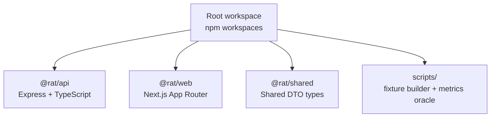

**Diagram sources**
- [package.json:1-31](file://package.json#L1-L31)

At the application level:

| Package | Role | Key Dependencies |
|---|---|---|
| `@rat/api` | REST API, ingestion pipeline, job queue, SQLite storage, Git CLI integration | Express, better-sqlite3, cors, multer, yauzl, zod |
| `@rat/web` | Dashboard UI, typed API client, SWR polling, charts | Next.js, React, SWR, Recharts |
| `@rat/shared` | Type-only DTOs shared between API and web | None (type-only package) |

**Section sources**
- [package.json:1-31](file://package.json#L1-L31)
- [apps/api/package.json:1-40](file://apps/api/package.json#L1-L40)
- [apps/web/package.json:1-28](file://apps/web/package.json#L1-L28)
- [packages/shared/package.json:1-12](file://packages/shared/package.json#L1-L12)

## Core Components
The core runtime starts by loading configuration, opening the SQLite database, creating services, recovering interrupted jobs, building the Express app, and listening for HTTP requests. On shutdown, it closes the server and database gracefully.

Key responsibilities:

- Configuration resolves environment variables, storage paths, upload limits, and timeouts.
- Database initialization enables WAL mode, NORMAL synchronous durability, foreign keys, and busy timeout before applying the schema.
- Services assemble the dependency graph: config, database, job store, in-process queue, and ingestion pipeline.
- Routes are mounted under `/api/repositories` and `/api/jobs`, with global error handling and a health endpoint.

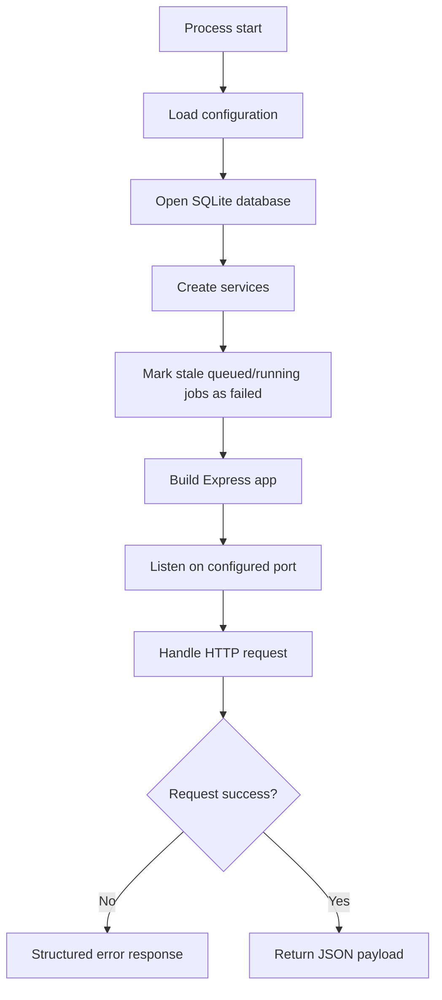

**Diagram sources**
- [apps/api/src/index.ts:6-42](file://apps/api/src/index.ts#L6-L42)
- [apps/api/src/app.ts:16-38](file://apps/api/src/app.ts#L16-L38)
- [apps/api/src/config.ts:49-66](file://apps/api/src/config.ts#L49-L66)
- [apps/api/src/db/database.ts:12-21](file://apps/api/src/db/database.ts#L12-L21)

**Section sources**
- [apps/api/src/index.ts:1-43](file://apps/api/src/index.ts#L1-L43)
- [apps/api/src/app.ts:1-39](file://apps/api/src/app.ts#L1-L39)
- [apps/api/src/config.ts:1-73](file://apps/api/src/config.ts#L1-L73)
- [apps/api/src/db/database.ts:1-23](file://apps/api/src/db/database.ts#L1-L23)
- [apps/api/src/services.ts:1-44](file://apps/api/src/services.ts#L1-L44)

## Architecture Overview
RAT follows a layered architecture:

- Presentation layer: Next.js pages and components render repository dashboards and consume the typed API client.
- API layer: Express routes validate inputs, enforce repository readiness, delegate to services, and return structured JSON payloads.
- Service layer: Ingestion pipeline, job store, and queue orchestrate long-running repository analysis.
- Storage layer: SQLite with WAL mode stores repositories, jobs, commits, file stats, author mappings, and directory indexes.
- External systems: Git CLI is invoked for cloning, validation, and streaming log/numstat analysis.

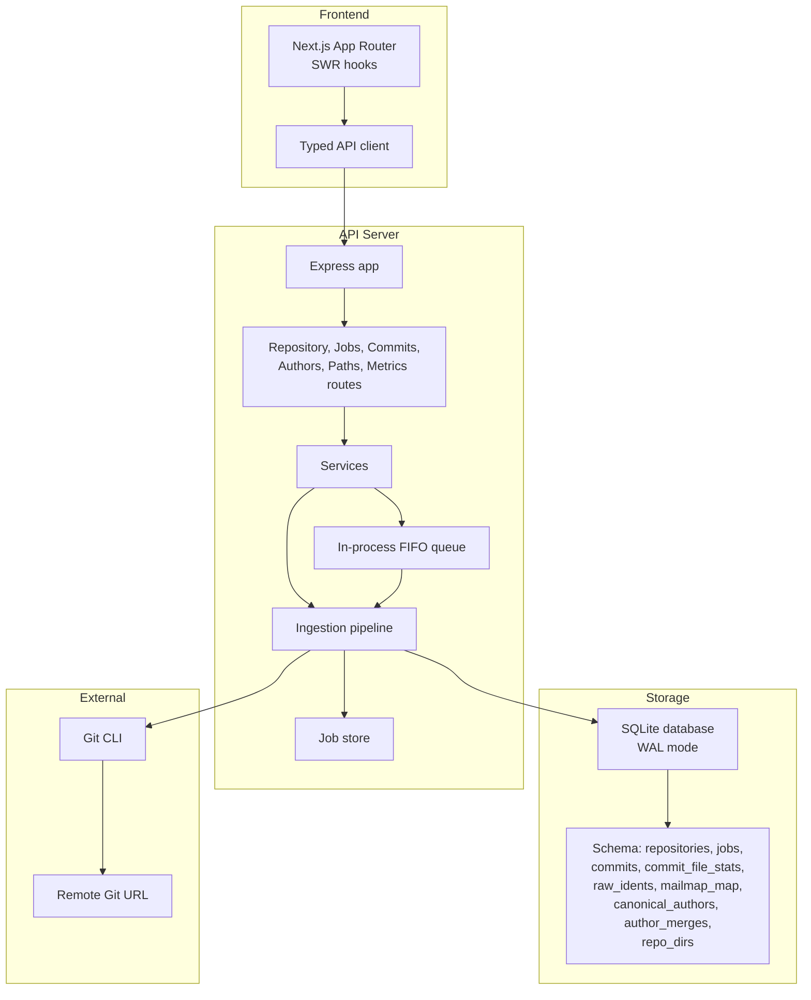

**Diagram sources**
- [apps/api/src/app.ts:16-38](file://apps/api/src/app.ts#L16-L38)
- [apps/api/src/services.ts:18-24](file://apps/api/src/services.ts#L18-L24)
- [apps/api/src/ingest/pipeline.ts:41-130](file://apps/api/src/ingest/pipeline.ts#L41-L130)
- [apps/api/src/jobs/queue.ts:15-53](file://apps/api/src/jobs/queue.ts#L15-L53)
- [apps/api/src/jobs/jobStore.ts:44-127](file://apps/api/src/jobs/jobStore.ts#L44-L127)
- [apps/api/src/db/schema.sql:5-105](file://apps/api/src/db/schema.sql#L5-L105)
- [apps/web/src/lib/api.ts:18-268](file://apps/web/src/lib/api.ts#L18-L268)

**Section sources**
- [README.md:176-239](file://README.md#L176-L239)
- [README.md:242-254](file://README.md#L242-L254)

## Detailed Component Analysis

### Monorepo and Technology Stack Decisions
The monorepo uses npm workspaces to co-locate the API, web app, and shared types. This keeps DTO contracts synchronized across TypeScript projects without runtime code sharing.

Technology decisions:

- Backend: Express for routing, better-sqlite3 for synchronous high-performance SQLite access, Zod for validation, multer for multipart uploads, yauzl for safe zip extraction.
- Frontend: Next.js 14 App Router for page routing, SWR for caching and polling, Recharts for charts, and a typed API client over REST.
- Shared types: Pure TypeScript definitions exported from `@rat/shared`; both apps import the same contract.

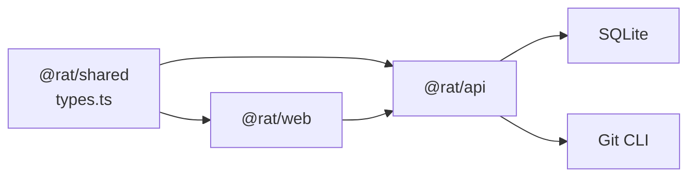

**Diagram sources**
- [packages/shared/src/types.ts:1-6](file://packages/shared/src/types.ts#L1-L6)
- [apps/api/package.json:14-23](file://apps/api/package.json#L14-L23)
- [apps/web/package.json:12-20](file://apps/web/package.json#L12-L20)

**Section sources**
- [package.json:1-31](file://package.json#L1-L31)
- [apps/api/package.json:1-40](file://apps/api/package.json#L1-L40)
- [apps/web/package.json:1-28](file://apps/web/package.json#L1-L28)
- [packages/shared/package.json:1-12](file://packages/shared/package.json#L1-L12)
- [packages/shared/src/types.ts:1-6](file://packages/shared/src/types.ts#L1-L6)

### API Architecture and Routing
The API exposes a health endpoint, repository lifecycle endpoints, job polling endpoints, commit and author listings, path discovery, and multiple metric endpoints. All repository-scoped resources live under `/api/repositories/:id`.

Routing structure:

- Health: `/api/health`
- Repositories: list, get, delete, upload, clone
- Jobs: poll by ID
- Commits: list with search and filters; per-commit stats
- Authors: resolved authors and raw idents
- Paths: all files and directories in history
- Metrics: repository, files, directories, authors, timeseries

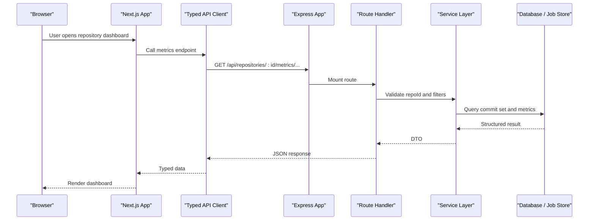

**Diagram sources**
- [apps/api/src/app.ts:16-38](file://apps/api/src/app.ts#L16-L38)
- [apps/web/src/lib/api.ts:122-268](file://apps/web/src/lib/api.ts#L122-L268)

**Section sources**
- [README.md:216-239](file://README.md#L216-L239)
- [apps/api/src/app.ts:1-39](file://apps/api/src/app.ts#L1-L39)

### Storage Layer: SQLite with WAL Mode
The storage layer uses SQLite with WAL mode and NORMAL synchronous durability. Foreign keys are enabled, busy timeout is configured, and the schema is applied at startup. The design centers around a single fact table `commit_file_stats` containing one row per file per commit, with derived metrics computed at query time.

Key tables:

| Table | Purpose |
|---|---|
| `repositories` | Repository metadata, source type, status, head SHA, commit count, timestamps |
| `jobs` | Ingestion job lifecycle, phase, progress, errors |
| `raw_idents` | Raw Git author identities |
| `commits` | Non-merge commits reachable from HEAD |
| `commit_file_stats` | Per-commit line changes per path |
| `mailmap_map` | Mailmap-resolved identity mapping |
| `canonical_authors` | Manual canonical author definitions |
| `author_merges` | Manual merges of raw idents into canonical authors |
| `repo_dirs` | Directory index for path navigation |

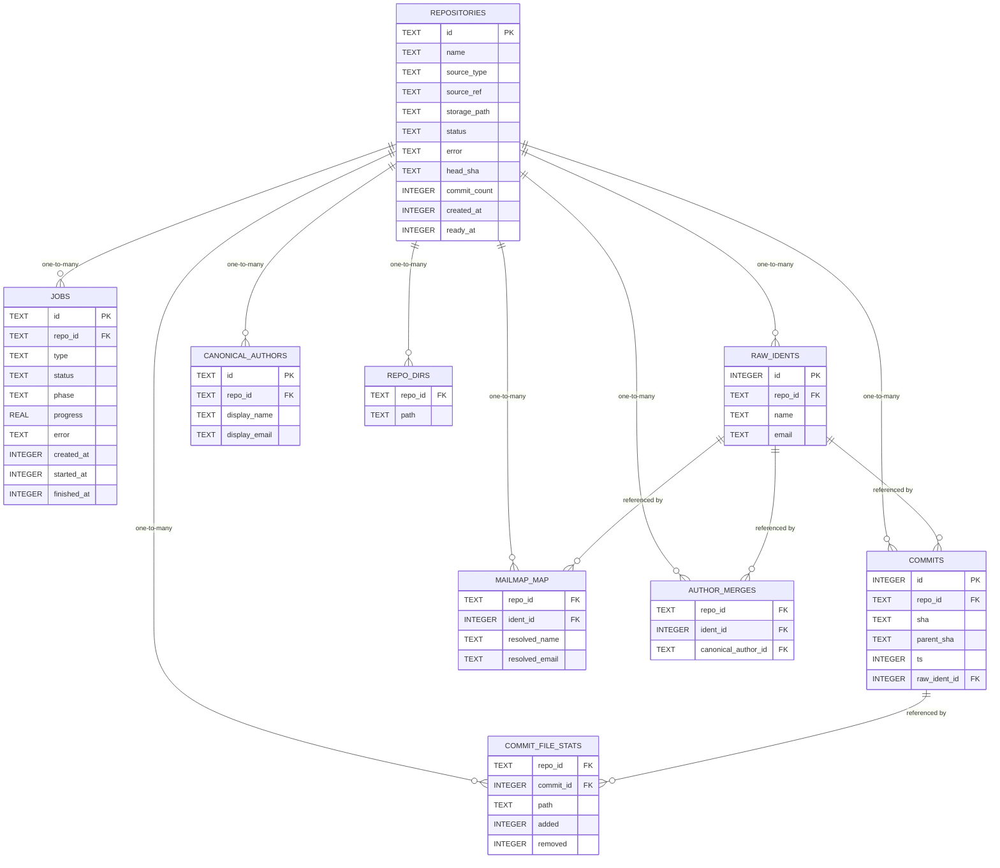

**Diagram sources**
- [apps/api/src/db/schema.sql:5-105](file://apps/api/src/db/schema.sql#L5-L105)

**Section sources**
- [apps/api/src/db/database.ts:7-21](file://apps/api/src/db/database.ts#L7-L21)
- [apps/api/src/db/schema.sql:1-106](file://apps/api/src/db/schema.sql#L1-L106)
- [apps/api/src/db/repoStore.ts:1-63](file://apps/api/src/db/repoStore.ts#L1-L63)
- [README.md:178-186](file://README.md#L178-L186)

### Ingestion Pipeline and Async Job Queue
The ingestion pipeline supports two sources:

- Zip upload: extracts a `.git` archive safely into a staging directory.
- Clone URL: mirrors a remote repository using Git CLI.

After source preparation, the pipeline validates the repository, streams Git log analysis, applies mailmap resolution, and finalizes the repository state. Jobs progress through phases: extracting/cloning → validating → analyzing → finalizing → complete.

The in-process FIFO queue runs one job at a time, keeping disk I/O and database writes predictable while the UI polls job status.

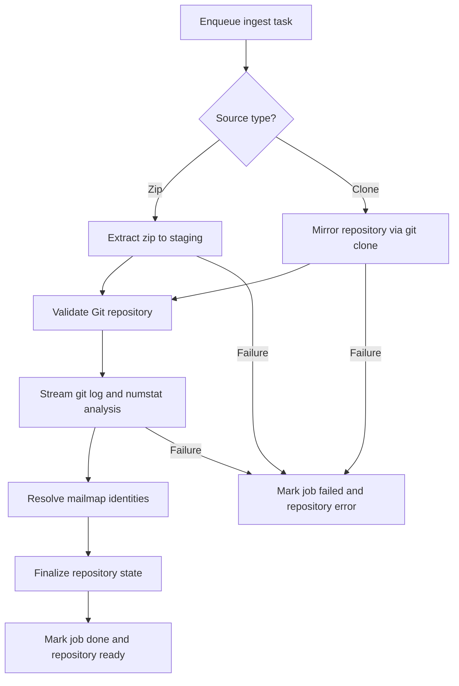

**Diagram sources**
- [apps/api/src/ingest/pipeline.ts:41-130](file://apps/api/src/ingest/pipeline.ts#L41-L130)
- [apps/api/src/jobs/queue.ts:15-53](file://apps/api/src/jobs/queue.ts#L15-L53)
- [apps/api/src/jobs/jobStore.ts:44-127](file://apps/api/src/jobs/jobStore.ts#L44-L127)

**Section sources**
- [apps/api/src/ingest/pipeline.ts:1-146](file://apps/api/src/ingest/pipeline.ts#L1-L146)
- [apps/api/src/jobs/queue.ts:1-55](file://apps/api/src/jobs/queue.ts#L1-L55)
- [apps/api/src/jobs/jobStore.ts:1-129](file://apps/api/src/jobs/jobStore.ts#L1-L129)
- [README.md:187-192](file://README.md#L187-L192)

### Git CLI Integration
Git CLI is used for:

- Cloning remote repositories into local mirror directories.
- Validating that the staged content is a proper Git repository.
- Streaming commit history and file change statistics during analysis.

The pipeline treats Git operations as external processes with configurable timeouts. Errors from cloning or validation surface through job status and repository error fields.

**Section sources**
- [README.md:23-23](file://README.md#L23-L23)
- [README.md:294-296](file://README.md#L294-L296)
- [apps/api/src/ingest/pipeline.ts:66-84](file://apps/api/src/ingest/pipeline.ts#L66-L84)

### Query-Time Metrics Engine
Metrics are not precomputed. Instead, the API computes them at query time from the `commit_file_stats` fact table and related metadata. Common filters include:

- Time range: half-open `[fromTs, toTs)`
- Explicit commit IDs
- Resolved author ID
- Path scope for files, directories, and timeseries

Metric families include:

- Repository-level growth, churn, modifications, frequency, rate, and commit-set size.
- File-level metrics with pagination and sorting.
- Directory subtree metrics with depth control.
- Author ownership based on churn share.
- Timeseries points grouped by day or week.

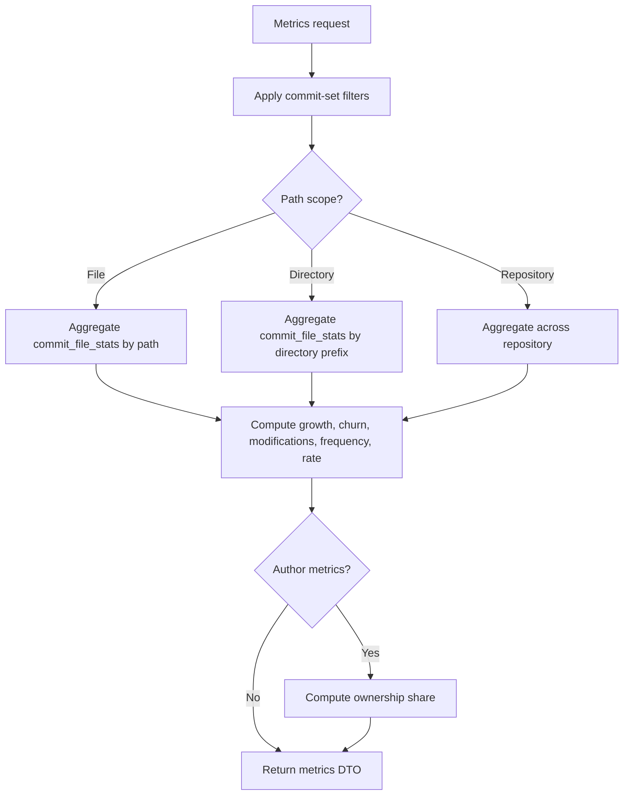

**Diagram sources**
- [packages/shared/src/types.ts:128-203](file://packages/shared/src/types.ts#L128-L203)
- [apps/web/src/lib/api.ts:220-267](file://apps/web/src/lib/api.ts#L220-L267)

**Section sources**
- [README.md:193-202](file://README.md#L193-L202)
- [packages/shared/src/types.ts:128-203](file://packages/shared/src/types.ts#L128-L203)

### Frontend Architecture: Next.js App Router, SWR, and Component Composition
The frontend is a Next.js 14 App Router application. It uses a typed API client built on top of `fetch` and XMLHttpRequest for multipart uploads. SWR handles data fetching, caching, and polling while repository ingestion is in progress.

Frontend responsibilities:

- Repository listing and selection.
- Ingest forms for zip upload and clone URL submission.
- Job progress polling.
- Metric cards, sortable file tables, directory breadcrumb drill-down, author tables, churn-over-time charts, and top-files charts.
- Consistent styling based on the GitHub-inspired design system.

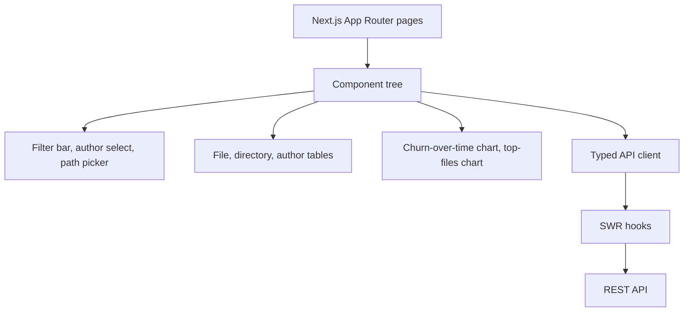

**Diagram sources**
- [apps/web/package.json:1-28](file://apps/web/package.json#L1-L28)
- [apps/web/src/lib/api.ts:18-268](file://apps/web/src/lib/api.ts#L18-L268)

**Section sources**
- [README.md:204-214](file://README.md#L204-L214)
- [apps/web/src/lib/api.ts:1-269](file://apps/web/src/lib/api.ts#L1-L269)

### Data Flow: Repository Ingestion Through Analysis to Metric Computation
The end-to-end flow connects user actions to persisted analysis results and queryable metrics:

1. User submits a zip or clone URL through the web dashboard.
2. The API creates a repository record and an ingestion job.
3. The in-process queue executes one ingestion task at a time.
4. The pipeline prepares the Git source, validates it, and streams analysis.
5. Analysis persists commits and file stats into SQLite.
6. Mailmap resolution and manual canonical author mappings improve author identity.
7. The repository is marked ready, and the UI polls until completion.
8. Metric endpoints compute results from the stored fact table.

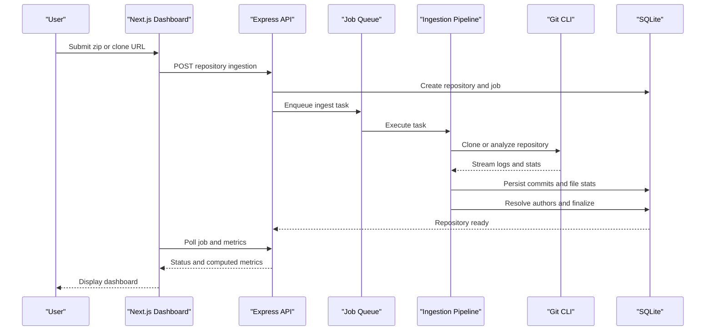

**Diagram sources**
- [apps/api/src/index.ts:6-42](file://apps/api/src/index.ts#L6-L42)
- [apps/api/src/ingest/pipeline.ts:41-130](file://apps/api/src/ingest/pipeline.ts#L41-L130)
- [apps/api/src/jobs/queue.ts:15-53](file://apps/api/src/jobs/queue.ts#L15-L53)
- [apps/api/src/jobs/jobStore.ts:44-127](file://apps/api/src/jobs/jobStore.ts#L44-L127)
- [apps/web/src/lib/api.ts:122-268](file://apps/web/src/lib/api.ts#L122-L268)

**Section sources**
- [README.md:60-69](file://README.md#L60-L69)
- [README.md:187-202](file://README.md#L187-L202)

## Dependency Analysis
The API depends on shared types, SQLite, Git CLI, and filesystem storage. The web app depends on shared types, Next.js, SWR, and Recharts. The shared package has no runtime dependencies and exists only to synchronize DTO shapes.

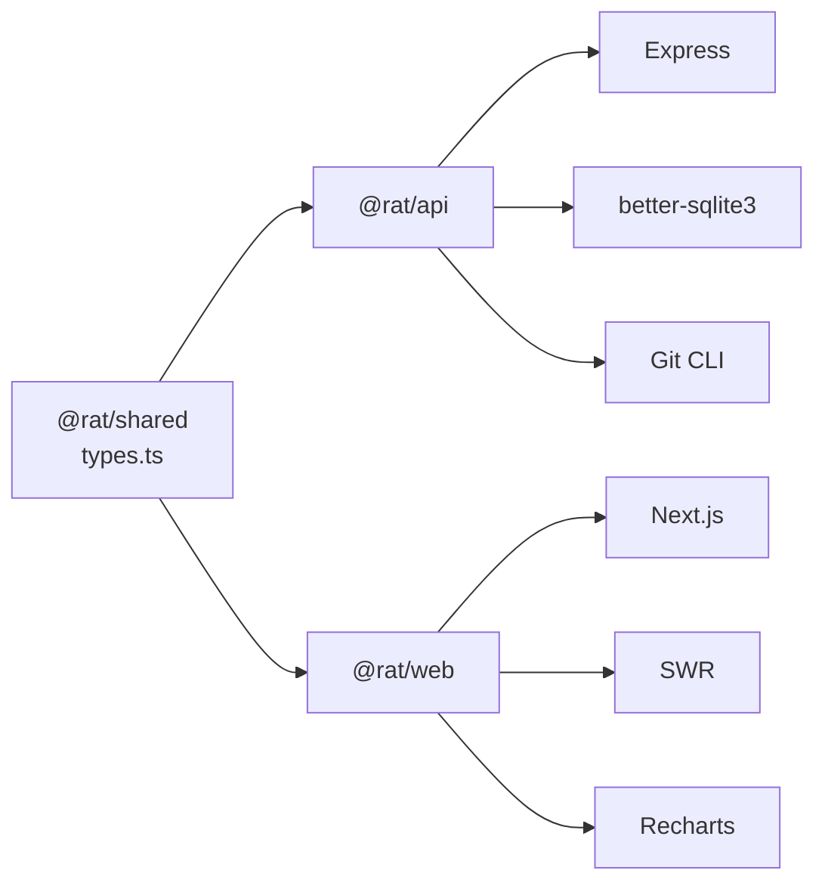

**Diagram sources**
- [apps/api/package.json:14-23](file://apps/api/package.json#L14-L23)
- [apps/web/package.json:12-20](file://apps/web/package.json#L12-L20)
- [packages/shared/src/types.ts:1-6](file://packages/shared/src/types.ts#L1-L6)

**Section sources**
- [apps/api/package.json:1-40](file://apps/api/package.json#L1-L40)
- [apps/web/package.json:1-28](file://apps/web/package.json#L1-L28)
- [packages/shared/package.json:1-12](file://packages/shared/package.json#L1-L12)

## Performance Considerations
The system prioritizes predictable ingestion performance and query flexibility:

- Ingestion concurrency is limited to one job to avoid contention on disk I/O and SQLite writes.
- SQLite uses WAL mode and NORMAL synchronous durability, which improves batch insert performance while retaining durability suitable for analysis workloads.
- Analysis streams Git output and batches inserts, reducing memory pressure compared to loading entire histories into memory.
- Metrics are computed at query time rather than materialized, trading repeated computation for simpler storage and up-to-date results.
- The API enforces a JSON body limit and configurable upload size limits to protect against large malformed payloads.

Scalability considerations:

- Single-process ingestion makes horizontal scaling of the API non-trivial; sharding by repository or adding a distributed queue would be required for multi-instance deployments.
- SQLite is appropriate for single-node deployments; moving to a concurrent database would require redesigning the ingestion writer and transaction strategy.
- Large repositories may still cause slow metric queries; indexing and query scoping help, but precomputed rollups could be introduced later.

**Section sources**
- [apps/api/src/jobs/queue.ts:1-6](file://apps/api/src/jobs/queue.ts#L1-L6)
- [apps/api/src/db/database.ts:7-18](file://apps/api/src/db/database.ts#L7-L18)
- [README.md:187-192](file://README.md#L187-L192)
- [apps/api/src/app.ts:16-24](file://apps/api/src/app.ts#L16-L24)

## Troubleshooting Guide
Common operational issues and their context:

- Native module build failures: `better-sqlite3` may require build tools or a prebuilt binary.
- Port conflicts: Configure `API_PORT` or run the web app on another port.
- Clone failures: Require outbound HTTPS access and a compatible Git CLI version; errors surface in job status.
- Zip rejection: The archive must contain a valid `.git` layout; working-tree zips without `.git` are rejected.
- Oracle configuration: The independent metrics oracle needs the correct `RAT_STORAGE_DIR` or explicit `--git-dir`.

Cross-cutting concerns:

- Errors are structured with codes such as `REPO_NOT_FOUND`, `REPO_NOT_READY`, `VALIDATION`, `UPLOAD_NOT_ZIP`, and `DELETE_ACTIVE_JOB`.
- The frontend wraps network failures and server errors in a typed `ApiError` carrying HTTP status and API code.
- Stale jobs are marked failed on server restart, and repositories stuck in processing are marked errored to prevent inconsistent state.

**Section sources**
- [README.md:278-302](file://README.md#L278-L302)
- [README.md:236-238](file://README.md#L236-L238)
- [apps/web/src/lib/api.ts:22-41](file://apps/web/src/lib/api.ts#L22-L41)
- [apps/api/src/jobs/jobStore.ts:110-126](file://apps/api/src/jobs/jobStore.ts#L110-L126)

## Conclusion
RAT’s architecture separates ingestion, persistence, and query-time analysis cleanly. The monorepo structure with shared TypeScript types ensures consistent API contracts between the Express backend and Next.js frontend. SQLite with WAL mode provides a simple, durable store for commit-level facts, while the ingestion pipeline and in-process queue keep repository analysis predictable. The frontend leverages SWR for responsive polling and component composition for a developer-focused dashboard. For larger-scale deployments, the current single-process ingestion model and SQLite-backed storage suggest clear upgrade paths toward distributed queues and more scalable databases, while preserving the query-time metrics approach unless materialization becomes necessary.