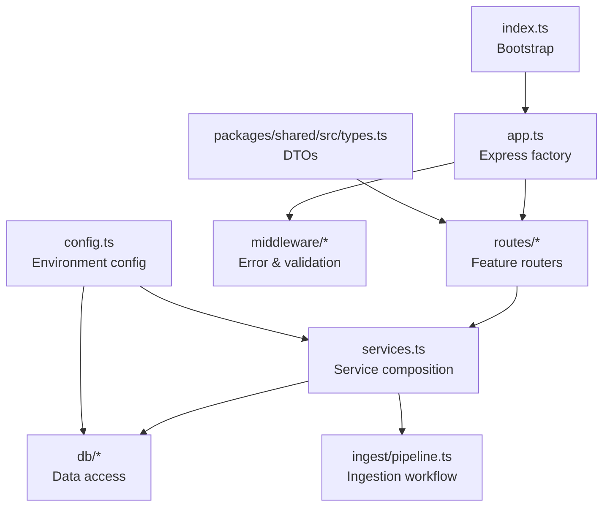
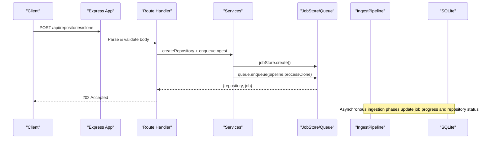
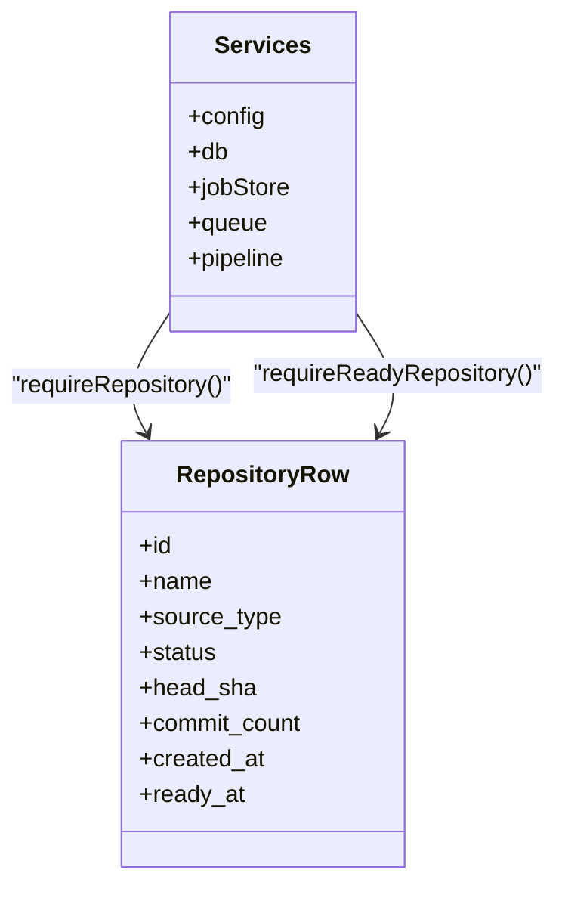
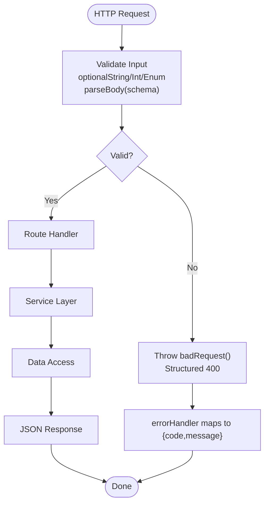
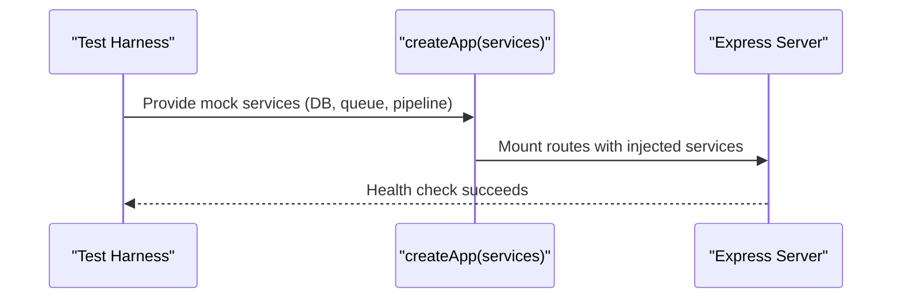
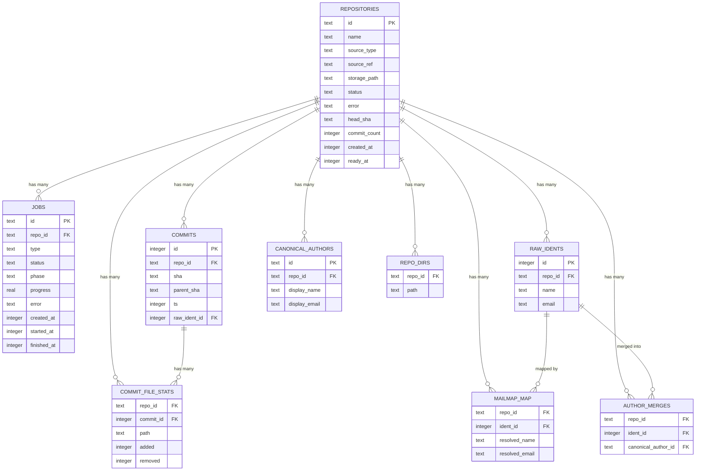
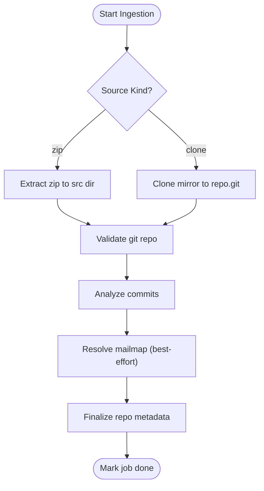
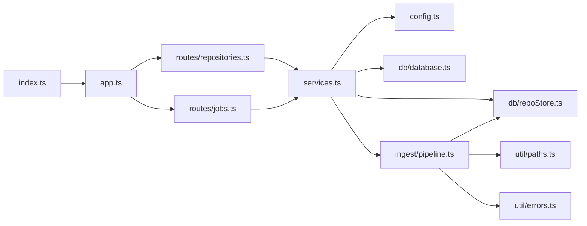
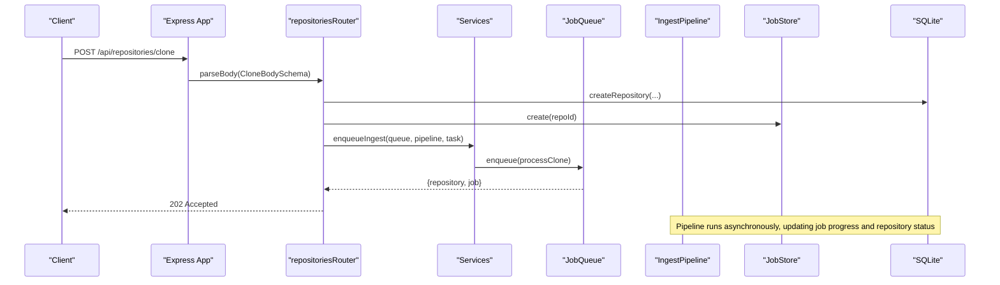

# Backend Architecture

<cite>
**Referenced Files in This Document**
- [index.ts](file://apps/api/src/index.ts)
- [app.ts](file://apps/api/src/app.ts)
- [services.ts](file://apps/api/src/services.ts)
- [config.ts](file://apps/api/src/config.ts)
- [errorHandler.ts](file://apps/api/src/middleware/errorHandler.ts)
- [validate.ts](file://apps/api/src/middleware/validate.ts)
- [repositories.ts](file://apps/api/src/routes/repositories.ts)
- [jobs.ts](file://apps/api/src/routes/jobs.ts)
- [database.ts](file://apps/api/src/db/database.ts)
- [repoStore.ts](file://apps/api/src/db/repoStore.ts)
- [schema.sql](file://apps/api/src/db/schema.sql)
- [pipeline.ts](file://apps/api/src/ingest/pipeline.ts)
- [errors.ts](file://apps/api/src/util/errors.ts)
- [paths.ts](file://apps/api/src/util/paths.ts)
- [types.ts](file://packages/shared/src/types.ts)
</cite>

## Table of Contents
1. [Introduction](#introduction)
2. [Project Structure](#project-structure)
3. [Core Components](#core-components)
4. [Architecture Overview](#architecture-overview)
5. [Detailed Component Analysis](#detailed-component-analysis)
6. [Dependency Analysis](#dependency-analysis)
7. [Performance Considerations](#performance-considerations)
8. [Security Considerations](#security-considerations)
9. [Configuration Management](#configuration-management)
10. [Request Lifecycle](#request-lifecycle)
11. [Troubleshooting Guide](#troubleshooting-guide)
12. [Conclusion](#conclusion)

## Introduction
This document describes the Express.js backend architecture for repository ingestion and analysis. It explains how the service layer orchestrates business logic, how middleware handles errors and validation, how dependency injection is used to bootstrap and test the application, and how requests flow from HTTP entry points through route handlers into services and data access layers. It also covers security considerations around input sanitization, file upload validation, and SQL injection prevention, as well as configuration management and environment-specific settings.

## Project Structure
The backend is organized by feature and concern:
- Entry point and bootstrap: index.ts
- Express app factory and global middleware: app.ts
- Service layer composition and shared helpers: services.ts
- Configuration loading and storage layout: config.ts
- Middleware for error handling and request validation: middleware/*
- Feature routes: routes/*
- Data access and schema: db/*
- Ingestion pipeline and job orchestration: ingest/*, jobs/*
- Utilities for errors and paths: util/*
- Shared DTO types between API and frontend: packages/shared/src/types.ts

**Diagram sources**
- [index.ts:1-43](file://apps/api/src/index.ts#L1-L43)
- [app.ts:1-39](file://apps/api/src/app.ts#L1-L39)
- [services.ts:1-44](file://apps/api/src/services.ts#L1-L44)
- [config.ts:1-73](file://apps/api/src/config.ts#L1-L73)
- [pipeline.ts:1-146](file://apps/api/src/ingest/pipeline.ts#L1-L146)
- [types.ts:1-226](file://packages/shared/src/types.ts#L1-L226)

**Section sources**
- [index.ts:1-43](file://apps/api/src/index.ts#L1-L43)
- [app.ts:1-39](file://apps/api/src/app.ts#L1-L39)
- [services.ts:1-44](file://apps/api/src/services.ts#L1-L44)
- [config.ts:1-73](file://apps/api/src/config.ts#L1-L73)
- [types.ts:1-226](file://packages/shared/src/types.ts#L1-L226)

## Core Components
- Service layer (services.ts): Creates and wires together configuration, database, job store, queue, and ingestion pipeline. Provides helpers like requireRepository and requireReadyRepository that enforce preconditions across modules.
- Express app (app.ts): Configures CORS, JSON parsing, health endpoint, mounts feature routers under /api, and installs not-found and error handlers.
- Bootstrap (index.ts): Loads configuration, opens the database, creates services, recovers interrupted jobs, starts the HTTP server, and handles graceful shutdown.
- Configuration (config.ts): Loads .env, resolves storage directories, sets timeouts and limits, and ensures required directories exist.
- Middleware: errorHandler.ts centralizes structured error responses; validate.ts provides Zod-based body parsing and query parameter helpers.
- Routes: repositories.ts implements repository ingestion (clone and zip upload), listing, detail, and deletion; jobs.ts exposes job status polling.
- Data access: database.ts initializes SQLite with WAL mode and applies schema.sql; repoStore.ts encapsulates repository CRUD and status transitions.
- Ingestion pipeline: pipeline.ts orchestrates source extraction/cloning, validation, commit analysis, mailmap resolution, and finalization, with progress tracking via job store.

**Section sources**
- [services.ts:1-44](file://apps/api/src/services.ts#L1-L44)
- [app.ts:1-39](file://apps/api/src/app.ts#L1-L39)
- [index.ts:1-43](file://apps/api/src/index.ts#L1-L43)
- [config.ts:1-73](file://apps/api/src/config.ts#L1-L73)
- [errorHandler.ts:1-63](file://apps/api/src/middleware/errorHandler.ts#L1-L63)
- [validate.ts:1-70](file://apps/api/src/middleware/validate.ts#L1-L70)
- [repositories.ts:1-166](file://apps/api/src/routes/repositories.ts#L1-L166)
- [jobs.ts:1-34](file://apps/api/src/routes/jobs.ts#L1-L34)
- [database.ts:1-23](file://apps/api/src/db/database.ts#L1-L23)
- [repoStore.ts:1-63](file://apps/api/src/db/repoStore.ts#L1-L63)
- [pipeline.ts:1-146](file://apps/api/src/ingest/pipeline.ts#L1-L146)

## Architecture Overview
The system follows a layered architecture:
- Presentation: Express routes handle HTTP requests and map inputs to service calls.
- Service layer: Composes domain operations using injected dependencies (DB, job store, queue, pipeline).
- Data access: Encapsulates SQLite queries and schema migrations.
- Background processing: Jobs are enqueued and processed asynchronously through the ingestion pipeline.

**Diagram sources**
- [app.ts:16-37](file://apps/api/src/app.ts#L16-L37)
- [repositories.ts:117-135](file://apps/api/src/routes/repositories.ts#L117-L135)
- [services.ts:18-24](file://apps/api/src/services.ts#L18-L24)
- [pipeline.ts:133-146](file://apps/api/src/ingest/pipeline.ts#L133-L146)

## Detailed Component Analysis

### Service Layer Pattern (services.ts)
The service layer centralizes cross-cutting concerns and composes module-specific services:
- Ensures storage directories exist.
- Creates job store bound to the database.
- Initializes an in-process job queue.
- Builds the ingestion pipeline with DB, config, and job store.
- Exposes helpers to fetch repositories with explicit error semantics.

**Diagram sources**
- [services.ts:9-44](file://apps/api/src/services.ts#L9-L44)

**Section sources**
- [services.ts:1-44](file://apps/api/src/services.ts#L1-L44)

### Middleware Architecture
- Error handling (errorHandler.ts): Centralized mapping of AppError, multer errors, and body-parser errors to structured JSON responses. Not-found handler returns 404 for unknown routes.
- Validation (validate.ts): Helpers for optional string/int/enum parameters, paging normalization, and Zod-based body parsing that throws structured bad request errors.

**Diagram sources**
- [errorHandler.ts:5-63](file://apps/api/src/middleware/errorHandler.ts#L5-L63)
- [validate.ts:1-70](file://apps/api/src/middleware/validate.ts#L1-L70)

**Section sources**
- [errorHandler.ts:1-63](file://apps/api/src/middleware/errorHandler.ts#L1-L63)
- [validate.ts:1-70](file://apps/api/src/middleware/validate.ts#L1-L70)

### Dependency Injection and Testing
- The Express app factory accepts a pre-built Services object, enabling tests to inject a temporary SQLite database and mocked services without touching the real filesystem or network.
- The bootstrap function constructs Services once at startup and passes it to createApp.

**Diagram sources**
- [app.ts:12-17](file://apps/api/src/app.ts#L12-L17)
- [index.ts:7-19](file://apps/api/src/index.ts#L7-L19)

**Section sources**
- [app.ts:12-17](file://apps/api/src/app.ts#L12-L17)
- [index.ts:7-19](file://apps/api/src/index.ts#L7-L19)

### Modular Organization
- routes/: Feature routers for authors, commits, jobs, metrics, paths, and repositories.
- storage: Managed via config.ts; reposDir and tmpDir created on startup.
- ingestion: Pipeline coordinates cloning, zip extraction, validation, analysis, and finalization.
- metrics: Metrics computation modules referenced by routes and pipeline.
- utilities: Errors and path helpers.

**Section sources**
- [config.ts:49-72](file://apps/api/src/config.ts#L49-L72)
- [pipeline.ts:41-131](file://apps/api/src/ingest/pipeline.ts#L41-L131)

### Data Access and Schema
- database.ts: Opens SQLite, enables WAL mode, foreign keys, busy timeout, and executes schema.sql.
- repoStore.ts: Typed functions for repository lifecycle and status transitions.
- schema.sql: Defines tables for repositories, jobs, raw idents, commits, file stats, mailmap, canonical authors, author merges, and directory cache, with indexes for performance.

**Diagram sources**
- [schema.sql:5-106](file://apps/api/src/db/schema.sql#L5-L106)

**Section sources**
- [database.ts:1-23](file://apps/api/src/db/database.ts#L1-L23)
- [repoStore.ts:1-63](file://apps/api/src/db/repoStore.ts#L1-L63)
- [schema.sql:1-106](file://apps/api/src/db/schema.sql#L1-L106)

### Ingestion Pipeline
The pipeline processes two source kinds:
- Zip upload: Extracts archive to a staging directory, validates git repo, analyzes commits, optionally resolves mailmap, and finalizes.
- URL clone: Clones a mirror, then performs the same validation, analysis, and finalization steps.

**Diagram sources**
- [pipeline.ts:41-131](file://apps/api/src/ingest/pipeline.ts#L41-L131)

**Section sources**
- [pipeline.ts:1-146](file://apps/api/src/ingest/pipeline.ts#L1-L146)

## Dependency Analysis
High-level dependencies among core modules:

**Diagram sources**
- [index.ts:1-43](file://apps/api/src/index.ts#L1-L43)
- [app.ts:1-39](file://apps/api/src/app.ts#L1-L39)
- [repositories.ts:1-166](file://apps/api/src/routes/repositories.ts#L1-L166)
- [jobs.ts:1-34](file://apps/api/src/routes/jobs.ts#L1-L34)
- [services.ts:1-44](file://apps/api/src/services.ts#L1-L44)
- [config.ts:1-73](file://apps/api/src/config.ts#L1-L73)
- [database.ts:1-23](file://apps/api/src/db/database.ts#L1-L23)
- [repoStore.ts:1-63](file://apps/api/src/db/repoStore.ts#L1-L63)
- [pipeline.ts:1-146](file://apps/api/src/ingest/pipeline.ts#L1-L146)
- [paths.ts:1-18](file://apps/api/src/util/paths.ts#L1-L18)
- [errors.ts:1-34](file://apps/api/src/util/errors.ts#L1-L34)

**Section sources**
- [services.ts:1-44](file://apps/api/src/services.ts#L1-L44)
- [pipeline.ts:1-146](file://apps/api/src/ingest/pipeline.ts#L1-L146)
- [repositories.ts:1-166](file://apps/api/src/routes/repositories.ts#L1-L166)

## Performance Considerations
- SQLite WAL mode and NORMAL synchronous setting improve throughput for batched inserts while maintaining durability.
- Foreign key constraints and indexes on frequently queried columns (commits, file stats, jobs) support efficient filtering and joins.
- Job queue decouples ingestion from HTTP requests, allowing asynchronous processing and better responsiveness.
- Progress updates during long-running tasks provide feedback without blocking the main thread.

[No sources needed since this section provides general guidance]

## Security Considerations
- Input validation: All request bodies are validated with Zod schemas; invalid inputs produce structured 400 errors. Query parameters are normalized and constrained.
- File upload validation: Only .zip files are accepted; size limits are enforced by multer and config; uploaded zips are staged and cleaned up after processing.
- Path safety: Repository names are sanitized for filesystem safety; deletion guards ensure removal occurs only within the configured repos directory.
- SQL injection prevention: All database interactions use parameterized statements via better-sqlite3 prepared statements.
- Error exposure: Only generic messages are exposed to clients; internal stack traces are not returned.

**Section sources**
- [validate.ts:1-70](file://apps/api/src/middleware/validate.ts#L1-L70)
- [repositories.ts:39-49](file://apps/api/src/routes/repositories.ts#L39-L49)
- [repositories.ts:84-115](file://apps/api/src/routes/repositories.ts#L84-L115)
- [repositories.ts:143-161](file://apps/api/src/routes/repositories.ts#L143-L161)
- [repoStore.ts:25-46](file://apps/api/src/db/repoStore.ts#L25-L46)
- [errorHandler.ts:18-62](file://apps/api/src/middleware/errorHandler.ts#L18-L62)

## Configuration Management
- Environment variables:
  - API_PORT: HTTP port (default 4000).
  - RAT_STORAGE_DIR: Absolute or relative storage root (defaults to ./storage).
  - MAX_UPLOAD_MB: Maximum upload size in MB (converted to bytes).
  - CLONE_TIMEOUT_MS: Timeout for git clone operations.
- Storage layout:
  - storageDir: Root storage directory.
  - reposDir: Per-repository storage.
  - tmpDir: Staging area for uploads.
  - dbPath: SQLite database file.
- Directory initialization: ensureStorageDirs creates reposDir and tmpDir on startup.

**Section sources**
- [config.ts:49-72](file://apps/api/src/config.ts#L49-L72)

## Request Lifecycle
End-to-end flow for repository cloning:

**Diagram sources**
- [repositories.ts:117-135](file://apps/api/src/routes/repositories.ts#L117-L135)
- [services.ts:18-24](file://apps/api/src/services.ts#L18-L24)
- [pipeline.ts:133-146](file://apps/api/src/ingest/pipeline.ts#L133-L146)

**Section sources**
- [repositories.ts:117-135](file://apps/api/src/routes/repositories.ts#L117-L135)
- [services.ts:18-24](file://apps/api/src/services.ts#L18-L24)
- [pipeline.ts:133-146](file://apps/api/src/ingest/pipeline.ts#L133-L146)

## Troubleshooting Guide
- 404 Not Found: Unknown routes return structured NOT_FOUND responses via notFoundHandler.
- 400 Bad Request: Validation failures from Zod or query parameter helpers throw structured BAD_REQUEST errors.
- 409 Conflict: Attempting to delete a repository with an active ingestion job triggers CONFLICT.
- 413 Payload Too Large: Multer enforces MAX_UPLOAD_MB; exceeding the limit yields UPLOAD_TOO_LARGE.
- Internal Server Error: Unhandled exceptions are logged and mapped to INTERNAL with a generic message.

Operational checks:
- Health endpoint: GET /api/health returns service status and timestamp.
- Job polling: GET /api/jobs/:id returns ingestion job status and progress.

**Section sources**
- [errorHandler.ts:5-63](file://apps/api/src/middleware/errorHandler.ts#L5-L63)
- [repositories.ts:143-161](file://apps/api/src/routes/repositories.ts#L143-L161)
- [app.ts:22-24](file://apps/api/src/app.ts#L22-L24)
- [jobs.ts:22-33](file://apps/api/src/routes/jobs.ts#L22-L33)

## Conclusion
The backend uses a clear separation of concerns with a service layer that composes dependencies, robust middleware for validation and error handling, and an asynchronous ingestion pipeline backed by a job queue. Configuration is centralized and environment-driven, and security is enforced through strict input validation, safe filesystem operations, and parameterized SQL. The design supports testing via dependency injection and scales ingestion workloads independently of the HTTP surface.