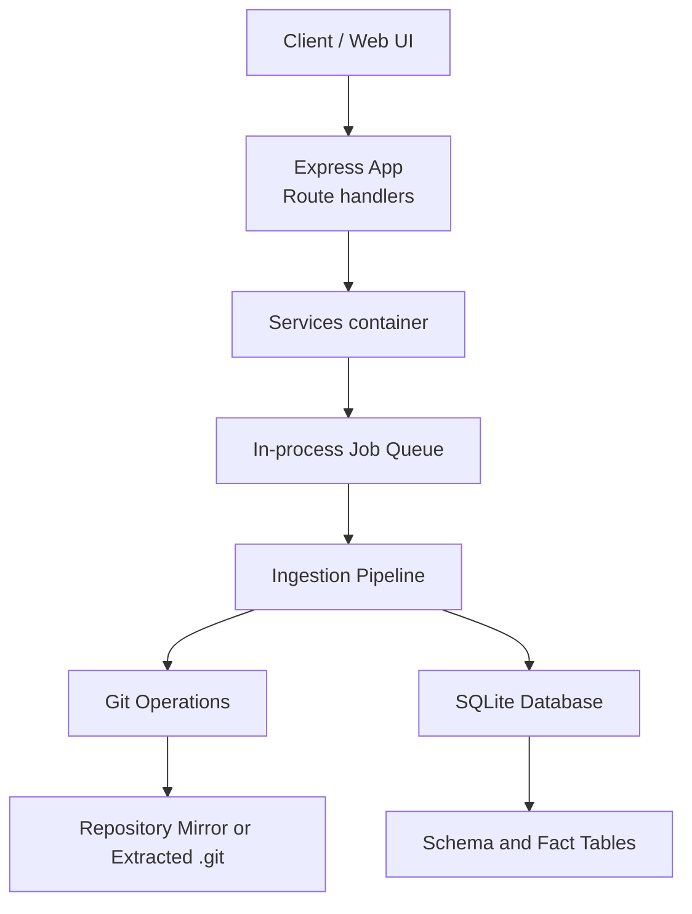
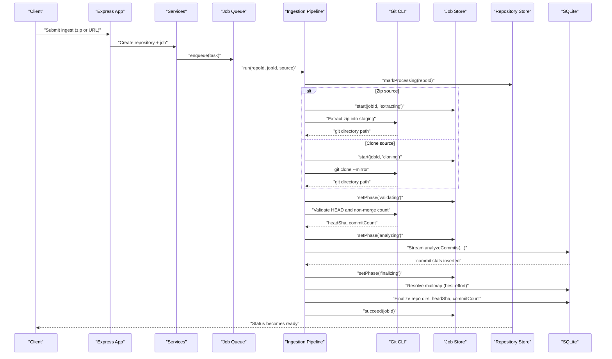
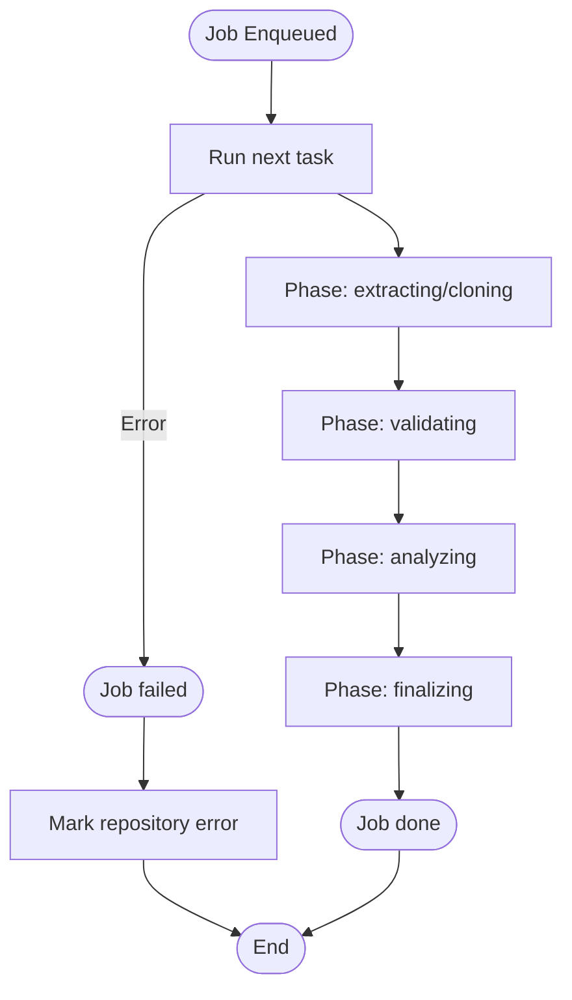
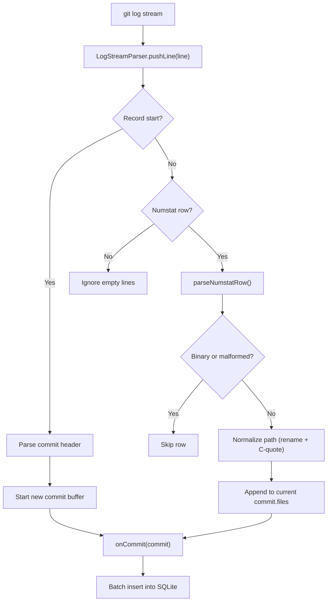
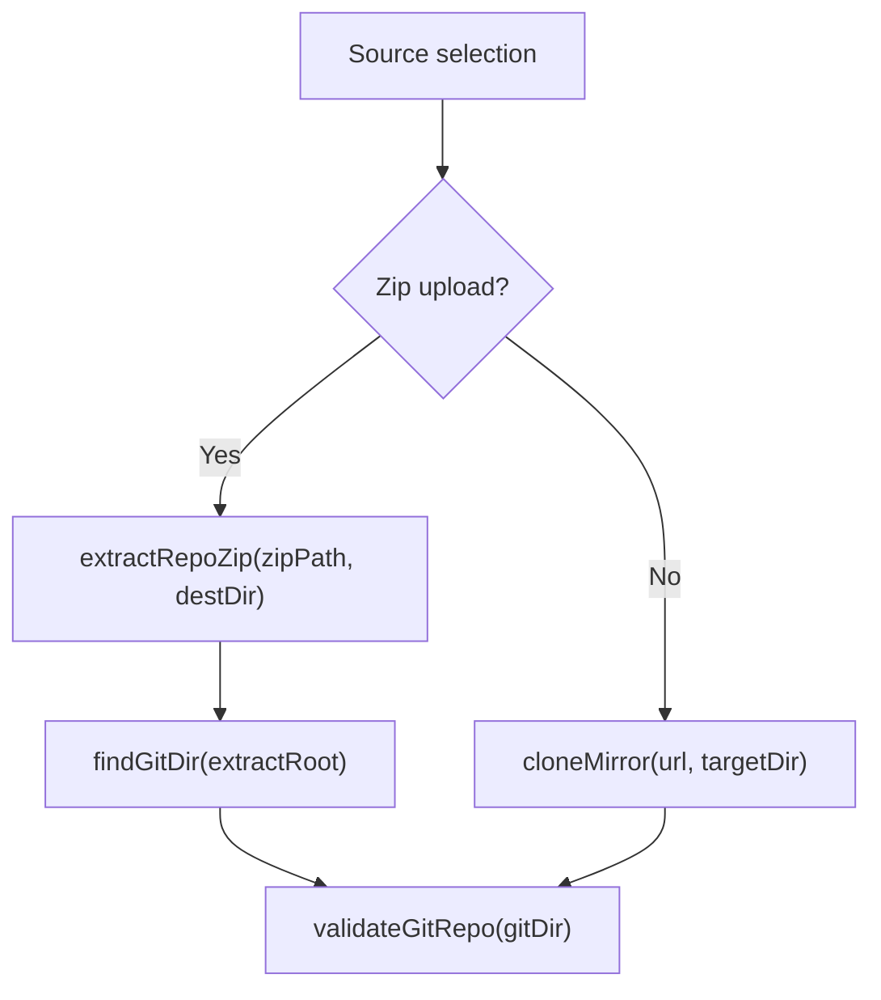
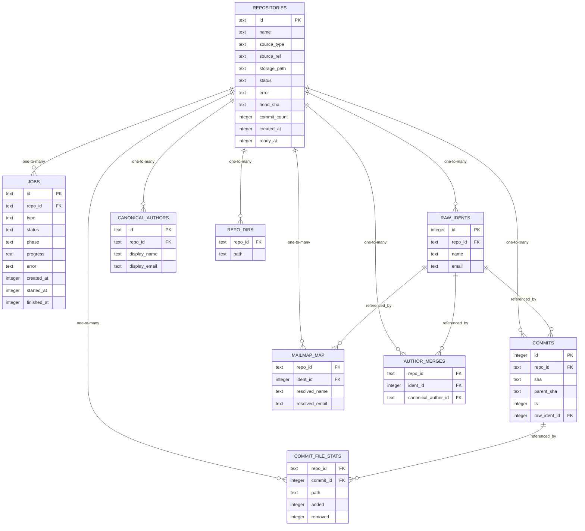
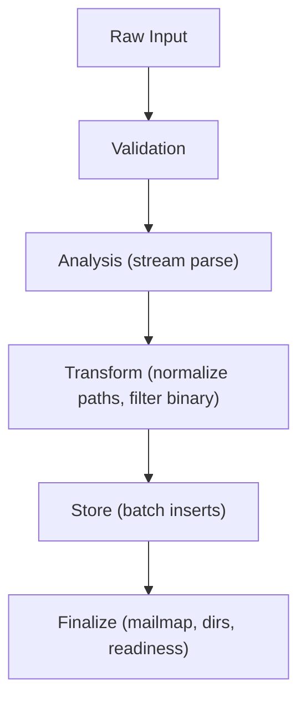
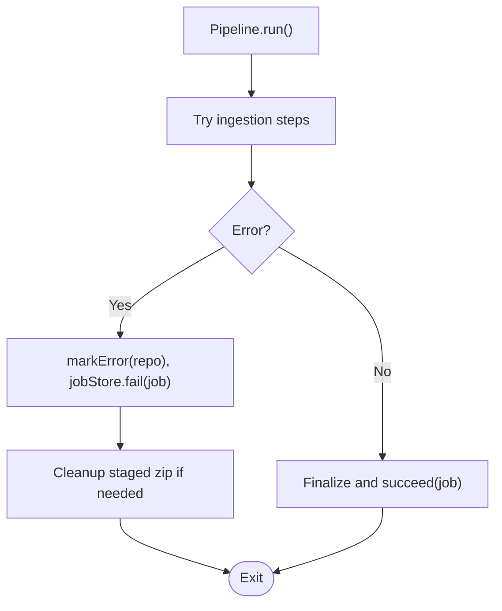
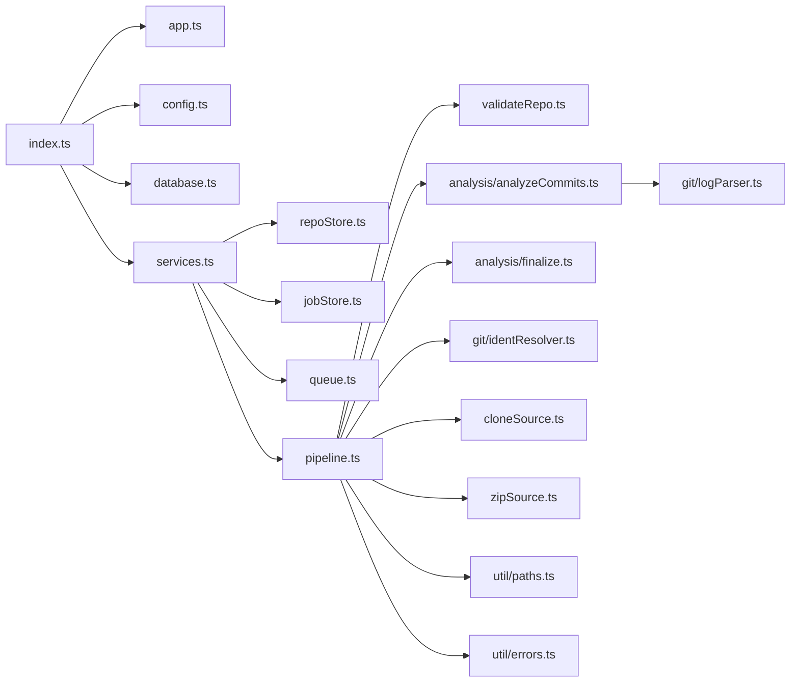

# Data Flow Architecture

<cite>
**Referenced Files in This Document**
- [index.ts](file://apps/api/src/index.ts)
- [app.ts](file://apps/api/src/app.ts)
- [config.ts](file://apps/api/src/config.ts)
- [services.ts](file://apps/api/src/services.ts)
- [database.ts](file://apps/api/src/db/database.ts)
- [schema.sql](file://apps/api/src/db/schema.sql)
- [repoStore.ts](file://apps/api/src/db/repoStore.ts)
- [jobStore.ts](file://apps/api/src/jobs/jobStore.ts)
- [queue.ts](file://apps/api/src/jobs/queue.ts)
- [pipeline.ts](file://apps/api/src/ingest/pipeline.ts)
- [cloneSource.ts](file://apps/api/src/ingest/cloneSource.ts)
- [zipSource.ts](file://apps/api/src/ingest/zipSource.ts)
- [validateRepo.ts](file://apps/api/src/ingest/validateRepo.ts)
- [logParser.ts](file://apps/api/src/git/logParser.ts)
</cite>

## Table of Contents
1. [Introduction](#introduction)
2. [Project Structure](#project-structure)
3. [Core Components](#core-components)
4. [Architecture Overview](#architecture-overview)
5. [Detailed Component Analysis](#detailed-component-analysis)
6. [Dependency Analysis](#dependency-analysis)
7. [Performance Considerations](#performance-considerations)
8. [Troubleshooting Guide](#troubleshooting-guide)
9. [Conclusion](#conclusion)

## Introduction
This document explains RAT’s data flow architecture from repository ingestion through analysis to query-time metric computation. It covers the asynchronous job processing workflow, streaming git log parsing, SQLite fact table design, data transformation stages, consistency and backup considerations, caching strategies, performance optimizations for large repositories, and error recovery mechanisms.

## Project Structure
RAT is an Express + TypeScript API backed by SQLite, with an in-process FIFO queue driving ingestion jobs. The web dashboard polls job status and renders metrics computed at query time from a normalized fact table.

**Diagram sources**
- [app.ts:16-37](file://apps/api/src/app.ts#L16-L37)
- [services.ts:18-23](file://apps/api/src/services.ts#L18-L23)
- [queue.ts:15-54](file://apps/api/src/jobs/queue.ts#L15-L54)
- [pipeline.ts:41-130](file://apps/api/src/ingest/pipeline.ts#L41-L130)
- [database.ts:12-21](file://apps/api/src/db/database.ts#L12-L21)
- [schema.sql:5-105](file://apps/api/src/db/schema.sql#L5-L105)

**Section sources**
- [index.ts:7-42](file://apps/api/src/index.ts#L7-L42)
- [app.ts:16-37](file://apps/api/src/app.ts#L16-L37)
- [config.ts:49-66](file://apps/api/src/config.ts#L49-L66)

## Core Components
- Configuration and bootstrap: loads environment variables, creates storage directories, opens the database, builds services, starts the HTTP server, and handles graceful shutdown.
- Services container: wires configuration, database, job store, queue, and ingestion pipeline; provides helpers to require a repository and enforce readiness.
- In-process queue: single-consumer FIFO queue that serializes ingestion tasks to keep disk I/O and database writes predictable.
- Ingestion pipeline: orchestrates zip extraction or mirror cloning, validation, commit analysis, mailmap resolution, and finalization; updates job progress and repository status.
- Git operations: safe clone mirroring with progress mapping and streaming log parsing with rename handling and C-quote unescaping.
- Persistence layer: SQLite with WAL mode, foreign keys enabled, and a schema optimized for query-time metric calculations.

**Section sources**
- [index.ts:7-42](file://apps/api/src/index.ts#L7-L42)
- [services.ts:18-43](file://apps/api/src/services.ts#L18-L43)
- [queue.ts:15-54](file://apps/api/src/jobs/queue.ts#L15-L54)
- [pipeline.ts:41-130](file://apps/api/src/ingest/pipeline.ts#L41-L130)
- [database.ts:12-21](file://apps/api/src/db/database.ts#L12-L21)

## Architecture Overview
The ingestion pipeline runs asynchronously within a single worker. Each repository has one active job at a time. Progress is persisted per phase so the UI can poll and render accurate status.

**Diagram sources**
- [pipeline.ts:44-124](file://apps/api/src/ingest/pipeline.ts#L44-L124)
- [jobStore.ts:44-127](file://apps/api/src/jobs/jobStore.ts#L44-L127)
- [repoStore.ts:48-57](file://apps/api/src/db/repoStore.ts#L48-L57)
- [cloneSource.ts:41-63](file://apps/api/src/ingest/cloneSource.ts#L41-L63)
- [zipSource.ts:202-209](file://apps/api/src/ingest/zipSource.ts#L202-L209)
- [validateRepo.ts:15-41](file://apps/api/src/ingest/validateRepo.ts#L15-L41)

## Detailed Component Analysis

### Asynchronous Job Processing and Progress Tracking
- Jobs are created per repository and enqueued into a single-consumer FIFO queue.
- The queue ensures only one task runs at a time, preventing contention on disk and SQLite.
- Job state includes status, phase, and progress; phases include extracting/cloning, validating, analyzing, and finalizing.
- On server restart, stale queued or running jobs are marked failed, and repositories stuck in queued/processing are set to error with actionable guidance.

**Diagram sources**
- [queue.ts:15-54](file://apps/api/src/jobs/queue.ts#L15-L54)
- [jobStore.ts:44-127](file://apps/api/src/jobs/jobStore.ts#L44-L127)
- [pipeline.ts:44-124](file://apps/api/src/ingest/pipeline.ts#L44-L124)

**Section sources**
- [queue.ts:15-54](file://apps/api/src/jobs/queue.ts#L15-L54)
- [jobStore.ts:44-127](file://apps/api/src/jobs/jobStore.ts#L44-L127)
- [pipeline.ts:44-124](file://apps/api/src/ingest/pipeline.ts#L44-L124)

### Streaming Git Log Parsing and Commit Analysis
- The analyzer streams `git log` output using a custom line-based parser.
- Each record begins with a special delimiter and contains commit metadata followed by numstat rows until the next record.
- Binary rows are skipped; rename-only changes produce no rows; deleted files are recorded as zero additions and removals on the deleted path.
- Renames are attributed to the new path, supporting both arrow syntax and brace syntax, with C-quote unescaping.
- Commits are batch-inserted into SQLite during streaming to avoid memory growth.

**Diagram sources**
- [logParser.ts:172-202](file://apps/api/src/git/logParser.ts#L172-L202)
- [logParser.ts:97-155](file://apps/api/src/git/logParser.ts#L97-L155)
- [logParser.ts:47-90](file://apps/api/src/git/logParser.ts#L47-L90)

**Section sources**
- [logParser.ts:1-203](file://apps/api/src/git/logParser.ts#L1-L203)

### Repository Ingestion Sources
- Zip ingestion:
  - Streams entries from the uploaded archive.
  - Validates entry names, skips symlinks, caps total uncompressed size, and rejects oversized archives.
  - Locates a usable `.git` directory or bare repository layout up to depth three.
- Clone ingestion:
  - Performs a full mirror clone (`git clone --mirror`) to preserve all refs and history.
  - Parses `git clone --progress` stderr lines to map coarse progress across counting, compressing, receiving, and resolving stages.

**Diagram sources**
- [zipSource.ts:27-127](file://apps/api/src/ingest/zipSource.ts#L27-L127)
- [zipSource.ts:161-209](file://apps/api/src/ingest/zipSource.ts#L161-L209)
- [cloneSource.ts:41-63](file://apps/api/src/ingest/cloneSource.ts#L41-L63)
- [validateRepo.ts:15-41](file://apps/api/src/ingest/validateRepo.ts#L15-L41)

**Section sources**
- [zipSource.ts:27-209](file://apps/api/src/ingest/zipSource.ts#L27-L209)
- [cloneSource.ts:41-63](file://apps/api/src/ingest/cloneSource.ts#L41-L63)
- [validateRepo.ts:15-41](file://apps/api/src/ingest/validateRepo.ts#L15-L41)

### SQLite Fact Table Design and Query-Time Metrics
- The core fact table stores one row per file per commit with added and removed line counts.
- Primary key is `(commit_id, path)` without ROWID for efficient lookups.
- Supporting tables include repositories, jobs, raw idents, commits, mailmap mappings, canonical authors, author merges, and derived directory paths.
- Indexes optimize queries by repository, timestamp, author identity, file path, and commit.
- Metrics such as growth, churn, modifications, frequency, rate, and ownership are computed at query time over this fact table.

**Diagram sources**
- [schema.sql:5-105](file://apps/api/src/db/schema.sql#L5-L105)

**Section sources**
- [schema.sql:5-105](file://apps/api/src/db/schema.sql#L5-L105)

### Data Transformation Stages
- Raw input:
  - Zip archive containing a `.git` directory or bare repository layout.
  - Remote repository URL mirrored via `git clone --mirror`.
- Validation:
  - HEAD resolves and there is at least one non-merge commit.
- Analysis:
  - Stream `git log` with numstat and custom format.
  - Parse commit headers and numstat rows; skip binary and rename-only rows.
  - Normalize paths for renames and C-quoting.
  - Batch-insert commit-file stats into SQLite.
- Finalization:
  - Best-effort mailmap resolution to build canonical identities.
  - Persist directory tree and update repository readiness.

**Diagram sources**
- [pipeline.ts:44-124](file://apps/api/src/ingest/pipeline.ts#L44-L124)
- [validateRepo.ts:15-41](file://apps/api/src/ingest/validateRepo.ts#L15-L41)
- [logParser.ts:172-202](file://apps/api/src/git/logParser.ts#L172-L202)

**Section sources**
- [pipeline.ts:44-124](file://apps/api/src/ingest/pipeline.ts#L44-L124)
- [validateRepo.ts:15-41](file://apps/api/src/ingest/validateRepo.ts#L15-L41)
- [logParser.ts:172-202](file://apps/api/src/git/logParser.ts#L172-L202)

### Data Consistency, Transaction Management, and Backup Strategies
- Database configuration:
  - WAL journal mode for concurrent reads and fast batched inserts.
  - NORMAL synchronous setting balances durability and throughput.
  - Foreign keys enforced to maintain referential integrity.
  - Busy timeout configured to handle transient lock contention.
- Transaction management:
  - The analyzer batches inserts per transaction to reduce overhead while streaming.
- Backup strategy:
  - Because the database uses WAL, consistent backups should copy both the main database file and its WAL file atomically, or use a tool that supports SQLite WAL snapshots.
  - The repository mirrors under the storage directory should be included in backups if long-term analysis reproducibility is required.

**Section sources**
- [database.ts:12-21](file://apps/api/src/db/database.ts#L12-L21)
- [schema.sql:101-105](file://apps/api/src/db/schema.sql#L101-L105)

### Caching Mechanisms and Performance Optimizations
- Directory cache:
  - A derived table stores every directory path that ever existed in the history to speed up path-scoped queries and navigation.
- Indexes:
  - Indexes on commits by repository and timestamp, on raw idents, on file stats by repository and path, and on jobs by repository support common query patterns.
- Streaming and batching:
  - Streaming git log avoids loading entire histories into memory.
  - Batched inserts reduce transaction overhead during analysis.
- Concurrency control:
  - Single-consumer queue prevents resource contention during heavy I/O and analysis.

**Section sources**
- [schema.sql:93-105](file://apps/api/src/db/schema.sql#L93-L105)
- [queue.ts:15-54](file://apps/api/src/jobs/queue.ts#L15-L54)
- [logParser.ts:172-202](file://apps/api/src/git/logParser.ts#L172-L202)

### Error Recovery and Retry Mechanisms
- Pipeline-level error handling:
  - Errors during ingestion mark the repository as errored and fail the job with a structured message.
  - Uploaded zips are cleaned up after processing regardless of success or failure.
- Mailmap resolution:
  - Best-effort; failures are logged and do not abort the pipeline.
- Server restart resilience:
  - On startup, stale jobs are marked failed and repositories stuck in queued/processing are set to error with instructions to delete and re-ingest.
- Queue robustness:
  - Task rejections are swallowed to prevent breaking the queue; tasks persist their own errors.

**Diagram sources**
- [pipeline.ts:44-124](file://apps/api/src/ingest/pipeline.ts#L44-L124)
- [jobStore.ts:110-127](file://apps/api/src/jobs/jobStore.ts#L110-L127)
- [queue.ts:28-36](file://apps/api/src/jobs/queue.ts#L28-L36)

**Section sources**
- [pipeline.ts:44-124](file://apps/api/src/ingest/pipeline.ts#L44-L124)
- [jobStore.ts:110-127](file://apps/api/src/jobs/jobStore.ts#L110-L127)
- [queue.ts:28-36](file://apps/api/src/jobs/queue.ts#L28-L36)

## Dependency Analysis
The following diagram shows how the bootstrap layers depend on each other and how the ingestion pipeline composes lower-level components.

**Diagram sources**
- [index.ts:1-10](file://apps/api/src/index.ts#L1-L10)
- [app.ts:1-10](file://apps/api/src/app.ts#L1-L10)
- [config.ts:1-11](file://apps/api/src/config.ts#L1-L11)
- [database.ts:1-4](file://apps/api/src/db/database.ts#L1-L4)
- [services.ts:1-7](file://apps/api/src/services.ts#L1-L7)
- [pipeline.ts:1-14](file://apps/api/src/ingest/pipeline.ts#L1-L14)
- [logParser.ts:1-19](file://apps/api/src/git/logParser.ts#L1-L19)

**Section sources**
- [index.ts:1-10](file://apps/api/src/index.ts#L1-L10)
- [services.ts:1-23](file://apps/api/src/services.ts#L1-L23)
- [pipeline.ts:1-14](file://apps/api/src/ingest/pipeline.ts#L1-L14)

## Performance Considerations
- Use WAL mode and NORMAL synchronous settings to balance write throughput and durability.
- Stream git log output to avoid high memory usage on large histories.
- Batch inserts to reduce transaction overhead during analysis.
- Keep ingestion concurrency at one to stabilize disk I/O and database contention.
- Leverage indexes on timestamps, paths, and identifiers for faster filtering and aggregation.
- Cache directory paths to accelerate path-scoped queries and navigation.

[No sources needed since this section provides general guidance]

## Troubleshooting Guide
- If ingestion fails, check the job’s error field and repository status; the pipeline marks repositories as errored and jobs as failed when exceptions occur.
- For clone failures, inspect the last few stderr lines captured by the clone progress handler; network connectivity and git version requirements apply.
- For zip issues, ensure the archive contains a full `.git` directory or a bare repository layout; symlinks are skipped and oversized expansions are rejected.
- On server restart, stale jobs are marked failed; delete and re-ingest repositories stuck in queued/processing.

**Section sources**
- [pipeline.ts:114-124](file://apps/api/src/ingest/pipeline.ts#L114-L124)
- [cloneSource.ts:50-63](file://apps/api/src/ingest/cloneSource.ts#L50-L63)
- [zipSource.ts:161-209](file://apps/api/src/ingest/zipSource.ts#L161-L209)
- [jobStore.ts:110-127](file://apps/api/src/jobs/jobStore.ts#L110-L127)

## Conclusion
RAT implements a robust, streaming-first data pipeline that ingests repositories safely, validates them early, analyzes history efficiently, and computes metrics at query time from a normalized SQLite fact table. The in-process queue guarantees predictable resource usage, while WAL mode, batching, and targeted indexes provide strong performance characteristics. Error handling and restart resilience ensure operational reliability, and best-effort mailmap resolution preserves author identity quality without blocking the pipeline.