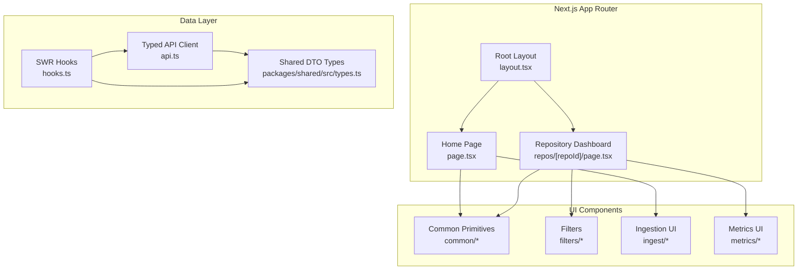
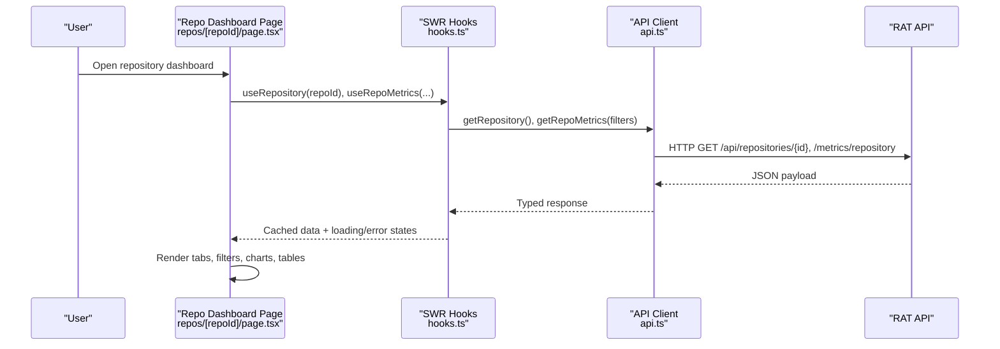
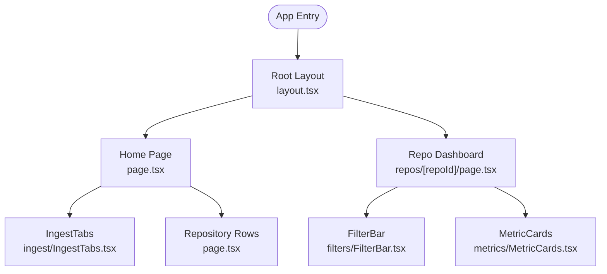
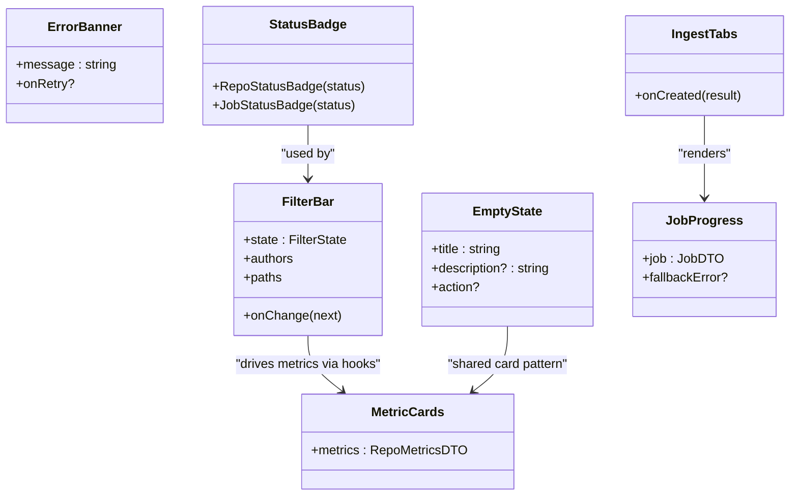
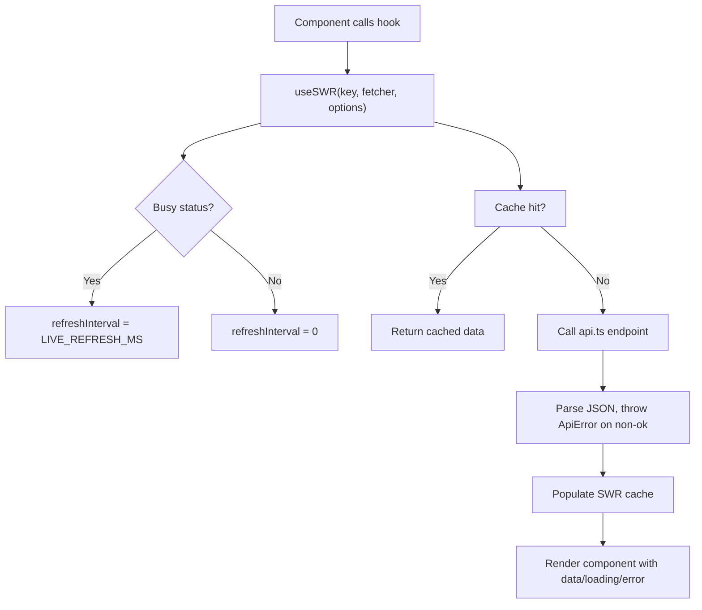
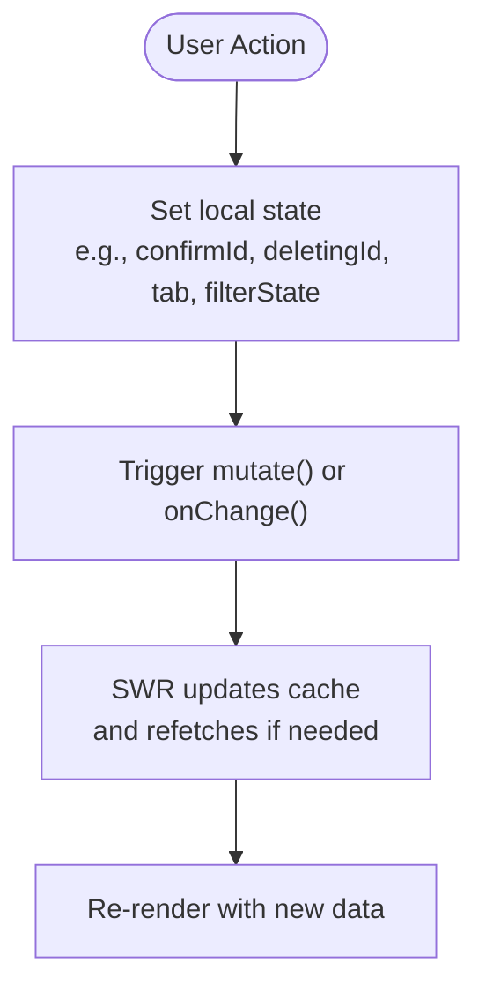
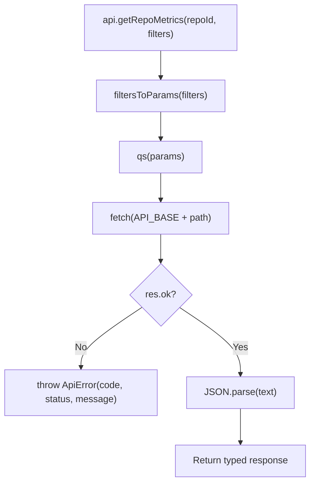
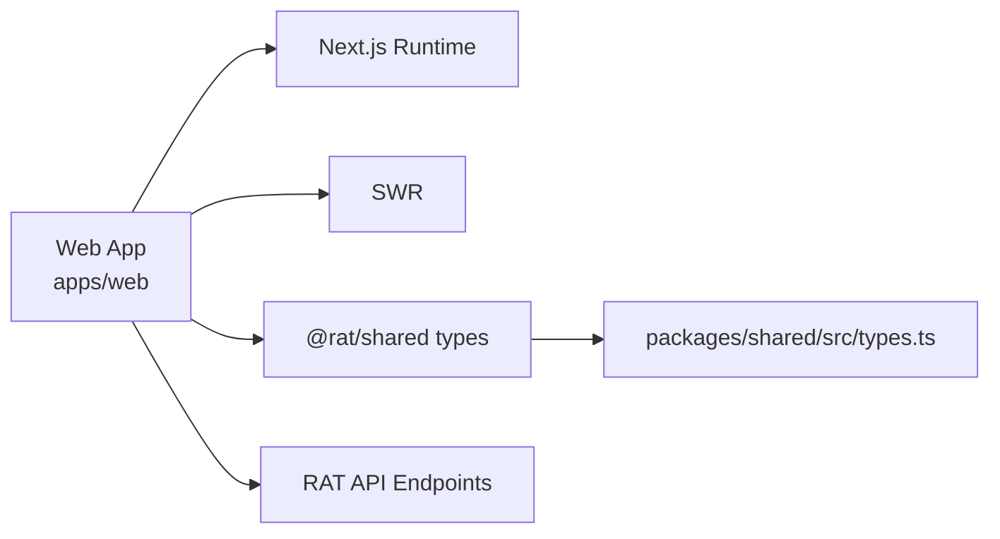

# Frontend Architecture

<cite>
**Referenced Files in This Document**
- [layout.tsx](file://apps/web/src/app/layout.tsx)
- [page.tsx](file://apps/web/src/app/page.tsx)
- [repo-page.tsx](file://apps/web/src/app/repos/[repoId]/page.tsx)
- [api.ts](file://apps/web/src/lib/api.ts)
- [hooks.ts](file://apps/web/src/lib/hooks.ts)
- [types.ts](file://packages/shared/src/types.ts)
- [next.config.mjs](file://apps/web/next.config.mjs)
- [package.json](file://apps/web/package.json)
- [globals.css](file://apps/web/src/styles/globals.css)
- [EmptyState.tsx](file://apps/web/src/components/common/EmptyState.tsx)
- [ErrorBanner.tsx](file://apps/web/src/components/common/ErrorBanner.tsx)
- [StatusBadge.tsx](file://apps/web/src/components/common/StatusBadge.tsx)
- [FilterBar.tsx](file://apps/web/src/components/filters/FilterBar.tsx)
- [IngestTabs.tsx](file://apps/web/src/components/ingest/IngestTabs.tsx)
- [JobProgress.tsx](file://apps/web/src/components/ingest/JobProgress.tsx)
- [MetricCards.tsx](file://apps/web/src/components/metrics/MetricCards.tsx)
</cite>

## Table of Contents
1. [Introduction](#introduction)
2. [Project Structure](#project-structure)
3. [Core Components](#core-components)
4. [Architecture Overview](#architecture-overview)
5. [Detailed Component Analysis](#detailed-component-analysis)
6. [Dependency Analysis](#dependency-analysis)
7. [Performance Considerations](#performance-considerations)
8. [Troubleshooting Guide](#troubleshooting-guide)
9. [Conclusion](#conclusion)

## Introduction
This document describes the Next.js frontend application that powers the RAT dashboard. It explains the App Router layout and page routing, the component hierarchy, data fetching with SWR, state management patterns, the typed API client abstraction, styling architecture, build configuration, responsive design, and accessibility considerations. The goal is to make the system understandable for both developers and stakeholders while remaining grounded in the actual source files.

## Project Structure
The web application lives under apps/web and uses the Next.js App Router:
- app/: Route segments and layout wrappers
  - layout.tsx: Root layout with global header, main content area, and footer
  - page.tsx: Home page listing repositories and ingestion entry points
  - repos/[repoId]/page.tsx: Per-repository dashboard with tabs and metrics
- lib/: Shared utilities
  - api.ts: Typed HTTP client and error model
  - hooks.ts: SWR-based data hooks
- components/: Feature-oriented UI components
  - common/: Reusable UI primitives (empty states, banners, badges)
  - filters/: Commit-set filter controls
  - ingest/: Repository ingestion forms and progress
  - metrics/: Metric cards, tables, and charts
- styles/: Global CSS tokens and base styles
- packages/shared/src/types.ts: Shared DTO types used by both API and frontend

**Diagram sources**
- [layout.tsx:12-38](file://apps/web/src/app/layout.tsx#L12-L38)
- [page.tsx:119-214](file://apps/web/src/app/page.tsx#L119-L214)
- [repo-page.tsx:35-205](file://apps/web/src/app/repos/[repoId]/page.tsx#L35-L205)
- [hooks.ts:39-162](file://apps/web/src/lib/hooks.ts#L39-L162)
- [api.ts:122-268](file://apps/web/src/lib/api.ts#L122-L268)
- [types.ts:27-220](file://packages/shared/src/types.ts#L27-L220)

**Section sources**
- [layout.tsx:1-39](file://apps/web/src/app/layout.tsx#L1-L39)
- [page.tsx:1-215](file://apps/web/src/app/page.tsx#L1-L215)
- [repo-page.tsx:1-206](file://apps/web/src/app/repos/[repoId]/page.tsx#L1-L206)
- [hooks.ts:1-163](file://apps/web/src/lib/hooks.ts#L1-L163)
- [api.ts:1-269](file://apps/web/src/lib/api.ts#L1-L269)
- [types.ts:1-226](file://packages/shared/src/types.ts#L1-L226)

## Core Components
- Root layout provides site-wide navigation, branding, and semantic structure. It imports global styles and sets metadata such as title and description.
- Home page lists repositories, shows ingestion options, and handles delete actions with local confirmation state.
- Repository dashboard displays repository status, ingestion progress, filters, and metric views across tabs.
- Data layer uses SWR hooks to fetch and cache typed responses from the API client.
- Shared types define DTOs for repositories, jobs, authors, paths, and metrics.

Key responsibilities:
- Routing and layout composition: layout.tsx, page.tsx, repos/[repoId]/page.tsx
- Data fetching and caching: hooks.ts
- API abstraction and error handling: api.ts
- Shared type contracts: types.ts

**Section sources**
- [layout.tsx:6-38](file://apps/web/src/app/layout.tsx#L6-L38)
- [page.tsx:119-214](file://apps/web/src/app/page.tsx#L119-L214)
- [repo-page.tsx:35-205](file://apps/web/src/app/repos/[repoId]/page.tsx#L35-L205)
- [hooks.ts:39-162](file://apps/web/src/lib/hooks.ts#L39-L162)
- [api.ts:17-69](file://apps/web/src/lib/api.ts#L17-L69)
- [types.ts:27-220](file://packages/shared/src/types.ts#L27-L220)

## Architecture Overview
The frontend follows a layered approach:
- Presentation layer: React components organized by feature and shared primitives
- Data layer: SWR hooks wrapping typed API calls
- Contract layer: Shared DTO types ensuring consistent payloads between server and client
- Styling layer: Global CSS variables and utility classes

**Diagram sources**
- [repo-page.tsx:35-47](file://apps/web/src/app/repos/[repoId]/page.tsx#L35-L47)
- [hooks.ts:47-84](file://apps/web/src/lib/hooks.ts#L47-L84)
- [api.ts:131-224](file://apps/web/src/lib/api.ts#L131-L224)

## Detailed Component Analysis

### App Router Layout and Pages
- Root layout defines the site shell: header with brand and primary navigation, main content container, and footer. It also sets page metadata.
- Home page composes ingestion tabs, repository list, and action flows. It uses local state for confirmations and per-action errors.
- Repository dashboard composes filters, tabbed views, and metric components. It handles not-found and busy states, and renders skeletons during loading.

**Diagram sources**
- [layout.tsx:12-38](file://apps/web/src/app/layout.tsx#L12-L38)
- [page.tsx:119-214](file://apps/web/src/app/page.tsx#L119-L214)
- [repo-page.tsx:35-205](file://apps/web/src/app/repos/[repoId]/page.tsx#L35-L205)
- [IngestTabs.tsx:11-51](file://apps/web/src/components/ingest/IngestTabs.tsx#L11-L51)
- [FilterBar.tsx:75-165](file://apps/web/src/components/filters/FilterBar.tsx#L75-L165)
- [MetricCards.tsx:30-88](file://apps/web/src/components/metrics/MetricCards.tsx#L30-L88)

**Section sources**
- [layout.tsx:1-39](file://apps/web/src/app/layout.tsx#L1-L39)
- [page.tsx:1-215](file://apps/web/src/app/page.tsx#L1-L215)
- [repo-page.tsx:1-206](file://apps/web/src/app/repos/[repoId]/page.tsx#L1-L206)

### Component Hierarchy
- Shared UI components:
  - EmptyState.tsx: Centered empty-state card
  - ErrorBanner.tsx: Inline error banner with optional retry
  - StatusBadge.tsx: Repository and job status badges using shared formatting helpers
- Feature-specific components:
  - filters/FilterBar.tsx: Commit range presets, author selection, path scoping
  - ingest/IngestTabs.tsx: Tabbed ingestion panel delegating to upload or clone forms
  - ingest/JobProgress.tsx: Progress bar and failure banner for ingestion jobs
  - metrics/MetricCards.tsx: Stat cards for repository-level metrics
- Layout wrappers:
  - Root layout wraps all pages with header, main, and footer

**Diagram sources**
- [EmptyState.tsx:4-20](file://apps/web/src/components/common/EmptyState.tsx#L4-L20)
- [ErrorBanner.tsx:4-22](file://apps/web/src/components/common/ErrorBanner.tsx#L4-L22)
- [StatusBadge.tsx:9-22](file://apps/web/src/components/common/StatusBadge.tsx#L9-L22)
- [FilterBar.tsx:75-165](file://apps/web/src/components/filters/FilterBar.tsx#L75-L165)
- [IngestTabs.tsx:11-51](file://apps/web/src/components/ingest/IngestTabs.tsx#L11-L51)
- [JobProgress.tsx:10-43](file://apps/web/src/components/ingest/JobProgress.tsx#L10-L43)
- [MetricCards.tsx:30-88](file://apps/web/src/components/metrics/MetricCards.tsx#L30-L88)

**Section sources**
- [EmptyState.tsx:1-21](file://apps/web/src/components/common/EmptyState.tsx#L1-L21)
- [ErrorBanner.tsx:1-23](file://apps/web/src/components/common/ErrorBanner.tsx#L1-L23)
- [StatusBadge.tsx:1-23](file://apps/web/src/components/common/StatusBadge.tsx#L1-L23)
- [FilterBar.tsx:1-166](file://apps/web/src/components/filters/FilterBar.tsx#L1-L166)
- [IngestTabs.tsx:1-52](file://apps/web/src/components/ingest/IngestTabs.tsx#L1-L52)
- [JobProgress.tsx:1-44](file://apps/web/src/components/ingest/JobProgress.tsx#L1-L44)
- [MetricCards.tsx:1-89](file://apps/web/src/components/metrics/MetricCards.tsx#L1-L89)

### Data Fetching Strategy with SWR
- All data access goes through hooks.ts, which wraps api.ts endpoints.
- Caching keys are stable arrays or strings including repo id and serialized commit filters.
- Live polling:
  - Repositories and single repository/job hooks refresh at a short interval while statuses indicate queued or processing states.
  - Focus revalidation is disabled to avoid unnecessary refetches.
- Keep previous data:
  - Metric hooks set keepPreviousData to true so UI remains smooth during filter changes.

**Diagram sources**
- [hooks.ts:15-20](file://apps/web/src/lib/hooks.ts#L15-L20)
- [hooks.ts:39-61](file://apps/web/src/lib/hooks.ts#L39-L61)
- [hooks.ts:79-147](file://apps/web/src/lib/hooks.ts#L79-L147)
- [api.ts:43-69](file://apps/web/src/lib/api.ts#L43-L69)

**Section sources**
- [hooks.ts:1-163](file://apps/web/src/lib/hooks.ts#L1-L163)
- [api.ts:43-69](file://apps/web/src/lib/api.ts#L43-L69)

### State Management Approach
- Local component state:
  - Home page uses useState for deletion confirmation, per-row action errors, and triggering mutations after successful operations.
  - Repository dashboard uses useState for active tab and filter state.
- Server state:
  - SWR manages repository, job, authors, paths, and metrics data.
- No global context is used; state is colocated where it is needed.

**Diagram sources**
- [page.tsx:121-140](file://apps/web/src/app/page.tsx#L121-L140)
- [repo-page.tsx:38-47](file://apps/web/src/app/repos/[repoId]/page.tsx#L38-L47)
- [hooks.ts:39-61](file://apps/web/src/lib/hooks.ts#L39-L61)

**Section sources**
- [page.tsx:119-214](file://apps/web/src/app/page.tsx#L119-L214)
- [repo-page.tsx:35-205](file://apps/web/src/app/repos/[repoId]/page.tsx#L35-L205)
- [hooks.ts:39-162](file://apps/web/src/lib/hooks.ts#L39-L162)

### API Client Abstraction
- Centralized client object exposes typed methods for every backend endpoint.
- Request helper normalizes responses and throws structured ApiError with code and status.
- Query helpers:
  - qs builds query strings skipping empty values.
  - filtersToParams serializes commit-set filters into URL parameters.
- Upload flow uses XMLHttpRequest to report progress for multipart uploads.

**Diagram sources**
- [api.ts:71-103](file://apps/web/src/lib/api.ts#L71-L103)
- [api.ts:122-268](file://apps/web/src/lib/api.ts#L122-L268)
- [api.ts:43-69](file://apps/web/src/lib/api.ts#L43-L69)

**Section sources**
- [api.ts:1-269](file://apps/web/src/lib/api.ts#L1-L269)

### Styling Architecture
- Global CSS file defines design tokens (colors, typography, spacing, radii, elevation, z-index layers).
- Base styles establish body, headings, links, focus-visible outlines, and layout containers.
- Utility classes provide buttons, cards, panels, tables, stat grids, progress bars, banners, and tabs.
- Components compose these classes rather than defining inline styles extensively.

Accessibility highlights:
- Focus-visible outlines meet contrast and visibility requirements.
- Semantic roles like role="alert", role="progressbar", aria-selected, and aria-label are used consistently.

**Section sources**
- [globals.css:8-79](file://apps/web/src/styles/globals.css#L8-L79)
- [globals.css:149-161](file://apps/web/src/styles/globals.css#L149-L161)
- [globals.css:172-272](file://apps/web/src/styles/globals.css#L172-L272)
- [globals.css:278-360](file://apps/web/src/styles/globals.css#L278-L360)
- [globals.css:613-700](file://apps/web/src/styles/globals.css#L613-L700)
- [globals.css:706-773](file://apps/web/src/styles/globals.css#L706-L773)
- [globals.css:779-800](file://apps/web/src/styles/globals.css#L779-L800)

### Build Process, Asset Optimization, and Deployment Configuration
- next.config.mjs enables React Strict Mode and transpiles the shared package for compatibility.
- package.json scripts provide development, build, start, and TypeScript type-checking commands.
- Dependencies include Next.js, React, SWR, and charting libraries.

Operational notes:
- Use npm run dev for local development.
- Use npm run build to generate optimized production assets.
- Use npm run start to serve the built output.

**Section sources**
- [next.config.mjs:1-8](file://apps/web/next.config.mjs#L1-L8)
- [package.json:1-28](file://apps/web/package.json#L1-L28)

### Responsive Design Patterns and Accessibility Considerations
- Responsive patterns:
  - Container max-width with horizontal padding ensures readable line lengths on large screens.
  - Flexbox and grid layouts adapt to available space (e.g., stat-grid auto-fit columns).
  - Sticky header maintains navigation context.
- Accessibility:
  - Landmarks: header, main, footer structure.
  - ARIA attributes: role="alert" for errors, role="progressbar" with aria-valuenow, aria-selected for tabs, aria-label for navigation and filter controls.
  - Keyboard focus styles are explicit and visible.

**Section sources**
- [layout.tsx:12-38](file://apps/web/src/app/layout.tsx#L12-L38)
- [globals.css:172-272](file://apps/web/src/styles/globals.css#L172-L272)
- [globals.css:482-512](file://apps/web/src/styles/globals.css#L482-L512)
- [JobProgress.tsx:31-40](file://apps/web/src/components/ingest/JobProgress.tsx#L31-L40)
- [FilterBar.tsx:90-94](file://apps/web/src/components/filters/FilterBar.tsx#L90-L94)

## Dependency Analysis
The frontend depends on:
- Next.js runtime and App Router conventions
- SWR for data fetching and caching
- Shared DTO types for contract consistency
- External API endpoints exposed by the backend

**Diagram sources**
- [package.json:12-20](file://apps/web/package.json#L12-L20)
- [types.ts:1-226](file://packages/shared/src/types.ts#L1-L226)
- [api.ts:17-20](file://apps/web/src/lib/api.ts#L17-L20)

**Section sources**
- [package.json:1-28](file://apps/web/package.json#L1-L28)
- [types.ts:1-226](file://packages/shared/src/types.ts#L1-L226)
- [api.ts:17-20](file://apps/web/src/lib/api.ts#L17-L20)

## Performance Considerations
- SWR caching reduces redundant network requests and improves perceived performance.
- Live polling cadence is conditional: only when repositories or jobs are in active states.
- keepPreviousData prevents jarring UI transitions when filters change.
- Skeleton placeholders provide visual feedback during loading.
- Transpiling the shared package ensures compatibility without bundling runtime code.

[No sources needed since this section provides general guidance]

## Troubleshooting Guide
Common issues and strategies:
- Network reachability:
  - If the API is unreachable, the client throws an ApiError with a NETWORK code and instructs users to ensure the API server is running.
- Not found repository:
  - The dashboard page detects REPO_NOT_FOUND and shows a user-friendly message with a retry option.
- Ingestion failures:
  - JobProgress renders error banners with fallback messages when job.error is null.
- Manual refresh:
  - SWR mutate() can be triggered by UI actions (e.g., Refresh button) to revalidate data.

Actionable checks:
- Verify NEXT_PUBLIC_API_URL or default localhost:4000 connectivity.
- Inspect ApiError.code and ApiError.status to tailor error messaging.
- Use mutate() to force revalidation after mutations.

**Section sources**
- [api.ts:43-69](file://apps/web/src/lib/api.ts#L43-L69)
- [repo-page.tsx:62-76](file://apps/web/src/app/repos/[repoId]/page.tsx#L62-L76)
- [JobProgress.tsx:10-43](file://apps/web/src/components/ingest/JobProgress.tsx#L10-L43)
- [page.tsx:125-140](file://apps/web/src/app/page.tsx#L125-L140)

## Conclusion
The RAT frontend is a well-structured Next.js application that separates concerns across layout, pages, feature components, and shared utilities. SWR provides efficient data fetching and caching, while the typed API client enforces consistent contracts with the backend. Global CSS tokens and utility classes deliver a cohesive design system with strong accessibility support. The build configuration is minimal and focused, enabling straightforward development and deployment workflows.

[No sources needed since this section summarizes without analyzing specific files]