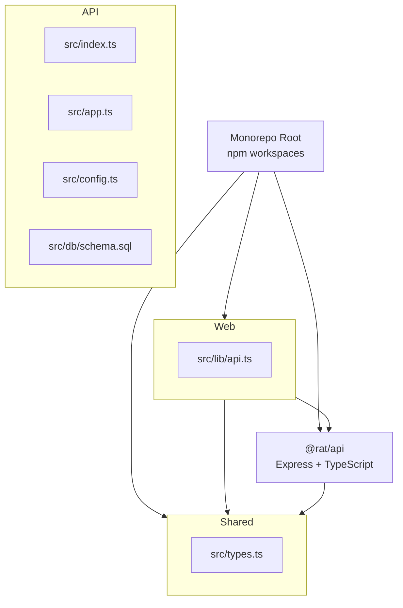
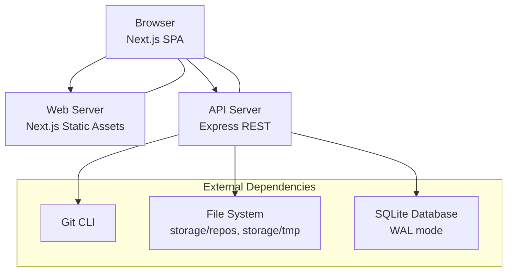
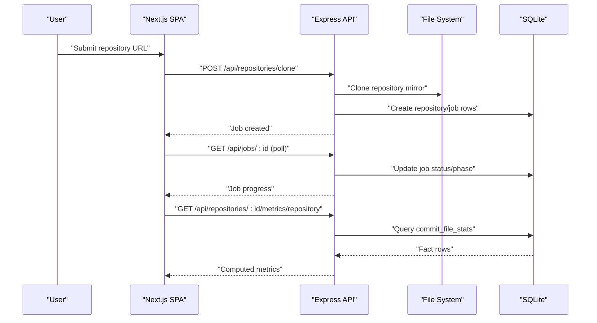
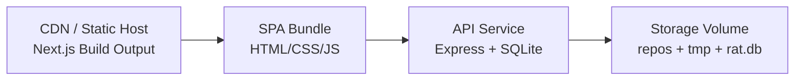
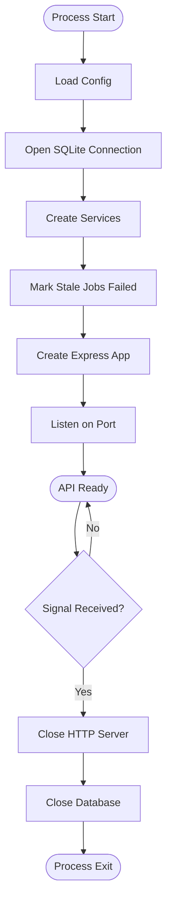
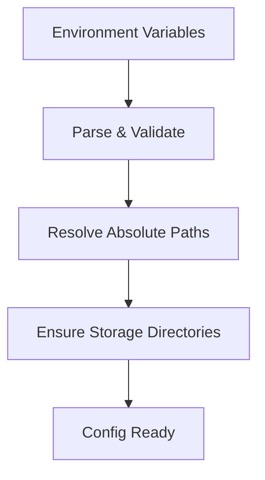
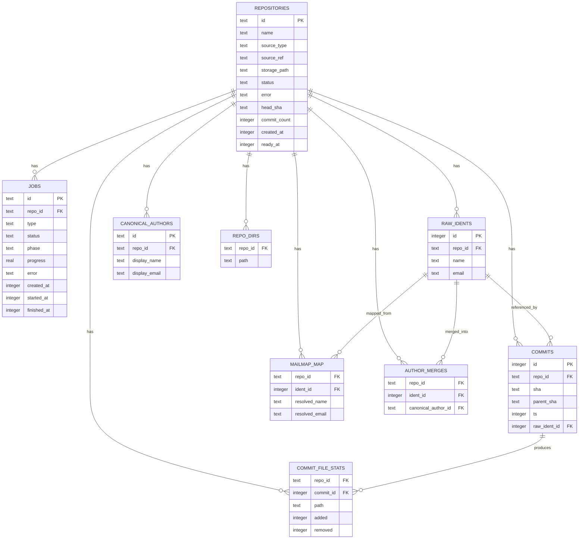
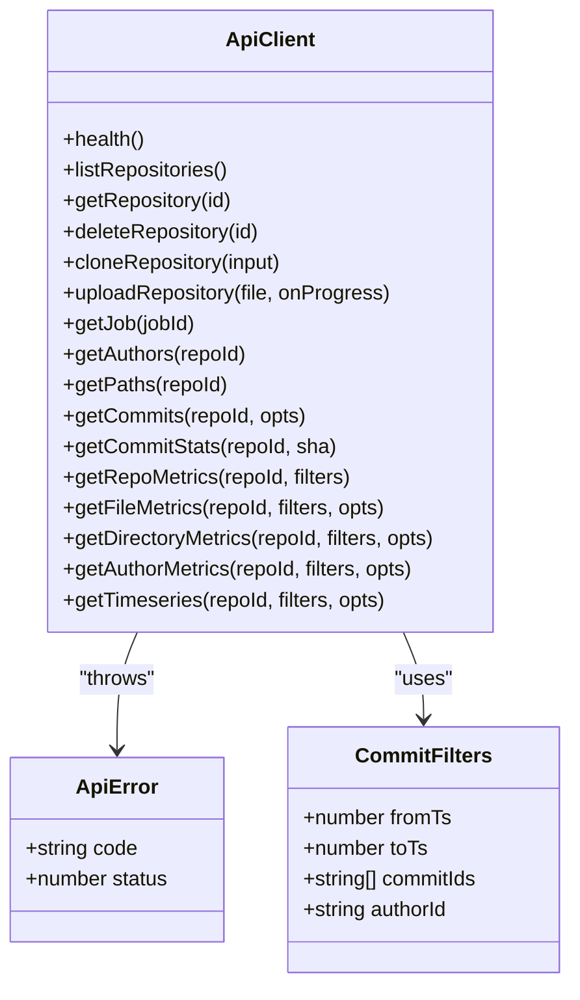
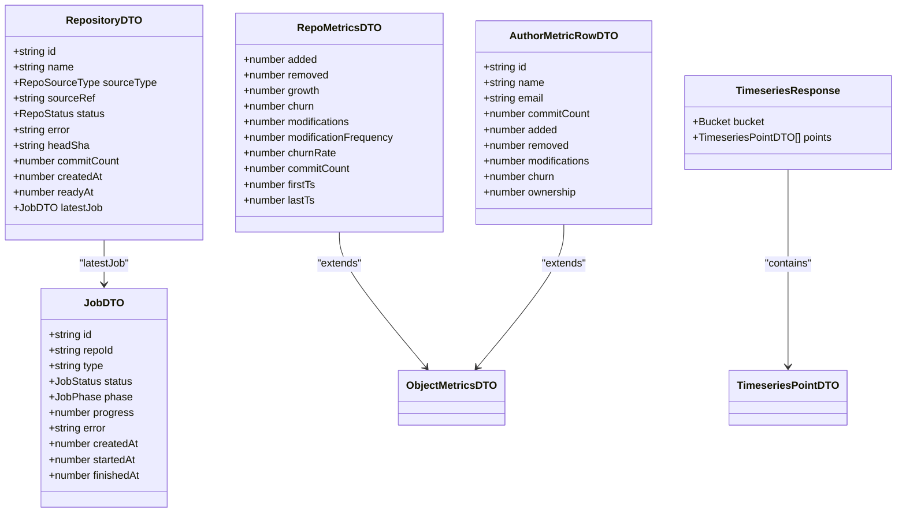
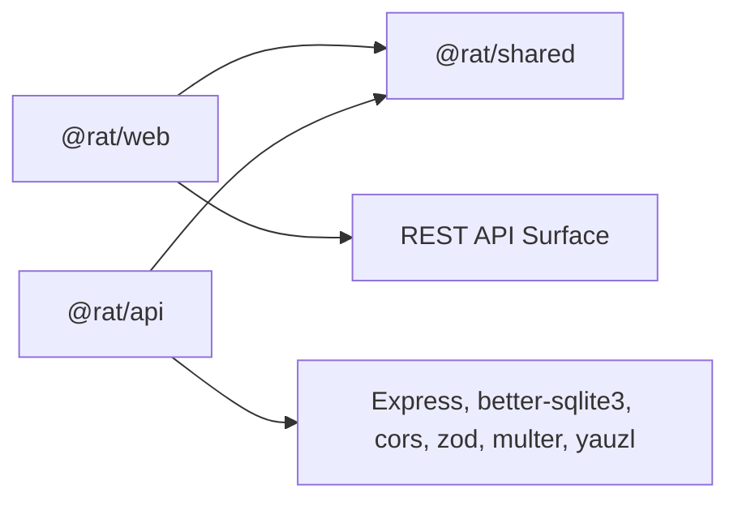

# System Architecture

<cite>
**Referenced Files in This Document**   
- [package.json](file://package.json)
- [README.md](file://README.md)
- [apps/api/package.json](file://apps/api/package.json)
- [apps/web/package.json](file://apps/web/package.json)
- [packages/shared/package.json](file://packages/shared/package.json)
- [apps/api/src/index.ts](file://apps/api/src/index.ts)
- [apps/api/src/app.ts](file://apps/api/src/app.ts)
- [apps/api/src/config.ts](file://apps/api/src/config.ts)
- [apps/api/src/db/schema.sql](file://apps/api/src/db/schema.sql)
- [apps/web/src/lib/api.ts](file://apps/web/src/lib/api.ts)
- [packages/shared/src/types.ts](file://packages/shared/src/types.ts)
</cite>

## Table of Contents
1. [Introduction](#introduction)
2. [Project Structure](#project-structure)
3. [Core Components](#core-components)
4. [Architecture Overview](#architecture-overview)
5. [Detailed Component Analysis](#detailed-component-analysis)
6. [Dependency Analysis](#dependency-analysis)
7. [Performance Considerations](#performance-considerations)
8. [Troubleshooting Guide](#troubleshooting-guide)
9. [Conclusion](#conclusion)

## Introduction
RAT is a self-hosted repository analysis tool that ingests Git repositories and computes commit-level metrics such as line changes, churn, modification frequency, and author ownership. The system is organized as an npm workspaces monorepo with three main packages:

- `apps/api`: Express.js backend providing a REST API for ingestion, job management, and metric queries.
- `apps/web`: Next.js 14 frontend serving as a single-page dashboard over the REST API.
- `packages/shared`: TypeScript-only DTO types shared between the API and web app.

The client-server architecture separates presentation (Next.js SPA) from data processing (Express API). The web server serves static assets while the API handles Git CLI operations, file-system access, SQLite persistence, and query-time metric computation.

## Project Structure
The repository root defines npm workspaces for `apps/*` and `packages/*`, enabling shared dependency resolution and unified scripts for development, building, testing, and verification.

**Diagram sources**
- [package.json:6-9](file://package.json#L6-L9)
- [apps/api/package.json:2-6](file://apps/api/package.json#L2-L6)
- [apps/web/package.json:2-6](file://apps/web/package.json#L2-L6)
- [packages/shared/package.json:2-6](file://packages/shared/package.json#L2-L6)

**Section sources**
- [package.json:1-30](file://package.json#L1-L30)
- [README.md:8-13](file://README.md#L8-L13)

## Core Components
- **API package (`@rat/api`)**
  - Entry point bootstraps configuration, storage directories, database connection, services, and HTTP server.
  - Express application registers CORS, JSON parsing, health endpoint, and route modules under `/api`.
  - Configuration loads environment variables, resolves storage paths, and exposes upload/clone timeouts.
  - SQLite schema defines repositories, jobs, commits, raw idents, mailmap mappings, canonical authors, directory cache, and the fact table `commit_file_stats`.

- **Web package (`@rat/web`)**
  - Typed API client built on `fetch` with structured error handling and progress reporting for multipart uploads.
  - Query helpers encode commit-set filters and pagination parameters used by all metric endpoints.
  - Uses shared DTO types from `@rat/shared` to ensure type safety across the network boundary.

- **Shared package (`@rat/shared`)**
  - Pure TypeScript definitions for repositories, jobs, commits, authors, paths, metrics, timeseries, list envelopes, and API errors.
  - No runtime code; acts as the contract between API responses and web UI models.

**Section sources**
- [apps/api/src/index.ts:6-23](file://apps/api/src/index.ts#L6-L23)
- [apps/api/src/app.ts:16-37](file://apps/api/src/app.ts#L16-L37)
- [apps/api/src/config.ts:26-66](file://apps/api/src/config.ts#L26-L66)
- [apps/api/src/db/schema.sql:5-105](file://apps/api/src/db/schema.sql#L5-L105)
- [apps/web/src/lib/api.ts:17-69](file://apps/web/src/lib/api.ts#L17-L69)
- [apps/web/src/lib/api.ts:84-103](file://apps/web/src/lib/api.ts#L84-L103)
- [packages/shared/src/types.ts:1-6](file://packages/shared/src/types.ts#L1-L6)

## Architecture Overview
The system follows a clear separation of concerns:

- Presentation layer: Next.js SPA renders dashboards, charts, tables, and forms. It does not perform Git analysis or direct database access.
- Business logic layer: Express API orchestrates ingestion pipelines, Git CLI execution, author resolution, and metric computation.
- Data persistence layer: SQLite stores metadata and a normalized fact table; metrics are computed at query time rather than precomputed.

**Diagram sources**
- [apps/api/src/index.ts:20-23](file://apps/api/src/index.ts#L20-L23)
- [apps/api/src/config.ts:50-66](file://apps/api/src/config.ts#L50-L66)
- [apps/api/src/db/schema.sql:57-64](file://apps/api/src/db/schema.sql#L57-L64)
- [apps/web/src/lib/api.ts:18-20](file://apps/web/src/lib/api.ts#L18-L20)

### Client-Server Contract
The Next.js frontend communicates exclusively through the typed REST surface defined by shared DTOs. The API exposes health checks, repository ingestion (zip upload and clone URL), job polling, commit listings, author resolution, path enumeration, and multiple metric endpoints including repository, files, directories, authors, and timeseries.

**Diagram sources**
- [apps/web/src/lib/api.ts:139-145](file://apps/web/src/lib/api.ts#L139-L145)
- [apps/web/src/lib/api.ts:191-193](file://apps/web/src/lib/api.ts#L191-L193)
- [apps/web/src/lib/api.ts:220-224](file://apps/web/src/lib/api.ts#L220-L224)
- [apps/api/src/app.ts:22-33](file://apps/api/src/app.ts#L22-L33)
- [apps/api/src/db/schema.sql:57-64](file://apps/api/src/db/schema.sql#L57-L64)

### Deployment Topology
In production, the web server serves static assets generated by `next build`, while the API runs independently and handles data processing. The frontend’s base API URL is configured at build time via `NEXT_PUBLIC_API_URL`, allowing the SPA to call the API from a different host or port.

[No diagram sources needed since this diagram shows conceptual deployment topology]

## Detailed Component Analysis

### API Bootstrap and Application Factory
The API entry point loads configuration, opens the database, creates services, marks stale jobs as failed after restart, builds the Express app, listens on the configured port, and handles graceful shutdown signals. The app factory configures CORS, JSON body parsing, a health endpoint, and mounts route modules under `/api/repositories` and `/api/jobs`.

**Diagram sources**
- [apps/api/src/index.ts:7-23](file://apps/api/src/index.ts#L7-L23)
- [apps/api/src/index.ts:25-39](file://apps/api/src/index.ts#L25-L39)
- [apps/api/src/app.ts:16-37](file://apps/api/src/app.ts#L16-L37)

**Section sources**
- [apps/api/src/index.ts:6-42](file://apps/api/src/index.ts#L6-L42)
- [apps/api/src/app.ts:12-37](file://apps/api/src/app.ts#L12-L37)

### Configuration and Storage Layout
Configuration reads environment variables for port, storage directory, upload size limit, clone timeout, and derives absolute paths for repos, temporary uploads, and the SQLite database. Storage layout keeps uploaded zips, cloned mirrors, and the database under a configurable root.

**Diagram sources**
- [apps/api/src/config.ts:49-66](file://apps/api/src/config.ts#L49-L66)
- [apps/api/src/config.ts:69-72](file://apps/api/src/config.ts#L69-L72)

**Section sources**
- [apps/api/src/config.ts:1-73](file://apps/api/src/config.ts#L1-L73)

### Database Schema and Persistence Model
The SQLite schema supports multiple repositories keyed by `repo_id`. The core fact table `commit_file_stats` stores per-commit line statistics per file path. Metrics are computed at query time using this normalized model. Supporting tables include repositories, jobs, commits, raw idents, mailmap mapping, canonical authors, manual merges, and a derived directory cache.

**Diagram sources**
- [apps/api/src/db/schema.sql:5-105](file://apps/api/src/db/schema.sql#L5-L105)

**Section sources**
- [apps/api/src/db/schema.sql:1-106](file://apps/api/src/db/schema.sql#L1-L106)

### Web API Client and Error Handling
The web client provides a typed interface to the REST API, including health checks, repository listing, cloning, zip upload with progress, job polling, commit and author queries, and all metric endpoints. Errors are wrapped into a structured `ApiError` carrying server-provided codes and messages.

**Diagram sources**
- [apps/web/src/lib/api.ts:22-41](file://apps/web/src/lib/api.ts#L22-L41)
- [apps/web/src/lib/api.ts:84-103](file://apps/web/src/lib/api.ts#L84-L103)
- [apps/web/src/lib/api.ts:122-268](file://apps/web/src/lib/api.ts#L122-L268)

**Section sources**
- [apps/web/src/lib/api.ts:1-269](file://apps/web/src/lib/api.ts#L1-L269)

### Shared Type Contract
The shared package defines DTOs for repositories, jobs, commits, authors, paths, object metrics, directory metrics, author metrics, timeseries points, list envelopes, and API error bodies. These types ensure consistent payloads between the API and the web app without sharing runtime behavior.

**Diagram sources**
- [packages/shared/src/types.ts:27-55](file://packages/shared/src/types.ts#L27-L55)
- [packages/shared/src/types.ts:128-148](file://packages/shared/src/types.ts#L128-L148)
- [packages/shared/src/types.ts:169-187](file://packages/shared/src/types.ts#L169-L187)
- [packages/shared/src/types.ts:189-203](file://packages/shared/src/types.ts#L189-L203)

**Section sources**
- [packages/shared/src/types.ts:1-226](file://packages/shared/src/types.ts#L1-L226)

## Dependency Analysis
The monorepo structure establishes clear boundaries:

- `@rat/web` depends on `@rat/shared` for DTO types and on the external REST API for data.
- `@rat/api` depends on `@rat/shared` for shared types and on external libraries for Express, SQLite, validation, and file handling.
- `@rat/shared` has no internal dependencies and exports only TypeScript definitions.

**Diagram sources**
- [apps/web/package.json:12-19](file://apps/web/package.json#L12-L19)
- [apps/api/package.json:14-22](file://apps/api/package.json#L14-L22)
- [packages/shared/package.json:8-10](file://packages/shared/package.json#L8-L10)

**Section sources**
- [apps/web/package.json:1-28](file://apps/web/package.json#L1-L28)
- [apps/api/package.json:1-40](file://apps/api/package.json#L1-L40)
- [packages/shared/package.json:1-12](file://packages/shared/package.json#L1-L12)

## Performance Considerations
- **Ingestion concurrency**: The in-process FIFO queue runs with concurrency one, ensuring deterministic analysis but limiting parallel ingestion throughput.
- **Batching**: Analysis batches inserts of 500 commits per transaction, reducing SQLite write overhead during history scanning.
- **Query-time metrics**: Metrics are computed at query time from the fact table, avoiding expensive precomputation but increasing read-side cost for large histories.
- **Path scoping and filtering**: Commit-set filters and path scopes reduce result sets, improving response times for targeted views.
- **Horizontal scaling options**:
  - Scale API instances behind a load balancer; share storage via a persistent volume for `storage/` and SQLite WAL.
  - Offload long-running ingestion to background workers if concurrency needs exceed one.
  - Cache frequent metric queries at the API layer or introduce materialized rollups for very large histories.
- **Potential bottlenecks**:
  - Large Git histories increase streaming parse time and fact table size.
  - SQLite write amplification during ingestion can be mitigated by tuning WAL settings and disk I/O.
  - Network latency between web and API affects UX; consider co-locating services or using edge caching for static assets.

[No sources needed since this section provides general guidance]

## Troubleshooting Guide
Common operational issues include native module installation failures, port conflicts, clone failures due to missing Git CLI or outbound network access, invalid zip archives, and oracle mismatches when storage paths differ.

- **Native module build failure**: Install build tools or use the provided fix script to side-load the prebuilt binary.
- **Port conflicts**: Adjust `API_PORT` or run the web app on another port.
- **Clone failures**: Ensure Git CLI version meets requirements and outbound HTTPS is allowed.
- **Zip rejection**: Archives must contain a full `.git` directory or valid bare layout.
- **Oracle mismatch**: Pass the correct `--git-dir` or align `RAT_STORAGE_DIR` with the API’s storage root.

**Section sources**
- [README.md:278-302](file://README.md#L278-L302)

## Conclusion
RAT’s architecture cleanly separates presentation, business logic, and persistence. The Next.js SPA provides a responsive dashboard, while the Express API manages Git ingestion, SQLite-backed persistence, and query-time metric computation. The shared TypeScript contract ensures type-safe communication across the network boundary. For scalability, horizontal scaling of API instances and optional offloading of ingestion workloads are viable strategies, with careful attention to SQLite performance and large-history query costs.

[No sources needed since this section summarizes without analyzing specific files]