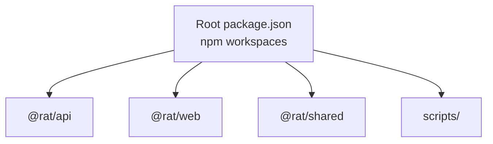
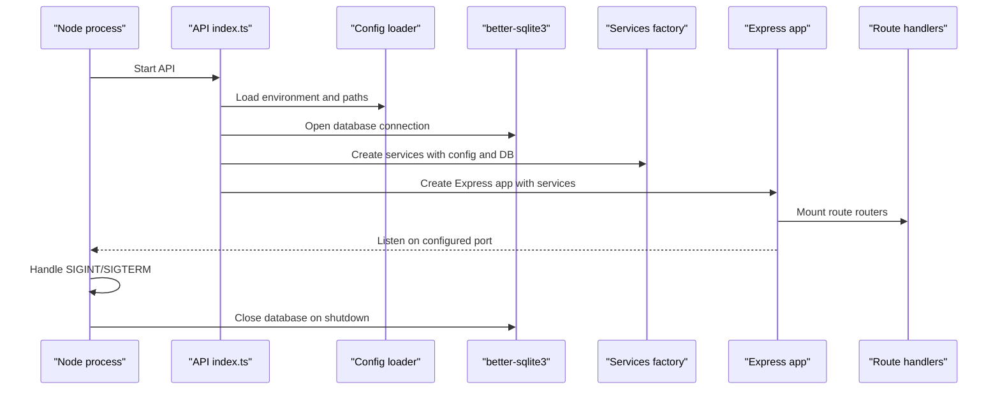
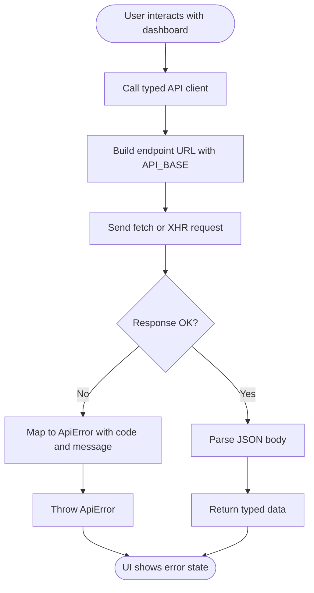
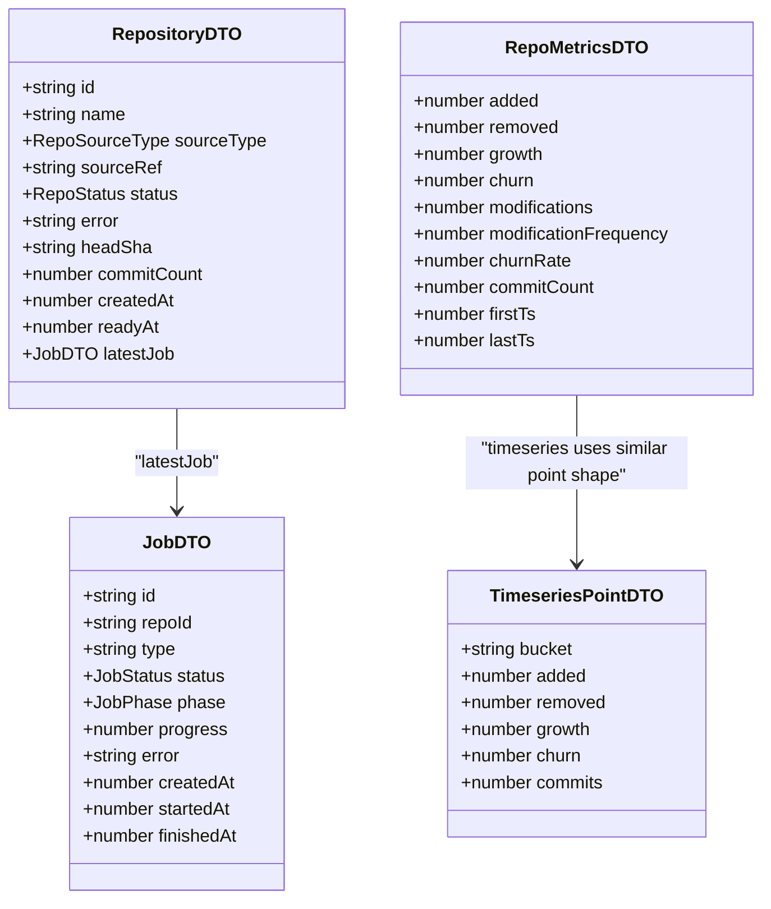
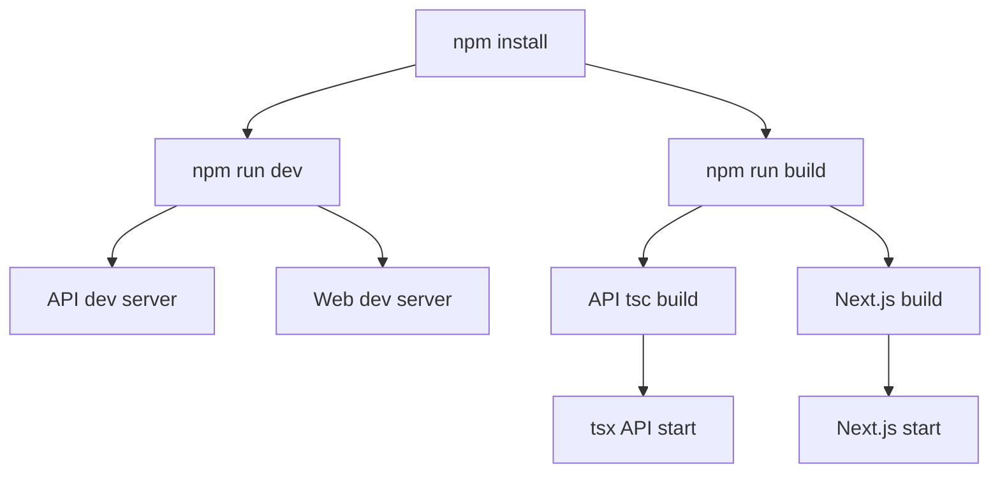
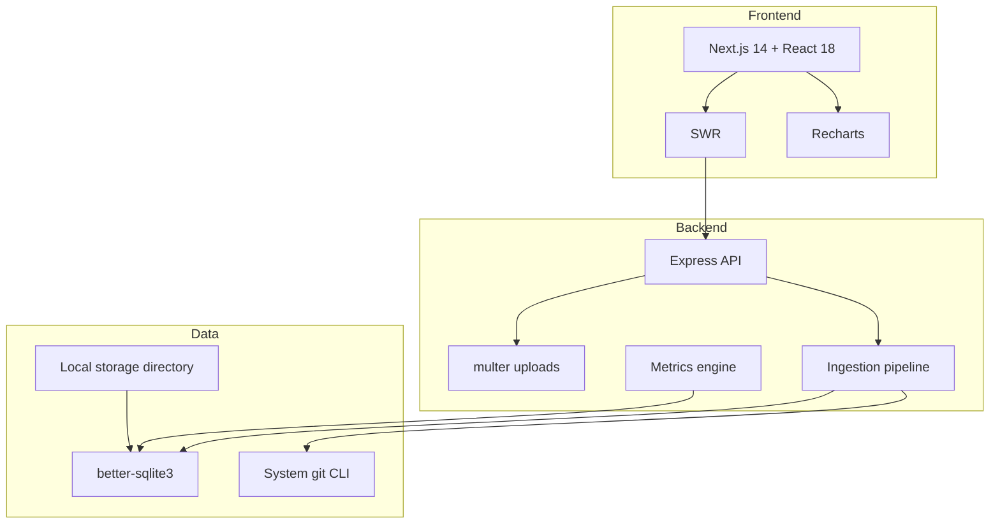

# Technology Stack

<cite>
**Referenced Files in This Document**
- [package.json](file://package.json)
- [README.md](file://README.md)
- [tsconfig.base.json](file://tsconfig.base.json)
- [apps/api/package.json](file://apps/api/package.json)
- [apps/web/package.json](file://apps/web/package.json)
- [packages/shared/package.json](file://packages/shared/package.json)
- [apps/api/src/index.ts](file://apps/api/src/index.ts)
- [apps/api/src/app.ts](file://apps/api/src/app.ts)
- [apps/web/next.config.mjs](file://apps/web/next.config.mjs)
- [apps/web/src/lib/api.ts](file://apps/web/src/lib/api.ts)
- [packages/shared/src/types.ts](file://packages/shared/src/types.ts)
- [apps/api/jest.config.js](file://apps/api/jest.config.js)
</cite>

## Table of Contents
1. [Introduction](#introduction)
2. [Project Structure](#project-structure)
3. [Core Technologies](#core-technologies)
4. [Backend Stack](#backend-stack)
5. [Frontend Stack](#frontend-stack)
6. [Shared Type Layer](#shared-type-layer)
7. [Development and Testing Tools](#development-and-testing-tools)
8. [Build System, Bundling, and Deployment Targets](#build-system-bundling-and-deployment-targets)
9. [Version Compatibility and Upgrade Considerations](#version-compatibility-and-upgrade-considerations)
10. [Rationale, Performance, and Maintainability](#rationale-performance-and-maintainability)
11. [Architecture Overview](#architecture-overview)
12. [Troubleshooting Guide](#troubleshooting-guide)
13. [Conclusion](#conclusion)

## Introduction
This document describes the technology stack for RAT, a self-hosted repository analysis tool that ingests Git repositories and computes commit-level metrics such as churn, growth, modification frequency, and author ownership. The project is an npm-workspaces monorepo with three main packages:

- `@rat/api`: Express-based backend using TypeScript, better-sqlite3, and system git CLI.
- `@rat/web`: Next.js 14 dashboard built on React 18, using SWR for data fetching and Recharts for visualizations.
- `@rat/shared`: Shared TypeScript-only DTO types consumed by both apps.

The repository also includes deterministic fixture scripts, an independent metrics oracle, Jest-based tests, and Supertest API tests.

**Section sources**
- [README.md:1-13](file://README.md#L1-L13)
- [README.md:140-172](file://README.md#L140-L172)

## Project Structure
At the workspace root, `package.json` declares npm workspaces under `apps/*` and `packages/*`. The top-level scripts orchestrate development, build, test, type checking, and verification tasks across all workspaces.

**Diagram sources**
- [package.json:6-20](file://package.json#L6-L20)

Key responsibilities:

| Package | Responsibility |
|---|---|
| `@rat/api` | Express server, ingestion pipeline, SQLite persistence, metrics engine, and REST endpoints. |
| `@rat/web` | Next.js App Router UI, typed API client, SWR hooks, charts, and design-token styling. |
| `@rat/shared` | Shared DTO and response types used by both API and web. |
| `scripts/` | Fixture builder and independent metrics oracle. |

**Section sources**
- [package.json:1-31](file://package.json#L1-L31)
- [README.md:140-172](file://README.md#L140-L172)

## Core Technologies
RAT runs on Node.js with TypeScript across all workspaces. The runtime and compiler configuration are centralized through shared base settings and per-package overrides.

| Technology | Role | Version or Constraint | Notes |
|---|---|---:|---|
| Node.js | Runtime | `>=18.18` | Enforced at the workspace root. |
| npm | Workspace manager | `>=9` | Required for workspace support. |
| TypeScript | Language and compile-time checks | `^5.5.4` | Used by API, web, and root dev dependencies. |
| tsx | Development runner for API | `^4.16.2` | Used for watch and start commands in the API. |
| concurrently | Dev workflow helper | `^8.2.2` | Runs API and web servers together during development. |

TypeScript base options include ES2022 target and lib, strict mode, isolated modules, consistent casing, JSON module resolution, and no emit on error. These rules improve consistency across the monorepo.

**Section sources**
- [package.json:22-29](file://package.json#L22-L29)
- [tsconfig.base.json:1-16](file://tsconfig.base.json#L1-L16)
- [README.md:17-25](file://README.md#L17-L25)

## Backend Stack
The backend is an Express application written in TypeScript. It exposes a REST API for repository ingestion, job polling, commit browsing, path exploration, author reporting, and metric queries.

### Runtime and Server
- **Node.js**: The required runtime version is enforced at the workspace root.
- **Express**: HTTP framework used to create the app, register middleware, and mount routers.
- **CORS**: Enabled for cross-origin access from the Next.js frontend.
- **JSON body limit**: Set to 1MB for request bodies.
- **Lifecycle**: The API bootstrap loads configuration, opens the database, creates services, starts the job store cleanup, mounts routes, listens on a port, and handles graceful shutdown signals.

**Diagram sources**
- [apps/api/src/index.ts:6-42](file://apps/api/src/index.ts#L6-L42)
- [apps/api/src/app.ts:17-39](file://apps/api/src/app.ts#L17-L39)

### Database
- **better-sqlite3**: Synchronous SQLite driver used for persistence.
- **Schema**: Includes tables for repositories, commits, jobs, raw identities, canonical authors, and a fact table storing file stats per commit.
- **WAL mode**: The README documents WAL usage for SQLite.
- **Query-time metrics**: Most metrics are computed at query time from the fact table rather than precomputed rollups.

### File Uploads
- **multer**: Handles multipart form uploads for `.zip` files containing a `.git` directory.
- **Validation**: The API validates zip contents and rejects invalid archives.

### Configuration and Environment
Environment variables control the API port, storage directory, web API URL, upload size limit, and clone timeout. The API reads these values at startup.

**Section sources**
- [apps/api/package.json:14-22](file://apps/api/package.json#L14-L22)
- [apps/api/src/index.ts:6-42](file://apps/api/src/index.ts#L6-L42)
- [apps/api/src/app.ts:17-39](file://apps/api/src/app.ts#L17-L39)
- [README.md:176-203](file://README.md#L176-L203)
- [README.md:242-254](file://README.md#L242-L254)

## Frontend Stack
The frontend is a Next.js 14 application using the App Router and React 18. It provides a dashboard for browsing repository metrics, filtering by commit range, author, and path, and visualizing churn over time.

### Framework and Rendering
- **Next.js 14**: Provides routing, build tooling, and development server.
- **React 18**: Component library and runtime.
- **React Strict Mode**: Enabled in Next configuration.
- **Transpilation**: The shared package is transpiled for the web workspace.

### Data Fetching
- **SWR**: Used for data fetching, caching, and polling while ingestion jobs are running.
- **Typed API client**: A custom client wraps fetch/XHR calls and maps structured API errors.

### Visualizations
- **Recharts**: Used for charts such as churn over time and top files.

### API Client Behavior
The web client:

- Reads the API base URL from `NEXT_PUBLIC_API_URL`, defaulting to localhost.
- Wraps fetch requests and converts non-OK responses into a typed `ApiError`.
- Supports multipart upload progress via XHR.
- Encodes common commit-set filters into query parameters.
- Exposes methods for repositories, jobs, commits, authors, paths, metrics, and timeseries.

**Diagram sources**
- [apps/web/src/lib/api.ts:17-69](file://apps/web/src/lib/api.ts#L17-L69)
- [apps/web/src/lib/api.ts:147-189](file://apps/web/src/lib/api.ts#L147-L189)
- [apps/web/src/lib/api.ts:220-267](file://apps/web/src/lib/api.ts#L220-L267)

**Section sources**
- [apps/web/package.json:1-28](file://apps/web/package.json#L1-L28)
- [apps/web/next.config.mjs:1-8](file://apps/web/next.config.mjs#L1-L8)
- [apps/web/src/lib/api.ts:17-69](file://apps/web/src/lib/api.ts#L17-L69)
- [apps/web/src/lib/api.ts:122-267](file://apps/web/src/lib/api.ts#L122-L267)
- [README.md:204-214](file://README.md#L204-L214)

## Shared Type Layer
The shared package exports TypeScript-only DTOs that mirror the JSON payloads served by the API. It does not share runtime code between workspaces.

Key shared concepts include:

| Concept | Description |
|---|---|
| Repository DTO | Represents an ingested repository, its source, status, head SHA, commit count, timestamps, and latest job. |
| Job DTO | Represents ingestion lifecycle status, phase, progress, and timing. |
| Commit DTOs | Represent commit listings and per-commit file changes. |
| Author DTOs | Represent resolved authors, raw identities, and canonical author merges. |
| Path DTOs | Represent files and directories discovered in history. |
| Metric DTOs | Represent object metrics, repository metrics, file metrics, directory metrics, author metrics, and timeseries points. |
| Common envelopes | Represent list responses, repository lists, and API error bodies. |

**Diagram sources**
- [packages/shared/src/types.ts:27-55](file://packages/shared/src/types.ts#L27-L55)
- [packages/shared/src/types.ts:150-225](file://packages/shared/src/types.ts#L150-L225)

**Section sources**
- [packages/shared/package.json:1-12](file://packages/shared/package.json#L1-L12)
- [packages/shared/src/types.ts:1-266](file://packages/shared/src/types.ts#L1-L266)
- [apps/web/next.config.mjs:4](file://apps/web/next.config.mjs#L4)

## Development and Testing Tools
RAT uses a focused set of development and testing tools to ensure correctness, type safety, and developer productivity.

| Tool | Purpose | Scope |
|---|---|---|
| Jest | Unit and integration tests for the API. | `@rat/api` |
| ts-jest | TypeScript transformation for Jest. | `@rat/api` |
| Supertest | HTTP assertions against Express routes. | `@rat/api` |
| concurrently | Run API and web development servers together. | Root workspace |
| tsx | Run TypeScript directly during development and production-style start. | `@rat/api` |
| TypeScript | Compile-time checks and type safety. | All workspaces |

Jest configuration sets a Node test environment, restricts tests to the `test` directory, maps the shared package, transforms TypeScript with ts-jest, and increases the default test timeout.

**Section sources**
- [apps/api/package.json:7-12](file://apps/api/package.json#L7-L12)
- [apps/api/package.json:24-38](file://apps/api/package.json#L24-L38)
- [apps/api/jest.config.js:1-29](file://apps/api/jest.config.js#L1-L29)
- [package.json:10-20](file://package.json#L10-L20)
- [README.md:101-110](file://README.md#L101-L110)

## Build System, Bundling, and Deployment Targets
RAT separates development, build, and production run steps across workspaces.

### Workspaces and Scripts
- `npm install`: Installs dependencies across all workspaces.
- `npm run dev`: Starts both API and web development servers concurrently.
- `npm run build`: Builds the API and the web app.
- `npm run start:api`: Starts the API using tsx.
- `npm run start:web`: Starts the Next.js production server.
- `npm run typecheck`: Runs TypeScript checks for both workspaces.
- `npm run verify`: Runs the independent metrics oracle script.

### API Build
The API compiles TypeScript using `tsc` and can be started directly with tsx. The entry point initializes configuration, database, services, and the Express server.

### Web Build
The web app uses Next.js build and start commands. The Next configuration enables React Strict Mode and transpiles the shared package so it can be consumed by the browser bundle.

### Deployment Targets
- **API**: Node.js process serving Express.
- **Web**: Next.js production server.
- **Storage**: Local filesystem under a configurable storage directory, including uploaded zips, cloned repositories, and the SQLite database.

**Diagram sources**
- [package.json:10-20](file://package.json#L10-L20)
- [apps/api/package.json:7-12](file://apps/api/package.json#L7-L12)
- [apps/web/package.json:6-11](file://apps/web/package.json#L6-L11)
- [apps/web/next.config.mjs:1-8](file://apps/web/next.config.mjs#L1-L8)

**Section sources**
- [package.json:10-20](file://package.json#L10-L20)
- [apps/api/package.json:7-12](file://apps/api/package.json#L7-L12)
- [apps/web/package.json:6-11](file://apps/web/package.json#L6-L11)
- [apps/web/next.config.mjs:1-8](file://apps/web/next.config.mjs#L1-L8)
- [README.md:29-58](file://README.md#L29-L58)

## Version Compatibility and Upgrade Considerations
### Required Versions
| Requirement | Minimum Version | Reason |
|---|---:|---|
| Node.js | `18.18` | Workspace support and modern JavaScript features. |
| npm | `9` | Workspace support. |
| git CLI | `2.30` | Ingestion and analysis rely on git commands. |

### Dependency Versions
| Package | Version | Impact |
|---|---:|---|
| Express | `^4.19.2` | Stable HTTP framework for the API. |
| better-sqlite3 | `^11.10.0` | High-performance synchronous SQLite driver; may require native rebuild. |
| multer | `^1.4.5-lts.1` | Long-term supported file upload handling. |
| Next.js | `^14.2.5` | App Router, build tooling, and React 18 compatibility. |
| React / react-dom | `^18.3.1` | Component runtime. |
| SWR | `^2.2.5` | Data fetching and caching layer. |
| Recharts | `^2.12.7` | Charting library. |
| TypeScript | `^5.5.4` | Consistent language and type checking across workspaces. |
| Jest | `^29.7.0` | Test runner. |
| Supertest | `^7.0.0` | HTTP testing for Express. |

### Upgrade Guidance
- Keep Node.js at or above the required version to avoid workspace and runtime incompatibilities.
- When upgrading better-sqlite3, be prepared for native binary rebuilds if prebuilt binaries are unavailable.
- Upgrading Next.js should be coordinated with React versions and any third-party charting libraries.
- Upgrading TypeScript requires validating shared types and test transformations.
- Always run `npm run typecheck` and `npm test` after dependency upgrades.

**Section sources**
- [package.json:22-29](file://package.json#L22-L29)
- [apps/api/package.json:14-38](file://apps/api/package.json#L14-L38)
- [apps/web/package.json:12-26](file://apps/web/package.json#L12-L26)
- [README.md:17-25](file://README.md#L17-L25)

## Rationale, Performance, and Maintainability
### Technology Choices
- **Node.js + Express**: Provides a familiar, lightweight backend suitable for I/O-bound ingestion and query-time metric computation.
- **better-sqlite3**: Offers synchronous performance and simplicity for a single-process API with local storage.
- **multer**: Simplifies multipart file uploads while allowing validation before ingestion.
- **Next.js + React 18**: Delivers a modern frontend with strong ecosystem support, predictable builds, and component-based architecture.
- **SWR**: Enables efficient data fetching, caching, and polling for long-running ingestion jobs.
- **Recharts**: Provides declarative charting for churn and top-file visualizations.
- **TypeScript**: Ensures type safety across API, web, and shared types.
- **Jest + Supertest**: Validates route behavior, validation errors, and ingestion flows.

### Performance Implications
- Query-time metric computation avoids expensive precomputation but shifts load to read paths.
- Streaming git log parsing and batched inserts help manage large histories.
- SQLite WAL mode improves concurrency characteristics for a single-process server.
- SWR reduces redundant network requests and keeps previous data visible during filter changes.

### Maintainability Implications
- Monorepo structure centralizes scripts and enforces consistent tooling.
- Shared types reduce drift between API responses and frontend expectations.
- Strict TypeScript settings and isolated modules improve reliability.
- Clear separation of concerns across routes, services, ingestion, analysis, metrics, and middleware supports incremental changes.

[No sources needed since this section synthesizes previously analyzed information]

## Architecture Overview
The overall architecture connects the Next.js frontend to the Express backend, which persists data in SQLite and orchestrates Git-based ingestion and analysis.

**Diagram sources**
- [apps/web/package.json:12-19](file://apps/web/package.json#L12-L19)
- [apps/api/package.json:14-22](file://apps/api/package.json#L14-L22)
- [README.md:176-203](file://README.md#L176-L203)

## Troubleshooting Guide
Common operational issues include native module installation, port conflicts, cloning failures, invalid zip archives, and oracle configuration mismatches.

| Issue | Cause | Resolution |
|---|---|---|
| better-sqlite3 fails to load | Prebuilt binary download blocked or missing build tools | Install build tools and rebuild, or use the provided fix script. |
| Port already in use | Default ports conflict | Change `API_PORT` or run the web app on another port. |
| Clone fails | Missing outbound HTTPS or unsupported git version | Ensure network access and git CLI `>=2.30`. |
| Zip rejected | Archive lacks a valid `.git` layout | Provide a full `.git` directory inside the zip. |
| Oracle cannot find git dir | Mismatched storage directory | Pass `--git-dir` explicitly or align `RAT_STORAGE_DIR`. |

**Section sources**
- [README.md:278-303](file://README.md#L278-L303)

## Conclusion
RAT’s technology stack balances simplicity, performance, and maintainability. The backend leverages Express and better-sqlite3 for straightforward ingestion and query-time metrics, while the frontend uses Next.js, React, SWR, and Recharts to deliver an interactive dashboard. Shared TypeScript types keep the API contract stable, and the monorepo structure centralizes tooling and scripts. For future evolution, attention should be paid to dependency upgrade compatibility, native module availability, and potential scaling considerations around query-time metric computation.

[No sources needed since this section summarizes without analyzing specific files]