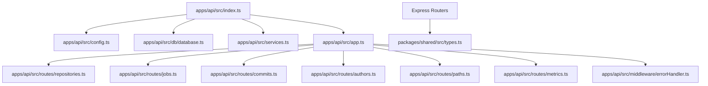
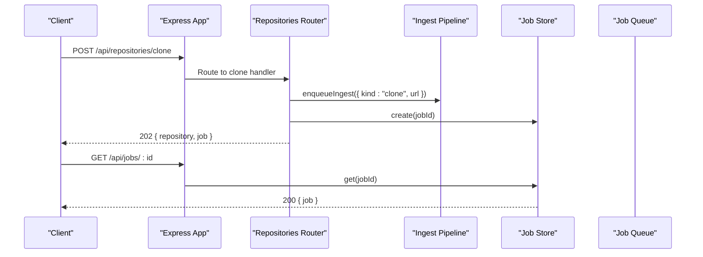
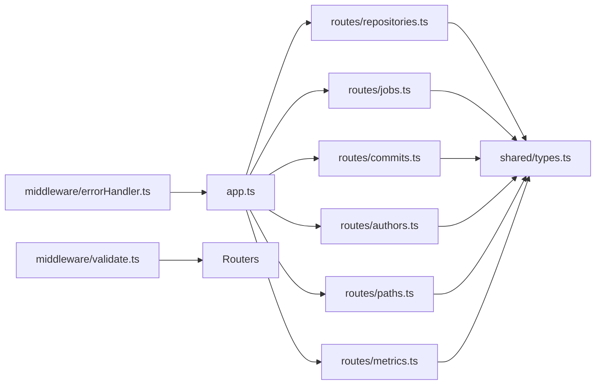

# Backend API

<cite>
**Referenced Files in This Document**
- [index.ts](file://apps/api/src/index.ts)
- [app.ts](file://apps/api/src/app.ts)
- [config.ts](file://apps/api/src/config.ts)
- [services.ts](file://apps/api/src/services.ts)
- [types.ts](file://packages/shared/src/types.ts)
- [repositories.ts](file://apps/api/src/routes/repositories.ts)
- [jobs.ts](file://apps/api/src/routes/jobs.ts)
- [commits.ts](file://apps/api/src/routes/commits.ts)
- [authors.ts](file://apps/api/src/routes/authors.ts)
- [paths.ts](file://apps/api/src/routes/paths.ts)
- [metrics.ts](file://apps/api/src/routes/metrics.ts)
- [errorHandler.ts](file://apps/api/src/middleware/errorHandler.ts)
- [validate.ts](file://apps/api/src/middleware/validate.ts)
- [errors.ts](file://apps/api/src/util/errors.ts)
</cite>

## Table of Contents
1. [Introduction](#introduction)
2. [Project Structure](#project-structure)
3. [Core Components](#core-components)
4. [Architecture Overview](#architecture-overview)
5. [Detailed Component Analysis](#detailed-component-analysis)
6. [Dependency Analysis](#dependency-analysis)
7. [Performance Considerations](#performance-considerations)
8. [Troubleshooting Guide](#troubleshooting-guide)
9. [Conclusion](#conclusion)
10. [Appendices](#appendices)

## Introduction
This document describes the REST API surface exposed by RAT’s backend server. It covers repository ingestion, job polling, commit and author enumeration, path discovery, and the complete metrics API for repositories, files, directories, authors, and timeseries data. It also documents request/response schemas, query parameters, pagination, error formats, authentication assumptions, rate limiting considerations, security notes, and client implementation guidance.

The API is an Express application that:
- Mounts repository-related routes under `/api/repositories`.
- Mounts job polling under `/api/jobs`.
- Exposes a health endpoint at `/api/health`.
- Uses structured error responses with `code` and `message`.
- Requires repositories to be in a `ready` state before most read endpoints.

There is no built-in authentication or authorization layer in the current codebase; clients should treat all endpoints as public unless deployed behind an external gateway.

## Project Structure
The API lives under `apps/api/src`. The bootstrap process loads configuration, opens the SQLite database, creates shared services, builds the Express app, mounts routers, and starts listening on a configurable port.



**Diagram sources**
- [index.ts:6-23](file://apps/api/src/index.ts#L6-L23)
- [app.ts:16-37](file://apps/api/src/app.ts#L16-L37)
- [config.ts:49-66](file://apps/api/src/config.ts#L49-L66)
- [services.ts:18-24](file://apps/api/src/services.ts#L18-L24)

**Section sources**
- [index.ts:6-43](file://apps/api/src/index.ts#L6-L43)
- [app.ts:16-37](file://apps/api/src/app.ts#L16-L37)
- [config.ts:49-73](file://apps/api/src/config.ts#L49-L73)
- [services.ts:18-44](file://apps/api/src/services.ts#L18-L44)

## Core Components
- Configuration: Loads environment variables, storage paths, upload limits, and timeouts.
- Services: Provides database access, job store, queue, and ingest pipeline to routers.
- Shared types: Defines DTOs for repositories, jobs, commits, authors, paths, metrics, and common envelopes.
- Middleware: Centralized error handling and parameter validation helpers.
- Routers: HTTP endpoints grouped by feature area.

Key responsibilities:
- Repository management: list, upload zip, clone URL, get detail, delete.
- Job polling: retrieve ingestion job status and progress.
- Commits: list filtered commits and per-commit file stats.
- Authors: resolved author identities and raw git idents.
- Paths: enumerate known file and directory paths.
- Metrics: repository-level, file-level, directory-level, author-level, and timeseries metrics.

**Section sources**
- [config.ts:26-73](file://apps/api/src/config.ts#L26-L73)
- [services.ts:9-44](file://apps/api/src/services.ts#L9-L44)
- [types.ts:12-226](file://packages/shared/src/types.ts#L12-L226)
- [errorHandler.ts:5-63](file://apps/api/src/middleware/errorHandler.ts#L5-L63)
- [validate.ts:1-70](file://apps/api/src/middleware/validate.ts#L1-L70)

## Architecture Overview
The API follows a layered structure:
- Bootstrap (`index.ts`) initializes configuration, database, services, and the Express app.
- Application factory (`app.ts`) mounts routers and global middleware.
- Feature routers implement REST endpoints and delegate to services and stores.
- Shared types define the contract between routers and clients.



**Diagram sources**
- [app.ts:26-33](file://apps/api/src/app.ts#L26-L33)
- [repositories.ts:117-135](file://apps/api/src/routes/repositories.ts#L117-L135)
- [jobs.ts:22-33](file://apps/api/src/routes/jobs.ts#L22-L33)

## Detailed Component Analysis

### Base Server and Global Behavior
- Health check: `GET /api/health` returns service status and timestamp.
- JSON body limit: 1 MB.
- CORS enabled globally.
- Not found and error handlers are mounted after route groups.

Operational notes:
- Default port is configured via `API_PORT`, defaulting to `4000`.
- Storage layout is derived from `RAT_STORAGE_DIR`; defaults include `storage/repos`, `storage/tmp`, and `storage/rat.db`.
- Upload size limit is controlled by `MAX_UPLOAD_MB`.

**Section sources**
- [app.ts:16-37](file://apps/api/src/app.ts#L16-L37)
- [config.ts:49-66](file://apps/api/src/config.ts#L49-L66)
- [index.ts:20-23](file://apps/api/src/index.ts#L20-L23)

### Authentication and Security Model
- No built-in authentication or authorization.
- Clients should deploy behind a reverse proxy or API gateway if access control is required.
- Input validation is enforced for structured requests and query parameters.
- File uploads are restricted to `.zip` archives and subject to size limits.
- Deletion guards prevent deleting repositories with active ingestion jobs.

Security recommendations:
- Enforce TLS at the gateway.
- Restrict network exposure to trusted networks.
- Validate and sanitize any user-supplied paths or URLs.
- Monitor upload sizes and disk usage.

**Section sources**
- [repositories.ts:84-115](file://apps/api/src/routes/repositories.ts#L84-L115)
- [repositories.ts:143-161](file://apps/api/src/routes/repositories.ts#L143-L161)
- [errorHandler.ts:18-63](file://apps/api/src/middleware/errorHandler.ts#L18-L63)

### Versioning Strategy
- There is no explicit version prefix (e.g., `/v1`).
- All routes live under `/api`.
- Consumers should treat the API as evolving and handle unknown fields gracefully.

**Section sources**
- [app.ts:22-33](file://apps/api/src/app.ts#L22-L33)

### Rate Limiting
- No built-in rate limiter is present in the codebase.
- Clients should implement retry with exponential backoff for transient errors.
- If needed, apply rate limiting at the reverse proxy or API gateway.

[No sources needed since this section provides general guidance]

### Error Response Format
All errors use a consistent envelope:
- Status codes vary by error type.
- Body contains `code` and `message`.

Common codes:
- `NOT_FOUND`: Unknown route or missing resource.
- `VALIDATION`: Invalid input.
- `UPLOAD_TOO_LARGE`: Exceeds configured upload size.
- `UPLOAD_INVALID`: Malformed upload.
- `CONFLICT`: Business conflict (e.g., active job).
- `INTERNAL`: Unexpected server error.

**Section sources**
- [errorHandler.ts:5-63](file://apps/api/src/middleware/errorHandler.ts#L5-L63)
- [errors.ts:5-34](file://apps/api/src/util/errors.ts#L5-L34)

---

### Repository Management Endpoints

#### List Repositories
- Method: `GET`
- URL: `/api/repositories`
- Query parameters: None
- Success response: `RepositoriesResponse`
- Errors: None expected for normal operation.

Example curl:
```bash
curl -sS http://localhost:4000/api/repositories | jq .
```

**Section sources**
- [repositories.ts:77-82](file://apps/api/src/routes/repositories.ts#L77-L82)
- [types.ts:218-220](file://packages/shared/src/types.ts#L218-L220)

#### Upload Repository Archive
- Method: `POST`
- URL: `/api/repositories/upload`
- Content-Type: `multipart/form-data`
- Form field: `file` (required, must be `.zip`)
- Size limit: `MAX_UPLOAD_MB`
- Success response: `202 Accepted` with `{ repository, job }`
- Validation errors:
  - Missing file: `UPLOAD_MISSING_FILE`
  - Non-zip file: `UPLOAD_NOT_ZIP`
  - Too large: `UPLOAD_TOO_LARGE`

Example curl:
```bash
curl -X POST \
  -F "file=@/path/to/archive.zip" \
  http://localhost:4000/api/repositories/upload | jq .
```

**Section sources**
- [repositories.ts:84-115](file://apps/api/src/routes/repositories.ts#L84-L115)
- [errorHandler.ts:29-42](file://apps/api/src/middleware/errorHandler.ts#L29-L42)

#### Clone Repository
- Method: `POST`
- URL: `/api/repositories/clone`
- Content-Type: `application/json`
- Request body schema:
  - `url`: string, required, supports `http(s)://`, `git://`, `ssh://`, `git@...`
  - `name`: string, optional, sanitized display name
- Success response: `202 Accepted` with `{ repository, job }`
- Validation errors:
  - Invalid URL format: `VALIDATION`
  - Missing URL: `VALIDATION`

Example curl:
```bash
curl -X POST \
  -H "Content-Type: application/json" \
  -d '{"url":"https://github.com/example/repo.git","name":"example-repo"}' \
  http://localhost:4000/api/repositories/clone | jq .
```

**Section sources**
- [repositories.ts:58-69](file://apps/api/src/routes/repositories.ts#L58-L69)
- [repositories.ts:117-135](file://apps/api/src/routes/repositories.ts#L117-L135)

#### Get Repository Detail
- Method: `GET`
- URL: `/api/repositories/:id`
- Path parameters:
  - `id`: string, repository identifier
- Success response: `RepositoryDTO`
- Errors:
  - Not found: `REPO_NOT_FOUND`

Example curl:
```bash
curl -sS http://localhost:4000/api/repositories/<repo-id> | jq .
```

**Section sources**
- [repositories.ts:137-141](file://apps/api/src/routes/repositories.ts#L137-L141)

#### Delete Repository
- Method: `DELETE`
- URL: `/api/repositories/:id`
- Path parameters:
  - `id`: string, repository identifier
- Success response: `204 No Content`
- Errors:
  - Not found: `REPO_NOT_FOUND`
  - Active ingestion job: `DELETE_ACTIVE_JOB`

Example curl:
```bash
curl -X DELETE http://localhost:4000/api/repositories/<repo-id> -w "%{http_code}"
```

**Section sources**
- [repositories.ts:143-161](file://apps/api/src/routes/repositories.ts#L143-L161)

---

### Job Management Endpoints

#### Poll Ingestion Job
- Method: `GET`
- URL: `/api/jobs/:id`
- Path parameters:
  - `id`: string, ingestion job identifier
- Success response: `JobDTO`
- Errors:
  - Not found: `JOB_NOT_FOUND`

Polling strategy:
- Start polling after receiving `202 Accepted` from upload or clone.
- Use exponential backoff with jitter.
- Stop when `status` is `done` or `failed`.

Example curl:
```bash
curl -sS http://localhost:4000/api/jobs/<job-id> | jq .
```

**Section sources**
- [jobs.ts:22-33](file://apps/api/src/routes/jobs.ts#L22-L33)
- [types.ts:43-55](file://packages/shared/src/types.ts#L43-L55)

---

### Commit Endpoints

#### List Commits
- Method: `GET`
- URL: `/api/repositories/:repoId/commits`
- Path parameters:
  - `repoId`: string, repository identifier
- Query parameters:
  - Filtering:
    - `authorIds`: comma-separated list of author identifiers
    - `since`: UNIX seconds timestamp (inclusive)
    - `until`: UNIX seconds timestamp (inclusive)
  - Search:
    - `q`: substring search across commit SHA, author name, and author email
  - Pagination:
    - `page`: integer >= 1
    - `pageSize`: integer between 1 and 200
- Success response: `ListResponse<CommitListItem>`
- Errors:
  - Repository not ready: `REPO_NOT_READY`
  - Invalid pagination: `VALIDATION`

Example curl:
```bash
curl -sS "http://localhost:4000/api/repositories/<repo-id>/commits?page=1&pageSize=50&q=abc" | jq .
```

**Section sources**
- [commits.ts:36-92](file://apps/api/src/routes/commits.ts#L36-L92)
- [validate.ts:46-58](file://apps/api/src/middleware/validate.ts#L46-L58)
- [types.ts:61-86](file://packages/shared/src/types.ts#L61-L86)

#### Get Commit Stats
- Method: `GET`
- URL: `/api/repositories/:repoId/commits/:sha/stats`
- Path parameters:
  - `repoId`: string, repository identifier
  - `sha`: string, lowercase commit SHA
- Success response: `CommitStatsDTO`
- Errors:
  - Commit not found: `COMMIT_NOT_FOUND`
  - Repository not ready: `REPO_NOT_READY`

Example curl:
```bash
curl -sS http://localhost:4000/api/repositories/<repo-id>/commits/<sha>/stats | jq .
```

**Section sources**
- [commits.ts:94-127](file://apps/api/src/routes/commits.ts#L94-L127)
- [types.ts:72-86](file://packages/shared/src/types.ts#L72-L86)

---

### Author Endpoints

#### List Authors
- Method: `GET`
- URL: `/api/repositories/:repoId/authors`
- Path parameters:
  - `repoId`: string, repository identifier
- Success response: `AuthorsResponse`
- Errors:
  - Repository not ready: `REPO_NOT_READY`

Example curl:
```bash
curl -sS http://localhost:4000/api/repositories/<repo-id>/authors | jq .
```

**Section sources**
- [authors.ts:11-18](file://apps/api/src/routes/authors.ts#L11-L18)
- [types.ts:88-111](file://packages/shared/src/types.ts#L88-L111)

---

### Path Enumeration Endpoint

#### List Paths
- Method: `GET`
- URL: `/api/repositories/:id/paths`
- Path parameters:
  - `id`: string, repository identifier
- Success response: `PathsResponse`
- Errors:
  - Repository not ready: `REPO_NOT_READY`

Example curl:
```bash
curl -sS http://localhost:4000/api/repositories/<repo-id>/paths | jq .
```

**Section sources**
- [paths.ts:10-24](file://apps/api/src/routes/paths.ts#L10-L24)
- [types.ts:117-122](file://packages/shared/src/types.ts#L117-L122)

---

### Metrics API Surface

All metric endpoints require the repository to be in `ready` status. They accept shared commit-set filters:
- `authorIds`: comma-separated list of author identifiers
- `since`: UNIX seconds timestamp (inclusive)
- `until`: UNIX seconds timestamp (inclusive)

Shared pagination applies where noted. Sorting and scoping options are documented per endpoint.

#### Repository-Level Metrics
- Method: `GET`
- URL: `/api/repositories/:repoId/metrics/repository`
- Query parameters:
  - Commit-set filters: `authorIds`, `since`, `until`
- Success response: `RepoMetricsDTO`

Example curl:
```bash
curl -sS "http://localhost:4000/api/repositories/<repo-id>/metrics/repository?since=1600000000&until=1700000000" | jq .
```

**Section sources**
- [metrics.ts:46-50](file://apps/api/src/routes/metrics.ts#L46-L50)
- [types.ts:142-148](file://packages/shared/src/types.ts#L142-L148)

#### File-Level Metrics
- Method: `GET`
- URL: `/api/repositories/:repoId/metrics/files`
- Query parameters:
  - Commit-set filters: `authorIds`, `since`, `until`
  - Path scope: `pathPrefix` (string)
  - Sorting:
    - `sort`: one of `path`, `added`, `removed`, `growth`, `churn`, `modifications`, `modificationFrequency`, `churnRate`
    - `order`: `asc` or `desc`
  - Pagination:
    - `page`: integer >= 1
    - `pageSize`: integer between 1 and 200
- Success response: `ListResponse<FileMetricRowDTO>`

Sorting behavior:
- Default sort is `churn` descending.
- For `path`, default order is ascending.

Example curl:
```bash
curl -sS "http://localhost:4000/api/repositories/<repo-id>/metrics/files?sort=churn&order=desc&page=1&pageSize=50" | jq .
```

**Section sources**
- [metrics.ts:52-113](file://apps/api/src/routes/metrics.ts#L52-L113)
- [types.ts:128-152](file://packages/shared/src/types.ts#L128-L152)

#### Directory-Level Metrics
- Method: `GET`
- URL: `/api/repositories/:repoId/metrics/directories`
- Query parameters:
  - Commit-set filters: `authorIds`, `since`, `until`
  - Path scope: `path` (string, empty means repository root)
  - Depth: `depth` integer between 1 and 5
- Success response: `DirectoryMetricsDTO`

Validation:
- `depth` must be between 1 and 5.
- If `path` is provided, it must exist in the repository.

Example curl:
```bash
curl -sS "http://localhost:4000/api/repositories/<repo-id>/metrics/directories?path=src&depth=2" | jq .
```

**Section sources**
- [metrics.ts:115-172](file://apps/api/src/routes/metrics.ts#L115-L172)
- [types.ts:154-167](file://packages/shared/src/types.ts#L154-L167)

#### Author-Level Metrics
- Method: `GET`
- URL: `/api/repositories/:repoId/metrics/authors`
- Query parameters:
  - Commit-set filters: `authorIds`, `since`, `until`
  - Path scope: `path` (string)
- Success response: `AuthorMetricsResponse`

Example curl:
```bash
curl -sS "http://localhost:4000/api/repositories/<repo-id>/metrics/authors?path=lib" | jq .
```

**Section sources**
- [metrics.ts:174-186](file://apps/api/src/routes/metrics.ts#L174-L186)
- [types.ts:169-187](file://packages/shared/src/types.ts#L169-L187)

#### Timeseries Metrics
- Method: `GET`
- URL: `/api/repositories/:repoId/metrics/timeseries`
- Query parameters:
  - Commit-set filters: `authorIds`, `since`, `until`
  - Path scope: `path` (string)
  - Bucket: `bucket` = `day` or `week`
- Success response: `TimeseriesResponse`

Example curl:
```bash
curl -sS "http://localhost:4000/api/repositories/<repo-id>/metrics/timeseries?bucket=week" | jq .
```

**Section sources**
- [metrics.ts:188-195](file://apps/api/src/routes/metrics.ts#L188-L195)
- [types.ts:189-203](file://packages/shared/src/types.ts#L189-L203)

---

### Common Parameter Specifications

#### Commit-Set Filters
- `authorIds`: Comma-separated list of author identifiers used to filter commits and metrics.
- `since`: UNIX seconds timestamp; inclusive lower bound.
- `until`: UNIX seconds timestamp; inclusive upper bound.

These filters are applied consistently across commit listing and all metric endpoints.

**Section sources**
- [commits.ts:36-52](file://apps/api/src/routes/commits.ts#L36-L52)
- [metrics.ts:46-50](file://apps/api/src/routes/metrics.ts#L46-L50)

#### Path Scopes
- `pathPrefix`: Used in file metrics to restrict results to files whose path starts with the given prefix.
- `path`: Used in directory metrics, author metrics, and timeseries to scope analysis to a specific directory subtree.

**Section sources**
- [metrics.ts:52-57](file://apps/api/src/routes/metrics.ts#L52-L57)
- [metrics.ts:115-124](file://apps/api/src/routes/metrics.ts#L115-L124)
- [metrics.ts:174-186](file://apps/api/src/routes/metrics.ts#L174-L186)
- [metrics.ts:188-195](file://apps/api/src/routes/metrics.ts#L188-L195)

#### Sorting Options
File metrics support:
- `sort`: `path`, `added`, `removed`, `growth`, `churn`, `modifications`, `modificationFrequency`, `churnRate`
- `order`: `asc`, `desc`

Default sorting:
- `churn` descending, except `path` which defaults to ascending.

**Section sources**
- [metrics.ts:23-33](file://apps/api/src/routes/metrics.ts#L23-L33)
- [metrics.ts:57-61](file://apps/api/src/routes/metrics.ts#L57-L61)

#### Pagination Parameters
- `page`: Integer >= 1.
- `pageSize`: Integer between 1 and 200.
- Offset is computed as `(page - 1) * pageSize`.

Applies to:
- Commit listing
- File metrics listing

**Section sources**
- [validate.ts:46-58](file://apps/api/src/middleware/validate.ts#L46-L58)
- [commits.ts:36-40](file://apps/api/src/routes/commits.ts#L36-L40)
- [metrics.ts:52-56](file://apps/api/src/routes/metrics.ts#L52-L56)

#### Response Envelopes
- `ListResponse<T>`: Contains `items`, `total`, `page`, `pageSize`, and optionally `commitCount`.
- `RepositoriesResponse`: Contains `repositories`.
- `ApiErrorBody`: Contains `code` and `message`.

**Section sources**
- [types.ts:209-226](file://packages/shared/src/types.ts#L209-L226)

---

### Client Implementation Guidelines

Recommended workflow:
1. Check health:
   - `GET /api/health`
2. Create ingestion:
   - Prefer cloning via `POST /api/repositories/clone`.
   - Alternatively, upload a `.zip` via `POST /api/repositories/upload`.
3. Poll job status:
   - `GET /api/jobs/:id` until `status` is `done` or `failed`.
4. Verify repository readiness:
   - `GET /api/repositories/:id` and ensure `status` is `ready`.
5. Enumerate metadata:
   - `GET /api/repositories/:repoId/commits`
   - `GET /api/repositories/:repoId/authors`
   - `GET /api/repositories/:repoId/paths`
6. Query metrics:
   - Repository: `GET /api/repositories/:repoId/metrics/repository`
   - Files: `GET /api/repositories/:repoId/metrics/files`
   - Directories: `GET /api/repositories/:repoId/metrics/directories`
   - Authors: `GET /api/repositories/:repoId/metrics/authors`
   - Timeseries: `GET /api/repositories/:repoId/metrics/timeseries`

Retry and resilience:
- Implement exponential backoff with jitter for transient failures.
- Respect pagination and avoid requesting excessively large pages.
- Cache stable enumerations like authors and paths if appropriate.

Authentication and transport:
- Deploy behind HTTPS/TLS.
- Add authentication at the gateway if needed.
- Validate server responses against the documented schemas.

**Section sources**
- [app.ts:22-33](file://apps/api/src/app.ts#L22-L33)
- [repositories.ts:77-135](file://apps/api/src/routes/repositories.ts#L77-L135)
- [jobs.ts:22-33](file://apps/api/src/routes/jobs.ts#L22-L33)
- [commits.ts:36-127](file://apps/api/src/routes/commits.ts#L36-L127)
- [authors.ts:11-18](file://apps/api/src/routes/authors.ts#L11-L18)
- [paths.ts:10-24](file://apps/api/src/routes/paths.ts#L10-L24)
- [metrics.ts:46-195](file://apps/api/src/routes/metrics.ts#L46-L195)

## Dependency Analysis
The API layers are loosely coupled through the `Services` interface:
- Routers depend on `Services` rather than concrete implementations.
- Shared types define the payload contract.
- Middleware centralizes error handling and validation.



**Diagram sources**
- [app.ts:16-37](file://apps/api/src/app.ts#L16-L37)
- [repositories.ts:1-21](file://apps/api/src/routes/repositories.ts#L1-L21)
- [jobs.ts:1-6](file://apps/api/src/routes/jobs.ts#L1-L6)
- [commits.ts:1-14](file://apps/api/src/routes/commits.ts#L1-L14)
- [authors.ts:1-5](file://apps/api/src/routes/authors.ts#L1-L5)
- [paths.ts:1-4](file://apps/api/src/routes/paths.ts#L1-L4)
- [metrics.ts:1-21](file://apps/api/src/routes/metrics.ts#L1-L21)
- [types.ts:1-10](file://packages/shared/src/types.ts#L1-L10)
- [errorHandler.ts:1-4](file://apps/api/src/middleware/errorHandler.ts#L1-L4)
- [validate.ts:1-3](file://apps/api/src/middleware/validate.ts#L1-L3)

**Section sources**
- [app.ts:16-37](file://apps/api/src/app.ts#L16-L37)
- [services.ts:9-24](file://apps/api/src/services.ts#L9-L24)
- [types.ts:1-226](file://packages/shared/src/types.ts#L1-L226)

## Performance Considerations
- Large repository clones and zips can take significant time; use asynchronous job polling.
- Avoid excessive page sizes; default is 50, maximum is 200.
- Directory depth is capped at 5 to prevent deep traversal overhead.
- Timeseries queries aggregate over buckets; prefer weekly buckets for long histories.
- Disk I/O occurs during upload and deletion; ensure adequate storage capacity.

[No sources needed since this section provides general guidance]

## Troubleshooting Guide

Common issues and resolutions:
- Upload fails with size error:
  - Increase `MAX_UPLOAD_MB` or reduce archive size.
- Upload rejected because file is not `.zip`:
  - Ensure the uploaded file has a `.zip` extension.
- Cannot delete repository:
  - Wait for ingestion to finish or cancel the job if supported by your deployment.
- Repository not ready:
  - Poll job status and wait for completion before querying metrics or other repository-scoped endpoints.
- Commit or repository not found:
  - Verify IDs and repository readiness.
- Unexpected internal error:
  - Check server logs; the API maps unhandled exceptions to a generic `INTERNAL` error.

Operational checks:
- Confirm the server is listening on the configured port.
- Verify storage directories exist under `RAT_STORAGE_DIR`.
- Inspect the health endpoint for service availability.

**Section sources**
- [errorHandler.ts:18-63](file://apps/api/src/middleware/errorHandler.ts#L18-L63)
- [repositories.ts:84-161](file://apps/api/src/routes/repositories.ts#L84-L161)
- [services.ts:33-43](file://apps/api/src/services.ts#L33-L43)
- [index.ts:20-23](file://apps/api/src/index.ts#L20-L23)

## Conclusion
RAT’s backend exposes a focused REST API for repository ingestion, job tracking, commit and author enumeration, path discovery, and comprehensive metrics. The API emphasizes structured validation, consistent error responses, and clear separation of concerns through routers and shared types. Clients should implement robust polling, pagination, and error handling, and consider deploying behind a secure gateway for authentication and rate limiting.

[No sources needed since this section summarizes without analyzing specific files]

## Appendices

### A. Complete Endpoint Reference

| Area | Method | URL Pattern | Key Parameters | Success Response | Notes |
| --- | --- | --- | --- | --- | --- |
| Health | `GET` | `/api/health` | None | JSON object with status | Service probe |
| Repositories | `GET` | `/api/repositories` | None | `RepositoriesResponse` | Lists repositories with latest job |
| Upload | `POST` | `/api/repositories/upload` | `file` (multipart) | `202 { repository, job }` | Only `.zip` accepted |
| Clone | `POST` | `/api/repositories/clone` | `url`, `name` | `202 { repository, job }` | Validates URL scheme |
| Detail | `GET` | `/api/repositories/:id` | `:id` | `RepositoryDTO` | Includes latest job |
| Delete | `DELETE` | `/api/repositories/:id` | `:id` | `204 No Content` | Fails if active job exists |
| Jobs | `GET` | `/api/jobs/:id` | `:id` | `JobDTO` | Poll ingestion progress |
| Commits | `GET` | `/api/repositories/:repoId/commits` | Filters, `q`, pagination | `ListResponse<CommitListItem>` | Sorted by time desc |
| Commit Stats | `GET` | `/api/repositories/:repoId/commits/:sha/stats` | `:repoId`, `:sha` | `CommitStatsDTO` | Per-commit file changes |
| Authors | `GET` | `/api/repositories/:repoId/authors` | `:repoId` | `AuthorsResponse` | Resolved and raw idents |
| Paths | `GET` | `/api/repositories/:id/paths` | `:id` | `PathsResponse` | Distinct files and dirs |
| Repo Metrics | `GET` | `/api/repositories/:repoId/metrics/repository` | Filters | `RepoMetricsDTO` | Aggregated repo metrics |
| File Metrics | `GET` | `/api/repositories/:repoId/metrics/files` | Filters, `pathPrefix`, sort, pagination | `ListResponse<FileMetricRowDTO>` | Sortable and paginated |
| Dir Metrics | `GET` | `/api/repositories/:repoId/metrics/directories` | Filters, `path`, `depth` | `DirectoryMetricsDTO` | Depth capped at 5 |
| Author Metrics | `GET` | `/api/repositories/:repoId/metrics/authors` | Filters, `path` | `AuthorMetricsResponse` | Ownership fraction included |
| Timeseries | `GET` | `/api/repositories/:repoId/metrics/timeseries` | Filters, `path`, `bucket` | `TimeseriesResponse` | Buckets: day, week |

**Section sources**
- [app.ts:22-33](file://apps/api/src/app.ts#L22-L33)
- [repositories.ts:77-161](file://apps/api/src/routes/repositories.ts#L77-L161)
- [jobs.ts:22-33](file://apps/api/src/routes/jobs.ts#L22-L33)
- [commits.ts:36-127](file://apps/api/src/routes/commits.ts#L36-L127)
- [authors.ts:11-18](file://apps/api/src/routes/authors.ts#L11-L18)
- [paths.ts:10-24](file://apps/api/src/routes/paths.ts#L10-L24)
- [metrics.ts:46-195](file://apps/api/src/routes/metrics.ts#L46-L195)

### B. Shared Type Summary

- Repository and job DTOs describe ingestion lifecycle and status.
- Commit DTOs include author identity and file change summaries.
- Author DTOs distinguish canonical, mailmap, and raw identities.
- Object metrics provide added, removed, growth, churn, modifications, modification frequency, and churn rate.
- Directory metrics include self-aggregates and child directories with depth.
- Timeseries points include bucketed aggregates and commit counts.
- Common envelopes standardize lists and errors.

**Section sources**
- [types.ts:12-226](file://packages/shared/src/types.ts#L12-L226)