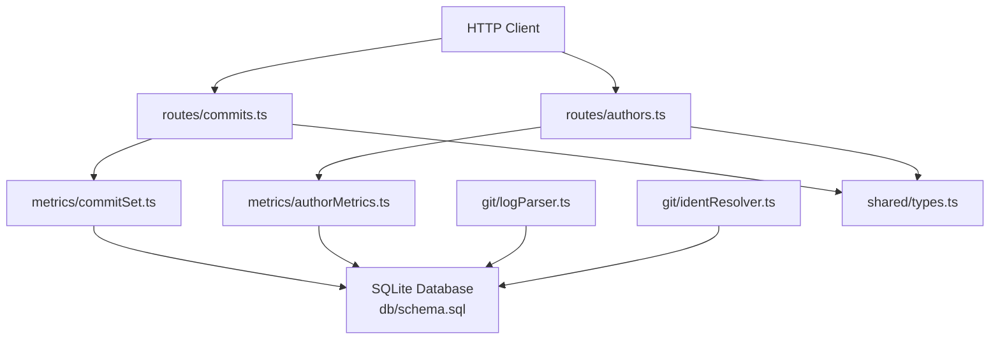
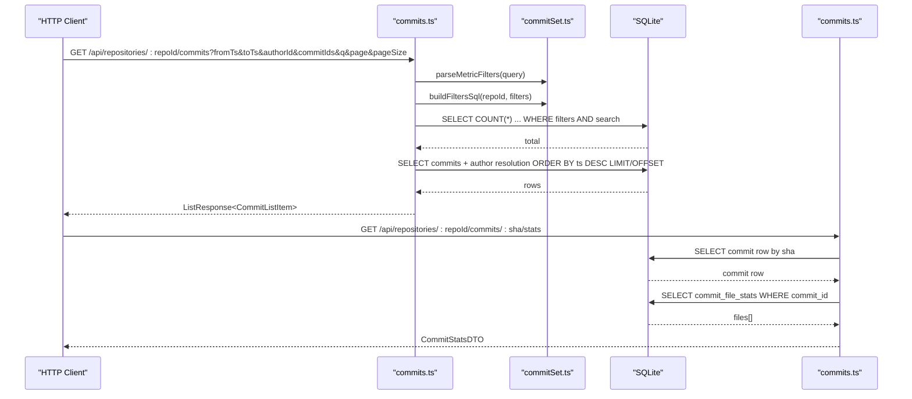
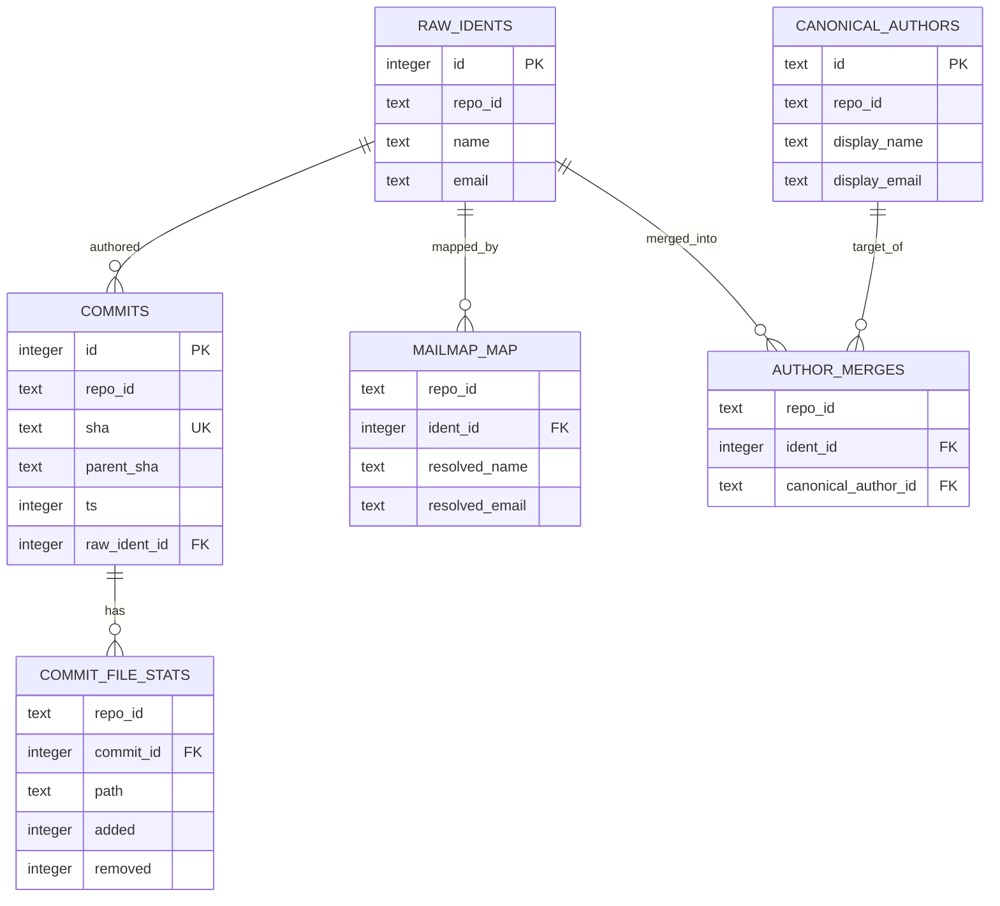
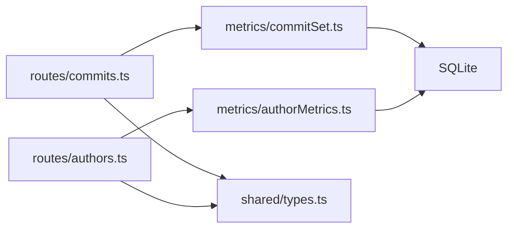

# Commits & Authors Endpoints

<cite>
**Referenced Files in This Document**
- [commits.ts](file://apps/api/src/routes/commits.ts)
- [authors.ts](file://apps/api/src/routes/authors.ts)
- [commitSet.ts](file://apps/api/src/metrics/commitSet.ts)
- [authorMetrics.ts](file://apps/api/src/metrics/authorMetrics.ts)
- [logParser.ts](file://apps/api/src/git/logParser.ts)
- [identResolver.ts](file://apps/api/src/git/identResolver.ts)
- [schema.sql](file://apps/api/src/db/schema.sql)
- [types.ts](file://packages/shared/src/types.ts)
- [commits.test.ts](file://apps/api/test/routes/commits.test.ts)
- [authors.test.ts](file://apps/api/test/routes/authors.test.ts)
</cite>

## Table of Contents
1. [Introduction](#introduction)
2. [Project Structure](#project-structure)
3. [Core Components](#core-components)
4. [Architecture Overview](#architecture-overview)
5. [Detailed Component Analysis](#detailed-component-analysis)
6. [Dependency Analysis](#dependency-analysis)
7. [Performance Considerations](#performance-considerations)
8. [Troubleshooting Guide](#troubleshooting-guide)
9. [Conclusion](#conclusion)

## Introduction
This document provides comprehensive API documentation for the commits and authors endpoints exposed by the repository analysis service. It explains how commit enumeration works, how filtering is applied, how author identities are resolved through mailmaps and manual merges, and how commit metadata and statistics are returned. It also documents the underlying git log parsing process, identity resolution mechanisms, normalization rules, and practical guidance for querying large histories efficiently.

## Project Structure
The commits and authors functionality is implemented as Express routes that query a SQLite database populated during ingestion. The shared data contracts live in a package consumed by both the API and frontend.

**Diagram sources**
- [commits.ts:32-92](file://apps/api/src/routes/commits.ts#L32-L92)
- [authors.ts:7-18](file://apps/api/src/routes/authors.ts#L7-L18)
- [commitSet.ts:31-52](file://apps/api/src/metrics/commitSet.ts#L31-L52)
- [authorMetrics.ts:43-124](file://apps/api/src/metrics/authorMetrics.ts#L43-L124)
- [schema.sql:33-91](file://apps/api/src/db/schema.sql#L33-L91)
- [logParser.ts:172-202](file://apps/api/src/git/logParser.ts#L172-L202)
- [identResolver.ts:17-62](file://apps/api/src/git/identResolver.ts#L17-L62)
- [types.ts:61-113](file://packages/shared/src/types.ts#L61-L113)

**Section sources**
- [commits.ts:32-92](file://apps/api/src/routes/commits.ts#L32-L92)
- [authors.ts:7-18](file://apps/api/src/routes/authors.ts#L7-L18)
- [commitSet.ts:31-52](file://apps/api/src/metrics/commitSet.ts#L31-L52)
- [authorMetrics.ts:43-124](file://apps/api/src/metrics/authorMetrics.ts#L43-L124)
- [schema.sql:33-91](file://apps/api/src/db/schema.sql#L33-L91)
- [logParser.ts:172-202](file://apps/api/src/git/logParser.ts#L172-L202)
- [identResolver.ts:17-62](file://apps/api/src/git/identResolver.ts#L17-L62)
- [types.ts:61-113](file://packages/shared/src/types.ts#L61-L113)

## Core Components
- Commits list endpoint returns paginated commit items with resolved author information and filtered by timestamp range, explicit commit hashes, or resolved author id. It also supports free-text search over commit SHA prefixes and resolved author name/email.
- Per-commit stats endpoint returns file-level change statistics for a specific commit SHA.
- Authors endpoint returns resolved author identities and raw git identities, including identity kind and counts.
- Shared types define request/response shapes for commits, authors, and common envelopes.

Key responsibilities:
- Route handlers validate inputs and delegate to metric filter builders and author resolvers.
- Filter builder constructs SQL conditions for time ranges, commit ID lists, and author filters.
- Author resolver folds raw idents into canonical authors using manual merges and mailmap mappings.
- Git log parser transforms streaming `git log --numstat` output into normalized commit records.
- Mailmap resolver uses `git check-mailmap` to compute stable resolved identities.

**Section sources**
- [commits.ts:32-127](file://apps/api/src/routes/commits.ts#L32-L127)
- [authors.ts:7-18](file://apps/api/src/routes/authors.ts#L7-L18)
- [commitSet.ts:58-126](file://apps/api/src/metrics/commitSet.ts#L58-L126)
- [authorMetrics.ts:43-124](file://apps/api/src/metrics/authorMetrics.ts#L43-L124)
- [logParser.ts:21-35](file://apps/api/src/git/logParser.ts#L21-L35)
- [identResolver.ts:5-16](file://apps/api/src/git/identResolver.ts#L5-L16)
- [types.ts:61-113](file://packages/shared/src/types.ts#L61-L113)

## Architecture Overview
The API layer exposes REST endpoints backed by SQLite. Ingestion populates tables such as `commits`, `raw_idents`, `commit_file_stats`, `mailmap_map`, `canonical_authors`, and `author_merges`. Query-time resolution combines these layers to produce stable author identifiers and display names.

**Diagram sources**
- [commits.ts:36-92](file://apps/api/src/routes/commits.ts#L36-L92)
- [commits.ts:94-127](file://apps/api/src/routes/commits.ts#L94-L127)
- [commitSet.ts:58-126](file://apps/api/src/metrics/commitSet.ts#L58-L126)

## Detailed Component Analysis

### Commits Enumeration Endpoint
Endpoint: `GET /api/repositories/:repoId/commits`

Purpose:
- Return a paginated list of commits for a repository.
- Support filtering by:
  - Timestamp range: `fromTs` (inclusive), `toTs` (exclusive).
  - Explicit commit hashes: `commitIds` (comma-separated SHAs).
  - Resolved author identifier: `authorId` (must be an id from the authors endpoint).
- Support free-text search: `q` matches commit SHA prefix, resolved author name, or resolved author email.
- Return pagination metadata and the size of the filtered commit set.

Request parameters:
- Path: `repoId`
- Query:
  - `fromTs`: integer UNIX seconds (optional)
  - `toTs`: integer UNIX seconds (optional)
  - `commitIds`: comma-separated lowercase hex SHAs (optional; mutually exclusive with `fromTs`/`toTs`)
  - `authorId`: string starting with `mailto:` or `canonical:` (optional)
  - `q`: string for substring search across SHA, author name, and author email (optional)
  - `page`: page number (default provided by paging helper)
  - `pageSize`: page size (default provided by paging helper)

Response envelope:
- `items`: array of `CommitListItem`
- `total`: number of matching commits
- `page`: current page
- `pageSize`: requested page size
- `commitCount`: size of the filtered commit set |H|

Filtering behavior:
- Time range uses `[fromTs, toTs)` semantics.
- `commitIds` must contain at least one SHA and is limited to a maximum count.
- `authorId` must match the stable author key format produced by the authors endpoint.
- Search terms are case-insensitive and escaped to avoid LIKE wildcard injection.

Ordering:
- Newest first by committer timestamp, then by internal commit id.

Example queries:
- List newest commits with default pagination.
- Filter by author contributions using `authorId=mailto:bob@example.com`.
- Filter by date range using `fromTs` and `toTs`.
- Select specific commits using `commitIds=a1b2c3,d4e5f6`.
- Search by SHA prefix or author name/email using `q`.

**Section sources**
- [commits.ts:32-92](file://apps/api/src/routes/commits.ts#L32-L92)
- [commitSet.ts:58-126](file://apps/api/src/metrics/commitSet.ts#L58-L126)
- [commits.test.ts:16-98](file://apps/api/test/routes/commits.test.ts#L16-L98)

### Per-Commit Statistics Endpoint
Endpoint: `GET /api/repositories/:repoId/commits/:sha/stats`

Purpose:
- Retrieve detailed file-level change statistics for a single commit.

Path parameters:
- `repoId`: repository identifier
- `sha`: commit SHA (case-insensitive)

Response fields:
- `sha`: normalized lowercase commit SHA
- `parentSha`: parent commit SHA or null
- `ts`: committer timestamp in UNIX seconds
- `authorId`: resolved author identifier
- `authorName`: resolved author display name
- `authorEmail`: resolved author email
- `files`: array of `CommitFileStatDTO` with `path`, `added`, `removed`

Behavior:
- Returns 404 if the commit does not exist in the repository.
- Returns empty `files` array for empty commits.

**Section sources**
- [commits.ts:94-127](file://apps/api/src/routes/commits.ts#L94-L127)
- [commits.test.ts:100-133](file://apps/api/test/routes/commits.test.ts#L100-L133)

### Authors Listing Endpoint
Endpoint: `GET /api/repositories/:repoId/authors`

Purpose:
- Return resolved author identities and raw git identities for a repository.

Response fields:
- `authors`: array of `AuthorIdentityDTO`
  - `id`: stable author identifier (`mailto:...` or `canonical:...`)
  - `name`: representative display name
  - `email`: representative email
  - `kind`: `canonical`, `mailmap`, or `raw`
  - `commitCount`: total commits attributed to this author
  - `rawIdentCount`: number of distinct raw idents folded into this author
- `rawIdents`: array of `RawIdentDTO`
  - `id`: numeric raw ident id
  - `name`: raw git author name
  - `email`: raw git author email
  - `commitCount`: commits attributed to this raw identity

Identity resolution:
- Resolution precedence: manual merge (canonical) > mailmap > raw ident.
- Representative display values are chosen from the raw ident with the most commits; ties are broken deterministically.

**Section sources**
- [authors.ts:7-18](file://apps/api/src/routes/authors.ts#L7-L18)
- [authorMetrics.ts:43-124](file://apps/api/src/metrics/authorMetrics.ts#L43-L124)
- [authors.test.ts:16-48](file://apps/api/test/routes/authors.test.ts#L16-L48)

### Commit Metadata Structure
Shared type definitions describe commit-related payloads:

- `CommitListItem`:
  - `sha`: commit SHA
  - `parentSha`: parent commit SHA or null
  - `ts`: committer timestamp in UNIX seconds
  - `authorId`: resolved author identifier
  - `authorName`: resolved author display name
  - `authorEmail`: resolved author email

- `CommitFileStatDTO`:
  - `path`: file path
  - `added`: added lines
  - `removed`: removed lines

- `CommitStatsDTO`:
  - Same top-level commit fields plus `files` array of `CommitFileStatDTO`

- `ListResponse<T>`:
  - `items`: array of items
  - `total`: total count
  - `page`: current page
  - `pageSize`: page size
  - `commitCount`: optional size of the filtered commit set

**Section sources**
- [types.ts:61-86](file://packages/shared/src/types.ts#L61-L86)
- [types.ts:231-238](file://packages/shared/src/types.ts#L231-L238)

### Author Information and Identity Resolution
Author identity resolution combines three layers:

1. Raw idents: exact `(name, email)` pairs from commits.
2. Mailmap mapping: computed via `git check-mailmap` against `.mailmap` at HEAD.
3. Manual canonical merges: user-defined canonical authors merging multiple raw idents.

Stable author key:
- If a manual merge exists, the key is `canonical:<id>`.
- Otherwise, the key is `mailto:<lowercased resolved email>`.

Display name and email:
- Prefer canonical display values when present.
- Fall back to mailmap-resolved values.
- Finally fall back to raw ident values.

Kind classification:
- `canonical`: resolved via manual merge.
- `mailmap`: resolved via mailmap.
- `raw`: no transformation applied.

**Section sources**
- [commitSet.ts:31-52](file://apps/api/src/metrics/commitSet.ts#L31-L52)
- [authorMetrics.ts:33-124](file://apps/api/src/metrics/authorMetrics.ts#L33-L124)
- [identResolver.ts:5-16](file://apps/api/src/git/identResolver.ts#L5-L16)
- [schema.sql:66-91](file://apps/api/src/db/schema.sql#L66-L91)

### Git Log Parsing Process
The ingestion pipeline streams `git log --numstat` output and parses it incrementally:

- Record delimiter: custom separator starts each commit record.
- Fields per commit: SHA, parents, committer timestamp, author name, author email.
- File changes: numstat rows with added/removed lines and path.
- Binary files are skipped.
- Renames are normalized to the new path, handling brace syntax and C-quoting.
- Every non-merge commit produces a record, including empty diffs.

Normalization highlights:
- C-quoted paths are unescaped.
- Rename syntax is converted to effective new path.
- Invalid or binary rows are ignored.

**Section sources**
- [logParser.ts:1-19](file://apps/api/src/git/logParser.ts#L1-L19)
- [logParser.ts:47-87](file://apps/api/src/git/logParser.ts#L47-L87)
- [logParser.ts:97-130](file://apps/api/src/git/logParser.ts#L97-L130)
- [logParser.ts:135-156](file://apps/api/src/git/logParser.ts#L135-L156)
- [logParser.ts:158-202](file://apps/api/src/git/logParser.ts#L158-L202)

### Relationship Between Commits and Authors
Database relationships:
- `commits.raw_ident_id` references `raw_idents.id`.
- `author_merges` maps raw idents to canonical authors.
- `canonical_authors` stores display name/email for merged authors.
- `mailmap_map` stores resolved identities from `.mailmap`.

At query time:
- Commits join raw idents and both resolution layers.
- Stable author keys and display values are computed consistently across endpoints.

**Diagram sources**
- [schema.sql:33-91](file://apps/api/src/db/schema.sql#L33-L91)

**Section sources**
- [schema.sql:33-91](file://apps/api/src/db/schema.sql#L33-L91)
- [commitSet.ts:31-52](file://apps/api/src/metrics/commitSet.ts#L31-L52)

## Dependency Analysis
The following diagram shows runtime dependencies between route handlers, metric utilities, and data access components.

**Diagram sources**
- [commits.ts:1-14](file://apps/api/src/routes/commits.ts#L1-L14)
- [authors.ts:1-5](file://apps/api/src/routes/authors.ts#L1-L5)
- [commitSet.ts:1-3](file://apps/api/src/metrics/commitSet.ts#L1-L3)
- [authorMetrics.ts:1-11](file://apps/api/src/metrics/authorMetrics.ts#L1-L11)
- [types.ts:1-6](file://packages/shared/src/types.ts#L1-L6)

**Section sources**
- [commits.ts:1-14](file://apps/api/src/routes/commits.ts#L1-L14)
- [authors.ts:1-5](file://apps/api/src/routes/authors.ts#L1-L5)
- [commitSet.ts:1-3](file://apps/api/src/metrics/commitSet.ts#L1-L3)
- [authorMetrics.ts:1-11](file://apps/api/src/metrics/authorMetrics.ts#L1-L11)
- [types.ts:1-6](file://packages/shared/src/types.ts#L1-L6)

## Performance Considerations
- Pagination: Use `page` and `pageSize` to limit result sets. The list endpoint orders by timestamp descending and applies LIMIT/OFFSET.
- Filtering: Prefer precise filters:
  - Use `authorId` instead of substring search when possible.
  - Use `fromTs`/`toTs` to constrain commit sets.
  - Use `commitIds` for small, explicit selections; there is a maximum allowed count.
- Search: Free-text search performs LIKE operations on SHA and author fields; keep search terms narrow.
- Large histories:
  - Avoid broad searches without time bounds.
  - Combine filters to reduce result sets.
  - Use the authors endpoint to discover stable `authorId` values before filtering.
- Ingestion performance:
  - Git log parsing streams output and skips binary files.
  - Mailmap resolution runs only when `.mailmap` exists at HEAD.

[No sources needed since this section provides general guidance]

## Troubleshooting Guide
Common issues and resolutions:

- Repository not ready:
  - Symptom: 409 error when accessing commits or authors.
  - Cause: Repository ingestion is still queued or processing.
  - Action: Wait until status becomes ready before querying.

- Unknown repository:
  - Symptom: 404 error.
  - Cause: `repoId` does not exist.
  - Action: Verify repository ingestion completed successfully.

- Commit not found:
  - Symptom: 404 error with code `COMMIT_NOT_FOUND`.
  - Cause: SHA does not belong to the repository.
  - Action: Confirm SHA and repository association.

- Invalid filter combinations:
  - Symptom: Bad request errors.
  - Causes:
    - Combining `commitIds` with `fromTs`/`toTs`.
    - Empty or invalid `commitIds`.
    - `fromTs` greater than `toTs`.
    - `authorId` not prefixed with `mailto:` or `canonical:`.
  - Action: Adjust query parameters according to documented constraints.

- Author identity mismatches:
  - Symptom: Unexpected author grouping or display names.
  - Causes:
    - Missing or outdated `.mailmap`.
    - Manual canonical merges not configured.
  - Action: Update `.mailmap` and re-run mailmap resolution; configure canonical merges where necessary.

**Section sources**
- [commits.test.ts:127-140](file://apps/api/test/routes/commits.test.ts#L127-L140)
- [authors.test.ts:50-54](file://apps/api/test/routes/authors.test.ts#L50-L54)
- [commitSet.ts:71-98](file://apps/api/src/metrics/commitSet.ts#L71-L98)

## Conclusion
The commits and authors endpoints provide robust, normalized access to repository history. Commits can be enumerated with flexible filtering and search, while authors expose stable identity resolution combining mailmaps and manual merges. The design emphasizes predictable author keys, clear metadata structures, and efficient query patterns suitable for large histories. Clients should prefer precise filters, leverage pagination, and use the authors endpoint to resolve author identities before filtering commit lists.

[No sources needed since this section summarizes without analyzing specific files]