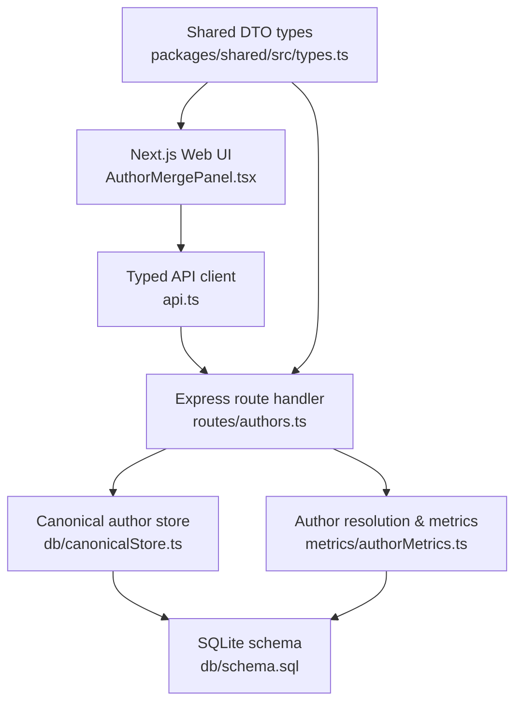
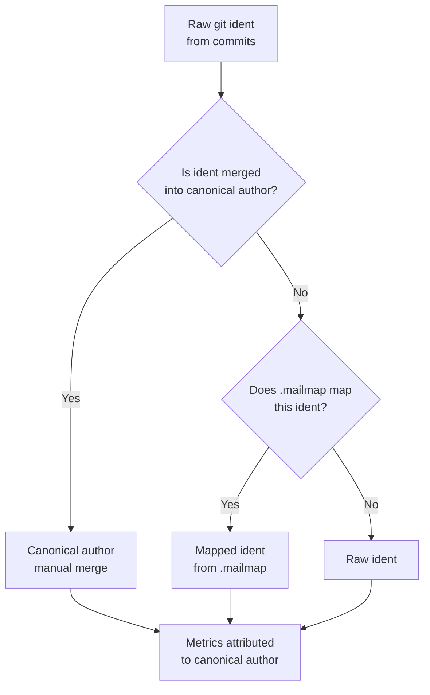
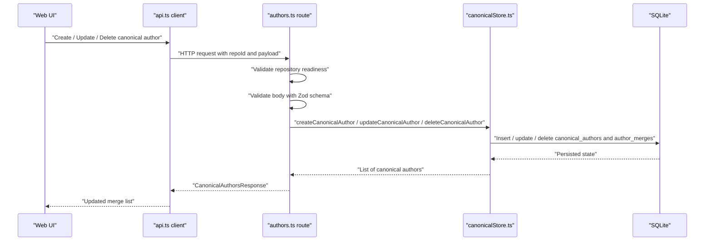
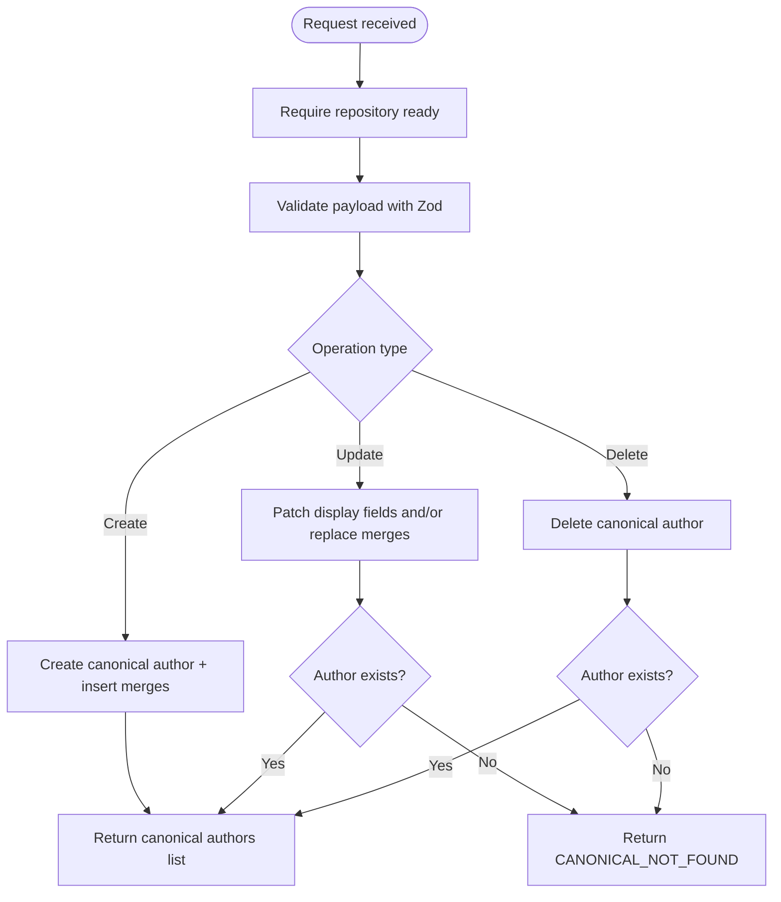
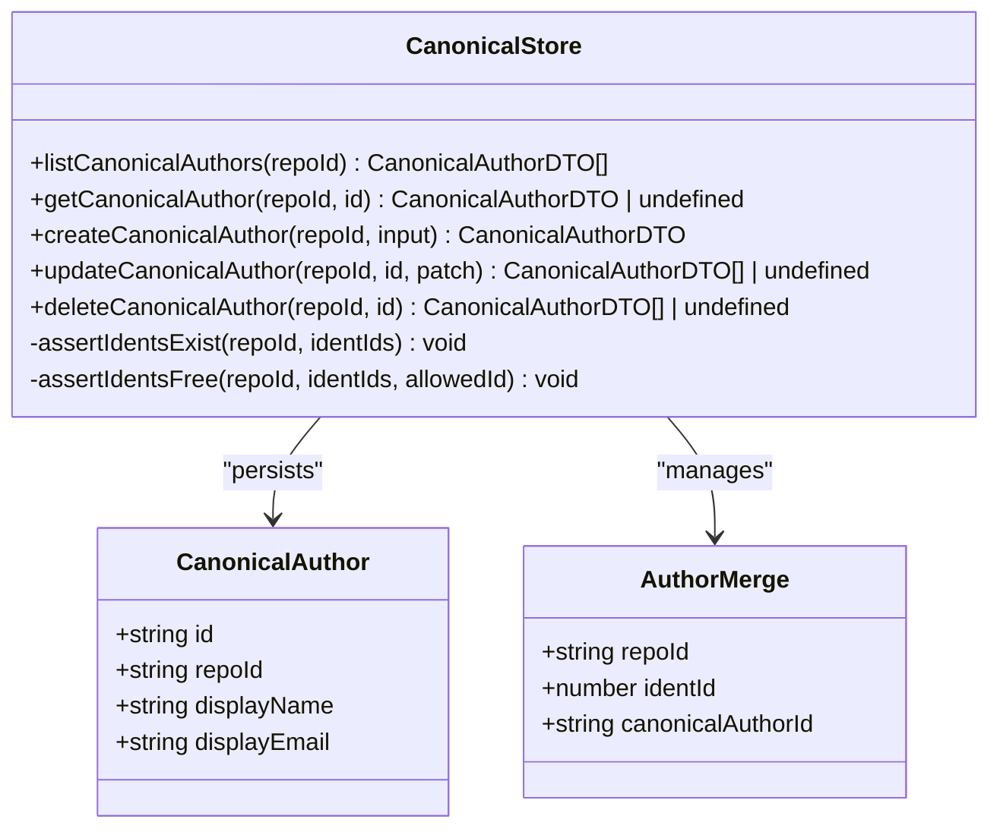
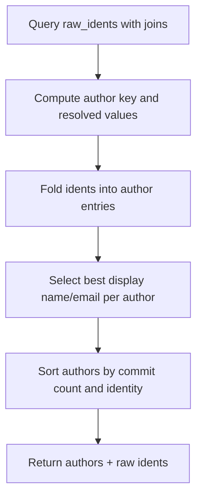
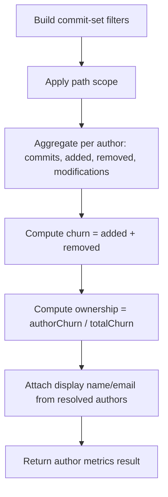
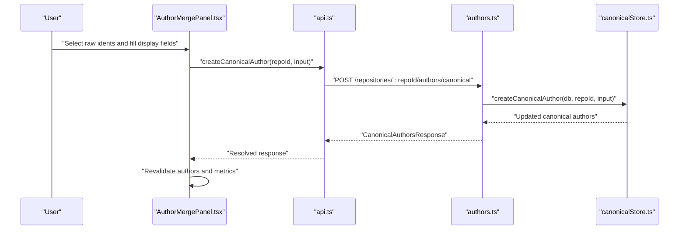
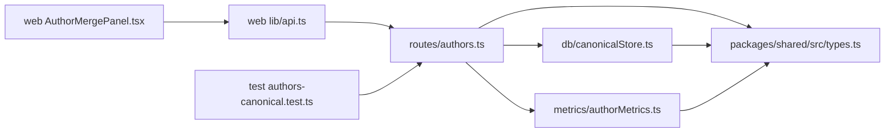

# Canonical Author Management

<cite>
**Referenced Files in This Document**
- [README.md](file://README.md)
- [schema.sql](file://apps/api/src/db/schema.sql)
- [authors.ts](file://apps/api/src/routes/authors.ts)
- [canonicalStore.ts](file://apps/api/src/db/canonicalStore.ts)
- [authorMetrics.ts](file://apps/api/src/metrics/authorMetrics.ts)
- [types.ts](file://packages/shared/src/types.ts)
- [api.ts](file://apps/web/src/lib/api.ts)
- [AuthorMergePanel.tsx](file://apps/web/src/components/metrics/AuthorMergePanel.tsx)
- [authors-canonical.test.ts](file://apps/api/test/routes/authors-canonical.test.ts)
</cite>

## Table of Contents
1. [Introduction](#introduction)
2. [Project Structure](#project-structure)
3. [Core Components](#core-components)
4. [Architecture Overview](#architecture-overview)
5. [Detailed Component Analysis](#detailed-component-analysis)
6. [Dependency Analysis](#dependency-analysis)
7. [Performance Considerations](#performance-considerations)
8. [Troubleshooting Guide](#troubleshooting-guide)
9. [Conclusion](#conclusion)

## Introduction
This document explains the canonical author management feature of the Repo Analysis Tool (RAT). It covers how raw git identities are manually merged into stable canonical authors, how those merges override automatic `.mailmap` resolution, and how the resulting identity layer affects author listings, metrics, ownership, and filtering.

The canonical-author system is a manual merge tier that sits above repository `.mailmap` mappings and raw commit idents. It enables operators to group multiple git identities under one display name and email, so commits and churn are attributed consistently across all dashboard views.

## Project Structure
Canonical author management spans several layers:

- **API routes**: expose REST endpoints for listing, creating, updating, and deleting canonical authors.
- **Database store**: persists canonical authors and their merged raw identities.
- **Metrics engine**: resolves raw idents to canonical authors at query time and computes per-author metrics.
- **Shared types**: define request/response DTOs used by both API and web.
- **Web client**: provides an interactive panel for selecting raw identities and merging them into canonical authors.
- **Tests**: validate validation rules, conflict detection, deletion behavior, and metric attribution.

**Diagram sources**
- [AuthorMergePanel.tsx:10-14](file://apps/web/src/components/metrics/AuthorMergePanel.tsx#L10-L14)
- [api.ts:272-307](file://apps/web/src/lib/api.ts#L272-L307)
- [authors.ts:46-100](file://apps/api/src/routes/authors.ts#L46-L100)
- [canonicalStore.ts:6-10](file://apps/api/src/db/canonicalStore.ts#L6-L10)
- [schema.sql:66-91](file://apps/api/src/db/schema.sql#L66-L91)
- [authorMetrics.ts:35-42](file://apps/api/src/metrics/authorMetrics.ts#L35-L42)
- [types.ts:88-133](file://packages/shared/src/types.ts#L88-L133)

**Section sources**
- [README.md:176-239](file://README.md#L176-L239)

## Core Components
The canonical-author feature consists of five main parts:

| Layer | Responsibility | Key files |
|---|---|---|
| API routes | Validate input, enforce repository readiness, delegate to store and metrics | `apps/api/src/routes/authors.ts` |
| Database store | CRUD over canonical authors and merge relationships; integrity checks | `apps/api/src/db/canonicalStore.ts` |
| Metrics engine | Resolve raw idents to canonical authors; compute per-author metrics | `apps/api/src/metrics/authorMetrics.ts` |
| Shared types | Define canonical author DTOs and request shapes | `packages/shared/src/types.ts` |
| Web UI | Let users select raw identities, set display fields, create/update/delete merges | `apps/web/src/components/metrics/AuthorMergePanel.tsx`, `apps/web/src/lib/api.ts` |

**Section sources**
- [authors.ts:1-44](file://apps/api/src/routes/authors.ts#L1-L44)
- [canonicalStore.ts:1-10](file://apps/api/src/db/canonicalStore.ts#L1-L10)
- [authorMetrics.ts:1-14](file://apps/api/src/metrics/authorMetrics.ts#L1-L14)
- [types.ts:88-133](file://packages/shared/src/types.ts#L88-L133)
- [AuthorMergePanel.tsx:10-14](file://apps/web/src/components/metrics/AuthorMergePanel.tsx#L10-L14)

## Architecture Overview
Canonical author management follows a layered resolution model:

1. **Raw ident**: the exact `name <email>` from a commit.
2. **Manual canonical merge**: operator-selected mapping of one or more raw idents to a canonical author.
3. **Mailmap mapping**: repository-defined `.mailmap` resolution.
4. **Query-time resolution**: canonical > mailmap > raw.

**Diagram sources**
- [authorMetrics.ts:35-42](file://apps/api/src/metrics/authorMetrics.ts#L35-L42)
- [schema.sql:66-91](file://apps/api/src/db/schema.sql#L66-L91)

At the API level, canonical author operations are scoped to a single repository. Every endpoint first requires the repository to be ready, then delegates to the canonical store for persistence and returns the updated list of canonical authors.

**Diagram sources**
- [authors.ts:54-98](file://apps/api/src/routes/authors.ts#L54-L98)
- [canonicalStore.ts:95-180](file://apps/api/src/db/canonicalStore.ts#L95-L180)
- [api.ts:272-307](file://apps/web/src/lib/api.ts#L272-L307)

## Detailed Component Analysis

### API Routes: `/api/repositories/:repoId/authors/canonical`
The authors router exposes:

- `GET /:repoId/authors`: resolved authors plus raw idents.
- `GET /:repoId/authors/canonical`: list of manual canonical authors.
- `POST /:repoId/authors/canonical`: create a canonical author and merge selected raw idents.
- `PATCH /:repoId/authors/canonical/:canonicalId`: update display fields or replace merged idents.
- `DELETE /:repoId/authors/canonical/:canonicalId`: delete a canonical author and unmerge its idents.

Key behaviors:

- Repository readiness is enforced before any operation.
- Creation requires at least one valid raw ident id.
- Updates allow partial changes to name, email, or ident ids.
- An empty `identIds` list removes all merges and deletes the canonical author.
- Unknown canonical ids return a structured not-found error.

**Diagram sources**
- [authors.ts:54-98](file://apps/api/src/routes/authors.ts#L54-L98)

**Section sources**
- [authors.ts:15-44](file://apps/api/src/routes/authors.ts#L15-L44)
- [authors.ts:54-98](file://apps/api/src/routes/authors.ts#L54-L98)

### Database Store: Canonical Authors and Merges
The canonical store manages two tables:

- `canonical_authors`: stable canonical author records per repository.
- `author_merges`: many-to-one mapping from raw idents to a canonical author.

Important constraints and logic:

- All referenced raw idents must belong to the same repository.
- A raw ident cannot be merged into more than one canonical author.
- Creating a canonical author inserts the author row and all merge rows inside a transaction.
- Updating replaces the entire merge set for that canonical author.
- Deleting an author cascades through the merge table.
- If an update leaves no merged idents, the canonical author is removed automatically.

**Diagram sources**
- [canonicalStore.ts:18-50](file://apps/api/src/db/canonicalStore.ts#L18-L50)
- [canonicalStore.ts:95-180](file://apps/api/src/db/canonicalStore.ts#L95-L180)
- [schema.sql:77-91](file://apps/api/src/db/schema.sql#L77-L91)

**Section sources**
- [canonicalStore.ts:52-93](file://apps/api/src/db/canonicalStore.ts#L52-L93)
- [canonicalStore.ts:95-180](file://apps/api/src/db/canonicalStore.ts#L95-L180)
- [schema.sql:77-91](file://apps/api/src/db/schema.sql#L77-L91)

### Metrics Engine: Resolution and Attribution
The metrics engine resolves every raw ident to an author using precedence:

1. Manual canonical merge.
2. `.mailmap` mapping.
3. Raw ident.

It also computes per-author metrics such as commit count, added lines, removed lines, modifications, churn, and ownership share.

Resolution details:

- The author key is computed once per raw ident.
- Each raw ident contributes its commit count to the resolved author.
- The representative display name/email is chosen from the contributing ident with the most commits, with ties broken by raw email.
- The resolved author kind is the highest-precedence source among its contributors.

**Diagram sources**
- [authorMetrics.ts:43-124](file://apps/api/src/metrics/authorMetrics.ts#L43-L124)

Per-author metrics use the same author key and support path scoping. Ownership is calculated as the fraction of object churn attributed to each author.

**Diagram sources**
- [authorMetrics.ts:137-205](file://apps/api/src/metrics/authorMetrics.ts#L137-L205)

**Section sources**
- [authorMetrics.ts:33-42](file://apps/api/src/metrics/authorMetrics.ts#L33-L42)
- [authorMetrics.ts:43-124](file://apps/api/src/metrics/authorMetrics.ts#L43-L124)
- [authorMetrics.ts:137-205](file://apps/api/src/metrics/authorMetrics.ts#L137-L205)

### Shared Types: Canonical Author DTOs
The shared types define the canonical-author contract between API and web:

| Type | Purpose |
|---|---|
| `AuthorKind` | Indicates whether an author comes from canonical, mailmap, or raw resolution. |
| `AuthorIdentityDTO` | Stable author identity including commit count and raw ident count. |
| `CanonicalAuthorDTO` | Manually created canonical author with merged raw ident ids. |
| `CanonicalAuthorsResponse` | Response envelope containing the list of canonical authors. |
| `CanonicalAuthorInput` | Request body for creating or updating a canonical author. |

These types ensure consistent payloads for listing, creation, updates, and deletion.

**Section sources**
- [types.ts:88-133](file://packages/shared/src/types.ts#L88-L133)

### Web UI: Author Merge Panel
The web UI provides an interactive interface for canonical author management:

- Lists raw identities sorted by commit count.
- Shows which identities are already merged.
- Allows selecting multiple raw idents and setting display name/email.
- Calls the API to create a new canonical author.
- Supports removing individual idents from an existing merge.
- Supports deleting a canonical author entirely.
- Revalidates authors, canonical authors, and metrics after mutations.

**Diagram sources**
- [AuthorMergePanel.tsx:90-114](file://apps/web/src/components/metrics/AuthorMergePanel.tsx#L90-L114)
- [api.ts:272-307](file://apps/web/src/lib/api.ts#L272-L307)
- [authors.ts:68-98](file://apps/api/src/routes/authors.ts#L68-L98)
- [canonicalStore.ts:95-180](file://apps/api/src/db/canonicalStore.ts#L95-L180)

**Section sources**
- [AuthorMergePanel.tsx:10-14](file://apps/web/src/components/metrics/AuthorMergePanel.tsx#L10-L14)
- [AuthorMergePanel.tsx:39-62](file://apps/web/src/components/metrics/AuthorMergePanel.tsx#L39-L62)
- [AuthorMergePanel.tsx:90-114](file://apps/web/src/components/metrics/AuthorMergePanel.tsx#L90-L114)
- [AuthorMergePanel.tsx:116-272](file://apps/web/src/components/metrics/AuthorMergePanel.tsx#L116-L272)
- [api.ts:272-307](file://apps/web/src/lib/api.ts#L272-L307)

### Tests: Validation, Conflicts, and Behavior
The canonical-author tests verify:

- Empty initial state and listing after creation.
- Folding of merged idents into one canonical author.
- Metric attribution to the canonical author.
- Support for author-id filtering.
- Validation errors for unknown idents, empty selections, missing fields, and invalid emails.
- Conflict detection when an ident is already merged elsewhere.
- Updating display fields and replacing merged idents.
- Automatic deletion of a canonical author when no idents remain.
- Explicit deletion returning not-found on repeated calls.
- Repository readiness requirement.

**Section sources**
- [authors-canonical.test.ts:33-53](file://apps/api/test/routes/authors-canonical.test.ts#L33-L53)
- [authors-canonical.test.ts:55-96](file://apps/api/test/routes/authors-canonical.test.ts#L55-L96)
- [authors-canonical.test.ts:98-128](file://apps/api/test/routes/authors-canonical.test.ts#L98-L128)
- [authors-canonical.test.ts:130-184](file://apps/api/test/routes/authors-canonical.test.ts#L130-L184)
- [authors-canonical.test.ts:186-209](file://apps/api/test/routes/authors-canonical.test.ts#L186-L209)

## Dependency Analysis
The canonical-author subsystem has clear boundaries:

- Routes depend on validation middleware, services, error utilities, the canonical store, and the metrics engine.
- The canonical store depends only on the database abstraction and shared DTO types.
- The metrics engine depends on commit-set filters, object-metrics path scoping, and shared DTO types.
- The web client depends on the typed API client and shared types.
- Tests depend on the test context, repository seeds, and supertest.

**Diagram sources**
- [authors.ts:1-13](file://apps/api/src/routes/authors.ts#L1-L13)
- [canonicalStore.ts:1-4](file://apps/api/src/db/canonicalStore.ts#L1-L4)
- [authorMetrics.ts:1-12](file://apps/api/src/metrics/authorMetrics.ts#L1-L12)
- [types.ts:88-133](file://packages/shared/src/types.ts#L88-L133)
- [api.ts:272-307](file://apps/web/src/lib/api.ts#L272-L307)
- [authors-canonical.test.ts:1-6](file://apps/api/test/routes/authors-canonical.test.ts#L1-L6)

**Section sources**
- [authors.ts:1-13](file://apps/api/src/routes/authors.ts#L1-L13)
- [canonicalStore.ts:1-4](file://apps/api/src/db/canonicalStore.ts#L1-L4)
- [authorMetrics.ts:1-12](file://apps/api/src/metrics/authorMetrics.ts#L1-L12)
- [api.ts:272-307](file://apps/web/src/lib/api.ts#L272-L307)
- [authors-canonical.test.ts:1-6](file://apps/api/test/routes/authors-canonical.test.ts#L1-L6)

## Performance Considerations
Canonical author management is designed around lightweight persistence and query-time resolution:

- Canonical authors and merges are small configuration structures per repository.
- Listing canonical authors uses a single join query and in-memory grouping.
- Resolution happens at query time, avoiding expensive precomputation while keeping results consistent with manual merges.
- Integrity checks run before writes, preventing inconsistent merge states.
- The web UI revalidates only relevant SWR keys after mutations, reducing unnecessary refetches.

For very large repositories, the dominant cost remains history analysis and metrics queries rather than canonical-author operations.

[No sources needed since this section provides general guidance]

## Troubleshooting Guide
Common issues and their signals:

| Symptom | Likely cause | Expected behavior |
|---|---|---|
| Creation fails with validation error | Missing name, invalid email, empty ident selection, or too many idents | HTTP 400 with a message describing the validation failure |
| Creation fails because an ident is already merged | Another canonical author owns the raw ident | HTTP 409 with code `IDENT_ALREADY_MERGED` |
| Patch or delete returns not found | Canonical author id does not exist in the repository | HTTP 404 with code `CANONICAL_NOT_FOUND` |
| Operations fail because repository is processing | Repository is not yet ready | HTTP 409 with code `REPO_NOT_READY` |
| Merged author disappears after update | Update set `identIds` to an empty array | Canonical author is deleted; resolution falls back to mailmap or raw ident |
| Metrics still show separate authors after merge | Canonical author was not created or idents were not selected | Verify canonical author list and author resolution |

Operational recommendations:

- Always check the canonical author list before attributing metrics.
- Use the raw ident list to confirm which git identities are available for merging.
- When renaming or narrowing merges, verify that fallback resolution behaves as expected.
- Treat `IDENT_ALREADY_MERGED` as a signal to remove the ident from another canonical author first.

**Section sources**
- [authors.ts:68-98](file://apps/api/src/routes/authors.ts#L68-L98)
- [canonicalStore.ts:52-93](file://apps/api/src/db/canonicalStore.ts#L52-L93)
- [authors-canonical.test.ts:98-128](file://apps/api/test/routes/authors-canonical.test.ts#L98-L128)
- [authors-canonical.test.ts:172-209](file://apps/api/test/routes/authors-canonical.test.ts#L172-L209)

## Conclusion
Canonical author management adds a controlled, auditable layer for grouping raw git identities into stable authors. It integrates cleanly with the existing ingestion pipeline, `.mailmap` resolution, and metrics engine. The API enforces strong validation and integrity constraints, the database schema isolates canonical data per repository, and the web UI makes manual merging practical for real-world repositories where author identity drift is common.

When used correctly, this feature improves the accuracy of author attribution, ownership calculations, and historical reporting without requiring changes to repository history or automated tooling.

[No sources needed since this section summarizes without analyzing specific files]