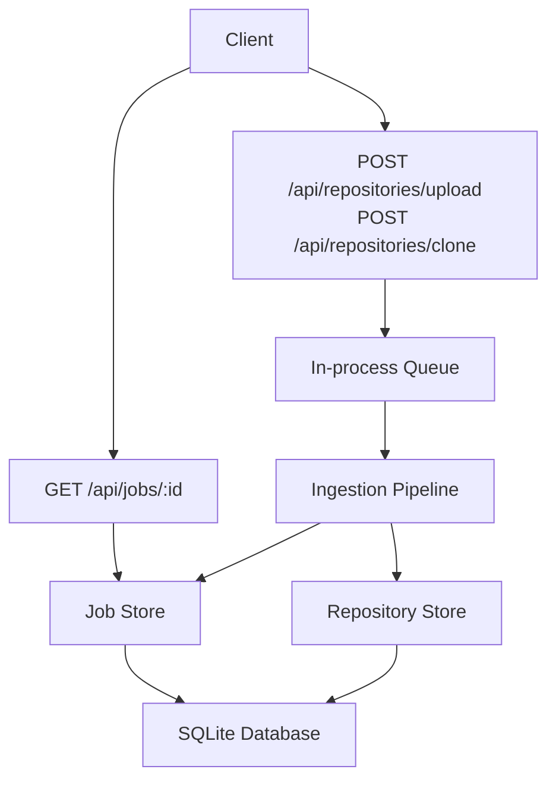
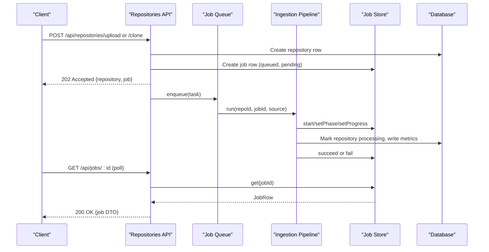
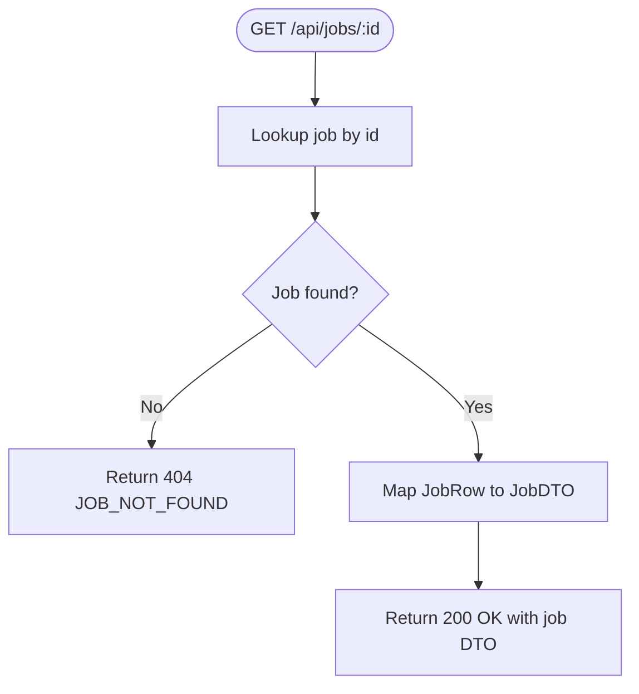
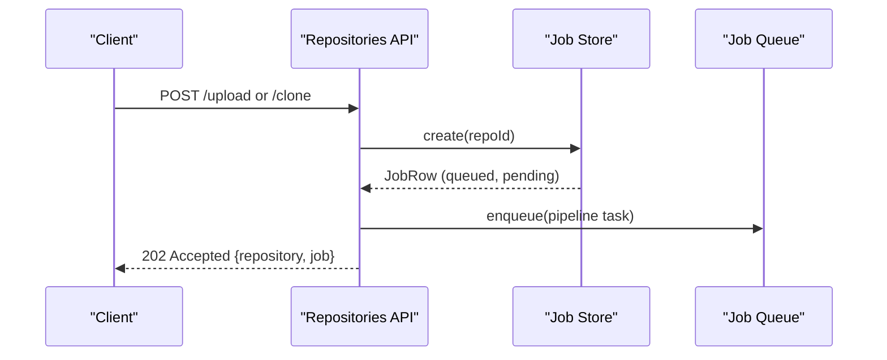
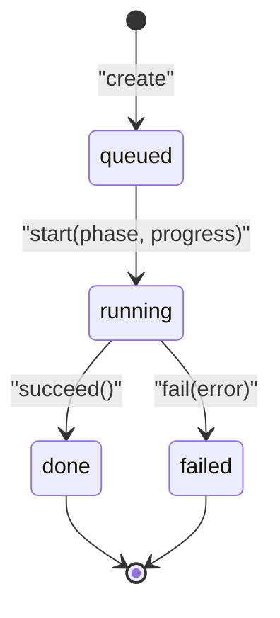
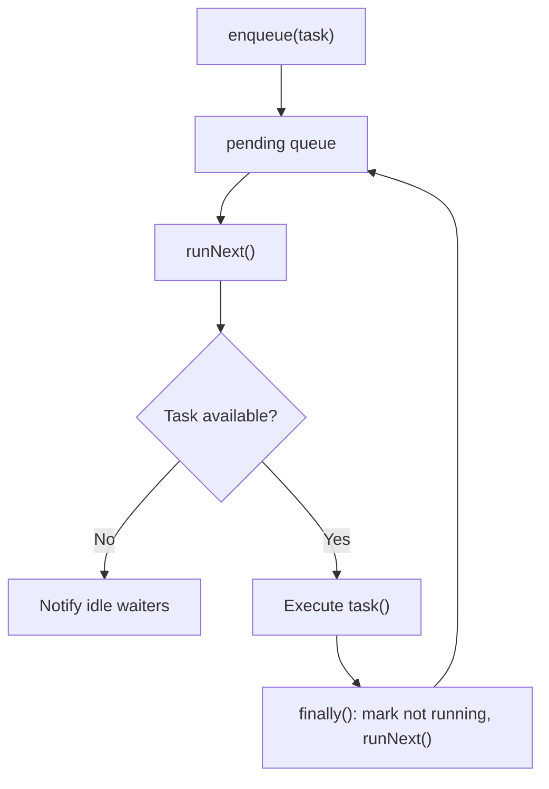
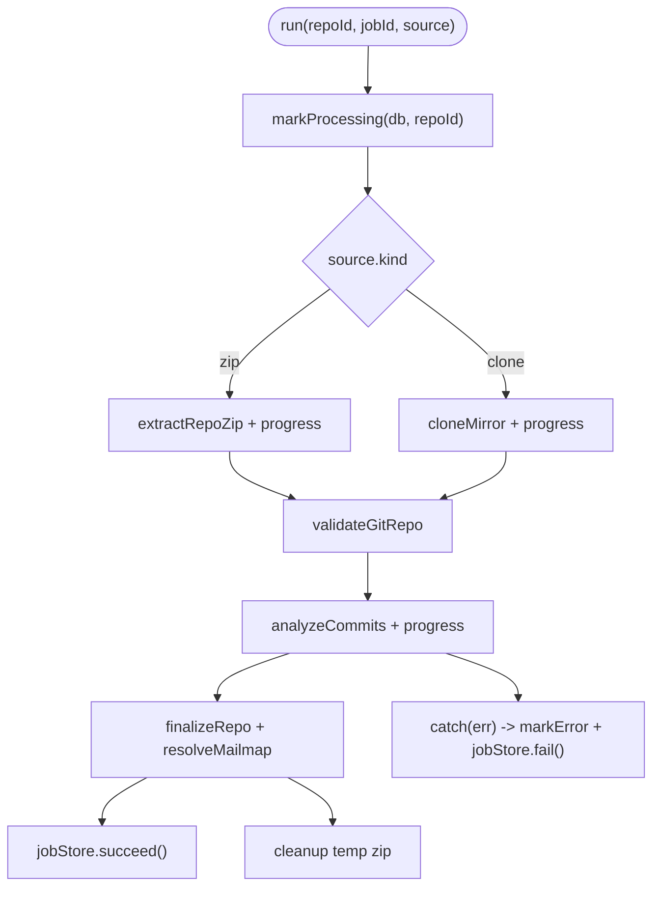
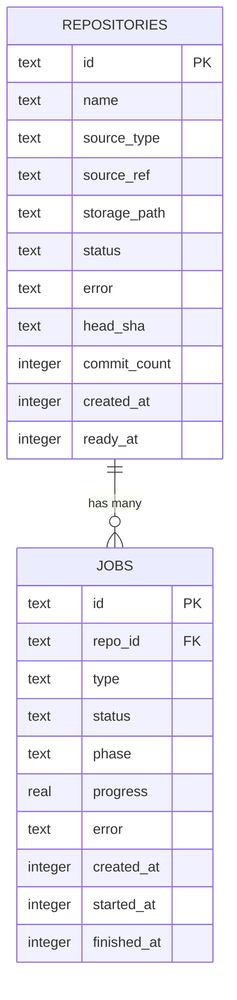
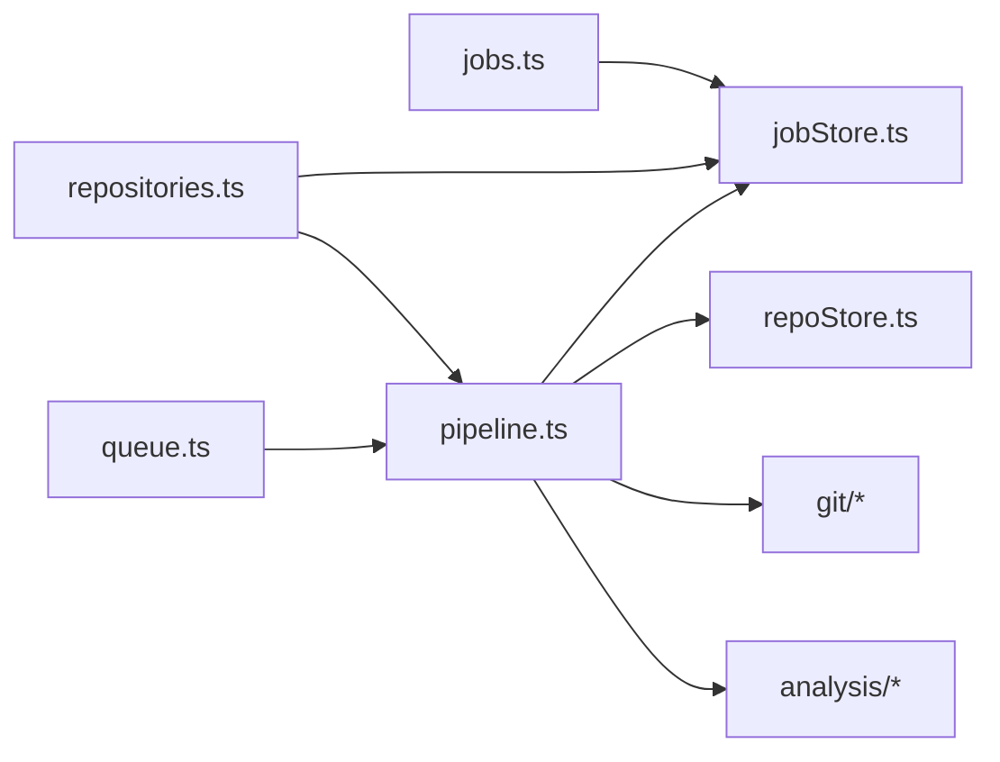

# Job Management Endpoints

<cite>
**Referenced Files in This Document**
- [jobs.ts](file://apps/api/src/routes/jobs.ts)
- [jobStore.ts](file://apps/api/src/jobs/jobStore.ts)
- [queue.ts](file://apps/api/src/jobs/queue.ts)
- [pipeline.ts](file://apps/api/src/ingest/pipeline.ts)
- [repositories.ts](file://apps/api/src/routes/repositories.ts)
- [types.ts](file://packages/shared/src/types.ts)
- [schema.sql](file://apps/api/src/db/schema.sql)
- [jobs.test.ts](file://apps/api/test/routes/jobs.test.ts)
</cite>

## Table of Contents
1. [Introduction](#introduction)
2. [Project Structure](#project-structure)
3. [Core Components](#core-components)
4. [Architecture Overview](#architecture-overview)
5. [Detailed Component Analysis](#detailed-component-analysis)
6. [Dependency Analysis](#dependency-analysis)
7. [Performance Considerations](#performance-considerations)
8. [Troubleshooting Guide](#troubleshooting-guide)
9. [Conclusion](#conclusion)
10. [Appendices](#appendices)

## Introduction
This document provides detailed API documentation for job management endpoints related to repository ingestion. It explains how jobs are created, tracked, and consumed by clients through polling. The system supports asynchronous ingestion of repositories from uploaded ZIP archives or cloned Git URLs, with progress tracking, error reporting, and lifecycle transitions. Clients should poll job status until completion or failure, handle errors gracefully, and follow best practices for long-running operations.

## Project Structure
The job management functionality is implemented across several modules:
- Routes expose REST endpoints for listing and retrieving jobs.
- A job store persists job state and metadata in the database.
- An in-process queue serializes ingestion tasks.
- An ingestion pipeline executes source extraction, validation, analysis, and finalization while updating job progress.
- Shared types define the contract between API and client.

**Diagram sources**
- [jobs.ts:22-32](file://apps/api/src/routes/jobs.ts#L22-L32)
- [repositories.ts:71-135](file://apps/api/src/routes/repositories.ts#L71-L135)
- [jobStore.ts:44-127](file://apps/api/src/jobs/jobStore.ts#L44-L127)
- [queue.ts:15-53](file://apps/api/src/jobs/queue.ts#L15-L53)
- [pipeline.ts:41-145](file://apps/api/src/ingest/pipeline.ts#L41-L145)

**Section sources**
- [jobs.ts:1-34](file://apps/api/src/routes/jobs.ts#L1-L34)
- [repositories.ts:1-166](file://apps/api/src/routes/repositories.ts#L1-L166)
- [jobStore.ts:1-129](file://apps/api/src/jobs/jobStore.ts#L1-L129)
- [queue.ts:1-55](file://apps/api/src/jobs/queue.ts#L1-L55)
- [pipeline.ts:1-146](file://apps/api/src/ingest/pipeline.ts#L1-L146)
- [types.ts:12-55](file://packages/shared/src/types.ts#L12-L55)
- [schema.sql:20-31](file://apps/api/src/db/schema.sql#L20-L31)

## Core Components
- Job routes provide a single endpoint for retrieving an individual job by ID. There is no dedicated list endpoint; clients can derive job information from repository responses that include the latest job per repository.
- Job store manages creation, updates, success/failure transitions, active-job checks, and stale-job cleanup on server restart.
- In-process queue ensures only one ingestion task runs at a time, keeping I/O and DB writes predictable.
- Ingestion pipeline coordinates cloning or ZIP extraction, validation, commit analysis, mailmap resolution, and finalization, updating job phase and progress throughout.
- Shared types define the JobDTO shape used by both API and web dashboard.

Key responsibilities:
- GET /api/jobs/:id returns the current job state including status, phase, progress, timestamps, and error.
- POST /api/repositories/upload and POST /api/repositories/clone create a repository record and a corresponding ingestion job, then enqueue processing.
- Progress is reported as a normalized value in [0, 1], mapped to phases such as extracting, cloning, validating, analyzing, finalizing, and complete.
- Failed jobs capture an error message and transition to failed status; completed jobs transition to done with phase complete.

**Section sources**
- [jobs.ts:7-32](file://apps/api/src/routes/jobs.ts#L7-L32)
- [jobStore.ts:4-42](file://apps/api/src/jobs/jobStore.ts#L4-L42)
- [queue.ts:1-55](file://apps/api/src/jobs/queue.ts#L1-L55)
- [pipeline.ts:29-39](file://apps/api/src/ingest/pipeline.ts#L29-L39)
- [types.ts:43-55](file://packages/shared/src/types.ts#L43-L55)

## Architecture Overview
The ingestion workflow is asynchronous and serialized via an in-process queue. When a client creates a repository (via upload or clone), the API responds immediately with a job identifier and initial state. The client then polls the job endpoint until the job reaches a terminal state (done or failed).

**Diagram sources**
- [repositories.ts:84-135](file://apps/api/src/routes/repositories.ts#L84-L135)
- [pipeline.ts:41-145](file://apps/api/src/ingest/pipeline.ts#L41-L145)
- [jobStore.ts:44-127](file://apps/api/src/jobs/jobStore.ts#L44-L127)
- [jobs.ts:22-32](file://apps/api/src/routes/jobs.ts#L22-L32)

## Detailed Component Analysis

### Job Retrieval Endpoint
- Endpoint: GET /api/jobs/:id
- Purpose: Retrieve the current state of a specific ingestion job.
- Behavior:
  - Validates the job exists; otherwise returns a not found error.
  - Returns a JobDTO containing id, repoId, type, status, phase, progress, error, createdAt, startedAt, finishedAt.
- Status codes:
  - 200 OK when the job exists.
  - 404 Not Found when the job does not exist.

**Diagram sources**
- [jobs.ts:22-32](file://apps/api/src/routes/jobs.ts#L22-L32)
- [jobs.test.ts:15-33](file://apps/api/test/routes/jobs.test.ts#L15-L33)

**Section sources**
- [jobs.ts:7-32](file://apps/api/src/routes/jobs.ts#L7-L32)
- [jobs.test.ts:15-57](file://apps/api/test/routes/jobs.test.ts#L15-L57)

### Job Creation and Enqueue Flow
- Endpoints:
  - POST /api/repositories/upload: Accepts a ZIP file, creates a repository and job, enqueues ingestion.
  - POST /api/repositories/clone: Accepts a Git URL, creates a repository and job, enqueues ingestion.
- Behavior:
  - Creates repository row with appropriate source type and reference.
  - Creates a job row with status queued and phase pending.
  - Immediately enqueues an ingestion task into the in-process queue.
  - Responds with 202 Accepted and includes both repository and job DTOs.

**Diagram sources**
- [repositories.ts:84-135](file://apps/api/src/routes/repositories.ts#L84-L135)
- [jobStore.ts:44-55](file://apps/api/src/jobs/jobStore.ts#L44-L55)
- [queue.ts:39-43](file://apps/api/src/jobs/queue.ts#L39-L43)

**Section sources**
- [repositories.ts:71-135](file://apps/api/src/routes/repositories.ts#L71-L135)
- [jobStore.ts:44-55](file://apps/api/src/jobs/jobStore.ts#L44-L55)
- [queue.ts:39-43](file://apps/api/src/jobs/queue.ts#L39-L43)

### Job Lifecycle and Transitions
- Job statuses:
  - queued: Initial state after creation.
  - running: Processing has started; phase indicates current stage.
  - done: Completed successfully; phase set to complete; progress set to 1.
  - failed: Processing encountered an error; error message recorded.
- Phases:
  - pending: Before processing begins.
  - extracting: ZIP extraction progress.
  - cloning: Git mirror clone progress.
  - validating: Repository validation.
  - analyzing: Commit analysis progress.
  - finalizing: Final steps before completion.
  - complete: Terminal successful phase.
- Progress:
  - Normalized value in [0, 1].
  - Updated during source extraction/cloning, analysis, and other stages.

**Diagram sources**
- [jobStore.ts:4-42](file://apps/api/src/jobs/jobStore.ts#L4-L42)
- [jobStore.ts:67-99](file://apps/api/src/jobs/jobStore.ts#L67-L99)

**Section sources**
- [jobStore.ts:4-42](file://apps/api/src/jobs/jobStore.ts#L4-L42)
- [jobStore.ts:67-99](file://apps/api/src/jobs/jobStore.ts#L67-L99)

### Asynchronous Job Processing and Queue Management
- Queue characteristics:
  - In-process FIFO queue with concurrency 1.
  - Prevents concurrent ingestion tasks to keep DB writes and disk I/O predictable.
  - Provides size() and idle() helpers for testing and introspection.
- Task execution:
  - Each ingestion task calls the pipeline with repoId, jobId, and source details.
  - Errors within tasks are caught so they do not break the queue; tasks persist their own errors.

**Diagram sources**
- [queue.ts:15-53](file://apps/api/src/jobs/queue.ts#L15-L53)

**Section sources**
- [queue.ts:1-55](file://apps/api/src/jobs/queue.ts#L1-L55)
- [pipeline.ts:133-145](file://apps/api/src/ingest/pipeline.ts#L133-L145)

### Ingestion Pipeline and Progress Tracking
- Pipeline stages:
  - Source handling: Extract ZIP or clone Git repository, updating progress based on fraction processed.
  - Validation: Validate the Git repository structure and commit count.
  - Analysis: Analyze commits and update progress proportionally.
  - Finalization: Resolve mailmaps (best-effort), finalize repository data, and mark job success.
- Error handling:
  - On failure, logs the error, marks repository as error, and sets job status to failed with error message.
  - Cleans up temporary ZIP files after processing.

**Diagram sources**
- [pipeline.ts:41-125](file://apps/api/src/ingest/pipeline.ts#L41-L125)

**Section sources**
- [pipeline.ts:29-39](file://apps/api/src/ingest/pipeline.ts#L29-L39)
- [pipeline.ts:41-125](file://apps/api/src/ingest/pipeline.ts#L41-L125)

### Relationship Between Jobs and Repository Ingestion
- Each repository has a latest ingestion job associated with it.
- Repository DTOs include the latest job, enabling clients to monitor ingestion without separate job listing.
- Deleting a repository is blocked if there is an active job for that repository.

**Diagram sources**
- [schema.sql:5-31](file://apps/api/src/db/schema.sql#L5-L31)

**Section sources**
- [repositories.ts:23-37](file://apps/api/src/routes/repositories.ts#L23-L37)
- [repositories.ts:143-151](file://apps/api/src/routes/repositories.ts#L143-L151)
- [schema.sql:5-31](file://apps/api/src/db/schema.sql#L5-L31)

## Dependency Analysis
- Jobs route depends on:
  - Services.jobStore for retrieving job rows.
  - Utility notFound for error handling.
  - toJobDTO mapping function.
- Repositories route depends on:
  - JobStore for creating jobs and checking active jobs.
  - Pipeline enqueue function for starting ingestion.
  - Utilities for path handling and error responses.
- Pipeline depends on:
  - JobStore for updating job state and progress.
  - Repository store for marking repository processing and errors.
  - Git tools and analysis modules for ingestion steps.
- Queue depends on:
  - No external services; purely in-memory.

**Diagram sources**
- [jobs.ts:1-34](file://apps/api/src/routes/jobs.ts#L1-L34)
- [repositories.ts:1-166](file://apps/api/src/routes/repositories.ts#L1-L166)
- [pipeline.ts:1-146](file://apps/api/src/ingest/pipeline.ts#L1-L146)
- [jobStore.ts:1-129](file://apps/api/src/jobs/jobStore.ts#L1-L129)
- [queue.ts:1-55](file://apps/api/src/jobs/queue.ts#L1-L55)

**Section sources**
- [jobs.ts:1-34](file://apps/api/src/routes/jobs.ts#L1-L34)
- [repositories.ts:1-166](file://apps/api/src/routes/repositories.ts#L1-L166)
- [pipeline.ts:1-146](file://apps/api/src/ingest/pipeline.ts#L1-L146)
- [jobStore.ts:1-129](file://apps/api/src/jobs/jobStore.ts#L1-L129)
- [queue.ts:1-55](file://apps/api/src/jobs/queue.ts#L1-L55)

## Performance Considerations
- Concurrency control:
  - Single-task queue prevents resource contention during large repository ingestion.
- Progress updates:
  - Frequent progress updates may increase DB write load; consider batching if needed.
- Cleanup:
  - Temporary ZIP files are removed after processing to free disk space.
- Stale job handling:
  - On server restart, interrupted jobs are marked failed and repositories are set to error state to prevent inconsistent states.

[No sources needed since this section provides general guidance]

## Troubleshooting Guide
Common issues and resolutions:
- Job not found:
  - Ensure the correct job ID is used; verify job creation response.
- Job remains in queued or running state:
  - Check server logs for ingestion errors; ensure queue is processing tasks.
- Failed job with error message:
  - Inspect the error field in the job DTO; review repository status and logs.
- Cannot delete repository:
  - Active ingestion job blocks deletion; wait for job completion or failure.

**Section sources**
- [jobs.test.ts:53-57](file://apps/api/test/routes/jobs.test.ts#L53-L57)
- [repositories.ts:143-151](file://apps/api/src/routes/repositories.ts#L143-L151)
- [pipeline.ts:114-124](file://apps/api/src/ingest/pipeline.ts#L114-L124)

## Conclusion
The job management endpoints provide a robust mechanism for asynchronous repository ingestion with clear lifecycle transitions, progress tracking, and error reporting. Clients should create ingestion jobs via repository endpoints, poll the job endpoint for status updates, and handle failures gracefully. The in-process queue ensures predictable performance, while the pipeline updates job state throughout each ingestion phase. Best practices include exponential backoff for polling, respecting rate limits, and cleaning up resources appropriately.

[No sources needed since this section summarizes without analyzing specific files]

## Appendices

### API Definitions

#### GET /api/jobs/:id
- Description: Retrieve the current state of a specific ingestion job.
- Path parameters:
  - id: string — Job identifier.
- Response:
  - 200 OK: JobDTO object.
  - 404 Not Found: ApiErrorBody with code JOB_NOT_FOUND.
- JobDTO fields:
  - id: string
  - repoId: string
  - type: 'ingest'
  - status: 'queued' | 'running' | 'done' | 'failed'
  - phase: 'pending' | 'extracting' | 'cloning' | 'validating' | 'analyzing' | 'finalizing' | 'complete'
  - progress: number in [0, 1]
  - error: string | null
  - createdAt: number (UNIX timestamp)
  - startedAt: number | null
  - finishedAt: number | null

**Section sources**
- [jobs.ts:7-32](file://apps/api/src/routes/jobs.ts#L7-L32)
- [types.ts:43-55](file://packages/shared/src/types.ts#L43-L55)

#### POST /api/repositories/upload
- Description: Upload a ZIP archive to ingest a repository.
- Request:
  - multipart/form-data with field file containing a .zip archive.
- Response:
  - 202 Accepted: { repository: RepositoryDTO, job: JobDTO }.
  - 400 Bad Request: If file is missing or not a ZIP.
- Notes:
  - Creates a repository and a job; enqueues ingestion asynchronously.

**Section sources**
- [repositories.ts:84-115](file://apps/api/src/routes/repositories.ts#L84-L115)

#### POST /api/repositories/clone
- Description: Clone a Git repository to ingest.
- Request body:
  - url: string — Must be http(s)://, git://, ssh://, or git@ URL.
  - name: string (optional) — Display name; derived from URL if omitted.
- Response:
  - 202 Accepted: { repository: RepositoryDTO, job: JobDTO }.
  - 400 Bad Request: If URL is invalid.
- Notes:
  - Creates a repository and a job; enqueues ingestion asynchronously.

**Section sources**
- [repositories.ts:117-135](file://apps/api/src/routes/repositories.ts#L117-L135)

### Polling Patterns and Best Practices
- Polling strategy:
  - Use exponential backoff with jitter to avoid overwhelming the server.
  - Stop polling when job status is done or failed.
  - Handle transient network errors and retry requests.
- Error handling:
  - Inspect job.error for detailed failure reasons.
  - For repository-level errors, check repository.status and repository.error.
- Monitoring:
  - Update UI indicators based on job.phase and job.progress.
  - Provide user feedback for long-running operations.

[No sources needed since this section provides general guidance]