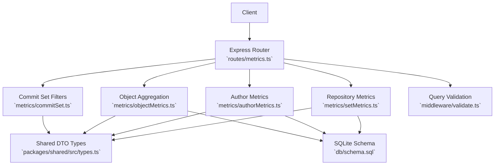
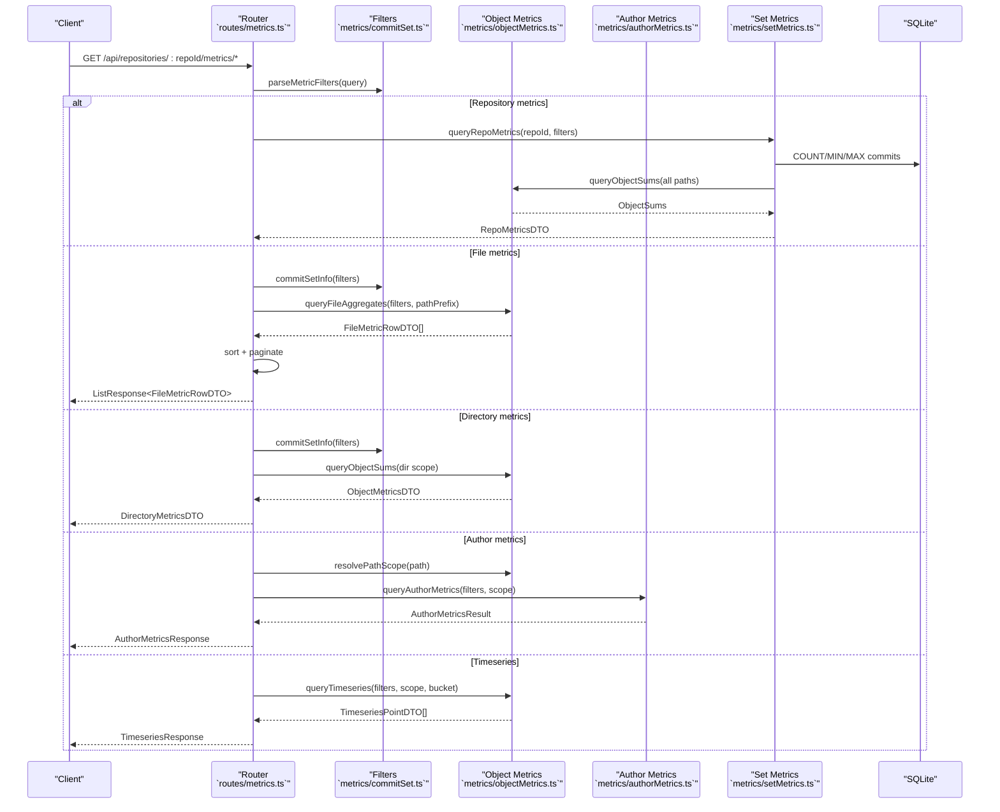
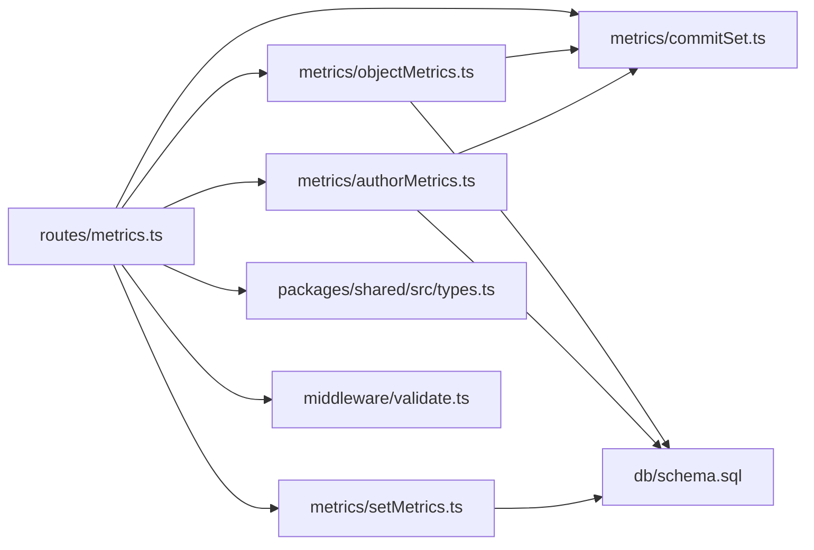

# Metrics Query Endpoints

<cite>
**Referenced Files in This Document**
- [metrics.ts](file://apps/api/src/routes/metrics.ts)
- [objectMetrics.ts](file://apps/api/src/metrics/objectMetrics.ts)
- [authorMetrics.ts](file://apps/api/src/metrics/authorMetrics.ts)
- [commitSet.ts](file://apps/api/src/metrics/commitSet.ts)
- [setMetrics.ts](file://apps/api/src/metrics/setMetrics.ts)
- [types.ts](file://packages/shared/src/types.ts)
- [validate.ts](file://apps/api/src/middleware/validate.ts)
- [schema.sql](file://apps/api/src/db/schema.sql)
- [metrics.test.ts](file://apps/api/test/routes/metrics.test.ts)
</cite>

## Table of Contents
1. [Introduction](#introduction)
2. [Project Structure](#project-structure)
3. [Core Components](#core-components)
4. [Architecture Overview](#architecture-overview)
5. [Detailed Component Analysis](#detailed-component-analysis)
6. [Dependency Analysis](#dependency-analysis)
7. [Performance Considerations](#performance-considerations)
8. [Troubleshooting Guide](#troubleshooting-guide)
9. [Conclusion](#conclusion)

## Introduction
This document provides comprehensive API documentation for the metrics query endpoints that expose repository, file, directory, author, commit-set, and timeseries metrics. The endpoints compute metrics over a filtered commit set H and an optional path scope:

- Growth: δ = l⁺ − l⁻
- Churn: λ = l⁺ + l⁻
- Modification frequency: η = n_H,o / |H|
- Churn rate: ρ = λ / |H|
- Author ownership: ω = λ_H,o,a / λ_H,o

The API supports filtering by timestamp range, explicit commit SHAs, resolved author identity, path prefix or subtree, sorting, pagination, and time-bucketed aggregation.

## Project Structure
The metrics functionality is implemented as an Express router with dedicated modules for commit-set filtering, object-level aggregation, author resolution, and shared DTO types.



**Diagram sources**
- [metrics.ts:1-199](file://apps/api/src/routes/metrics.ts#L1-L199)
- [commitSet.ts:1-146](file://apps/api/src/metrics/commitSet.ts#L1-L146)
- [objectMetrics.ts:1-218](file://apps/api/src/metrics/objectMetrics.ts#L1-L218)
- [authorMetrics.ts:1-199](file://apps/api/src/metrics/authorMetrics.ts#L1-L199)
- [setMetrics.ts:1-36](file://apps/api/src/metrics/setMetrics.ts#L1-L36)
- [types.ts:128-226](file://packages/shared/src/types.ts#L128-L226)
- [validate.ts:1-70](file://apps/api/src/middleware/validate.ts#L1-L70)
- [schema.sql:1-106](file://apps/api/src/db/schema.sql#L1-L106)

**Section sources**
- [metrics.ts:1-199](file://apps/api/src/routes/metrics.ts#L1-L199)
- [types.ts:128-226](file://packages/shared/src/types.ts#L128-L226)

## Core Components
- Commit-set filters define the commit set H through timestamp ranges, explicit commit SHAs, and resolved author identity.
- Object metrics compute l⁺ (added), l⁻ (removed), modifications, growth, churn, modification frequency, and churn rate.
- Author metrics compute per-author churn and ownership relative to total churn.
- Repository metrics aggregate all paths under the commit set.
- File metrics return per-file rows with sorting and pagination.
- Directory metrics return a directory’s own metrics plus descendant directories up to a bounded depth.
- Timeseries metrics return dense buckets of commits and churn by day or week.

**Section sources**
- [commitSet.ts:5-146](file://apps/api/src/metrics/commitSet.ts#L5-L146)
- [objectMetrics.ts:11-218](file://apps/api/src/metrics/objectMetrics.ts#L11-L218)
- [authorMetrics.ts:13-199](file://apps/api/src/metrics/authorMetrics.ts#L13-L199)
- [setMetrics.ts:6-36](file://apps/api/src/metrics/setMetrics.ts#L6-L36)

## Architecture Overview
The metrics router exposes five metric categories plus timeseries data. Each endpoint resolves a ready repository, parses common filters, applies path scoping where applicable, computes aggregates from SQLite, and returns typed DTOs.



**Diagram sources**
- [metrics.ts:46-195](file://apps/api/src/routes/metrics.ts#L46-L195)
- [commitSet.ts:58-145](file://apps/api/src/metrics/commitSet.ts#L58-L145)
- [objectMetrics.ts:52-218](file://apps/api/src/metrics/objectMetrics.ts#L52-L218)
- [authorMetrics.ts:130-199](file://apps/api/src/metrics/authorMetrics.ts#L130-L199)
- [setMetrics.ts:26-36](file://apps/api/src/metrics/setMetrics.ts#L26-L36)

## Detailed Component Analysis

### Common Filter Parameters
All metrics endpoints accept common commit-set filters:

- `fromTs`: UNIX seconds; inclusive lower bound on committer timestamp.
- `toTs`: UNIX seconds; exclusive upper bound on committer timestamp.
- `commitIds`: Comma-separated list of lowercase SHA strings. Mutually exclusive with `fromTs`/`toTs`. Maximum 5000 unique entries.
- `authorId`: Resolved author identifier returned by the authors endpoint. Must start with `mailto:` or `canonical:`.

Validation rules:
- `commitIds` cannot be combined with `fromTs` or `toTs`.
- `fromTs` must be less than or equal to `toTs`.
- Invalid SHA format or empty `commitIds` list returns a validation error.

Commit-set size |H| is exposed as `commitCount` in responses that need it.

**Section sources**
- [commitSet.ts:5-16](file://apps/api/src/metrics/commitSet.ts#L5-L16)
- [commitSet.ts:58-98](file://apps/api/src/metrics/commitSet.ts#L58-L98)
- [commitSet.ts:104-145](file://apps/api/src/metrics/commitSet.ts#L104-L145)
- [metrics.test.ts:34-57](file://apps/api/test/routes/metrics.test.ts#L34-L57)

### Repository-Level Metrics
Endpoint: `GET /api/repositories/:repoId/metrics/repository`

Purpose:
- Compute repository-wide metrics over the filtered commit set H.
- Expose commit count and time span.

Parameters:
- Common filter parameters apply.

Response schema:
- `added`: number
- `removed`: number
- `growth`: number
- `churn`: number
- `modifications`: number
- `modificationFrequency`: number
- `churnRate`: number
- `commitCount`: number
- `firstTs`: number or null
- `lastTs`: number or null

Example response:
```json
{
  "added": 35,
  "removed": 6,
  "growth": 29,
  "churn": 41,
  "modifications": 9,
  "modificationFrequency": 0.75,
  "churnRate": 3.4166666666666665,
  "commitCount": 12,
  "firstTs": 1672531200,
  "lastTs": 1673481600
}
```

Implementation notes:
- Uses repository-wide scope and aggregates added, removed, and distinct modified commits.
- Derives growth, churn, modification frequency, and churn rate from raw sums and commit count.

**Section sources**
- [metrics.ts:46-50](file://apps/api/src/routes/metrics.ts#L46-L50)
- [setMetrics.ts:6-36](file://apps/api/src/metrics/setMetrics.ts#L6-L36)
- [metrics.test.ts:16-40](file://apps/api/test/routes/metrics.test.ts#L16-L40)

### File-Level Metrics
Endpoint: `GET /api/repositories/:repoId/metrics/files`

Purpose:
- Return per-file metrics over the filtered commit set H.
- Support path-prefix filtering, sorting, and pagination.

Parameters:
- Common filter parameters apply.
- `pathPrefix`: Optional literal path prefix to restrict files.
- `sort`: One of `path`, `added`, `removed`, `growth`, `churn`, `modifications`, `modificationFrequency`, `churnRate`. Default is `churn`.
- `order`: `asc` or `desc`. Default depends on sort key: `asc` for `path`, otherwise `desc`.
- `page`: Integer ≥ 1. Default is 1.
- `pageSize`: Integer between 1 and 200. Default is 50.

Sorting behavior:
- Numeric fields are compared numerically.
- Path sorting uses locale-aware string comparison.
- Ties are broken by path.

Pagination envelope:
- `items`: array of file metric rows
- `total`: total number of matching files before pagination
- `page`: requested page number
- `pageSize`: requested page size
- `commitCount`: size of filtered commit set H

Example response:
```json
{
  "items": [
    {
      "path": "src/main.c",
      "added": 10,
      "removed": 1,
      "growth": 9,
      "churn": 11,
      "modifications": 2,
      "modificationFrequency": 0.16666666666666666,
      "churnRate": 0.9166666666666666
    }
  ],
  "total": 9,
  "page": 1,
  "pageSize": 50,
  "commitCount": 12
}
```

Error handling:
- Unknown sort key returns a validation error.
- Out-of-range page size returns a validation error.

**Section sources**
- [metrics.ts:52-113](file://apps/api/src/routes/metrics.ts#L52-L113)
- [validate.ts:40-58](file://apps/api/src/middleware/validate.ts#L40-L58)
- [metrics.test.ts:60-129](file://apps/api/test/routes/metrics.test.ts#L60-L129)

### Directory-Level Metrics
Endpoint: `GET /api/repositories/:repoId/metrics/directories`

Purpose:
- Return metrics for a directory subtree.
- Include the directory’s own metrics and descendant directories up to a bounded depth.

Parameters:
- Common filter parameters apply.
- `path`: Optional directory path. Empty means repository root. Must exist.
- `depth`: Integer between 1 and 5. Controls how many levels below the requested path are included. Default is 1.

Response schema:
- `path`: directory path queried
- `self`: object metrics for the directory itself
- `children`: array of descendant directories with `path`, `depth`, and object metrics

Example response:
```json
{
  "path": "",
  "self": {
    "added": 35,
    "removed": 6,
    "growth": 29,
    "churn": 41,
    "modifications": 9,
    "modificationFrequency": 0.75,
    "churnRate": 3.4166666666666665
  },
  "children": [
    {
      "path": "docs",
      "depth": 1,
      "added": 8,
      "removed": 4,
      "growth": 4,
      "churn": 12,
      "modifications": 3,
      "modificationFrequency": 0.25,
      "churnRate": 1.0
    },
    {
      "path": "src",
      "depth": 1,
      "added": 20,
      "removed": 1,
      "growth": 19,
      "churn": 21,
      "modifications": 5,
      "modificationFrequency": 0.4166666666666667,
      "churnRate": 1.75
    }
  ]
}
```

Validation:
- `depth` must be between 1 and 5.
- Nonexistent directory returns a not found error.
- Passing a file path instead of a directory returns a not found error.

**Section sources**
- [metrics.ts:115-172](file://apps/api/src/routes/metrics.ts#L115-L172)
- [metrics.test.ts:131-202](file://apps/api/test/routes/metrics.test.ts#L131-L202)

### Author Metrics
Endpoint: `GET /api/repositories/:repoId/metrics/authors`

Purpose:
- Return per-author metrics over the filtered commit set H and optional path scope.
- Compute ownership fraction ω = λ_H,o,a / λ_H,o.

Parameters:
- Common filter parameters apply.
- `path`: Optional path scope. Can be a known directory or file. If omitted, scope is repository root.

Response schema:
- `totalChurn`: total churn over the scope; denominator for ownership
- `authors`: array of author rows

Author row fields:
- `id`: stable resolved author id
- `name`: resolved display name
- `email`: resolved display email
- `commitCount`: commits by this author in H
- `added`: lines added by this author within path scope
- `removed`: lines removed by this author within path scope
- `modifications`: distinct commits changing at least one line within path scope
- `churn`: added + removed
- `ownership`: churn / totalChurn

Example response:
```json
{
  "totalChurn": 41,
  "authors": [
    {
      "id": "mailto:bob@example.com",
      "name": "Bob Beta",
      "email": "bob@example.com",
      "commitCount": 6,
      "added": 17,
      "removed": 5,
      "modifications": 6,
      "churn": 22,
      "ownership": 0.5365853658536586
    },
    {
      "id": "mailto:alice@example.com",
      "name": "Alice Smith",
      "email": "alice@example.com",
      "commitCount": 6,
      "added": 18,
      "removed": 1,
      "modifications": 3,
      "churn": 19,
      "ownership": 0.4634146341463415
    }
  ]
}
```

Path scoping:
- Unknown path returns a not found error.
- Ownership is computed relative to total churn within the same path scope.

**Section sources**
- [metrics.ts:174-186](file://apps/api/src/routes/metrics.ts#L174-L186)
- [authorMetrics.ts:119-199](file://apps/api/src/metrics/authorMetrics.ts#L119-L199)
- [metrics.test.ts:204-256](file://apps/api/test/routes/metrics.test.ts#L204-L256)

### Commit-Set Metrics
There is no separate `/api/metrics/commit-sets` endpoint. Commit-set selection is performed through the common filter parameters described above. The commit-set size |H| is exposed via `commitCount` in relevant responses.

Behavior summary:
- Timestamp range selects commits by committer timestamp.
- Explicit commit IDs select specific SHAs.
- Resolved author ID filters commits by canonical or mailmap-resolved identity.
- Combining commit IDs with timestamp range is rejected.

**Section sources**
- [commitSet.ts:5-16](file://apps/api/src/metrics/commitSet.ts#L5-L16)
- [commitSet.ts:58-98](file://apps/api/src/metrics/commitSet.ts#L58-L98)
- [commitSet.ts:104-145](file://apps/api/src/metrics/commitSet.ts#L104-L145)

### Timeseries Data
Endpoint: `GET /api/repositories/:repoId/metrics/timeseries`

Purpose:
- Return dense time-bucketed metrics over the filtered commit set H and optional path scope.

Parameters:
- Common filter parameters apply.
- `bucket`: `day` or `week`. Default is `day`.
- `path`: Optional path scope.

Bucket formats:
- Day: `YYYY-MM-DD`
- Week: `YYYY-Www`, Monday-based

Response schema:
- `bucket`: selected bucket granularity
- `points`: array of points

Point fields:
- `bucket`: bucket label
- `added`: sum of added lines in bucket
- `removed`: sum of removed lines in bucket
- `growth`: added − removed
- `churn`: added + removed
- `commits`: number of commits in bucket, including commits with no file changes

Example response:
```json
{
  "bucket": "day",
  "points": [
    {
      "bucket": "2023-01-01",
      "added": 13,
      "removed": 0,
      "growth": 13,
      "churn": 13,
      "commits": 1
    }
  ]
}
```

Validation:
- Unknown bucket value returns a validation error.

**Section sources**
- [metrics.ts:188-195](file://apps/api/src/routes/metrics.ts#L188-L195)
- [objectMetrics.ts:138-218](file://apps/api/src/metrics/objectMetrics.ts#L138-L218)
- [metrics.test.ts:258-315](file://apps/api/test/routes/metrics.test.ts#L258-L315)

### Metric Definitions and Response Models
The following table summarizes core metric definitions and their placement in responses.

| Metric | Definition | Where It Appears |
|---|---|---|
| Added lines l⁺ | Sum of added lines over the scope | All object and author rows |
| Removed lines l⁻ | Sum of removed lines over the scope | All object and author rows |
| Growth δ | l⁺ − l⁻ | Object metrics, timeseries points |
| Churn λ | l⁺ + l⁻ | Object metrics, author rows, timeseries points |
| Modifications n_H,o | Distinct commits changing at least one line | Object metrics, author rows |
| Modification frequency η | n_H,o / |H| | Object metrics |
| Churn rate ρ | λ / |H| | Object metrics |
| Ownership ω | λ_H,o,a / λ_H,o | Author rows |

**Section sources**
- [setMetrics.ts:6-23](file://apps/api/src/metrics/setMetrics.ts#L6-L23)
- [types.ts:128-203](file://packages/shared/src/types.ts#L128-L203)

## Dependency Analysis
The metrics system composes several layers:

- Routes depend on filter parsing, object aggregation, author metrics, and repository metrics.
- Object aggregation depends on commit-set SQL fragments and path-scoped conditions.
- Author metrics depend on commit-set SQL fragments and path-scoped joins.
- Shared DTO types define the contract between backend and frontend.
- Validation middleware enforces parameter constraints.
- Database schema provides fact tables, author resolution tables, and derived directory cache.



**Diagram sources**
- [metrics.ts:1-199](file://apps/api/src/routes/metrics.ts#L1-L199)
- [commitSet.ts:1-146](file://apps/api/src/metrics/commitSet.ts#L1-L146)
- [objectMetrics.ts:1-218](file://apps/api/src/metrics/objectMetrics.ts#L1-L218)
- [authorMetrics.ts:1-199](file://apps/api/src/metrics/authorMetrics.ts#L1-L199)
- [setMetrics.ts:1-36](file://apps/api/src/metrics/setMetrics.ts#L1-L36)
- [types.ts:128-226](file://packages/shared/src/types.ts#L128-L226)
- [validate.ts:1-70](file://apps/api/src/middleware/validate.ts#L1-L70)
- [schema.sql:1-106](file://apps/api/src/db/schema.sql#L1-L106)

**Section sources**
- [metrics.ts:1-199](file://apps/api/src/routes/metrics.ts#L1-L199)
- [schema.sql:53-106](file://apps/api/src/db/schema.sql#L53-L106)

## Performance Considerations
- Commit-set filtering uses indexed columns such as repository id and committer timestamp. Narrowing by timestamp range reduces scan cost.
- Explicit commit ID lists are limited to 5000 entries to prevent oversized queries.
- Directory metrics limit traversal depth to 5 to avoid excessive result sets.
- File metrics perform server-side sorting and pagination; clients should use reasonable page sizes up to the enforced maximum.
- Timeseries queries produce dense buckets; large repositories may return many points when using fine-grained buckets like days.
- Path scoping uses index-friendly substring comparisons for directory subtrees.
- For large datasets, prefer:
  - Narrow timestamp ranges.
  - Specific commit IDs when analyzing targeted histories.
  - Path scopes to reduce aggregation scope.
  - Coarser time buckets for long-running timeseries analysis.
  - Pagination for file listings.

[No sources needed since this section provides general guidance]

## Troubleshooting Guide
Common errors and their meanings:

- Validation error:
  - Occurs when query parameters are invalid, such as unknown sort keys, invalid bucket values, malformed commit SHAs, combining commit IDs with timestamps, or out-of-range page sizes.
- Not found:
  - Repository not found or not ready.
  - Directory not found when querying directory metrics.
  - Path not found when using path scope in author metrics or timeseries.
- Conflict:
  - Repository exists but is not yet ready for metrics queries.

Recommended debugging steps:
- Verify repository status before querying metrics.
- Use the authors endpoint to obtain valid `authorId` values.
- Confirm that path parameters refer to existing directories or files.
- Reduce filter scope to isolate performance issues.
- Inspect response codes and messages for precise failure reasons.

**Section sources**
- [metrics.test.ts:317-330](file://apps/api/test/routes/metrics.test.ts#L317-L330)
- [metrics.ts:120-133](file://apps/api/src/routes/metrics.ts#L120-L133)
- [objectMetrics.ts:52-68](file://apps/api/src/metrics/objectMetrics.ts#L52-L68)
- [commitSet.ts:71-95](file://apps/api/src/metrics/commitSet.ts#L71-L95)

## Conclusion
The metrics query endpoints provide a consistent interface for computing growth, churn, modification frequency, churn rate, and author ownership across multiple scopes. They support flexible commit-set filtering, path scoping, sorting, pagination, and time-bucketed aggregation. Clients should use narrow filters, appropriate path scopes, and pagination to ensure efficient responses for large repositories.

[No sources needed since this section summarizes without analyzing specific files]