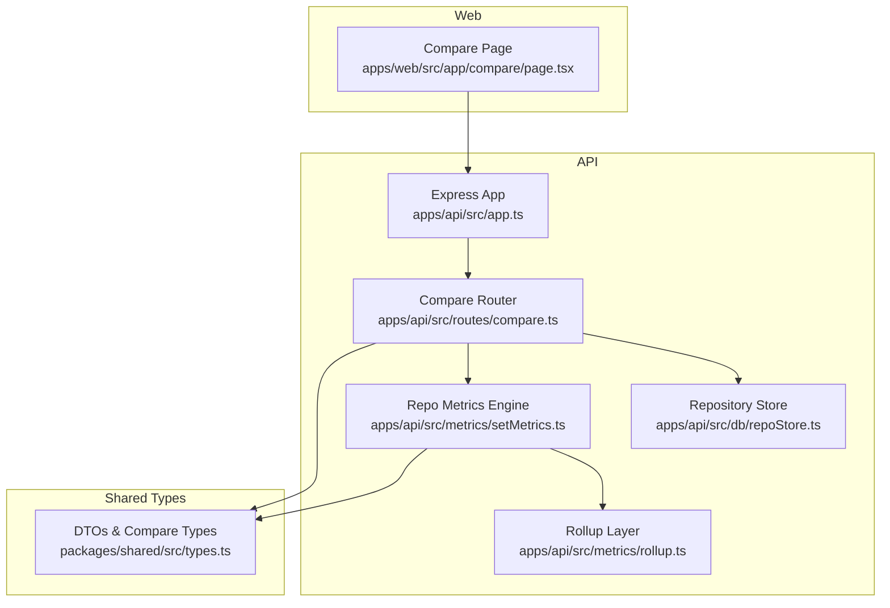
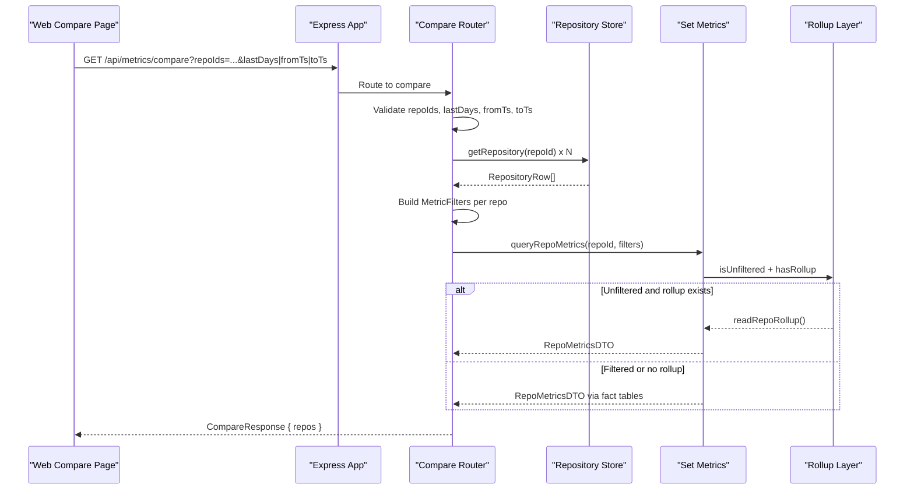
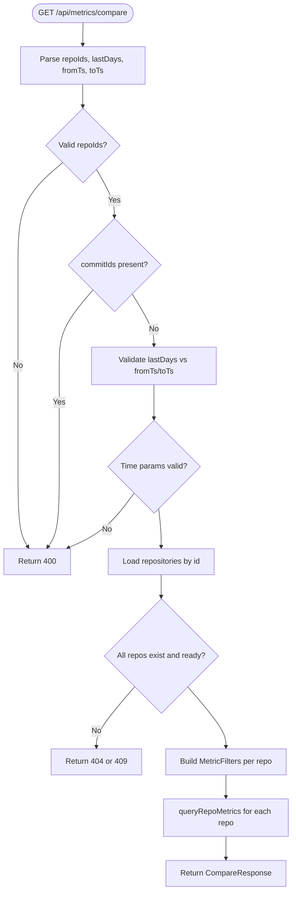
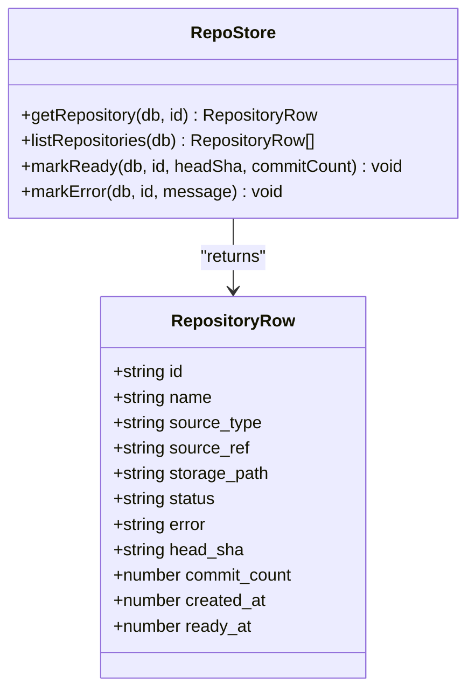
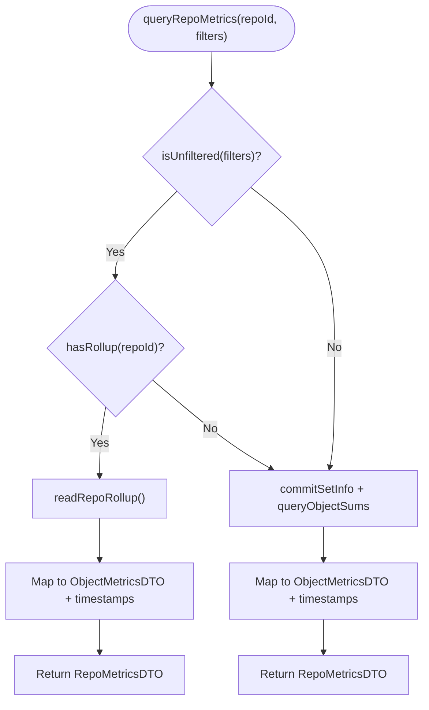
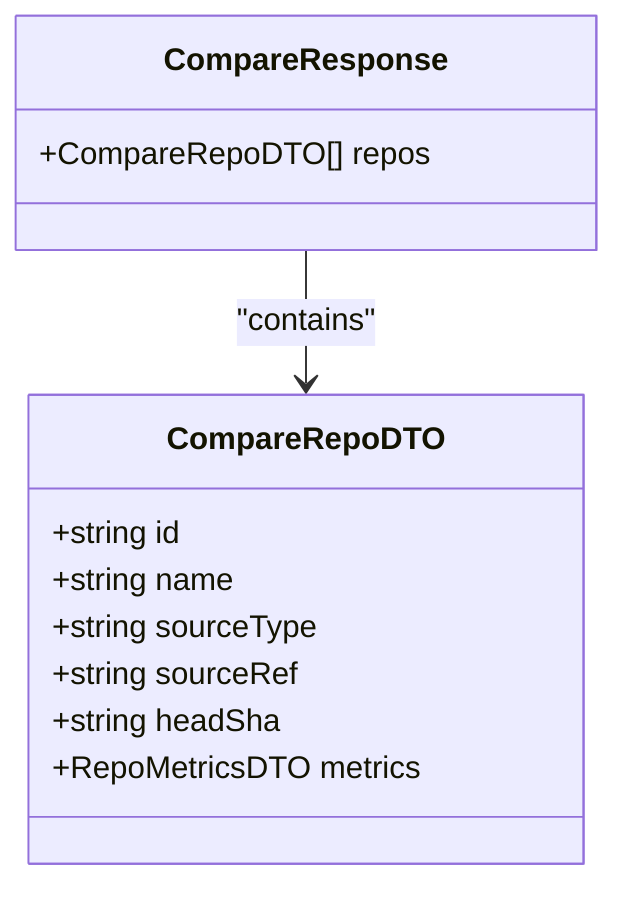
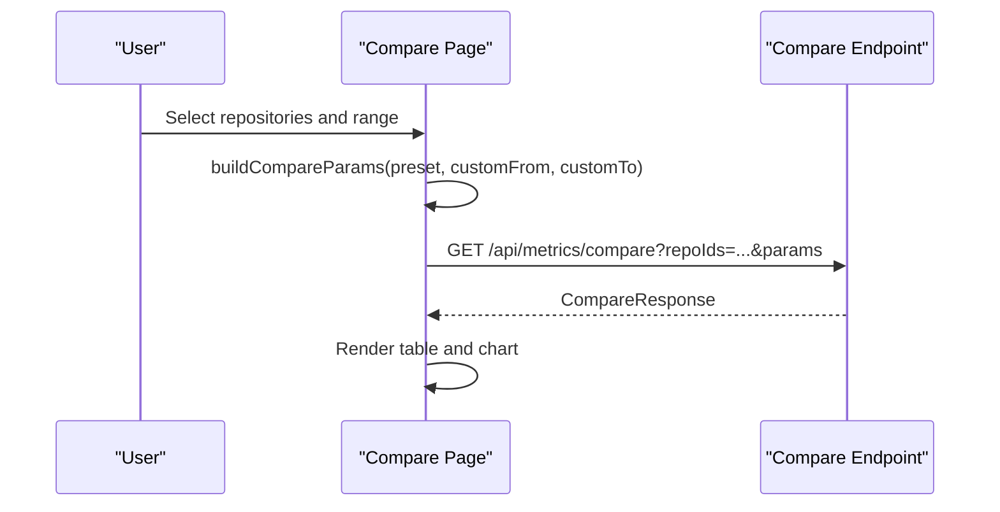
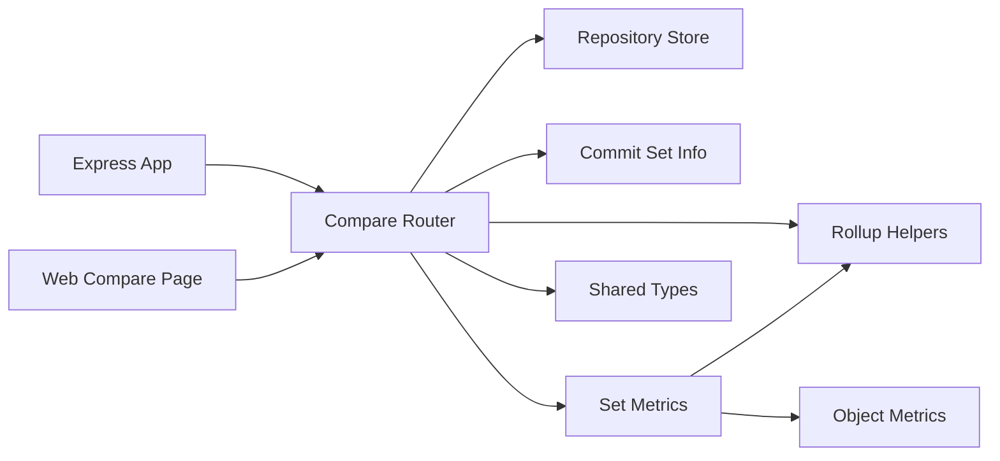

# Multi-Repository Comparison API

<cite>
**Referenced Files in This Document**
- [README.md](file://README.md)
- [app.ts](file://apps/api/src/app.ts)
- [compare.ts](file://apps/api/src/routes/compare.ts)
- [types.ts](file://packages/shared/src/types.ts)
- [setMetrics.ts](file://apps/api/src/metrics/setMetrics.ts)
- [rollup.ts](file://apps/api/src/metrics/rollup.ts)
- [repoStore.ts](file://apps/api/src/db/repoStore.ts)
- [page.tsx](file://apps/web/src/app/compare/page.tsx)
- [compare.test.ts](file://apps/api/test/routes/compare.test.ts)
</cite>

## Table of Contents
1. [Introduction](#introduction)
2. [Project Structure](#project-structure)
3. [Core Components](#core-components)
4. [Architecture Overview](#architecture-overview)
5. [Detailed Component Analysis](#detailed-component-analysis)
6. [Dependency Analysis](#dependency-analysis)
7. [Performance Considerations](#performance-considerations)
8. [Troubleshooting Guide](#troubleshooting-guide)
9. [Conclusion](#conclusion)

## Introduction
This document explains the Multi-Repository Comparison API implemented by the Repo Analysis Tool (RAT). The feature lets users select two to eight ready repositories and compare their repository-level metrics over a shared time window or per-repository relative windows. It is exposed as a single REST endpoint, backed by an Express router, a shared type contract, a commit-set filter engine, and materialized rollups for fast whole-history reads. A Next.js page provides the user interface for selecting repositories, choosing a time range, and visualizing the comparison results.

The broader project ingests git repositories from zip uploads or remote URLs, computes commit-level metrics, persists them in SQLite, and exposes both single-repository and multi-repository analysis endpoints.

**Section sources**
- [README.md:1-14](file://README.md#L1-L14)
- [README.md:233-257](file://README.md#L233-L257)

## Project Structure
The multi-repository comparison feature spans three layers:

- API layer: an Express router under `apps/api/src/routes/compare.ts` registers `/api/metrics/compare`.
- Metrics layer: shared metric computation logic under `apps/api/src/metrics`, including commit-set filtering, object sums, and materialized rollups.
- Web layer: a Next.js page under `apps/web/src/app/compare/page.tsx` that calls the API and renders a table and chart.

**Diagram sources**
- [app.ts:17-39](file://apps/api/src/app.ts#L17-L39)
- [compare.ts:23-100](file://apps/api/src/routes/compare.ts#L23-L100)
- [setMetrics.ts:31-55](file://apps/api/src/metrics/setMetrics.ts#L31-L55)
- [rollup.ts:31-91](file://apps/api/src/metrics/rollup.ts#L31-L91)
- [repoStore.ts:33-41](file://apps/api/src/db/repoStore.ts#L33-L41)
- [types.ts:248-260](file://packages/shared/src/types.ts#L248-L260)

**Section sources**
- [README.md:146-178](file://README.md#L146-L178)
- [app.ts:17-39](file://apps/api/src/app.ts#L17-L39)

## Core Components
- Compare endpoint: validates query parameters, resolves repository rows, builds per-repository filters, and returns a list of repository metric vectors.
- Repository store: loads repository metadata and enforces readiness.
- Metrics engine: computes repository-wide metrics using either materialized rollups or live fact-table queries depending on filters.
- Rollup layer: lazily builds and serves precomputed repo/file/day aggregates for unfiltered reads.
- Shared types: define request/response DTOs, including `CompareRepoDTO` and `CompareResponse`.
- Web compare page: UI for selecting repositories and time ranges, calling the API, and rendering results.

**Section sources**
- [compare.ts:15-22](file://apps/api/src/routes/compare.ts#L15-L22)
- [repoStore.ts:33-41](file://apps/api/src/db/repoStore.ts#L33-L41)
- [setMetrics.ts:7-24](file://apps/api/src/metrics/setMetrics.ts#L7-L24)
- [rollup.ts:6-19](file://apps/api/src/metrics/rollup.ts#L6-L19)
- [types.ts:248-260](file://packages/shared/src/types.ts#L248-L260)
- [page.tsx:40-56](file://apps/web/src/app/compare/page.tsx#L40-L56)

## Architecture Overview
The compare endpoint is mounted at `/api/metrics` and responds to GET requests with query parameters describing which repositories to compare and how to slice history.

**Diagram sources**
- [app.ts:34-34](file://apps/api/src/app.ts#L34-L34)
- [compare.ts:27-97](file://apps/api/src/routes/compare.ts#L27-L97)
- [repoStore.ts:33-35](file://apps/api/src/db/repoStore.ts#L33-L35)
- [setMetrics.ts:31-55](file://apps/api/src/metrics/setMetrics.ts#L31-L55)
- [rollup.ts:31-91](file://apps/api/src/metrics/rollup.ts#L31-L91)

## Detailed Component Analysis

### Compare Endpoint
The compare endpoint supports three modes:
- All-time comparison when no time parameters are provided.
- Shared absolute timestamp range using `fromTs` and `toTs`.
- Per-repository relative windows using `lastDays`, anchored to each repository’s newest commit.

Validation rules include:
- At least two repository IDs.
- Up to eight repository IDs.
- No `commitIds` parameter.
- Mutual exclusivity between `lastDays` and `fromTs`/`toTs`.
- Range bounds for `lastDays`.
- `fromTs <= toTs`.

For each repository, it checks existence and readiness before computing metrics.

**Diagram sources**
- [compare.ts:27-97](file://apps/api/src/routes/compare.ts#L27-L97)

Key behaviors:
- Rejects unsupported `commitIds`.
- Enforces maximum repository count.
- Anchors `lastDays` to each repository’s latest commit.
- Ensures rollup availability for unfiltered comparisons.

**Section sources**
- [compare.ts:11-13](file://apps/api/src/routes/compare.ts#L11-L13)
- [compare.ts:27-61](file://apps/api/src/routes/compare.ts#L27-L61)
- [compare.ts:63-97](file://apps/api/src/routes/compare.ts#L63-L97)

### Repository Resolution and Readiness
The endpoint uses the repository store to fetch repository rows by ID. Each row includes status, source metadata, head SHA, and commit count. Only repositories with status `ready` are eligible for comparison; others return a conflict error.

**Diagram sources**
- [repoStore.ts:3-15](file://apps/api/src/db/repoStore.ts#L3-L15)
- [repoStore.ts:33-41](file://apps/api/src/db/repoStore.ts#L33-L41)
- [repoStore.ts:52-58](file://apps/api/src/db/repoStore.ts#L52-L58)

**Section sources**
- [repoStore.ts:3-15](file://apps/api/src/db/repoStore.ts#L3-L15)
- [repoStore.ts:33-41](file://apps/api/src/db/repoStore.ts#L33-L41)
- [compare.ts:63-73](file://apps/api/src/routes/compare.ts#L63-L73)

### Metrics Computation and Rollup Optimization
Repository metrics are computed through the metrics engine. For unfiltered requests where a rollup exists, the engine reads precomputed values from `rollup_repo`; otherwise, it computes live aggregates from the fact table.

**Diagram sources**
- [setMetrics.ts:31-55](file://apps/api/src/metrics/setMetrics.ts#L31-L55)
- [rollup.ts:31-91](file://apps/api/src/metrics/rollup.ts#L31-L91)

Important details:
- Growth, churn, modifications, modification frequency, and churn rate are derived from raw sums and commit count.
- Rollup tables are built lazily if missing and serve whole-history reads efficiently.
- The compare endpoint triggers rollup creation for unfiltered comparisons.

**Section sources**
- [setMetrics.ts:7-24](file://apps/api/src/metrics/setMetrics.ts#L7-L24)
- [setMetrics.ts:31-55](file://apps/api/src/metrics/setMetrics.ts#L31-L55)
- [rollup.ts:31-91](file://apps/api/src/metrics/rollup.ts#L31-L91)
- [compare.ts:75-97](file://apps/api/src/routes/compare.ts#L75-L97)

### Shared Data Contracts
The shared package defines the response shape for comparisons:
- `CompareRepoDTO`: one repository column containing identity fields and its `RepoMetricsDTO`.
- `CompareResponse`: envelope containing an array of `CompareRepoDTO`.

These types ensure consistent payloads between the API and web client.

**Diagram sources**
- [types.ts:248-260](file://packages/shared/src/types.ts#L248-L260)

**Section sources**
- [types.ts:248-260](file://packages/shared/src/types.ts#L248-L260)

### Web Compare Page
The Next.js compare page allows users to:
- Select up to eight ready repositories.
- Choose a time range preset or custom UTC datetime range.
- Call the compare API and render a table and grouped bar chart.

It compiles presets into API parameters:
- Presets like last 7/30/90 days map to `lastDays`.
- Custom ranges map to `fromTs` and `toTs`, with inclusive minute handling.

**Diagram sources**
- [page.tsx:23-38](file://apps/web/src/app/compare/page.tsx#L23-L38)
- [page.tsx:45-56](file://apps/web/src/app/compare/page.tsx#L45-L56)
- [page.tsx:215-284](file://apps/web/src/app/compare/page.tsx#L215-L284)

**Section sources**
- [page.tsx:40-56](file://apps/web/src/app/compare/page.tsx#L40-L56)
- [page.tsx:150-196](file://apps/web/src/app/compare/page.tsx#L150-L196)
- [page.tsx:215-284](file://apps/web/src/app/compare/page.tsx#L215-L284)

## Dependency Analysis
The compare feature depends on several modules:

- Express app mounts the compare router under `/api/metrics`.
- Compare router depends on repository store, commit-set info, rollup helpers, set metrics, validation utilities, and error utilities.
- Set metrics depends on commit-set info, object metrics, and rollup helpers.
- Rollup layer depends on database access and object metrics types.
- Web compare page depends on shared hooks and formatting utilities.

**Diagram sources**
- [app.ts:17-39](file://apps/api/src/app.ts#L17-L39)
- [compare.ts:1-9](file://apps/api/src/routes/compare.ts#L1-L9)
- [setMetrics.ts:1-5](file://apps/api/src/metrics/setMetrics.ts#L1-L5)
- [rollup.ts:1-4](file://apps/api/src/metrics/rollup.ts#L1-L4)
- [types.ts:248-260](file://packages/shared/src/types.ts#L248-L260)

**Section sources**
- [app.ts:17-39](file://apps/api/src/app.ts#L17-L39)
- [compare.ts:1-9](file://apps/api/src/routes/compare.ts#L1-L9)
- [setMetrics.ts:1-5](file://apps/api/src/metrics/setMetrics.ts#L1-L5)
- [rollup.ts:1-4](file://apps/api/src/metrics/rollup.ts#L1-L4)

## Performance Considerations
- Materialized rollups accelerate unfiltered repository metrics and timeseries by avoiding scans of the fact table.
- The compare endpoint ensures rollups exist for unfiltered comparisons, reducing latency for all-time views.
- Relative windows (`lastDays`) are anchored per repository, enabling fair comparisons across repositories with different timelines.
- Filtering with explicit commit sets or author scopes falls back to live computation, which may be slower but remains correct.

[No sources needed since this section provides general guidance]

## Troubleshooting Guide
Common issues and resolutions:
- Missing or invalid `repoIds`: Ensure at least two repository IDs are provided and comma-separated.
- Too many repositories: Limit selection to eight repositories.
- Unsupported `commitIds`: The compare endpoint does not accept explicit commit IDs.
- Mixed time parameters: Do not combine `lastDays` with `fromTs`/`toTs`.
- Invalid `lastDays`: Must be between 1 and the configured maximum.
- Invalid timestamp range: `fromTs` must be less than or equal to `toTs`.
- Unknown repository: Returns a not found error with code `REPO_NOT_FOUND`.
- Non-ready repository: Returns a conflict error with code `REPO_NOT_READY`.

**Section sources**
- [compare.ts:27-61](file://apps/api/src/routes/compare.ts#L27-L61)
- [compare.ts:63-73](file://apps/api/src/routes/compare.ts#L63-L73)
- [compare.test.ts:100-149](file://apps/api/test/routes/compare.test.ts#L100-L149)

## Conclusion
The Multi-Repository Comparison API provides a robust way to compare repository-level metrics across multiple repositories. It combines strict input validation, flexible time-window semantics, efficient rollup-backed reads, and a clear shared type contract. The Next.js compare page offers an intuitive interface for selecting repositories and ranges, rendering results in both tabular and chart form. Tests verify correctness against single-repository endpoints and validate edge cases around parameters and repository readiness.

[No sources needed since this section summarizes without analyzing specific files]