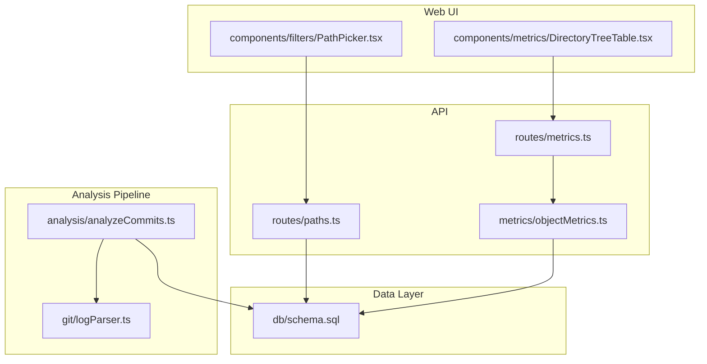
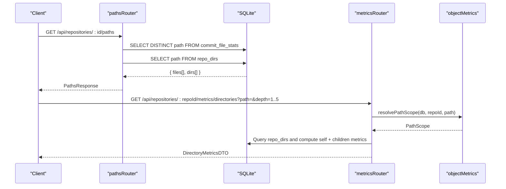
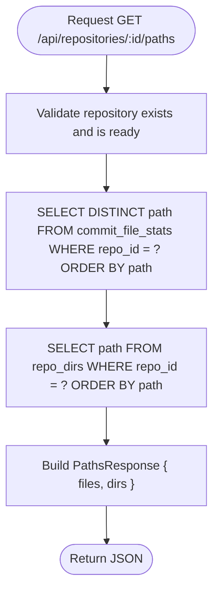
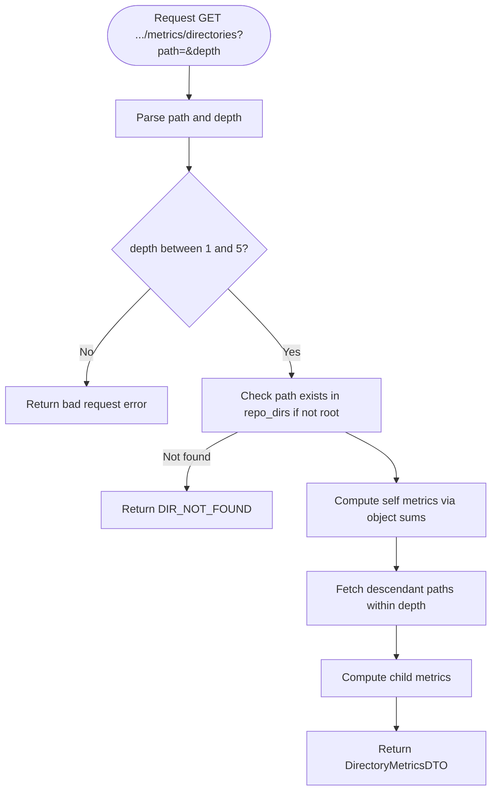
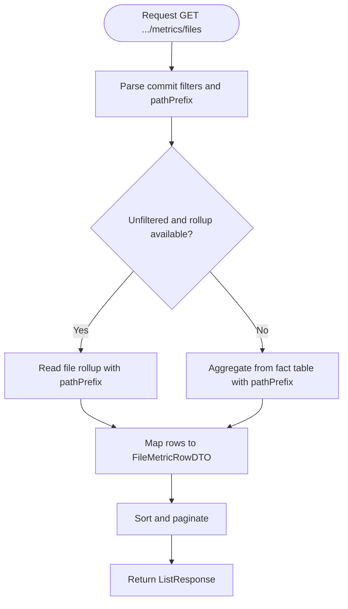
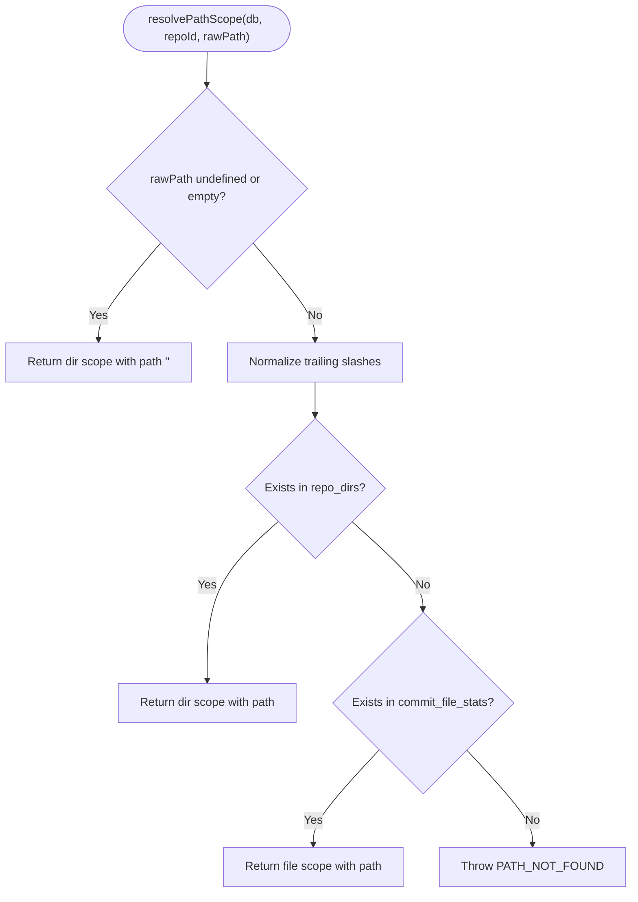
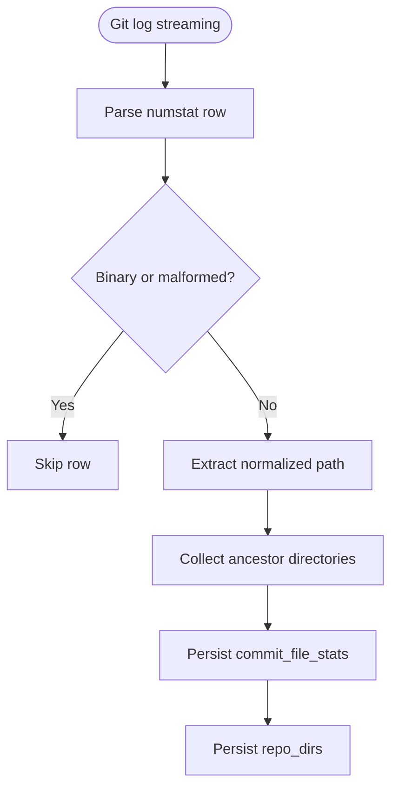
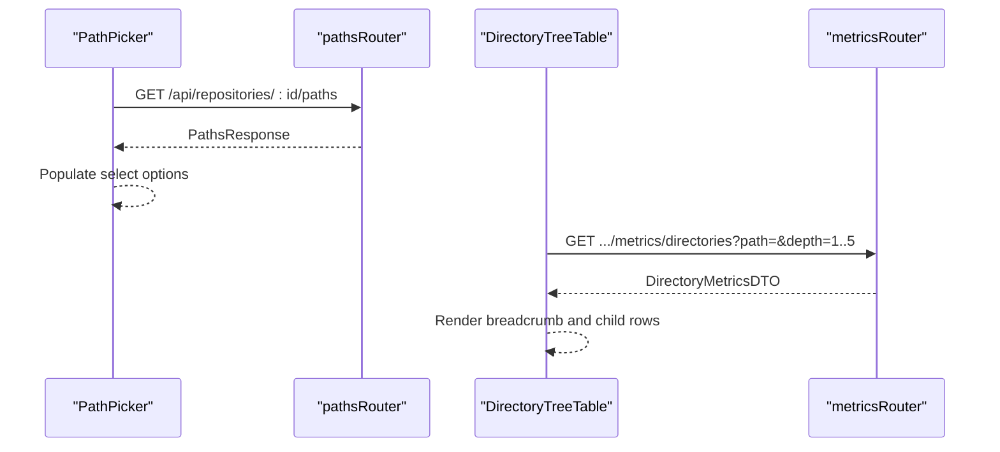
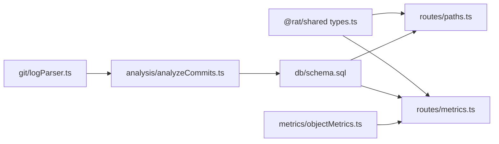

# Path Enumeration Endpoints

<cite>
**Referenced Files in This Document**
- [paths.ts](file://apps/api/src/routes/paths.ts)
- [types.ts](file://packages/shared/src/types.ts)
- [schema.sql](file://apps/api/src/db/schema.sql)
- [metrics.ts](file://apps/api/src/routes/metrics.ts)
- [objectMetrics.ts](file://apps/api/src/metrics/objectMetrics.ts)
- [analyzeCommits.ts](file://apps/api/src/analysis/analyzeCommits.ts)
- [logParser.ts](file://apps/api/src/git/logParser.ts)
- [PathPicker.tsx](file://apps/web/src/components/filters/PathPicker.tsx)
- [DirectoryTreeTable.tsx](file://apps/web/src/components/metrics/DirectoryTreeTable.tsx)
</cite>

## Table of Contents
1. [Introduction](#introduction)
2. [Project Structure](#project-structure)
3. [Core Components](#core-components)
4. [Architecture Overview](#architecture-overview)
5. [Detailed Component Analysis](#detailed-component-analysis)
6. [Dependency Analysis](#dependency-analysis)
7. [Performance Considerations](#performance-considerations)
8. [Troubleshooting Guide](#troubleshooting-guide)
9. [Conclusion](#conclusion)

## Introduction
This document describes the path enumeration endpoints and their integration with the metrics system. It explains how repository file and directory structures are discovered, how paths are normalized and stored, how clients can navigate hierarchical directories, and how path-based filtering combines with metric calculations. The documentation also covers performance characteristics for large repositories and provides practical examples for navigating complex trees, filtering by file type, and combining path queries with metrics.

## Project Structure
The path enumeration feature spans API routes, shared types, database schema, analysis pipeline, and web components:

**Diagram sources**
- [paths.ts:10-24](file://apps/api/src/routes/paths.ts#L10-L24)
- [metrics.ts:137-194](file://apps/api/src/routes/metrics.ts#L137-L194)
- [objectMetrics.ts:52-68](file://apps/api/src/metrics/objectMetrics.ts#L52-L68)
- [analyzeCommits.ts:96-102](file://apps/api/src/analysis/analyzeCommits.ts#L96-L102)
- [logParser.ts:135-156](file://apps/api/src/git/logParser.ts#L135-L156)
- [schema.sql:57-99](file://apps/api/src/db/schema.sql#L57-L99)
- [PathPicker.tsx:10-52](file://apps/web/src/components/filters/PathPicker.tsx#L10-L52)
- [DirectoryTreeTable.tsx:24-87](file://apps/web/src/components/metrics/DirectoryTreeTable.tsx#L24-L87)

**Section sources**
- [paths.ts:1-27](file://apps/api/src/routes/paths.ts#L1-L27)
- [types.ts:139-144](file://packages/shared/src/types.ts#L139-L144)
- [schema.sql:57-99](file://apps/api/src/db/schema.sql#L57-L99)

## Core Components
- Path enumeration endpoint returns all known file and directory paths for a repository.
- Directory tree navigation endpoint computes per-directory metrics and lists descendant directories up to a configurable depth.
- File-level metrics endpoint supports prefix-based filtering to narrow results to a specific subtree or file extension pattern.
- Path scope resolution determines whether a given path refers to a directory or a file and validates its existence.
- Git history analysis extracts file paths and derives directory ancestors during ingestion.

Key responsibilities:
- `GET /api/repositories/:id/paths` — list files and directories.
- `GET /api/repositories/:repoId/metrics/directories` — hierarchical directory navigation with metrics.
- `GET /api/repositories/:repoId/metrics/files` — file metrics with optional `pathPrefix`.
- Shared path scope resolution used across metrics endpoints.

**Section sources**
- [paths.ts:10-24](file://apps/api/src/routes/paths.ts#L10-L24)
- [metrics.ts:95-135](file://apps/api/src/routes/metrics.ts#L95-L135)
- [metrics.ts:137-194](file://apps/api/src/routes/metrics.ts#L137-L194)
- [objectMetrics.ts:52-68](file://apps/api/src/metrics/objectMetrics.ts#L52-L68)

## Architecture Overview
The path discovery mechanism is built on precomputed data from git history analysis:

**Diagram sources**
- [paths.ts:10-24](file://apps/api/src/routes/paths.ts#L10-L24)
- [metrics.ts:137-194](file://apps/api/src/routes/metrics.ts#L137-L194)
- [objectMetrics.ts:52-68](file://apps/api/src/metrics/objectMetrics.ts#L52-L68)

## Detailed Component Analysis

### Path Enumeration Endpoint
- Endpoint: `GET /api/repositories/:id/paths`
- Purpose: Provide the complete set of file and directory paths for a repository to power path pickers and filters.
- Response format:
  - `files`: array of distinct file paths that ever existed in analyzed history.
  - `dirs`: array of directory paths (excluding root; root is implicit).
- Data source:
  - Files come from `commit_file_stats.path`, deduplicated.
  - Directories come from `repo_dirs`, which stores every directory path seen in history.

**Diagram sources**
- [paths.ts:10-24](file://apps/api/src/routes/paths.ts#L10-L24)
- [schema.sql:57-99](file://apps/api/src/db/schema.sql#L57-L99)

**Section sources**
- [paths.ts:10-24](file://apps/api/src/routes/paths.ts#L10-L24)
- [types.ts:139-144](file://packages/shared/src/types.ts#L139-L144)
- [schema.sql:57-99](file://apps/api/src/db/schema.sql#L57-L99)

### Directory Navigation and Hierarchical Metrics
- Endpoint: `GET /api/repositories/:repoId/metrics/directories`
- Query parameters:
  - `path`: directory path to analyze; empty string means repository root.
  - `depth`: number of descendant levels to include; allowed values 1–5.
- Behavior:
  - Validates that the requested path is either root or an existing directory.
  - Computes metrics for the selected directory (`self`).
  - Lists descendant directories within the requested depth (`children`) with their own metrics.
  - Uses index-friendly range queries over `repo_dirs` to efficiently find descendants.

**Diagram sources**
- [metrics.ts:137-194](file://apps/api/src/routes/metrics.ts#L137-L194)
- [objectMetrics.ts:24-36](file://apps/api/src/metrics/objectMetrics.ts#L24-L36)

**Section sources**
- [metrics.ts:137-194](file://apps/api/src/routes/metrics.ts#L137-L194)
- [objectMetrics.ts:24-36](file://apps/api/src/metrics/objectMetrics.ts#L24-L36)

### File-Level Filtering by Prefix
- Endpoint: `GET /api/repositories/:repoId/metrics/files`
- Query parameters:
  - `pathPrefix`: literal prefix filter to restrict results to a subtree or file extension pattern.
  - Sorting and paging parameters supported.
- Behavior:
  - For unfiltered whole-history queries, uses materialized rollups for performance.
  - For filtered queries, aggregates live from fact tables.
  - Prefix filtering uses SQL substring matching on `s.path`.

**Diagram sources**
- [metrics.ts:95-135](file://apps/api/src/routes/metrics.ts#L95-L135)
- [objectMetrics.ts:111-136](file://apps/api/src/metrics/objectMetrics.ts#L111-L136)

**Section sources**
- [metrics.ts:95-135](file://apps/api/src/routes/metrics.ts#L95-L135)
- [objectMetrics.ts:111-136](file://apps/api/src/metrics/objectMetrics.ts#L111-L136)

### Path Scope Resolution
- Used by multiple metrics endpoints to interpret the `path` parameter.
- Rules:
  - Undefined or empty path resolves to repository root directory scope.
  - If the path exists in `repo_dirs`, it is treated as a directory scope.
  - If the path exists in `commit_file_stats`, it is treated as a file scope.
  - Otherwise, returns a not-found error.

**Diagram sources**
- [objectMetrics.ts:52-68](file://apps/api/src/metrics/objectMetrics.ts#L52-L68)

**Section sources**
- [objectMetrics.ts:52-68](file://apps/api/src/metrics/objectMetrics.ts#L52-L68)

### Path Extraction from Git History and Normalization
- During ingestion, the analysis pipeline streams `git log --numstat` output and parses each file change.
- Binary changes are ignored; rename-only changes with zero added/removed lines are skipped.
- For each file path, ancestor directories are derived and collected into a set.
- These directories are persisted in `repo_dirs`; file stats are persisted in `commit_file_stats`.

**Diagram sources**
- [analyzeCommits.ts:96-102](file://apps/api/src/analysis/analyzeCommits.ts#L96-L102)
- [logParser.ts:135-156](file://apps/api/src/git/logParser.ts#L135-L156)
- [schema.sql:57-99](file://apps/api/src/db/schema.sql#L57-L99)

**Section sources**
- [analyzeCommits.ts:96-102](file://apps/api/src/analysis/analyzeCommits.ts#L96-L102)
- [logParser.ts:135-156](file://apps/api/src/git/logParser.ts#L135-L156)
- [schema.sql:57-99](file://apps/api/src/db/schema.sql#L57-L99)

### Web Integration Examples
- Path picker component consumes `PathsResponse` to populate options for whole-repository, directory, or single-file scopes.
- Directory tree table navigates hierarchically using breadcrumbs and controls depth (1–5), calling the directories endpoint.

**Diagram sources**
- [PathPicker.tsx:10-52](file://apps/web/src/components/filters/PathPicker.tsx#L10-L52)
- [DirectoryTreeTable.tsx:24-87](file://apps/web/src/components/metrics/DirectoryTreeTable.tsx#L24-L87)
- [paths.ts:10-24](file://apps/api/src/routes/paths.ts#L10-L24)
- [metrics.ts:137-194](file://apps/api/src/routes/metrics.ts#L137-L194)

**Section sources**
- [PathPicker.tsx:10-52](file://apps/web/src/components/filters/PathPicker.tsx#L10-L52)
- [DirectoryTreeTable.tsx:24-87](file://apps/web/src/components/metrics/DirectoryTreeTable.tsx#L24-L87)

## Dependency Analysis
The path-related components depend on shared types and the database schema:

**Diagram sources**
- [types.ts:139-144](file://packages/shared/src/types.ts#L139-L144)
- [paths.ts:1-27](file://apps/api/src/routes/paths.ts#L1-L27)
- [metrics.ts:1-227](file://apps/api/src/routes/metrics.ts#L1-L227)
- [schema.sql:57-99](file://apps/api/src/db/schema.sql#L57-L99)
- [objectMetrics.ts:1-218](file://apps/api/src/metrics/objectMetrics.ts#L1-L218)
- [analyzeCommits.ts:1-153](file://apps/api/src/analysis/analyzeCommits.ts#L1-L153)
- [logParser.ts:129-166](file://apps/api/src/git/logParser.ts#L129-L166)

**Section sources**
- [types.ts:139-144](file://packages/shared/src/types.ts#L139-L144)
- [paths.ts:1-27](file://apps/api/src/routes/paths.ts#L1-L27)
- [metrics.ts:1-227](file://apps/api/src/routes/metrics.ts#L1-L227)
- [schema.sql:57-99](file://apps/api/src/db/schema.sql#L57-L99)
- [objectMetrics.ts:1-218](file://apps/api/src/metrics/objectMetrics.ts#L1-L218)
- [analyzeCommits.ts:1-153](file://apps/api/src/analysis/analyzeCommits.ts#L1-L153)
- [logParser.ts:129-166](file://apps/api/src/git/logParser.ts#L129-L166)

## Performance Considerations
- Whole-history reads use materialized rollups where possible to avoid scanning the fact table.
- Directory descendant queries leverage index-friendly range conditions on `repo_dirs`.
- File aggregation uses prefix filtering with substring matching; ensure prefixes are stable and specific to reduce result sets.
- Ingestion batches commits and persists stats in transactions to improve throughput.
- Binary and zero-change rows are skipped to minimize storage and query load.

[No sources needed since this section provides general guidance]

## Troubleshooting Guide
Common issues and resolutions:
- Directory not found when navigating:
  - Ensure the requested path exists in `repo_dirs`; otherwise, the endpoint returns a directory-not-found error.
- Path does not exist:
  - When resolving path scope, if the path is neither a directory nor a file, a not-found error is thrown.
- Unexpected empty results:
  - Verify that the repository has completed ingestion and that `commit_file_stats` and `repo_dirs` contain entries.
- Large repository performance:
  - Prefer using `pathPrefix` to limit file metrics to relevant subtrees.
  - Use directory navigation with controlled depth to avoid excessive descendant queries.

**Section sources**
- [metrics.ts:142-155](file://apps/api/src/routes/metrics.ts#L142-L155)
- [objectMetrics.ts:67-68](file://apps/api/src/metrics/objectMetrics.ts#L67-L68)

## Conclusion
The path enumeration endpoints provide a robust foundation for exploring repository structure and integrating path-based filters with metrics. Paths are extracted from git history, normalized, and stored in dedicated tables to enable efficient querying. Clients can discover all paths, navigate directories hierarchically, and combine path filters with file and directory metrics. For large repositories, leveraging rollups, prefix filtering, and bounded depth ensures responsive interactions.

[No sources needed since this section summarizes without analyzing specific files]