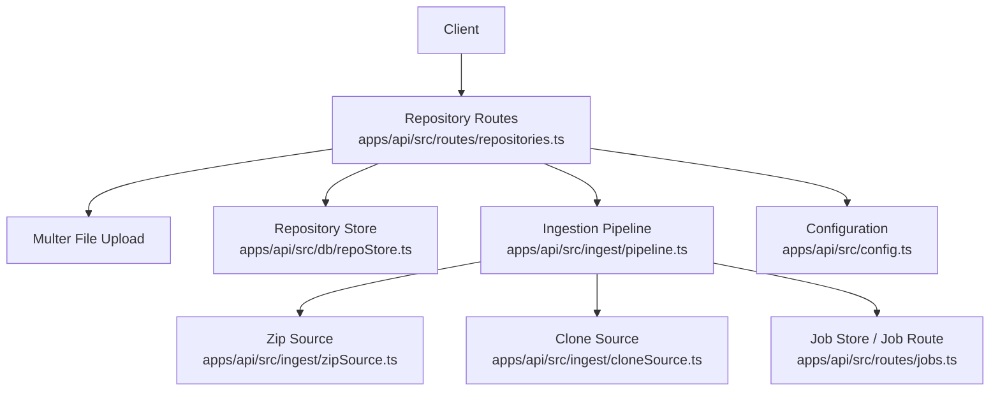
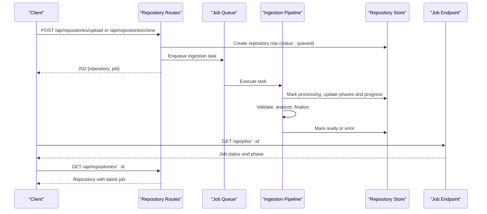
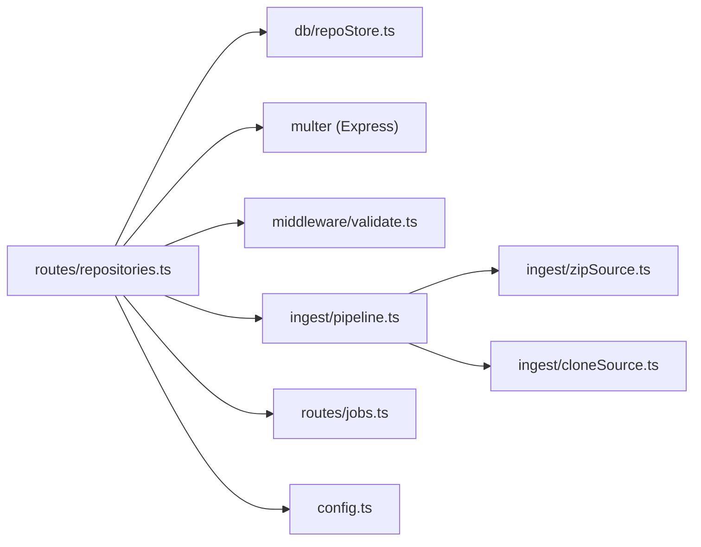

# Repository Management Endpoints

<cite>
**Referenced Files in This Document**
- [repositories.ts](file://apps/api/src/routes/repositories.ts)
- [pipeline.ts](file://apps/api/src/ingest/pipeline.ts)
- [zipSource.ts](file://apps/api/src/ingest/zipSource.ts)
- [cloneSource.ts](file://apps/api/src/ingest/cloneSource.ts)
- [repoStore.ts](file://apps/api/src/db/repoStore.ts)
- [validate.ts](file://apps/api/src/middleware/validate.ts)
- [errors.ts](file://apps/api/src/util/errors.ts)
- [config.ts](file://apps/api/src/config.ts)
- [jobs.ts](file://apps/api/src/routes/jobs.ts)
- [types.ts](file://packages/shared/src/types.ts)
- [repositories.test.ts](file://apps/api/test/routes/repositories.test.ts)
</cite>

## Table of Contents
1. [Introduction](#introduction)
2. [Project Structure](#project-structure)
3. [Core Components](#core-components)
4. [Architecture Overview](#architecture-overview)
5. [Detailed Component Analysis](#detailed-component-analysis)
6. [Dependency Analysis](#dependency-analysis)
7. [Performance Considerations](#performance-considerations)
8. [Troubleshooting Guide](#troubleshooting-guide)
9. [Conclusion](#conclusion)

## Introduction
This document describes the repository management API surface for ingesting Git repositories through two mechanisms: uploading a `.zip` archive and cloning from a remote URL. It covers request/response schemas, validation rules, file upload handling, remote cloning parameters, error responses, progress tracking, and the relationship with the ingestion pipeline.

The repository lifecycle is asynchronous: creation endpoints return an immediate `202 Accepted` response with a repository record and an ingestion job. Clients should poll the repository status endpoint or the job endpoint to track completion.

## Project Structure
The repository management endpoints live under the API application and are implemented as an Express router. Ingestion logic is separated into source handlers (zip extraction and Git cloning), a shared pipeline that coordinates validation, analysis, and finalization, and a database store that persists repository state.



**Diagram sources**
- [repositories.ts:72-164](file://apps/api/src/routes/repositories.ts#L72-L164)
- [pipeline.ts:41-145](file://apps/api/src/ingest/pipeline.ts#L41-L145)
- [zipSource.ts:27-209](file://apps/api/src/ingest/zipSource.ts#L27-L209)
- [cloneSource.ts:41-63](file://apps/api/src/ingest/cloneSource.ts#L41-L63)
- [repoStore.ts:25-46](file://apps/api/src/db/repoStore.ts#L25-L46)
- [jobs.ts:22-32](file://apps/api/src/routes/jobs.ts#L22-L32)
- [config.ts:49-66](file://apps/api/src/config.ts#L49-L66)

**Section sources**
- [repositories.ts:72-164](file://apps/api/src/routes/repositories.ts#L72-L164)
- [pipeline.ts:41-145](file://apps/api/src/ingest/pipeline.ts#L41-L145)
- [repoStore.ts:25-46](file://apps/api/src/db/repoStore.ts#L25-L46)

## Core Components
- Repository routes handle listing, creation via zip upload, creation via clone, detail retrieval, and deletion.
- The ingestion pipeline orchestrates source acquisition, Git validation, commit analysis, mailmap resolution, and finalization.
- Zip extraction enforces strict safety checks against path traversal, symlinks, excessive entries, and uncompressed size bombs.
- Remote cloning uses a full mirror clone with progress parsing.
- Repository state is persisted in a relational store with statuses such as queued, processing, ready, and error.
- Configuration controls storage directories, upload limits, and timeouts.

**Section sources**
- [repositories.ts:72-164](file://apps/api/src/routes/repositories.ts#L72-L164)
- [pipeline.ts:41-145](file://apps/api/src/ingest/pipeline.ts#L41-L145)
- [zipSource.ts:27-209](file://apps/api/src/ingest/zipSource.ts#L27-L209)
- [cloneSource.ts:41-63](file://apps/api/src/ingest/cloneSource.ts#L41-L63)
- [repoStore.ts:25-46](file://apps/api/src/db/repoStore.ts#L25-L46)
- [config.ts:49-66](file://apps/api/src/config.ts#L49-L66)

## Architecture Overview
The repository management API follows a producer-consumer pattern:
- HTTP routes create repository records and enqueue ingestion tasks.
- A queue executes ingestion tasks asynchronously.
- The pipeline updates job progress and repository status throughout the process.
- Clients poll repository or job endpoints to observe state transitions.



**Diagram sources**
- [repositories.ts:84-134](file://apps/api/src/routes/repositories.ts#L84-L134)
- [pipeline.ts:44-129](file://apps/api/src/ingest/pipeline.ts#L44-L129)
- [repoStore.ts:48-62](file://apps/api/src/db/repoStore.ts#L48-L62)
- [jobs.ts:22-32](file://apps/api/src/routes/jobs.ts#L22-L32)

## Detailed Component Analysis

### Repository Listing
- Method: `GET /api/repositories`
- Purpose: Return all repositories ordered by creation time, each including its latest ingestion job when available.
- Success Response:
  - Status: `200 OK`
  - Body schema: `{ repositories: RepositoryDTO[] }`
  - `RepositoryDTO` fields include id, name, sourceType, sourceRef, status, error, headSha, commitCount, createdAt, readyAt, and latestJob.
- Error Responses: None expected for normal operation.

Example curl:
```bash
curl --request GET \
  --url http://localhost:4000/api/repositories
```

**Section sources**
- [repositories.ts:77-82](file://apps/api/src/routes/repositories.ts#L77-L82)
- [types.ts:27-41](file://packages/shared/src/types.ts#L27-L41)
- [types.ts:218-220](file://packages/shared/src/types.ts#L218-L220)

### Zip Upload Creation
- Method: `POST /api/repositories/upload`
- Purpose: Accept a `.zip` archive containing a Git repository and start asynchronous ingestion.
- Request:
  - Content-Type: `multipart/form-data`
  - Form field: `file` (required)
  - Only `.zip` files are accepted; non-zip uploads are rejected.
  - Size limit is enforced by configuration (`maxUploadBytes`).
- Validation:
  - Missing file returns `400` with code `UPLOAD_MISSING_FILE`.
  - Non-zip extension returns `400` with code `UPLOAD_NOT_ZIP`.
  - Zip extraction enforces entry count limits, symlink skipping, absolute path rejection, traversal protection, and total uncompressed size caps.
- Success Response:
  - Status: `202 Accepted`
  - Body schema: `{ repository: RepositoryDTO, job: JobDTO }`
  - Repository status is `queued`; job status is `queued` with phase `pending`.
- Progress Tracking:
  - Poll `GET /api/jobs/:jobId` for phase and progress.
  - Phases include extracting, cloning, validating, analyzing, finalizing, and complete.

Example curl:
```bash
curl --request POST \
  --url http://localhost:4000/api/repositories/upload \
  --form 'file=@/path/to/repository.zip'
```

Security considerations:
- Only `.zip` archives are accepted.
- Symlinks are skipped during extraction.
- Absolute paths and directory traversal are rejected.
- Uncompressed size is capped to prevent zip bombs.
- Uploaded zips are staged in a temporary directory and removed after successful extraction.

Supported repository formats inside zip:
- A worktree containing a `.git` directory.
- A bare repository layout with `HEAD`, `objects/`, and `refs/`.
- Worktree pointer files named `.git` are rejected.

**Section sources**
- [repositories.ts:84-115](file://apps/api/src/routes/repositories.ts#L84-L115)
- [zipSource.ts:27-209](file://apps/api/src/ingest/zipSource.ts#L27-L209)
- [pipeline.ts:50-65](file://apps/api/src/ingest/pipeline.ts#L50-L65)
- [config.ts:49-66](file://apps/api/src/config.ts#L49-L66)
- [repositories.test.ts:21-61](file://apps/api/test/routes/repositories.test.ts#L21-L61)

### URL Cloning Creation
- Method: `POST /api/repositories/clone`
- Purpose: Clone a remote Git repository and start asynchronous ingestion.
- Request body schema:
  - `url`: Required string, trimmed, maximum length validated, must match allowed schemes.
  - `name`: Optional string, trimmed, maximum length validated. If omitted, the display name is derived from the last segment of the URL with `.git` removed.
- Allowed URL schemes:
  - `http://`, `https://`, `git://`, `ssh://`, and SSH-style `git@...` URLs.
- Validation:
  - Invalid or missing URL returns `400` with code `VALIDATION`.
- Success Response:
  - Status: `202 Accepted`
  - Body schema: `{ repository: RepositoryDTO, job: JobDTO }`
  - Repository status is `queued`; job status is `queued` with phase `pending`.
- Remote cloning behavior:
  - Uses a full mirror clone to preserve all refs and history.
  - Progress is parsed from Git’s standard progress output and mapped to coarse stages.

Example curl:
```bash
curl --request POST \
  --url http://localhost:4000/api/repositories/clone \
  --header 'Content-Type: application/json' \
  --data '{"url":"https://github.com/example/repo.git","name":"My Repo"}'
```

Error examples:
```bash
curl --request POST \
  --url http://localhost:4000/api/repositories/clone \
  --header 'Content-Type: application/json' \
  --data '{"url":"not-a-url"}'
```

Expected response for invalid URL:
```json
{
  "code": "VALIDATION",
  "message": "url: url must be an http(s)://, git://, ssh:// or git@ URL."
}
```

**Section sources**
- [repositories.ts:58-69](file://apps/api/src/routes/repositories.ts#L58-L69)
- [repositories.ts:117-135](file://apps/api/src/routes/repositories.ts#L117-L135)
- [cloneSource.ts:41-63](file://apps/api/src/ingest/cloneSource.ts#L41-L63)
- [repositories.test.ts:63-84](file://apps/api/test/routes/repositories.test.ts#L63-L84)

### Repository Status Check
- Method: `GET /api/repositories/:id`
- Purpose: Retrieve a single repository and its latest ingestion job.
- Path parameter:
  - `id`: Repository identifier.
- Success Response:
  - Status: `200 OK`
  - Body schema: `RepositoryDTO`
- Error Responses:
  - `404 Not Found` with code `REPO_NOT_FOUND` if the repository does not exist.

Example curl:
```bash
curl --request GET \
  --url http://localhost:4000/api/repositories/<repository-id>
```

**Section sources**
- [repositories.ts:137-141](file://apps/api/src/routes/repositories.ts#L137-L141)
- [types.ts:27-41](file://packages/shared/src/types.ts#L27-L41)
- [repositories.test.ts:86-103](file://apps/api/test/routes/repositories.test.ts#L86-L103)

### Repository Deletion
- Method: `DELETE /api/repositories/:id`
- Purpose: Remove a repository record and its on-disk data.
- Path parameter:
  - `id`: Repository identifier.
- Behavior:
  - If an active ingestion job exists for the repository, deletion is blocked.
  - On success, the repository row is deleted and the repository directory is removed if it resides within the configured repos directory.
- Success Response:
  - Status: `204 No Content`
- Error Responses:
  - `404 Not Found` with code `REPO_NOT_FOUND` if the repository does not exist.
  - `409 Conflict` with code `DELETE_ACTIVE_JOB` if an ingestion job is still active.

Example curl:
```bash
curl --request DELETE \
  --url http://localhost:4000/api/repositories/<repository-id>
```

**Section sources**
- [repositories.ts:143-162](file://apps/api/src/routes/repositories.ts#L143-L162)
- [repositories.test.ts:105-131](file://apps/api/test/routes/repositories.test.ts#L105-L131)

### Ingestion Pipeline and Progress Tracking
The ingestion pipeline coordinates these phases:
- Source acquisition:
  - Zip extraction with progress callbacks.
  - Mirror cloning with progress parsing.
- Validation:
  - Git repository validation.
- Analysis:
  - Commit analysis with progress callbacks.
- Finalization:
  - Mailmap resolution (best-effort).
  - Finalize repository metadata and mark ready.

Progress is exposed through jobs:
- Job phases: pending, extracting, cloning, validating, analyzing, finalizing, complete.
- Job status: queued, running, done, failed.
- Overall progress is a number between 0 and 1.

Polling example:
```bash
curl --request GET \
  --url http://localhost:4000/api/jobs/<job-id>
```

**Section sources**
- [pipeline.ts:29-37](file://apps/api/src/ingest/pipeline.ts#L29-L37)
- [pipeline.ts:44-129](file://apps/api/src/ingest/pipeline.ts#L44-L129)
- [jobs.ts:7-19](file://apps/api/src/routes/jobs.ts#L7-L19)
- [types.ts:16-55](file://packages/shared/src/types.ts#L16-L55)

## Dependency Analysis
The repository routes depend on multiple subsystems:
- Database store for repository persistence and status transitions.
- Multer for multipart file upload handling.
- Zod-based validation middleware for structured request bodies.
- Ingestion pipeline for asynchronous processing.
- Job route for progress polling.
- Configuration for storage paths, upload limits, and timeouts.



**Diagram sources**
- [repositories.ts:1-21](file://apps/api/src/routes/repositories.ts#L1-L21)
- [pipeline.ts:1-14](file://apps/api/src/ingest/pipeline.ts#L1-L14)
- [zipSource.ts:1-5](file://apps/api/src/ingest/zipSource.ts#L1-L5)
- [cloneSource.ts:1-2](file://apps/api/src/ingest/cloneSource.ts#L1-L2)
- [jobs.ts:1-5](file://apps/api/src/routes/jobs.ts#L1-L5)
- [config.ts:1-3](file://apps/api/src/config.ts#L1-L3)

**Section sources**
- [repositories.ts:1-21](file://apps/api/src/routes/repositories.ts#L1-L21)
- [pipeline.ts:1-14](file://apps/api/src/ingest/pipeline.ts#L1-L14)
- [zipSource.ts:1-5](file://apps/api/src/ingest/zipSource.ts#L1-L5)
- [cloneSource.ts:1-2](file://apps/api/src/ingest/cloneSource.ts#L1-L2)
- [jobs.ts:1-5](file://apps/api/src/routes/jobs.ts#L1-L5)
- [config.ts:1-3](file://apps/api/src/config.ts#L1-L3)

## Performance Considerations
- Upload size limit: Controlled by `MAX_UPLOAD_MB`; default is 512 MB. Adjust based on environment capacity.
- Zip expansion cap: Extraction allows up to six times the upload limit or 1 GB, whichever is larger, plus a hard entry count limit.
- Clone timeout: Controlled by `CLONE_TIMEOUT_MS`; default is 30 minutes.
- Git analysis timeout: Fixed at 30 minutes for commit scanning.
- Asynchronous ingestion: Avoid blocking HTTP requests; use job polling for long-running operations.

[No sources needed since this section provides general guidance]

## Troubleshooting Guide
Common errors and their meanings:
- `UPLOAD_MISSING_FILE`: Zip upload was requested without attaching the `file` form field.
- `UPLOAD_NOT_ZIP`: Attached file does not have a `.zip` extension.
- `ZIP_INVALID`: Zip could not be opened or read.
- `ZIP_TOO_LARGE`: Zip contains too many entries or expands beyond the allowed uncompressed size.
- `ZIP_GIT_FILE`: Archive contains a `.git` file instead of a `.git` directory; upload a full repository zip.
- `ZIP_NO_GIT_DIR`: No usable Git repository found inside the uploaded zip.
- `VALIDATION`: Clone request body failed schema validation, typically due to an unsupported URL scheme.
- `REPO_NOT_FOUND`: Repository ID does not exist.
- `DELETE_ACTIVE_JOB`: Attempted to delete a repository while an ingestion job is still active.
- `CLONE_FAILED`: Git clone exited with a non-zero status; check network access, authentication, and repository availability.

Resolution steps:
- Ensure zip uploads include a valid `.zip` file with a full Git repository.
- Verify clone URLs use supported schemes and are reachable.
- Increase upload limits or reduce repository size if encountering size-related errors.
- Review job status and error messages for detailed failure reasons.

**Section sources**
- [repositories.ts:84-115](file://apps/api/src/routes/repositories.ts#L84-L115)
- [zipSource.ts:14-196](file://apps/api/src/ingest/zipSource.ts#L14-L196)
- [cloneSource.ts:50-63](file://apps/api/src/ingest/cloneSource.ts#L50-L63)
- [errors.ts:17-27](file://apps/api/src/util/errors.ts#L17-L27)
- [repositories.test.ts:21-84](file://apps/api/test/routes/repositories.test.ts#L21-L84)

## Conclusion
The repository management API provides robust endpoints for creating repositories from local zips or remote URLs, listing and inspecting repositories, and deleting them safely. All ingestion operations are asynchronous and tracked through jobs, enabling reliable progress monitoring. Security measures protect against unsafe zip contents and enforce size limits, while configuration options allow tuning for different environments. Clients should treat creation endpoints as fire-and-forget and rely on polling for completion and results.

[No sources needed since this section summarizes without analyzing specific files]