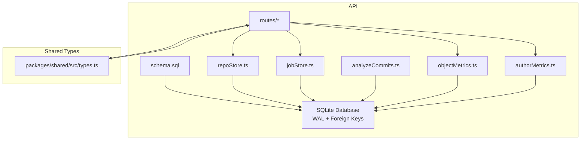
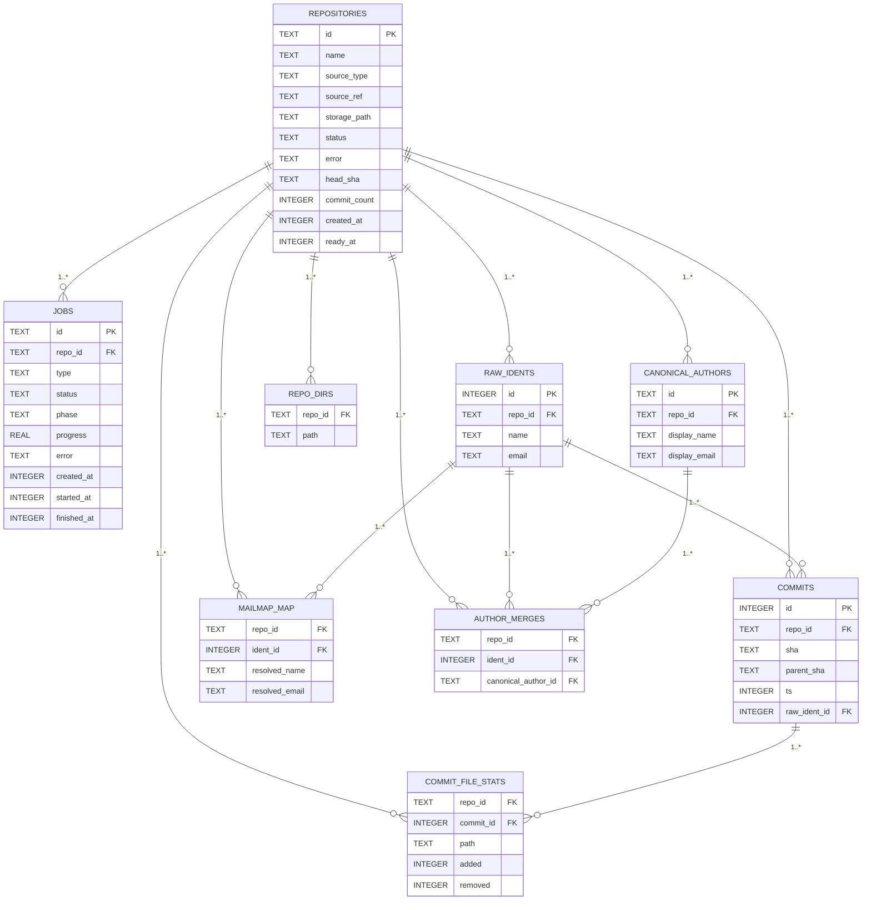
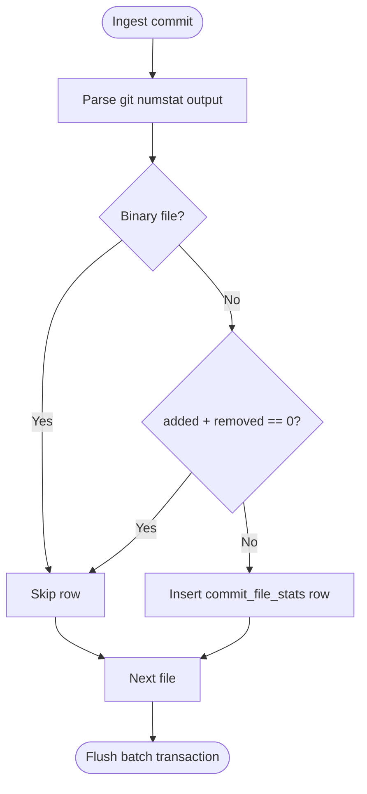
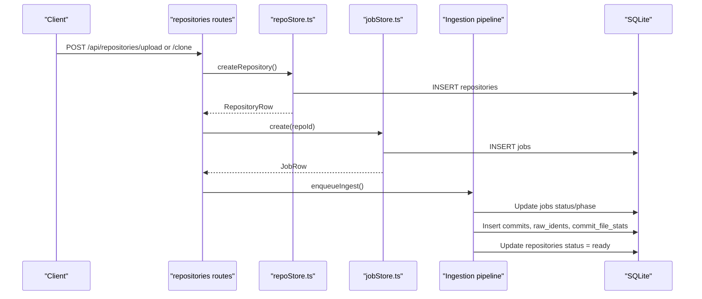
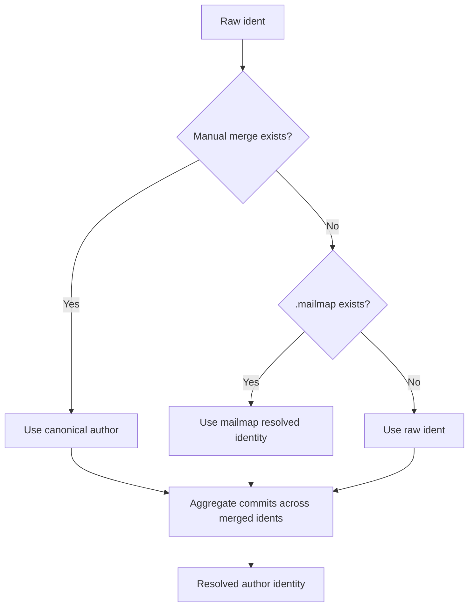
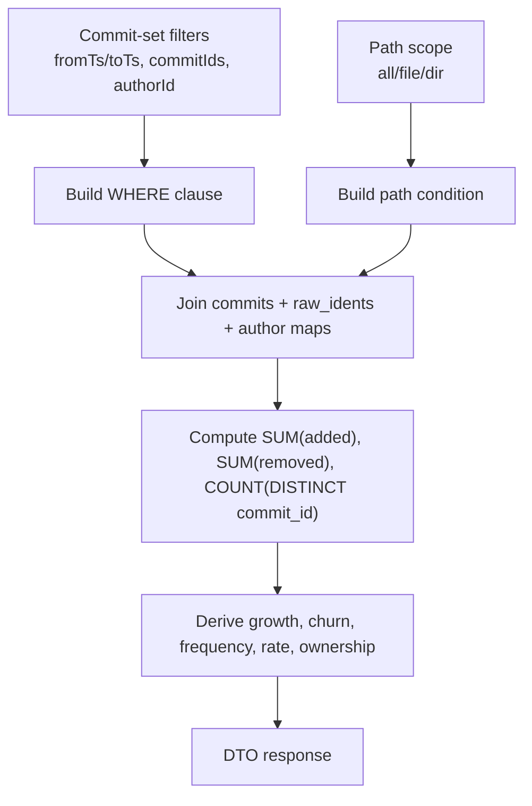
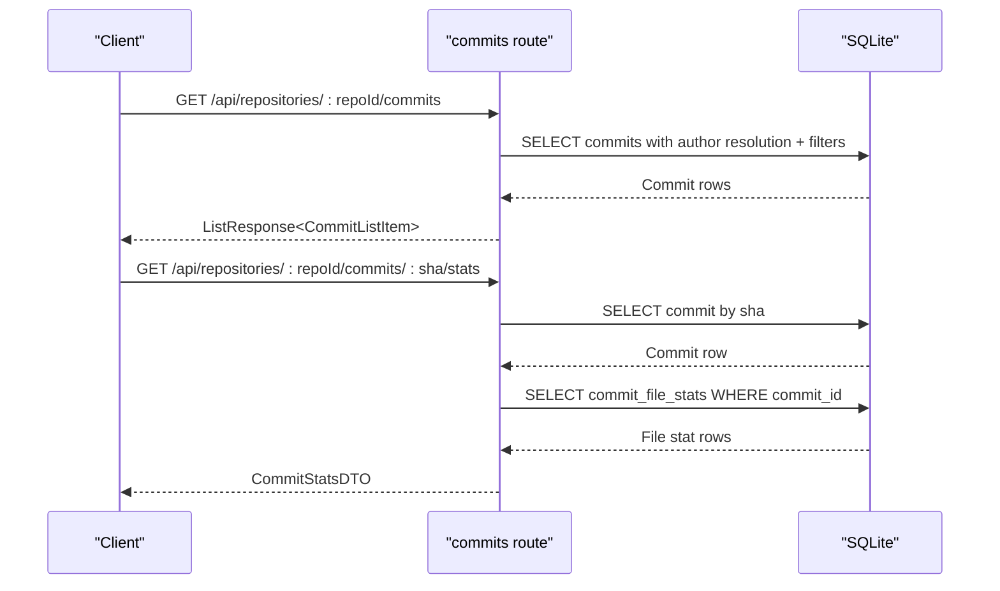
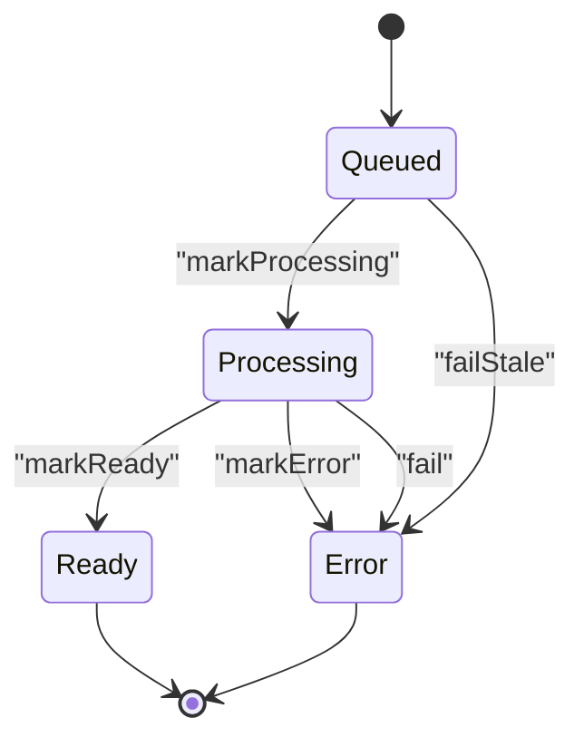
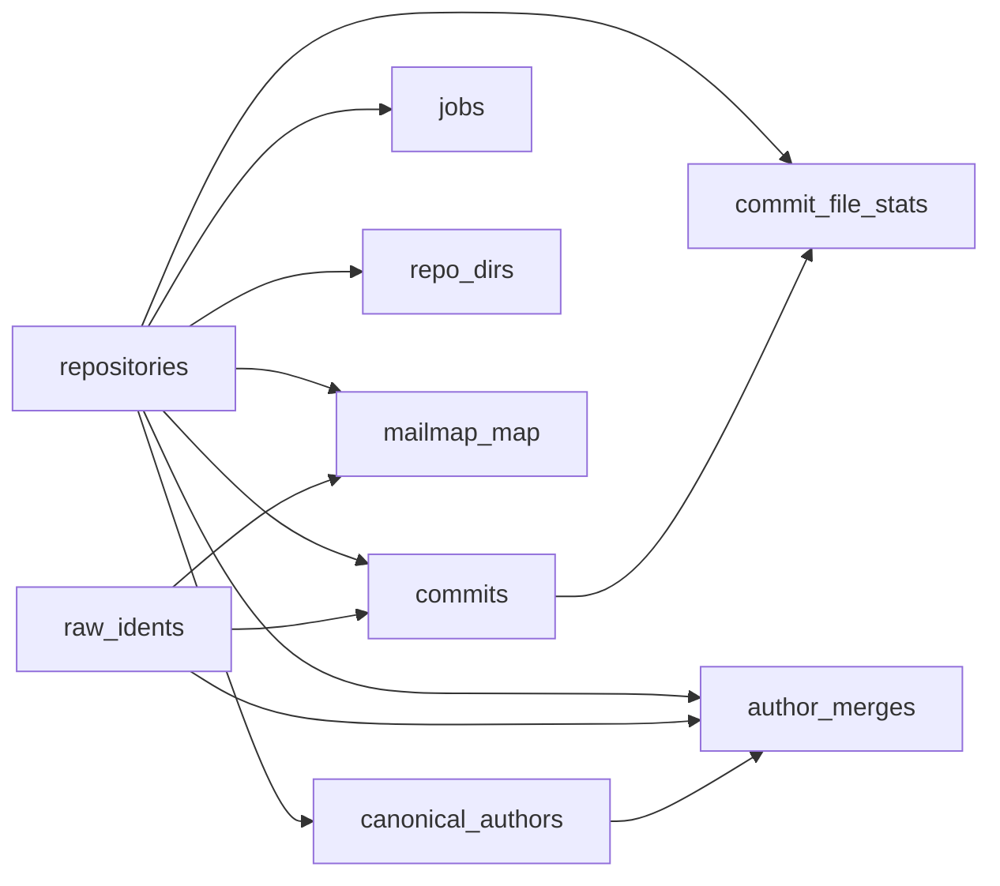
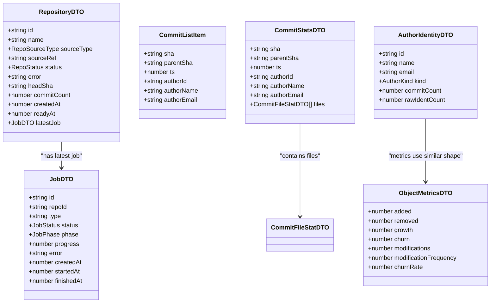

# Data Models & Database Schema

<cite>
**Referenced Files in This Document**   
- [schema.sql](file://apps/api/src/db/schema.sql)
- [database.ts](file://apps/api/src/db/database.ts)
- [repoStore.ts](file://apps/api/src/db/repoStore.ts)
- [jobStore.ts](file://apps/api/src/jobs/jobStore.ts)
- [analyzeCommits.ts](file://apps/api/src/analysis/analyzeCommits.ts)
- [objectMetrics.ts](file://apps/api/src/metrics/objectMetrics.ts)
- [authorMetrics.ts](file://apps/api/src/metrics/authorMetrics.ts)
- [commits.ts](file://apps/api/src/routes/commits.ts)
- [authors.ts](file://apps/api/src/routes/authors.ts)
- [repositories.ts](file://apps/api/src/routes/repositories.ts)
- [types.ts](file://packages/shared/src/types.ts)
- [README.md](file://README.md)
</cite>

## Table of Contents
1. [Introduction](#introduction)
2. [Project Structure](#project-structure)
3. [Core Components](#core-components)
4. [Architecture Overview](#architecture-overview)
5. [Detailed Component Analysis](#detailed-component-analysis)
6. [Dependency Analysis](#dependency-analysis)
7. [Performance Considerations](#performance-considerations)
8. [Data Lifecycle, Retention & Migration](#data-lifecycle-retention--migration)
9. [Type Safety & Shared DTOs](#type-safety--shared-dtos)
10. [Troubleshooting Guide](#troubleshooting-guide)
11. [Conclusion](#conclusion)

## Introduction
This document describes RAT’s data model and database schema. It focuses on the SQLite schema, primary fact table `commit_file_stats`, supporting tables for repositories, commits, jobs, raw identities, canonical authors, directory metadata, and author resolution maps. It also explains how normalized design and query-time metric computation work together, documents shared TypeScript types used by the API and frontend, and outlines data lifecycle, retention considerations, and migration strategy.

RAT is a self-hosted repository analysis tool that ingests Git repositories (via zip upload or URL clone), records per-commit file change statistics, and computes metrics such as growth, churn, modification frequency, churn rate, and author ownership at repository, directory, file, commit-set, and author granularity.

**Section sources**
- [README.md:1-13](file://README.md#L1-L13)
- [README.md:176-202](file://README.md#L176-L202)

## Project Structure
The data model lives primarily under the API workspace:

- `apps/api/src/db/schema.sql` defines the SQLite schema.
- `apps/api/src/db/database.ts` opens the database, enables WAL mode, enforces foreign keys, and applies the schema.
- `apps/api/src/db/repoStore.ts` provides repository row types and persistence helpers.
- `apps/api/src/jobs/jobStore.ts` provides job row types and persistence helpers.
- `apps/api/src/analysis/analyzeCommits.ts` streams Git history into the fact table during ingestion.
- `apps/api/src/metrics/objectMetrics.ts` and `authorMetrics.ts` compute metrics from the fact table at query time.
- `apps/api/src/routes/*` expose REST endpoints that read from and write to these tables.
- `packages/shared/src/types.ts` defines shared DTO types consumed by both API and web.

**Diagram sources**
- [schema.sql:1-106](file://apps/api/src/db/schema.sql#L1-L106)
- [database.ts:1-23](file://apps/api/src/db/database.ts#L1-L23)
- [repoStore.ts:1-63](file://apps/api/src/db/repoStore.ts#L1-L63)
- [jobStore.ts:1-129](file://apps/api/src/jobs/jobStore.ts#L1-L129)
- [analyzeCommits.ts:1-153](file://apps/api/src/analysis/analyzeCommits.ts#L1-L153)
- [objectMetrics.ts:1-218](file://apps/api/src/metrics/objectMetrics.ts#L1-L218)
- [authorMetrics.ts:1-199](file://apps/api/src/metrics/authorMetrics.ts#L1-L199)
- [types.ts:1-226](file://packages/shared/src/types.ts#L1-L226)

**Section sources**
- [README.md:140-172](file://README.md#L140-L172)

## Core Components
The core data model consists of:

| Entity | Purpose | Primary Key | Important Constraints | Notes |
|---|---|---|---|---|
| `repositories` | Tracks ingested repositories and their ingestion state | `id` (`TEXT`) | `source_type IN ('zip','url')`; `status IN ('queued','processing','ready','error')` | Stores source reference, storage path, head SHA, commit count, timestamps |
| `jobs` | Ingestion job lifecycle per repository | `id` (`TEXT`) | `status IN ('queued','running','done','failed')`; FK to `repositories(id)` CASCADE | Tracks phase, progress, error, timestamps |
| `raw_idents` | Raw Git author identities exactly as they appear | `id` (`INTEGER AUTOINCREMENT`) | Unique `(repo_id, name, email)`; FK to `repositories(id)` CASCADE | Used before canonical resolution |
| `commits` | Non-merge commits reachable from HEAD | `id` (`INTEGER AUTOINCREMENT`) | Unique `(repo_id, sha)`; FK to `repositories(id)` CASCADE; FK to `raw_idents(id)` | Stores SHA, parent SHA, committer timestamp, resolved ident |
| `commit_file_stats` | Fact table: one row per changed file per commit | Composite `(commit_id, path)` | FK to `repositories(id)` CASCADE; FK to `commits(id)` CASCADE; `WITHOUT ROWID` | `added` and `removed` follow numstat semantics |
| `mailmap_map` | `.mailmap` identity mapping | Composite `(repo_id, ident_id)` | FK to `repositories(id)` CASCADE; FK to `raw_idents(id)` CASCADE | Only stores idents whose identity changes |
| `canonical_authors` | Manually created canonical authors | `id` (`TEXT`) | FK to `repositories(id)` CASCADE | Used by manual author merge tier |
| `author_merges` | Manual merges of raw idents into canonical authors | Composite `(repo_id, ident_id)` | FK to `repositories(id)` CASCADE; FK to `raw_idents(id)` CASCADE; FK to `canonical_authors(id)` CASCADE | Resolution precedence: manual > mailmap > raw |
| `repo_dirs` | Directory paths seen in history | Composite `(repo_id, path)` | FK to `repositories(id)` CASCADE | Repository root `""` is implicit and not stored |

Key field definitions:

- `repositories.id`: Stable repository identifier.
- `repositories.name`: Display name derived from filename or URL.
- `repositories.source_type`: Either `'zip'` or `'url'`.
- `repositories.source_ref`: Original filename or clone URL.
- `repositories.storage_path`: Filesystem location for uploaded zips or cloned mirrors.
- `repositories.status`: Ingestion lifecycle status.
- `repositories.error`: Human-readable error when status is `'error'`.
- `repositories.head_sha`: Latest commit SHA after successful ingestion.
- `repositories.commit_count`: Number of non-merge commits analyzed.
- `repositories.created_at` / `ready_at`: UNIX seconds timestamps.
- `jobs.id`: Stable job identifier.
- `jobs.repo_id`: Parent repository.
- `jobs.type`: Currently always `'ingest'`.
- `jobs.status`: Job lifecycle status.
- `jobs.phase`: Detailed ingestion phase.
- `jobs.progress`: Clamped value in `[0, 1]`.
- `jobs.error`: Failure message if failed.
- `jobs.created_at` / `started_at` / `finished_at`: UNIX seconds timestamps.
- `raw_idents.id`: Autoincrement internal ID for an identity tuple.
- `raw_idents.repo_id`: Scoped to repository.
- `raw_idents.name` / `email`: Exact Git author fields.
- `commits.id`: Internal commit ID.
- `commits.repo_id`: Scoped to repository.
- `commits.sha`: Lowercased commit SHA.
- `commits.parent_sha`: First parent SHA or null.
- `commits.ts`: Committer timestamp as UNIX seconds.
- `commits.raw_ident_id`: Author identity at commit time.
- `commit_file_stats.repo_id` / `commit_id` / `path` / `added` / `removed`: Fact record.
- `mailmap_map.repo_id` / `ident_id` / `resolved_name` / `resolved_email`: Mailmap transformation.
- `canonical_authors.id` / `repo_id` / `display_name` / `display_email`: Manual canonical identity.
- `author_merges.repo_id` / `ident_id` / `canonical_author_id`: Manual mapping.
- `repo_dirs.repo_id` / `path`: Directory enumeration.

Indexes:

- `idx_commits_repo_ts` on `commits(repo_id, ts)`.
- `idx_commits_repo_ident` on `commits(repo_id, raw_ident_id)`.
- `idx_file_stats_repo_path` on `commit_file_stats(repo_id, path)`.
- `idx_file_stats_commit` on `commit_file_stats(commit_id)`.
- `idx_jobs_repo` on `jobs(repo_id, created_at)`.

**Section sources**
- [schema.sql:5-106](file://apps/api/src/db/schema.sql#L5-L106)

## Architecture Overview
RAT uses a normalized relational schema with a single large fact table. Metadata about repositories, jobs, commits, and author identities is kept separate, while line-change facts are stored compactly. Metrics are computed at query time rather than precomputed, which keeps ingestion fast and avoids stale rollups.

**Diagram sources**
- [schema.sql:5-99](file://apps/api/src/db/schema.sql#L5-L99)

**Section sources**
- [README.md:183-202](file://README.md#L183-L202)

## Detailed Component Analysis

### Fact Table: `commit_file_stats`
`commit_file_stats` is the central fact table. Each row represents one file path changed in one commit, with `added` and `removed` following Git’s `numstat` semantics. Binary files produce no rows, pure rename-only changes produce no rows, and deleted files are recorded as zero additions and positive removals on the deleted path.

Important characteristics:

- One row per file per commit.
- Composite primary key `(commit_id, path)`.
- Uses `WITHOUT ROWID` for efficient composite-key access.
- Referential integrity enforced through foreign keys to `repositories` and `commits`.
- Indexed by `commit_id` and by `(repo_id, path)` to support per-commit lookups and path-scoped metrics.

**Diagram sources**
- [analyzeCommits.ts:104-123](file://apps/api/src/analysis/analyzeCommits.ts#L104-L123)
- [schema.sql:53-64](file://apps/api/src/db/schema.sql#L53-L64)

**Section sources**
- [schema.sql:53-64](file://apps/api/src/db/schema.sql#L53-L64)
- [analyzeCommits.ts:22-37](file://apps/api/src/analysis/analyzeCommits.ts#L22-L37)
- [analyzeCommits.ts:104-123](file://apps/api/src/analysis/analyzeCommits.ts#L104-L123)

### Supporting Tables: Repositories, Jobs, Commits, Raw Identities
Repositories track ingestion state and storage layout. Jobs track asynchronous ingestion tasks. Commits store non-merge commits reachable from HEAD. Raw identities capture exact Git author information before canonical resolution.

Key behaviors:

- Repository creation inserts a row with status `'queued'`.
- Jobs are created with status `'queued'` and phase `'pending'`.
- Jobs transition through phases and statuses during ingestion.
- Commits are inserted during streaming analysis.
- Raw identities are inserted using `INSERT OR IGNORE` to avoid duplicates.
- Deleting a repository cascades to jobs, idents, commits, stats, maps, and directories.

**Diagram sources**
- [repositories.ts:84-135](file://apps/api/src/routes/repositories.ts#L84-L135)
- [repoStore.ts:25-31](file://apps/api/src/db/repoStore.ts#L25-L31)
- [jobStore.ts:48-55](file://apps/api/src/jobs/jobStore.ts#L48-L55)
- [analyzeCommits.ts:41-87](file://apps/api/src/analysis/analyzeCommits.ts#L41-L87)

**Section sources**
- [repoStore.ts:3-63](file://apps/api/src/db/repoStore.ts#L3-L63)
- [jobStore.ts:15-129](file://apps/api/src/jobs/jobStore.ts#L15-L129)
- [analyzeCommits.ts:41-87](file://apps/api/src/analysis/analyzeCommits.ts#L41-L87)

### Author Identity Resolution
Author resolution follows a three-tier precedence:

1. Manual canonical author map via `canonical_authors` and `author_merges`.
2. `.mailmap` mapping via `mailmap_map`.
3. Raw Git identity from `raw_idents`.

The stable author identifier is derived from either a canonical author ID or a lowercased email-based key. The representative display name and email for an author are chosen from the identity with the most commits, with ties broken by raw email.

**Diagram sources**
- [authorMetrics.ts:33-117](file://apps/api/src/metrics/authorMetrics.ts#L33-L117)
- [schema.sql:66-91](file://apps/api/src/db/schema.sql#L66-L91)

**Section sources**
- [authorMetrics.ts:33-117](file://apps/api/src/metrics/authorMetrics.ts#L33-L117)
- [schema.sql:66-91](file://apps/api/src/db/schema.sql#L66-L91)

### Query-Time Metric Computation
All metrics are computed at query time from the fact table and related metadata. There are no materialized metric tables.

Core metric concepts:

- Growth: `δ = l⁺ − l⁻`.
- Churn: `λ = l⁺ + l⁻`.
- Modifications: `n_H,o`, number of distinct commits touching object `o`.
- Modification frequency: `η = n_H,o / |H|`.
- Churn rate: `ρ = λ_H,o / |H|`.
- Ownership: `ω = λ_H,o,a / λ_H,o`.

Path scoping supports:

- Entire repository.
- Exact file path.
- Directory subtree using index-friendly range predicates.

Timeseries buckets are UTC days or Monday-based weeks.

**Diagram sources**
- [objectMetrics.ts:11-36](file://apps/api/src/metrics/objectMetrics.ts#L11-L36)
- [objectMetrics.ts:79-98](file://apps/api/src/metrics/objectMetrics.ts#L79-L98)
- [objectMetrics.ts:152-217](file://apps/api/src/metrics/objectMetrics.ts#L152-L217)
- [authorMetrics.ts:125-184](file://apps/api/src/metrics/authorMetrics.ts#L125-L184)

**Section sources**
- [objectMetrics.ts:11-36](file://apps/api/src/metrics/objectMetrics.ts#L11-L36)
- [objectMetrics.ts:79-98](file://apps/api/src/metrics/objectMetrics.ts#L79-L98)
- [objectMetrics.ts:107-136](file://apps/api/src/metrics/objectMetrics.ts#L107-L136)
- [objectMetrics.ts:152-217](file://apps/api/src/metrics/objectMetrics.ts#L152-L217)
- [authorMetrics.ts:125-184](file://apps/api/src/metrics/authorMetrics.ts#L125-L184)

### Commit Listing and Per-Commit Stats
The commit listing endpoint returns paginated commits with resolved author information and supports search by SHA, author name, or author email. Per-commit stats return the list of changed files for a specific commit.

**Diagram sources**
- [commits.ts:36-92](file://apps/api/src/routes/commits.ts#L36-L92)
- [commits.ts:94-127](file://apps/api/src/routes/commits.ts#L94-L127)

**Section sources**
- [commits.ts:31-131](file://apps/api/src/routes/commits.ts#L31-L131)

### Repository and Job State Management
Repository rows transition through ingestion states, and job rows track detailed progress. Deletion is guarded against active jobs and cascades through foreign keys.

**Diagram sources**
- [repoStore.ts:48-62](file://apps/api/src/db/repoStore.ts#L48-L62)
- [jobStore.ts:67-127](file://apps/api/src/jobs/jobStore.ts#L67-L127)

**Section sources**
- [repositories.ts:143-162](file://apps/api/src/routes/repositories.ts#L143-L162)
- [repoStore.ts:43-62](file://apps/api/src/db/repoStore.ts#L43-L62)
- [jobStore.ts:101-127](file://apps/api/src/jobs/jobStore.ts#L101-L127)

## Dependency Analysis
The data model has clear dependency boundaries:

- `commit_file_stats` depends on `commits` and `repositories`.
- `commits` depend on `repositories` and `raw_idents`.
- Author resolution depends on `raw_idents`, `mailmap_map`, `canonical_authors`, and `author_merges`.
- Jobs depend on `repositories`.
- Directory metadata depends on `repositories`.
- All tables except autoincrement IDs are scoped by `repo_id`, enabling multi-repository support without schema changes.

**Diagram sources**
- [schema.sql:5-99](file://apps/api/src/db/schema.sql#L5-L99)

**Section sources**
- [schema.sql:1-106](file://apps/api/src/db/schema.sql#L1-L106)

## Performance Considerations
The schema is optimized for batched ingestion and analytical queries:

- WAL mode improves concurrent reads and batched writes.
- `NORMAL` synchronous mode balances durability and throughput for analysis workloads.
- Foreign keys are enabled to maintain referential integrity.
- `commit_file_stats` uses `WITHOUT ROWID` and composite primary keys for efficient lookup by commit and path.
- Indexes support common query patterns: commit time ranges, author joins, path-scoped metrics, and job polling.
- Ingestion batches inserts every 500 commits to reduce transaction overhead.
- Pure rename-only and binary rows are excluded from the fact table to keep it focused on metric-relevant changes.
- Directory scoping uses index-friendly string-range predicates instead of expensive pattern matching.

[No sources needed since this section provides general guidance]

## Data Lifecycle, Retention & Migration

### Data Lifecycle
1. A repository is created with status `'queued'`.
2. An ingestion job is created and queued.
3. The pipeline extracts or clones the repository, validates it, analyzes history, and writes commits, raw idents, and fact rows.
4. On success, the repository is marked `'ready'` with head SHA and commit count.
5. On failure, the repository and job are marked `'error'` or `'failed'`.
6. Deleting a repository removes its database rows and filesystem storage.

### Retention Policy
There is no explicit automated retention policy in the referenced files. Retention is effectively controlled by repository deletion. If long-term retention or cleanup policies are required, they should be implemented as additional services or scheduled jobs that operate on `repositories.created_at`, `jobs.finished_at`, and related tables.

### Migration Approach
The current implementation loads the entire schema from `schema.sql` at startup using `db.exec`. There is no versioned migration system visible in the referenced files. For future evolution:

- Introduce a schema version table.
- Apply incremental migrations on startup.
- Keep backward compatibility for existing data.
- Separate schema definition from application startup logic.

**Section sources**
- [database.ts:7-22](file://apps/api/src/db/database.ts#L7-L22)
- [repositories.ts:84-162](file://apps/api/src/routes/repositories.ts#L84-L162)
- [jobStore.ts:44-127](file://apps/api/src/jobs/jobStore.ts#L44-L127)

## Type Safety & Shared DTOs
The shared TypeScript types define the contract between the API and frontend. They are type-only and do not include runtime code.

Key relationships:

| Shared Type | Related Database Entity | Purpose |
|---|---|---|
| `RepositoryDTO` | `repositories` | Repository metadata plus latest job |
| `JobDTO` | `jobs` | Ingestion job state and progress |
| `CommitListItem` | `commits` with author resolution | Paginated commit listing |
| `CommitFileStatDTO` | `commit_file_stats` | Per-file change counts |
| `CommitStatsDTO` | `commits` + `commit_file_stats` | Full commit detail with files |
| `AuthorIdentityDTO` | `raw_idents`, `mailmap_map`, `canonical_authors`, `author_merges` | Resolved author identity |
| `RawIdentDTO` | `raw_idents` | Raw Git identity |
| `ObjectMetricsDTO` | Derived from `commit_file_stats` | Generic object metrics |
| `RepoMetricsDTO` | Derived from `commit_file_stats` + `commits` | Repository-level metrics |
| `FileMetricRowDTO` | Derived from `commit_file_stats` | Per-file metrics |
| `DirectoryMetricRowDTO` | Derived from `commit_file_stats` | Directory subtree metrics |
| `AuthorMetricRowDTO` | Derived from `commit_file_stats` + author resolution | Per-author metrics |
| `TimeseriesPointDTO` | Derived from `commits` + `commit_file_stats` | Time-bucketed metrics |
| `ListResponse<T>` | General pagination envelope | Standard list wrapper |
| `ApiErrorBody` | Error responses | Structured API errors |

Type safety strategies:

- Shared types enforce consistent payloads across API and web.
- Zod schemas validate request bodies at the API boundary.
- Database rows are cast to TypeScript interfaces within store modules.
- DTO conversion functions map database rows to shared types.
- Status enums are duplicated where appropriate but remain aligned with schema constraints.

**Diagram sources**
- [types.ts:12-55](file://packages/shared/src/types.ts#L12-L55)
- [types.ts:61-86](file://packages/shared/src/types.ts#L61-L86)
- [types.ts:88-111](file://packages/shared/src/types.ts#L88-L111)
- [types.ts:128-187](file://packages/shared/src/types.ts#L128-L187)

**Section sources**
- [types.ts:1-226](file://packages/shared/src/types.ts#L1-L226)
- [repositories.ts:23-37](file://apps/api/src/routes/repositories.ts#L23-L37)
- [commits.ts:76-126](file://apps/api/src/routes/commits.ts#L76-L126)
- [authors.ts:11-18](file://apps/api/src/routes/authors.ts#L11-L18)

## Troubleshooting Guide
Common data-related issues and their context:

- **Schema loading**: The database is opened with WAL mode, NORMAL synchronous, foreign keys enabled, and a busy timeout. If the schema fails to apply, startup will fail because the schema SQL is executed at open time.
- **Foreign key violations**: Because foreign keys are enabled, inserting invalid references to repositories, commits, or raw idents will fail.
- **Duplicate raw identities**: `raw_idents` uses `INSERT OR IGNORE`, so duplicate `(repo_id, name, email)` tuples are ignored.
- **Active job deletion guard**: Deleting a repository while a job is active throws a conflict error; the job must complete or fail first.
- **Server restart recovery**: Stale queued or running jobs are marked failed, and repositories stuck in queued or processing state are marked error with instructions to delete and re-ingest.
- **Path resolution**: Path-scoped metrics throw a not-found error if neither a directory nor a file path exists in the repository history.

**Section sources**
- [database.ts:7-22](file://apps/api/src/db/database.ts#L7-L22)
- [repositories.ts:143-162](file://apps/api/src/routes/repositories.ts#L143-L162)
- [jobStore.ts:110-127](file://apps/api/src/jobs/jobStore.ts#L110-L127)
- [objectMetrics.ts:52-68](file://apps/api/src/metrics/objectMetrics.ts#L52-L68)

## Conclusion
RAT’s data model centers on a normalized SQLite schema with a single fact table `commit_file_stats` that captures per-commit file change statistics. Supporting tables provide repository state, job tracking, commit metadata, raw author identities, canonical author mappings, and directory enumeration. Metrics are computed at query time using well-defined formulas over the fact table, allowing flexible filtering by commit set, author, and path scope. Shared TypeScript types ensure type-safe communication between the API and frontend. The current implementation favors simplicity and correctness over precomputed rollups, making it suitable for moderate-scale repository histories while leaving room for future optimization or materialization if needed.

[No sources needed since this section summarizes without analyzing specific files]