# Database Schema

<cite>
**Referenced Files in This Document**
- [schema.sql](file://apps/api/src/db/schema.sql)
- [database.ts](file://apps/api/src/db/database.ts)
- [canonicalStore.ts](file://apps/api/src/db/canonicalStore.ts)
- [objectMetrics.ts](file://apps/api/src/metrics/objectMetrics.ts)
- [authorMetrics.ts](file://apps/api/src/metrics/authorMetrics.ts)
- [setMetrics.ts](file://apps/api/src/metrics/setMetrics.ts)
- [rollup.ts](file://apps/api/src/metrics/rollup.ts)
- [commitSet.ts](file://apps/api/src/metrics/commitSet.ts)
- [authors.ts](file://apps/api/src/routes/authors.ts)
- [README.md](file://README.md)
</cite>

## Update Summary
**Changes Made**
- Added documentation for new `canonical_authors` and `author_merges` tables for manual author identity resolution
- Added comprehensive documentation for materialized rollup tables (`rollup_repo`, `rollup_file`, `rollup_day`) for performance optimization
- Updated architecture diagrams to show the three-tier author resolution system
- Enhanced performance considerations section with rollup strategy details
- Updated dependency analysis to include canonical author resolution flow

## Table of Contents
1. [Introduction](#introduction)
2. [Project Structure](#project-structure)
3. [Core Components](#core-components)
4. [Architecture Overview](#architecture-overview)
5. [Detailed Component Analysis](#detailed-component-analysis)
6. [Dependency Analysis](#dependency-analysis)
7. [Performance Considerations](#performance-considerations)
8. [Troubleshooting Guide](#troubleshooting-guide)
9. [Conclusion](#conclusion)

## Introduction
This document describes the SQLite database schema used by RAT (Repo Analysis Tool). The design stores one normalized fact row per file per commit and computes all metrics at query time. It supports multiple repositories through a `repo_id` partitioning key, enforces referential integrity with foreign keys, and uses targeted indexes to optimize analytics queries over the large fact table.

The repository's API layer persists ingestion state, raw author identities, commits, line-change facts, canonical-author mappings, and derived directory paths. All analytical endpoints read from this schema rather than maintaining precomputed metric tables, except for materialized rollups that serve unfiltered dashboard queries.

**Section sources**
- [README.md:10-13](file://README.md#L10-L13)
- [README.md:183-186](file://README.md#L183-L186)

## Project Structure
The database is defined as a single SQL migration file and applied when the application opens the SQLite connection. The runtime configuration enables WAL mode, NORMAL synchronous durability, enabled foreign-key constraints, and a busy timeout suitable for batched ingestion and concurrent reads.

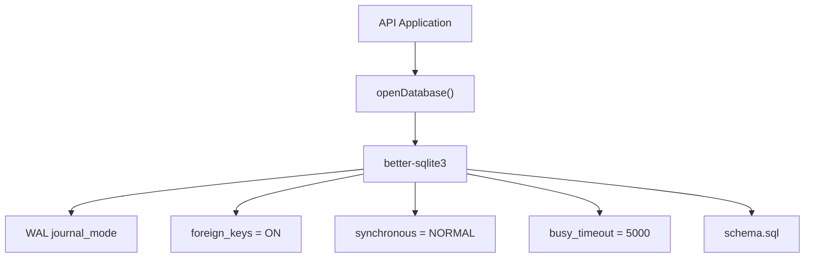

**Diagram sources**
- [database.ts:12-21](file://apps/api/src/db/database.ts#L12-L21)

**Section sources**
- [database.ts:1-23](file://apps/api/src/db/database.ts#L1-L23)
- [schema.sql:1-4](file://apps/api/src/db/schema.sql#L1-L4)

## Core Components
RAT's schema consists of twelve logical entities organized into four tiers:

| Entity | Purpose | Primary Key | Partitioning / Scope |
|---|---|---:|---|
| `repositories` | Repository metadata, source information, lifecycle status, and head commit tracking | `id` | Global; each repository has one row |
| `jobs` | Ingestion job lifecycle and progress | `id` | Scoped by `repo_id` |
| `raw_idents` | Unique raw author identities per repository | Auto-increment `id` | Scoped by `repo_id`; unique on `(repo_id, name, email)` |
| `commits` | Non-merge commits reachable from HEAD | Auto-increment `id` | Scoped by `repo_id`; unique on `(repo_id, sha)` |
| `commit_file_stats` | Fact table: one row per changed file per commit | Composite `(commit_id, path)` | Scoped by `repo_id`; no surrogate key |
| `mailmap_map` | `.mailmap` identity resolution overrides | Composite `(repo_id, ident_id)` | Scoped by `repo_id` |
| `canonical_authors` | Manually created canonical author records | `id` | Scoped by `repo_id` |
| `author_merges` | Manual mapping from raw idents to canonical authors | Composite `(repo_id, ident_id)` | Scoped by `repo_id` |
| `repo_dirs` | Derived cache of every directory path seen in history | Composite `(repo_id, path)` | Scoped by `repo_id` |
| `rollup_repo` | Materialized repository-level aggregates | `repo_id` | Scoped by `repo_id` |
| `rollup_file` | Materialized per-file aggregates | Composite `(repo_id, path)` | Scoped by `repo_id` |
| `rollup_day` | Materialized daily time series | Composite `(repo_id, day)` | Scoped by `repo_id` |

Key design properties:

- **Multi-repository support:** Every data-bearing table includes `repo_id`, allowing a single schema to serve many repositories without sharding or separate databases.
- **Normalized fact model:** `commit_file_stats` stores only raw line-change deltas (`added`, `removed`) per file path per commit. Metrics such as growth, churn, modification frequency, churn rate, ownership, and timeseries are computed at query time.
- **Three-tier author resolution:** Manual canonical merges take priority over `.mailmap` mappings, which take priority over raw idents.
- **Derived directory cache:** `repo_dirs` stores every directory path that appears in history, enabling fast path-scoped validation and navigation.
- **Materialized rollups:** Pre-computed aggregates for common unfiltered dashboard queries, built lazily and serving whole-history metrics without scanning the fact table.

**Section sources**
- [schema.sql:5-18](file://apps/api/src/db/schema.sql#L5-L18)
- [schema.sql:20-31](file://apps/api/src/db/schema.sql#L20-L31)
- [schema.sql:33-40](file://apps/api/src/db/schema.sql#L33-L40)
- [schema.sql:42-51](file://apps/api/src/db/schema.sql#L42-L51)
- [schema.sql:53-64](file://apps/api/src/db/schema.sql#L53-L64)
- [schema.sql:66-75](file://apps/api/src/db/schema.sql#L66-L75)
- [schema.sql:77-83](file://apps/api/src/db/schema.sql#L77-L83)
- [schema.sql:85-91](file://apps/api/src/db/schema.sql#L85-L91)
- [schema.sql:93-99](file://apps/api/src/db/schema.sql#L93-L99)
- [schema.sql:101-132](file://apps/api/src/db/schema.sql#L101-L132)

## Architecture Overview
The database follows a star-like analytical layout centered on `commit_file_stats`. Dimension tables provide context for commits, authors, repositories, jobs, and directories. The architecture includes both query-time computation and materialized rollups for performance optimization.

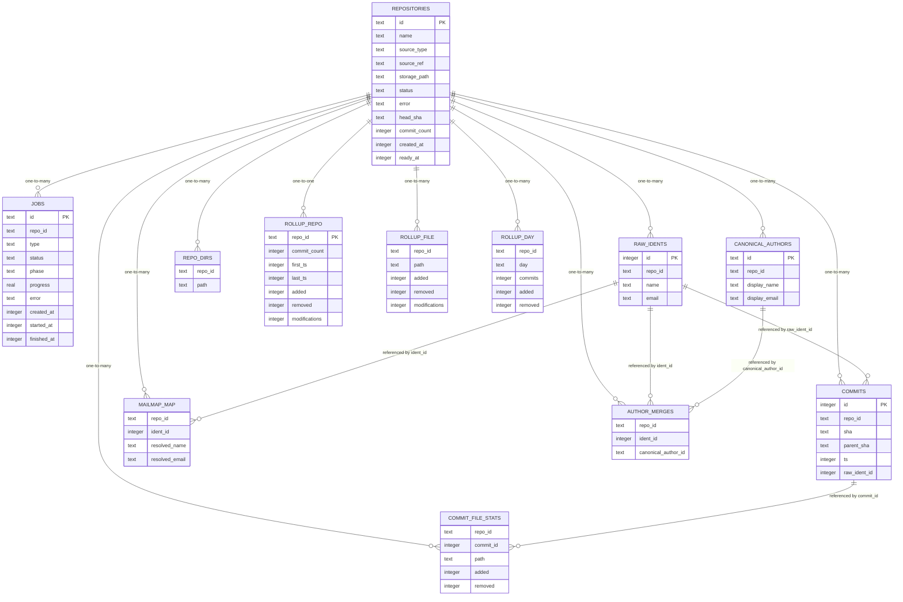

**Diagram sources**
- [schema.sql:5-132](file://apps/api/src/db/schema.sql#L5-L132)

## Detailed Component Analysis

### Multi-Repository Strategy
Every table except the auto-increment-only `raw_idents.id` and the global-style `canonical_authors.id` is scoped by `repo_id`. This makes `repo_id` the effective partitioning key:

- Queries always begin with `c.repo_id = ?` or an equivalent filter.
- Foreign keys reference `repositories(id)`, ensuring orphaned rows are removed when a repository is deleted.
- Indexes on `repo_id` allow efficient filtering before joining into larger tables.

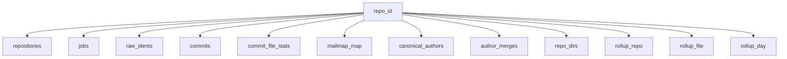

**Diagram sources**
- [schema.sql:5-132](file://apps/api/src/db/schema.sql#L5-L132)

**Section sources**
- [schema.sql:1-4](file://apps/api/src/db/schema.sql#L1-L4)
- [schema.sql:20-31](file://apps/api/src/db/schema.sql#L20-L31)
- [schema.sql:33-40](file://apps/api/src/db/schema.sql#L33-L40)
- [schema.sql:42-51](file://apps/api/src/db/schema.sql#L42-L51)
- [schema.sql:53-64](file://apps/api/src/db/schema.sql#L53-L64)
- [schema.sql:66-75](file://apps/api/src/db/schema.sql#L66-L75)
- [schema.sql:77-83](file://apps/api/src/db/schema.sql#L77-L83)
- [schema.sql:85-91](file://apps/api/src/db/schema.sql#L85-L91)
- [schema.sql:93-99](file://apps/api/src/db/schema.sql#L93-L99)
- [schema.sql:101-132](file://apps/api/src/db/schema.sql#L101-L132)

### Fact Table: `commit_file_stats`
`commit_file_stats` is the primary analytical fact table. Each row represents one file path changed in one commit.

| Column | Type | Constraint | Meaning |
|---|---|---|---|
| `repo_id` | TEXT | NOT NULL, foreign key to `repositories(id)` | Repository scope |
| `commit_id` | INTEGER | NOT NULL, foreign key to `commits(id)` | Commit owning the change |
| `path` | TEXT | NOT NULL | File path in the repository |
| `added` | INTEGER | NOT NULL | Added lines |
| `removed` | INTEGER | NOT NULL | Removed lines |

Important semantics:

- Binary files produce no rows.
- Rename-only changes producing zero additions and zero removals produce no rows.
- Deleted files are recorded as `(0, N)` on the deleted path.
- The composite primary key is `(commit_id, path)`.
- The table uses `WITHOUT ROWID`, so the primary key itself is the clustered storage layout.

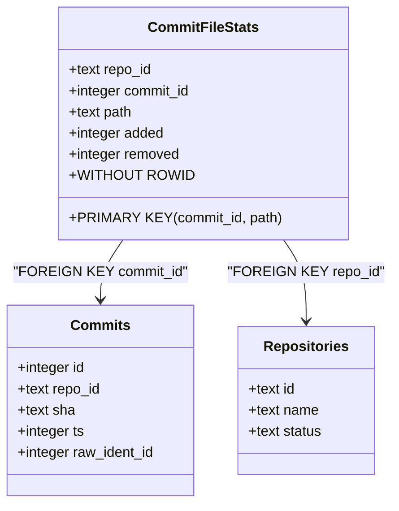

**Diagram sources**
- [schema.sql:53-64](file://apps/api/src/db/schema.sql#L53-L64)
- [schema.sql:42-51](file://apps/api/src/db/schema.sql#L42-L51)
- [schema.sql:5-18](file://apps/api/src/db/schema.sql#L5-L18)

**Section sources**
- [schema.sql:53-64](file://apps/api/src/db/schema.sql#L53-L64)

### Author Resolution Tables
Author identity resolution is intentionally split across three layers with explicit precedence:

1. **Raw idents:** Exact `(name, email)` values from git commits.
2. **Mailmap map:** Automatic normalization based on `.mailmap`.
3. **Manual canonical merges:** User-created canonical authors and mappings.

| Table | Role | Keys and Constraints |
|---|---|---|
| `raw_idents` | Stores unique raw author identities per repository | `id` autoincrement; unique on `(repo_id, name, email)` |
| `mailmap_map` | Maps a raw ident to a resolved `(resolved_name, resolved_email)` | Primary key `(repo_id, ident_id)` |
| `canonical_authors` | Defines stable canonical author records | `id` primary key; scoped by `repo_id` |
| `author_merges` | Maps a raw ident to a canonical author | Primary key `(repo_id, ident_id)` |

Resolution precedence at query time is:

1. `author_merges` → `canonical_authors`
2. `mailmap_map`
3. Raw ident

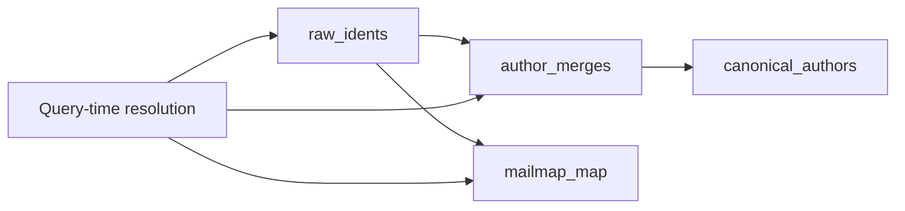

**Diagram sources**
- [schema.sql:33-40](file://apps/api/src/db/schema.sql#L33-L40)
- [schema.sql:66-75](file://apps/api/src/db/schema.sql#L66-L75)
- [schema.sql:77-83](file://apps/api/src/db/schema.sql#L77-L83)
- [schema.sql:85-91](file://apps/api/src/db/schema.sql#L85-L91)

**Section sources**
- [schema.sql:33-40](file://apps/api/src/db/schema.sql#L33-L40)
- [schema.sql:66-75](file://apps/api/src/db/schema.sql#L66-L75)
- [schema.sql:77-83](file://apps/api/src/db/schema.sql#L77-L83)
- [schema.sql:85-91](file://apps/api/src/db/schema.sql#L85-L91)
- [authorMetrics.ts:33-117](file://apps/api/src/metrics/authorMetrics.ts#L33-L117)

### Directory Cache: `repo_dirs`
`repo_dirs` stores every directory path that ever existed in repository history. The repository root is implicit and not stored. This table supports:

- Path validation for metrics endpoints.
- Directory tree navigation.
- Efficient subtree scoping using index-friendly string range predicates.

| Column | Type | Constraint |
|---|---|---|
| `repo_id` | TEXT | NOT NULL, foreign key to `repositories(id)` |
| `path` | TEXT | NOT NULL |
| Primary Key | Composite | `(repo_id, path)` |

**Section sources**
- [schema.sql:93-99](file://apps/api/src/db/schema.sql#L93-L99)
- [objectMetrics.ts:52-68](file://apps/api/src/metrics/objectMetrics.ts#L52-L68)

### Operational Tables: `repositories` and `jobs`
`repositories` tracks ingestion state and repository metadata. `jobs` tracks asynchronous ingestion work.

| Table | Important Columns | Validation Rules |
|---|---|---|
| `repositories` | `id`, `name`, `source_type`, `source_ref`, `storage_path`, `status`, `error`, `head_sha`, `commit_count`, `created_at`, `ready_at` | `source_type` must be `'zip'` or `'url'`; `status` must be one of `'queued'`, `'processing'`, `'ready'`, `'error'` |
| `jobs` | `id`, `repo_id`, `type`, `status`, `phase`, `progress`, `error`, `created_at`, `started_at`, `finished_at` | `status` must be one of `'queued'`, `'running'`, `'done'`, `'failed'`; default `type` is `'ingest'` |

Both tables use `ON DELETE CASCADE` for `repo_id`, so deleting a repository removes its jobs and related rows.

**Section sources**
- [schema.sql:5-18](file://apps/api/src/db/schema.sql#L5-L18)
- [schema.sql:20-31](file://apps/api/src/db/schema.sql#L20-L31)

### Commit Model: `commits`
`commits` stores non-merge commits reachable from the ingested HEAD. Each commit references exactly one raw author identity.

| Column | Type | Constraint | Meaning |
|---|---|---|---|
| `id` | INTEGER | PRIMARY KEY AUTOINCREMENT | Internal commit identifier |
| `repo_id` | TEXT | NOT NULL, foreign key to `repositories(id)` | Repository scope |
| `sha` | TEXT | NOT NULL | Git commit SHA |
| `parent_sha` | TEXT | Nullable | Parent commit SHA |
| `ts` | INTEGER | NOT NULL | Committer timestamp |
| `raw_ident_id` | INTEGER | NOT NULL, foreign key to `raw_idents(id)` | Raw author identity |
| Unique | Composite | `(repo_id, sha)` | Prevents duplicate commits per repository |

**Section sources**
- [schema.sql:42-51](file://apps/api/src/db/schema.sql#L42-L51)

### Materialized Rollup Tables
The rollup tables provide pre-computed aggregates for common dashboard queries, eliminating the need to scan the large fact table for unfiltered operations.

#### Repository-Level Rollup: `rollup_repo`
Stores aggregate statistics for entire repositories.

| Column | Type | Constraint | Meaning |
|---|---|---|---|
| `repo_id` | TEXT | PRIMARY KEY, foreign key to `repositories(id)` | Repository scope |
| `commit_count` | INTEGER | NOT NULL | Total number of commits |
| `first_ts` | INTEGER | Nullable | Earliest commit timestamp |
| `last_ts` | INTEGER | Nullable | Latest commit timestamp |
| `added` | INTEGER | NOT NULL | Total added lines |
| `removed` | INTEGER | NOT NULL | Total removed lines |
| `modifications` | INTEGER | NOT NULL | Distinct commits with changes |

#### File-Level Rollup: `rollup_file`
Pre-aggregates per-file statistics for fast file listing and sorting.

| Column | Type | Constraint | Meaning |
|---|---|---|---|
| `repo_id` | TEXT | NOT NULL, foreign key to `repositories(id)` | Repository scope |
| `path` | TEXT | NOT NULL | File path |
| `added` | INTEGER | NOT NULL | Total added lines for file |
| `removed` | INTEGER | NOT NULL | Total removed lines for file |
| `modifications` | INTEGER | NOT NULL | Distinct commits touching file |
| Primary Key | Composite | `(repo_id, path)` | One row per file |

#### Daily Time Series Rollup: `rollup_day`
Pre-computes daily activity metrics for timeseries visualization.

| Column | Type | Constraint | Meaning |
|---|---|---|---|
| `repo_id` | TEXT | NOT NULL, foreign key to `repositories(id)` | Repository scope |
| `day` | TEXT | NOT NULL | Date in YYYY-MM-DD format |
| `commits` | INTEGER | NOT NULL | Number of distinct commits |
| `added` | INTEGER | NOT NULL | Lines added on this day |
| `removed` | INTEGER | NOT NULL | Lines removed on this day |
| Primary Key | Composite | `(repo_id, day)` | One row per day |

Rollup characteristics:

- **Lazy materialization:** Built on first access for existing repositories or when repositories become ready.
- **Idempotent building:** Safe to call multiple times; builds only once per repository.
- **Correctness contract:** Rollup computations mirror live query-time computations exactly.
- **Unfiltered access only:** Serve whole-history, unscoped queries; filtered queries continue using the fact table.
- **Cascade deletion:** Automatically removed when repositories are deleted.

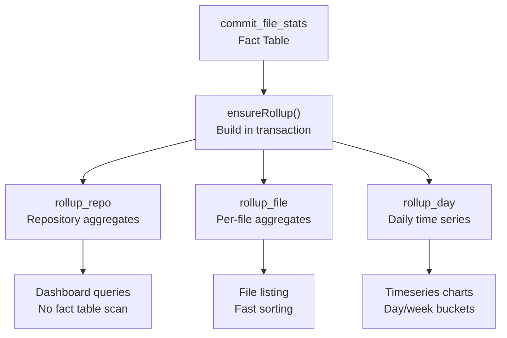

**Diagram sources**
- [schema.sql:101-132](file://apps/api/src/db/schema.sql#L101-L132)
- [rollup.ts:49-91](file://apps/api/src/metrics/rollup.ts#L49-L91)

**Section sources**
- [schema.sql:101-132](file://apps/api/src/db/schema.sql#L101-L132)
- [rollup.ts:1-172](file://apps/api/src/metrics/rollup.ts#L1-L172)

### Operational Tables: `repositories` and `jobs`
`repositories` tracks ingestion state and repository metadata. `jobs` tracks asynchronous ingestion work.

| Table | Important Columns | Validation Rules |
|---|---|---|
| `repositories` | `id`, `name`, `source_type`, `source_ref`, `storage_path`, `status`, `error`, `head_sha`, `commit_count`, `created_at`, `ready_at` | `source_type` must be `'zip'` or `'url'`; `status` must be one of `'queued'`, `'processing'`, `'ready'`, `'error'` |
| `jobs` | `id`, `repo_id`, `type`, `status`, `phase`, `progress`, `error`, `created_at`, `started_at`, `finished_at` | `status` must be one of `'queued'`, `'running'`, `'done'`, `'failed'`; default `type` is `'ingest'` |

Both tables use `ON DELETE CASCADE` for `repo_id`, so deleting a repository removes its jobs and related rows.

**Section sources**
- [schema.sql:5-18](file://apps/api/src/db/schema.sql#L5-L18)
- [schema.sql:20-31](file://apps/api/src/db/schema.sql#L20-L31)

### Commit Model: `commits`
`commits` stores non-merge commits reachable from the ingested HEAD. Each commit references exactly one raw author identity.

| Column | Type | Constraint | Meaning |
|---|---|---|---|
| `id` | INTEGER | PRIMARY KEY AUTOINCREMENT | Internal commit identifier |
| `repo_id` | TEXT | NOT NULL, foreign key to `repositories(id)` | Repository scope |
| `sha` | TEXT | NOT NULL | Git commit SHA |
| `parent_sha` | TEXT | Nullable | Parent commit SHA |
| `ts` | INTEGER | NOT NULL | Committer timestamp |
| `raw_ident_id` | INTEGER | NOT NULL, foreign key to `raw_idents(id)` | Raw author identity |
| Unique | Composite | `(repo_id, sha)` | Prevents duplicate commits per repository |

**Section sources**
- [schema.sql:42-51](file://apps/api/src/db/schema.sql#L42-L51)

## Dependency Analysis
The following diagram shows how the analytics layer joins the schema to compute metrics, including the three-tier author resolution and rollup optimization.

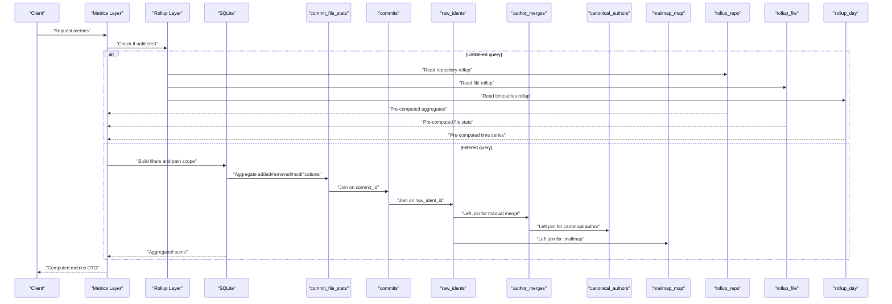

**Diagram sources**
- [objectMetrics.ts:38-45](file://apps/api/src/metrics/objectMetrics.ts#L38-L45)
- [objectMetrics.ts:79-98](file://apps/api/src/metrics/objectMetrics.ts#L79-L98)
- [authorMetrics.ts:43-59](file://apps/api/src/metrics/authorMetrics.ts#L43-L59)
- [rollup.ts:31-43](file://apps/api/src/metrics/rollup.ts#L31-L43)
- [schema.sql:53-132](file://apps/api/src/db/schema.sql#L53-L132)

**Section sources**
- [objectMetrics.ts:38-45](file://apps/api/src/metrics/objectMetrics.ts#L38-L45)
- [authorMetrics.ts:43-59](file://apps/api/src/metrics/authorMetrics.ts#L43-L59)
- [rollup.ts:31-43](file://apps/api/src/metrics/rollup.ts#L31-L43)

## Performance Considerations

### Indexing Strategy
The schema defines five explicit indexes:

| Index | Target Column(s) | Purpose |
|---|---|---|
| `idx_commits_repo_ts` | `commits(repo_id, ts)` | Optimizes commit-set filtering by repository and time range |
| `idx_commits_repo_ident` | `commits(repo_id, raw_ident_id)` | Optimizes author-based commit filtering |
| `idx_file_stats_repo_path` | `commit_file_stats(repo_id, path)` | Supports path-scoped analytics and directory/file lookups |
| `idx_file_stats_commit` | `commit_file_stats(commit_id)` | Supports per-commit stats and joins back to commits |
| `idx_jobs_repo` | `jobs(repo_id, created_at)` | Optimizes job listing and polling per repository |

These indexes complement the natural primary keys and foreign keys. Notably, `commit_file_stats` does not have a surrogate primary key because it uses `WITHOUT ROWID` with `(commit_id, path)` as the clustered primary key.

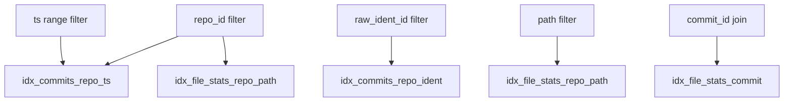

**Diagram sources**
- [schema.sql:134-139](file://apps/api/src/db/schema.sql#L134-L139)

**Section sources**
- [schema.sql:134-139](file://apps/api/src/db/schema.sql#L134-L139)

### WITHOUT ROWID Optimization
`commit_file_stats` uses `WITHOUT ROWID`, meaning SQLite stores the table rows ordered by the primary key `(commit_id, path)` instead of maintaining a hidden rowid plus a separate index. This optimization reduces storage overhead and improves scan performance for queries that filter or join on `commit_id` or `path`.

Implications:

- The primary key is both the logical identity and the physical clustering order.
- Inserts are efficient when committed in batches, especially when ingestion streams commits sequentially.
- Queries targeting a specific commit or path prefix benefit from clustered access patterns.

**Section sources**
- [schema.sql:53-64](file://apps/api/src/db/schema.sql#L53-L64)

### Query-Time Metric Computation
All metrics are computed at query time from the fact table. The system avoids materialized rollups by aggregating `added`, `removed`, and distinct modified commits during the request.

Common computations include:

| Metric | Formula | Notes |
|---|---|---|
| Growth | `l⁺ − l⁻` | Net line growth |
| Churn | `l⁺ + l⁻` | Total line churn |
| Modifications | `n_H,o` | Distinct commits touching the object |
| Modification Frequency | `n_H,o / |H|` | Normalized by commit set size |
| Churn Rate | `λ / |H|` | Normalized by commit set size |
| Ownership | `λ_H,o,a / λ_H,o` | Per-author share of object churn |

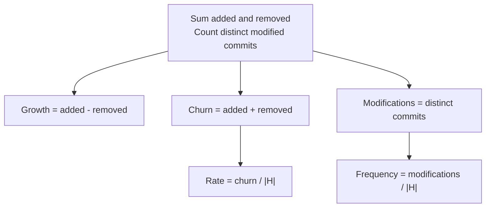

**Diagram sources**
- [setMetrics.ts:6-23](file://apps/api/src/metrics/setMetrics.ts#L6-L23)
- [objectMetrics.ts:79-98](file://apps/api/src/metrics/objectMetrics.ts#L79-L98)
- [authorMetrics.ts:125-183](file://apps/api/src/metrics/authorMetrics.ts#L125-L183)

**Section sources**
- [setMetrics.ts:6-23](file://apps/api/src/metrics/setMetrics.ts#L6-L23)
- [objectMetrics.ts:79-98](file://apps/api/src/metrics/objectMetrics.ts#L79-L98)
- [authorMetrics.ts:125-183](file://apps/api/src/metrics/authorMetrics.ts#L125-L183)

### Materialized Rollup Strategy
The rollup tables provide a two-tier performance optimization strategy:

1. **Query-time computation:** For filtered queries (time ranges, author filters, path scopes), the system scans the fact table directly.
2. **Pre-computed rollups:** For unfiltered dashboard queries, the system reads from materialized rollup tables.

Rollup selection logic:

- **Unfiltered queries:** Use rollup tables for repository metrics, file listings, and timeseries.
- **Filtered queries:** Continue using fact table computation for accuracy and flexibility.
- **Lazy materialization:** Rollups are built on first access or when repositories become ready.
- **Idempotent building:** Safe to call multiple times; builds only once per repository.

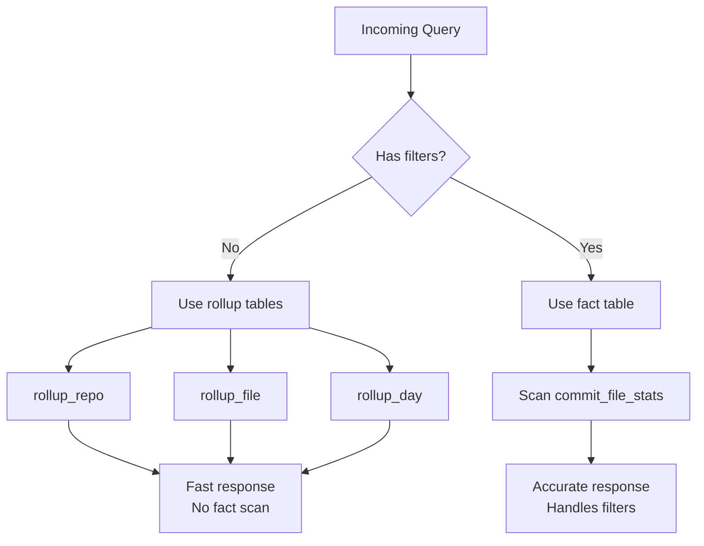

**Diagram sources**
- [rollup.ts:31-43](file://apps/api/src/metrics/rollup.ts#L31-L43)
- [rollup.ts:49-91](file://apps/api/src/metrics/rollup.ts#L49-L91)

**Section sources**
- [rollup.ts:1-172](file://apps/api/src/metrics/rollup.ts#L1-L172)

### Path Scoping and Index-Friendly Subtree Queries
Directory scoping uses an index-friendly substring range predicate:

- File scope: exact match on `s.path`.
- Directory scope: matches the directory itself or any descendant path using a lexicographic range.
- Repository root scope: matches all paths.

This approach allows SQLite to use indexes effectively while avoiding expensive full-table scans for common directory drills.

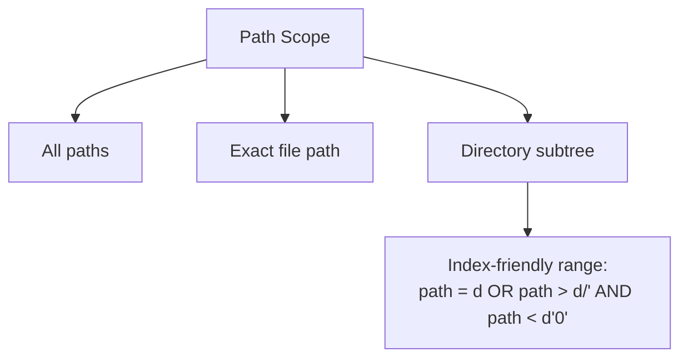

**Diagram sources**
- [objectMetrics.ts:24-36](file://apps/api/src/metrics/objectMetrics.ts#L24-L36)

**Section sources**
- [objectMetrics.ts:24-36](file://apps/api/src/metrics/objectMetrics.ts#L24-L36)

## Troubleshooting Guide

### Database Initialization Issues
If the database fails to open or apply the schema:

- Verify that the storage directory exists and is writable.
- Confirm that `schema.sql` is readable at runtime.
- Check that foreign-key constraints are enabled.
- Ensure WAL mode and synchronous settings are applied.

**Section sources**
- [database.ts:12-21](file://apps/api/src/db/database.ts#L12-L21)

### Referential Integrity Failures
Foreign keys are enforced at the database level. Insert failures can occur if:

- A `repo_id` references a nonexistent repository.
- A `commit_id` references a nonexistent commit.
- An `ident_id` references a nonexistent raw ident.
- A `canonical_author_id` references a nonexistent canonical author.

Because most relationships use `ON DELETE CASCADE`, deleting a repository removes dependent rows automatically.

**Section sources**
- [schema.sql:20-31](file://apps/api/src/db/schema.sql#L20-L31)
- [schema.sql:33-40](file://apps/api/src/db/schema.sql#L33-L40)
- [schema.sql:42-51](file://apps/api/src/db/schema.sql#L42-L51)
- [schema.sql:53-64](file://apps/api/src/db/schema.sql#L53-L64)
- [schema.sql:66-75](file://apps/api/src/db/schema.sql#L66-L75)
- [schema.sql:85-91](file://apps/api/src/db/schema.sql#L85-L91)

### Slow Analytics Queries
If analytics queries are slow:

- Ensure queries filter by `repo_id` first.
- Use time-range filters through `fromTs`/`toTs` to leverage `idx_commits_repo_ts`.
- Prefer directory scopes that align with `idx_file_stats_repo_path`.
- Avoid unnecessary joins outside the committed fact pipeline.
- Validate that the ingestion process completed successfully and populated `commit_file_stats`.
- Check if rollups are being used for unfiltered queries via `hasRollup()`.

**Section sources**
- [schema.sql:134-139](file://apps/api/src/db/schema.sql#L134-L139)
- [commitSet.ts:100-126](file://apps/api/src/metrics/commitSet.ts#L100-L126)
- [objectMetrics.ts:24-36](file://apps/api/src/metrics/objectMetrics.ts#L24-L36)
- [rollup.ts:41-43](file://apps/api/src/metrics/rollup.ts#L41-L43)

### Rollup Consistency Issues
If rollup data appears inconsistent:

- Verify that `ensureRollup()` was called successfully.
- Check that the repository exists and is accessible.
- Confirm that the rollup build completed without errors.
- Validate that rollup computations match live computations for the same query.
- Note that rollups are rebuilt lazily and may not exist for newly created repositories.

**Section sources**
- [rollup.ts:49-91](file://apps/api/src/metrics/rollup.ts#L49-L91)
- [rollup.test.ts:25-50](file://apps/api/test/rollup.test.ts#L25-L50)

## Conclusion
RAT's SQLite schema is a compact, multi-repository, normalized design optimized for query-time analytics with optional materialized rollups for performance. The `commit_file_stats` fact table stores minimal per-file-per-commit deltas, while dimension tables provide repository, commit, author, and directory context. The three-tier author resolution system (manual canonical merges > mailmap > raw idents) provides flexible identity management.

Indexes target the most common query patterns: repository-scoped time ranges, author-based filtering, path scoping, and commit joins. The `WITHOUT ROWID` optimization further improves performance for the largest table. The materialized rollup tables (`rollup_repo`, `rollup_file`, `rollup_day`) provide pre-computed aggregates for unfiltered dashboard queries, while filtered queries continue to use the fact table for accuracy and flexibility. By computing most metrics at query time and selectively materializing common queries, the schema remains simple, consistent, and performant across repository, file, directory, author, and time dimensions.