# Shared TypeScript Types

<cite>
**Referenced Files in This Document**
- [types.ts](file://packages/shared/src/types.ts)
- [index.ts](file://packages/shared/src/index.ts)
- [package.json](file://packages/shared/package.json)
- [schema.sql](file://apps/api/src/db/schema.sql)
- [repositories.ts](file://apps/api/src/routes/repositories.ts)
- [jobs.ts](file://apps/api/src/routes/jobs.ts)
- [commits.ts](file://apps/api/src/routes/commits.ts)
- [authors.ts](file://apps/api/src/routes/authors.ts)
- [metrics.ts](file://apps/api/src/routes/metrics.ts)
- [setMetrics.ts](file://apps/api/src/metrics/setMetrics.ts)
- [api.ts](file://apps/web/src/lib/api.ts)
- [CloneUrlForm.tsx](file://apps/web/src/components/ingest/CloneUrlForm.tsx)
- [MetricCards.tsx](file://apps/web/src/components/metrics/MetricCards.tsx)
- [FilterBar.tsx](file://apps/web/src/components/filters/FilterBar.tsx)
</cite>

## Table of Contents
1. [Introduction](#introduction)
2. [Project Structure](#project-structure)
3. [Core Components](#core-components)
4. [Architecture Overview](#architecture-overview)
5. [Detailed Component Analysis](#detailed-component-analysis)
6. [Dependency Analysis](#dependency-analysis)
7. [Performance Considerations](#performance-considerations)
8. [Troubleshooting Guide](#troubleshooting-guide)
9. [Conclusion](#conclusion)

## Introduction
This document explains the shared TypeScript type definitions that provide contract consistency between the RAT API and the web frontend. The shared package exports only types, so it introduces no runtime dependency while ensuring both layers agree on repository, job, commit, author, path, and metric payloads. It also documents how these types map to the SQLite schema, how discriminated unions and strict numeric typing enforce correctness, and how API routes and frontend components consume them.

## Project Structure
The monorepo uses a dedicated `@rat/shared` package as the single source of truth for DTOs:

- `packages/shared/src/types.ts`: all exported interfaces, types, and enumerations used by both workspaces.
- `packages/shared/src/index.ts`: re-exports only types from `types.ts`.
- `packages/shared/package.json`: declares the package entry points and marks it as private.
- `apps/api`: Express routes import shared types and convert database rows into DTOs before responding.
- `apps/web`: Next.js client library imports shared types to strongly type API responses and request helpers.

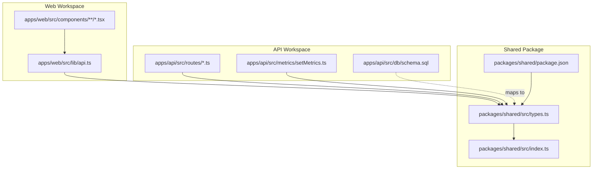

**Diagram sources**
- [types.ts:1-226](file://packages/shared/src/types.ts#L1-L226)
- [index.ts:1-2](file://packages/shared/src/index.ts#L1-L2)
- [package.json:1-11](file://packages/shared/package.json#L1-L11)
- [schema.sql:1-106](file://apps/api/src/db/schema.sql#L1-L106)
- [repositories.ts:1-166](file://apps/api/src/routes/repositories.ts#L1-L166)
- [metrics.ts:1-199](file://apps/api/src/routes/metrics.ts#L1-L199)
- [setMetrics.ts:1-36](file://apps/api/src/metrics/setMetrics.ts#L1-L36)
- [api.ts:1-269](file://apps/web/src/lib/api.ts#L1-L269)

**Section sources**
- [types.ts:1-226](file://packages/shared/src/types.ts#L1-L226)
- [index.ts:1-2](file://packages/shared/src/index.ts#L1-L2)
- [package.json:1-11](file://packages/shared/package.json#L1-L11)

## Core Components
The shared types are organized around five areas: repositories and jobs, commits and authors, paths, metrics, and common envelopes.

### Repository and Job Types
- `RepoSourceType`: `'zip' | 'url'`.
- `RepoStatus`: `'queued' | 'processing' | 'ready' | 'error'`.
- `JobStatus`: `'queued' | 'running' | 'done' | 'failed'`.
- `JobPhase`: `'pending' | 'extracting' | 'cloning' | 'validating' | 'analyzing' | 'finalizing' | 'complete'`.
- `RepositoryDTO`: repository metadata, status, head SHA, commit count, timestamps, and optional latest ingestion job.
- `JobDTO`: ingestion job identity, lifecycle status, phase, progress, error, and timestamps.

These types mirror the `repositories` and `jobs` tables in the database schema. Status and phase fields use literal union types to prevent invalid states at compile time.

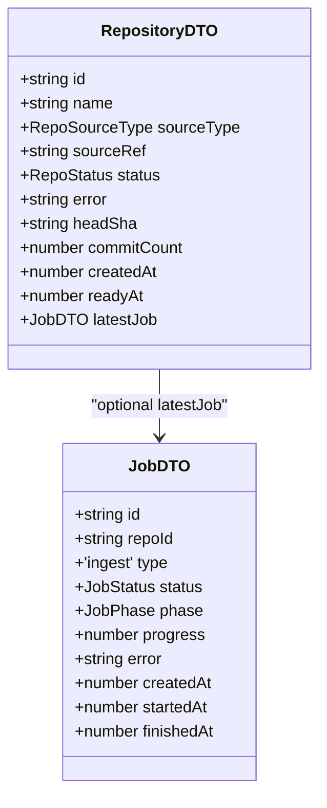

**Diagram sources**
- [types.ts:12-55](file://packages/shared/src/types.ts#L12-L55)

**Section sources**
- [types.ts:12-55](file://packages/shared/src/types.ts#L12-L55)
- [schema.sql:5-31](file://apps/api/src/db/schema.sql#L5-L31)

### Commit and Author Types
- `CommitListItem`: lightweight commit row shown in lists.
- `CommitFileStatDTO`: per-file added/removed line counts.
- `CommitStatsDTO`: full commit detail including file stats.
- `AuthorKind`: `'canonical' | 'mailmap' | 'raw'`, describing how an author identity was resolved.
- `AuthorIdentityDTO`: canonical author with stable `id`, display name/email, resolution kind, commit count, and raw identity merge count.
- `RawIdentDTO`: raw git identity stored in the database.
- `AuthorsResponse`: response containing resolved authors and raw identities.

These types correspond to the `commits`, `commit_file_stats`, `raw_idents`, `mailmap_map`, `canonical_authors`, and `author_merges` tables.

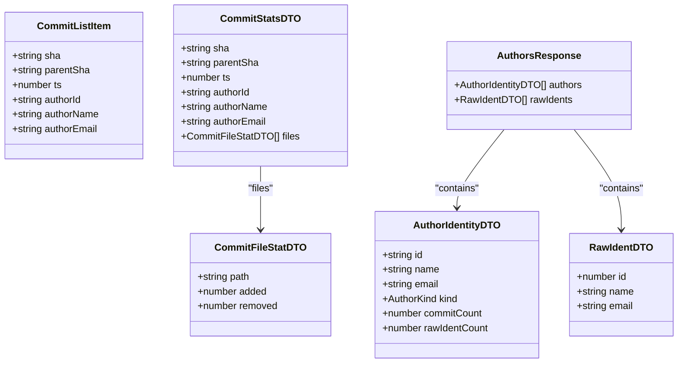

**Diagram sources**
- [types.ts:61-111](file://packages/shared/src/types.ts#L61-L111)

**Section sources**
- [types.ts:61-111](file://packages/shared/src/types.ts#L61-L111)
- [schema.sql:33-91](file://apps/api/src/db/schema.sql#L33-L91)

### Path Types
- `PathsResponse`: contains `files` (all file paths ever seen) and `dirs` (directory paths excluding the repository root).

This supports UI features such as path pickers and directory-scoped metrics.

**Section sources**
- [types.ts:117-122](file://packages/shared/src/types.ts#L117-L122)

### Metric Types
The metric types encode the brief’s mathematical model:

- `ObjectMetricsDTO`: core object-level metrics including `added`, `removed`, `growth`, `churn`, `modifications`, `modificationFrequency`, and `churnRate`.
- `RepoMetricsDTO`: extends object metrics with commit-set size and timestamp bounds.
- `FileMetricRowDTO`: object metrics plus `path`.
- `DirectoryMetricRowDTO`: object metrics plus `path` and `depth`.
- `DirectoryMetricsDTO`: directory scope, self metrics, and child directory rows.
- `AuthorMetricRowDTO`: per-author contribution metrics, including ownership fraction.
- `AuthorMetricsResponse`: total churn denominator and author rows.
- `TimeseriesPointDTO`: bucketed time series point.
- `TimeseriesResponse`: bucket granularity and points array.

The metric calculations are implemented in the API layer and mapped to these DTOs using strict arithmetic rules.

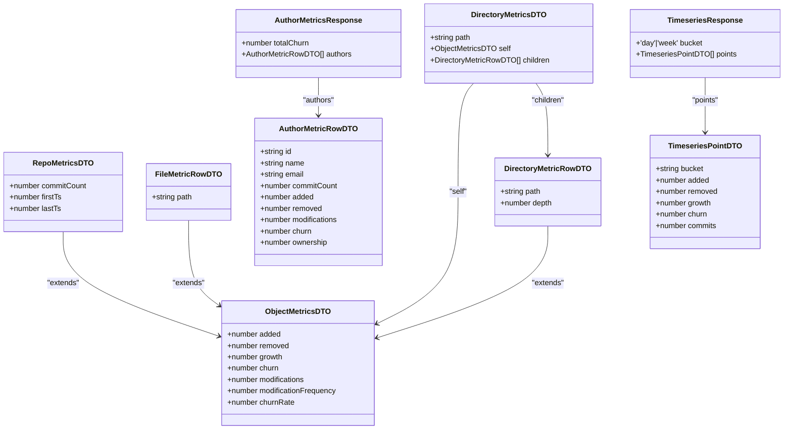

**Diagram sources**
- [types.ts:128-203](file://packages/shared/src/types.ts#L128-L203)

**Section sources**
- [types.ts:128-203](file://packages/shared/src/types.ts#L128-L203)
- [setMetrics.ts:1-36](file://apps/api/src/metrics/setMetrics.ts#L1-L36)

### Common Envelopes
- `ListResponse<T>`: paginated list envelope with `items`, `total`, `page`, `pageSize`, and optional `commitCount`.
- `RepositoriesResponse`: wrapper for repository lists.
- `ApiErrorBody`: structured server error with `code` and `message`.

These envelopes standardize pagination and error shapes across endpoints.

**Section sources**
- [types.ts:209-225](file://packages/shared/src/types.ts#L209-L225)

## Architecture Overview
The shared types form the contract boundary between the API and the frontend. Database rows are converted into DTOs in route handlers; the frontend consumes those DTOs through a typed client helper.

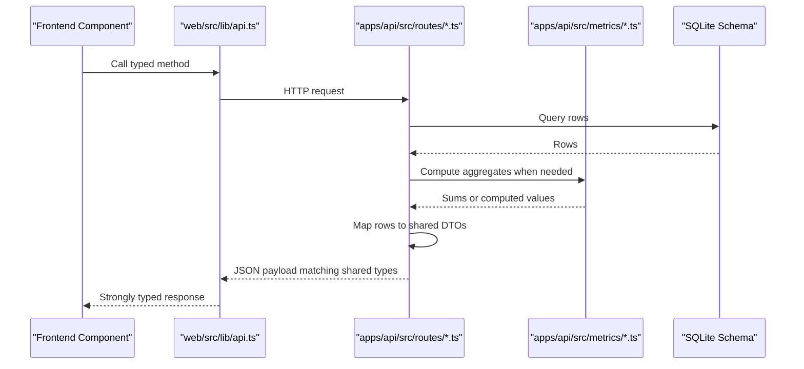

**Diagram sources**
- [api.ts:1-269](file://apps/web/src/lib/api.ts#L1-L269)
- [repositories.ts:1-166](file://apps/api/src/routes/repositories.ts#L1-L166)
- [commits.ts:1-131](file://apps/api/src/routes/commits.ts#L1-L131)
- [metrics.ts:1-199](file://apps/api/src/routes/metrics.ts#L1-L199)
- [setMetrics.ts:1-36](file://apps/api/src/metrics/setMetrics.ts#L1-L36)
- [schema.sql:1-106](file://apps/api/src/db/schema.sql#L1-L106)

## Detailed Component Analysis

### Repository and Job Endpoints
The repository routes create repositories from zip uploads or clone URLs, list repositories with their latest ingestion job, retrieve details, and delete repositories. Jobs are polled through a separate endpoint.

Key behaviors:
- Upload and clone endpoints return both `repository` and `job` objects typed as `RepositoryDTO` and `JobDTO`.
- Listing maps each database row to `RepositoryDTO` and attaches the latest job via `toJobDTO`.
- Deletion prevents removal while an active job exists.

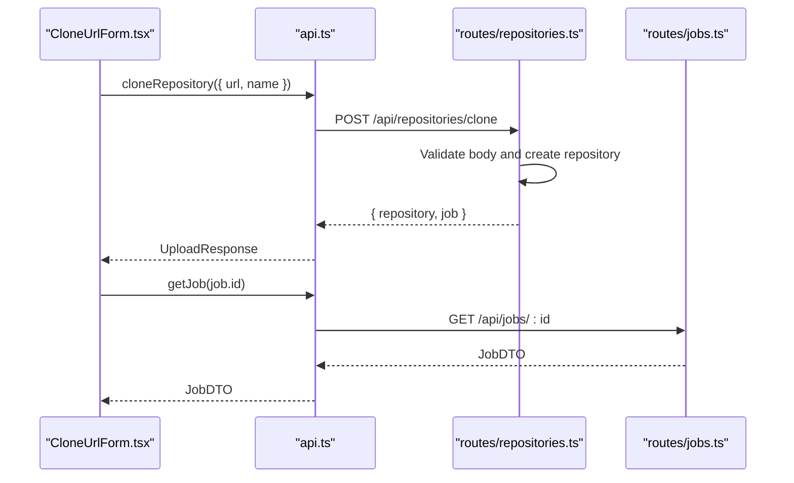

**Diagram sources**
- [CloneUrlForm.tsx:1-86](file://apps/web/src/components/ingest/CloneUrlForm.tsx#L1-L86)
- [api.ts:139-193](file://apps/web/src/lib/api.ts#L139-L193)
- [repositories.ts:117-135](file://apps/api/src/routes/repositories.ts#L117-L135)
- [jobs.ts:7-30](file://apps/api/src/routes/jobs.ts#L7-L30)

**Section sources**
- [repositories.ts:23-37](file://apps/api/src/routes/repositories.ts#L23-L37)
- [repositories.ts:77-162](file://apps/api/src/routes/repositories.ts#L77-L162)
- [jobs.ts:7-30](file://apps/api/src/routes/jobs.ts#L7-L30)

### Commits and Commit Stats
The commits endpoint returns a paginated list of commits and per-commit file statistics. It builds SQL filters from shared filter parameters and returns `ListResponse<CommitListItem>` and `CommitStatsDTO`.

Important aspects:
- Commit list includes resolved author identity fields.
- Commit stats include file-level added/removed counts.
- Pagination and commit-set size are included in the list response.

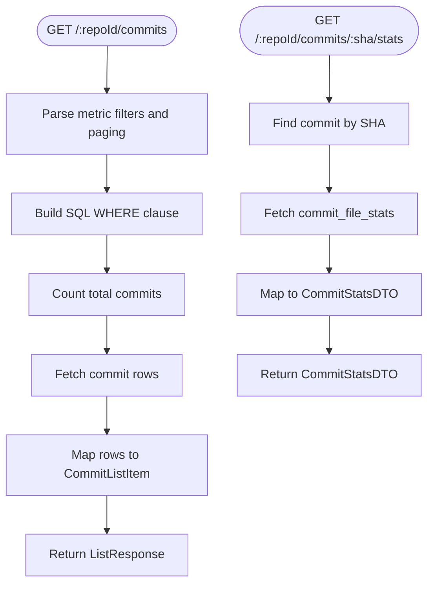

**Diagram sources**
- [commits.ts:36-92](file://apps/api/src/routes/commits.ts#L36-L92)
- [commits.ts:94-127](file://apps/api/src/routes/commits.ts#L94-L127)

**Section sources**
- [commits.ts:21-29](file://apps/api/src/routes/commits.ts#L21-L29)
- [commits.ts:36-92](file://apps/api/src/routes/commits.ts#L36-L92)
- [commits.ts:94-127](file://apps/api/src/routes/commits.ts#L94-L127)

### Authors and Paths
The authors endpoint returns resolved canonical authors and raw identities. The paths endpoint is referenced by the frontend but not analyzed here; its response shape is defined by `PathsResponse`.

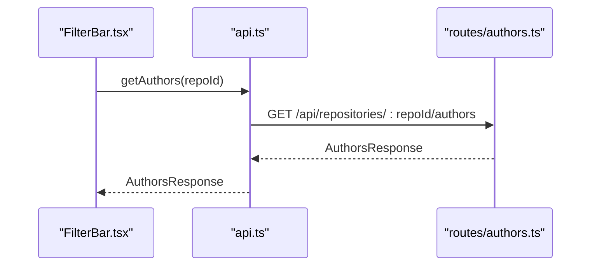

**Diagram sources**
- [FilterBar.tsx:74-85](file://apps/web/src/components/filters/FilterBar.tsx#L74-L85)
- [api.ts:195-200](file://apps/web/src/lib/api.ts#L195-L200)
- [authors.ts:11-18](file://apps/api/src/routes/authors.ts#L11-L18)

**Section sources**
- [authors.ts:1-22](file://apps/api/src/routes/authors.ts#L1-L22)
- [types.ts:88-122](file://packages/shared/src/types.ts#L88-L122)

### Metrics Endpoints
The metrics router exposes repository-wide metrics, file metrics, directory metrics, author metrics, and timeseries data. All responses conform to shared DTOs.

Key flows:
- Repository metrics compute sums and derive rates using `toObjectMetricsDTO`.
- File metrics aggregate per-path changes and support sorting and pagination.
- Directory metrics compute subtree metrics and child directories up to a bounded depth.
- Author metrics decorate raw author rows with resolved names and ownership fractions.
- Timeseries buckets daily or weekly change and commit counts.

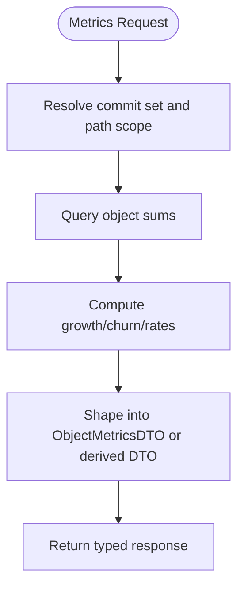

**Diagram sources**
- [metrics.ts:46-195](file://apps/api/src/routes/metrics.ts#L46-L195)
- [setMetrics.ts:11-23](file://apps/api/src/metrics/setMetrics.ts#L11-L23)

**Section sources**
- [metrics.ts:23-39](file://apps/api/src/routes/metrics.ts#L23-L39)
- [metrics.ts:46-113](file://apps/api/src/routes/metrics.ts#L46-L113)
- [metrics.ts:115-172](file://apps/api/src/routes/metrics.ts#L115-L172)
- [metrics.ts:174-195](file://apps/api/src/routes/metrics.ts#L174-L195)
- [setMetrics.ts:1-36](file://apps/api/src/metrics/setMetrics.ts#L1-L36)

### Frontend Usage Examples
The frontend uses shared types to ensure API calls and UI state are consistent with the backend contract.

- Clone URL form validates input and calls `api.cloneRepository`, receiving `UploadResponse` containing `RepositoryDTO` and `JobDTO`.
- Metric cards render `RepoMetricsDTO`, formatting growth, churn, modification frequency, and churn rate.
- Filter bar compiles UI state into `CommitFilters`, which the API client serializes into query parameters consumed by metric endpoints.

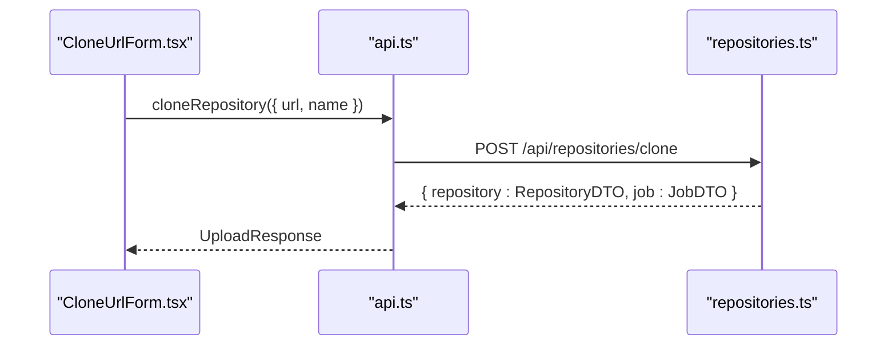

**Diagram sources**
- [CloneUrlForm.tsx:16-37](file://apps/web/src/components/ingest/CloneUrlForm.tsx#L16-L37)
- [api.ts:139-145](file://apps/web/src/lib/api.ts#L139-L145)
- [repositories.ts:117-135](file://apps/api/src/routes/repositories.ts#L117-L135)

**Section sources**
- [CloneUrlForm.tsx:1-86](file://apps/web/src/components/ingest/CloneUrlForm.tsx#L1-L86)
- [MetricCards.tsx:26-88](file://apps/web/src/components/metrics/MetricCards.tsx#L26-L88)
- [FilterBar.tsx:33-57](file://apps/web/src/components/filters/FilterBar.tsx#L33-L57)
- [api.ts:84-103](file://apps/web/src/lib/api.ts#L84-L103)

## Dependency Analysis
The shared package is imported by both workspaces:

- API routes import DTOs to type responses and to validate mapping functions.
- The web client imports DTOs to type fetch results and request helpers.
- The database schema defines constraints that align with the literal union types in the shared package.

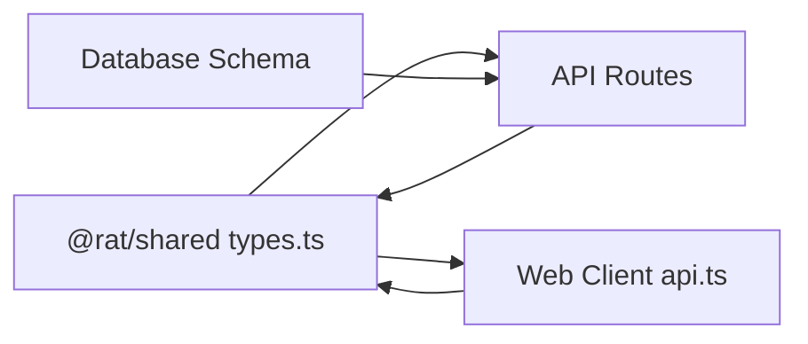

**Diagram sources**
- [types.ts:1-226](file://packages/shared/src/types.ts#L1-L226)
- [repositories.ts:7-21](file://apps/api/src/routes/repositories.ts#L7-L21)
- [commits.ts:1-14](file://apps/api/src/routes/commits.ts#L1-L14)
- [metrics.ts:1-21](file://apps/api/src/routes/metrics.ts#L1-L21)
- [api.ts:1-15](file://apps/web/src/lib/api.ts#L1-L15)
- [schema.sql:1-106](file://apps/api/src/db/schema.sql#L1-L106)

**Section sources**
- [types.ts:1-226](file://packages/shared/src/types.ts#L1-L226)
- [schema.sql:1-106](file://apps/api/src/db/schema.sql#L1-L106)

## Performance Considerations
- Numeric fields such as `added`, `removed`, `growth`, `churn`, and derived rates are strictly typed as `number`, preventing accidental string concatenation or NaN propagation in UI rendering.
- Paginated list responses include `commitCount`, enabling accurate rate calculations without additional queries.
- Directory depth is bounded in the metrics endpoint to avoid excessive tree traversal.
- Time-series bucketing reduces payload size for charts while preserving temporal aggregation.

[No sources needed since this section provides general guidance]

## Troubleshooting Guide
Common issues and how shared types help diagnose them:

- Invalid status or phase values: Literal union types (`RepoStatus`, `JobStatus`, `JobPhase`) cause compile-time errors if mismatched strings are assigned.
- Missing required fields: Strict interface definitions surface missing properties during development.
- Incorrect metric formulas: Centralized computation in `toObjectMetricsDTO` ensures consistent derivation of `growth`, `churn`, `modificationFrequency`, and `churnRate`.
- Frontend-backend mismatch: Because both sides import from `@rat/shared`, structural mismatches are caught at build time rather than runtime.

When debugging API responses:
- Inspect the structured `ApiErrorBody` returned by the server.
- Use the frontend `ApiError` wrapper to access `code`, `status`, and `message`.
- Verify that list responses include `commitCount` when computing per-commit rates.

**Section sources**
- [types.ts:14-25](file://packages/shared/src/types.ts#L14-L25)
- [types.ts:222-225](file://packages/shared/src/types.ts#L222-L225)
- [api.ts:22-41](file://apps/web/src/lib/api.ts#L22-L41)
- [setMetrics.ts:11-23](file://apps/api/src/metrics/setMetrics.ts#L11-L23)

## Conclusion
The shared TypeScript types in `@rat/shared` are the contract backbone of RAT. They define repository, job, commit, author, path, and metric payloads, map cleanly to the SQLite schema, and eliminate duplication between the API and frontend. Discriminated unions for status and phase fields, strict numeric typing for metrics, and centralized DTO mapping ensure type safety, reduce runtime errors, and keep the monorepo consistent as it evolves.

[No sources needed since this section summarizes without analyzing specific files]