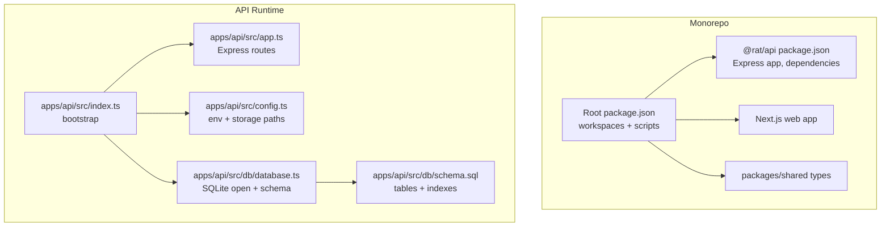
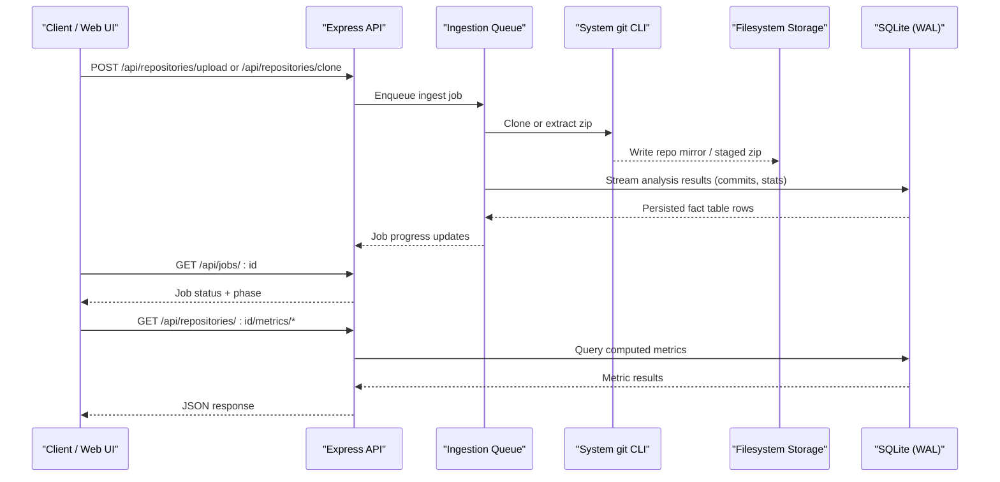
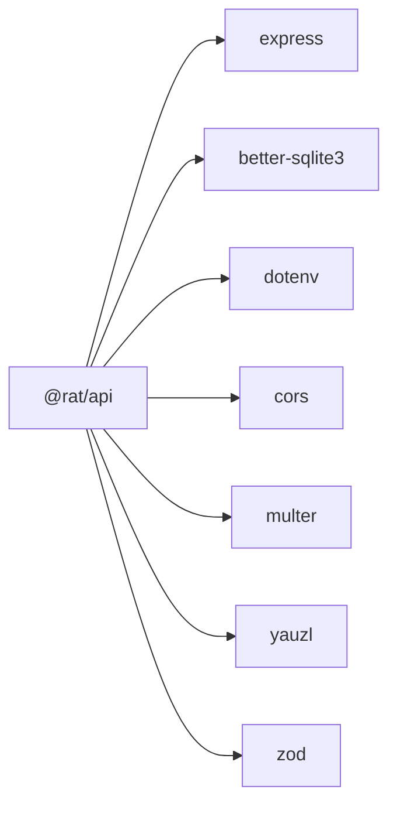

# Deployment & Operations

<cite>
**Referenced Files in This Document**
- [README.md](file://README.md)
- [package.json](file://package.json)
- [apps/api/package.json](file://apps/api/package.json)
- [apps/api/src/index.ts](file://apps/api/src/index.ts)
- [apps/api/src/app.ts](file://apps/api/src/app.ts)
- [apps/api/src/config.ts](file://apps/api/src/config.ts)
- [apps/api/src/db/database.ts](file://apps/api/src/db/database.ts)
- [apps/api/src/db/schema.sql](file://apps/api/src/db/schema.sql)
- [apps/api/src/middleware/errorHandler.ts](file://apps/api/src/middleware/errorHandler.ts)
- [apps/api/src/util/errors.ts](file://apps/api/src/util/errors.ts)
- [.gitignore](file://.gitignore)
</cite>

## Table of Contents
1. [Introduction](#introduction)
2. [Project Structure](#project-structure)
3. [Core Components](#core-components)
4. [Architecture Overview](#architecture-overview)
5. [Detailed Component Analysis](#detailed-component-analysis)
6. [Dependency Analysis](#dependency-analysis)
7. [Performance Considerations](#performance-considerations)
8. [Troubleshooting Guide](#troubleshooting-guide)
9. [Conclusion](#conclusion)
10. [Appendices](#appendices)

## Introduction
This document provides production deployment and operations guidance for RAT (Repo Analysis Tool). It covers build processes, environment configuration, storage layout, containerization patterns, process management, scaling considerations, monitoring and logging, backup and disaster recovery, operational maintenance tasks, troubleshooting, security considerations, load balancing, and high availability strategies. The content is grounded in the repository’s code and documentation.

## Project Structure
RAT is an npm-workspaces monorepo with:
- API: Express + TypeScript backend using SQLite, system git CLI, and an in-process ingestion queue.
- Web: Next.js 14 dashboard that calls the API.
- Shared types package consumed by both apps.
- Scripts for deterministic fixtures and independent metrics verification.

**Diagram sources**
- [package.json:1-31](file://package.json#L1-L31)
- [apps/api/package.json:1-40](file://apps/api/package.json#L1-L40)
- [apps/api/src/index.ts:1-43](file://apps/api/src/index.ts#L1-L43)
- [apps/api/src/app.ts:1-39](file://apps/api/src/app.ts#L1-L39)
- [apps/api/src/config.ts:1-73](file://apps/api/src/config.ts#L1-L73)
- [apps/api/src/db/database.ts:1-23](file://apps/api/src/db/database.ts#L1-L23)
- [apps/api/src/db/schema.sql:1-106](file://apps/api/src/db/schema.sql#L1-L106)

**Section sources**
- [README.md:8-13](file://README.md#L8-L13)
- [README.md:140-172](file://README.md#L140-L172)
- [package.json:1-31](file://package.json#L1-L31)

## Core Components
- API bootstrap: loads configuration, opens SQLite, initializes services, marks stale jobs failed on restart, creates Express app, listens on port, and handles graceful shutdown.
- Configuration: reads environment variables, resolves storage directories, upload size limits, clone timeouts, and ensures required directories exist.
- Database: opens SQLite with WAL mode, NORMAL synchronous, foreign keys enabled, busy timeout, and applies schema.
- HTTP layer: defines health endpoint, mounts route groups, and centralizes error handling.

Key runtime behaviors:
- Storage root defaults to `./storage` and can be overridden via environment.
- SQLite database file lives under the configured storage directory.
- Ingestion uses system git CLI; analysis commands have a configurable timeout.

**Section sources**
- [apps/api/src/index.ts:1-43](file://apps/api/src/index.ts#L1-L43)
- [apps/api/src/config.ts:1-73](file://apps/api/src/config.ts#L1-L73)
- [apps/api/src/db/database.ts:1-23](file://apps/api/src/db/database.ts#L1-L23)
- [apps/api/src/app.ts:1-39](file://apps/api/src/app.ts#L1-L39)

## Architecture Overview
The API exposes REST endpoints for repository ingestion (zip upload or URL clone), job status polling, commit metadata, author resolution, path enumeration, and multiple metric queries. The web UI consumes these endpoints.

**Diagram sources**
- [README.md:216-238](file://README.md#L216-L238)
- [apps/api/src/app.ts:16-37](file://apps/api/src/app.ts#L16-L37)
- [apps/api/src/db/database.ts:7-22](file://apps/api/src/db/database.ts#L7-L22)

## Detailed Component Analysis

### Build and Run Processes
- Development: run both API and web concurrently.
- Production-style: build once, then start API and web separately.
- The web app inlines the API base URL at build time.

Operational notes:
- Ensure Node.js version meets requirements.
- System git CLI must be available and meet minimum version.
- For production, prefer building first and running compiled output.

**Section sources**
- [README.md:17-26](file://README.md#L17-L26)
- [README.md:29-58](file://README.md#L29-L58)
- [package.json:10-20](file://package.json#L10-L20)

### Environment Variables and Configuration
Environment variables control runtime behavior:
- API_PORT: listen port for the API.
- RAT_STORAGE_DIR: absolute or relative storage root for zips, cloned repos, and SQLite DB.
- MAX_UPLOAD_MB: multipart upload size limit.
- CLONE_TIMEOUT_MS: timeout for git clone operations.
- NEXT_PUBLIC_API_URL: used by the web app at build time to locate the API.

Configuration responsibilities:
- Resolves storage directories (repos, tmp, db path).
- Validates numeric environment values and applies defaults.
- Ensures required directories exist.

Storage layout:
- `storage/repos/<repoId>` per ingested repository.
- `storage/tmp` for staging uploads.
- `storage/rat.db` for SQLite.

**Section sources**
- [README.md:242-254](file://README.md#L242-L254)
- [apps/api/src/config.ts:26-66](file://apps/api/src/config.ts#L26-L66)
- [apps/api/src/config.ts:69-72](file://apps/api/src/config.ts#L69-L72)

### Database Setup and Maintenance
Database characteristics:
- SQLite with WAL journaling and NORMAL synchronous for performance and durability.
- Foreign keys enabled; busy timeout set to avoid lock contention.
- Schema applied automatically on startup.

Maintenance recommendations:
- Keep WAL mode enabled for concurrent read-heavy workloads.
- Monitor SQLite busy errors and tune busy_timeout if needed.
- Periodically vacuum and analyze tables to maintain query performance.
- Back up the entire storage directory to capture both the database and repository mirrors.

**Section sources**
- [apps/api/src/db/database.ts:7-22](file://apps/api/src/db/database.ts#L7-L22)
- [apps/api/src/db/schema.sql:1-106](file://apps/api/src/db/schema.sql#L1-L106)

### Health Check and Error Handling
Health check:
- GET /api/health returns a simple JSON object indicating service status and timestamp.

Error handling:
- Centralized middleware maps application errors, multer errors, and generic errors to structured JSON responses with codes and messages.
- Upload size exceeded yields a specific error code and status.

Operational use:
- Use the health endpoint for liveness probes.
- Parse structured error codes for alerting and dashboards.

**Section sources**
- [apps/api/src/app.ts:22-24](file://apps/api/src/app.ts#L22-L24)
- [apps/api/src/middleware/errorHandler.ts:5-62](file://apps/api/src/middleware/errorHandler.ts#L5-L62)
- [apps/api/src/util/errors.ts:1-34](file://apps/api/src/util/errors.ts#L1-L34)

### Process Management and Graceful Shutdown
- On startup, the API marks interrupted jobs as failed to prevent indefinite processing after restarts.
- SIGINT/SIGTERM handlers close the HTTP server and database connection, with a forced exit after a short timeout to avoid hanging.

Operational guidance:
- Use a process manager that sends SIGTERM on stop and supports graceful shutdown.
- Configure health checks to detect when the server is shutting down.

**Section sources**
- [apps/api/src/index.ts:12-17](file://apps/api/src/index.ts#L12-L17)
- [apps/api/src/index.ts:25-39](file://apps/api/src/index.ts#L25-L39)

### Containerization Strategy
Recommended approach:
- Multi-stage Docker build:
  - Stage 1: install dependencies and build both API and web.
  - Stage 2: minimal runtime image with Node.js, git CLI, and built artifacts.
- Mount persistent volumes for storage (repos, tmp, SQLite DB).
- Expose only the API port; serve the web app from a reverse proxy or separate container.
- Provide environment variables via container orchestration secrets and config maps.

Security hardening:
- Run as non-root user.
- Read-only filesystem except for mounted storage volume.
- Limit CPU/memory resources.
- Restrict outbound network access unless cloning repositories is required.

[No sources needed since this section provides general guidance]

### Scaling Considerations
Current architecture:
- Single-node API with in-process FIFO queue and single worker.
- SQLite database co-located with repository storage.

Scaling options:
- Horizontal scaling of API instances behind a load balancer is possible for read-heavy traffic (metrics, commits, authors, paths).
- Ingestion should be serialized per repository; consider externalizing the queue (e.g., Redis + workers) for multi-instance ingestion.
- Move SQLite to a shared, durable volume; evaluate migration to a primary-replica setup if write throughput becomes a bottleneck.
- Cache frequently accessed metrics or precompute rollups for large histories.

[No sources needed since this section provides general guidance]

### Monitoring and Logging
Monitoring:
- Liveness probe via GET /api/health.
- Track job lifecycle (queued → running → done/failed) and phases via job endpoints.
- Alert on repeated 5xx responses, upload failures, and job failures.

Logging:
- Application logs include startup info, storage directory, and shutdown signals.
- Unhandled errors are logged centrally with structured error mapping.
- Integrate with your logging platform (stdout/stderr) and collect structured logs.

Metrics:
- Instrument request latency, error rates, and job durations.
- Track SQLite disk usage and WAL size.
- Monitor filesystem capacity for storage directory.

**Section sources**
- [apps/api/src/index.ts:20-23](file://apps/api/src/index.ts#L20-L23)
- [apps/api/src/middleware/errorHandler.ts:60-62](file://apps/api/src/middleware/errorHandler.ts#L60-L62)

### Backup and Disaster Recovery
Backup targets:
- SQLite database file under the configured storage directory.
- Repository mirrors under storage/repos.
- Temporary uploads under storage/tmp (optional, transient).

Backup strategy:
- Schedule regular backups of the entire storage directory.
- For consistency, quiesce writes briefly or use snapshot-based backups for the volume.
- Validate backups periodically by restoring to a test environment and verifying metrics against the independent oracle.

Disaster recovery:
- Restore storage directory and database from backup.
- Restart the API; it will apply schema and mark stale jobs as failed.
- Re-ingest critical repositories if necessary.

**Section sources**
- [apps/api/src/config.ts:49-66](file://apps/api/src/config.ts#L49-L66)
- [apps/api/src/index.ts:12-17](file://apps/api/src/index.ts#L12-L17)

### Operational Tasks
Database maintenance:
- Vacuum and analyze tables periodically to optimize query performance.
- Monitor WAL file growth and rotate or checkpoint as appropriate.

Log rotation:
- Rotate stdout/stderr logs using your process manager or log collector.
- Retain logs according to compliance and retention policies.

Performance tuning:
- Tune MAX_UPLOAD_MB based on expected repository sizes.
- Adjust CLONE_TIMEOUT_MS for large repositories or slow networks.
- Ensure sufficient CPU and memory for git operations and analysis streaming.

**Section sources**
- [apps/api/src/config.ts:49-66](file://apps/api/src/config.ts#L49-L66)
- [apps/api/src/db/database.ts:7-22](file://apps/api/src/db/database.ts#L7-L22)

### Troubleshooting Guide
Common issues:
- Native module build failures: follow repository guidance to rebuild or side-load prebuilt binaries.
- Port conflicts: configure API_PORT or change web app port.
- Clone failures: verify outbound HTTPS access and git version.
- Zip validation errors: ensure archives contain a full .git directory.
- Oracle cannot find git dir: pass explicit git-dir or align RAT_STORAGE_DIR.

Structured errors:
- Use error codes returned by the API to identify and resolve issues quickly.

**Section sources**
- [README.md:278-303](file://README.md#L278-L303)
- [apps/api/src/middleware/errorHandler.ts:18-62](file://apps/api/src/middleware/errorHandler.ts#L18-L62)

### Security Considerations
Input validation:
- Multipart uploads validated for type and size; oversized uploads return a specific error.
- Body parsing limited to mitigate large payload attacks.

File upload security:
- Safe extraction utilities are used for zip ingestion.
- Validate archive contents to ensure presence of .git and reject unsafe structures.

Access control:
- CORS is enabled; restrict origins in production via a reverse proxy or custom middleware.
- Implement authentication and authorization at the reverse proxy or API layer as needed.

Network security:
- Restrict outbound network access unless cloning is required.
- Use TLS termination at the reverse proxy.

**Section sources**
- [apps/api/src/app.ts:18-21](file://apps/api/src/app.ts#L18-L21)
- [apps/api/src/middleware/errorHandler.ts:29-42](file://apps/api/src/middleware/errorHandler.ts#L29-L42)

### Load Balancing and High Availability
Load balancing:
- Place multiple API instances behind a load balancer for horizontal scaling of read requests.
- Ensure sticky sessions are not required; stateless API design supports this.

High availability:
- Use managed storage volumes with replication for durability.
- Consider externalizing the ingestion queue for multi-worker ingestion across instances.
- Plan failover procedures for database and storage restoration.

[No sources needed since this section provides general guidance]

## Dependency Analysis
Runtime dependencies:
- Express for HTTP routing.
- better-sqlite3 for local persistence.
- dotenv for environment loading.
- cors for cross-origin requests.
- multer for multipart uploads.
- yauzl for safe zip extraction.
- zod for validation (used elsewhere in the API).

Build-time dependencies:
- TypeScript compiler and tsx for development.
- Jest and supertest for tests.

**Diagram sources**
- [apps/api/package.json:14-23](file://apps/api/package.json#L14-L23)

**Section sources**
- [apps/api/package.json:14-23](file://apps/api/package.json#L14-L23)

## Performance Considerations
- SQLite WAL mode improves concurrency for read-heavy workloads.
- Batch inserts during analysis reduce transaction overhead.
- Streaming git log parsing avoids loading entire histories into memory.
- Tune upload size and clone timeouts to match workload characteristics.
- Monitor disk I/O and WAL growth; schedule periodic maintenance.

[No sources needed since this section provides general guidance]

## Troubleshooting Guide
See the dedicated section above for common issues and structured error handling. Additionally:
- Verify environment variables are correctly set in the runtime environment.
- Confirm storage directory permissions and disk space.
- Inspect job status and error fields for ingestion failures.
- Use the independent metrics oracle to validate correctness against raw git data.

**Section sources**
- [README.md:278-303](file://README.md#L278-L303)
- [apps/api/src/middleware/errorHandler.ts:18-62](file://apps/api/src/middleware/errorHandler.ts#L18-L62)

## Conclusion
RAT provides a self-hosted, SQLite-backed API for repository ingestion and metrics computation, paired with a Next.js dashboard. Production deployments should focus on robust storage provisioning, environment configuration, process management with graceful shutdown, and comprehensive monitoring. For scale-out, externalize the ingestion queue and consider moving beyond SQLite as write throughput grows. Follow the backup and disaster recovery procedures to protect both the database and repository storage.

[No sources needed since this section summarizes without analyzing specific files]

## Appendices

### API Endpoints Reference
- GET /api/health: Liveness probe.
- POST /api/repositories/upload: Multipart zip upload.
- POST /api/repositories/clone: Mirror clone by URL.
- GET /api/repositories, GET /api/repositories/:id: List and fetch repositories.
- DELETE /api/repositories/:id: Delete repository and associated storage.
- GET /api/jobs/:id: Poll ingestion job status.
- GET /api/repositories/:id/commits: Commit listing with filters.
- GET /api/repositories/:id/commits/:sha/stats: Per-commit file stats.
- GET /api/repositories/:id/authors: Resolved authors and raw idents.
- GET /api/repositories/:id/paths: All files and directories.
- GET /api/repositories/:id/metrics/repository: Repository-level metrics.
- GET /api/repositories/:id/metrics/files: Per-file metrics.
- GET /api/repositories/:id/metrics/directories: Subtree metrics.
- GET /api/repositories/:id/metrics/authors: Author metrics with ownership.
- GET /api/repositories/:id/metrics/timeseries: Time series by day or week.

Errors are structured with codes such as NOT_FOUND, VALIDATION, UPLOAD_TOO_LARGE, REPO_NOT_FOUND, REPO_NOT_READY, DELETE_ACTIVE_JOB.

**Section sources**
- [README.md:216-238](file://README.md#L216-L238)

### Filesystem Layout
- storage/repos/<repoId>: Cloned repository mirrors.
- storage/tmp: Staging area for uploaded zips.
- storage/rat.db: SQLite database file.

Ensure these paths are backed up and protected.

**Section sources**
- [apps/api/src/config.ts:49-66](file://apps/api/src/config.ts#L49-L66)

### Ignored Artifacts
- node_modules, dist, .next, *.tsbuildinfo, .env, .env.local, coverage, test temp directories, OS noise.

**Section sources**
- [.gitignore:1-22](file://.gitignore#L1-L22)