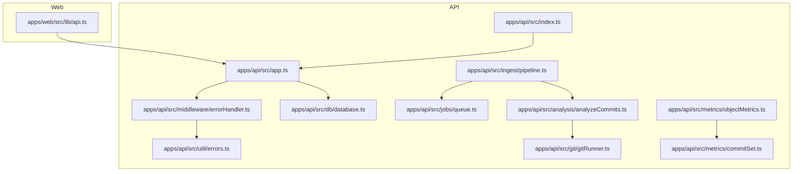
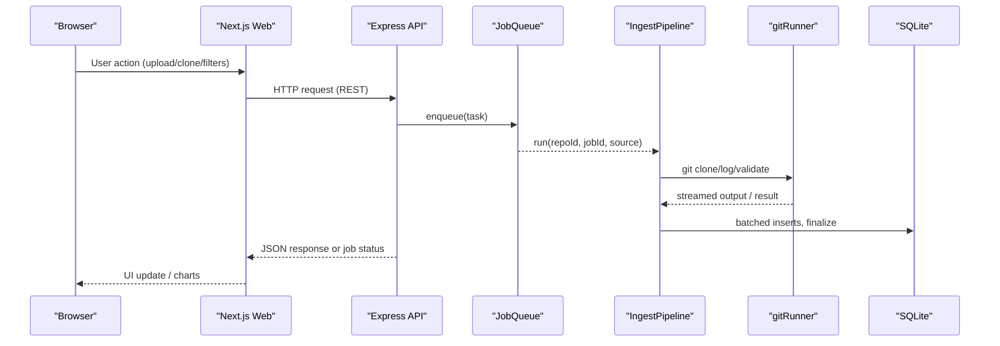
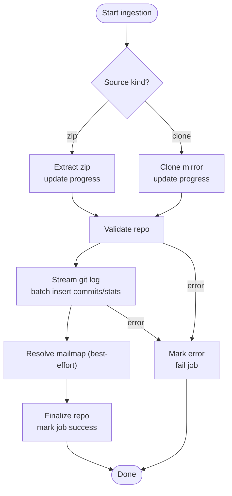
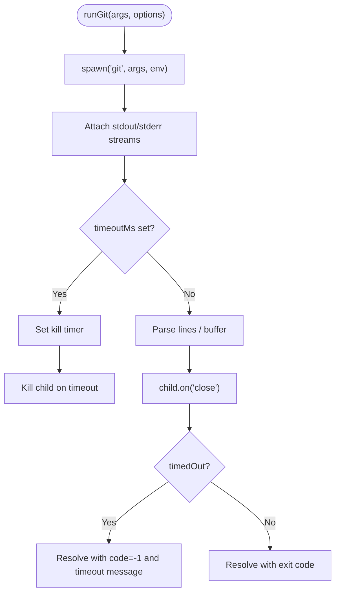
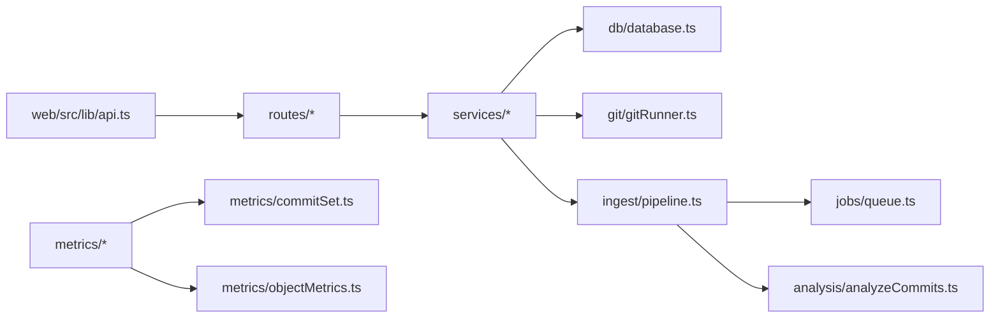

# Debugging & Performance Profiling

<cite>
**Referenced Files in This Document**
- [README.md](file://README.md)
- [apps/api/src/index.ts](file://apps/api/src/index.ts)
- [apps/api/src/app.ts](file://apps/api/src/app.ts)
- [apps/api/src/middleware/errorHandler.ts](file://apps/api/src/middleware/errorHandler.ts)
- [apps/api/src/util/errors.ts](file://apps/api/src/util/errors.ts)
- [apps/api/src/middleware/validate.ts](file://apps/api/src/middleware/validate.ts)
- [apps/api/src/db/database.ts](file://apps/api/src/db/database.ts)
- [apps/api/src/git/gitRunner.ts](file://apps/api/src/git/gitRunner.ts)
- [apps/api/src/ingest/pipeline.ts](file://apps/api/src/ingest/pipeline.ts)
- [apps/api/src/jobs/queue.ts](file://apps/api/src/jobs/queue.ts)
- [apps/api/src/analysis/analyzeCommits.ts](file://apps/api/src/analysis/analyzeCommits.ts)
- [apps/api/src/metrics/objectMetrics.ts](file://apps/api/src/metrics/objectMetrics.ts)
- [apps/api/src/metrics/commitSet.ts](file://apps/api/src/metrics/commitSet.ts)
- [apps/web/src/lib/api.ts](file://apps/web/src/lib/api.ts)
</cite>

## Table of Contents
1. [Introduction](#introduction)
2. [Project Structure](#project-structure)
3. [Core Components](#core-components)
4. [Architecture Overview](#architecture-overview)
5. [Detailed Component Analysis](#detailed-component-analysis)
6. [Dependency Analysis](#dependency-analysis)
7. [Performance Considerations](#performance-considerations)
8. [Troubleshooting Guide](#troubleshooting-guide)
9. [Conclusion](#conclusion)

## Introduction
This document provides a practical debugging and performance profiling guide for RAT development. It covers:
- Debugging the Express API server and Next.js frontend with VS Code launch configurations and Chrome DevTools.
- Error handling patterns, logging strategies, and tracing through the ingestion pipeline and metrics computation.
- Performance profiling techniques for Git processing, database queries, and metric calculations.
- Guidance on memory leak detection, slow query optimization, and resource monitoring during large repository analysis.
- Common pitfalls, connection troubleshooting, and tools for analyzing Git command performance.

## Project Structure
RAT is an npm-workspaces monorepo with:
- `apps/api`: Express + TypeScript backend (SQLite, system git CLI, async ingestion queue, metrics engine).
- `apps/web`: Next.js 14 dashboard.
- `packages/shared`: Shared DTO types.

**Diagram sources**
- [apps/api/src/index.ts:1-43](file://apps/api/src/index.ts#L1-L43)
- [apps/api/src/app.ts:1-41](file://apps/api/src/app.ts#L1-L41)
- [apps/api/src/middleware/errorHandler.ts:1-63](file://apps/api/src/middleware/errorHandler.ts#L1-L63)
- [apps/api/src/util/errors.ts:1-34](file://apps/api/src/util/errors.ts#L1-L34)
- [apps/api/src/db/database.ts:1-23](file://apps/api/src/db/database.ts#L1-L23)
- [apps/api/src/git/gitRunner.ts:1-149](file://apps/api/src/git/gitRunner.ts#L1-L149)
- [apps/api/src/ingest/pipeline.ts:1-146](file://apps/api/src/ingest/pipeline.ts#L1-L146)
- [apps/api/src/jobs/queue.ts:1-55](file://apps/api/src/jobs/queue.ts#L1-L55)
- [apps/api/src/analysis/analyzeCommits.ts:1-153](file://apps/api/src/analysis/analyzeCommits.ts#L1-L153)
- [apps/api/src/metrics/objectMetrics.ts:1-218](file://apps/api/src/metrics/objectMetrics.ts#L1-L218)
- [apps/api/src/metrics/commitSet.ts:1-146](file://apps/api/src/metrics/commitSet.ts#L1-L146)
- [apps/web/src/lib/api.ts:1-269](file://apps/web/src/lib/api.ts#L1-L269)

**Section sources**
- [README.md:8-13](file://README.md#L8-L13)
- [README.md:140-172](file://README.md#L140-L172)

## Core Components
- API bootstrap and HTTP layer:
  - Bootstrap wires config, storage, database, services, and starts the HTTP server.
  - Express app mounts routers and global error handlers.
- Ingestion pipeline:
  - FIFO job queue (concurrency 1) drives phases: extracting/cloning → validating → analyzing → finalizing.
  - Progress updates are persisted per phase.
- Git runner:
  - Spawns `git` with deterministic environment, streaming stdout/stderr, timeouts, and safe directory flags.
- Database:
  - SQLite with WAL mode, NORMAL synchronous, foreign keys enabled, busy timeout.
- Metrics engine:
  - Commit-set filters and path scoping; SQL fragments compose WHERE clauses safely.
  - Object metrics aggregate added/removed/modifications and timeseries by day/week.
- Web client:
  - Typed API client over REST; structured error mapping; progress upload via XHR.

**Section sources**
- [apps/api/src/index.ts:6-40](file://apps/api/src/index.ts#L6-L40)
- [apps/api/src/app.ts:17-39](file://apps/api/src/app.ts#L17-L39)
- [apps/api/src/ingest/pipeline.ts:29-131](file://apps/api/src/ingest/pipeline.ts#L29-L131)
- [apps/api/src/jobs/queue.ts:1-55](file://apps/api/src/jobs/queue.ts#L1-L55)
- [apps/api/src/git/gitRunner.ts:26-48](file://apps/api/src/git/gitRunner.ts#L26-L48)
- [apps/api/src/db/database.ts:7-22](file://apps/api/src/db/database.ts#L7-L22)
- [apps/api/src/metrics/commitSet.ts:5-53](file://apps/api/src/metrics/commitSet.ts#L5-L53)
- [apps/api/src/metrics/objectMetrics.ts:11-36](file://apps/api/src/metrics/objectMetrics.ts#L11-L36)
- [apps/web/src/lib/api.ts:17-41](file://apps/web/src/lib/api.ts#L17-L41)

## Architecture Overview
The request flow from the web UI to data persistence and back:

**Diagram sources**
- [apps/web/src/lib/api.ts:122-268](file://apps/web/src/lib/api.ts#L122-L268)
- [apps/api/src/app.ts:23-35](file://apps/api/src/app.ts#L23-L35)
- [apps/api/src/jobs/queue.ts:15-53](file://apps/api/src/jobs/queue.ts#L15-L53)
- [apps/api/src/ingest/pipeline.ts:44-131](file://apps/api/src/ingest/pipeline.ts#L44-L131)
- [apps/api/src/git/gitRunner.ts:55-147](file://apps/api/src/git/gitRunner.ts#L55-L147)
- [apps/api/src/db/database.ts:12-22](file://apps/api/src/db/database.ts#L12-L22)

## Detailed Component Analysis

### API Server Debugging (Express)
- Entry point and lifecycle:
  - Loads configuration, opens database, creates services, marks stale jobs failed, starts HTTP server, and handles graceful shutdown.
- Routing and middleware:
  - Health endpoint, CORS, JSON body limit, router mounts, not-found handler, central error handler.
- Error handling:
  - Centralized error middleware maps AppError, multer errors, and body-parser style errors to structured `{ code, message }`.
  - Application error helpers provide typed error constructors.

Debugging tips:
- Use Node inspector (`node --inspect`) and attach VS Code debugger to the API process.
- Inspect structured error responses in the browser Network tab and console.
- Add temporary console logs around route entry points and error middleware to trace failure paths.

**Section sources**
- [apps/api/src/index.ts:6-40](file://apps/api/src/index.ts#L6-L40)
- [apps/api/src/app.ts:17-39](file://apps/api/src/app.ts#L17-L39)
- [apps/api/src/middleware/errorHandler.ts:5-62](file://apps/api/src/middleware/errorHandler.ts#L5-L62)
- [apps/api/src/util/errors.ts:5-33](file://apps/api/src/util/errors.ts#L5-L33)

### Frontend Debugging (Next.js)
- API client:
  - Base URL from environment, structured `ApiError`, fetch wrapper, query string builder, commit filter helpers, and typed endpoints.
  - Upload uses XHR for progress events.

Debugging tips:
- Verify `NEXT_PUBLIC_API_URL` at build time and runtime.
- Use Chrome DevTools Network panel to inspect requests/responses and errors.
- Breakpoints in `api.ts` functions to validate parameter encoding and error mapping.

**Section sources**
- [apps/web/src/lib/api.ts:17-82](file://apps/web/src/lib/api.ts#L17-L82)
- [apps/web/src/lib/api.ts:147-189](file://apps/web/src/lib/api.ts#L147-L189)
- [apps/web/src/lib/api.ts:220-268](file://apps/web/src/lib/api.ts#L220-L268)

### Ingestion Pipeline Tracing
- Phases and progress:
  - Source extraction/cloning, validation, analysis, mailmap resolution, finalization.
  - Progress fractions mapped to phase boundaries and persisted via job store.
- Job queue:
  - Single-concurrency FIFO queue ensures predictable I/O and DB writes.

Debugging tips:
- Monitor job phases and progress in the UI and API job polling.
- If stuck, check whether the queue is idle and whether the task is running.
- For failures, inspect the job’s error field and server logs.

**Diagram sources**
- [apps/api/src/ingest/pipeline.ts:44-131](file://apps/api/src/ingest/pipeline.ts#L44-L131)
- [apps/api/src/jobs/queue.ts:15-53](file://apps/api/src/jobs/queue.ts#L15-L53)

**Section sources**
- [apps/api/src/ingest/pipeline.ts:29-131](file://apps/api/src/ingest/pipeline.ts#L29-L131)
- [apps/api/src/jobs/queue.ts:1-55](file://apps/api/src/jobs/queue.ts#L1-L55)

### Git Processing Debugging
- Runner behavior:
  - Non-interactive environment variables, safe.directory per command, streaming stdout/stderr, tail limits, timeouts, and exit code handling.
- Analysis:
  - Streams `git log` with numstat and rename detection, batches inserts, collects directories, excludes merges, and tracks progress.

Debugging tips:
- Enable verbose logging around `runGit` calls to capture stderr tails.
- Use `GIT_TRACE=1` or `GIT_CURL_VERBOSE=1` when diagnosing network issues.
- Profile long-running commands with Node timers or external profilers.

**Diagram sources**
- [apps/api/src/git/gitRunner.ts:55-147](file://apps/api/src/git/gitRunner.ts#L55-L147)

**Section sources**
- [apps/api/src/git/gitRunner.ts:26-48](file://apps/api/src/git/gitRunner.ts#L26-L48)
- [apps/api/src/git/gitRunner.ts:55-147](file://apps/api/src/git/gitRunner.ts#L55-L147)
- [apps/api/src/analysis/analyzeCommits.ts:25-37](file://apps/api/src/analysis/analyzeCommits.ts#L25-L37)
- [apps/api/src/analysis/analyzeCommits.ts:125-151](file://apps/api/src/analysis/analyzeCommits.ts#L125-L151)

### Database and Query Debugging
- Database setup:
  - WAL mode, NORMAL synchronous, foreign keys, busy timeout.
- Metrics queries:
  - Commit-source joins include raw idents and author resolution layers.
  - Path scope SQL uses index-friendly subtree ranges.
  - Timeseries buckets by day or week using strftime.

Debugging tips:
- Enable SQLite query logging externally or wrap prepared statements temporarily to log parameters.
- Use EXPLAIN QUERY PLAN for slow metric queries.
- Validate indexes on frequently filtered columns (e.g., repo_id, path, ts).

**Section sources**
- [apps/api/src/db/database.ts:7-22](file://apps/api/src/db/database.ts#L7-L22)
- [apps/api/src/metrics/objectMetrics.ts:38-45](file://apps/api/src/metrics/objectMetrics.ts#L38-L45)
- [apps/api/src/metrics/objectMetrics.ts:24-36](file://apps/api/src/metrics/objectMetrics.ts#L24-L36)
- [apps/api/src/metrics/objectMetrics.ts:152-217](file://apps/api/src/metrics/objectMetrics.ts#L152-L217)
- [apps/api/src/metrics/commitSet.ts:31-53](file://apps/api/src/metrics/commitSet.ts#L31-L53)

### Validation and Input Handling
- Query parameter parsing:
  - Optional string/int/enum helpers, paging constraints, and Zod-based body parsing.
- Errors:
  - Validation errors become structured 400s.

Debugging tips:
- Log parsed parameters before use to catch malformed inputs early.
- Use test cases to verify boundary conditions for page/pageSize and enum values.

**Section sources**
- [apps/api/src/middleware/validate.ts:1-70](file://apps/api/src/middleware/validate.ts#L1-L70)

## Dependency Analysis
Key dependencies and relationships:
- API routes depend on services that encapsulate DB, Git, and ingestion logic.
- Ingestion pipeline depends on Git runner, analysis, and job store/queue.
- Metrics engine composes SQL fragments from commit set filters and path scope.

**Diagram sources**
- [apps/api/src/app.ts:17-39](file://apps/api/src/app.ts#L17-L39)
- [apps/api/src/ingest/pipeline.ts:1-25](file://apps/api/src/ingest/pipeline.ts#L1-L25)
- [apps/api/src/analysis/analyzeCommits.ts:1-14](file://apps/api/src/analysis/analyzeCommits.ts#L1-L14)
- [apps/api/src/metrics/objectMetrics.ts:1-9](file://apps/api/src/metrics/objectMetrics.ts#L1-L9)
- [apps/api/src/metrics/commitSet.ts:1-21](file://apps/api/src/metrics/commitSet.ts#L1-L21)
- [apps/web/src/lib/api.ts:1-15](file://apps/web/src/lib/api.ts#L1-L15)

**Section sources**
- [apps/api/src/app.ts:17-39](file://apps/api/src/app.ts#L17-L39)
- [apps/api/src/ingest/pipeline.ts:1-25](file://apps/api/src/ingest/pipeline.ts#L1-L25)
- [apps/api/src/analysis/analyzeCommits.ts:1-14](file://apps/api/src/analysis/analyzeCommits.ts#L1-L14)
- [apps/api/src/metrics/objectMetrics.ts:1-9](file://apps/api/src/metrics/objectMetrics.ts#L1-L9)
- [apps/api/src/metrics/commitSet.ts:1-21](file://apps/api/src/metrics/commitSet.ts#L1-L21)
- [apps/web/src/lib/api.ts:1-15](file://apps/web/src/lib/api.ts#L1-L15)

## Performance Considerations

### Git Command Performance
- Use streaming to avoid buffering large outputs; the runner already limits retained tails.
- Profile long-running clones/logs with Node timers or external tools like `time` and `strace`/`dtrace`.
- Ensure `git` is on PATH and meets version requirements.

Optimization tips:
- Tune `CLONE_TIMEOUT_MS` for large repositories.
- Avoid unnecessary retries; surface actionable errors from stderr tails.

**Section sources**
- [apps/api/src/git/gitRunner.ts:23-24](file://apps/api/src/git/gitRunner.ts#L23-L24)
- [apps/api/src/git/gitRunner.ts:73-79](file://apps/api/src/git/gitRunner.ts#L73-L79)
- [README.md:23-25](file://README.md#L23-L25)

### Database Query Optimization
- Prefer indexed lookups on `repo_id`, `path`, and timestamp fields.
- Batch inserts are already used during analysis; keep batch sizes reasonable.
- Use SQLite PRAGMAs appropriately; WAL and NORMAL synchronous are configured.

Optimization tips:
- Review EXPLAIN plans for heavy metrics queries.
- Limit path scopes and commit sets to reduce scan size.

**Section sources**
- [apps/api/src/db/database.ts:7-22](file://apps/api/src/db/database.ts#L7-L22)
- [apps/api/src/analysis/analyzeCommits.ts:22-24](file://apps/api/src/analysis/analyzeCommits.ts#L22-L24)
- [apps/api/src/metrics/objectMetrics.ts:24-36](file://apps/api/src/metrics/objectMetrics.ts#L24-L36)

### Metric Calculation Efficiency
- Commit-set filters are composed into efficient SQL fragments.
- Path scoping uses index-friendly substring ranges for directories.
- Timeseries queries separate commit counts and stat sums, then merge in-memory.

Optimization tips:
- Reuse computed filters across multiple endpoints.
- Cache expensive results if needed (outside current scope).

**Section sources**
- [apps/api/src/metrics/commitSet.ts:104-126](file://apps/api/src/metrics/commitSet.ts#L104-L126)
- [apps/api/src/metrics/objectMetrics.ts:152-217](file://apps/api/src/metrics/objectMetrics.ts#L152-L217)

### Memory Leak Detection
- Watch for unbounded buffers:
  - The runner retains small tails for stdout/stderr when streaming.
  - Analysis buffers commits until BATCH_SIZE flushes.
- Use Node heap snapshots and heap profiler to detect growth during ingestion.

Mitigation tips:
- Ensure parsers call `end()` and flush buffers.
- Monitor job durations and memory usage; alert on anomalies.

**Section sources**
- [apps/api/src/git/gitRunner.ts:103-119](file://apps/api/src/git/gitRunner.ts#L103-L119)
- [apps/api/src/analysis/analyzeCommits.ts:75-94](file://apps/api/src/analysis/analyzeCommits.ts#L75-L94)

### Monitoring Resource Usage
- Track CPU, memory, and disk I/O during large repository analysis.
- Observe job queue size and phase transitions.
- Use OS-level tools (top, htop, iostat) and Node profilers.

[No sources needed since this section provides general guidance]

## Troubleshooting Guide

### Connection and Environment Issues
- Port conflicts: adjust `API_PORT` or web port.
- Clone failures: ensure outbound HTTPS access and correct `git` version.
- Zip rejected: must contain `.git`; submodules/worktrees may be invalid.
- Oracle cannot find git dir: pass `--git-dir` or align `RAT_STORAGE_DIR`.

**Section sources**
- [README.md:278-303](file://README.md#L278-L303)

### API Error Patterns
- Structured errors: `{ code, message }`.
- Validation errors map to 400; upload size exceeded maps to 413; unknown routes map to 404; unhandled exceptions map to 500.

Debugging steps:
- Inspect error codes and messages in the UI banner and Network tab.
- Check server logs for unhandled errors.

**Section sources**
- [apps/api/src/middleware/errorHandler.ts:5-62](file://apps/api/src/middleware/errorHandler.ts#L5-L62)
- [apps/api/src/util/errors.ts:5-33](file://apps/api/src/util/errors.ts#L5-L33)

### Ingestion Pipeline Failures
- Stalled jobs: check queue size and phase transitions.
- Failed analysis: inspect git exit code and stderr tail.
- Mailmap resolution skipped: best-effort; raw idents still work.

**Section sources**
- [apps/api/src/ingest/pipeline.ts:105-110](file://apps/api/src/ingest/pipeline.ts#L105-L110)
- [apps/api/src/analysis/analyzeCommits.ts:143-149](file://apps/api/src/analysis/analyzeCommits.ts#L143-L149)

### Web Client Errors
- NETWORK errors indicate unreachable API base URL.
- Upload progress relies on XHR; verify CORS and payload size limits.

**Section sources**
- [apps/web/src/lib/api.ts:35-41](file://apps/web/src/lib/api.ts#L35-L41)
- [apps/web/src/lib/api.ts:147-189](file://apps/web/src/lib/api.ts#L147-L189)

## Conclusion
This guide outlines how to debug and profile RAT effectively:
- Use structured errors and logs to trace issues across the API, ingestion pipeline, Git execution, and database.
- Profile Git commands, tune database queries, and monitor memory during large analyses.
- Apply the provided troubleshooting steps to resolve common pitfalls and optimize performance.

[No sources needed since this section summarizes without analyzing specific files]