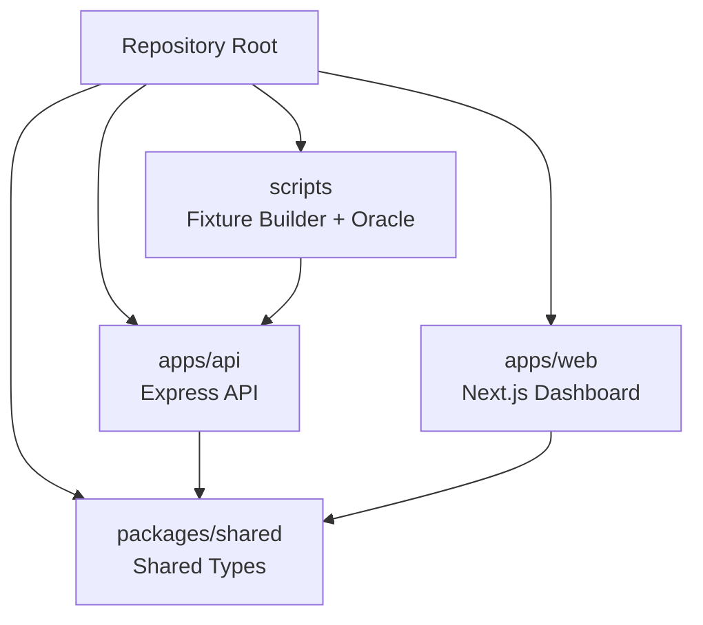
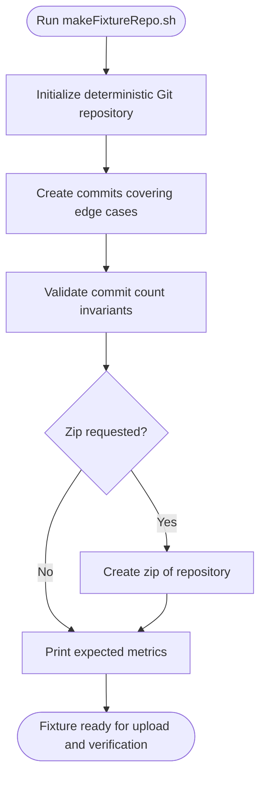
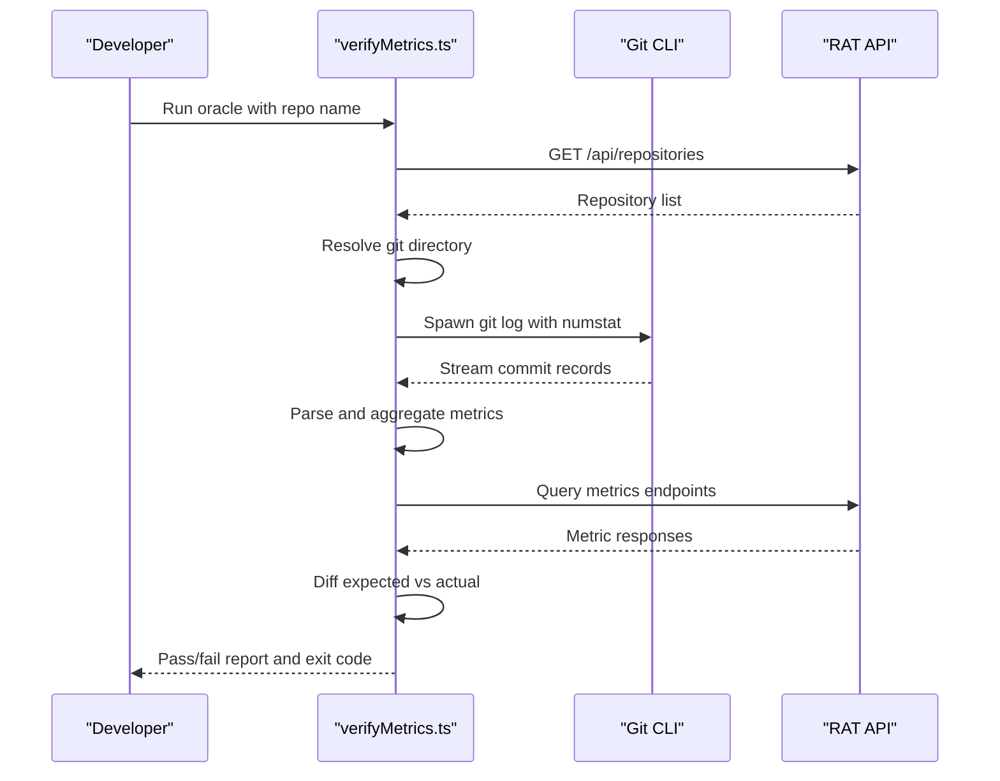
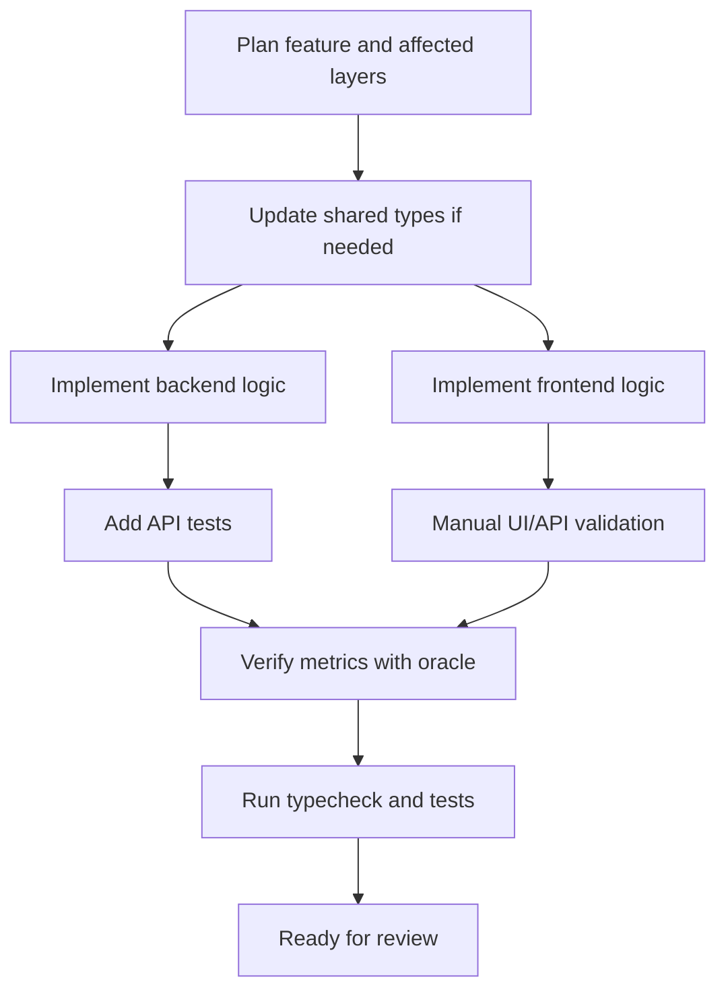
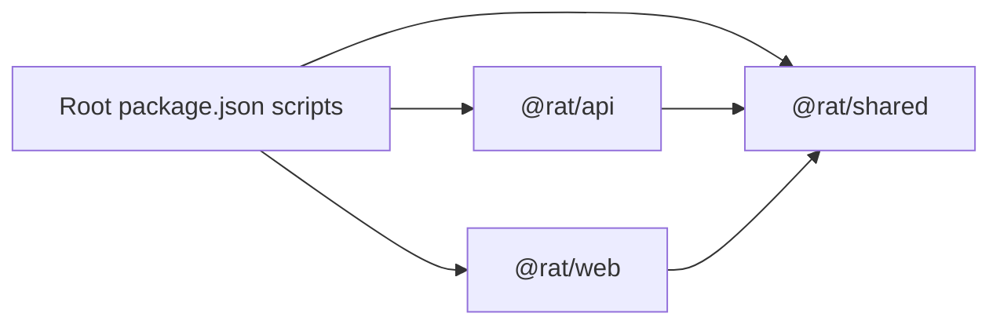

# Development Guide

<cite>
**Referenced Files in This Document**
- [README.md](file://README.md)
- [package.json](file://package.json)
- [apps/api/package.json](file://apps/api/package.json)
- [apps/web/package.json](file://apps/web/package.json)
- [packages/shared/package.json](file://packages/shared/package.json)
- [tsconfig.base.json](file://tsconfig.base.json)
- [apps/api/tsconfig.json](file://apps/api/tsconfig.json)
- [apps/web/tsconfig.json](file://apps/web/tsconfig.json)
- [packages/shared/tsconfig.json](file://packages/shared/tsconfig.json)
- [apps/api/jest.config.js](file://apps/api/jest.config.js)
- [scripts/makeFixtureRepo.sh](file://scripts/makeFixtureRepo.sh)
- [scripts/verifyMetrics.ts](file://scripts/verifyMetrics.ts)
</cite>

## Table of Contents
1. [Introduction](#introduction)
2. [Project Structure](#project-structure)
3. [Local Development Environment Setup](#local-development-environment-setup)
4. [Hot Reload and Debugging](#hot-reload-and-debugging)
5. [Build and Typecheck Processes](#build-and-typecheck-processes)
6. [Testing Strategy](#testing-strategy)
7. [Deterministic Fixture Repository Generation](#deterministic-fixture-repository-generation)
8. [Independent Metrics Oracle for Verification](#independent-metrics-oracle-for-verification)
9. [TypeScript Configuration and Code Style Guidelines](#typescript-configuration-and-code-style-guidelines)
10. [Development Workflow for New Features](#development-workflow-for-new-features)
11. [Monorepo Workspace Structure and Inter-Package Dependencies](#monorepo-workspace-structure-and-inter-package-dependencies)
12. [Common Development Issues and Troubleshooting](#common-development-issues-and-troubleshooting)
13. [Performance Profiling Techniques](#performance-profiling-techniques)
14. [Conclusion](#conclusion)

## Introduction
RAT is a self-hosted repository analysis tool that ingests Git repositories through zip upload or URL cloning, computes commit-level metrics such as line changes, modification counts, churn rate, and author ownership, and exposes those results through an Express API and a Next.js dashboard. The project is organized as an npm workspaces monorepo with three main packages: the API backend, the web frontend, and shared TypeScript types. It also includes deterministic fixture generation and an independent metrics oracle to verify correctness against raw Git data.

This development guide explains how to set up the local environment, run and debug both servers, configure hot reload, write and run tests, generate fixtures, verify metrics, follow code style and TypeScript configuration rules, add new features safely, understand workspace dependencies, troubleshoot common issues, and perform basic performance profiling.

**Section sources**
- [README.md:1-14](file://README.md#L1-L14)
- [README.md:17-25](file://README.md#L17-L25)
- [README.md:176-239](file://README.md#L176-L239)

## Project Structure
The repository uses a feature-oriented layout under `apps/` and `packages/`, plus scripts at the root:

- `apps/api`: Express + TypeScript backend with SQLite persistence, Git CLI ingestion, async job queue, metrics engine, routes, middleware, and Jest test suites.
- `apps/web`: Next.js 14 App Router dashboard with typed API client, filters, tables, charts, and design-token styling.
- `packages/shared`: Shared DTO and type definitions consumed by both apps.
- `scripts`: Deterministic fixture builder and independent metrics oracle.

**Diagram sources**
- [README.md:140-172](file://README.md#L140-L172)
- [package.json:6-9](file://package.json#L6-L9)

**Section sources**
- [README.md:140-172](file://README.md#L140-L172)
- [package.json:6-9](file://package.json#L6-L9)

## Local Development Environment Setup
Before starting development, ensure your environment meets the requirements: Node.js version 18.18 or newer, npm version 9 or newer, Git CLI version 2.30 or newer on PATH, and optional build tools if native modules need compilation. Network access is only required when using clone-mode ingestion.

To install dependencies and start both servers:

1. Install dependencies from the repository root.
2. Start the API and web app together, or start them separately.
3. Open the web dashboard at the configured port.

For production-style runs, build once and then start each server independently. The web app uses a build-time environment variable for the API base URL, which can be overridden via the web app’s local environment file.

Environment variables include API port, storage directory, web API URL, upload size limit, and clone timeout. These are all optional and documented in the project README.

**Section sources**
- [README.md:17-25](file://README.md#L17-L25)
- [README.md:29-58](file://README.md#L29-L58)
- [README.md:242-254](file://README.md#L242-L254)

## Hot Reload and Debugging
The API uses `tsx watch` for development, so source changes trigger automatic restarts without manual rebuilds. The web app uses Next.js development mode, which provides its own hot module replacement and fast refresh.

Recommended workflow:

- Run both servers concurrently with the root development script.
- If you are debugging only the API, use the API-specific development script.
- If you are debugging only the web app, use the web-specific development script.

For debugging:

- Use your IDE’s Node.js debugger attached to the API process started with `tsx`.
- Use browser developer tools for the Next.js dashboard.
- Inspect structured error responses from the API; errors include codes such as missing repository, not ready, validation failure, invalid upload, or active-job conflict.
- For ingestion problems, check the job status and error field returned by the jobs endpoint.

**Section sources**
- [apps/api/package.json:7-12](file://apps/api/package.json#L7-L12)
- [apps/web/package.json:6-11](file://apps/web/package.json#L6-L11)
- [README.md:236-239](file://README.md#L236-L239)

## Build and Typecheck Processes
The root package defines workspace-aware scripts for building, starting, testing, and typechecking both applications.

Key commands:

- `npm run build`: builds the API and the web app.
- `npm run start:api`: starts the compiled or tsx-based API server.
- `npm run start:web`: starts the built Next.js web app.
- `npm run typecheck`: runs TypeScript checks for both workspaces.

API-specific scripts:

- `dev`: watches and runs the API entry point.
- `build`: compiles TypeScript.
- `start`: runs the API entry point.
- `test`: runs Jest.
- `typecheck`: runs TypeScript without emitting output.

Web-specific scripts:

- `dev`: starts Next.js development server.
- `build`: builds the Next.js application.
- `start`: starts the production Next.js server.
- `typecheck`: runs TypeScript without emitting output.

**Section sources**
- [package.json:10-20](file://package.json#L10-L20)
- [apps/api/package.json:7-12](file://apps/api/package.json#L7-L12)
- [apps/web/package.json:6-11](file://apps/web/package.json#L6-L11)

## Testing Strategy
The RAT API uses Jest with ts-jest and Supertest for integration-style HTTP tests. The test suite covers log parser edge cases, metric-engine math against hand-computed values, route success paths, validation failures, unknown-id failures, and ingestion lifecycle behavior with mocked pipeline services.

Test execution:

- Run the full API test suite from the repository root using the workspace test script.
- The Jest configuration targets the API test directory, matches `.test.ts` files, maps the shared package path, configures ts-jest with strict settings, sets a test timeout, clears mocks between tests, and uses a Node test environment.

Supertest usage:

- Tests send HTTP requests against the running Express application instance.
- Tests should assert response status codes, structured error bodies, and metric values.

Mock strategy:

- External Git operations and pipeline stages are mocked where appropriate so tests remain deterministic and fast.
- Database state is managed per test, typically using temporary SQLite storage and seed helpers.

Best practices for adding tests:

- Place route tests under `apps/api/test/routes`.
- Place unit tests for parsers and engines under `apps/api/test`.
- Keep fixtures small and deterministic.
- Prefer assertions over exact string snapshots for numeric metrics.
- Use helper utilities for database setup and teardown rather than duplicating logic in each test.

**Section sources**
- [README.md:101-110](file://README.md#L101-L110)
- [apps/api/jest.config.js:1-29](file://apps/api/jest.config.js#L1-L29)
- [apps/api/package.json:24-38](file://apps/api/package.json#L24-L38)

## Deterministic Fixture Repository Generation
The fixture generator creates a small Git repository designed to exercise every metric edge case supported by RAT. It exercises multiple authors and email variants normalized through `.mailmap`, rename-only commits, rename-with-edits, deletions, binary files, nested directories, empty commits, and merge commits that must be excluded from metrics.

Usage:

- Generate the fixture repository under a destination directory.
- Optionally produce a zip archive containing the full Git repository for upload through the API.
- The script prints expected metric values so developers can compare them directly against the API output.

Important behaviors:

- The script enforces deterministic Git timestamps and disables global/system Git configuration.
- It validates invariants such as the expected number of non-merge commits.
- When a zip path is provided, it zips the entire repository including the `.git` directory.

Verification flow:

1. Generate the fixture repository and optionally the zip.
2. Upload the zip through the API or use the web UI.
3. Compare the API’s computed metrics with the expected values printed by the script.

**Diagram sources**
- [scripts/makeFixtureRepo.sh:1-24](file://scripts/makeFixtureRepo.sh#L1-L24)
- [scripts/makeFixtureRepo.sh:44-79](file://scripts/makeFixtureRepo.sh#L44-L79)
- [scripts/makeFixtureRepo.sh:209-244](file://scripts/makeFixtureRepo.sh#L209-L244)

**Section sources**
- [README.md:73-97](file://README.md#L73-L97)
- [scripts/makeFixtureRepo.sh:1-24](file://scripts/makeFixtureRepo.sh#L1-L24)
- [scripts/makeFixtureRepo.sh:44-79](file://scripts/makeFixtureRepo.sh#L44-L79)
- [scripts/makeFixtureRepo.sh:209-244](file://scripts/makeFixtureRepo.sh#L209-L244)

## Independent Metrics Oracle for Verification
The metrics oracle is a standalone TypeScript script that re-derives metrics directly from Git instead of reusing the API’s parsing logic. It spawns `git log` with merge exclusion, rename detection, date ordering, and numstat output, parses the stream with its own parser, aggregates metrics, and diffs the result against the running API.

What it verifies:

- Repository totals.
- Commit-set filters: time range, explicit commit IDs, and author filtering.
- Per-file metrics.
- Directory subtree metrics.
- Resolved author metrics, including ownership share.
- Commits listing.
- Day-based timeseries.

Execution:

- Start the API and ingest a repository.
- Run the oracle with the repository name or ID.
- Optionally override the API URL and Git directory.
- Exit code 0 means all checks passed; mismatches print expected versus actual values.

Oracle internals:

- It locates the stored Git repository under the configured storage directory, checking mirror layouts and nested repository structures.
- It compares aggregated metrics with tolerance for floating-point differences.
- It reports pass/fail per check and summarizes total checks.

**Diagram sources**
- [scripts/verifyMetrics.ts:1-25](file://scripts/verifyMetrics.ts#L1-L25)
- [scripts/verifyMetrics.ts:43-68](file://scripts/verifyMetrics.ts#L43-L68)
- [scripts/verifyMetrics.ts:276-359](file://scripts/verifyMetrics.ts#L276-L359)
- [scripts/verifyMetrics.ts:478-524](file://scripts/verifyMetrics.ts#L478-L524)
- [scripts/verifyMetrics.ts:804-874](file://scripts/verifyMetrics.ts#L804-L874)

**Section sources**
- [README.md:112-136](file://README.md#L112-L136)
- [scripts/verifyMetrics.ts:1-25](file://scripts/verifyMetrics.ts#L1-L25)
- [scripts/verifyMetrics.ts:43-68](file://scripts/verifyMetrics.ts#L43-L68)
- [scripts/verifyMetrics.ts:276-359](file://scripts/verifyMetrics.ts#L276-L359)
- [scripts/verifyMetrics.ts:478-524](file://scripts/verifyMetrics.ts#L478-L524)
- [scripts/verifyMetrics.ts:804-874](file://scripts/verifyMetrics.ts#L804-L874)

## TypeScript Configuration and Code Style Guidelines
All packages extend a shared base TypeScript configuration. The base configuration enables strict mode, ES2022 target and library, ES module interop, skip lib check, consistent casing, JSON module resolution, isolated modules, no emit on error, and disabled declarations and source maps.

Workspace-specific overrides:

- API: CommonJS module, Node module resolution, Node types, base URL and path mapping for the shared package, and inclusion of the `src` directory.
- Web: DOM and iterable libraries, allow JS, ESNext module, bundler module resolution, preserved JSX, incremental builds, Next.js plugin, path aliases, and broader TS/TSX inclusion.
- Shared: No emit, extending the base configuration.

Jest configuration for the API:

- Uses ts-jest with a strict TypeScript profile tailored for tests.
- Maps the shared package to its source file for runtime compatibility.
- Sets a 20-second test timeout and clears mocks between tests.

Code style implications:

- Strict TypeScript settings encourage precise types and safer code.
- Isolated modules and bundler/module resolution differences mean frontend and backend have different module expectations.
- Path aliases keep imports clean across the monorepo.

**Section sources**
- [tsconfig.base.json:1-16](file://tsconfig.base.json#L1-L16)
- [apps/api/tsconfig.json:1-15](file://apps/api/tsconfig.json#L1-L15)
- [apps/web/tsconfig.json:1-21](file://apps/web/tsconfig.json#L1-L21)
- [packages/shared/tsconfig.json:1-8](file://packages/shared/tsconfig.json#L1-L8)
- [apps/api/jest.config.js:1-29](file://apps/api/jest.config.js#L1-L29)

## Development Workflow for New Features
When adding a new feature, follow this general workflow:

1. Understand the relevant area:
   - Backend feature: routes, middleware, ingestion, analysis, metrics, or database schema.
   - Frontend feature: pages, components, API client, hooks, or styles.
   - Shared type change: update `packages/shared`.

2. Add or update types in the shared package when the API contract changes.

3. Implement backend logic:
   - Add or modify routes under `apps/api/src/routes`.
   - Add or modify service logic under `apps/api/src/{ingest,analysis,metrics,db,jobs}`.
   - Add validation and error handling through middleware.

4. Implement frontend logic:
   - Add or update pages under `apps/web/src/app`.
   - Add or update components under `apps/web/src/components`.
   - Update the typed API client and hooks under `apps/web/src/lib`.

5. Add tests:
   - Add route tests under `apps/api/test/routes`.
   - Add unit tests for parsers, metrics, or utility logic under `apps/api/test`.
   - Ensure tests cover success paths, validation failures, and edge cases.

6. Verify metrics:
   - If the feature affects metrics, regenerate or update fixtures.
   - Run the independent metrics oracle against the API.

7. Run typechecks and tests before committing.

8. Test locally:
   - Start both servers.
   - Use the web UI or curl to validate behavior.
   - Check structured error responses and job progress.

[No sources needed since this diagram shows conceptual workflow, not actual code structure]

**Section sources**
- [README.md:176-239](file://README.md#L176-L239)
- [README.md:257-274](file://README.md#L257-L274)

## Monorepo Workspace Structure and Inter-Package Dependencies
The repository is an npm workspaces monorepo with two application workspaces and one shared package:

- `@rat/api`: depends on `@rat/shared` for shared DTO types.
- `@rat/web`: depends on `@rat/shared` for shared types.
- `@rat/shared`: provides shared types and is referenced by both apps through workspace resolution and TypeScript path mappings.

Root scripts orchestrate workspace commands:

- `dev`: runs API and web concurrently.
- `build`: builds API then web.
- `test`: runs API tests.
- `typecheck`: runs typecheck for both workspaces.
- `fixture`: runs the fixture shell script.
- `verify`: runs the metrics oracle with tsx.

**Diagram sources**
- [package.json:6-20](file://package.json#L6-L20)
- [apps/api/package.json:14-16](file://apps/api/package.json#L14-L16)
- [apps/web/package.json:12-15](file://apps/web/package.json#L12-L15)
- [packages/shared/package.json:1-12](file://packages/shared/package.json#L1-L12)

**Section sources**
- [package.json:6-20](file://package.json#L6-L20)
- [apps/api/package.json:14-16](file://apps/api/package.json#L14-L16)
- [apps/web/package.json:12-15](file://apps/web/package.json#L12-L15)
- [packages/shared/package.json:1-12](file://packages/shared/package.json#L1-L12)

## Common Development Issues and Troubleshooting
Common issues and resolutions:

- Native module build failure:
  - If `better-sqlite3` fails after installation due to blocked prebuilt binary downloads, install build tools and rebuild from source, or use the provided fix script.
- Port conflicts:
  - Change the API port through environment variables or run the web app on another port.
- Clone failures:
  - Clone mode requires outbound HTTPS and a compatible Git version. Errors appear in job status and UI banners.
- Zip rejection:
  - The uploaded zip must contain a valid `.git` directory or bare repository layout. Zips from working trees without `.git` are rejected.
- Oracle cannot find Git directory:
  - Pass the Git directory explicitly or ensure the storage directory matches the one used by the API.

Additional guidance:

- Always check structured error responses for actionable codes.
- Use the fixture repository to reproduce known metric edge cases.
- Use the oracle to detect drift between API metrics and raw Git data.

**Section sources**
- [README.md:278-303](file://README.md#L278-L303)
- [README.md:236-239](file://README.md#L236-L239)

## Performance Profiling Techniques
RAT performs streaming Git log parsing, batched database inserts, and query-time metric computation. For performance investigations:

- Profile ingestion throughput:
  - Measure how long the ingestion job takes across phases.
  - Inspect job status and error fields for slow or failed steps.
- Profile metric queries:
  - Since metrics are computed at query time from a fact table, large histories may increase query latency.
  - Use the API’s commit-set filters and path scopes to narrow query ranges during profiling.
- Profile the oracle:
  - The oracle spawns Git and streams logs; it is useful for validating correctness but also reveals I/O and parsing costs.
- Use Node.js profiling:
  - Attach a profiler to the API process during heavy ingestion or metric queries.
  - Focus on Git spawning, streaming parsing, database transactions, and HTTP request handlers.

General recommendations:

- Keep test fixtures small for fast CI feedback.
- Use the independent oracle sparingly in automated workflows because it calls external Git and the API.
- Avoid materialized rollups unless necessary; the current design computes metrics at query time.

[No sources needed since this section provides general guidance]

## Conclusion
RAT’s development model centers on a strict TypeScript monorepo, deterministic testing, and independent verification. Developers should rely on the shared type package, use the API’s structured error surface, write tests for routes and metric logic, generate deterministic fixtures for edge cases, and validate correctness with the metrics oracle. The recommended workflow emphasizes type safety, test coverage, fixture-driven verification, and clear separation between the API, web dashboard, and shared contracts.

[No sources needed since this section summarizes without analyzing specific files]