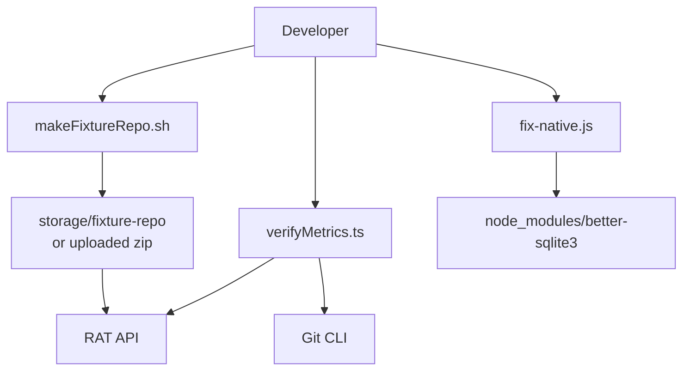
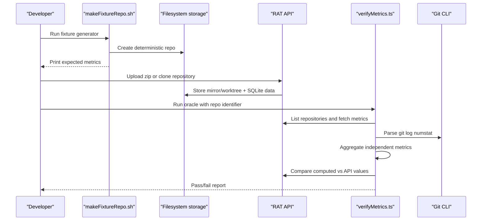
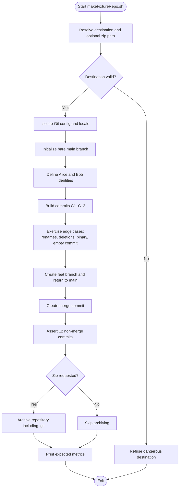
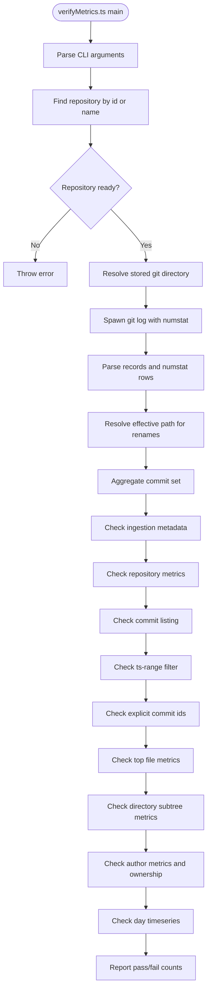
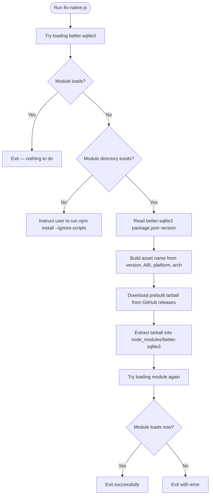
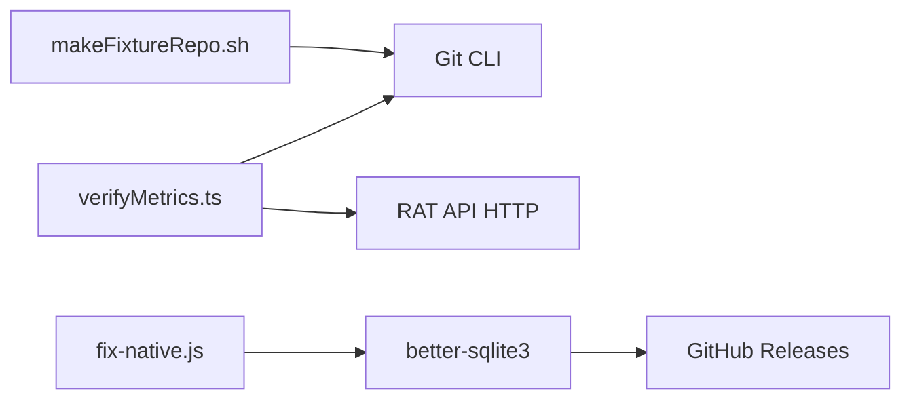

# Fixture Generation & Metrics Verification

<cite>
**Referenced Files in This Document**
- [makeFixtureRepo.sh](file://scripts/makeFixtureRepo.sh)
- [verifyMetrics.ts](file://scripts/verifyMetrics.ts)
- [fix-native.js](file://scripts/fix-native.js)
- [README.md](file://README.md)
</cite>

## Table of Contents
1. [Introduction](#introduction)
2. [Project Structure](#project-structure)
3. [Core Components](#core-components)
4. [Architecture Overview](#architecture-overview)
5. [Detailed Component Analysis](#detailed-component-analysis)
6. [Dependency Analysis](#dependency-analysis)
7. [Performance Considerations](#performance-considerations)
8. [Troubleshooting Guide](#troubleshooting-guide)
9. [Conclusion](#conclusion)
10. [Appendices](#appendices)

## Introduction
This document explains RAT’s two verification-oriented tooling surfaces:

- **Deterministic fixture generation**: a shell script that builds a small, fully reproducible Git repository with known commit patterns, author variants, renames, deletions, binary files, empty commits, and merge commits. It is designed so the API’s metrics can be compared against hand-computed expectations.
- **Independent metrics oracle**: a TypeScript script that re-derives metrics directly from Git using its own `git log --numstat` parser and compares them against the running RAT API. It validates repository totals, filters, file/directory metrics, author ownership, commit listings, and day-level timeseries.

Together, these tools support regression testing, performance benchmarking, validation of new metric implementations, and safe development workflows when native dependencies fail to build.

## Project Structure
The relevant tooling lives under `scripts/`:

| File | Purpose |
|---|---|
| `scripts/makeFixtureRepo.sh` | Creates a deterministic fixture repository and optionally zips it for upload. |
| `scripts/verifyMetrics.ts` | Independent oracle that parses Git history and checks the API’s computed metrics. |
| `scripts/fix-native.js` | Recovery helper that side-loads a prebuilt `better-sqlite3` binary when installation fails. |
| `README.md` | User-facing documentation including quick start, fixture usage, oracle usage, environment variables, and troubleshooting. |

**Diagram sources**
- [makeFixtureRepo.sh:1-244](file://scripts/makeFixtureRepo.sh#L1-L244)
- [verifyMetrics.ts:1-874](file://scripts/verifyMetrics.ts#L1-L874)
- [fix-native.js:1-88](file://scripts/fix-native.js#L1-L88)
- [README.md:73-136](file://README.md#L73-L136)

**Section sources**
- [README.md:1-14](file://README.md#L1-L14)
- [README.md:73-136](file://README.md#L73-L136)

## Core Components

### Deterministic Fixture Generator
`scripts/makeFixtureRepo.sh` is the controlled source of truth for test fixtures. Its design goals are:

- **Determinism**: fixed base date, UTC timestamps, disabled GPG signing, disabled autocrlf, and isolated Git configuration.
- **Edge-case coverage**: multiple authors, email/name variants normalized via `.mailmap`, rename-only changes, rename plus edits, deletions, binary files, nested directories, empty commits, and merge commits.
- **Invariant enforcement**: asserts exactly 12 non-merge commits exist after construction.
- **Optional ZIP output**: produces an archive containing the full repository (including `.git`) suitable for upload through the API.

Key behaviors:

| Behavior | Implementation detail |
|---|---|
| Destination safety | Refuses root or empty destination; resolves absolute paths before changing into the fixture directory. |
| Environment isolation | Sets `GIT_CONFIG_GLOBAL=/dev/null`, `GIT_CONFIG_SYSTEM=/dev/null`, and `LC_ALL=C`. |
| Commit timestamps | Uses a rolling `DAY` counter starting at zero, producing sequential UTC dates anchored at `2023-01-01 12:00:00 UTC`. |
| Author identity normalization | Writes `.mailmap` entries mapping variant names and emails to a canonical author. |
| Merge exclusion | Creates a merge commit last; the script and oracle both treat merges as excluded from metrics. |
| Expected values | Prints expected added, removed, growth, churn, modifications, frequency, churn rate, per-author counts, per-file deltas, and directory summaries. |

**Section sources**
- [makeFixtureRepo.sh:1-24](file://scripts/makeFixtureRepo.sh#L1-L24)
- [makeFixtureRepo.sh:26-57](file://scripts/makeFixtureRepo.sh#L26-L57)
- [makeFixtureRepo.sh:59-79](file://scripts/makeFixtureRepo.sh#L59-L79)
- [makeFixtureRepo.sh:81-103](file://scripts/makeFixtureRepo.sh#L81-L103)
- [makeFixtureRepo.sh:105-114](file://scripts/makeFixtureRepo.sh#L105-L114)
- [makeFixtureRepo.sh:116-129](file://scripts/makeFixtureRepo.sh#L116-L129)
- [makeFixtureRepo.sh:131-144](file://scripts/makeFixtureRepo.sh#L131-L144)
- [makeFixtureRepo.sh:146-158](file://scripts/makeFixtureRepo.sh#L146-L158)
- [makeFixtureRepo.sh:160-164](file://scripts/makeFixtureRepo.sh#L160-L164)
- [makeFixtureRepo.sh:166-168](file://scripts/makeFixtureRepo.sh#L166-L168)
- [makeFixtureRepo.sh:170-171](file://scripts/makeFixtureRepo.sh#L170-L171)
- [makeFixtureRepo.sh:173-181](file://scripts/makeFixtureRepo.sh#L173-L181)
- [makeFixtureRepo.sh:183-192](file://scripts/makeFixtureRepo.sh#L183-L192)
- [makeFixtureRepo.sh:194-200](file://scripts/makeFixtureRepo.sh#L194-L200)
- [makeFixtureRepo.sh:202-216](file://scripts/makeFixtureRepo.sh#L202-L216)
- [makeFixtureRepo.sh:218-243](file://scripts/makeFixtureRepo.sh#L218-L243)

### Independent Metrics Oracle
`scripts/verifyMetrics.ts` is intentionally decoupled from the API’s internal parsing logic. It:

1. Resolves the target repository by id or name through the API.
2. Locates the stored Git repository mirror or worktree.
3. Spawns `git log --no-merges -M50% --date-order --numstat` with a custom record format.
4. Parses the stream with its own path unquoting and rename handling.
5. Aggregates metrics using the same semantic rules as the API.
6. Compares every result against the API response.

Important implementation characteristics:

| Area | Detail |
|---|---|
| CLI interface | Requires `--repo`; supports optional `--api` and `--git-dir`. |
| API communication | Uses `fetch` with typed DTO interfaces defined locally. |
| Git invocation | Runs `git log` with `--no-merges`, `-M50%`, `--date-order`, `--numstat`, and a custom format using record and field separators. |
| Path handling | Implements C-quote decoding and effective-path resolution for renames, including brace-style and arrow-style rename syntax. |
| Filtering | Supports time-range `[fromTs, toTs)`, explicit commit IDs, and author email filtering. |
| Aggregation | Computes `added`, `removed`, `modifications`, `firstTs`, `lastTs`, and derives `frequency` and `churnRate`. |
| Checks | Repository totals, commit listing count, range filter, commit ID selection, top file, directory subtree, author metrics and ownership, and day-timeseries sums. |
| Exit behavior | Returns exit code `0` only when all checks pass; otherwise prints expected vs actual mismatches. |

**Section sources**
- [verifyMetrics.ts:1-25](file://scripts/verifyMetrics.ts#L1-L25)
- [verifyMetrics.ts:26-34](file://scripts/verifyMetrics.ts#L26-L34)
- [verifyMetrics.ts:36-68](file://scripts/verifyMetrics.ts#L36-L68)
- [verifyMetrics.ts:70-83](file://scripts/verifyMetrics.ts#L70-L83)
- [verifyMetrics.ts:85-167](file://scripts/verifyMetrics.ts#L85-L167)
- [verifyMetrics.ts:169-176](file://scripts/verifyMetrics.ts#L169-L176)
- [verifyMetrics.ts:178-238](file://scripts/verifyMetrics.ts#L178-L238)
- [verifyMetrics.ts:240-274](file://scripts/verifyMetrics.ts#L240-L274)
- [verifyMetrics.ts:276-359](file://scripts/verifyMetrics.ts#L276-L359)
- [verifyMetrics.ts:361-436](file://scripts/verifyMetrics.ts#L361-L436)
- [verifyMetrics.ts:438-472](file://scripts/verifyMetrics.ts#L438-L472)
- [verifyMetrics.ts:474-524](file://scripts/verifyMetrics.ts#L474-L524)
- [verifyMetrics.ts:530-553](file://scripts/verifyMetrics.ts#L530-L553)
- [verifyMetrics.ts:555-601](file://scripts/verifyMetrics.ts#L555-L601)
- [verifyMetrics.ts:603-630](file://scripts/verifyMetrics.ts#L603-L630)
- [verifyMetrics.ts:632-662](file://scripts/verifyMetrics.ts#L632-L662)
- [verifyMetrics.ts:664-699](file://scripts/verifyMetrics.ts#L664-L699)
- [verifyMetrics.ts:701-758](file://scripts/verifyMetrics.ts#L701-L758)
- [verifyMetrics.ts:760-798](file://scripts/verifyMetrics.ts#L760-L798)
- [verifyMetrics.ts:800-874](file://scripts/verifyMetrics.ts#L800-L874)

### Native Module Fix Script
`scripts/fix-native.js` addresses a common development blocker: when `better-sqlite3` cannot install its native binding during `npm install`, especially on locked-down environments where `prebuild-install` cannot reach GitHub releases.

Workflow:

1. Attempts to load `better-sqlite3` by constructing an in-memory database.
2. If loading succeeds, exits immediately as a no-op.
3. If the module directory is missing, instructs the user to run `npm install --ignore-scripts` first.
4. Reads the installed `better-sqlite3` version and current Node ABI.
5. Downloads the matching prebuilt tarball from the official release URL.
6. Extracts the tarball into `node_modules/better-sqlite3`.
7. Verifies the module loads again; exits with failure if it still does not load.

This script is part of the development workflow because the API depends on SQLite for persistence, and failing to load the native binding prevents the API from starting.

**Section sources**
- [fix-native.js:1-14](file://scripts/fix-native.js#L1-L14)
- [fix-native.js:15-33](file://scripts/fix-native.js#L15-L33)
- [fix-native.js:35-55](file://scripts/fix-native.js#L35-L55)
- [fix-native.js:57-88](file://scripts/fix-native.js#L57-L88)

## Architecture Overview
The verification pipeline connects three layers:

**Diagram sources**
- [makeFixtureRepo.sh:15-23](file://scripts/makeFixtureRepo.sh#L15-L23)
- [makeFixtureRepo.sh:218-243](file://scripts/makeFixtureRepo.sh#L218-L243)
- [README.md:73-86](file://README.md#L73-L86)
- [verifyMetrics.ts:800-874](file://scripts/verifyMetrics.ts#L800-L874)
- [verifyMetrics.ts:276-359](file://scripts/verifyMetrics.ts#L276-L359)

## Detailed Component Analysis

### Deterministic Fixture Repository Generation
The fixture script constructs a controlled Git history. The most important invariant is that the final repository contains exactly 12 non-merge commits. The script also prints expected metrics so developers can visually compare API output.

#### Fixture Construction Flow

**Diagram sources**
- [makeFixtureRepo.sh:26-57](file://scripts/makeFixtureRepo.sh#L26-L57)
- [makeFixtureRepo.sh:59-79](file://scripts/makeFixtureRepo.sh#L59-L79)
- [makeFixtureRepo.sh:81-216](file://scripts/makeFixtureRepo.sh#L81-L216)
- [makeFixtureRepo.sh:218-243](file://scripts/makeFixtureRepo.sh#L218-L243)

#### Fixture Scenarios Covered
| Scenario | Why it matters |
|---|---|
| Multiple authors with `.mailmap` | Validates author normalization and resolved identity aggregation. |
| Rename without edits | Ensures zero-change rows do not affect metrics. |
| Rename with edits | Ensures changes are attributed to the new path. |
| File deletion | Ensures removal lines are counted correctly. |
| Binary file | Ensures Git’s `-` rows are ignored. |
| Nested directories | Ensures directory aggregation works across levels. |
| Empty commit | Ensures it contributes to `|H|` but not to line metrics. |
| Merge commit | Ensures it is excluded from all metrics. |

**Section sources**
- [makeFixtureRepo.sh:1-24](file://scripts/makeFixtureRepo.sh#L1-L24)
- [makeFixtureRepo.sh:81-216](file://scripts/makeFixtureRepo.sh#L81-L216)
- [makeFixtureRepo.sh:225-243](file://scripts/makeFixtureRepo.sh#L225-L243)

### Independent Metrics Oracle
The oracle is a second implementation of the metric computation contract. It does not import the API’s parser or engine; instead, it re-parses Git output and independently aggregates results.

#### Oracle Processing Pipeline

**Diagram sources**
- [verifyMetrics.ts:800-874](file://scripts/verifyMetrics.ts#L800-L874)
- [verifyMetrics.ts:276-359](file://scripts/verifyMetrics.ts#L276-L359)
- [verifyMetrics.ts:361-436](file://scripts/verifyMetrics.ts#L361-L436)
- [verifyMetrics.ts:530-798](file://scripts/verifyMetrics.ts#L530-L798)

#### Oracle Metric Formulas
The oracle implements the same mathematical definitions used by the API:

| Metric | Formula | Notes |
|---|---|---|
| Growth | `δ = l⁺ − l⁻` | Net line change. |
| Churn | `λ = l⁺ + l⁻` | Total line movement. |
| Modifications | `n_H,o` | Number of distinct commits touching object `o`. |
| Frequency | `η = n / |H|` | Modification frequency over commit-set size. |
| Churn Rate | `ρ = λ / |H|` | Average churn per commit. |
| Ownership | `ω = λ_H,o,a / λ_H,o` | Fraction of churn attributable to an author within a scope. |

These formulas appear in the oracle’s aggregation, frequency, churn-rate helpers, and author ownership checks.

**Section sources**
- [verifyMetrics.ts:361-436](file://scripts/verifyMetrics.ts#L361-L436)
- [verifyMetrics.ts:701-758](file://scripts/verifyMetrics.ts#L701-L758)
- [README.md:196-202](file://README.md#L196-L202)

### Native Module Fix Workflow

**Diagram sources**
- [fix-native.js:23-33](file://scripts/fix-native.js#L23-L33)
- [fix-native.js:35-55](file://scripts/fix-native.js#L35-L55)
- [fix-native.js:57-88](file://scripts/fix-native.js#L57-L88)

**Section sources**
- [fix-native.js:1-14](file://scripts/fix-native.js#L1-L14)
- [fix-native.js:57-88](file://scripts/fix-native.js#L57-L88)

## Dependency Analysis
The tools have clear boundaries:

- `makeFixtureRepo.sh` depends only on Git, standard Unix utilities, and optionally `zip`.
- `verifyMetrics.ts` depends on Node.js, TypeScript execution via `tsx`, the system `git` CLI, and HTTP access to the RAT API.
- `fix-native.js` depends on Node.js filesystem, child process, HTTPS, and the presence of `node_modules/better-sqlite3`.

**Diagram sources**
- [makeFixtureRepo.sh:26-57](file://scripts/makeFixtureRepo.sh#L26-L57)
- [verifyMetrics.ts:26-34](file://scripts/verifyMetrics.ts#L26-L34)
- [verifyMetrics.ts:169-176](file://scripts/verifyMetrics.ts#L169-L176)
- [verifyMetrics.ts:276-359](file://scripts/verifyMetrics.ts#L276-L359)
- [fix-native.js:15-18](file://scripts/fix-native.js#L15-L18)
- [fix-native.js:35-55](file://scripts/fix-native.js#L35-L55)

**Section sources**
- [makeFixtureRepo.sh:26-57](file://scripts/makeFixtureRepo.sh#L26-L57)
- [verifyMetrics.ts:26-34](file://scripts/verifyMetrics.ts#L26-L34)
- [verifyMetrics.ts:169-176](file://scripts/verifyMetrics.ts#L169-L176)
- [verifyMetrics.ts:276-359](file://scripts/verifyMetrics.ts#L276-L359)
- [fix-native.js:15-18](file://scripts/fix-native.js#L15-L18)
- [fix-native.js:35-55](file://scripts/fix-native.js#L35-L55)

## Performance Considerations
- **Fixture generation** is fast because it creates a small repository with a fixed number of commits and files. It is intended for local verification rather than large-scale benchmarking.
- **Oracle execution** spawns one `git log` process and streams its output. For very large repositories, this may take noticeable time, but it avoids importing the API’s internal state.
- **API comparison** uses lightweight HTTP requests for each check group. The oracle performs a bounded number of API calls: repository list, repository metrics, commit listing, filtered metrics, file listing, directory listing, author listing, and timeseries.
- **Native module recovery** downloads a single tarball and extracts it once. It should only be used when the normal native binding installation fails.

[No sources needed since this section provides general guidance]

## Troubleshooting Guide

### Interpreting Oracle Results
When `verifyMetrics.ts` fails, look for:

| Symptom | Likely cause | Action |
|---|---|---|
| Cannot reach the API | API not started or wrong `--api` URL | Start the API and verify connectivity. |
| Repository not found | Wrong repository id or name | Use `GET /api/repositories` to confirm the identifier. |
| Repository not ready | Ingestion still in progress | Wait until status becomes `ready`. |
| Oracle cannot find git directory | Custom `RAT_STORAGE_DIR` mismatch | Pass `--git-dir` explicitly or align environment variables. |
| Mismatched metrics | Bug in API metrics engine, ingestion, or author resolution | Compare the oracle’s expected value with the API’s actual value and inspect the relevant endpoint. |
| Ownership sum not equal to 1 | Floating-point rounding or author aggregation issue | Check tolerance thresholds and author identity resolution. |

**Section sources**
- [verifyMetrics.ts:800-874](file://scripts/verifyMetrics.ts#L800-L874)
- [README.md:129-136](file://README.md#L129-L136)

### Debugging Metric Calculation Discrepancies
Use this checklist:

1. Confirm the fixture or repository has the expected number of non-merge commits.
2. Run the fixture generator and compare its printed expected values with the API dashboard.
3. Run the oracle against the same repository.
4. If only specific filters fail, isolate the failing check group:
   - Range filter: verify `fromTs` and `toTs` semantics.
   - Commit ID selection: verify the selected commit IDs exist.
   - File metrics: verify the top file path matches the expected path.
   - Directory metrics: verify subtree aggregation and parent-child consistency.
   - Author metrics: verify author identity resolution and ownership calculation.
   - Timeseries: verify bucket sums match repository totals.

**Section sources**
- [makeFixtureRepo.sh:209-216](file://scripts/makeFixtureRepo.sh#L209-L216)
- [makeFixtureRepo.sh:225-243](file://scripts/makeFixtureRepo.sh#L225-L243)
- [verifyMetrics.ts:530-798](file://scripts/verifyMetrics.ts#L530-L798)

### Using the Native Module Fix Script
Use `scripts/fix-native.js` when:

- `npm install` completes but the API cannot start due to `better-sqlite3` loading errors.
- Prebuilt binaries were blocked by network policy or missing build tools.
- You need a quick recovery without installing a full build toolchain.

If the script reports that `node_modules/better-sqlite3` is missing, run `npm install --ignore-scripts` first. If extraction finishes but the module still does not load, consider rebuilding from source or checking platform/ABI compatibility.

**Section sources**
- [fix-native.js:1-14](file://scripts/fix-native.js#L1-L14)
- [fix-native.js:57-88](file://scripts/fix-native.js#L57-L88)
- [README.md:278-290](file://README.md#L278-L290)

## Conclusion
RAT’s fixture generator and metrics oracle form a tight verification loop:

- The fixture generator produces a small, deterministic repository with well-known behavior.
- The oracle independently recomputes metrics from Git and compares them against the API.
- Together they provide regression protection, confidence for new metric implementations, and a practical way to validate correctness beyond unit tests.
- The native module fix script ensures the development workflow remains usable even when native dependency installation fails.

For daily use:

- Generate the fixture and upload it to the API.
- Inspect the dashboard and compare it with the expected values printed by the fixture script.
- Run the oracle to get a numeric pass/fail summary.
- Use the native fix script when SQLite bindings fail to load.

[No sources needed since this section summarizes without analyzing specific files]

## Appendices

### How to Use These Tools

#### Creating and Using a Custom Fixture
1. Modify or copy `scripts/makeFixtureRepo.sh` to create a scenario-specific repository.
2. Keep the deterministic timestamp strategy and commit-invariant checks.
3. Add edge cases relevant to your change: renames, deletions, binary files, author variants, empty commits, and merges.
4. Run the script and capture its expected metric output.
5. Upload the generated zip or point the API at the generated repository.
6. Run the oracle against the ingested repository.

**Section sources**
- [makeFixtureRepo.sh:15-23](file://scripts/makeFixtureRepo.sh#L15-L23)
- [makeFixtureRepo.sh:218-243](file://scripts/makeFixtureRepo.sh#L218-L243)
- [README.md:73-97](file://README.md#L73-L97)

#### Running Regression Tests
- Use the Jest suite for route-level and parser-level tests.
- Use the fixture generator for end-to-end metric correctness.
- Use the oracle for cross-implementation validation between Git and the API.

**Section sources**
- [README.md:101-136](file://README.md#L101-L136)

#### Validating New Metric Implementations
- Before changing the metrics engine, run the oracle against the fixture and a real repository such as cJSON.
- After changing the engine, rerun the oracle.
- If failures appear, isolate whether the discrepancy is in filtering, aggregation, author resolution, or derived metrics like frequency and churn rate.

**Section sources**
- [verifyMetrics.ts:361-436](file://scripts/verifyMetrics.ts#L361-L436)
- [verifyMetrics.ts:530-798](file://scripts/verifyMetrics.ts#L530-L798)
- [README.md:112-136](file://README.md#L112-L136)