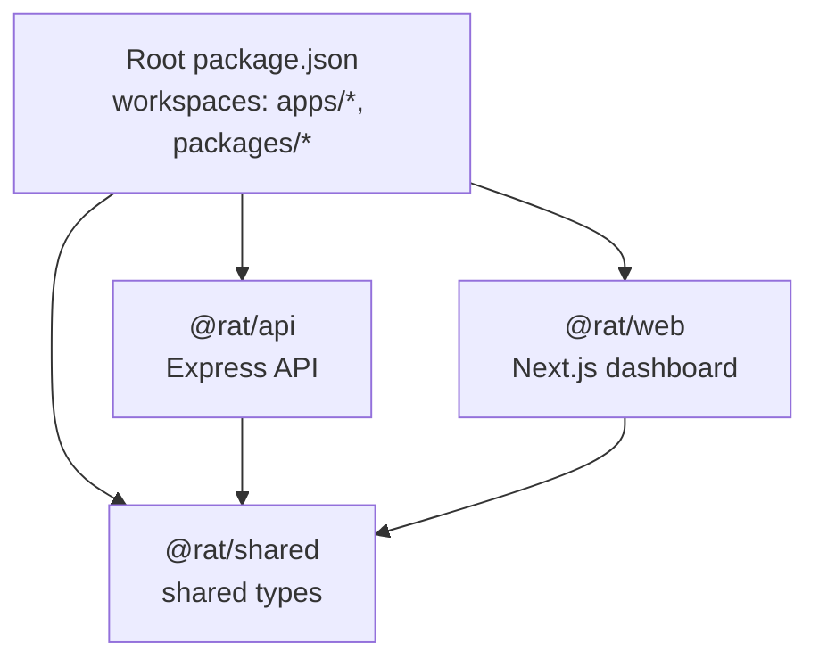
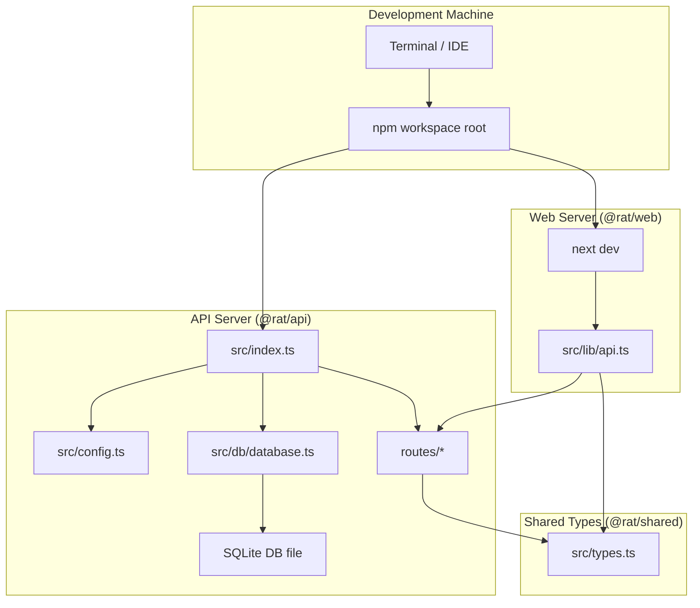
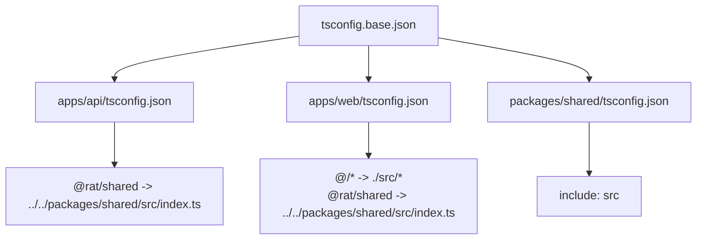
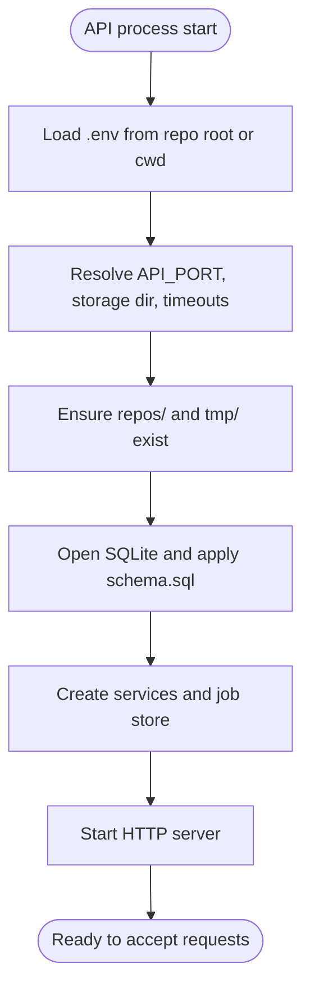
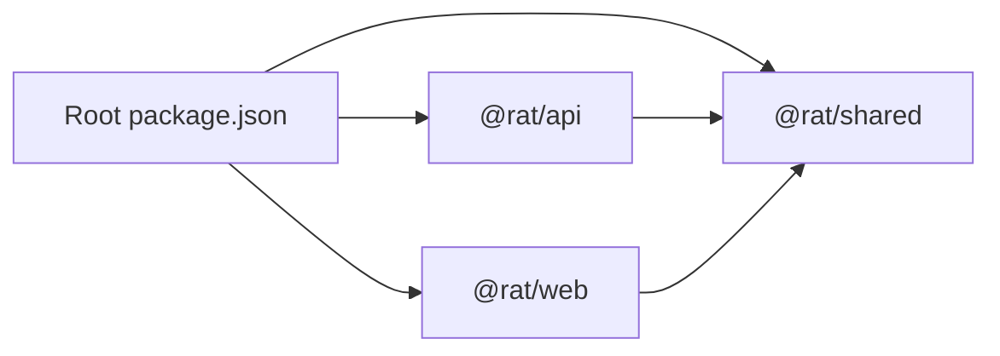

# Local Development Setup

<cite>
**Referenced Files in This Document**   
- [package.json](file://package.json)
- [apps/api/package.json](file://apps/api/package.json)
- [apps/web/package.json](file://apps/web/package.json)
- [packages/shared/package.json](file://packages/shared/package.json)
- [tsconfig.base.json](file://tsconfig.base.json)
- [apps/api/tsconfig.json](file://apps/api/tsconfig.json)
- [apps/web/tsconfig.json](file://apps/web/tsconfig.json)
- [packages/shared/tsconfig.json](file://packages/shared/tsconfig.json)
- [apps/api/src/config.ts](file://apps/api/src/config.ts)
- [apps/api/src/db/database.ts](file://apps/api/src/db/database.ts)
- [apps/api/src/index.ts](file://apps/api/src/index.ts)
- [apps/web/src/lib/api.ts](file://apps/web/src/lib/api.ts)
- [packages/shared/src/types.ts](file://packages/shared/src/types.ts)
- [packages/shared/src/index.ts](file://packages/shared/src/index.ts)
</cite>

## Table of Contents
1. [Introduction](#introduction)
2. [Project Structure](#project-structure)
3. [Core Components](#core-components)
4. [Architecture Overview](#architecture-overview)
5. [Detailed Component Analysis](#detailed-component-analysis)
6. [Dependency Analysis](#dependency-analysis)
7. [Performance Considerations](#performance-considerations)
8. [Troubleshooting Guide](#troubleshooting-guide)
9. [Conclusion](#conclusion)

## Introduction
This document explains how to set up RAT for local development. It covers Node.js requirements, npm workspaces, monorepo layout, TypeScript configuration, environment variables, database initialization, and running both the API and web servers with hot reload.

RAT is a repository analysis tool that ingests Git repositories (via zip upload or cloning), computes metrics, and exposes them through an Express API. A Next.js dashboard consumes those APIs and visualizes the results.

## Project Structure
RAT uses an npm workspace monorepo:

- `apps/api`: Express + TypeScript API server backed by SQLite.
- `apps/web`: Next.js App Router dashboard.
- `packages/shared`: Shared TypeScript types used by both apps.
- Root `package.json`: Workspace configuration and shared scripts.

**Diagram sources**
- [package.json:6-9](file://package.json#L6-L9)
- [apps/api/package.json:1-6](file://apps/api/package.json#L1-L6)
- [apps/web/package.json:1-6](file://apps/web/package.json#L1-L6)
- [packages/shared/package.json:1-6](file://packages/shared/package.json#L1-L6)

**Section sources**
- [package.json:1-30](file://package.json#L1-L30)
- [apps/api/package.json:1-40](file://apps/api/package.json#L1-L40)
- [apps/web/package.json:1-28](file://apps/web/package.json#L1-L28)
- [packages/shared/package.json:1-12](file://packages/shared/package.json#L1-L12)

## Core Components
- Root workspace scripts orchestrate development, build, test, and type-checking across all packages.
- The API package runs an Express server, manages SQLite, and serves repository ingestion and metrics endpoints.
- The Web package is a Next.js application that calls the API and renders metrics dashboards.
- The Shared package exports only TypeScript types consumed by both apps.

Key responsibilities:
- Environment loading and storage directory setup live in the API configuration module.
- Database opening and schema execution are handled by the database module.
- The API entry point wires configuration, database, services, routes, and graceful shutdown.
- The Web client library centralizes API calls and error handling.

**Section sources**
- [package.json:10-20](file://package.json#L10-L20)
- [apps/api/src/config.ts:1-73](file://apps/api/src/config.ts#L1-L73)
- [apps/api/src/db/database.ts:1-23](file://apps/api/src/db/database.ts#L1-L23)
- [apps/api/src/index.ts:1-43](file://apps/api/src/index.ts#L1-L43)
- [apps/web/src/lib/api.ts:1-269](file://apps/web/src/lib/api.ts#L1-L269)
- [packages/shared/src/index.ts:1-2](file://packages/shared/src/index.ts#L1-L2)

## Architecture Overview
The development architecture consists of two concurrently running servers and a shared type layer:

**Diagram sources**
- [apps/api/src/index.ts:1-43](file://apps/api/src/index.ts#L1-L43)
- [apps/api/src/config.ts:1-73](file://apps/api/src/config.ts#L1-L73)
- [apps/api/src/db/database.ts:1-23](file://apps/api/src/db/database.ts#L1-L23)
- [apps/web/src/lib/api.ts:1-269](file://apps/web/src/lib/api.ts#L1-L269)
- [packages/shared/src/types.ts:1-226](file://packages/shared/src/types.ts#L1-L226)

## Detailed Component Analysis

### Monorepo and Workspaces
- The root `package.json` defines workspaces for `apps/*` and `packages/*`.
- Scripts at the root run commands inside specific workspaces using `--workspace`.
- `concurrently` starts both API and web development servers together.

Recommended workflow:
- Install dependencies once at the root.
- Use root scripts to start development, build, test, and typecheck.

**Section sources**
- [package.json:6-20](file://package.json#L6-L20)

### Node.js Requirements
- The project requires Node.js version 18.18 or newer.
- Use a Node.js version manager if you need multiple versions locally.

**Section sources**
- [package.json:27-29](file://package.json#L27-L29)

### Dependency Management
- Dependencies are managed per workspace:
  - `@rat/api` depends on Express, SQLite driver, validation, and shared types.
  - `@rat/web` depends on Next.js, React, visualization libraries, and shared types.
  - `@rat/shared` exports only types; it has no runtime dependencies.
- The root installs development utilities like `concurrently`, `tsx`, and `typescript`.

**Section sources**
- [apps/api/package.json:14-37](file://apps/api/package.json#L14-L37)
- [apps/web/package.json:12-26](file://apps/web/package.json#L12-L26)
- [packages/shared/package.json:1-12](file://packages/shared/package.json#L1-L12)
- [package.json:22-26](file://package.json#L22-L26)

### TypeScript Configuration and Path Mappings
- All projects extend a shared base configuration.
- Base settings include strict mode, ES2022 target, isolated modules, and JSON module resolution.
- Each app configures its own module system and path mappings:
  - API uses CommonJS with Node resolution and maps `@rat/shared` to the source file.
  - Web uses bundler resolution, enables JSX preservation, and maps `@/*` and `@rat/shared`.
  - Shared package disables emission and includes only its source folder.

**Diagram sources**
- [tsconfig.base.json:1-16](file://tsconfig.base.json#L1-L16)
- [apps/api/tsconfig.json:1-15](file://apps/api/tsconfig.json#L1-L15)
- [apps/web/tsconfig.json:1-21](file://apps/web/tsconfig.json#L1-L21)
- [packages/shared/tsconfig.json:1-8](file://packages/shared/tsconfig.json#L1-L8)

**Section sources**
- [tsconfig.base.json:1-16](file://tsconfig.base.json#L1-L16)
- [apps/api/tsconfig.json:1-15](file://apps/api/tsconfig.json#L1-L15)
- [apps/web/tsconfig.json:1-21](file://apps/web/tsconfig.json#L1-L21)
- [packages/shared/tsconfig.json:1-8](file://packages/shared/tsconfig.json#L1-L8)

### Environment Variables and Storage Layout
The API loads environment variables from `.env` files and resolves storage paths relative to the repository root.

Important variables:
- `API_PORT`: HTTP port for the API server. Default is `4000`.
- `RAT_STORAGE_DIR`: Absolute or relative path for storage. Defaults to `./storage`.
- `MAX_UPLOAD_MB`: Maximum upload size in megabytes. Defaults to `512`.
- `CLONE_TIMEOUT_MS`: Timeout for repository cloning operations. Defaults to 30 minutes.

Storage layout under `RAT_STORAGE_DIR`:
- `repos/`: One directory per ingested repository.
- `tmp/`: Temporary staging area for uploaded zips.
- `rat.db`: SQLite database file.

Startup behavior:
- On boot, the API ensures `repos` and `tmp` directories exist.
- The database is opened and the embedded schema is executed automatically.

**Diagram sources**
- [apps/api/src/config.ts:13-73](file://apps/api/src/config.ts#L13-L73)
- [apps/api/src/db/database.ts:7-22](file://apps/api/src/db/database.ts#L7-L22)
- [apps/api/src/index.ts:7-23](file://apps/api/src/index.ts#L7-L23)

**Section sources**
- [apps/api/src/config.ts:1-73](file://apps/api/src/config.ts#L1-L73)
- [apps/api/src/db/database.ts:1-23](file://apps/api/src/db/database.ts#L1-L23)
- [apps/api/src/index.ts:1-43](file://apps/api/src/index.ts#L1-L43)

### Web Client Configuration
The Next.js client reads the API base URL from `NEXT_PUBLIC_API_URL`, defaulting to `http://localhost:4000`. It provides a typed client wrapper around fetch and XMLHttpRequest for uploads.

Key behaviors:
- Normalized API errors are wrapped in a structured `ApiError`.
- Query parameters are built safely, skipping empty values.
- Uploads use XHR to expose progress events.

**Section sources**
- [apps/web/src/lib/api.ts:17-21](file://apps/web/src/lib/api.ts#L17-L21)
- [apps/web/src/lib/api.ts:22-69](file://apps/web/src/lib/api.ts#L22-L69)
- [apps/web/src/lib/api.ts:147-189](file://apps/web/src/lib/api.ts#L147-L189)

### Shared Types
The shared package exports only TypeScript types. Both the API and web app import these types to keep payloads consistent.

Highlights:
- Repository and job state models.
- Commit, author, and path metadata.
- Metrics envelopes for repository, file, directory, author, and timeseries data.
- Common list response envelope and API error body shape.

**Section sources**
- [packages/shared/src/index.ts:1-2](file://packages/shared/src/index.ts#L1-L2)
- [packages/shared/src/types.ts:1-226](file://packages/shared/src/types.ts#L1-L226)

## Dependency Analysis
The following diagram shows workspace-level dependencies:

**Diagram sources**
- [package.json:6-9](file://package.json#L6-L9)
- [apps/api/package.json:14-16](file://apps/api/package.json#L14-L16)
- [apps/web/package.json:12-15](file://apps/web/package.json#L12-L15)
- [packages/shared/package.json:1-12](file://packages/shared/package.json#L1-L12)

**Section sources**
- [package.json:6-9](file://package.json#L6-L9)
- [apps/api/package.json:14-16](file://apps/api/package.json#L14-L16)
- [apps/web/package.json:12-15](file://apps/web/package.json#L12-L15)
- [packages/shared/package.json:1-12](file://packages/shared/package.json#L1-L12)

## Performance Considerations
- Use the latest supported Node.js version within the required range for faster compilation and runtime performance.
- Keep `RAT_STORAGE_DIR` on fast local storage for better ingestion and query performance.
- Avoid excessively large upload sizes unless necessary; tune `MAX_UPLOAD_MB` based on your workload.
- When running both servers concurrently, ensure sufficient CPU and memory resources.

[No sources needed since this section provides general guidance]

## Troubleshooting Guide

Common setup issues and resolutions:

- Node.js version mismatch
  - Symptom: Installation or runtime errors related to unsupported features.
  - Resolution: Install Node.js 18.18 or newer as enforced by the engines field.

- Missing `.env` file
  - Symptom: API defaults to unexpected ports or storage locations.
  - Resolution: Create a `.env` file at the repository root and define `API_PORT`, `RAT_STORAGE_DIR`, `MAX_UPLOAD_MB`, and `CLONE_TIMEOUT_MS` as needed.

- Storage directory permissions
  - Symptom: Errors when creating `repos/` or `tmp/`.
  - Resolution: Ensure the configured `RAT_STORAGE_DIR` is writable by the user running the API.

- Database schema not applied
  - Symptom: Missing tables or foreign key constraints fail.
  - Resolution: Confirm the API starts successfully so the embedded schema is executed on first open.

- Web cannot reach the API
  - Symptom: Network errors or CORS failures in the browser console.
  - Resolution: Verify the API server is running and `NEXT_PUBLIC_API_URL` points to the correct address.

- Hot reload not triggering
  - Symptom: Changes do not reflect immediately.
  - Resolution: Run both servers via the root `dev` script so `tsx watch` and `next dev` are active.

- Type errors in shared types
  - Symptom: TypeScript errors when importing from `@rat/shared`.
  - Resolution: Ensure workspace dependencies are installed and path mappings are intact.

**Section sources**
- [package.json:27-29](file://package.json#L27-L29)
- [apps/api/src/config.ts:13-73](file://apps/api/src/config.ts#L13-L73)
- [apps/api/src/db/database.ts:7-22](file://apps/api/src/db/database.ts#L7-L22)
- [apps/web/src/lib/api.ts:17-21](file://apps/web/src/lib/api.ts#L17-L21)

## Conclusion
You can develop RAT locally by installing Node.js 18.18+, installing dependencies at the workspace root, and running the provided scripts. The API server initializes storage and SQLite automatically, while the Next.js dashboard connects to the API using a typed client. Shared types ensure consistent contracts between the API and web layers.

[No sources needed since this section summarizes without analyzing specific files]