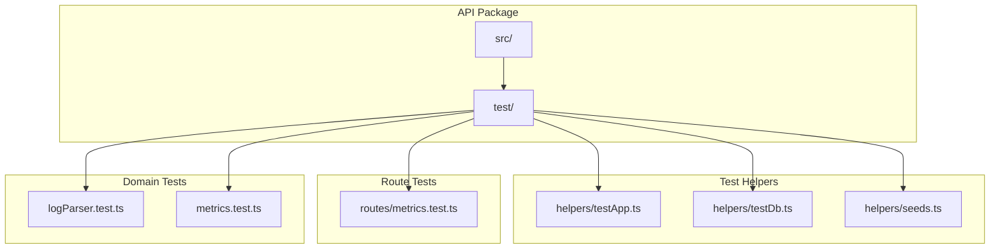
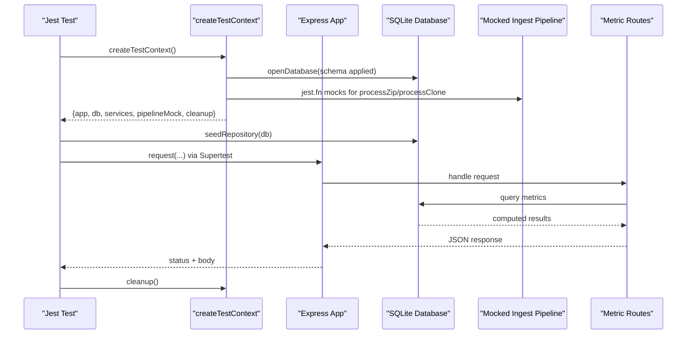
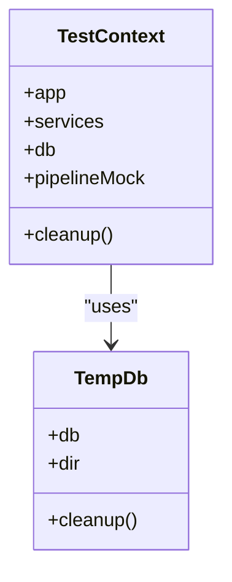
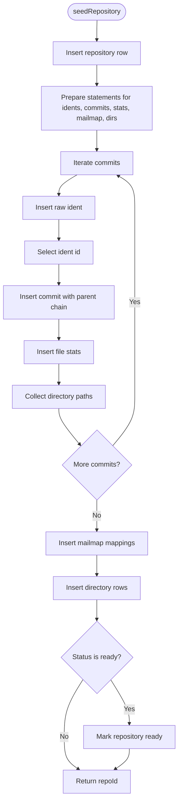
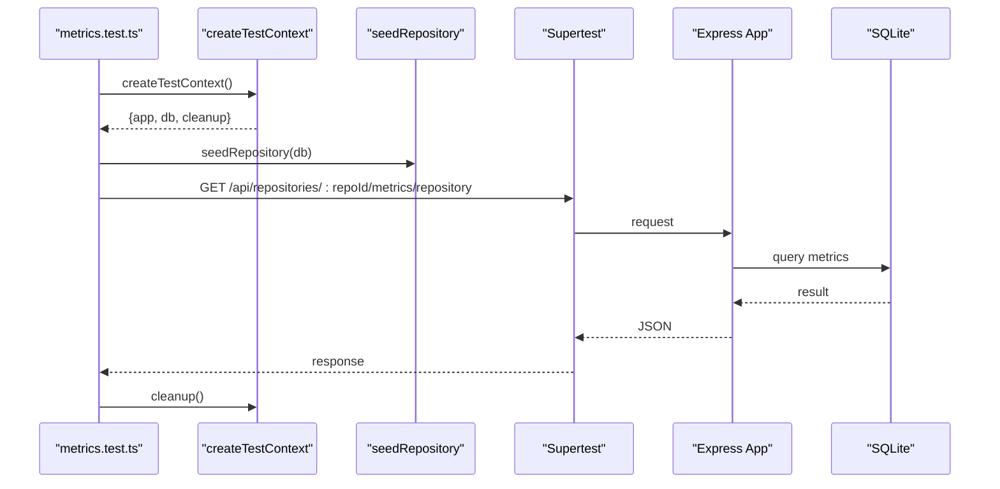
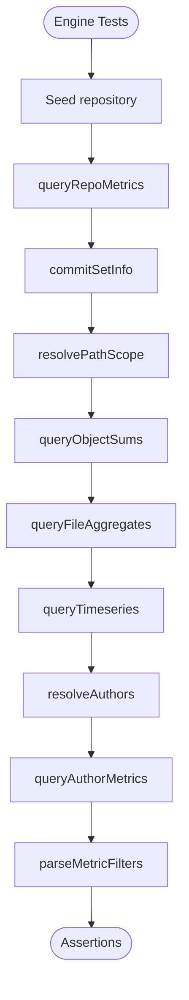
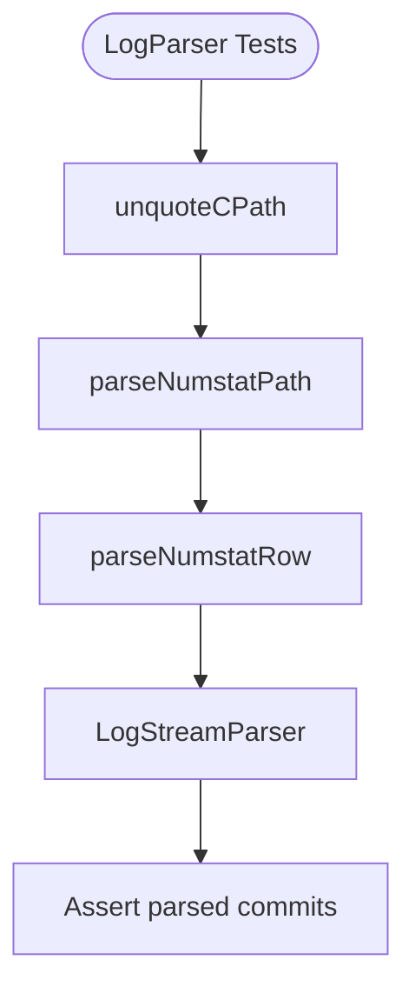
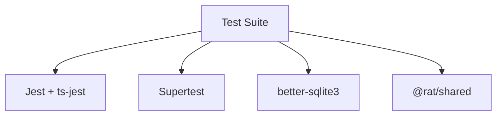

# Testing Strategy & Infrastructure

<cite>
**Referenced Files in This Document**   
- [jest.config.js](file://apps/api/jest.config.js)
- [package.json](file://apps/api/package.json)
- [testApp.ts](file://apps/api/test/helpers/testApp.ts)
- [testDb.ts](file://apps/api/test/helpers/testDb.ts)
- [seeds.ts](file://apps/api/test/helpers/seeds.ts)
- [metrics.test.ts](file://apps/api/test/routes/metrics.test.ts)
- [logParser.test.ts](file://apps/api/test/logParser.test.ts)
- [metrics.engine.test.ts](file://apps/api/test/metrics.test.ts)
- [logParser.ts](file://apps/api/src/git/logParser.ts)
- [authorMetrics.ts](file://apps/api/src/metrics/authorMetrics.ts)
</cite>

## Table of Contents
1. [Introduction](#introduction)
2. [Project Structure](#project-structure)
3. [Core Components](#core-components)
4. [Architecture Overview](#architecture-overview)
5. [Detailed Component Analysis](#detailed-component-analysis)
6. [Dependency Analysis](#dependency-analysis)
7. [Performance Considerations](#performance-considerations)
8. [Troubleshooting Guide](#troubleshooting-guide)
9. [Conclusion](#conclusion)
10. [Appendices](#appendices)

## Introduction
This document explains RAT’s testing strategy and infrastructure for the API package. It covers Jest configuration, test organization, isolated Express application setup, SQLite-based test databases, deterministic seed data, integration tests for API routes, unit tests for metric computation, and Git log parsing tests. It also provides guidance on writing new tests, mocking external dependencies such as Git CLI and file system operations, naming conventions, and how to run specific test suites or individual files.

## Project Structure
The test suite lives under `apps/api/test`. The most important directories are:
- `test/helpers`: shared test utilities including an isolated Express app factory, a temporary SQLite database helper, and deterministic seed data.
- `test/routes`: integration tests that exercise HTTP endpoints using Supertest against the isolated test app.
- Top-level test files for domain logic: `logParser.test.ts` for Git log parsing and `metrics.test.ts` for metric engine queries.

**Diagram sources**
- [testApp.ts:1-64](file://apps/api/test/helpers/testApp.ts#L1-L64)
- [testDb.ts:1-47](file://apps/api/test/helpers/testDb.ts#L1-L47)
- [seeds.ts:1-171](file://apps/api/test/helpers/seeds.ts#L1-L171)
- [metrics.test.ts:1-332](file://apps/api/test/routes/metrics.test.ts#L1-L332)
- [logParser.test.ts:1-152](file://apps/api/test/logParser.test.ts#L1-L152)
- [metrics.engine.test.ts:1-403](file://apps/api/test/metrics.test.ts#L1-L403)

**Section sources**
- [jest.config.js:1-29](file://apps/api/jest.config.js#L1-L29)
- [package.json:1-40](file://apps/api/package.json#L1-L40)

## Core Components
RAT’s test infrastructure is built around three reusable helpers:
- Isolated Express application context: creates a fresh Express app with a temporary database and mocked ingestion pipeline so route tests do not execute real Git commands or touch production storage.
- Temporary SQLite database: opens a schema-initialized SQLite database inside a temporary directory and exposes a cleanup function.
- Deterministic seed data: inserts a hand-computed repository scenario into the test database, bypassing Git, so metric expectations are stable and independent of actual repository history.

Key responsibilities:
- `createTestContext` builds a testable Express app, configures storage paths under a temp directory, injects a mock pipeline, and returns a cleanup function.
- `createTempDb` chooses a writable temporary directory, opens a database, applies schema, and ensures cleanup removes both the database connection and directory.
- `seedRepository` inserts repositories, commits, file stats, mailmap mappings, and directory entries, then marks the repository ready when appropriate.

These helpers are used by:
- Route integration tests to assert HTTP behavior and persistence without side effects.
- Engine-level metric tests to validate SQL-driven computations over a known dataset.
- Parser tests to validate pure parsing functions and streaming behavior.

**Section sources**
- [testApp.ts:12-64](file://apps/api/test/helpers/testApp.ts#L12-L64)
- [testDb.ts:6-47](file://apps/api/test/helpers/testDb.ts#L6-L47)
- [seeds.ts:116-171](file://apps/api/test/helpers/seeds.ts#L116-L171)

## Architecture Overview
The test architecture separates concerns between HTTP routing, metric computation, and Git log parsing. Integration tests drive the HTTP layer; unit tests exercise business logic directly against a seeded SQLite database.

**Diagram sources**
- [testApp.ts:29-64](file://apps/api/test/helpers/testApp.ts#L29-L64)
- [testDb.ts:30-47](file://apps/api/test/helpers/testDb.ts#L30-L47)
- [seeds.ts:116-171](file://apps/api/test/helpers/seeds.ts#L116-L171)
- [metrics.test.ts:1-332](file://apps/api/test/routes/metrics.test.ts#L1-L332)

## Detailed Component Analysis

### Jest Configuration
The Jest configuration sets up Node environment execution, TypeScript transformation through ts-jest, test discovery under `test/**/*.test.ts`, module mapping for the shared package, and global settings like timeout and mock clearing.

Important aspects:
- `testEnvironment: 'node'` ensures server-side runtime behavior.
- `roots` and `testMatch` restrict tests to the API package’s test directory.
- `moduleNameMapper` maps the shared package to its TypeScript source for consistent imports.
- `transform` configures ts-jest with strict TypeScript options suitable for tests.
- `testTimeout` allows longer-running tests, useful for database and parsing scenarios.
- `clearMocks` resets mocks between tests to avoid cross-test contamination.

**Section sources**
- [jest.config.js:1-29](file://apps/api/jest.config.js#L1-L29)

### Test Application Helper
The test application helper constructs an isolated Express application for route tests. It:
- Creates a temporary SQLite database via `createTempDb`.
- Builds a minimal configuration pointing all storage paths to the temporary directory.
- Ensures storage directories exist.
- Injects a mocked ingest pipeline with Jest mocks for `processZip` and `processClone`, preventing any Git CLI execution during route tests.
- Returns an object containing the Express app, services, database instance, pipeline mock, and a cleanup function.

This design guarantees that route tests focus on routing, validation, serialization, and persistence without touching Git or the filesystem layout.

**Diagram sources**
- [testApp.ts:12-64](file://apps/api/test/helpers/testApp.ts#L12-L64)
- [testDb.ts:6-47](file://apps/api/test/helpers/testDb.ts#L6-L47)

**Section sources**
- [testApp.ts:1-64](file://apps/api/test/helpers/testApp.ts#L1-L64)

### Test Database Setup
The test database helper:
- Chooses a writable temporary directory, falling back to a workspace-local `.test-tmp` directory when `os.tmpdir()` is not writable (e.g., sandboxed CI).
- Opens a fresh SQLite database with schema applied.
- Provides a cleanup function that closes the database and removes the temporary directory.

This approach isolates each test run and avoids leaking state across tests.

**Section sources**
- [testDb.ts:1-47](file://apps/api/test/helpers/testDb.ts#L1-L47)

### Seed Data Generation Utilities
The seed utilities define a deterministic fixture scenario mirroring the repository fixture script. They provide:
- Constants for repository ID, base timestamp, and day duration.
- Interfaces for commit, file stat, mailmap entry, and seed options.
- A deterministic SHA generator based on commit index.
- Fixture commits representing various cases: author variants, rename-only commits, binary-only commits, empty commits, deletions, nested directories.
- A mailmap fixture resolving an author variant to a canonical identity.
- `seedRepository` which inserts repository metadata, raw idents, commits, file stats, mailmap mappings, and directory entries into the database, optionally marking the repository ready.

This enables stable metric assertions independent of Git output.

**Diagram sources**
- [seeds.ts:116-171](file://apps/api/test/helpers/seeds.ts#L116-L171)

**Section sources**
- [seeds.ts:1-171](file://apps/api/test/helpers/seeds.ts#L1-L171)

### Integration Testing Approach for API Routes
The metrics route integration test demonstrates the standard pattern:
- Use `createTestContext` to build an isolated Express app and obtain a seeded database.
- Call `seedRepository` to populate the database with the deterministic fixture.
- Use Supertest to send HTTP requests to the app.
- Assert status codes, response bodies, pagination, sorting, filtering, and error responses.

Examples covered include:
- Repository metrics endpoint returning totals, time spans, and derived rates.
- Query filters for timestamp ranges and commit IDs.
- File metrics sorted by churn, path prefix filtering, pagination, and commit-set filter reflection.
- Directory metrics at different depths and drilling into subdirectories.
- Author metrics with churn, ownership, and path scoping.
- Timeseries bucketing by day and week, path scoping, and invalid bucket rejection.
- Error paths for unknown repositories and non-ready repositories.

**Diagram sources**
- [metrics.test.ts:1-332](file://apps/api/test/routes/metrics.test.ts#L1-L332)
- [testApp.ts:29-64](file://apps/api/test/helpers/testApp.ts#L29-L64)
- [seeds.ts:116-171](file://apps/api/test/helpers/seeds.ts#L116-L171)

**Section sources**
- [metrics.test.ts:1-332](file://apps/api/test/routes/metrics.test.ts#L1-L332)

### Metric Computation Tests
The metric engine tests validate SQL-driven computations over the seeded database. They cover:
- Repository-level metrics aggregation and derived rates.
- Commit set information and time span calculation.
- Path scope resolution for root, directories, and files, including error handling for missing paths.
- Object sums across scopes: all, directory subtree, single file, and sibling directory guard.
- File aggregates with path prefix filtering and commit-set filters.
- Timeseries bucketing by day and week, ensuring every commit bucket is present even when no changes occur in a scope.
- Author resolution folding mailmap identities into canonical authors.
- Per-author churn and ownership calculations, including path-scoped churn while preserving full commit counts.
- Filter parsing and validation for commit IDs, timestamps, and author schemes.

**Diagram sources**
- [metrics.engine.test.ts:1-403](file://apps/api/test/metrics.test.ts#L1-L403)
- [authorMetrics.ts:43-199](file://apps/api/src/metrics/authorMetrics.ts#L43-L199)

**Section sources**
- [metrics.engine.test.ts:1-403](file://apps/api/test/metrics.test.ts#L1-L403)
- [authorMetrics.ts:1-199](file://apps/api/src/metrics/authorMetrics.ts#L1-L199)

### Git Log Parsing Tests
The Git log parser tests validate pure parsing functions and streaming behavior:
- C-path unquoting for octal-escaped UTF-8 and control characters.
- Numstat path parsing for plain paths, renames, brace renames, and quoted paths.
- Numstat row parsing for regular rows, deletions, renames, binary skips, and malformed input.
- Streaming parser behavior for multiple commits, binary skips, empty diffs, merge parents, garbage lines before first record, and exposure of the log format constant.

**Diagram sources**
- [logParser.test.ts:1-152](file://apps/api/test/logParser.test.ts#L1-L152)
- [logParser.ts:41-203](file://apps/api/src/git/logParser.ts#L41-L203)

**Section sources**
- [logParser.test.ts:1-152](file://apps/api/test/logParser.test.ts#L1-L152)
- [logParser.ts:1-203](file://apps/api/src/git/logParser.ts#L1-L203)

## Dependency Analysis
The test suite depends on:
- Jest and ts-jest for running TypeScript tests.
- Supertest for HTTP integration testing.
- better-sqlite3 for database access.
- The shared package for types.

**Diagram sources**
- [package.json:24-38](file://apps/api/package.json#L24-L38)
- [jest.config.js:1-29](file://apps/api/jest.config.js#L1-L29)

**Section sources**
- [package.json:1-40](file://apps/api/package.json#L1-L40)
- [jest.config.js:1-29](file://apps/api/jest.config.js#L1-L29)

## Performance Considerations
- Use the temporary database helper to ensure fast, isolated SQLite instances per test.
- Prefer seeding deterministic fixtures rather than invoking Git CLI in route tests to keep integration tests fast and deterministic.
- Mock external dependencies like Git CLI and file system operations where possible to avoid I/O overhead.
- Keep test timeouts reasonable; adjust only if necessary for slow operations.
- Avoid heavy setup in `beforeAll` unless it is truly shared across many tests; prefer `beforeEach` for isolation.

[No sources needed since this section provides general guidance]

## Troubleshooting Guide
Common issues and resolutions:
- **Tests fail due to permission errors creating temp directories**: The helper falls back to a workspace-local directory when `os.tmpdir()` is not writable. Ensure the workspace has write permissions or configure CI to allow `.test-tmp`.
- **Route tests unexpectedly invoke Git**: Verify that the ingest pipeline is mocked via `createTestContext`; do not replace it with a real pipeline in route tests.
- **Metric assertions differ from expected values**: Confirm that `seedRepository` was called and that the repository status matches expectations (ready vs queued).
- **Parsing tests fail on Windows or unusual locales**: Ensure C-path unquoting handles platform-specific quoting and that tests use explicit string inputs rather than relying on locale-dependent behavior.
- **Mocks persist across tests**: Rely on `clearMocks: true` in Jest configuration; reset manually if needed using `jest.clearAllMocks()`.

**Section sources**
- [testDb.ts:16-28](file://apps/api/test/helpers/testDb.ts#L16-L28)
- [testApp.ts:44-54](file://apps/api/test/helpers/testApp.ts#L44-L54)
- [jest.config.js:26-28](file://apps/api/jest.config.js#L26-L28)

## Conclusion
RAT’s testing infrastructure emphasizes isolation, determinism, and clarity. The test application helper provides a safe Express environment with mocked pipelines, the temporary database helper ensures clean SQLite state, and the seed utilities supply stable fixtures for metric and route tests. Integration tests validate HTTP behavior, while unit tests verify metric computation and Git log parsing. Following the patterns and best practices outlined here will help maintain reliable, fast, and readable tests.

[No sources needed since this section summarizes without analyzing specific files]

## Appendices

### Writing Unit Tests for Business Logic
- Import the module under test and the seeded database helper.
- Create a temporary database and seed it with `seedRepository`.
- Call the business logic function with the seeded database and repository ID.
- Assert returned structures, derived metrics, and error conditions.
- Clean up using the provided cleanup function.

Example references:
- Metric engine tests demonstrate querying repository metrics, file aggregates, timeseries, author resolution, and filter parsing.
- Git log parser tests demonstrate validating pure functions and streaming behavior.

**Section sources**
- [metrics.engine.test.ts:1-403](file://apps/api/test/metrics.test.ts#L1-L403)
- [logParser.test.ts:1-152](file://apps/api/test/logParser.test.ts#L1-L152)

### Mocking External Dependencies
- Mock Git CLI calls by replacing the ingest pipeline with Jest mocks (`processZip`, `processClone`).
- Mock file system operations by avoiding real writes; use the temporary directory helper instead.
- Use `jest.fn` for spies and `jest.clearAllMocks` to reset state between tests.

**Section sources**
- [testApp.ts:44-54](file://apps/api/test/helpers/testApp.ts#L44-L54)
- [jest.config.js:27-28](file://apps/api/jest.config.js#L27-L28)

### Naming Conventions and Organization
- Place route integration tests under `test/routes/<route>.test.ts`.
- Place domain unit tests at the top level of `test/` when they target a single module (e.g., `logParser.test.ts`, `metrics.test.ts`).
- Name test files with `.test.ts` suffix to match Jest discovery.
- Group related tests using `describe` blocks and name them after the feature or component under test.

**Section sources**
- [jest.config.js:4-5](file://apps/api/jest.config.js#L4-L5)
- [metrics.test.ts:1-332](file://apps/api/test/routes/metrics.test.ts#L1-L332)
- [logParser.test.ts:1-152](file://apps/api/test/logParser.test.ts#L1-L152)
- [metrics.engine.test.ts:1-403](file://apps/api/test/metrics.test.ts#L1-L403)

### Running Specific Test Suites or Individual Files
- Run all tests: `npm test`
- Run a specific file: `npx jest apps/api/test/routes/metrics.test.ts`
- Run a specific describe block: `npx jest -t "repository metrics"`
- Watch mode: `npx jest --watch`

**Section sources**
- [package.json:7-12](file://apps/api/package.json#L7-L12)