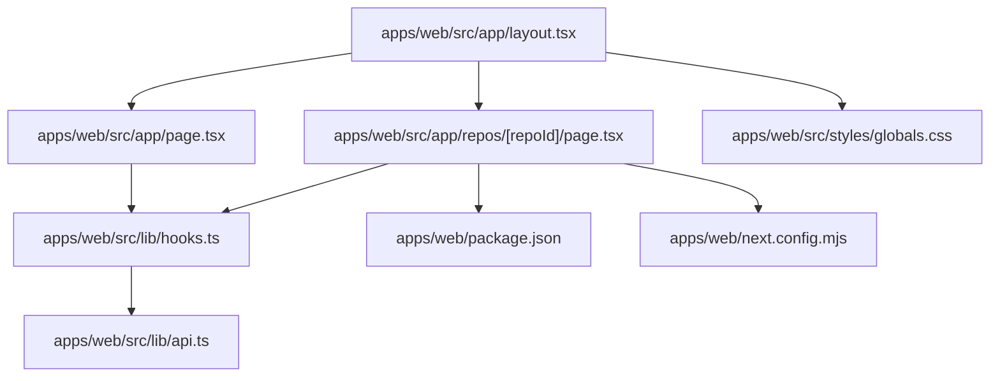
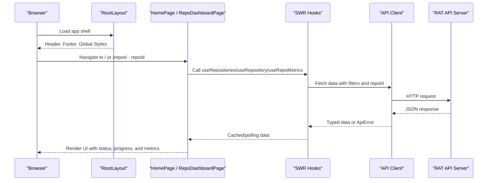
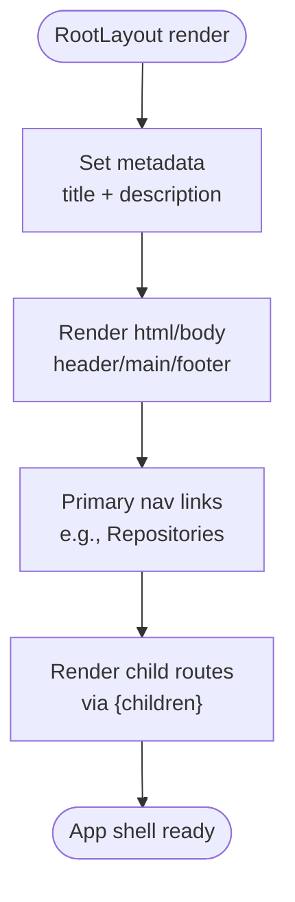
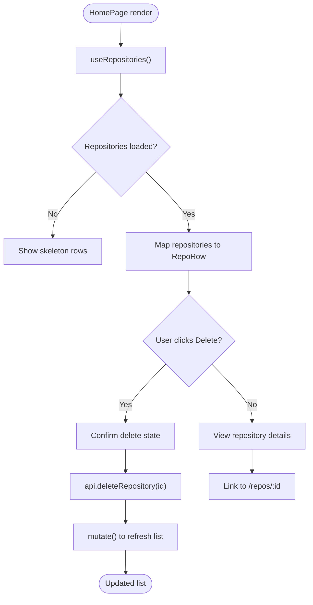
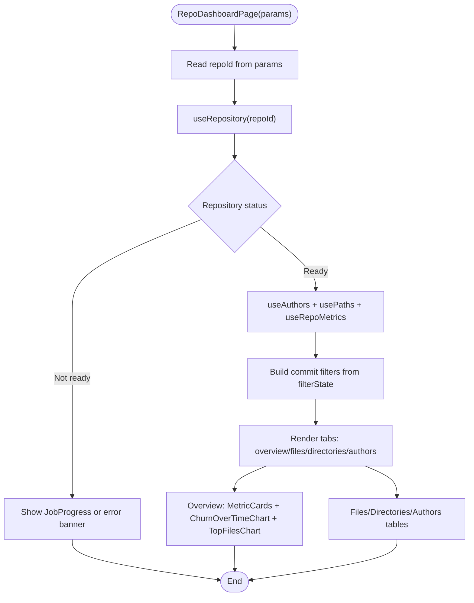
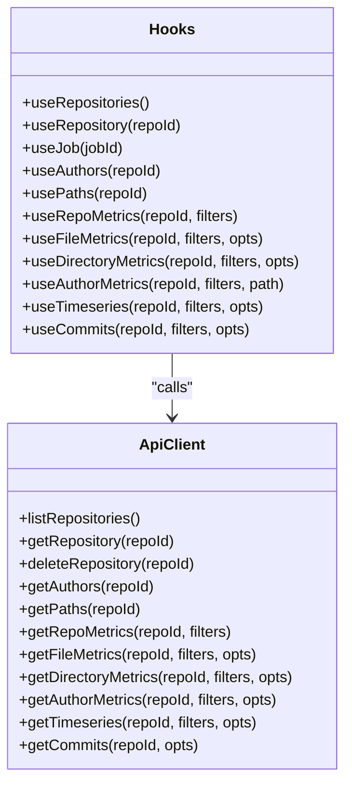
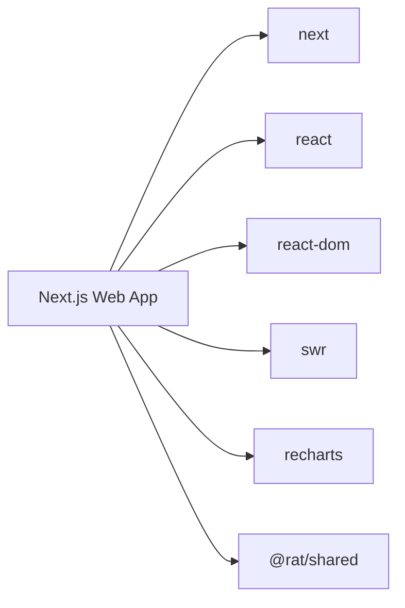

# App Structure & Routing

<cite>
**Referenced Files in This Document**
- [layout.tsx](file://apps/web/src/app/layout.tsx)
- [page.tsx](file://apps/web/src/app/page.tsx)
- [repo-page.tsx](file://apps/web/src/app/repos/[repoId]/page.tsx)
- [hooks.ts](file://apps/web/src/lib/hooks.ts)
- [api.ts](file://apps/web/src/lib/api.ts)
- [globals.css](file://apps/web/src/styles/globals.css)
- [package.json](file://apps/web/package.json)
- [next.config.mjs](file://apps/web/next.config.mjs)
</cite>

## Table of Contents
1. [Introduction](#introduction)
2. [Project Structure](#project-structure)
3. [Core Components](#core-components)
4. [Architecture Overview](#architecture-overview)
5. [Detailed Component Analysis](#detailed-component-analysis)
6. [Dependency Analysis](#dependency-analysis)
7. [Performance Considerations](#performance-considerations)
8. [Troubleshooting Guide](#troubleshooting-guide)
9. [Conclusion](#conclusion)

## Introduction
This document explains the Next.js App Router structure and routing system for the RAT web application. It covers the root layout, main page components, dynamic repository dashboard routing, navigation patterns, repository context management, URL parameter handling, state persistence through SWR, responsive design tokens, metadata configuration, SEO considerations, and data fetching strategies at the page level.

## Project Structure
The web application is located under `apps/web` and uses the Next.js App Router:
- `src/app/layout.tsx`: Root layout with global metadata, header, footer, and shared CSS.
- `src/app/page.tsx`: Home page listing repositories and ingestion controls.
- `src/app/repos/[repoId]/page.tsx`: Dynamic route for a single repository dashboard.
- `src/lib/hooks.ts`: SWR-based hooks for repositories, jobs, authors, paths, metrics, commits, and timeseries.
- `src/lib/api.ts`: Typed API client, error class, query helpers, and filter serialization.
- `src/styles/globals.css`: Design tokens, layout utilities, buttons, badges, tables, charts, and progress styles.
- `package.json`: Web app dependencies including Next.js, React, Recharts, and SWR.
- `next.config.mjs`: Next.js configuration enabling Strict Mode and transpiling the shared package.

**Diagram sources**
- [layout.tsx:1-39](file://apps/web/src/app/layout.tsx#L1-L39)
- [page.tsx:1-215](file://apps/web/src/app/page.tsx#L1-L215)
- [repo-page.tsx:1-206](file://apps/web/src/app/repos/[repoId]/page.tsx#L1-L206)
- [hooks.ts:1-163](file://apps/web/src/lib/hooks.ts#L1-L163)
- [api.ts:1-269](file://apps/web/src/lib/api.ts#L1-L269)
- [globals.css:1-800](file://apps/web/src/styles/globals.css#L1-L800)
- [package.json:1-28](file://apps/web/package.json#L1-L28)
- [next.config.mjs:1-8](file://apps/web/next.config.mjs#L1-L8)

**Section sources**
- [layout.tsx:1-39](file://apps/web/src/app/layout.tsx#L1-L39)
- [page.tsx:1-215](file://apps/web/src/app/page.tsx#L1-L215)
- [repo-page.tsx:1-206](file://apps/web/src/app/repos/[repoId]/page.tsx#L1-L206)
- [hooks.ts:1-163](file://apps/web/src/lib/hooks.ts#L1-L163)
- [api.ts:1-269](file://apps/web/src/lib/api.ts#L1-L269)
- [globals.css:1-800](file://apps/web/src/styles/globals.css#L1-L800)
- [package.json:1-28](file://apps/web/package.json#L1-L28)
- [next.config.mjs:1-8](file://apps/web/next.config.mjs#L1-L8)

## Core Components
- Root layout component: Provides global metadata, site header, primary navigation, main content area, and footer. It imports global CSS and a variable font.
- Main page component: Client-side page that lists repositories, shows ingestion tabs, displays job progress, and handles delete actions. It uses SWR hooks to fetch and refresh repository data.
- Dynamic repository dashboard page: Client-side page that reads the `repoId` URL parameter, loads repository metadata, authors, paths, and metrics, and renders tabbed views for overview, files, directories, and authors. It also manages local UI state for filters and active tabs.

Key responsibilities:
- Navigation: The root layout includes a link to the home page; pages use Next.js `Link` for internal navigation.
- Repository context: Pages consume typed data via SWR hooks rather than a global context provider, keeping repository state close to where it is used.
- URL parameters: The dynamic route `[repoId]` provides the repository identifier through the `params` prop.
- State persistence: SWR caches responses and supports live polling while ingestion is active.

**Section sources**
- [layout.tsx:1-39](file://apps/web/src/app/layout.tsx#L1-L39)
- [page.tsx:1-215](file://apps/web/src/app/page.tsx#L1-L215)
- [repo-page.tsx:1-206](file://apps/web/src/app/repos/[repoId]/page.tsx#L1-L206)

## Architecture Overview
The application follows a layered architecture:
- Presentation layer: Next.js App Router pages and shared UI components.
- Data access layer: SWR hooks encapsulate caching, polling, and key generation.
- API client layer: A typed client wraps HTTP requests, serializes filters, and throws structured errors.
- Backend integration: The client calls the Express API endpoints for repositories, jobs, metrics, authors, paths, and commits.

**Diagram sources**
- [layout.tsx:1-39](file://apps/web/src/app/layout.tsx#L1-L39)
- [page.tsx:1-215](file://apps/web/src/app/page.tsx#L1-L215)
- [repo-page.tsx:1-206](file://apps/web/src/app/repos/[repoId]/page.tsx#L1-L206)
- [hooks.ts:1-163](file://apps/web/src/lib/hooks.ts#L1-L163)
- [api.ts:1-269](file://apps/web/src/lib/api.ts#L1-L269)

## Detailed Component Analysis

### Root Layout
Responsibilities:
- Metadata: Sets page title and description for SEO.
- Global UI: Renders sticky header with brand and primary navigation, main content wrapper, and footer.
- Styling: Imports global CSS and a variable font.

Navigation pattern:
- Uses Next.js `Link` to navigate to `/`.
- Provides an accessible primary navigation region.

SEO considerations:
- Title and description are defined at the root layout, ensuring consistent metadata across routes.

**Diagram sources**
- [layout.tsx:1-39](file://apps/web/src/app/layout.tsx#L1-L39)

**Section sources**
- [layout.tsx:1-39](file://apps/web/src/app/layout.tsx#L1-L39)

### Main Page (Home)
Responsibilities:
- Displays hero text and ingestion controls.
- Lists repositories with status badges, commit counts, head SHA previews, and ingestion progress.
- Handles deletion flow with confirmation and error banners.
- Refreshes the list after ingestion completes.

Data fetching strategy:
- Uses `useRepositories` hook to fetch the repository list.
- Applies live polling when any repository is busy.
- Calls `mutate()` to refetch after successful ingestion or deletion.

State management:
- Local React state tracks confirmation and deletion states per repository.
- Error state is scoped to the action being performed.

Navigation:
- Links to `/repos/{id}` for ready repositories.

**Diagram sources**
- [page.tsx:1-215](file://apps/web/src/app/page.tsx#L1-L215)
- [hooks.ts:39-53](file://apps/web/src/lib/hooks.ts#L39-L53)
- [api.ts:127-137](file://apps/web/src/lib/api.ts#L127-L137)

**Section sources**
- [page.tsx:1-215](file://apps/web/src/app/page.tsx#L1-L215)
- [hooks.ts:39-53](file://apps/web/src/lib/hooks.ts#L39-L53)
- [api.ts:127-137](file://apps/web/src/lib/api.ts#L127-L137)

### Dynamic Repository Dashboard Page
Responsibilities:
- Reads `repoId` from route params.
- Loads repository metadata, authors, paths, and metrics using SWR hooks.
- Manages local UI state for active tab and commit filters.
- Renders different views based on repository status and selected tab.

URL parameter handling:
- `params.repoId` drives all data queries and API calls.

Filtering and state persistence:
- Filter state is held locally in the page component.
- Filters are serialized into stable SWR keys so cached results are reused when filters do not change.
- Baseline metrics anchor relative time presets.

Status-driven rendering:
- If the repository is not ready, shows ingestion progress or error messages.
- Once ready, shows metric cards, charts, and tabbed tables.

**Diagram sources**
- [repo-page.tsx:1-206](file://apps/web/src/app/repos/[repoId]/page.tsx#L1-L206)
- [hooks.ts:47-85](file://apps/web/src/lib/hooks.ts#L47-L85)
- [api.ts:131-224](file://apps/web/src/lib/api.ts#L131-L224)

**Section sources**
- [repo-page.tsx:1-206](file://apps/web/src/app/repos/[repoId]/page.tsx#L1-L206)
- [hooks.ts:47-85](file://apps/web/src/lib/hooks.ts#L47-L85)
- [api.ts:131-224](file://apps/web/src/lib/api.ts#L131-L224)

### Data Fetching Strategy and SWR Hooks
- `useRepositories`: Polls the repository list while any repository is busy.
- `useRepository`: Polls a single repository while it is queued or processing.
- `useJob`: Polls a job while it is queued or running.
- `useAuthors`, `usePaths`: Fetch metadata once per repository.
- `useRepoMetrics`, `useFileMetrics`, `useDirectoryMetrics`, `useAuthorMetrics`, `useTimeseries`, `useCommits`: Fetch metrics with stable keys derived from filters and options.

Key characteristics:
- Live refresh cadence is configured for active ingestion states.
- `keepPreviousData` ensures smooth transitions between filtered datasets.
- Query parameters are built consistently via `filtersToParams` and `qs`.

**Diagram sources**
- [hooks.ts:1-163](file://apps/web/src/lib/hooks.ts#L1-L163)
- [api.ts:1-269](file://apps/web/src/lib/api.ts#L1-L269)

**Section sources**
- [hooks.ts:1-163](file://apps/web/src/lib/hooks.ts#L1-L163)
- [api.ts:1-269](file://apps/web/src/lib/api.ts#L1-L269)

### Responsive Design Approach
- Design tokens define colors, typography, spacing, radii, elevation, and z-index layers.
- Layout utilities include container widths, sticky header, grid-based stat cards, and responsive table wrappers.
- Buttons, badges, banners, and progress indicators follow a consistent visual language.
- Focus treatment and accessibility attributes ensure usable interactions.

Practical implications:
- Components rely on semantic classes like `.container`, `.stack`, `.row`, `.tabs`, `.badge`, `.progress`, and `.table-wrap`.
- Typography scales via CSS variables for headings and body text.
- Grid layouts adapt automatically using `auto-fit` and minmax constraints.

**Section sources**
- [globals.css:1-800](file://apps/web/src/styles/globals.css#L1-L800)

### Metadata Management and SEO Considerations
- Root layout defines `metadata.title` and `metadata.description`, providing consistent SEO information across routes.
- Semantic HTML elements (`html`, `body`, `header`, `main`, `footer`) improve accessibility and crawlability.
- Primary navigation uses `aria-label` for screen readers.
- Headings hierarchy is maintained by page components, aiding search engines and assistive technologies.

**Section sources**
- [layout.tsx:1-39](file://apps/web/src/app/layout.tsx#L1-L39)

### Route Definitions and Navigation Patterns
- Static route: `/` maps to `src/app/page.tsx`.
- Dynamic route: `/repos/[repoId]` maps to `src/app/repos/[repoId]/page.tsx`.
- Internal navigation uses Next.js `Link` for client-side transitions.
- Back navigation on the dashboard returns to the home page.

Examples:
- Home page links to `/repos/{id}` for ready repositories.
- Dashboard back button links to `/`.

**Section sources**
- [page.tsx:41-47](file://apps/web/src/app/page.tsx#L41-L47)
- [page.tsx:84-88](file://apps/web/src/app/page.tsx#L84-L88)
- [repo-page.tsx:56-60](file://apps/web/src/app/repos/[repoId]/page.tsx#L56-L60)

### Repository Context Management Across Routes
- No global React context is used for repository state.
- Each page consumes SWR hooks directly, passing `repoId` as needed.
- SWR cache acts as implicit state persistence across navigations within the same session.
- Filters are local to the dashboard page and influence SWR keys for metrics.

Benefits:
- Simplifies component contracts and reduces coupling.
- Keeps repository-specific data colocated with its UI.

**Section sources**
- [repo-page.tsx:35-47](file://apps/web/src/app/repos/[repoId]/page.tsx#L35-L47)
- [hooks.ts:47-85](file://apps/web/src/lib/hooks.ts#L47-L85)

### URL Parameter Handling
- Dynamic route segment `[repoId]` exposes `params.repoId` to the page component.
- The dashboard validates repository existence and shows user-friendly messages when not found.
- All API calls encode the repository ID to prevent injection issues.

**Section sources**
- [repo-page.tsx:35-37](file://apps/web/src/app/repos/[repoId]/page.tsx#L35-L37)
- [repo-page.tsx:62-77](file://apps/web/src/app/repos/[repoId]/page.tsx#L62-L77)
- [api.ts:118-120](file://apps/web/src/lib/api.ts#L118-L120)

### Data Fetching Strategies at the Page Level
- Home page:
  - Fetches repository list with live polling during ingestion.
  - Refetches after ingestion completion or deletion.
- Dashboard page:
  - Fetches repository metadata, authors, paths, and metrics.
  - Uses baseline metrics to anchor relative time presets.
  - Applies filters to derive stable SWR keys for consistent caching.

**Section sources**
- [page.tsx:119-160](file://apps/web/src/app/page.tsx#L119-L160)
- [repo-page.tsx:35-47](file://apps/web/src/app/repos/[repoId]/page.tsx#L35-L47)
- [hooks.ts:39-85](file://apps/web/src/lib/hooks.ts#L39-L85)

## Dependency Analysis
The web app depends on:
- Next.js for routing, server-side capabilities, and build tooling.
- React and ReactDOM for component rendering.
- SWR for data fetching and caching.
- Recharts for chart visualization.
- Shared types from `@rat/shared`.

Configuration:
- `reactStrictMode` enabled for development-time checks.
- `transpilePackages` includes `@rat/shared` to support TypeScript types in the browser.

**Diagram sources**
- [package.json:12-20](file://apps/web/package.json#L12-L20)
- [next.config.mjs:1-8](file://apps/web/next.config.mjs#L1-L8)

**Section sources**
- [package.json:1-28](file://apps/web/package.json#L1-L28)
- [next.config.mjs:1-8](file://apps/web/next.config.mjs#L1-L8)

## Performance Considerations
- SWR live polling:
  - Configured only while repositories or jobs are active, minimizing unnecessary network traffic.
- Keep previous data:
  - Metrics hooks use `keepPreviousData` to avoid layout shifts during filter changes.
- Stable SWR keys:
  - Filters are serialized deterministically, improving cache hit rates.
- Client-side rendering:
  - Pages are marked as client components, enabling interactive state and real-time updates.
- Build optimizations:
  - Strict mode helps catch performance pitfalls during development.

[No sources needed since this section provides general guidance]

## Troubleshooting Guide
Common issues and resolutions:
- API connectivity:
  - If the API base URL is unreachable, the client throws a structured `ApiError` with a clear message. Ensure the backend server is running and CORS is configured.
- Repository not found:
  - The dashboard page detects `REPO_NOT_FOUND` and displays a friendly message with a retry option.
- Ingestion failures:
  - Error banners show server-provided messages; users can retry or check job progress.
- Stale data:
  - Use the refresh button on the home page or rely on automatic polling while ingestion is active.

Operational tips:
- Verify `NEXT_PUBLIC_API_URL` environment variable if deploying behind a proxy.
- Check browser console for structured error codes and messages from `ApiError`.
- Inspect SWR cache behavior by toggling filters and observing network requests.

**Section sources**
- [api.ts:22-41](file://apps/web/src/lib/api.ts#L22-L41)
- [api.ts:43-69](file://apps/web/src/lib/api.ts#L43-L69)
- [repo-page.tsx:62-77](file://apps/web/src/app/repos/[repoId]/page.tsx#L62-L77)
- [page.tsx:125-140](file://apps/web/src/app/page.tsx#L125-L140)

## Conclusion
The RAT web application leverages the Next.js App Router to provide a clean, scalable routing structure. The root layout centralizes metadata and global UI, while pages manage repository context through SWR hooks. Dynamic routing enables per-repository dashboards with robust filtering and live updates. The design system ensures consistent, accessible, and responsive interfaces. Data fetching is centralized in typed hooks and an API client, promoting maintainability and predictable caching behavior.

[No sources needed since this section summarizes without analyzing specific files]