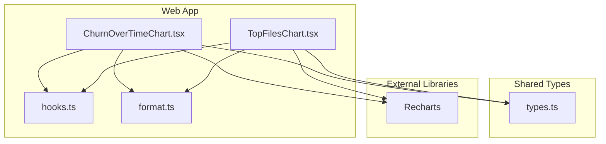
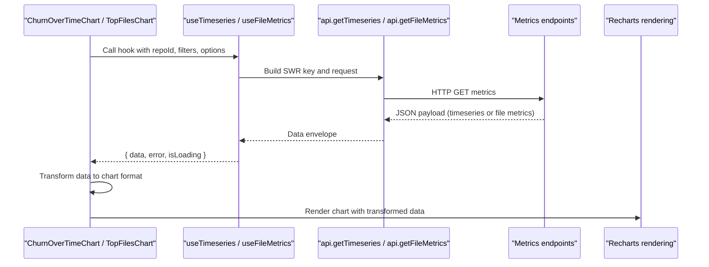
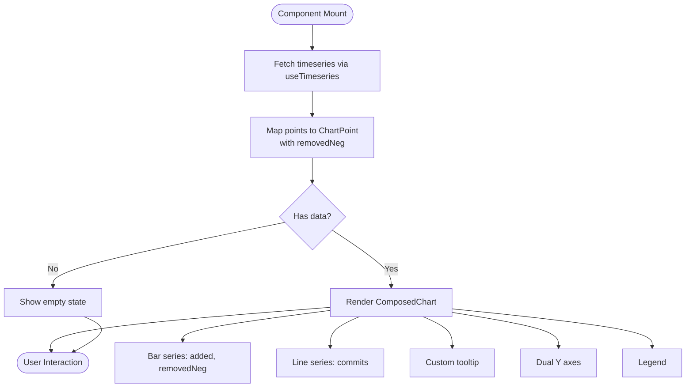
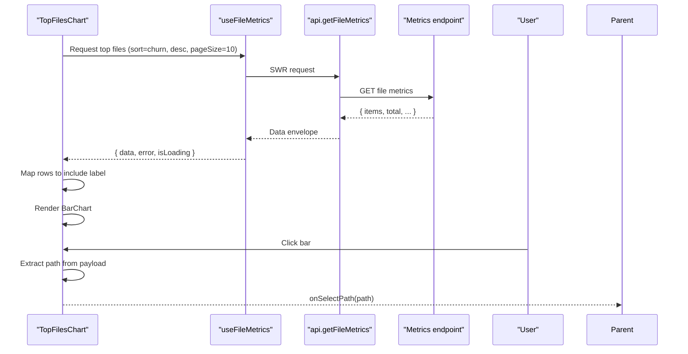
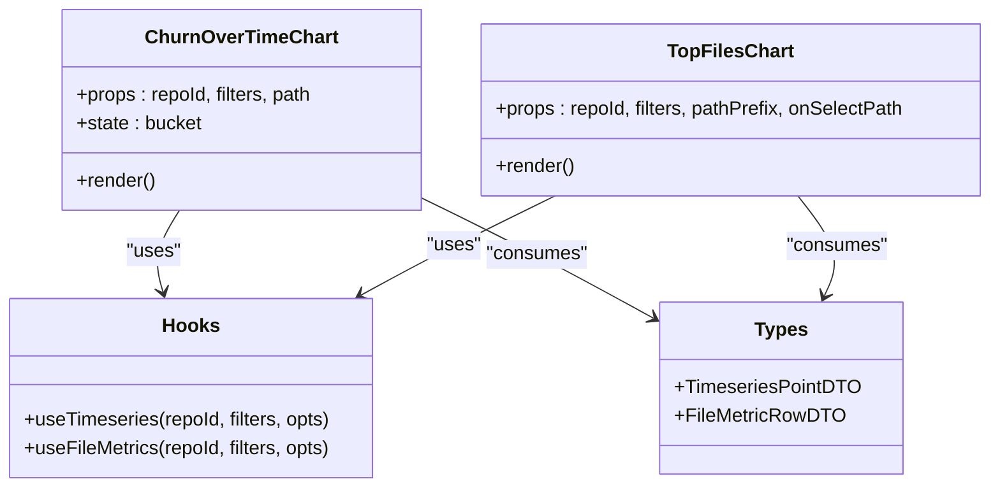

# Chart Components

<cite>
**Referenced Files in This Document**
- [ChurnOverTimeChart.tsx](file://apps/web/src/components/metrics/charts/ChurnOverTimeChart.tsx)
- [TopFilesChart.tsx](file://apps/web/src/components/metrics/charts/TopFilesChart.tsx)
- [hooks.ts](file://apps/web/src/lib/hooks.ts)
- [types.ts](file://packages/shared/src/types.ts)
- [Design.md](file://Design.md)
</cite>

## Table of Contents
1. [Introduction](#introduction)
2. [Project Structure](#project-structure)
3. [Core Components](#core-components)
4. [Architecture Overview](#architecture-overview)
5. [Detailed Component Analysis](#detailed-component-analysis)
6. [Dependency Analysis](#dependency-analysis)
7. [Performance Considerations](#performance-considerations)
8. [Troubleshooting Guide](#troubleshooting-guide)
9. [Conclusion](#conclusion)

## Introduction
This document explains the chart visualization components used to display repository churn metrics:
- ChurnOverTimeChart renders time-series churn data with interactive tooltips, bucket selection for day or week granularity, and responsive layout.
- TopFilesChart displays a ranked list of files by churn using a vertical bar chart, hover tooltips, and click-through navigation that scopes the dashboard to a selected file path.

The components are built on Recharts, consume shared metric types from the API layer, and integrate with SWR-based hooks for data fetching. They follow the project’s design tokens for colors, grid, and tooltip styling.

## Project Structure
The chart components live under the web application’s metrics feature area and depend on shared types and client-side hooks:

**Diagram sources**
- [ChurnOverTimeChart.tsx:1-19](file://apps/web/src/components/metrics/charts/ChurnOverTimeChart.tsx#L1-L19)
- [TopFilesChart.tsx:1-16](file://apps/web/src/components/metrics/charts/TopFilesChart.tsx#L1-L16)
- [hooks.ts:87-148](file://apps/web/src/lib/hooks.ts#L87-L148)
- [types.ts:172-225](file://packages/shared/src/types.ts#L172-L225)

**Section sources**
- [ChurnOverTimeChart.tsx:1-19](file://apps/web/src/components/metrics/charts/ChurnOverTimeChart.tsx#L1-L19)
- [TopFilesChart.tsx:1-16](file://apps/web/src/components/metrics/charts/TopFilesChart.tsx#L1-L16)
- [hooks.ts:87-148](file://apps/web/src/lib/hooks.ts#L87-L148)
- [types.ts:172-225](file://packages/shared/src/types.ts#L172-L225)

## Core Components
- ChurnOverTimeChart
  - Renders a composed chart with added and removed churn bars mirrored around zero and a commits line.
  - Supports day/week bucket selection via a segmented control.
  - Uses two Y axes: one for churn bars and one for commit counts.
  - Provides an interactive tooltip showing bucket, added, removed, growth, churn, and commits.
  - Handles error, loading skeleton, and empty states.

- TopFilesChart
  - Renders a vertical bar chart ranking files by churn.
  - Shows a tooltip with full path, churn, added, and removed values.
  - Clicking a bar calls onSelectPath to scope the dashboard to that file.
  - Handles error, loading skeleton, and empty states.

**Section sources**
- [ChurnOverTimeChart.tsx:27-50](file://apps/web/src/components/metrics/charts/ChurnOverTimeChart.tsx#L27-L50)
- [ChurnOverTimeChart.tsx:54-141](file://apps/web/src/components/metrics/charts/ChurnOverTimeChart.tsx#L54-L141)
- [TopFilesChart.tsx:22-41](file://apps/web/src/components/metrics/charts/TopFilesChart.tsx#L22-L41)
- [TopFilesChart.tsx:47-119](file://apps/web/src/components/metrics/charts/TopFilesChart.tsx#L47-L119)

## Architecture Overview
The charts fetch data through SWR hooks, transform it into chart-ready structures, and render with Recharts. Shared types define the shape of timeseries points and file metric rows.

**Diagram sources**
- [hooks.ts:87-148](file://apps/web/src/lib/hooks.ts#L87-L148)
- [types.ts:172-225](file://packages/shared/src/types.ts#L172-L225)
- [ChurnOverTimeChart.tsx:63-72](file://apps/web/src/components/metrics/charts/ChurnOverTimeChart.tsx#L63-L72)
- [TopFilesChart.tsx:58-69](file://apps/web/src/components/metrics/charts/TopFilesChart.tsx#L58-L69)

## Detailed Component Analysis

### ChurnOverTimeChart
Responsibilities:
- Fetches timeseries data based on repository ID, commit filters, and bucket size.
- Transforms raw points to include a negated removal series for mirrored bars.
- Renders a ComposedChart with:
  - Added churn bars (positive).
  - Removed churn bars (negative).
  - Commits count line on a secondary axis.
- Provides a segmented control for switching between day and week buckets.
- Displays custom tooltips with formatted numbers.
- Manages error, loading, and empty states.

Data transformation pipeline:
- Raw TimeseriesPointDTO is extended with removedNeg for mirroring.
- Numbers are formatted for readability in tooltips.

Configuration highlights:
- Colors: green for added, red for removed, accent blue for commits.
- Grid: dashed horizontal lines with dark stroke.
- Axes: left Y axis for churn bars; right Y axis for commits.
- Tooltip: custom component with structured content.

Responsive behavior:
- Uses ResponsiveContainer to fill available width and fixed height.

Accessibility:
- Segmented control uses role="group" and aria-pressed for state.
- Error banners use role="alert".

**Diagram sources**
- [ChurnOverTimeChart.tsx:63-72](file://apps/web/src/components/metrics/charts/ChurnOverTimeChart.tsx#L63-L72)
- [ChurnOverTimeChart.tsx:105-137](file://apps/web/src/components/metrics/charts/ChurnOverTimeChart.tsx#L105-L137)

**Section sources**
- [ChurnOverTimeChart.tsx:21-30](file://apps/web/src/components/metrics/charts/ChurnOverTimeChart.tsx#L21-L30)
- [ChurnOverTimeChart.tsx:32-50](file://apps/web/src/components/metrics/charts/ChurnOverTimeChart.tsx#L32-L50)
- [ChurnOverTimeChart.tsx:54-141](file://apps/web/src/components/metrics/charts/ChurnOverTimeChart.tsx#L54-L141)
- [hooks.ts:136-148](file://apps/web/src/lib/hooks.ts#L136-L148)
- [types.ts:211-225](file://packages/shared/src/types.ts#L211-L225)

### TopFilesChart
Responsibilities:
- Fetches top files by churn for the active commit set.
- Sorts by churn descending and limits results to a page size.
- Maps file rows to include a label derived from the basename.
- Renders a vertical BarChart with hover tooltips and clickable bars.
- Emits onSelectPath when a bar is clicked to scope the dashboard.

Data transformation pipeline:
- FileMetricRowDTO items are mapped to add a label field for display.

Configuration highlights:
- Color: accent blue for bars.
- Layout: vertical orientation with category Y axis and numeric X axis.
- Tooltip: shows full path, churn, added, and removed.

Interaction model:
- Clicking a bar triggers onSelectPath(path), enabling navigation to detailed views scoped to that file.

**Diagram sources**
- [TopFilesChart.tsx:58-69](file://apps/web/src/components/metrics/charts/TopFilesChart.tsx#L58-L69)
- [TopFilesChart.tsx:104-113](file://apps/web/src/components/metrics/charts/TopFilesChart.tsx#L104-L113)
- [hooks.ts:87-108](file://apps/web/src/lib/hooks.ts#L87-L108)
- [types.ts:172-174](file://packages/shared/src/types.ts#L172-L174)

**Section sources**
- [TopFilesChart.tsx:18-25](file://apps/web/src/components/metrics/charts/TopFilesChart.tsx#L18-L25)
- [TopFilesChart.tsx:27-41](file://apps/web/src/components/metrics/charts/TopFilesChart.tsx#L27-L41)
- [TopFilesChart.tsx:47-119](file://apps/web/src/components/metrics/charts/TopFilesChart.tsx#L47-L119)
- [hooks.ts:87-108](file://apps/web/src/lib/hooks.ts#L87-L108)
- [types.ts:172-174](file://packages/shared/src/types.ts#L172-L174)

## Dependency Analysis
Key dependencies and relationships:
- Both components depend on Recharts primitives for rendering.
- Data fetching is centralized in hooks.ts using SWR.
- Shared DTOs in types.ts define the contract for timeseries and file metrics.
- Formatting utilities are used within tooltips.

**Diagram sources**
- [ChurnOverTimeChart.tsx:54-72](file://apps/web/src/components/metrics/charts/ChurnOverTimeChart.tsx#L54-L72)
- [TopFilesChart.tsx:47-69](file://apps/web/src/components/metrics/charts/TopFilesChart.tsx#L47-L69)
- [hooks.ts:87-148](file://apps/web/src/lib/hooks.ts#L87-L148)
- [types.ts:172-225](file://packages/shared/src/types.ts#L172-L225)

**Section sources**
- [ChurnOverTimeChart.tsx:1-19](file://apps/web/src/components/metrics/charts/ChurnOverTimeChart.tsx#L1-L19)
- [TopFilesChart.tsx:1-16](file://apps/web/src/components/metrics/charts/TopFilesChart.tsx#L1-L16)
- [hooks.ts:87-148](file://apps/web/src/lib/hooks.ts#L87-L148)
- [types.ts:172-225](file://packages/shared/src/types.ts#L172-L225)

## Performance Considerations
- Data volume:
  - ChurnOverTimeChart transforms each timeseries point once to add removedNeg. For large datasets, consider memoizing the transformation if the same dataset is reused across re-renders.
  - TopFilesChart maps file rows to add a label; this is lightweight but can be memoized if the dataset is large or frequently recomputed.
- Rendering:
  - Both charts use ResponsiveContainer, which recalculates dimensions on resize. Avoid unnecessary parent re-renders to prevent chart rebuilds.
  - The TopFilesChart computes height dynamically based on row count; ensure the container does not cause layout thrashing.
- Network:
  - SWR caching and keepPreviousData reduce redundant requests. Ensure filter keys are stable to leverage cache effectively.
- Interactions:
  - Tooltips are custom components; avoid heavy computations inside them to maintain responsiveness during hover.

[No sources needed since this section provides general guidance]

## Troubleshooting Guide
Common issues and resolutions:
- No data displayed:
  - Verify filters and path parameters passed to hooks.
  - Check network responses for timeseries or file metrics endpoints.
- Errors shown:
  - Error banners indicate failures in loading timeseries or top files. Inspect the error message and upstream API status.
- Empty states:
  - Empty messages appear when there are no commits or changed files in the selected range. Adjust filters or date ranges.
- Accessibility:
  - Ensure screen readers announce error banners due to role="alert".
  - Confirm segmented control buttons have aria-pressed reflecting current bucket.

**Section sources**
- [ChurnOverTimeChart.tsx:96-103](file://apps/web/src/components/metrics/charts/ChurnOverTimeChart.tsx#L96-L103)
- [TopFilesChart.tsx:78-85](file://apps/web/src/components/metrics/charts/TopFilesChart.tsx#L78-L85)

## Conclusion
ChurnOverTimeChart and TopFilesChart provide clear, interactive visualizations of churn metrics:
- ChurnOverTimeChart supports granular time analysis with day/week buckets and dual-axis presentation.
- TopFilesChart enables quick identification of high-churn files and direct navigation to scoped views.
Both components adhere to the project’s design tokens, handle errors and loading states gracefully, and integrate cleanly with shared types and SWR-based data fetching.

[No sources needed since this section summarizes without analyzing specific files]

## Appendices

### Chart Configuration Options
- Colors:
  - Added series: success color.
  - Removed series: danger color.
  - Commits line and top-files bars: accent color.
- Grid:
  - Dashed horizontal lines with border color.
- Axes:
  - Custom tick styles and minimal axis lines.
- Tooltips:
  - Surface style consistent with dropdown surfaces, including border and shadow.

**Section sources**
- [Design.md:827-833](file://Design.md#L827-L833)