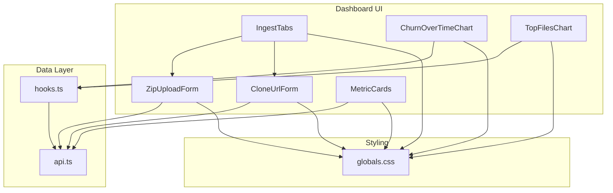
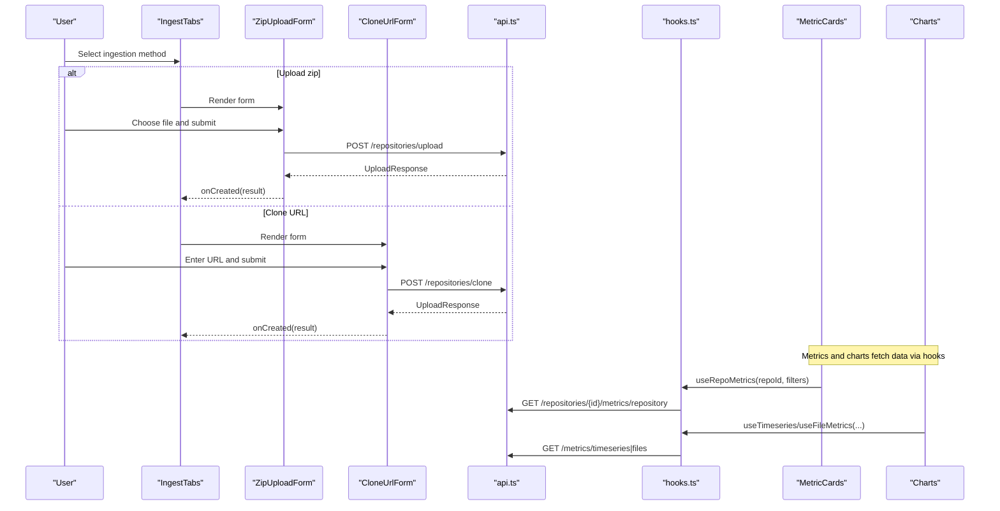
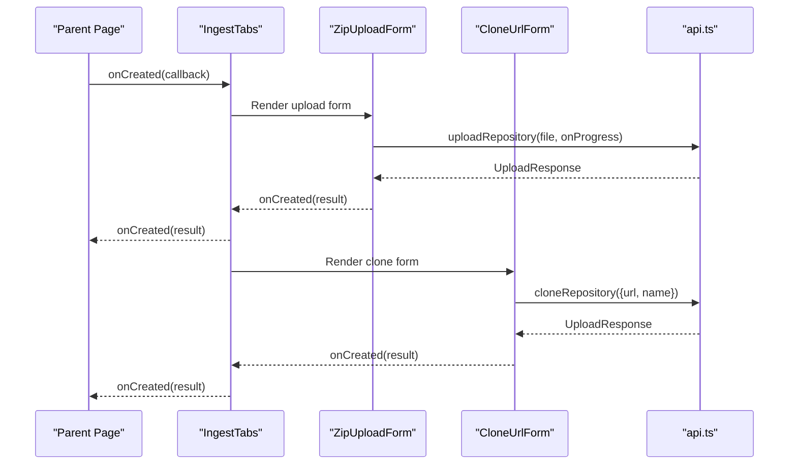
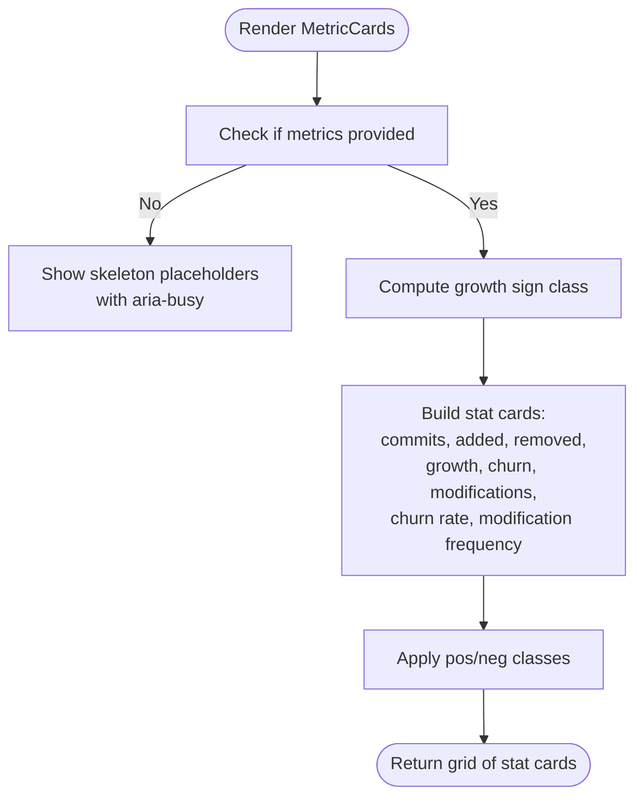
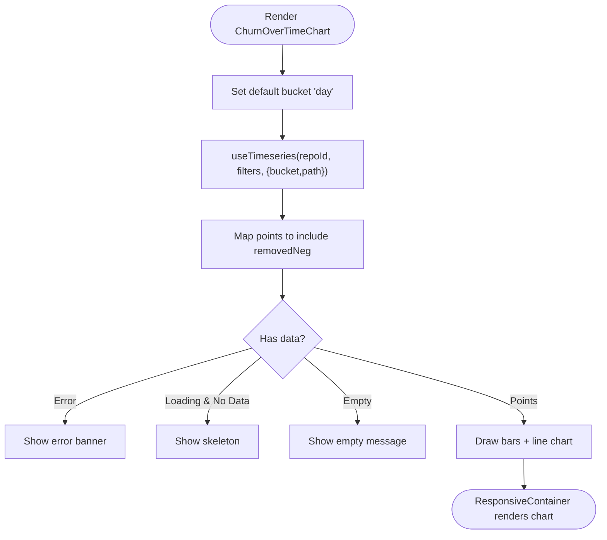
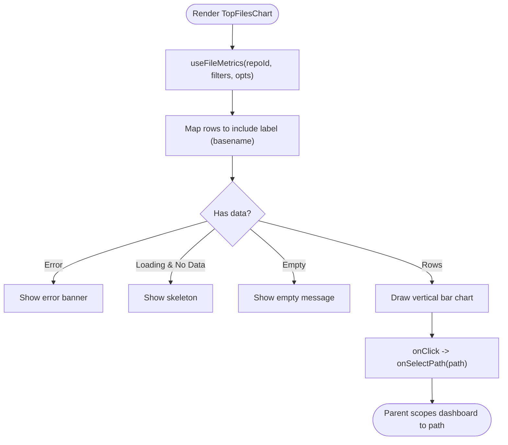
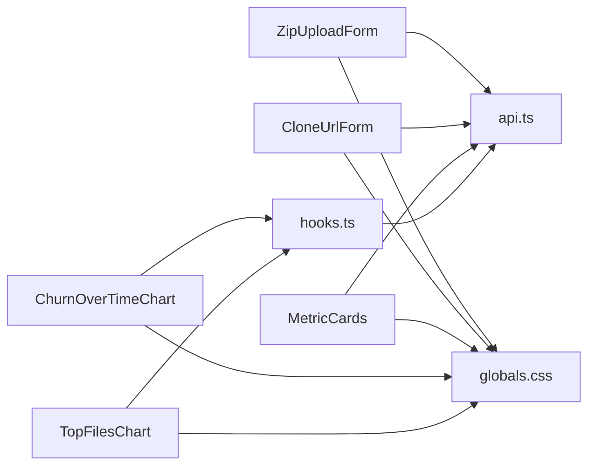

# Dashboard Components

<cite>
**Referenced Files in This Document**
- [IngestTabs.tsx](file://apps/web/src/components/ingest/IngestTabs.tsx)
- [ZipUploadForm.tsx](file://apps/web/src/components/ingest/ZipUploadForm.tsx)
- [CloneUrlForm.tsx](file://apps/web/src/components/ingest/CloneUrlForm.tsx)
- [MetricCards.tsx](file://apps/web/src/components/metrics/MetricCards.tsx)
- [ChurnOverTimeChart.tsx](file://apps/web/src/components/metrics/charts/ChurnOverTimeChart.tsx)
- [TopFilesChart.tsx](file://apps/web/src/components/metrics/charts/TopFilesChart.tsx)
- [api.ts](file://apps/web/src/lib/api.ts)
- [hooks.ts](file://apps/web/src/lib/hooks.ts)
- [globals.css](file://apps/web/src/styles/globals.css)
</cite>

## Table of Contents
1. [Introduction](#introduction)
2. [Project Structure](#project-structure)
3. [Core Components](#core-components)
4. [Architecture Overview](#architecture-overview)
5. [Detailed Component Analysis](#detailed-component-analysis)
6. [Dependency Analysis](#dependency-analysis)
7. [Performance Considerations](#performance-considerations)
8. [Troubleshooting Guide](#troubleshooting-guide)
9. [Conclusion](#conclusion)

## Introduction
This document explains the main dashboard UI components that support repository ingestion and metrics visualization:

- Ingestion tabs interface with zip upload and URL cloning workflows.
- Metric cards component displaying key performance indicators for a commit set.
- Chart components for churn over time and top files ranking.

It covers props, state management, event handling, user interaction patterns, styling customization, accessibility, responsive behavior, loading states, error presentation, and performance techniques used by these components.

## Project Structure
The dashboard components live under the web application’s `components` directory and rely on shared API helpers, SWR-based hooks, and global CSS design tokens.

**Diagram sources**
- [IngestTabs.tsx:10-48](file://apps/web/src/components/ingest/IngestTabs.tsx#L10-L48)
- [ZipUploadForm.tsx:12-87](file://apps/web/src/components/ingest/ZipUploadForm.tsx#L12-L87)
- [CloneUrlForm.tsx:10-83](file://apps/web/src/components/ingest/CloneUrlForm.tsx#L10-L83)
- [MetricCards.tsx:30-87](file://apps/web/src/components/metrics/MetricCards.tsx#L30-L87)
- [ChurnOverTimeChart.tsx:54-139](file://apps/web/src/components/metrics/charts/ChurnOverTimeChart.tsx#L54-L139)
- [TopFilesChart.tsx:47-117](file://apps/web/src/components/metrics/charts/TopFilesChart.tsx#L47-L117)
- [api.ts:122-267](file://apps/web/src/lib/api.ts#L122-L267)
- [hooks.ts:79-147](file://apps/web/src/lib/hooks.ts#L79-L147)
- [globals.css:366-773](file://apps/web/src/styles/globals.css#L366-L773)

**Section sources**
- [IngestTabs.tsx:10-48](file://apps/web/src/components/ingest/IngestTabs.tsx#L10-L48)
- [MetricCards.tsx:30-87](file://apps/web/src/components/metrics/MetricCards.tsx#L30-L87)
- [ChurnOverTimeChart.tsx:54-139](file://apps/web/src/components/metrics/charts/ChurnOverTimeChart.tsx#L54-L139)
- [TopFilesChart.tsx:47-117](file://apps/web/src/components/metrics/charts/TopFilesChart.tsx#L47-L117)
- [api.ts:122-267](file://apps/web/src/lib/api.ts#L122-L267)
- [hooks.ts:79-147](file://apps/web/src/lib/hooks.ts#L79-L147)
- [globals.css:366-773](file://apps/web/src/styles/globals.css#L366-L773)

## Core Components
This section summarizes each dashboard component’s purpose, props, state, events, and UX characteristics.

### Ingestion Tabs Interface
- Purpose: Provides two ingestion methods — uploading a zip archive or cloning a remote repository via URL.
- Props:
  - `onCreated(result)`: Callback invoked when a repository ingestion job is created; receives an upload response containing repository and job metadata.
- State:
  - Active tab selection (`upload` or `clone`).
- Events:
  - Tab switching updates local state and renders the selected form.
- Accessibility:
  - Uses `role="tablist"` and `role="tab"` with `aria-selected` to communicate tab semantics.
- Styling:
  - Uses card layout, panel header, and segmented control classes from global styles.

**Section sources**
- [IngestTabs.tsx:10-48](file://apps/web/src/components/ingest/IngestTabs.tsx#L10-L48)
- [globals.css:478-546](file://apps/web/src/styles/globals.css#L478-L546)

### Zip Upload Form
- Purpose: Accepts a `.zip` archive containing Git history and uploads it with progress feedback.
- Props:
  - `onCreated(result)`: Invoked after successful upload and analysis start.
- State:
  - Selected file, uploading flag, progress percentage, error message.
- Events:
  - File input change updates selected file and clears errors.
  - Submit triggers multipart upload using XHR to report progress.
- Error handling:
  - Displays structured API errors through a banner component.
- Loading states:
  - Progress bar reflects upload fraction; button disabled while uploading.
- Accessibility:
  - Label associated with input via `htmlFor`; descriptive hint text.

**Section sources**
- [ZipUploadForm.tsx:12-87](file://apps/web/src/components/ingest/ZipUploadForm.tsx#L12-L87)
- [api.ts:147-189](file://apps/web/src/lib/api.ts#L147-L189)
- [globals.css:415-476](file://apps/web/src/styles/globals.css#L415-L476)

### Clone URL Form
- Purpose: Mirrors a remote repository server-side and starts analysis.
- Props:
  - `onCreated(result)`: Invoked after successful clone request.
- State:
  - URL, optional display name, busy flag, error message.
- Validation:
  - Regex validates supported URL schemes before submission.
- Events:
  - Submit calls the clone endpoint with URL and optional name.
- Error handling:
  - Shows validation or API errors via banner.
- Accessibility:
  - Labels linked to inputs; hints explain expected mirror behavior.

**Section sources**
- [CloneUrlForm.tsx:10-83](file://apps/web/src/components/ingest/CloneUrlForm.tsx#L10-L83)
- [api.ts:139-145](file://apps/web/src/lib/api.ts#L139-L145)
- [globals.css:415-476](file://apps/web/src/styles/globals.css#L415-L476)

### Metric Cards
- Purpose: Displays key performance indicators for the current commit set, including counts, growth, churn, modifications, churn rate, and modification frequency.
- Props:
  - `metrics`: Repository metrics DTO or undefined during loading.
- State:
  - Derived values (e.g., growth sign class) computed from metrics.
- Loading states:
  - Skeleton placeholders shown when metrics are not yet available.
- Accessibility:
  - Uses `aria-busy="true"` while loading.
- Styling:
  - Grid layout with stat cards; positive/negative value coloring.

**Section sources**
- [MetricCards.tsx:30-87](file://apps/web/src/components/metrics/MetricCards.tsx#L30-L87)
- [globals.css:706-750](file://apps/web/src/styles/globals.css#L706-L750)

### Churn Over Time Chart
- Purpose: Visualizes added/removed lines and commit count over time, with day or week bucketing.
- Props:
  - `repoId`, `filters`, `path`.
- State:
  - Bucket selection (`day` or `week`).
- Data fetching:
  - Uses SWR hook to fetch timeseries data; keeps previous data during transitions.
- Interactions:
  - Segmented control switches bucket granularity.
- Error and empty states:
  - Error banner for failures; skeleton for loading; empty message when no commits.
- Accessibility:
  - Grouped controls with `role="group"` and `aria-pressed`.

**Section sources**
- [ChurnOverTimeChart.tsx:54-139](file://apps/web/src/components/metrics/charts/ChurnOverTimeChart.tsx#L54-L139)
- [hooks.ts:136-147](file://apps/web/src/lib/hooks.ts#L136-L147)
- [globals.css:514-546](file://apps/web/src/styles/globals.css#L514-L546)

### Top Files Chart
- Purpose: Ranks files by churn and allows scoping the dashboard to a specific file path.
- Props:
  - `repoId`, `filters`, optional `pathPrefix`, and `onSelectPath(path)` callback.
- Data fetching:
  - Uses SWR hook to fetch paginated file metrics sorted by churn.
- Interactions:
  - Clicking a bar invokes `onSelectPath` with the selected file path.
- Error and empty states:
  - Error banner for failures; skeleton for loading; empty message when no files changed.
- Accessibility:
  - Tooltip provides detailed metrics per bar.

**Section sources**
- [TopFilesChart.tsx:47-117](file://apps/web/src/components/metrics/charts/TopFilesChart.tsx#L47-L117)
- [hooks.ts:87-108](file://apps/web/src/lib/hooks.ts#L87-L108)

## Architecture Overview
The dashboard follows a layered architecture:

- UI layer: React components render ingestion forms, metric cards, and charts.
- Data layer: SWR hooks wrap API calls, providing caching, polling, and stable keys.
- API layer: Centralized client functions build requests, handle errors, and expose typed endpoints.
- Styling layer: Global CSS defines design tokens, layout primitives, and component styles.

**Diagram sources**
- [IngestTabs.tsx:10-48](file://apps/web/src/components/ingest/IngestTabs.tsx#L10-L48)
- [ZipUploadForm.tsx:12-87](file://apps/web/src/components/ingest/ZipUploadForm.tsx#L12-L87)
- [CloneUrlForm.tsx:10-83](file://apps/web/src/components/ingest/CloneUrlForm.tsx#L10-L83)
- [api.ts:139-189](file://apps/web/src/lib/api.ts#L139-L189)
- [hooks.ts:79-147](file://apps/web/src/lib/hooks.ts#L79-L147)

## Detailed Component Analysis

### Ingestion Workflow Sequence
This sequence shows how ingestion results propagate from the UI to parent consumers.

**Diagram sources**
- [IngestTabs.tsx:10-48](file://apps/web/src/components/ingest/IngestTabs.tsx#L10-L48)
- [ZipUploadForm.tsx:12-87](file://apps/web/src/components/ingest/ZipUploadForm.tsx#L12-L87)
- [CloneUrlForm.tsx:10-83](file://apps/web/src/components/ingest/CloneUrlForm.tsx#L10-L83)
- [api.ts:139-189](file://apps/web/src/lib/api.ts#L139-L189)

### Metric Cards Rendering Flow

**Diagram sources**
- [MetricCards.tsx:30-87](file://apps/web/src/components/metrics/MetricCards.tsx#L30-L87)

### Churn Over Time Chart Data Flow

**Diagram sources**
- [ChurnOverTimeChart.tsx:54-139](file://apps/web/src/components/metrics/charts/ChurnOverTimeChart.tsx#L54-L139)
- [hooks.ts:136-147](file://apps/web/src/lib/hooks.ts#L136-L147)

### Top Files Chart Interaction Flow

**Diagram sources**
- [TopFilesChart.tsx:47-117](file://apps/web/src/components/metrics/charts/TopFilesChart.tsx#L47-L117)
- [hooks.ts:87-108](file://apps/web/src/lib/hooks.ts#L87-L108)

## Dependency Analysis
Components depend on shared utilities and data layers:

- Ingestion forms depend on `api.ts` for HTTP operations and error types.
- Charts depend on `hooks.ts` for SWR-based data fetching and caching.
- All components rely on `globals.css` for consistent design tokens and layout primitives.

**Diagram sources**
- [ZipUploadForm.tsx:12-87](file://apps/web/src/components/ingest/ZipUploadForm.tsx#L12-L87)
- [CloneUrlForm.tsx:10-83](file://apps/web/src/components/ingest/CloneUrlForm.tsx#L10-L83)
- [MetricCards.tsx:30-87](file://apps/web/src/components/metrics/MetricCards.tsx#L30-L87)
- [ChurnOverTimeChart.tsx:54-139](file://apps/web/src/components/metrics/charts/ChurnOverTimeChart.tsx#L54-L139)
- [TopFilesChart.tsx:47-117](file://apps/web/src/components/metrics/charts/TopFilesChart.tsx#L47-L117)
- [api.ts:122-267](file://apps/web/src/lib/api.ts#L122-L267)
- [hooks.ts:79-147](file://apps/web/src/lib/hooks.ts#L79-L147)
- [globals.css:366-773](file://apps/web/src/styles/globals.css#L366-L773)

**Section sources**
- [api.ts:122-267](file://apps/web/src/lib/api.ts#L122-L267)
- [hooks.ts:79-147](file://apps/web/src/lib/hooks.ts#L79-L147)
- [globals.css:366-773](file://apps/web/src/styles/globals.css#L366-L773)

## Performance Considerations
- Caching and stability:
  - SWR hooks provide caching and stable keys based on filters and options, reducing redundant network requests.
- Real-time updates:
  - Live refresh intervals are applied to repositories and jobs while they are queued or processing, ensuring near-real-time status without excessive polling.
- Previous data retention:
  - Metrics hooks use `keepPreviousData` to avoid flicker during filter changes.
- Efficient rendering:
  - Charts compute derived fields locally (e.g., negated removals) to minimize re-renders.
- Responsive containers:
  - Charts use responsive containers to adapt to container sizes efficiently.

[No sources needed since this section provides general guidance]

## Troubleshooting Guide
Common issues and resolutions:

- Network connectivity:
  - If the API base URL is unreachable, the client throws a structured network error. Ensure the backend service is running and accessible at the configured URL.
- Upload failures:
  - Multipart upload errors surface as structured API errors; verify file format (must contain `.git`) and server availability.
- Clone validation:
  - Invalid URLs fail client-side validation; ensure the URL uses supported schemes (`http(s)://`, `git://`, `ssh://`, or `git@...`).
- Empty datasets:
  - Charts show empty messages when no commits or files match the current filters; adjust filters or scope.
- Loading states:
  - Skeleton placeholders indicate pending data; check network requests and SWR cache keys.

**Section sources**
- [api.ts:22-41](file://apps/web/src/lib/api.ts#L22-L41)
- [api.ts:147-189](file://apps/web/src/lib/api.ts#L147-L189)
- [CloneUrlForm.tsx:16-37](file://apps/web/src/components/ingest/CloneUrlForm.tsx#L16-L37)
- [ChurnOverTimeChart.tsx:96-103](file://apps/web/src/components/metrics/charts/ChurnOverTimeChart.tsx#L96-L103)
- [TopFilesChart.tsx:78-85](file://apps/web/src/components/metrics/charts/TopFilesChart.tsx#L78-L85)

## Conclusion
The dashboard components provide a cohesive ingestion experience and robust metrics visualization:

- Ingestion tabs unify zip upload and URL cloning with clear user flows and error handling.
- Metric cards present essential KPIs with loading skeletons and semantic accessibility.
- Charts offer interactive, responsive visualizations with real-time data updates and meaningful tooltips.
- Shared API and hooks modules centralize data access, caching, and error handling.
- Global CSS ensures consistent styling, accessibility, and responsive behavior across components.

[No sources needed since this section summarizes without analyzing specific files]