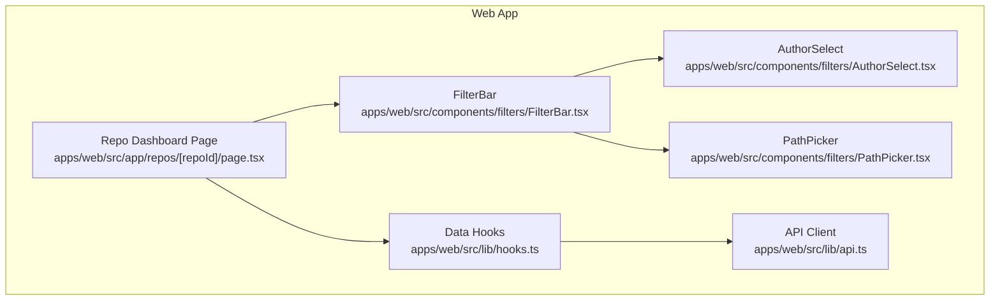
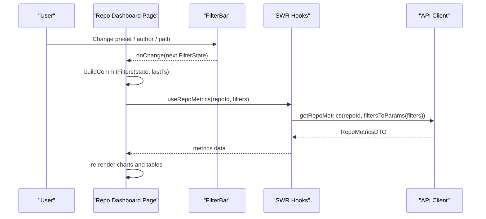
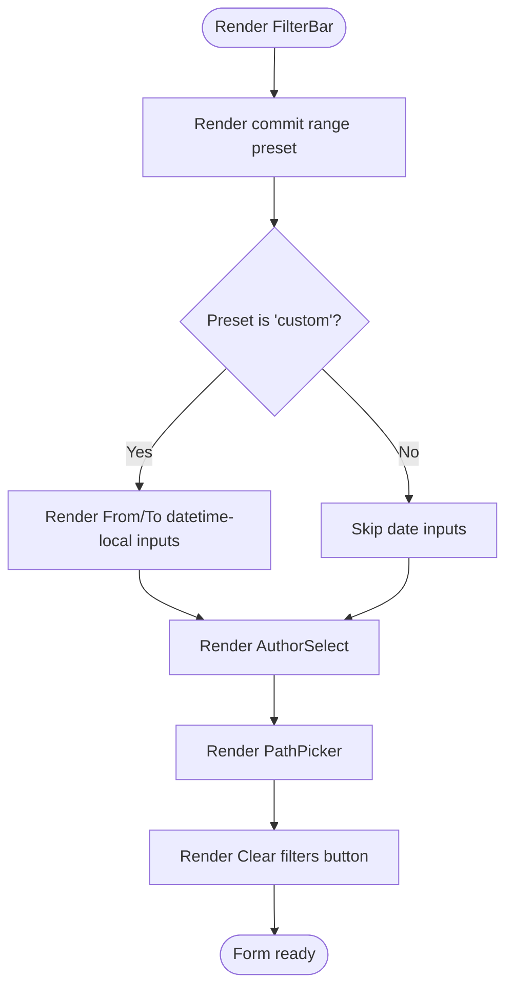
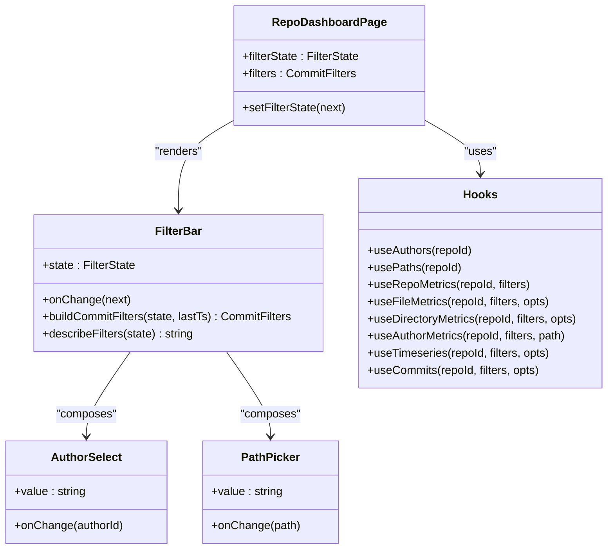
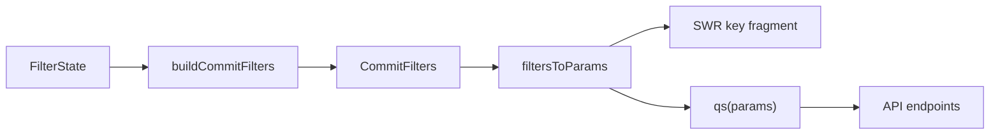

# Filter & Search Components

<cite>
**Referenced Files in This Document**   
- [FilterBar.tsx](file://apps/web/src/components/filters/FilterBar.tsx)
- [AuthorSelect.tsx](file://apps/web/src/components/filters/AuthorSelect.tsx)
- [PathPicker.tsx](file://apps/web/src/components/filters/PathPicker.tsx)
- [page.tsx](file://apps/web/src/app/repos/[repoId]/page.tsx)
- [hooks.ts](file://apps/web/src/lib/hooks.ts)
- [api.ts](file://apps/web/src/lib/api.ts)
</cite>

## Table of Contents
1. [Introduction](#introduction)
2. [Project Structure](#project-structure)
3. [Core Components](#core-components)
4. [Architecture Overview](#architecture-overview)
5. [Detailed Component Analysis](#detailed-component-analysis)
6. [Dependency Analysis](#dependency-analysis)
7. [Performance Considerations](#performance-considerations)
8. [Troubleshooting Guide](#troubleshooting-guide)
9. [Conclusion](#conclusion)

## Introduction
This document explains the filter and search UI components that power repository metrics exploration:
- FilterBar: a unified form for commit range presets, custom datetime ranges, author selection, and path scoping. It compiles UI state into API filters and exposes a human-readable summary.
- AuthorSelect: an author dropdown driven by resolved authors data.
- PathPicker: a directory and file scope selector used to narrow metrics by subtree or single file.

The components integrate with SWR-based hooks to fetch metadata (authors, paths) and metrics (repository, files, directories, authors, timeseries, commits). The page owns filter state, builds API filters using baseline timestamps, and passes derived filters into data hooks so results update reactively when users change filters.

## Project Structure
The relevant frontend code is organized under the web application:
- Filter components live under `apps/web/src/components/filters`.
- Data fetching hooks live under `apps/web/src/lib/hooks.ts`.
- API client and shared filter types live under `apps/web/src/lib/api.ts`.
- The repository dashboard page composes these pieces under `apps/web/src/app/repos/[repoId]/page.tsx`.

**Diagram sources**
- [page.tsx:35-205](file://apps/web/src/app/repos/[repoId]/page.tsx#L35-L205)
- [FilterBar.tsx:74-165](file://apps/web/src/components/filters/FilterBar.tsx#L74-L165)
- [AuthorSelect.tsx:5-35](file://apps/web/src/components/filters/AuthorSelect.tsx#L5-L35)
- [PathPicker.tsx:5-52](file://apps/web/src/components/filters/PathPicker.tsx#L5-L52)
- [hooks.ts:67-162](file://apps/web/src/lib/hooks.ts#L67-L162)
- [api.ts:89-103](file://apps/web/src/lib/api.ts#L89-L103)

**Section sources**
- [page.tsx:35-205](file://apps/web/src/app/repos/[repoId]/page.tsx#L35-L205)
- [FilterBar.tsx:1-166](file://apps/web/src/components/filters/FilterBar.tsx#L1-L166)
- [AuthorSelect.tsx:1-36](file://apps/web/src/components/filters/AuthorSelect.tsx#L1-L36)
- [PathPicker.tsx:1-53](file://apps/web/src/components/filters/PathPicker.tsx#L1-L53)
- [hooks.ts:1-163](file://apps/web/src/lib/hooks.ts#L1-L163)
- [api.ts:1-269](file://apps/web/src/lib/api.ts#L1-L269)

## Core Components
- FilterBar provides:
  - Commit range presets: all time, last 7/30/90 days, or custom UTC datetime range.
  - Author selection via AuthorSelect.
  - Path scoping via PathPicker.
  - A Clear filters button that resets to empty defaults.
  - A helper to build API CommitFilters from UI state using the repository’s latest timestamp.
  - A human-readable filter description string.

- AuthorSelect renders a select element populated from AuthorsResponse, allowing “All authors” or a specific author id.

- PathPicker renders a select element with optgroups for directories and files from PathsResponse, enabling subtree or single-file scoping.

Key responsibilities and contracts:
- FilterState represents UI filter state including preset, custom dates, authorId, and path.
- buildCommitFilters(state, lastTs) converts FilterState into CommitFilters consumed by API hooks.
- describeFilters(state) returns a user-facing summary string.

**Section sources**
- [FilterBar.tsx:11-72](file://apps/web/src/components/filters/FilterBar.tsx#L11-L72)
- [FilterBar.tsx:74-165](file://apps/web/src/components/filters/FilterBar.tsx#L74-L165)
- [AuthorSelect.tsx:5-35](file://apps/web/src/components/filters/AuthorSelect.tsx#L5-L35)
- [PathPicker.tsx:5-52](file://apps/web/src/components/filters/PathPicker.tsx#L5-L52)

## Architecture Overview
The dashboard page owns filter state and composes the FilterBar. When the user changes any filter, the page updates local state, recomputes CommitFilters using the baseline repository’s latest timestamp, and passes those filters into multiple SWR hooks. SWR keys include stable representations of filters, ensuring cache isolation per filter combination.

**Diagram sources**
- [page.tsx:35-47](file://apps/web/src/app/repos/[repoId]/page.tsx#L35-L47)
- [FilterBar.tsx:38-57](file://apps/web/src/components/filters/FilterBar.tsx#L38-L57)
- [hooks.ts:79-85](file://apps/web/src/lib/hooks.ts#L79-L85)
- [api.ts:220-224](file://apps/web/src/lib/api.ts#L220-L224)

## Detailed Component Analysis

### FilterBar
FilterBar is the central control surface for filtering repository metrics. It renders:
- A preset selector for commit range.
- Optional custom datetime inputs for precise UTC ranges.
- An embedded AuthorSelect and PathPicker.
- A Clear filters button that resets to EMPTY_FILTERS.

It also exports:
- buildCommitFilters: transforms FilterState into CommitFilters. Relative presets anchor to the repository’s newest commit timestamp (lastTs), while custom ranges convert datetime-local values to epoch seconds. The API expects an exclusive upper bound, so the “to” value is adjusted accordingly.
- describeFilters: produces a concise human-readable summary string shown on the page.

**Diagram sources**
- [FilterBar.tsx:74-165](file://apps/web/src/components/filters/FilterBar.tsx#L74-L165)

Filter composition logic:
- If authorId is set, it is included in CommitFilters.
- For relative presets (last7/30/90), fromTs is computed as lastTs minus the span in seconds; toTs is set to lastTs + 1 to make the range inclusive at the endpoint.
- For custom ranges, both fromTs and toTs are derived from datetime-local inputs after conversion to epoch seconds.

Reset behavior:
- The Clear filters button sets state to EMPTY_FILTERS, which clears preset, dates, authorId, and path.

Integration with data fetching:
- The page calls buildCommitFilters with the current FilterState and the baseline repository’s lastTs, then passes the resulting CommitFilters to SWR hooks.

Accessibility:
- The form has an aria-label and labeled inputs with htmlFor attributes.

Keyboard navigation:
- Standard HTML controls provide native keyboard support (Tab navigation, Enter/Space activation). No custom key handlers are present.

URL state synchronization:
- There is no URL synchronization in the current implementation. Filter state is held in component state only.

Persistence:
- There is no persistence mechanism (e.g., localStorage or URL query parameters) implemented.

Debounced search:
- There is no debouncing in the current implementation. Changes to filters immediately update state and trigger downstream hook recomputation.

**Section sources**
- [FilterBar.tsx:11-72](file://apps/web/src/components/filters/FilterBar.tsx#L11-L72)
- [FilterBar.tsx:74-165](file://apps/web/src/components/filters/FilterBar.tsx#L74-L165)

### AuthorSelect
AuthorSelect renders a simple select element:
- Options include “All authors” and each author from AuthorsResponse.
- The selected value is authorId, passed up to the parent via onChange.

Current capabilities:
- Single-select author filtering.
- No autocomplete or multi-select.
- No recent selections list.

Future enhancements could add:
- Autocomplete input with fuzzy matching against author names and emails.
- Multi-select array of author ids.
- Recent selections stored locally or in session storage.

**Section sources**
- [AuthorSelect.tsx:5-35](file://apps/web/src/components/filters/AuthorSelect.tsx#L5-L35)

### PathPicker
PathPicker renders a select element with optgroups:
- Directories group lists available directories from PathsResponse.
- Files group lists available files from PathsResponse.
- The selected value is a path string used as a prefix for file-level metrics and as a scope for other views.

Current capabilities:
- Directory and file selection via dropdown.
- No tree navigation widget.
- No fuzzy search.

Future enhancements could add:
- Tree navigation with expand/collapse.
- Fuzzy search input to quickly locate paths.
- Breadcrumb navigation and keyboard shortcuts.

**Section sources**
- [PathPicker.tsx:5-52](file://apps/web/src/components/filters/PathPicker.tsx#L5-L52)

### Page Integration and Filter Composition
The repository dashboard page:
- Holds filterState in local state initialized to EMPTY_FILTERS.
- Fetches authors and paths metadata via hooks.
- Computes baseline metrics using an empty filter set to obtain lastTs.
- Builds CommitFilters using buildCommitFilters and passes them to multiple hooks:
  - useRepoMetrics
  - useFileMetrics
  - useDirectoryMetrics
  - useAuthorMetrics
  - useTimeseries
  - useCommits

The page also derives a filePrefix based on whether the selected path is a directory or file, ensuring correct subtree scoping for file metrics.

**Diagram sources**
- [page.tsx:35-47](file://apps/web/src/app/repos/[repoId]/page.tsx#L35-L47)
- [FilterBar.tsx:11-72](file://apps/web/src/components/filters/FilterBar.tsx#L11-L72)
- [hooks.ts:67-162](file://apps/web/src/lib/hooks.ts#L67-L162)

**Section sources**
- [page.tsx:35-54](file://apps/web/src/app/repos/[repoId]/page.tsx#L35-L54)
- [page.tsx:154-199](file://apps/web/src/app/repos/[repoId]/page.tsx#L154-L199)
- [hooks.ts:79-162](file://apps/web/src/lib/hooks.ts#L79-L162)

## Dependency Analysis
Filter composition and data fetching flow:
- FilterState is converted to CommitFilters by buildCommitFilters.
- CommitFilters are serialized to query parameters via filtersToParams.
- SWR hooks generate stable keys using JSON.stringify(filtersToParams(filters)), ensuring cache separation per filter combination.
- API methods append query strings using qs and filtersToParams.

**Diagram sources**
- [FilterBar.tsx:38-57](file://apps/web/src/components/filters/FilterBar.tsx#L38-L57)
- [api.ts:96-103](file://apps/web/src/lib/api.ts#L96-L103)
- [hooks.ts:30-33](file://apps/web/src/lib/hooks.ts#L30-L33)

Coupling and cohesion:
- FilterBar depends on AuthorSelect and PathPicker for scoped selection.
- The page depends on FilterBar for UI and on hooks for data.
- Hooks depend on api for network requests.
- api defines shared types like CommitFilters and utilities like filtersToParams and qs.

Potential circular dependencies:
- None observed among the analyzed modules.

External integration points:
- Next.js app router page structure.
- SWR for caching and background refetching.
- Shared TypeScript types from @rat/shared.

**Section sources**
- [api.ts:71-103](file://apps/web/src/lib/api.ts#L71-L103)
- [hooks.ts:30-33](file://apps/web/src/lib/hooks.ts#L30-L33)

## Performance Considerations
- SWR caching: Each hook uses a stable key derived from filtersToParams, preventing unnecessary refetches when filters do not change.
- keepPreviousData: Many hooks enable keepPreviousData to avoid flicker during filter transitions.
- Live refresh: Some hooks implement conditional polling for active jobs or repositories, but filter-driven metric hooks do not poll continuously.
- Debouncing: Not implemented. Immediate state updates cause immediate hook recomputation. For large datasets, consider debouncing rapid input changes (e.g., custom date edits or future autocomplete typing).
- Selective rendering: The page computes filePrefix to limit file metrics to a subtree when a directory is selected, reducing payload size.

Recommendations:
- Add debounced search for future autocomplete features in AuthorSelect and PathPicker.
- Consider URL synchronization to allow deep linking and browser history navigation.
- Persist filter state to localStorage if desired for session continuity.

[No sources needed since this section provides general guidance]

## Troubleshooting Guide
Common issues and resolutions:
- Empty or stale metrics after changing filters:
  - Ensure the page passes filters built from buildCommitFilters to hooks.
  - Verify baseline.lastTs is available for relative presets; otherwise, relative ranges will not compute correctly.
- Incorrect date ranges:
  - Confirm customFrom/customTo are valid datetime-local values and that buildCommitFilters adjusts the exclusive upper bound appropriately.
- Author or path options missing:
  - Check that useAuthors and usePaths have loaded data before rendering AuthorSelect and PathPicker.
- Network errors:
  - The API client throws ApiError with structured codes/messages. Display these via ErrorBanner or similar UI.

Relevant error handling:
- ApiError wraps HTTP and network failures with code and message fields.
- The page handles REPO_NOT_FOUND specifically and shows a friendly message.

**Section sources**
- [api.ts:22-41](file://apps/web/src/lib/api.ts#L22-L41)
- [page.tsx:62-77](file://apps/web/src/app/repos/[repoId]/page.tsx#L62-L77)

## Conclusion
The FilterBar, AuthorSelect, and PathPicker components provide a cohesive filtering experience for repository metrics. FilterBar compiles UI state into API filters, integrates with SWR hooks for reactive data updates, and offers reset functionality. While the current implementation does not include URL synchronization, persistence, debounced search, autocomplete, multi-select, or tree navigation, the architecture cleanly separates UI state, filter composition, and data fetching, making these enhancements straightforward to add.

[No sources needed since this section summarizes without analyzing specific files]