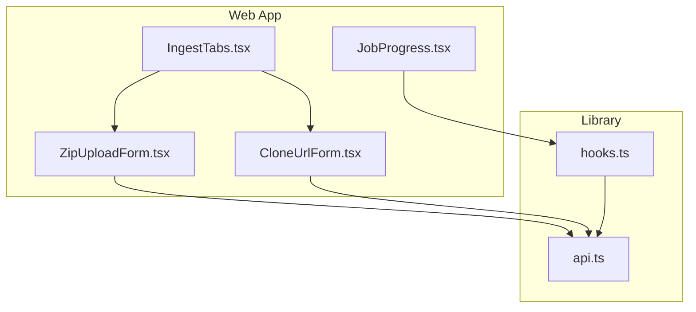
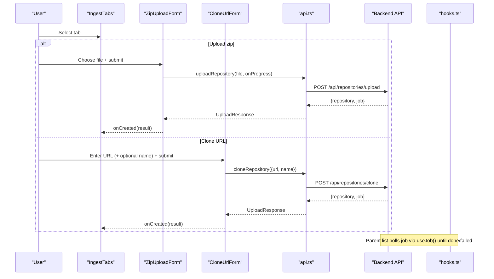
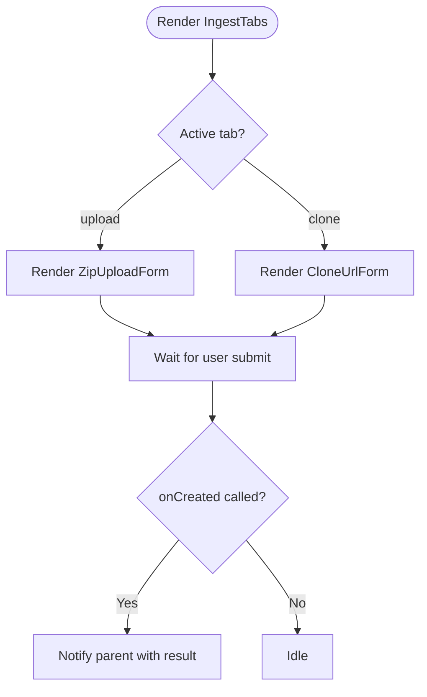
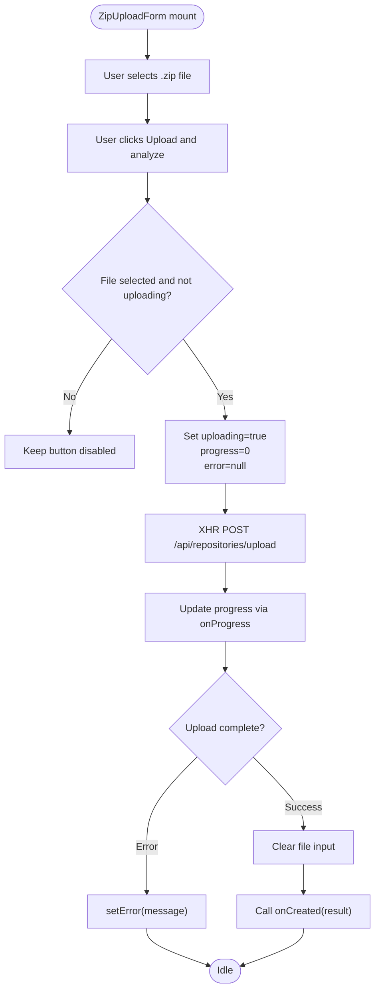
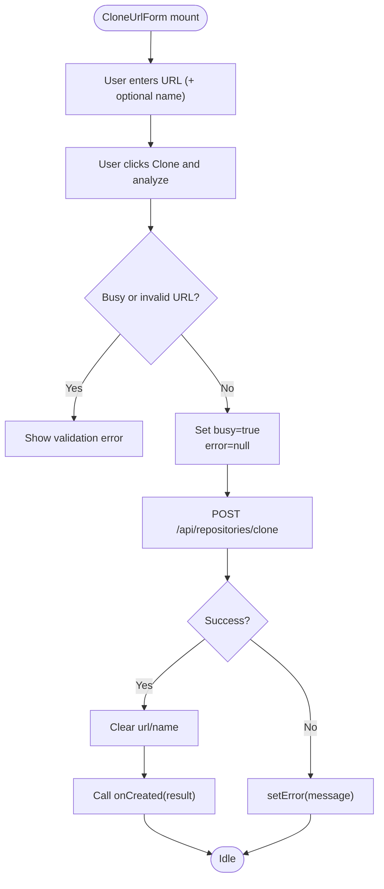
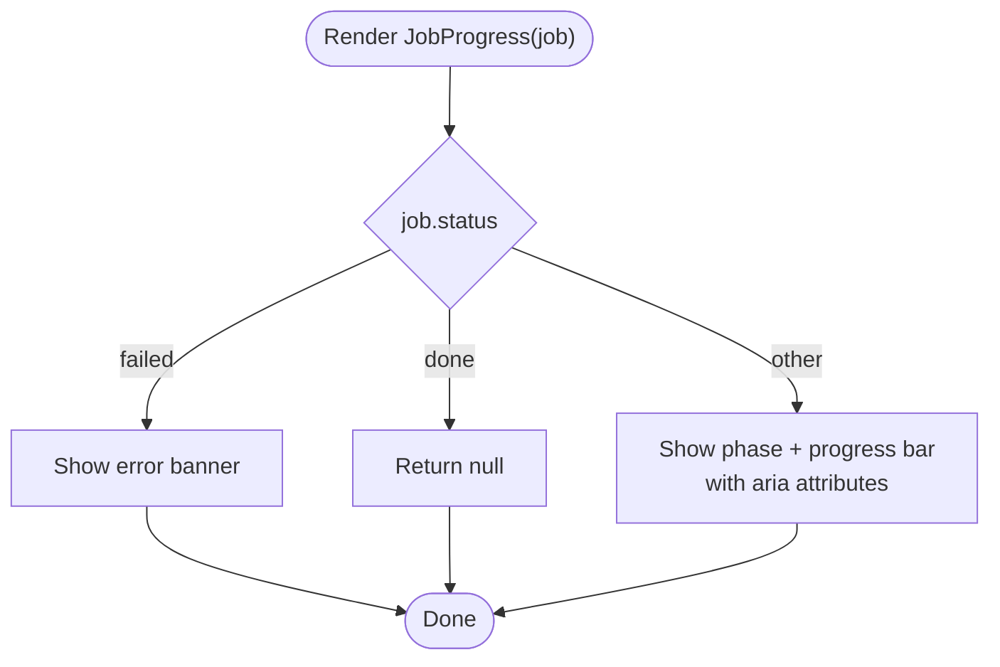
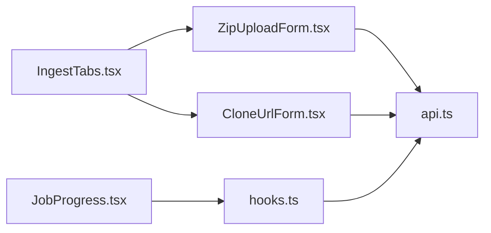

# Ingestion Components

<cite>
**Referenced Files in This Document**
- [IngestTabs.tsx](file://apps/web/src/components/ingest/IngestTabs.tsx)
- [ZipUploadForm.tsx](file://apps/web/src/components/ingest/ZipUploadForm.tsx)
- [CloneUrlForm.tsx](file://apps/web/src/components/ingest/CloneUrlForm.tsx)
- [JobProgress.tsx](file://apps/web/src/components/ingest/JobProgress.tsx)
- [api.ts](file://apps/web/src/lib/api.ts)
- [hooks.ts](file://apps/web/src/lib/hooks.ts)
</cite>

## Table of Contents
1. [Introduction](#introduction)
2. [Project Structure](#project-structure)
3. [Core Components](#core-components)
4. [Architecture Overview](#architecture-overview)
5. [Detailed Component Analysis](#detailed-component-analysis)
6. [Dependency Analysis](#dependency-analysis)
7. [Performance Considerations](#performance-considerations)
8. [Troubleshooting Guide](#troubleshooting-guide)
9. [Conclusion](#conclusion)

## Introduction
This document explains the repository ingestion UI components that enable users to add repositories either by uploading a zip archive or by cloning a remote URL. It covers:
- The tabbed ingestion panel
- Zip upload with progress tracking and validation
- Remote repository cloning with input validation
- Real-time job status display
- Props, state management, error handling, accessibility, loading states, and backend integration

## Project Structure
The ingestion UI lives under the web application’s component tree and integrates with a shared API client and polling hooks.

**Diagram sources**
- [IngestTabs.tsx:10-48](file://apps/web/src/components/ingest/IngestTabs.tsx#L10-L48)
- [ZipUploadForm.tsx:12-35](file://apps/web/src/components/ingest/ZipUploadForm.tsx#L12-L35)
- [CloneUrlForm.tsx:10-38](file://apps/web/src/components/ingest/CloneUrlForm.tsx#L10-L38)
- [JobProgress.tsx:10-43](file://apps/web/src/components/ingest/JobProgress.tsx#L10-L43)
- [api.ts:122-189](file://apps/web/src/lib/api.ts#L122-L189)
- [hooks.ts:39-61](file://apps/web/src/lib/hooks.ts#L39-L61)

**Section sources**
- [IngestTabs.tsx:10-48](file://apps/web/src/components/ingest/IngestTabs.tsx#L10-L48)
- [ZipUploadForm.tsx:12-35](file://apps/web/src/components/ingest/ZipUploadForm.tsx#L12-L35)
- [CloneUrlForm.tsx:10-38](file://apps/web/src/components/ingest/CloneUrlForm.tsx#L10-L38)
- [JobProgress.tsx:10-43](file://apps/web/src/components/ingest/JobProgress.tsx#L10-L43)
- [api.ts:122-189](file://apps/web/src/lib/api.ts#L122-L189)
- [hooks.ts:39-61](file://apps/web/src/lib/hooks.ts#L39-L61)

## Core Components
- IngestTabs: Provides a segmented control for switching between “Upload zip” and “Clone URL”. Renders one of two child forms based on the active tab and forwards an `onCreated` callback to the parent.
- ZipUploadForm: Handles file selection, basic validation (a file must be selected), and multipart upload with live progress. On success, it clears inputs and invokes `onCreated`.
- CloneUrlForm: Validates a remote repository URL using a regular expression, optionally accepts a display name, and calls the clone endpoint. On success, it resets fields and invokes `onCreated`.
- JobProgress: A presentational component that renders a progress bar and status text for a given job, including failure banners. It is driven entirely by props.

Key responsibilities:
- User interaction flows for ingestion
- Local form state and validation
- Progress feedback during uploads and jobs
- Error presentation via banners
- Integration with the backend through the API client

**Section sources**
- [IngestTabs.tsx:10-48](file://apps/web/src/components/ingest/IngestTabs.tsx#L10-L48)
- [ZipUploadForm.tsx:12-35](file://apps/web/src/components/ingest/ZipUploadForm.tsx#L12-L35)
- [CloneUrlForm.tsx:10-38](file://apps/web/src/components/ingest/CloneUrlForm.tsx#L10-L38)
- [JobProgress.tsx:10-43](file://apps/web/src/components/ingest/JobProgress.tsx#L10-L43)

## Architecture Overview
The ingestion flow starts at IngestTabs, which delegates to either ZipUploadForm or CloneUrlForm. Both forms call into the API client to start ingestion. While ingestion runs, the parent list polls job status using SWR-based hooks; JobProgress renders the current phase and percentage.

**Diagram sources**
- [IngestTabs.tsx:10-48](file://apps/web/src/components/ingest/IngestTabs.tsx#L10-L48)
- [ZipUploadForm.tsx:19-35](file://apps/web/src/components/ingest/ZipUploadForm.tsx#L19-L35)
- [CloneUrlForm.tsx:16-38](file://apps/web/src/components/ingest/CloneUrlForm.tsx#L16-L38)
- [api.ts:139-189](file://apps/web/src/lib/api.ts#L139-L189)
- [hooks.ts:55-61](file://apps/web/src/lib/hooks.ts#L55-L61)

## Detailed Component Analysis

### IngestTabs
Purpose:
- Provide a tabbed interface to choose between zip upload and URL cloning.
- Manage local tab state and render the appropriate child form.
- Forward successful ingestion results to the parent via `onCreated`.

Props:
- `onCreated(result: UploadResponse)`: Callback invoked when a repository is created successfully.

State:
- `tab`: Active tab value (`upload` or `clone`).

Accessibility:
- Uses `role="tablist"` and `role="tab"` with `aria-selected` and `aria-pressed` for keyboard and screen reader support.

Interaction flow:
- Clicking a tab updates the active tab and re-renders the corresponding form.

Error handling:
- Delegates errors to child forms; this component does not handle ingestion errors directly.

Loading states:
- No direct loading state; relies on children and parent to reflect progress.

Integration:
- Imports types from the API module and composes ZipUploadForm and CloneUrlForm.

**Diagram sources**
- [IngestTabs.tsx:10-48](file://apps/web/src/components/ingest/IngestTabs.tsx#L10-L48)

**Section sources**
- [IngestTabs.tsx:10-48](file://apps/web/src/components/ingest/IngestTabs.tsx#L10-L48)

### ZipUploadForm
Purpose:
- Allow users to select a .zip archive containing Git history and upload it to the server.
- Show real-time upload progress and errors.

Props:
- `onCreated(result: UploadResponse)`: Invoked after successful upload.

State:
- `file`: Selected File object or null.
- `uploading`: Boolean indicating an active upload.
- `progress`: Number fraction (0–1) updated by XHR progress events.
- `error`: Human-readable error message or null.

Validation:
- Prevents submission if no file is selected or an upload is already in progress.
- Accepts only `.zip` files via the input accept attribute.

Upload flow:
- Submits a multipart/form-data request using XMLHttpRequest to capture browser upload progress.
- Updates progress via the provided callback.
- On success, clears the file input and calls `onCreated`.
- On error, sets an error banner message.

Accessibility:
- Associates label with input via htmlFor/id.
- Shows descriptive hints about required archive contents.

Loading states:
- Disables the submit button while uploading.
- Displays a progress bar and percentage.

Integration:
- Uses `api.uploadRepository` and formats bytes/percentages via utility functions.

**Diagram sources**
- [ZipUploadForm.tsx:19-35](file://apps/web/src/components/ingest/ZipUploadForm.tsx#L19-L35)
- [api.ts:147-189](file://apps/web/src/lib/api.ts#L147-L189)

**Section sources**
- [ZipUploadForm.tsx:12-89](file://apps/web/src/components/ingest/ZipUploadForm.tsx#L12-L89)
- [api.ts:147-189](file://apps/web/src/lib/api.ts#L147-L189)

### CloneUrlForm
Purpose:
- Accept a remote repository URL and optional display name, then trigger server-side cloning.

Props:
- `onCreated(result: UploadResponse)`: Invoked after successful clone initiation.

State:
- `url`: Current URL input value.
- `name`: Optional display name.
- `busy`: Boolean indicating an ongoing clone request.
- `error`: Error message or null.

Validation:
- Validates URL format against a regex allowing http(s), git, ssh, and git@ schemes.
- Disables submit while busy or when URL is empty.

Clone flow:
- On submit, validates URL, sets busy, clears previous errors, and calls `api.cloneRepository`.
- On success, clears both inputs and invokes `onCreated`.
- On error, displays an error banner.

Accessibility:
- Labels inputs with htmlFor/id pairs.
- Provides hint text explaining server-side behavior.

Integration:
- Uses `api.cloneRepository` and standard React state.

**Diagram sources**
- [CloneUrlForm.tsx:16-38](file://apps/web/src/components/ingest/CloneUrlForm.tsx#L16-L38)
- [api.ts:139-145](file://apps/web/src/lib/api.ts#L139-L145)

**Section sources**
- [CloneUrlForm.tsx:10-85](file://apps/web/src/components/ingest/CloneUrlForm.tsx#L10-L85)
- [api.ts:139-145](file://apps/web/src/lib/api.ts#L139-L145)

### JobProgress
Purpose:
- Present the current ingestion job’s phase, progress percentage, and error state.

Props:
- `job: JobDTO`: The current job data (status, phase, progress, error).
- `fallbackError?: string | null`: Fallback error message when job.error is missing.

Rendering logic:
- If status is failed, shows an error banner with job.error or fallbackError.
- If status is done, renders nothing (completed).
- Otherwise, shows phase label and progress bar with aria attributes.

Accessibility:
- Uses `role="progressbar"` with aria-valuemin, aria-valuemax, aria-valuenow, and aria-label for assistive technologies.

Integration:
- Consumes formatting utilities for percent and phase labels.

**Diagram sources**
- [JobProgress.tsx:10-43](file://apps/web/src/components/ingest/JobProgress.tsx#L10-L43)

**Section sources**
- [JobProgress.tsx:10-43](file://apps/web/src/components/ingest/JobProgress.tsx#L10-L43)

## Dependency Analysis
Components depend on:
- Shared API client for HTTP requests and structured error handling.
- Formatting utilities for human-readable values.
- SWR-based hooks for polling job and repository states.

**Diagram sources**
- [IngestTabs.tsx:10-48](file://apps/web/src/components/ingest/IngestTabs.tsx#L10-L48)
- [ZipUploadForm.tsx:12-35](file://apps/web/src/components/ingest/ZipUploadForm.tsx#L12-L35)
- [CloneUrlForm.tsx:10-38](file://apps/web/src/components/ingest/CloneUrlForm.tsx#L10-L38)
- [JobProgress.tsx:10-43](file://apps/web/src/components/ingest/JobProgress.tsx#L10-L43)
- [api.ts:122-189](file://apps/web/src/lib/api.ts#L122-L189)
- [hooks.ts:39-61](file://apps/web/src/lib/hooks.ts#L39-L61)

**Section sources**
- [api.ts:122-189](file://apps/web/src/lib/api.ts#L122-L189)
- [hooks.ts:39-61](file://apps/web/src/lib/hooks.ts#L39-L61)

## Performance Considerations
- Zip upload uses XMLHttpRequest to leverage native browser upload progress events, avoiding unnecessary re-renders beyond progress updates.
- Job polling uses SWR with conditional refresh intervals that stop once jobs finish, reducing network overhead.
- Large repository clones are asynchronous; UI remains responsive while the server performs cloning and analysis.

[No sources needed since this section provides general guidance]

## Troubleshooting Guide
Common issues and resolutions:
- Network unreachable:
  - The API client throws a structured ApiError when fetch/XHR cannot reach the backend. Ensure the API server is running and reachable at the configured base URL.
- Invalid zip archive:
  - The server expects a zip containing Git history (e.g., produced by mirror clone plus zipping). If ingestion fails, verify the archive structure.
- Invalid clone URL:
  - Only http(s), git, ssh, and git@ URLs are accepted by the client-side regex. Correct the URL scheme or host path.
- Upload stalls:
  - Confirm that the browser supports FormData and XHR upload events. Check CORS settings and server limits for large payloads.
- Job never completes:
  - Use the parent list’s polling to track job status. If stuck, inspect server logs and ensure sufficient disk space and network access for cloning.

**Section sources**
- [api.ts:22-41](file://apps/web/src/lib/api.ts#L22-L41)
- [api.ts:43-69](file://apps/web/src/lib/api.ts#L43-L69)
- [api.ts:147-189](file://apps/web/src/lib/api.ts#L147-L189)
- [CloneUrlForm.tsx:16-38](file://apps/web/src/components/ingest/CloneUrlForm.tsx#L16-L38)
- [ZipUploadForm.tsx:19-35](file://apps/web/src/components/ingest/ZipUploadForm.tsx#L19-L35)

## Conclusion
The ingestion UI provides a clear, accessible workflow for adding repositories via zip upload or remote cloning. State is managed locally within each form, with progress and errors surfaced to the user. Backend integration is centralized in the API client, and job status is polled efficiently using SWR hooks. Together, these components deliver a responsive and user-friendly ingestion experience.

[No sources needed since this section summarizes without analyzing specific files]