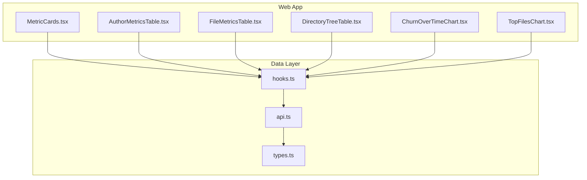
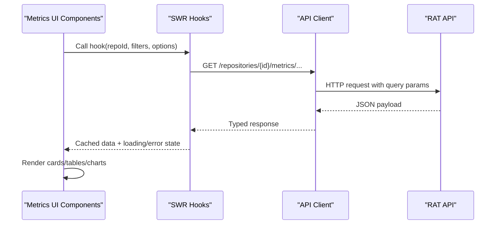
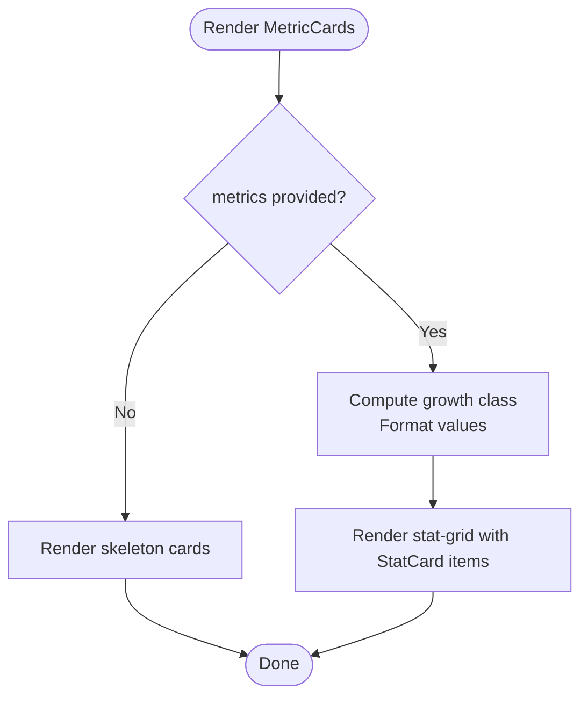
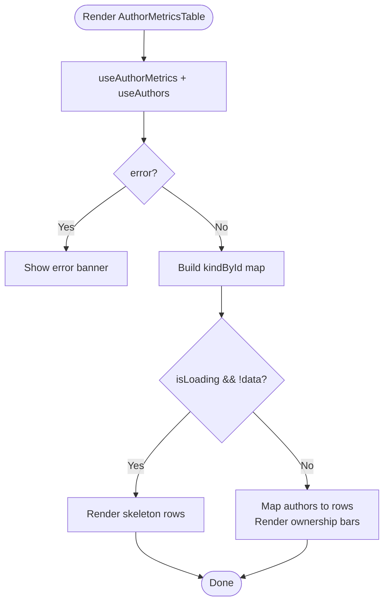
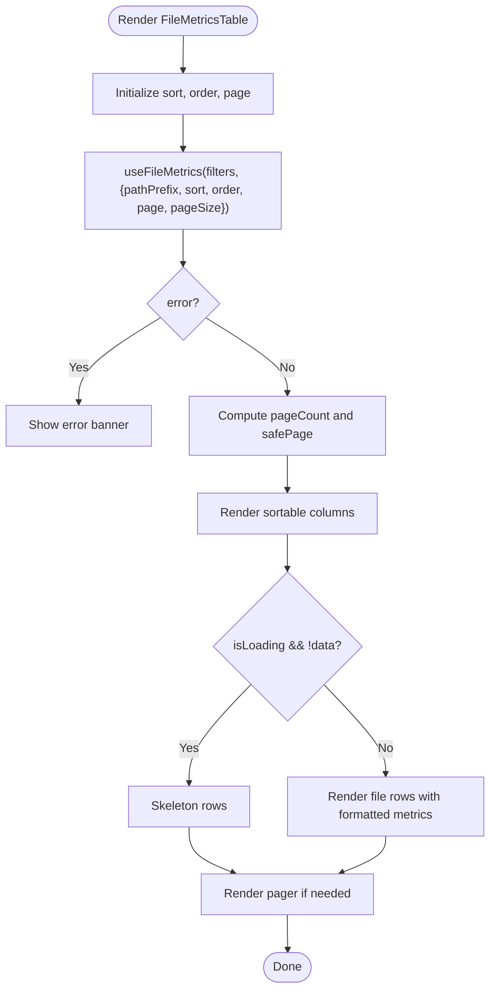
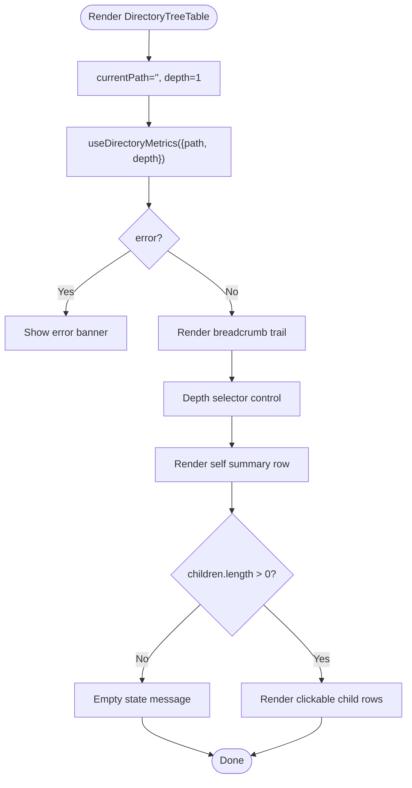
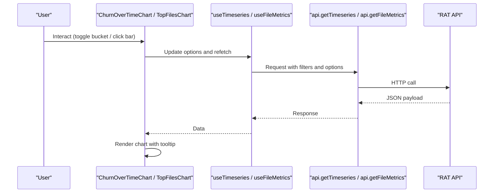
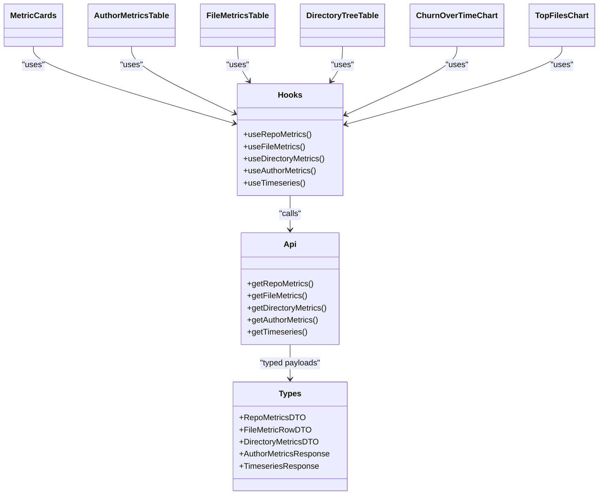

# Metrics Visualization Components

<cite>
**Referenced Files in This Document**
- [MetricCards.tsx](file://apps/web/src/components/metrics/MetricCards.tsx)
- [AuthorMetricsTable.tsx](file://apps/web/src/components/metrics/AuthorMetricsTable.tsx)
- [FileMetricsTable.tsx](file://apps/web/src/components/metrics/FileMetricsTable.tsx)
- [DirectoryTreeTable.tsx](file://apps/web/src/components/metrics/DirectoryTreeTable.tsx)
- [ChurnOverTimeChart.tsx](file://apps/web/src/components/metrics/charts/ChurnOverTimeChart.tsx)
- [TopFilesChart.tsx](file://apps/web/src/components/metrics/charts/TopFilesChart.tsx)
- [hooks.ts](file://apps/web/src/lib/hooks.ts)
- [api.ts](file://apps/web/src/lib/api.ts)
- [types.ts](file://packages/shared/src/types.ts)
</cite>

## Table of Contents
1. [Introduction](#introduction)
2. [Project Structure](#project-structure)
3. [Core Components](#core-components)
4. [Architecture Overview](#architecture-overview)
5. [Detailed Component Analysis](#detailed-component-analysis)
6. [Dependency Analysis](#dependency-analysis)
7. [Performance Considerations](#performance-considerations)
8. [Troubleshooting Guide](#troubleshooting-guide)
9. [Conclusion](#conclusion)

## Introduction
This document explains the metrics visualization components that power the repository analytics dashboard. It focuses on:
- MetricCards for key performance indicators with real-time updates and responsive layout
- AuthorMetricsTable for author-based metrics with sorting, filtering, and pagination support through shared filters
- FileMetricsTable for file-level statistics with interactive sorting, pagination, and drill-down via path scoping
- DirectoryTreeTable for hierarchical directory navigation with expandable depth and breadcrumb controls
- Data binding patterns, table interactions, chart integrations, and performance optimization techniques for large datasets

The components are React client components built on Next.js, using SWR for data fetching, Recharts for visualizations, and a shared type layer for API contracts.

## Project Structure
The metrics visualization lives under `apps/web/src/components/metrics`, with charts under `metrics/charts`. Data access is centralized in `lib/hooks.ts` and `lib/api.ts`, while shared DTOs live in `packages/shared/src/types.ts`.

**Diagram sources**
- [MetricCards.tsx:1-89](file://apps/web/src/components/metrics/MetricCards.tsx#L1-L89)
- [AuthorMetricsTable.tsx:1-143](file://apps/web/src/components/metrics/AuthorMetricsTable.tsx#L1-L143)
- [FileMetricsTable.tsx:1-193](file://apps/web/src/components/metrics/FileMetricsTable.tsx#L1-L193)
- [DirectoryTreeTable.tsx:1-178](file://apps/web/src/components/metrics/DirectoryTreeTable.tsx#L1-L178)
- [ChurnOverTimeChart.tsx:1-142](file://apps/web/src/components/metrics/charts/ChurnOverTimeChart.tsx#L1-L142)
- [TopFilesChart.tsx:1-120](file://apps/web/src/components/metrics/charts/TopFilesChart.tsx#L1-L120)
- [hooks.ts:1-163](file://apps/web/src/lib/hooks.ts#L1-L163)
- [api.ts:1-269](file://apps/web/src/lib/api.ts#L1-L269)
- [types.ts:1-266](file://packages/shared/src/types.ts#L1-L266)

**Section sources**
- [MetricCards.tsx:1-89](file://apps/web/src/components/metrics/MetricCards.tsx#L1-L89)
- [hooks.ts:1-163](file://apps/web/src/lib/hooks.ts#L1-L163)
- [api.ts:1-269](file://apps/web/src/lib/api.ts#L1-L269)
- [types.ts:1-266](file://packages/shared/src/types.ts#L1-L266)

## Core Components
- MetricCards: Displays repository-level KPIs such as commit count, added/removed lines, growth, churn, modifications, churn rate, and modification frequency. It shows skeleton placeholders while loading and uses color-coded values for positive/negative changes.
- AuthorMetricsTable: Shows per-author metrics including commits, added/removed lines, modifications, churn, and ownership fraction. It integrates resolved author kinds from the authors endpoint and renders an inline ownership bar.
- FileMetricsTable: Presents file-level metrics with column sorting, ascending/descending toggles, and server-side pagination. It exposes a toolbar summary and page navigation.
- DirectoryTreeTable: Provides breadcrumb navigation and a selectable depth to explore directories up to five levels deep. It renders a self-summary row plus child directory rows with metrics.

All components use consistent formatting utilities and display error banners when data fetching fails.

**Section sources**
- [MetricCards.tsx:6-88](file://apps/web/src/components/metrics/MetricCards.tsx#L6-L88)
- [AuthorMetricsTable.tsx:23-142](file://apps/web/src/components/metrics/AuthorMetricsTable.tsx#L23-L142)
- [FileMetricsTable.tsx:54-192](file://apps/web/src/components/metrics/FileMetricsTable.tsx#L54-L192)
- [DirectoryTreeTable.tsx:24-177](file://apps/web/src/components/metrics/DirectoryTreeTable.tsx#L24-L177)

## Architecture Overview
The visualization layer follows a clear separation of concerns:
- UI components render metrics and handle user interactions (sorting, paging, drilling down).
- Custom hooks encapsulate SWR-based data fetching and caching, deriving stable keys from filters and options.
- The API module builds typed requests and query strings, handling errors uniformly.
- Shared types define the contract between frontend and backend.

**Diagram sources**
- [hooks.ts:79-148](file://apps/web/src/lib/hooks.ts#L79-L148)
- [api.ts:220-267](file://apps/web/src/lib/api.ts#L220-L267)

## Detailed Component Analysis

### MetricCards
MetricCards renders a grid of stat cards for repository-level metrics. It:
- Accepts a `RepoMetricsDTO` object or undefined
- Renders skeletons during initial load
- Formats numbers, dates, percentages, and signed values
- Applies positive/negative styling based on growth and removed lines

Real-time updates are enabled by the underlying hook configuration which refreshes while repositories/jobs are active.

**Diagram sources**
- [MetricCards.tsx:6-88](file://apps/web/src/components/metrics/MetricCards.tsx#L6-L88)

**Section sources**
- [MetricCards.tsx:1-89](file://apps/web/src/components/metrics/MetricCards.tsx#L1-L89)
- [hooks.ts:15-28](file://apps/web/src/lib/hooks.ts#L15-L28)

### AuthorMetricsTable
AuthorMetricsTable displays per-author metrics over the active scope:
- Fetches author metrics and author identities
- Builds a resolution kind map for badges
- Renders a toolbar summary with total churn
- Shows an inline ownership bar and percentage

It does not implement local sorting or pagination; instead, it relies on the server’s computed metrics for the current filter set.

**Diagram sources**
- [AuthorMetricsTable.tsx:23-142](file://apps/web/src/components/metrics/AuthorMetricsTable.tsx#L23-L142)

**Section sources**
- [AuthorMetricsTable.tsx:1-143](file://apps/web/src/components/metrics/AuthorMetricsTable.tsx#L1-L143)
- [hooks.ts:124-134](file://apps/web/src/lib/hooks.ts#L124-L134)
- [types.ts:191-209](file://packages/shared/src/types.ts#L191-L209)

### FileMetricsTable
FileMetricsTable provides:
- Column definitions with numeric flags
- Local sort state with default orders per column
- Server-side pagination with a fixed page size
- Toolbar showing total files and current sort context
- Interactive header buttons for sorting with accessibility labels

Sorting and pagination are coordinated: clicking a column resets to page 1 and applies the default order unless toggling the same column.

**Diagram sources**
- [FileMetricsTable.tsx:54-192](file://apps/web/src/components/metrics/FileMetricsTable.tsx#L54-L192)

**Section sources**
- [FileMetricsTable.tsx:1-193](file://apps/web/src/components/metrics/FileMetricsTable.tsx#L1-L193)
- [hooks.ts:87-108](file://apps/web/src/lib/hooks.ts#L87-L108)
- [api.ts:226-240](file://apps/web/src/lib/api.ts#L226-L240)
- [types.ts:172-174](file://packages/shared/src/types.ts#L172-L174)

### DirectoryTreeTable
DirectoryTreeTable enables hierarchical exploration:
- Maintains current path and depth state
- Renders breadcrumbs for navigation
- Offers a depth selector from 1 to 5
- Fetches directory metrics with path and depth parameters
- Displays a self-summary row followed by children rows

Clicking a child path navigates into that directory. Depth changes trigger new queries to reflect aggregated metrics across descendant directories.

**Diagram sources**
- [DirectoryTreeTable.tsx:24-177](file://apps/web/src/components/metrics/DirectoryTreeTable.tsx#L24-L177)

**Section sources**
- [DirectoryTreeTable.tsx:1-178](file://apps/web/src/components/metrics/DirectoryTreeTable.tsx#L1-L178)
- [hooks.ts:110-122](file://apps/web/src/lib/hooks.ts#L110-L122)
- [api.ts:242-249](file://apps/web/src/lib/api.ts#L242-L249)
- [types.ts:176-189](file://packages/shared/src/types.ts#L176-L189)

### Chart Integrations
Two chart components integrate with the same data layer:
- ChurnOverTimeChart: Uses timeseries data with day/week buckets, rendering bars for added/removed and a line for commit counts. It supports bucket switching and scoped path filtering.
- TopFilesChart: Renders top files by churn as a vertical bar chart, allowing users to click a bar to set a global path scope.

Both charts:
- Use SWR hooks for data fetching
- Provide tooltips with formatted metrics
- Handle loading skeletons and empty states
- Respect the active CommitFilters

**Diagram sources**
- [ChurnOverTimeChart.tsx:54-141](file://apps/web/src/components/metrics/charts/ChurnOverTimeChart.tsx#L54-L141)
- [TopFilesChart.tsx:47-119](file://apps/web/src/components/metrics/charts/TopFilesChart.tsx#L47-L119)
- [hooks.ts:136-148](file://apps/web/src/lib/hooks.ts#L136-L148)
- [api.ts:260-267](file://apps/web/src/lib/api.ts#L260-L267)

**Section sources**
- [ChurnOverTimeChart.tsx:1-142](file://apps/web/src/components/metrics/charts/ChurnOverTimeChart.tsx#L1-L142)
- [TopFilesChart.tsx:1-120](file://apps/web/src/components/metrics/charts/TopFilesChart.tsx#L1-L120)
- [hooks.ts:136-148](file://apps/web/src/lib/hooks.ts#L136-L148)

## Dependency Analysis
The components depend on:
- Shared types for DTOs and responses
- API client for building URLs and handling errors
- SWR hooks for caching, polling, and stable key generation

**Diagram sources**
- [MetricCards.tsx:1-89](file://apps/web/src/components/metrics/MetricCards.tsx#L1-L89)
- [AuthorMetricsTable.tsx:1-143](file://apps/web/src/components/metrics/AuthorMetricsTable.tsx#L1-L143)
- [FileMetricsTable.tsx:1-193](file://apps/web/src/components/metrics/FileMetricsTable.tsx#L1-L193)
- [DirectoryTreeTable.tsx:1-178](file://apps/web/src/components/metrics/DirectoryTreeTable.tsx#L1-L178)
- [ChurnOverTimeChart.tsx:1-142](file://apps/web/src/components/metrics/charts/ChurnOverTimeChart.tsx#L1-L142)
- [TopFilesChart.tsx:1-120](file://apps/web/src/components/metrics/charts/TopFilesChart.tsx#L1-L120)
- [hooks.ts:1-163](file://apps/web/src/lib/hooks.ts#L1-L163)
- [api.ts:1-269](file://apps/web/src/lib/api.ts#L1-L269)
- [types.ts:1-266](file://packages/shared/src/types.ts#L1-L266)

**Section sources**
- [hooks.ts:1-163](file://apps/web/src/lib/hooks.ts#L1-L163)
- [api.ts:1-269](file://apps/web/src/lib/api.ts#L1-L269)
- [types.ts:1-266](file://packages/shared/src/types.ts#L1-L266)

## Performance Considerations
- Server-side pagination: FileMetricsTable uses a fixed page size to limit DOM nodes and network payload. Adjust pageSize only if necessary.
- Stable SWR keys: Hooks derive keys from filters and options to avoid unnecessary refetches and ensure cache hits.
- Keep previous data: Metrics hooks use `keepPreviousData` to prevent UI flicker during transitions.
- Conditional polling: Repositories and jobs poll at a cadence only while active, reducing overhead once processing completes.
- Lightweight chart data: TopFilesChart limits to top 10 entries; ChurnOverTimeChart aggregates into day/week buckets.
- Skeleton loading: All tables and charts show skeletons to improve perceived performance.
- Formatting utilities: Consistent number/date formatting avoids heavy computations inside render loops.

[No sources needed since this section provides general guidance]

## Troubleshooting Guide
Common issues and resolutions:
- Network errors: The API client throws structured `ApiError` instances with code and status. Components display error banners with messages.
- Missing API server: If the API base URL is unreachable, a network error is thrown with guidance to start the server.
- Empty datasets: Tables and charts render appropriate empty states when no data matches the current filters.
- Sorting and pagination: Ensure sort keys match defined columns and that page resets after sorting to avoid out-of-range pages.
- Path scoping: When drilling down via DirectoryTreeTable or selecting a file in TopFilesChart, verify the path prefix is correctly passed to downstream components.

**Section sources**
- [api.ts:22-69](file://apps/web/src/lib/api.ts#L22-L69)
- [AuthorMetricsTable.tsx:41-47](file://apps/web/src/components/metrics/AuthorMetricsTable.tsx#L41-L47)
- [FileMetricsTable.tsx:90-96](file://apps/web/src/components/metrics/FileMetricsTable.tsx#L90-L96)
- [DirectoryTreeTable.tsx:39-45](file://apps/web/src/components/metrics/DirectoryTreeTable.tsx#L39-L45)
- [ChurnOverTimeChart.tsx:96-103](file://apps/web/src/components/metrics/charts/ChurnOverTimeChart.tsx#L96-L103)
- [TopFilesChart.tsx:78-85](file://apps/web/src/components/metrics/charts/TopFilesChart.tsx#L78-L85)

## Conclusion
The metrics visualization components provide a cohesive, performant, and accessible interface for exploring repository analytics. They combine consistent data binding patterns, robust table interactions, and integrated charts to deliver actionable insights. With server-side pagination, stable caching, and conditional polling, they scale well for large datasets while maintaining responsiveness.

[No sources needed since this section summarizes without analyzing specific files]