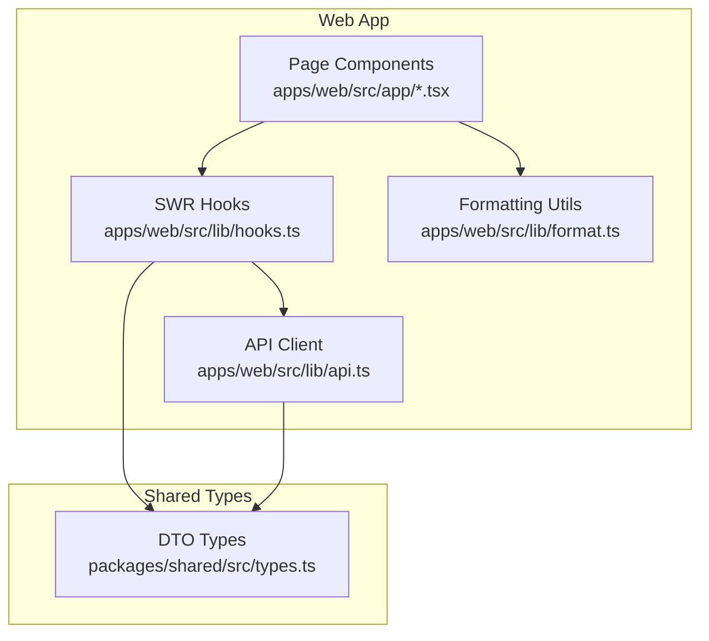
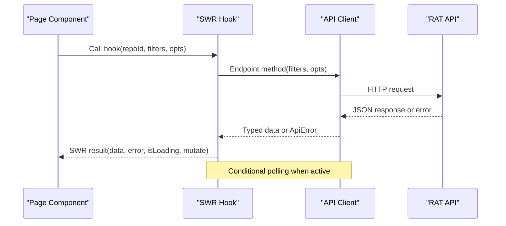
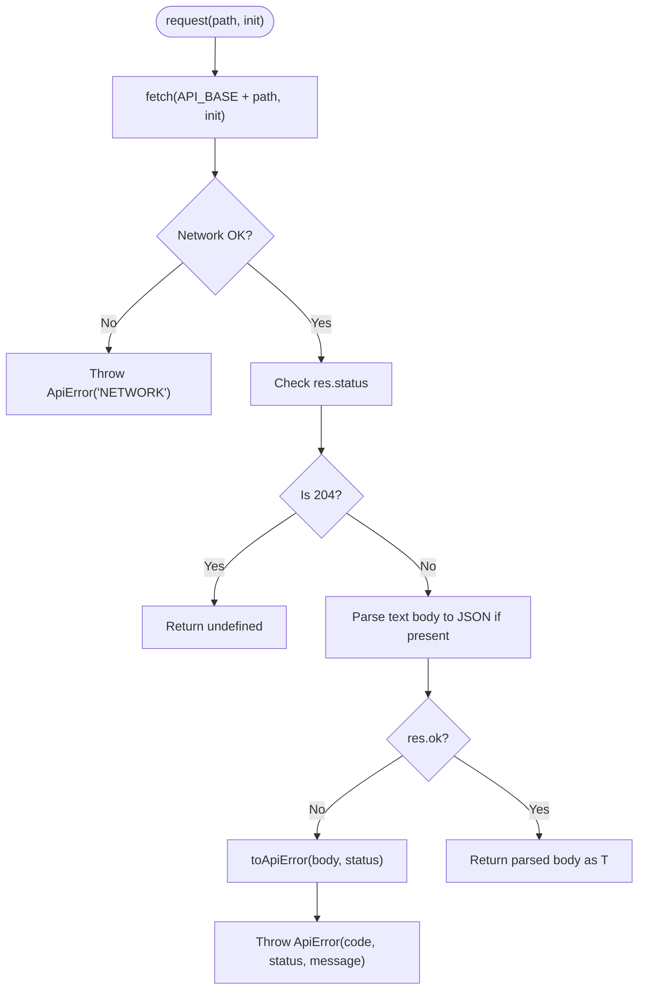
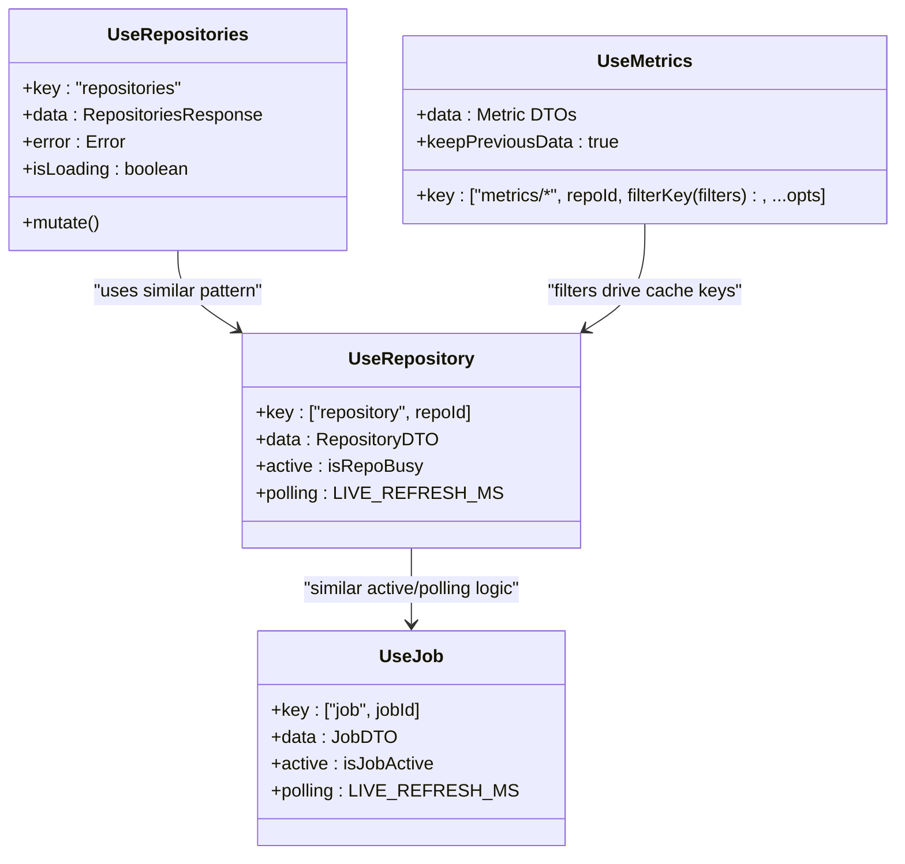
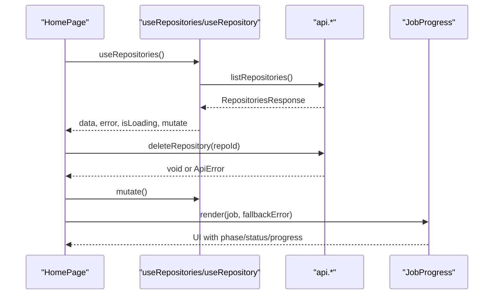
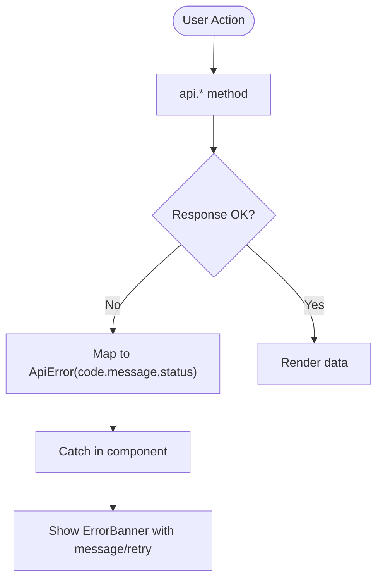
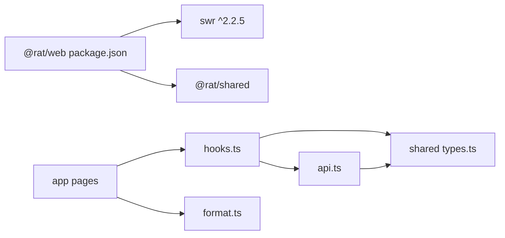

# Data Fetching & State Management

<cite>
**Referenced Files in This Document**
- [api.ts](file://apps/web/src/lib/api.ts)
- [hooks.ts](file://apps/web/src/lib/hooks.ts)
- [format.ts](file://apps/web/src/lib/format.ts)
- [types.ts](file://packages/shared/src/types.ts)
- [page.tsx](file://apps/web/src/app/page.tsx)
- [repo-page.tsx](file://apps/web/src/app/repos/[repoId]/page.tsx)
- [JobProgress.tsx](file://apps/web/src/components/ingest/JobProgress.tsx)
- [MetricCards.tsx](file://apps/web/src/components/metrics/MetricCards.tsx)
- [web-package.json](file://apps/web/package.json)
</cite>

## Table of Contents
1. [Introduction](#introduction)
2. [Project Structure](#project-structure)
3. [Core Components](#core-components)
4. [Architecture Overview](#architecture-overview)
5. [Detailed Component Analysis](#detailed-component-analysis)
6. [Dependency Analysis](#dependency-analysis)
7. [Performance Considerations](#performance-considerations)
8. [Troubleshooting Guide](#troubleshooting-guide)
9. [Conclusion](#conclusion)

## Introduction
This document explains the data fetching architecture and state management patterns used by the web dashboard. It focuses on:
- The API client implementation for request/response handling, error management, and upload progress.
- Custom SWR hooks that encapsulate data fetching, caching, filtering, pagination, and real-time updates during ingestion.
- Shared type definitions and formatting utilities that ensure type safety and consistent presentation.
- Examples of data fetching patterns, error handling strategies, and performance optimizations.
- Offline support considerations, data synchronization, and state persistence mechanisms.

The design separates concerns into a thin HTTP client, typed shared DTOs, reusable SWR hooks, and presentational components. Real-time updates are achieved through conditional polling while repositories or jobs are active.

## Project Structure
The relevant parts of the frontend live under `apps/web`:
- `src/lib/api.ts` defines the API client, structured errors, query helpers, and endpoint methods.
- `src/lib/hooks.ts` provides SWR-based hooks for repositories, jobs, metadata, metrics, and commits.
- `src/lib/format.ts` contains display formatting helpers and status label maps.
- `packages/shared/src/types.ts` defines all DTO types consumed by both API and UI.
- App pages consume these hooks to render repository lists, ingestion progress, and metric dashboards.

**Diagram sources**
- [page.tsx:1-215](file://apps/web/src/app/page.tsx#L1-L215)
- [repo-page.tsx:1-206](file://apps/web/src/app/repos/[repoId]/page.tsx#L1-L206)
- [hooks.ts:1-163](file://apps/web/src/lib/hooks.ts#L1-L163)
- [api.ts:1-269](file://apps/web/src/lib/api.ts#L1-L269)
- [format.ts:1-132](file://apps/web/src/lib/format.ts#L1-L132)
- [types.ts:1-266](file://packages/shared/src/types.ts#L1-L266)

**Section sources**
- [page.tsx:1-215](file://apps/web/src/app/page.tsx#L1-L215)
- [repo-page.tsx:1-206](file://apps/web/src/app/repos/[repoId]/page.tsx#L1-L206)
- [hooks.ts:1-163](file://apps/web/src/lib/hooks.ts#L1-L163)
- [api.ts:1-269](file://apps/web/src/lib/api.ts#L1-L269)
- [format.ts:1-132](file://apps/web/src/lib/format.ts#L1-L132)
- [types.ts:1-266](file://packages/shared/src/types.ts#L1-L266)

## Core Components
- API client (`api.ts`)
  - Centralized fetch wrapper with structured error mapping.
  - Query string builder and commit-set filter serialization.
  - Endpoint methods for repositories, jobs, authors, paths, commits, and metrics.
  - Multipart upload using XHR for progress reporting.
- SWR hooks (`hooks.ts`)
  - Repository, job, author, path, and metrics hooks.
  - Conditional polling while ingestion is active.
  - Stable key generation based on filters and options.
  - Previous data retention for smoother transitions.
- Formatting utilities (`format.ts`)
  - Number, percentage, date/time, duration, byte size, and SHA helpers.
  - Status label maps and badge class helpers.
- Shared types (`types.ts`)
  - DTOs for repositories, jobs, commits, authors, paths, metrics, timeseries, and list envelopes.

**Section sources**
- [api.ts:17-69](file://apps/web/src/lib/api.ts#L17-L69)
- [api.ts:71-103](file://apps/web/src/lib/api.ts#L71-L103)
- [api.ts:122-268](file://apps/web/src/lib/api.ts#L122-L268)
- [hooks.ts:12-33](file://apps/web/src/lib/hooks.ts#L12-L33)
- [hooks.ts:39-61](file://apps/web/src/lib/hooks.ts#L39-L61)
- [hooks.ts:79-162](file://apps/web/src/lib/hooks.ts#L79-L162)
- [format.ts:1-79](file://apps/web/src/lib/format.ts#L1-L79)
- [format.ts:81-131](file://apps/web/src/lib/format.ts#L81-L131)
- [types.ts:12-55](file://packages/shared/src/types.ts#L12-L55)
- [types.ts:61-113](file://packages/shared/src/types.ts#L61-L113)
- [types.ts:139-144](file://packages/shared/src/types.ts#L139-L144)
- [types.ts:150-225](file://packages/shared/src/types.ts#L150-L225)
- [types.ts:231-242](file://packages/shared/src/types.ts#L231-L242)

## Architecture Overview
The data flow follows a layered approach:
- Pages call SWR hooks.
- Hooks call typed API methods.
- API methods perform HTTP requests and map responses/errors.
- SWR caches results keyed by stable identifiers.
- Conditional polling refreshes data while ingestion is active.
- Components render formatted data using shared utilities.

**Diagram sources**
- [hooks.ts:39-61](file://apps/web/src/lib/hooks.ts#L39-L61)
- [hooks.ts:79-162](file://apps/web/src/lib/hooks.ts#L79-L162)
- [api.ts:43-69](file://apps/web/src/lib/api.ts#L43-L69)
- [api.ts:122-268](file://apps/web/src/lib/api.ts#L122-L268)

## Detailed Component Analysis

### API Client Implementation
Responsibilities:
- Base URL configuration via environment variable.
- Structured error class with code and HTTP status.
- Request wrapper handling network failures, non-OK statuses, and empty responses.
- Query string builder that omits empty values.
- Commit-set filter serialization for consistent API queries.
- Endpoint methods covering repositories, jobs, authors, paths, commits, and metrics.
- Multipart upload with XHR for progress events.

Key behaviors:
- Network errors throw a structured `ApiError` with code `NETWORK`.
- Non-OK responses parse server body and throw `ApiError` with server-provided code/message.
- 204 responses return undefined instead of parsing an empty body.
- Upload uses XHR to report progress fractions to the caller.

**Diagram sources**
- [api.ts:43-69](file://apps/web/src/lib/api.ts#L43-L69)
- [api.ts:35-41](file://apps/web/src/lib/api.ts#L35-L41)

**Section sources**
- [api.ts:17-20](file://apps/web/src/lib/api.ts#L17-L20)
- [api.ts:22-41](file://apps/web/src/lib/api.ts#L22-L41)
- [api.ts:43-69](file://apps/web/src/lib/api.ts#L43-L69)
- [api.ts:71-103](file://apps/web/src/lib/api.ts#L71-L103)
- [api.ts:122-268](file://apps/web/src/lib/api.ts#L122-L268)

### Custom SWR Hooks
Responsibilities:
- Encapsulate data fetching for repositories, jobs, authors, paths, commits, and metrics.
- Provide stable keys derived from repo IDs, filters, and options.
- Enable real-time updates during ingestion via conditional polling.
- Preserve previous data for smooth UI transitions.

Real-time update strategy:
- A helper configures `refreshInterval` based on whether a repository or job is still active.
- Repositories and jobs poll every 1.5 seconds while their status indicates activity.
- Once finished, polling stops automatically.

Caching strategy:
- Keys include resource identifiers and serialized filters/options.
- Metrics and list endpoints use `keepPreviousData` to avoid flicker during filter changes.

**Diagram sources**
- [hooks.ts:12-33](file://apps/web/src/lib/hooks.ts#L12-L33)
- [hooks.ts:39-61](file://apps/web/src/lib/hooks.ts#L39-L61)
- [hooks.ts:79-162](file://apps/web/src/lib/hooks.ts#L79-L162)

**Section sources**
- [hooks.ts:12-33](file://apps/web/src/lib/hooks.ts#L12-L33)
- [hooks.ts:39-61](file://apps/web/src/lib/hooks.ts#L39-L61)
- [hooks.ts:79-162](file://apps/web/src/lib/hooks.ts#L79-L162)

### Data Transformation Utilities and Type Safety
Formatting utilities:
- Numbers: integer, signed growth, decimal, percent.
- Dates/times: UNIX seconds to UTC strings; conversion to/from datetime-local inputs.
- Durations: milliseconds to human-readable durations.
- Sizes: bytes to human-readable units.
- Identifiers: short SHA abbreviation.
- Status labels and badge classes for repositories and jobs.

Type safety:
- All API responses and request payloads are strongly typed via shared DTOs.
- Components receive typed data from hooks, reducing runtime shape assumptions.
- Filter parameters are serialized consistently, ensuring predictable cache keys.

**Section sources**
- [format.ts:1-79](file://apps/web/src/lib/format.ts#L1-L79)
- [format.ts:81-131](file://apps/web/src/lib/format.ts#L81-L131)
- [types.ts:12-55](file://packages/shared/src/types.ts#L12-L55)
- [types.ts:61-113](file://packages/shared/src/types.ts#L61-L113)
- [types.ts:139-144](file://packages/shared/src/types.ts#L139-L144)
- [types.ts:150-225](file://packages/shared/src/types.ts#L150-L225)
- [types.ts:231-242](file://packages/shared/src/types.ts#L231-L242)

### Data Fetching Patterns and Usage Examples
- Repository listing:
  - Page calls `useRepositories()` and renders rows with status badges and ingestion progress.
  - Deletion triggers `api.deleteRepository`, then revalidates the list via `mutate()`.
- Repository detail:
  - Page calls `useRepository(repoId)` and conditionally shows ingestion progress or metrics tabs.
  - Filters derive commit-set boundaries and feed into metrics hooks.
- Ingestion progress:
  - `JobProgress` component displays phase, status, and progress bar using shared labels and formatting.
- Metrics rendering:
  - `MetricCards` displays computed metrics using formatting helpers.

**Diagram sources**
- [page.tsx:119-140](file://apps/web/src/app/page.tsx#L119-L140)
- [page.tsx:155-160](file://apps/web/src/app/page.tsx#L155-L160)
- [page.tsx:170-186](file://apps/web/src/app/page.tsx#L170-L186)
- [repo-page.tsx:35-47](file://apps/web/src/app/repos/[repoId]/page.tsx#L35-L47)
- [repo-page.tsx:115-144](file://apps/web/src/app/repos/[repoId]/page.tsx#L115-L144)
- [JobProgress.tsx:1-44](file://apps/web/src/components/ingest/JobProgress.tsx#L1-L44)

**Section sources**
- [page.tsx:119-140](file://apps/web/src/app/page.tsx#L119-L140)
- [page.tsx:155-160](file://apps/web/src/app/page.tsx#L155-L160)
- [page.tsx:170-186](file://apps/web/src/app/page.tsx#L170-L186)
- [repo-page.tsx:35-47](file://apps/web/src/app/repos/[repoId]/page.tsx#L35-L47)
- [repo-page.tsx:115-144](file://apps/web/src/app/repos/[repoId]/page.tsx#L115-L144)
- [JobProgress.tsx:1-44](file://apps/web/src/components/ingest/JobProgress.tsx#L1-L44)

### Error Handling Strategies
- Network errors:
  - The API client throws `ApiError` with code `NETWORK` when the server cannot be reached.
- HTTP errors:
  - Non-OK responses are mapped to `ApiError` using server-provided `code` and `message`.
- UI-level handling:
  - Pages check `error instanceof ApiError` to show user-friendly messages and offer retry actions.
  - Specific codes (e.g., repository not found) can be handled with tailored messages.

**Diagram sources**
- [api.ts:35-41](file://apps/web/src/lib/api.ts#L35-L41)
- [api.ts:43-69](file://apps/web/src/lib/api.ts#L43-L69)
- [page.tsx:125-140](file://apps/web/src/app/page.tsx#L125-L140)
- [repo-page.tsx:62-77](file://apps/web/src/app/repos/[repoId]/page.tsx#L62-L77)

**Section sources**
- [api.ts:35-41](file://apps/web/src/lib/api.ts#L35-L41)
- [api.ts:43-69](file://apps/web/src/lib/api.ts#L43-L69)
- [page.tsx:125-140](file://apps/web/src/app/page.tsx#L125-L140)
- [repo-page.tsx:62-77](file://apps/web/src/app/repos/[repoId]/page.tsx#L62-L77)

### Performance Optimizations
- Conditional polling:
  - Polling only occurs while repositories or jobs are active, minimizing unnecessary requests.
- Previous data retention:
  - Metrics hooks set `keepPreviousData` to prevent layout shifts during filter changes.
- Stable cache keys:
  - Keys incorporate filters and options, enabling precise cache invalidation and reuse.
- Efficient uploads:
  - Multipart upload uses XHR to provide progress feedback without blocking the UI.

[No sources needed since this section provides general guidance]

### Offline Support, Synchronization, and Persistence
- Current behavior:
  - No explicit offline mode or local persistence is implemented in the provided files.
  - Data is fetched on demand from the API and cached in memory by SWR.
- Synchronization:
  - Real-time updates rely on polling while ingestion is active.
  - Manual refresh is available via `mutate()` triggered by user actions.
- Recommendations:
  - Introduce service workers or browser storage to persist SWR cache across sessions.
  - Implement optimistic updates for mutations like deletion, with rollback on failure.
  - Add background sync queues for failed requests when offline.

[No sources needed since this section provides general guidance]

## Dependency Analysis
The web app depends on SWR for data fetching and caching, and on shared types for contract consistency.

**Diagram sources**
- [web-package.json:12-19](file://apps/web/package.json#L12-L19)
- [hooks.ts:1-10](file://apps/web/src/lib/hooks.ts#L1-L10)
- [api.ts:1-15](file://apps/web/src/lib/api.ts#L1-L15)
- [types.ts:1-6](file://packages/shared/src/types.ts#L1-L6)

**Section sources**
- [web-package.json:12-19](file://apps/web/package.json#L12-L19)
- [hooks.ts:1-10](file://apps/web/src/lib/hooks.ts#L1-L10)
- [api.ts:1-15](file://apps/web/src/lib/api.ts#L1-L15)
- [types.ts:1-6](file://packages/shared/src/types.ts#L1-L6)

## Performance Considerations
- Prefer stable cache keys to maximize cache hits.
- Use `keepPreviousData` for views where filter changes should not cause flicker.
- Limit polling cadence to necessary intervals; adjust `LIVE_REFRESH_MS` if backend load increases.
- Avoid redundant requests by consolidating related data in single endpoints where possible.
- Debounce user input that drives filters to reduce excessive refetches.

[No sources needed since this section provides general guidance]

## Troubleshooting Guide
Common issues and resolutions:
- Cannot reach the API:
  - Verify the base URL environment variable and server availability.
  - Check CORS settings on the API server.
- Repository not found:
  - Handle specific error codes in UI to inform users that the repository may have been deleted.
- Ingestion failures:
  - Display job error messages and fallback errors from repository state.
- Upload progress not updating:
  - Ensure XHR progress events are wired and the server returns valid multipart responses.

**Section sources**
- [api.ts:43-69](file://apps/web/src/lib/api.ts#L43-L69)
- [repo-page.tsx:62-77](file://apps/web/src/app/repos/[repoId]/page.tsx#L62-L77)
- [JobProgress.tsx:10-18](file://apps/web/src/components/ingest/JobProgress.tsx#L10-L18)

## Conclusion
The data fetching and state management architecture combines a typed API client, SWR hooks with conditional polling, and shared formatting utilities to deliver a responsive and type-safe dashboard experience. Real-time updates during ingestion are achieved through targeted polling, while caching and stable keys optimize performance. Future enhancements can introduce offline persistence, optimistic updates, and background synchronization to further improve resilience and user experience.