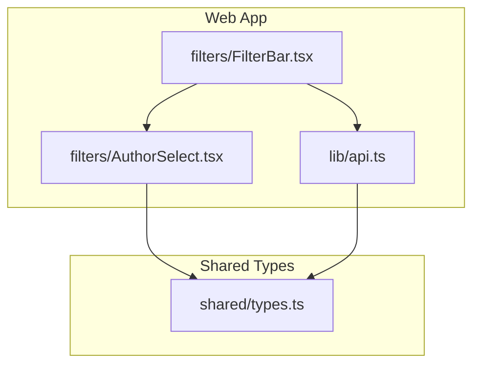
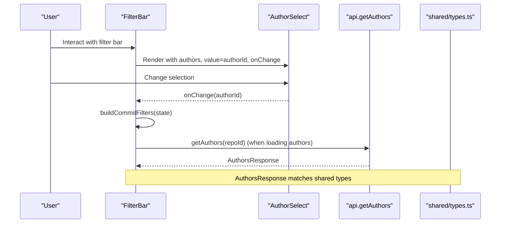
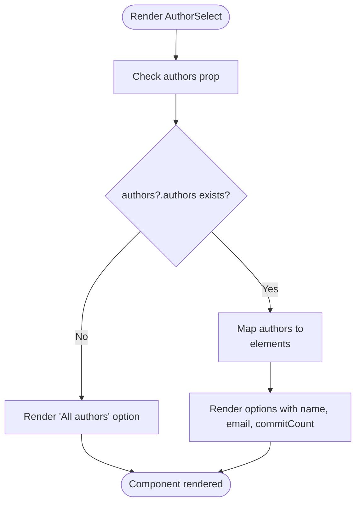
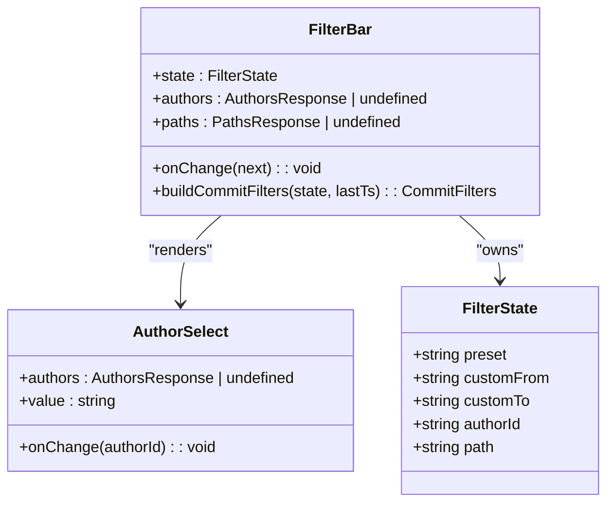
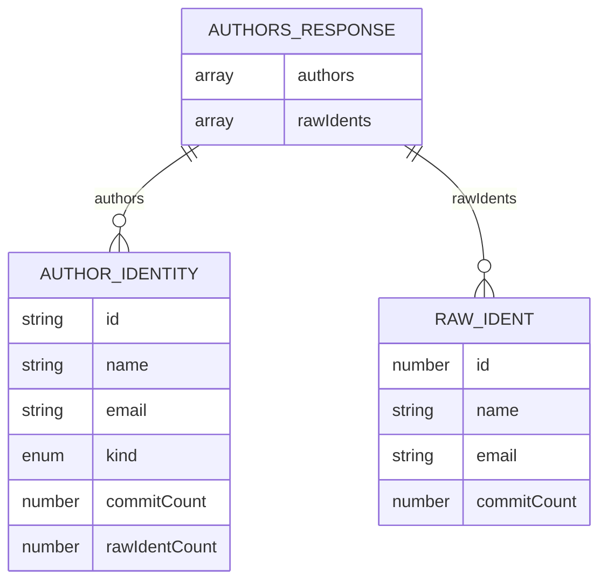
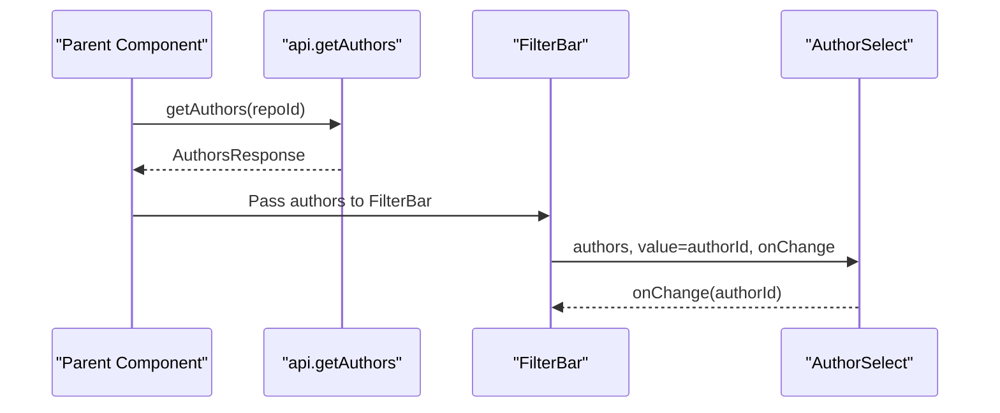
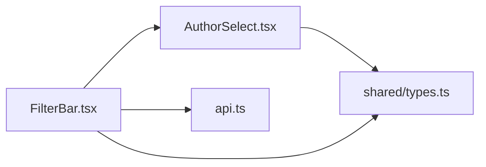

# Author Select Component

<cite>
**Referenced Files in This Document**
- [AuthorSelect.tsx](file://apps/web/src/components/filters/AuthorSelect.tsx)
- [FilterBar.tsx](file://apps/web/src/components/filters/FilterBar.tsx)
- [types.ts](file://packages/shared/src/types.ts)
- [api.ts](file://apps/web/src/lib/api.ts)
</cite>

## Table of Contents
1. [Introduction](#introduction)
2. [Project Structure](#project-structure)
3. [Core Components](#core-components)
4. [Architecture Overview](#architecture-overview)
5. [Detailed Component Analysis](#detailed-component-analysis)
6. [Dependency Analysis](#dependency-analysis)
7. [Performance Considerations](#performance-considerations)
8. [Troubleshooting Guide](#troubleshooting-guide)
9. [Conclusion](#conclusion)

## Introduction
The AuthorSelect component is a controlled dropdown that lets users filter metrics by author. It renders an HTML select element populated from the AuthorsResponse data structure and emits selected author identifiers to its parent via an onChange handler. The component is used inside the dashboard’s FilterBar, which composes commit-range, author, and path filters into API query parameters.

This documentation explains:
- How AuthorSelect integrates with AuthorsResponse and handles empty states.
- The component’s props interface for value binding and change handling.
- How the parent FilterBar consumes selections and builds commit filters.
- Current behavior versus recommended enhancements such as search debouncing and accessibility improvements.
- Performance considerations for large author lists and caching strategies.

## Project Structure
AuthorSelect lives under the web application’s filters directory and is consumed by FilterBar. Shared types are defined in the shared package and imported by both the API client and UI components.

**Diagram sources**
- [AuthorSelect.tsx:1-35](file://apps/web/src/components/filters/AuthorSelect.tsx#L1-L35)
- [FilterBar.tsx:1-166](file://apps/web/src/components/filters/FilterBar.tsx#L1-L166)
- [api.ts:1-269](file://apps/web/src/lib/api.ts#L1-L269)
- [types.ts:102-113](file://packages/shared/src/types.ts#L102-L113)

**Section sources**
- [AuthorSelect.tsx:1-35](file://apps/web/src/components/filters/AuthorSelect.tsx#L1-L35)
- [FilterBar.tsx:1-166](file://apps/web/src/components/filters/FilterBar.tsx#L1-L166)
- [api.ts:195-197](file://apps/web/src/lib/api.ts#L195-L197)
- [types.ts:102-113](file://packages/shared/src/types.ts#L102-L113)

## Core Components
- AuthorSelect: A presentational, controlled select component that displays authors and forwards selection changes.
- FilterBar: A stateful filter bar that owns the current authorId and passes it down to AuthorSelect. It also converts the filter state into API CommitFilters.
- AuthorsResponse and related types: Shared DTOs describing resolved authors and raw identities.
- api.getAuthors: Client function that fetches the list of authors for a repository.

Key responsibilities:
- AuthorSelect renders options from AuthorsResponse.authors and supports an “All authors” default option.
- FilterBar binds the selected authorId and clears or updates filters through its onChange callback.
- api.getAuthors provides the data source for authors.

**Section sources**
- [AuthorSelect.tsx:6-34](file://apps/web/src/components/filters/AuthorSelect.tsx#L6-L34)
- [FilterBar.tsx:75-166](file://apps/web/src/components/filters/FilterBar.tsx#L75-L166)
- [types.ts:102-113](file://packages/shared/src/types.ts#L102-L113)
- [api.ts:195-197](file://apps/web/src/lib/api.ts#L195-L197)

## Architecture Overview
The author filtering workflow connects the UI, data layer, and shared types:

**Diagram sources**
- [FilterBar.tsx:38-57](file://apps/web/src/components/filters/FilterBar.tsx#L38-L57)
- [FilterBar.tsx:142-146](file://apps/web/src/components/filters/FilterBar.tsx#L142-L146)
- [AuthorSelect.tsx:20-32](file://apps/web/src/components/filters/AuthorSelect.tsx#L20-L32)
- [api.ts:195-197](file://apps/web/src/lib/api.ts#L195-L197)
- [types.ts:110-113](file://packages/shared/src/types.ts#L110-L113)

## Detailed Component Analysis

### AuthorSelect Component
AuthorSelect is a controlled component:
- It receives authors (AuthorsResponse | undefined), a string value representing the selected authorId, and an onChange callback.
- It renders a label and a native select element.
- It includes an “All authors” option with an empty string value.
- It maps AuthorsResponse.authors to option elements using author.id as the key and value.

Props interface:
- authors: AuthorsResponse | undefined
- value: string (selected author id; empty string means “All authors”)
- onChange: (authorId: string) => void

Empty state handling:
- If authors is undefined, the component safely falls back to an empty array and renders only the “All authors” option.
- If authors.authors is empty, only “All authors” is shown.

Accessibility:
- The select has an id and a corresponding label with htmlFor, improving screen reader association.
- No additional ARIA attributes are currently applied.

Search functionality:
- There is no built-in search input or filtering logic in AuthorSelect. Filtering is performed at the parent level if desired.

Keyboard navigation:
- Uses the browser’s native select keyboard behavior (arrow keys, type-to-select).

Styling:
- Relies on external CSS classes field, field-label, and select.

**Diagram sources**
- [AuthorSelect.tsx:15-33](file://apps/web/src/components/filters/AuthorSelect.tsx#L15-L33)

**Section sources**
- [AuthorSelect.tsx:6-34](file://apps/web/src/components/filters/AuthorSelect.tsx#L6-L34)

### FilterBar Integration
FilterBar owns the filter state and composes AuthorSelect:
- It passes authors, the current authorId, and an onChange updater to AuthorSelect.
- It converts the filter state into CommitFilters, including authorId when set.
- It exposes a Clear filters button to reset to EMPTY_FILTERS.

State model:
- FilterState includes preset, customFrom, customTo, authorId, and path.
- EMPTY_FILTERS initializes all fields to defaults, including authorId as an empty string.

Filter compilation:
- buildCommitFilters adds authorId to filters when non-empty.
- Preset-based time ranges are computed relative to lastTs.

**Diagram sources**
- [FilterBar.tsx:13-31](file://apps/web/src/components/filters/FilterBar.tsx#L13-L31)
- [FilterBar.tsx:38-57](file://apps/web/src/components/filters/FilterBar.tsx#L38-L57)
- [FilterBar.tsx:75-166](file://apps/web/src/components/filters/FilterBar.tsx#L75-L166)
- [AuthorSelect.tsx:6-14](file://apps/web/src/components/filters/AuthorSelect.tsx#L6-L14)

**Section sources**
- [FilterBar.tsx:13-31](file://apps/web/src/components/filters/FilterBar.tsx#L13-L31)
- [FilterBar.tsx:38-57](file://apps/web/src/components/filters/FilterBar.tsx#L38-L57)
- [FilterBar.tsx:75-166](file://apps/web/src/components/filters/FilterBar.tsx#L75-L166)

### AuthorsResponse Data Structure
AuthorsResponse describes the payload returned by the authors endpoint:
- authors: Array of AuthorIdentityDTO entries.
- rawIdents: Array of RawIdentDTO entries.

AuthorIdentityDTO fields relevant to AuthorSelect:
- id: Stable identifier used for filtering.
- name: Displayed in the option text.
- email: Displayed in the option text.
- commitCount: Number of commits attributed to this author.

**Diagram sources**
- [types.ts:102-113](file://packages/shared/src/types.ts#L102-L113)
- [types.ts:88-100](file://packages/shared/src/types.ts#L88-L100)
- [types.ts:102-108](file://packages/shared/src/types.ts#L102-L108)

**Section sources**
- [types.ts:88-113](file://packages/shared/src/types.ts#L88-L113)

### Data Loading and Value Binding
- api.getAuthors(repoId) returns AuthorsResponse and is the canonical way to load authors for a repository.
- AuthorSelect expects authors to be provided by the parent; it does not fetch data itself.
- The selected value is bound to the select element and emitted via onChange as a string authorId.

**Diagram sources**
- [api.ts:195-197](file://apps/web/src/lib/api.ts#L195-L197)
- [FilterBar.tsx:142-146](file://apps/web/src/components/filters/FilterBar.tsx#L142-L146)
- [AuthorSelect.tsx:20-32](file://apps/web/src/components/filters/AuthorSelect.tsx#L20-L32)

**Section sources**
- [api.ts:195-197](file://apps/web/src/lib/api.ts#L195-L197)
- [FilterBar.tsx:142-146](file://apps/web/src/components/filters/FilterBar.tsx#L142-L146)
- [AuthorSelect.tsx:20-32](file://apps/web/src/components/filters/AuthorSelect.tsx#L20-L32)

## Dependency Analysis
AuthorSelect depends on:
- Shared types for AuthorsResponse and AuthorIdentityDTO.
- External CSS classes for layout and styling.

FilterBar depends on:
- AuthorSelect for rendering the author dropdown.
- PathPicker for path scoping.
- format utilities for datetime conversion.
- shared types for AuthorsResponse and PathsResponse.
- api.CommitFilters for building query parameters.

**Diagram sources**
- [AuthorSelect.tsx:3](file://apps/web/src/components/filters/AuthorSelect.tsx#L3)
- [FilterBar.tsx:3-7](file://apps/web/src/components/filters/FilterBar.tsx#L3-L7)
- [api.ts:1-15](file://apps/web/src/lib/api.ts#L1-L15)
- [types.ts:102-113](file://packages/shared/src/types.ts#L102-L113)

**Section sources**
- [AuthorSelect.tsx:1-3](file://apps/web/src/components/filters/AuthorSelect.tsx#L1-L3)
- [FilterBar.tsx:1-7](file://apps/web/src/components/filters/FilterBar.tsx#L1-L7)
- [api.ts:1-15](file://apps/web/src/lib/api.ts#L1-L15)
- [types.ts:102-113](file://packages/shared/src/types.ts#L102-L113)

## Performance Considerations
Current implementation:
- Rendering is O(n) where n is the number of authors, mapping each author to an option element.
- No client-side search or pagination is implemented within AuthorSelect.

Recommendations for large author lists:
- Virtualization: Render only visible options to reduce DOM size.
- Pagination or lazy loading: Load more authors as the user scrolls.
- Client-side search with debouncing: Add a search input and debounce filtering to avoid excessive re-renders.
- Caching: Cache AuthorsResponse per repository to avoid repeated network calls.
- Memoization: Use React.memo or useMemo around option lists to prevent unnecessary re-renders when authors do not change.

Caching strategy example:
- Maintain a cache keyed by repoId storing AuthorsResponse and a timestamp.
- Invalidate cache when repository data changes or after a configured TTL.
- Prefer server-side pagination if available to limit payload size.

[No sources needed since this section provides general guidance]

## Troubleshooting Guide
Common issues and resolutions:
- Empty dropdown:
  - Ensure authors is loaded before rendering AuthorSelect.
  - Verify that AuthorsResponse.authors contains entries.
- Selection not updating:
  - Confirm that value is bound to the select and onChange is called with the new authorId.
  - Check that the parent component updates its state and re-renders AuthorSelect.
- Accessibility concerns:
  - Ensure the select has a label associated via htmlFor.
  - Consider adding aria-describedby or aria-live regions for dynamic updates.
- Network errors:
  - Handle ApiError from api.getAuthors and display a user-friendly message.
  - Retry logic can be added with exponential backoff.

**Section sources**
- [api.ts:22-41](file://apps/web/src/lib/api.ts#L22-L41)
- [AuthorSelect.tsx:15-33](file://apps/web/src/components/filters/AuthorSelect.tsx#L15-L33)

## Conclusion
AuthorSelect provides a simple, accessible author selection dropdown integrated with the shared AuthorsResponse type and the FilterBar’s state model. While it currently lacks client-side search and advanced performance optimizations, it serves as a solid foundation for extending filtering capabilities. Recommended enhancements include search debouncing, virtualization, pagination, and robust caching to improve usability and performance for large author datasets.

[No sources needed since this section summarizes without analyzing specific files]