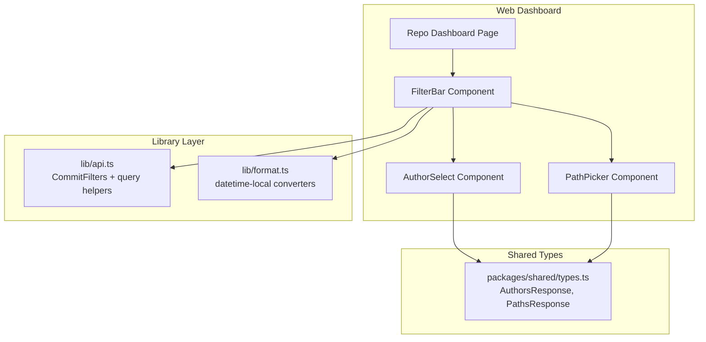
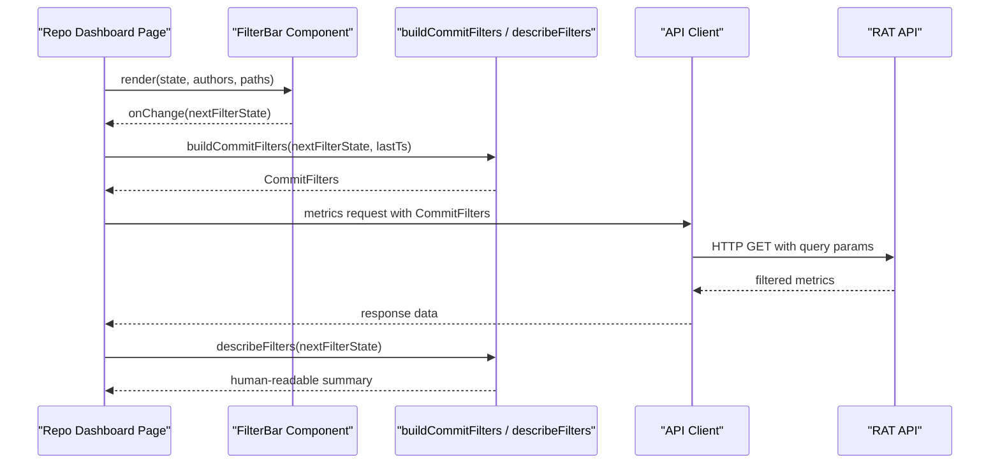
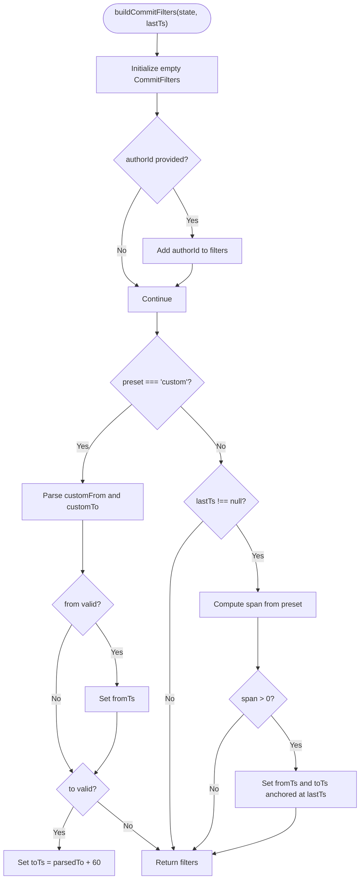
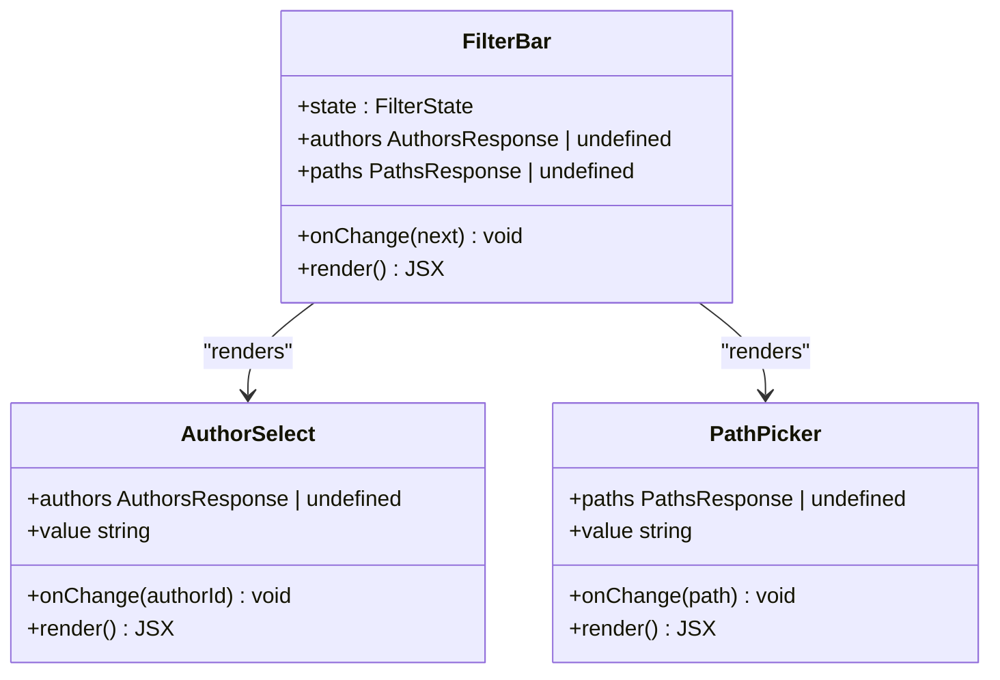
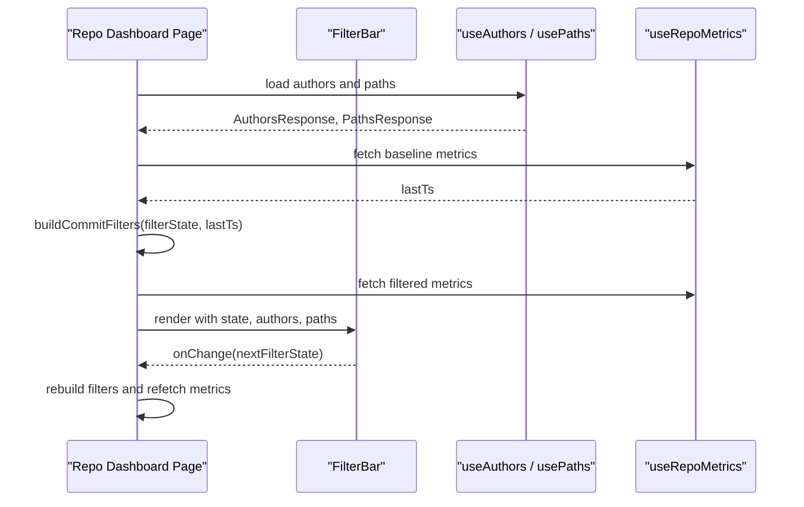
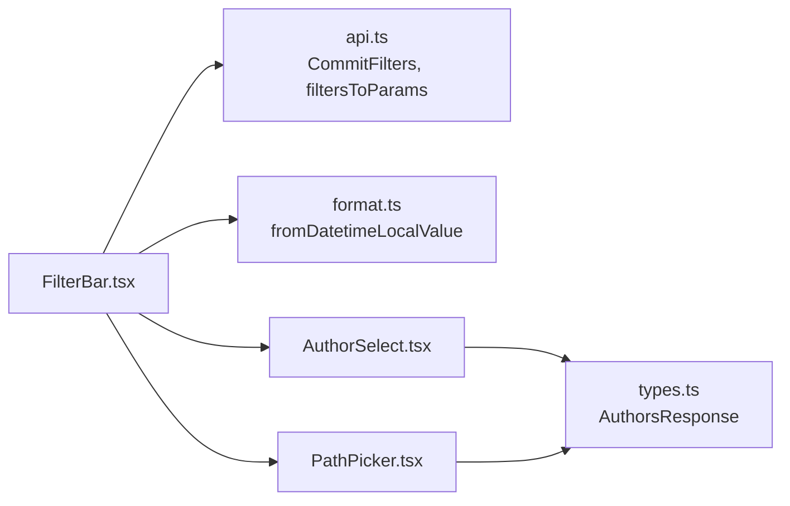

# Filter Bar Component

<cite>
**Referenced Files in This Document**
- [FilterBar.tsx](file://apps/web/src/components/filters/FilterBar.tsx)
- [AuthorSelect.tsx](file://apps/web/src/components/filters/AuthorSelect.tsx)
- [PathPicker.tsx](file://apps/web/src/components/filters/PathPicker.tsx)
- [api.ts](file://apps/web/src/lib/api.ts)
- [format.ts](file://apps/web/src/lib/format.ts)
- [page.tsx](file://apps/web/src/app/repos/[repoId]/page.tsx)
- [types.ts](file://packages/shared/src/types.ts)
</cite>

## Table of Contents
1. [Introduction](#introduction)
2. [Project Structure](#project-structure)
3. [Core Components](#core-components)
4. [Architecture Overview](#architecture-overview)
5. [Detailed Component Analysis](#detailed-component-analysis)
6. [Dependency Analysis](#dependency-analysis)
7. [Performance Considerations](#performance-considerations)
8. [Troubleshooting Guide](#troubleshooting-guide)
9. [Conclusion](#conclusion)

## Introduction
The FilterBar component is the main orchestrator of the repository dashboard filtering system. It acts as a controlled form container that coordinates three independent filter dimensions:

- Commit range selection through presets and custom datetime-local inputs.
- Author filtering using resolved author identifiers.
- Path scoping to directories or files.

It exposes a stable UI state model, helper functions for converting that state into API-compatible filters, and a human-readable summary generator. The parent page owns the actual state and data fetching, while FilterBar remains a presentational and coordination layer.

## Project Structure
The FilterBar lives under the web application’s components/filters directory and integrates with shared types from the packages/shared workspace. Its primary collaborators are:

- AuthorSelect for author dropdown selection.
- PathPicker for directory/file path scoping.
- lib/api for the CommitFilters contract and query parameter serialization.
- lib/format for datetime-local value conversion between user input and UNIX timestamps.
- The repository dashboard page for state ownership and metric queries.

**Diagram sources**
- [FilterBar.tsx:1-166](file://apps/web/src/components/filters/FilterBar.tsx#L1-L166)
- [AuthorSelect.tsx:1-36](file://apps/web/src/components/filters/AuthorSelect.tsx#L1-L36)
- [PathPicker.tsx:1-53](file://apps/web/src/components/filters/PathPicker.tsx#L1-L53)
- [api.ts:84-103](file://apps/web/src/lib/api.ts#L84-L103)
- [format.ts:38-49](file://apps/web/src/lib/format.ts#L38-L49)
- [types.ts:110-144](file://packages/shared/src/types.ts#L110-L144)

**Section sources**
- [FilterBar.tsx:1-166](file://apps/web/src/components/filters/FilterBar.tsx#L1-L166)
- [page.tsx:1-206](file://apps/web/src/app/repos/[repoId]/page.tsx#L1-L206)
- [api.ts:84-103](file://apps/web/src/lib/api.ts#L84-L103)
- [format.ts:38-49](file://apps/web/src/lib/format.ts#L38-L49)
- [types.ts:110-144](file://packages/shared/src/types.ts#L110-L144)

## Core Components
This section documents the public surface of the filtering system:

- RangePreset: A union type representing commit-range presets including all, last7, last30, last90, and custom.
- FilterState: The UI state interface describing current filter selections.
- EMPTY_FILTERS: A default unfiltered state used by the parent page.
- buildCommitFilters: Converts FilterState into CommitFilters suitable for API calls.
- describeFilters: Produces a human-readable summary string for active filters.
- FilterBar: The React component rendering the form controls.

Key responsibilities:

- Maintain a single source of truth for filter UI state.
- Provide deterministic conversion from UI values to backend filters.
- Render accessible form fields for range, author, and path.
- Expose a clear reset mechanism via the Clear filters button.

**Section sources**
- [FilterBar.tsx:11-31](file://apps/web/src/components/filters/FilterBar.tsx#L11-L31)
- [FilterBar.tsx:33-72](file://apps/web/src/components/filters/FilterBar.tsx#L33-L72)
- [FilterBar.tsx:74-166](file://apps/web/src/components/filters/FilterBar.tsx#L74-L166)

## Architecture Overview
The filtering architecture follows a unidirectional data flow:

1. The parent page holds FilterState in local state.
2. FilterBar renders controlled inputs and emits onChange updates.
3. The parent recomputes CommitFilters using buildCommitFilters.
4. Metrics and tables consume the computed filters.
5. describeFilters displays a concise summary of the active scope.

**Diagram sources**
- [page.tsx:35-47](file://apps/web/src/app/repos/[repoId]/page.tsx#L35-L47)
- [page.tsx:154-160](file://apps/web/src/app/repos/[repoId]/page.tsx#L154-L160)
- [FilterBar.tsx:38-57](file://apps/web/src/components/filters/FilterBar.tsx#L38-L57)
- [FilterBar.tsx:60-72](file://apps/web/src/components/filters/FilterBar.tsx#L60-L72)
- [api.ts:220-224](file://apps/web/src/lib/api.ts#L220-L224)

## Detailed Component Analysis

### FilterState Interface and State Model
FilterState models the complete UI state of the filter bar:

- preset: One of the predefined ranges or custom.
- customFrom: UTC datetime-local string for the start boundary.
- customTo: UTC datetime-local string for the inclusive end boundary.
- authorId: Empty string means all authors; otherwise a resolved author identifier.
- path: Empty string means whole repository; otherwise a directory or file path.

EMPTY_FILTERS represents an unfiltered baseline where the preset is all and all optional scopes are empty.

Complexity characteristics:

- State shape is small and flat, making shallow comparison and re-renders cheap.
- Preset-driven logic centralizes timestamp computation, reducing duplication across consumers.

**Section sources**
- [FilterBar.tsx:11-31](file://apps/web/src/components/filters/FilterBar.tsx#L11-L31)

### buildCommitFilters Function
buildCommitFilters converts FilterState into CommitFilters, which is the contract expected by the API client.

Behavior summary:

- If an author is selected, authorId is included.
- For custom ranges:
  - customFrom and customTo are parsed through fromDatetimeLocalValue.
  - fromTs is set when a valid start time exists.
  - toTs is set when a valid end time exists, plus 60 seconds because the API treats the upper bound as exclusive.
- For relative presets:
  - last7, last30, and last90 compute fromTs based on lastTs minus the number of days multiplied by seconds per day.
  - toTs is set to lastTs plus one second to include the latest minute.
- If lastTs is null, relative presets do not produce timestamp filters.

UTC handling:

- User-facing datetime-local values are treated as UTC strings.
- Conversion uses a Z-suffixed ISO parsing strategy to avoid timezone drift.
- Timestamps are normalized to UNIX seconds.

**Diagram sources**
- [FilterBar.tsx:38-57](file://apps/web/src/components/filters/FilterBar.tsx#L38-L57)
- [format.ts:44-49](file://apps/web/src/lib/format.ts#L44-L49)

**Section sources**
- [FilterBar.tsx:33-57](file://apps/web/src/components/filters/FilterBar.tsx#L33-L57)
- [format.ts:38-49](file://apps/web/src/lib/format.ts#L38-L49)
- [api.ts:84-103](file://apps/web/src/lib/api.ts#L84-L103)

### describeFilters Helper
describeFilters generates a human-readable summary of the active filters. It composes parts for:

- Time scope: all time, a named preset such as last 30 days, or a custom range with formatted timestamps.
- Author filter presence.
- Path scope presence.

The output is prefixed with a consistent label so it can be displayed directly in the UI.

Example behaviors:

- All time with no author or path produces a simple “all time” summary.
- Custom range shows readable timestamps with UTC notation.
- Named presets normalize labels like “last30” into “last 30 days”.
- Author and path filters are appended only when non-empty.

**Section sources**
- [FilterBar.tsx:59-72](file://apps/web/src/components/filters/FilterBar.tsx#L59-L72)

### FilterBar Component
FilterBar is a controlled form component that renders:

- Commit range selector with options for all, last7, last30, last90, and custom.
- Conditional datetime-local inputs for custom ranges.
- AuthorSelect for author filtering.
- PathPicker for directory or file scoping.
- Clear filters button that resets to EMPTY_FILTERS and is disabled when no changes exist.

State management pattern:

- The component receives state and onChange from the parent.
- Each control spreads the current state and updates only the relevant field.
- The Clear button replaces the entire state with EMPTY_FILTERS.

Accessibility and semantics:

- The form has an aria-label describing its purpose.
- Inputs have explicit labels and ids.
- The Clear button uses a ghost style and is disabled when there is nothing to clear.

**Diagram sources**
- [FilterBar.tsx:74-166](file://apps/web/src/components/filters/FilterBar.tsx#L74-L166)
- [AuthorSelect.tsx:6-35](file://apps/web/src/components/filters/AuthorSelect.tsx#L6-L35)
- [PathPicker.tsx:10-52](file://apps/web/src/components/filters/PathPicker.tsx#L10-L52)

**Section sources**
- [FilterBar.tsx:74-166](file://apps/web/src/components/filters/FilterBar.tsx#L74-L166)
- [AuthorSelect.tsx:1-36](file://apps/web/src/components/filters/AuthorSelect.tsx#L1-L36)
- [PathPicker.tsx:1-53](file://apps/web/src/components/filters/PathPicker.tsx#L1-L53)

### Integration with Parent Components
The repository dashboard page demonstrates the intended integration pattern:

- It imports FilterBar, EMPTY_FILTERS, buildCommitFilters, describeFilters, and FilterState.
- It stores filterState in local state initialized to EMPTY_FILTERS.
- It loads authors and paths through hooks.
- It computes baseline metrics to obtain lastTs, then builds CommitFilters.
- It passes the computed filters to metrics queries and table/chart components.
- It renders describeFilters next to the filter bar for immediate feedback.

**Diagram sources**
- [page.tsx:35-47](file://apps/web/src/app/repos/[repoId]/page.tsx#L35-L47)
- [page.tsx:154-160](file://apps/web/src/app/repos/[repoId]/page.tsx#L154-L160)

**Section sources**
- [page.tsx:1-206](file://apps/web/src/app/repos/[repoId]/page.tsx#L1-L206)

## Dependency Analysis
The FilterBar module depends on several well-defined contracts:

- CommitFilters defines the API-compatible filter shape with optional timestamp range, commit IDs, and author ID.
- AuthorsResponse and PathsResponse define the dropdown data shapes.
- fromDatetimeLocalValue provides safe conversion from datetime-local strings to UNIX seconds.
- filtersToParams serializes CommitFilters into URL query parameters.

**Diagram sources**
- [FilterBar.tsx:3-7](file://apps/web/src/components/filters/FilterBar.tsx#L3-L7)
- [api.ts:84-103](file://apps/web/src/lib/api.ts#L84-L103)
- [format.ts:44-49](file://apps/web/src/lib/format.ts#L44-L49)
- [types.ts:110-144](file://packages/shared/src/types.ts#L110-L144)

**Section sources**
- [FilterBar.tsx:1-8](file://apps/web/src/components/filters/FilterBar.tsx#L1-L8)
- [api.ts:84-103](file://apps/web/src/lib/api.ts#L84-L103)
- [format.ts:44-49](file://apps/web/src/lib/format.ts#L44-L49)
- [types.ts:110-144](file://packages/shared/src/types.ts#L110-L144)

## Performance Considerations
- FilterState is intentionally minimal and immutable-style, enabling efficient React re-renders when only one field changes.
- buildCommitFilters performs constant-time computations and avoids heavy object creation beyond the resulting CommitFilters object.
- Relative presets rely on lastTs from baseline metrics, avoiding repeated date calculations in child components.
- The Clear button is disabled when no meaningful filters are active, preventing unnecessary state updates.

[No sources needed since this section provides general guidance]

## Troubleshooting Guide
Common issues and resolutions:

- Custom range does not affect results:
  - Verify both customFrom and customTo are populated.
  - Ensure fromDatetimeLocalValue returns valid numbers; invalid or empty values are ignored.
  - Remember that toTs is exclusive; if you want to include the selected minute, the implementation adds 60 seconds automatically.

- Relative presets show no time range:
  - Relative presets require lastTs from baseline metrics.
  - If baseline metrics are still loading or unavailable, lastTs may be null, and no timestamp filters will be generated.

- Author filter has no effect:
  - Confirm that the selected authorId matches a resolved author identifier returned by the authors endpoint.
  - The API expects canonical author identifiers rather than raw email addresses.

- Path scope behaves unexpectedly:
  - Directory paths are applied as subtree prefixes.
  - File paths are matched exactly.
  - The parent page adjusts prefix behavior depending on whether the selected path is a directory.

- Summary text looks incorrect:
  - describeFilters formats preset names and custom timestamps.
  - If customFrom or customTo is empty, defaults such as “start” or “latest” are used in the summary.

**Section sources**
- [FilterBar.tsx:42-53](file://apps/web/src/components/filters/FilterBar.tsx#L42-L53)
- [FilterBar.tsx:60-72](file://apps/web/src/components/filters/FilterBar.tsx#L60-L72)
- [format.ts:44-49](file://apps/web/src/lib/format.ts#L44-L49)
- [page.tsx:49-54](file://apps/web/src/app/repos/[repoId]/page.tsx#L49-L54)

## Conclusion
FilterBar is a focused, stateless orchestrator that turns user-friendly filter selections into precise API filters. By separating UI state, conversion logic, and presentation, it keeps the dashboard predictable and testable. The combination of FilterState, buildCommitFilters, describeFilters, and the controlled form layout provides a robust foundation for filtering commits by time, author, and path while maintaining clear UX feedback and clean integration with the parent dashboard page.

[No sources needed since this section summarizes without analyzing specific files]