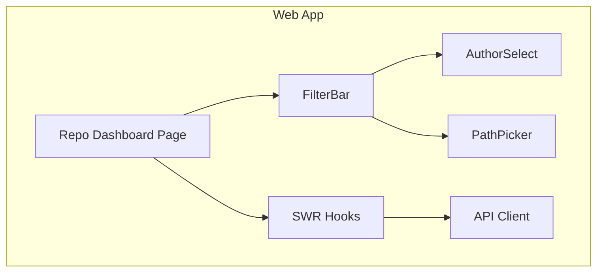
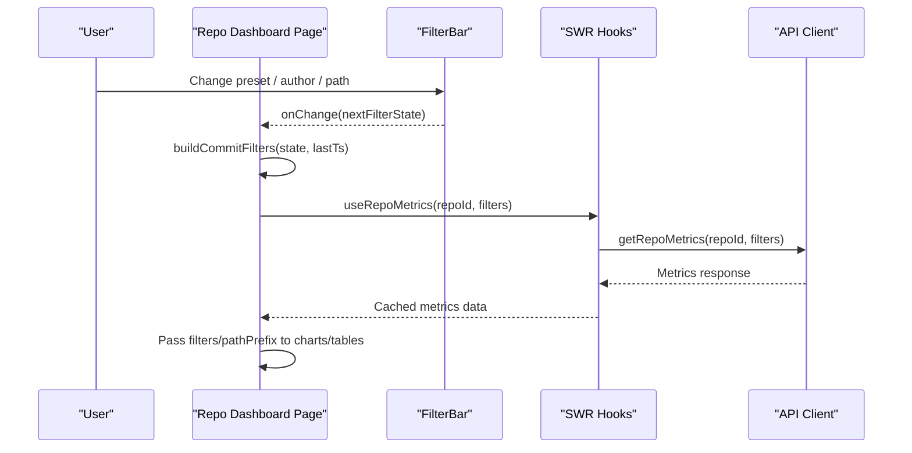
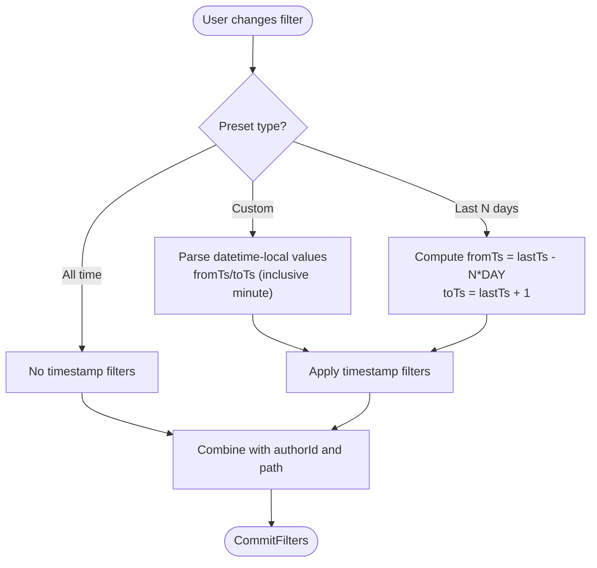
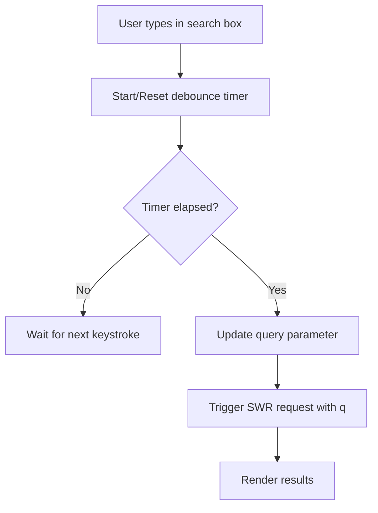
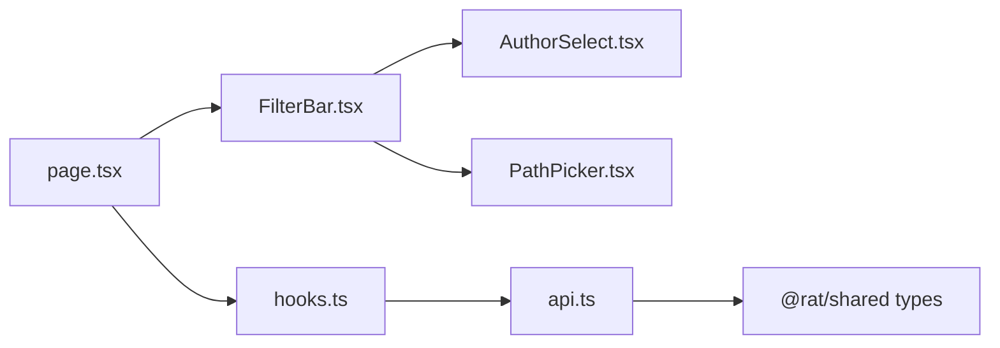

# Filtering & Search System

<cite>
**Referenced Files in This Document**
- [FilterBar.tsx](file://apps/web/src/components/filters/FilterBar.tsx)
- [AuthorSelect.tsx](file://apps/web/src/components/filters/AuthorSelect.tsx)
- [PathPicker.tsx](file://apps/web/src/components/filters/PathPicker.tsx)
- [page.tsx](file://apps/web/src/app/repos/[repoId]/page.tsx)
- [hooks.ts](file://apps/web/src/lib/hooks.ts)
- [api.ts](file://apps/web/src/lib/api.ts)
</cite>

## Table of Contents
1. [Introduction](#introduction)
2. [Project Structure](#project-structure)
3. [Core Components](#core-components)
4. [Architecture Overview](#architecture-overview)
5. [Detailed Component Analysis](#detailed-component-analysis)
6. [Dependency Analysis](#dependency-analysis)
7. [Performance Considerations](#performance-considerations)
8. [Troubleshooting Guide](#troubleshooting-guide)
9. [Conclusion](#conclusion)

## Introduction
This document explains the interactive filtering and search system used across repository metrics views. It covers:
- The filter bar supporting commit-range selection, author filtering, and path scoping.
- The author select dropdown and path picker for directory/file navigation.
- Filter state management, query parameter serialization, and data fetching integration.
- Practical filter combinations, debounced search patterns, and performance optimizations for large datasets.
- Accessibility features, keyboard navigation, and mobile responsiveness considerations.

The system is implemented as a client-side React application using SWR for data fetching and a shared API layer that serializes filters into URL query parameters.

## Project Structure
The filtering UI lives under the web application’s components and pages:
- `apps/web/src/components/filters` contains the reusable filter controls.
- `apps/web/src/app/repos/[repoId]/page.tsx` composes the dashboard page and owns the active filter state.
- `apps/web/src/lib/hooks.ts` provides SWR hooks that translate filters into stable cache keys and fetch metrics.
- `apps/web/src/lib/api.ts` defines the API client, filter serialization helpers, and error handling.

**Diagram sources**
- [page.tsx:35-205](file://apps/web/src/app/repos/[repoId]/page.tsx#L35-L205)
- [FilterBar.tsx:74-165](file://apps/web/src/components/filters/FilterBar.tsx#L74-L165)
- [AuthorSelect.tsx:6-34](file://apps/web/src/components/filters/AuthorSelect.tsx#L6-L34)
- [PathPicker.tsx:10-51](file://apps/web/src/components/filters/PathPicker.tsx#L10-L51)
- [hooks.ts:79-162](file://apps/web/src/lib/hooks.ts#L79-L162)
- [api.ts:89-103](file://apps/web/src/lib/api.ts#L89-L103)

**Section sources**
- [page.tsx:35-205](file://apps/web/src/app/repos/[repoId]/page.tsx#L35-L205)
- [FilterBar.tsx:74-165](file://apps/web/src/components/filters/FilterBar.tsx#L74-L165)
- [AuthorSelect.tsx:6-34](file://apps/web/src/components/filters/AuthorSelect.tsx#L6-L34)
- [PathPicker.tsx:10-51](file://apps/web/src/components/filters/PathPicker.tsx#L10-L51)
- [hooks.ts:79-162](file://apps/web/src/lib/hooks.ts#L79-L162)
- [api.ts:89-103](file://apps/web/src/lib/api.ts#L89-L103)

## Core Components
- FilterBar: Renders commit range presets, custom datetime inputs, author select, path picker, and a clear button. It also exports utilities to build API filters and describe the current filter set.
- AuthorSelect: A controlled select dropdown populated from resolved authors.
- PathPicker: A controlled select with grouped directories and files for path scoping.
- Repo Dashboard Page: Owns the active filter state, composes the filter bar, computes derived filters, and passes them to metric hooks and child components.
- Hooks: Provide SWR-based data fetching with stable cache keys derived from serialized filters.
- API: Defines CommitFilters, serializes filters to query parameters, and exposes typed endpoints.

Key responsibilities:
- State ownership: The repo page holds `filterState`.
- Compilation: `buildCommitFilters` converts UI state into API-compatible filters.
- Serialization: `filtersToParams` turns filters into URL query strings.
- Fetching: SWR hooks use `filterKey` to derive stable cache keys from serialized filters.

**Section sources**
- [FilterBar.tsx:11-57](file://apps/web/src/components/filters/FilterBar.tsx#L11-L57)
- [FilterBar.tsx:74-165](file://apps/web/src/components/filters/FilterBar.tsx#L74-L165)
- [AuthorSelect.tsx:6-34](file://apps/web/src/components/filters/AuthorSelect.tsx#L6-L34)
- [PathPicker.tsx:10-51](file://apps/web/src/components/filters/PathPicker.tsx#L10-L51)
- [page.tsx:35-47](file://apps/web/src/app/repos/[repoId]/page.tsx#L35-L47)
- [hooks.ts:30-33](file://apps/web/src/lib/hooks.ts#L30-L33)
- [api.ts:89-103](file://apps/web/src/lib/api.ts#L89-L103)

## Architecture Overview
The filtering flow connects UI interactions to data fetching through a consistent filter contract.

**Diagram sources**
- [page.tsx:35-47](file://apps/web/src/app/repos/[repoId]/page.tsx#L35-L47)
- [FilterBar.tsx:38-57](file://apps/web/src/components/filters/FilterBar.tsx#L38-L57)
- [hooks.ts:79-85](file://apps/web/src/lib/hooks.ts#L79-L85)
- [api.ts:220-224](file://apps/web/src/lib/api.ts#L220-L224)

## Detailed Component Analysis

### Filter Bar and Filter State Management
The filter bar manages:
- Commit range presets: All time, Last 7/30/90 days, or Custom range.
- Custom range: From/To datetime-local inputs interpreted as UTC timestamps.
- Author filter: Selected by author id.
- Path scope: Whole repository, directory subtree, or single file.

It compiles these into `CommitFilters`, which are consumed by all metric endpoints.

**Diagram sources**
- [FilterBar.tsx:38-57](file://apps/web/src/components/filters/FilterBar.tsx#L38-L57)

Key behaviors:
- Relative presets anchor to the repository’s newest commit (`lastTs`) so “last 30 days” means the final 30 days of recorded history.
- Custom range uses inclusive minutes on the “to” boundary by adding one minute before sending to the API.
- Empty author or path values mean “no filter”.

**Section sources**
- [FilterBar.tsx:11-57](file://apps/web/src/components/filters/FilterBar.tsx#L11-L57)

### Author Select Dropdown
The author select renders a controlled `<select>` populated from the resolved authors endpoint. It supports:
- Clearing the filter by selecting “All authors”.
- Displaying author name, email, and commit count for context.

Accessibility and UX:
- Uses an explicit label and id for screen readers.
- Controlled value ensures consistency with parent state.

Limitations:
- No built-in search/filtering within the dropdown; suitable when the author list is small. For larger lists, consider virtualization or a searchable combobox.

**Section sources**
- [AuthorSelect.tsx:6-34](file://apps/web/src/components/filters/AuthorSelect.tsx#L6-L34)

### Path Picker for Directory/File Navigation
The path picker renders grouped options for directories and files:
- Directories are applied as a subtree prefix.
- Files are matched exactly.
- Empty selection means the whole repository.

Integration with metrics:
- When a directory is selected, the page normalizes it to a trailing slash prefix for queries.
- Charts and tables receive either the raw path or normalized prefix depending on their needs.

**Section sources**
- [PathPicker.tsx:10-51](file://apps/web/src/components/filters/PathPicker.tsx#L10-L51)
- [page.tsx:49-54](file://apps/web/src/app/repos/[repoId]/page.tsx#L49-L54)

### Query Parameter Synchronization and URL-Based Filtering
Current implementation details:
- Filters are serialized to query parameters via `filtersToParams` and appended to API URLs.
- SWR cache keys include the serialized filter string, ensuring different filter sets map to distinct caches.
- The page does not currently read/write the browser URL for filters; filter state is local to the component.

Implications:
- Sharing a link will not preserve filters unless URL synchronization is added.
- Back/forward navigation does not reflect filter changes automatically.

Recommendation:
- Add URL sync to persist filters in the query string and hydrate state from the URL on mount. Use a lightweight router hook to keep state and URL in sync.

**Section sources**
- [api.ts:74-82](file://apps/web/src/lib/api.ts#L74-L82)
- [api.ts:96-103](file://apps/web/src/lib/api.ts#L96-L103)
- [hooks.ts:30-33](file://apps/web/src/lib/hooks.ts#L30-L33)

### Debounced Search Implementation
While the current filter controls do not implement debounce, the commit search pattern can be debounced to reduce network requests during typing.

Recommended approach:
- Maintain a local search term state.
- Debounce updates to the query parameter (e.g., 250–300ms).
- Cancel previous requests when a new search starts.
- Integrate with the existing `useCommits` hook by passing the debounced query.

[No sources needed since this diagram shows conceptual workflow, not actual code structure]

### Examples of Filter Combinations
- Time-only: “Last 30 days” without author or path.
- Author-only: Specific author across all time.
- Path-only: Directory subtree across all time.
- Combined: “Last 7 days” + specific author + directory subtree.
- Custom range: Custom from/to dates + author + file path.

These combinations are supported by composing fields in `FilterState`; only non-empty fields are included in the resulting `CommitFilters`.

**Section sources**
- [FilterBar.tsx:38-57](file://apps/web/src/components/filters/FilterBar.tsx#L38-L57)

## Dependency Analysis
The following diagram maps how components and libraries depend on each other for filtering and data retrieval.

**Diagram sources**
- [FilterBar.tsx:1-8](file://apps/web/src/components/filters/FilterBar.tsx#L1-L8)
- [AuthorSelect.tsx:1-4](file://apps/web/src/components/filters/AuthorSelect.tsx#L1-L4)
- [PathPicker.tsx:1-4](file://apps/web/src/components/filters/PathPicker.tsx#L1-L4)
- [page.tsx:1-23](file://apps/web/src/app/repos/[repoId]/page.tsx#L1-L23)
- [hooks.ts:1-10](file://apps/web/src/lib/hooks.ts#L1-L10)
- [api.ts:1-15](file://apps/web/src/lib/api.ts#L1-L15)

Coupling and cohesion:
- FilterBar is cohesive around filter UI and filter compilation.
- Hooks encapsulate SWR configuration and cache key generation.
- API layer centralizes request building and error mapping.

Potential circular dependencies:
- None observed; imports are unidirectional from UI to hooks to API.

External dependencies:
- SWR for caching and background refetching.
- Shared TypeScript types from `@rat/shared`.

**Section sources**
- [hooks.ts:30-33](file://apps/web/src/lib/hooks.ts#L30-L33)
- [api.ts:22-41](file://apps/web/src/lib/api.ts#L22-L41)

## Performance Considerations
- Stable cache keys: `filterKey` serializes filters to JSON, ensuring distinct caches per filter combination.
- Keep previous data: Many hooks use `keepPreviousData: true` to avoid flicker while switching filters.
- Live refresh: Background polling is enabled only while repositories/jobs are busy, reducing unnecessary traffic.
- Path normalization: Directory paths are normalized to prefixes to leverage server-side filtering efficiently.
- Large datasets:
  - Prefer server-side pagination and sorting where available.
  - Avoid rendering massive option lists directly; consider virtualized selects or lazy loading for very large author/path lists.
  - Debounce search input to limit request frequency.
  - Use memoization for expensive computations in charts and tables.

[No sources needed since this section provides general guidance]

## Troubleshooting Guide
Common issues and resolutions:
- Network errors: The API client throws structured `ApiError` instances with codes and messages. Surface these in banners and provide retry actions.
- Repository not found: The page handles `REPO_NOT_FOUND` specifically and displays a user-friendly message.
- Stale data after filter change: Ensure hooks use `keepPreviousData` and stable keys; verify that filter serialization includes all relevant fields.
- Incorrect time ranges: Confirm that custom datetime inputs are treated as UTC and that the “to” boundary is inclusive by adding one minute before sending to the API.

**Section sources**
- [api.ts:22-41](file://apps/web/src/lib/api.ts#L22-L41)
- [page.tsx:62-77](file://apps/web/src/app/repos/[repoId]/page.tsx#L62-L77)
- [FilterBar.tsx:42-47](file://apps/web/src/components/filters/FilterBar.tsx#L42-L47)

## Conclusion
The filtering and search system centers on a clean separation between UI state, filter compilation, and data fetching. The filter bar composes commit range, author, and path filters into a unified `CommitFilters` contract consumed by all metric endpoints. SWR ensures efficient caching and minimal re-renders. To further improve usability:
- Add URL synchronization for shareable, bookmarkable filter states.
- Implement debounced search for commit queries.
- Enhance accessibility with ARIA attributes and keyboard navigation for dropdowns and tabs.
- Optimize large datasets with virtualization and server-side pagination.

[No sources needed since this section summarizes without analyzing specific files]