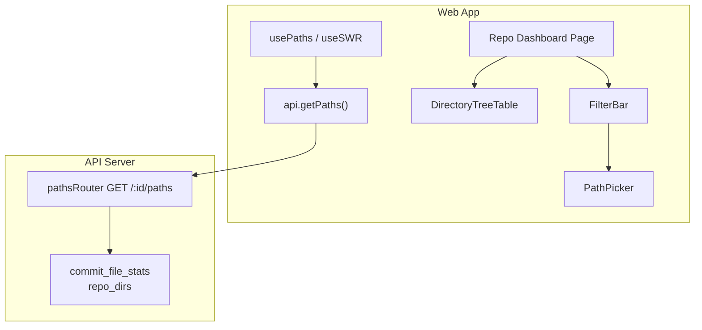
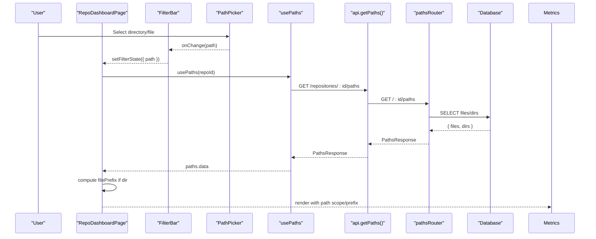
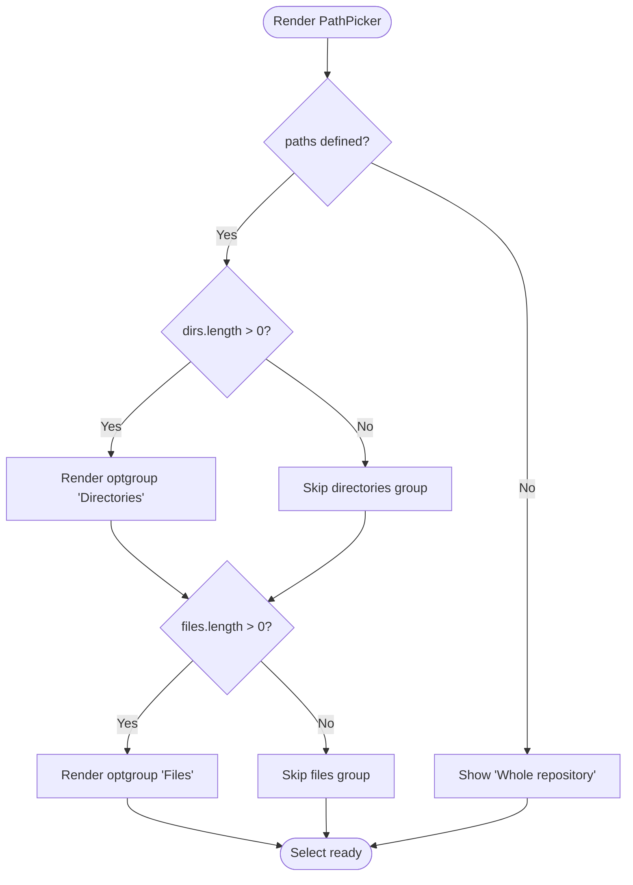
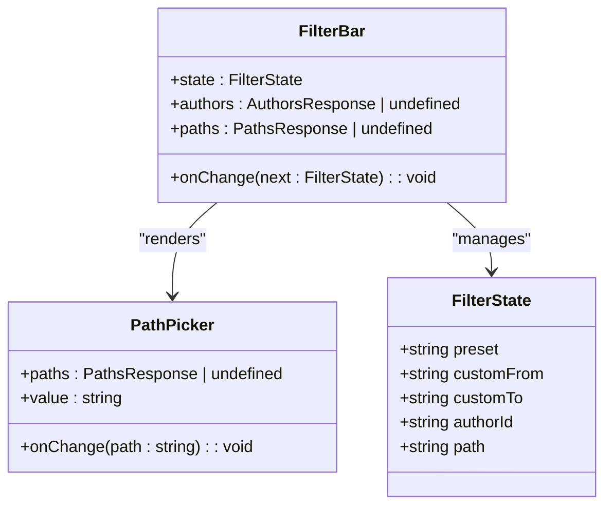
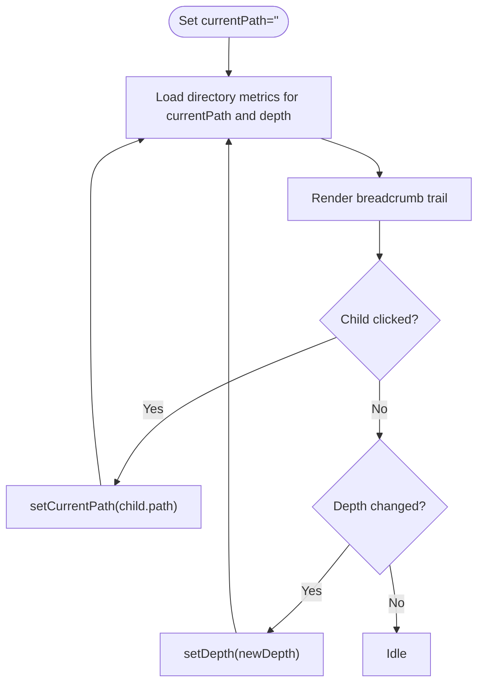
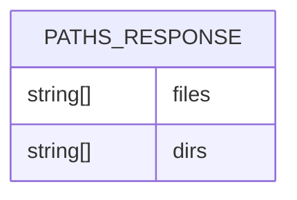
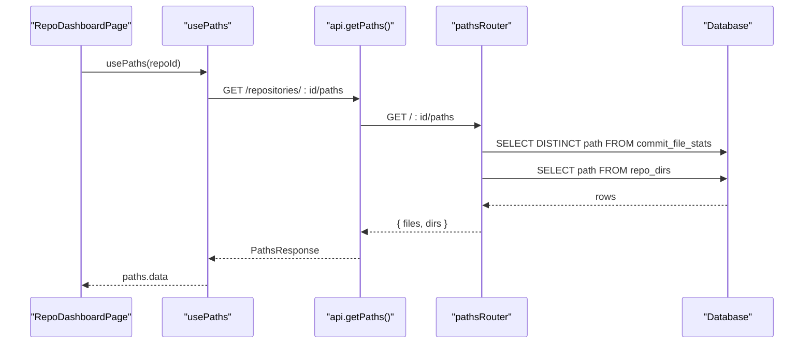
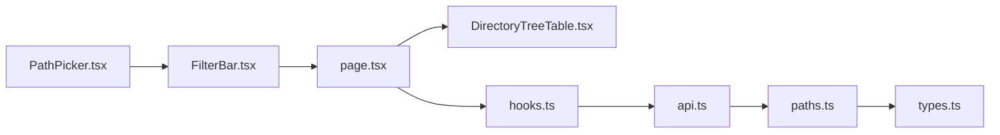

# Path Picker Component

<cite>
**Referenced Files in This Document**
- [PathPicker.tsx](file://apps/web/src/components/filters/PathPicker.tsx)
- [FilterBar.tsx](file://apps/web/src/components/filters/FilterBar.tsx)
- [page.tsx](file://apps/web/src/app/repos/[repoId]/page.tsx)
- [DirectoryTreeTable.tsx](file://apps/web/src/components/metrics/DirectoryTreeTable.tsx)
- [types.ts](file://packages/shared/src/types.ts)
- [paths.ts](file://apps/api/src/routes/paths.ts)
- [api.ts](file://apps/web/src/lib/api.ts)
- [hooks.ts](file://apps/web/src/lib/hooks.ts)
</cite>

## Table of Contents
1. [Introduction](#introduction)
2. [Project Structure](#project-structure)
3. [Core Components](#core-components)
4. [Architecture Overview](#architecture-overview)
5. [Detailed Component Analysis](#detailed-component-analysis)
6. [Dependency Analysis](#dependency-analysis)
7. [Performance Considerations](#performance-considerations)
8. [Troubleshooting Guide](#troubleshooting-guide)
9. [Conclusion](#conclusion)

## Introduction
This document explains the PathPicker component and its role in filtering repository paths across the dashboard. It covers:
- How path selection drives metrics views (files, authors, churn charts).
- The PathsResponse data structure representing files and directories.
- Directory navigation patterns via the separate Directories tab.
- Search capabilities for large codebases.
- Accessibility, keyboard navigation, and mobile responsiveness considerations.
- Performance optimizations for deep directory structures.

## Project Structure
The PathPicker is part of a larger dashboard that combines filters, metrics tables, and charts. Key integration points:
- PathPicker renders inside FilterBar.
- FilterBar state updates drive metrics queries with a path prefix or scope.
- The page composes filters, metrics, and tabs including a dedicated tree view for directories.

**Diagram sources**
- [page.tsx:35-200](file://apps/web/src/app/repos/[repoId]/page.tsx#L35-L200)
- [FilterBar.tsx:74-166](file://apps/web/src/components/filters/FilterBar.tsx#L74-L166)
- [PathPicker.tsx:1-52](file://apps/web/src/components/filters/PathPicker.tsx#L1-L52)
- [DirectoryTreeTable.tsx:24-178](file://apps/web/src/components/metrics/DirectoryTreeTable.tsx#L24-L178)
- [hooks.ts:71-73](file://apps/web/src/lib/hooks.ts#L71-L73)
- [api.ts:199-201](file://apps/web/src/lib/api.ts#L199-L201)
- [paths.ts:10-24](file://apps/api/src/routes/paths.ts#L10-L24)

**Section sources**
- [page.tsx:35-200](file://apps/web/src/app/repos/[repoId]/page.tsx#L35-L200)
- [FilterBar.tsx:74-166](file://apps/web/src/components/filters/FilterBar.tsx#L74-L166)

## Core Components
- PathPicker: A controlled select that lets users choose a whole-repository scope, a directory subtree, or a single file.
- FilterBar: Hosts PathPicker and other filters; converts UI state into commit-set filters and displays a human-readable summary.
- DirectoryTreeTable: Provides hierarchical navigation within the Directories tab, independent from PathPicker but complementary.
- PathsResponse: Shared type describing the list of files and directories used by PathPicker.

Key responsibilities:
- PathPicker exposes a simple value/onChange contract to update the active path filter.
- FilterBar persists the selected path in global filter state and passes it to downstream components.
- DirectoryTreeTable enables drill-down browsing with breadcrumbs and depth control.

**Section sources**
- [PathPicker.tsx:1-52](file://apps/web/src/components/filters/PathPicker.tsx#L1-L52)
- [FilterBar.tsx:13-31](file://apps/web/src/components/filters/FilterBar.tsx#L13-L31)
- [DirectoryTreeTable.tsx:24-178](file://apps/web/src/components/metrics/DirectoryTreeTable.tsx#L24-L178)
- [types.ts:139-144](file://packages/shared/src/types.ts#L139-L144)

## Architecture Overview
The PathPicker integrates with the API through a SWR hook to fetch available paths and directories. The selected path influences:
- File metrics table via a path prefix.
- Author metrics via a path scope.
- Churn over time chart via a path scope.

**Diagram sources**
- [PathPicker.tsx:10-50](file://apps/web/src/components/filters/PathPicker.tsx#L10-L50)
- [FilterBar.tsx:147-151](file://apps/web/src/components/filters/FilterBar.tsx#L147-L151)
- [page.tsx:49-54](file://apps/web/src/app/repos/[repoId]/page.tsx#L49-L54)
- [hooks.ts:71-73](file://apps/web/src/lib/hooks.ts#L71-L73)
- [api.ts:199-201](file://apps/web/src/lib/api.ts#L199-L201)
- [paths.ts:10-24](file://apps/api/src/routes/paths.ts#L10-L24)

## Detailed Component Analysis

### PathPicker Component
Purpose:
- Renders a labeled select with three scopes:
  - Whole repository (empty string).
  - Directories (grouped optgroup).
  - Files (grouped optgroup).
- Emits onChange with the selected path string.

Props:
- paths: PathsResponse | undefined — source of directories and files.
- value: string — currently selected path.
- onChange: (path: string) => void — callback to update parent state.

Behavior:
- If no paths are loaded, only “Whole repository” is shown.
- Directories and files are conditionally rendered when present.
- Each directory option appends a trailing slash visually, while the underlying value remains the directory path.

Accessibility:
- Uses a label associated with the select via htmlFor/id.
- Grouping with optgroup improves screen reader semantics.

Keyboard navigation:
- Standard HTML select behavior supports arrow keys and Enter to confirm.

Mobile responsiveness:
- Inherits layout classes from the parent field container; width adapts to the surrounding form layout.

Integration:
- Controlled by FilterBar’s state.path and updates it via onChange.

**Diagram sources**
- [PathPicker.tsx:19-50](file://apps/web/src/components/filters/PathPicker.tsx#L19-L50)

**Section sources**
- [PathPicker.tsx:1-52](file://apps/web/src/components/filters/PathPicker.tsx#L1-L52)

### FilterBar Integration
Responsibilities:
- Holds FilterState including path.
- Renders PathPicker and forwards changes to parent state.
- Builds CommitFilters for time-based filtering and author scoping.

Path handling:
- When a directory is selected, the page computes a filePrefix by appending a trailing slash to ensure subtree matching.
- The path is also included in the human-readable filter summary.

**Diagram sources**
- [FilterBar.tsx:13-31](file://apps/web/src/components/filters/FilterBar.tsx#L13-L31)
- [FilterBar.tsx:74-166](file://apps/web/src/components/filters/FilterBar.tsx#L74-L166)
- [PathPicker.tsx:10-50](file://apps/web/src/components/filters/PathPicker.tsx#L10-L50)

**Section sources**
- [FilterBar.tsx:74-166](file://apps/web/src/components/filters/FilterBar.tsx#L74-L166)

### Directory Tree Navigation (Directories Tab)
While PathPicker provides quick selection, the Directories tab offers deeper exploration:
- Breadcrumb trail showing current path segments.
- Clickable child directories to drill down.
- Depth selector to control how many levels below the current directory are returned.

Navigation flow:
- Users click a child directory to navigate deeper.
- Breadcrumb buttons allow jumping back to any ancestor.
- Depth affects the number of descendant levels displayed.

**Diagram sources**
- [DirectoryTreeTable.tsx:9-18](file://apps/web/src/components/metrics/DirectoryTreeTable.tsx#L9-L18)
- [DirectoryTreeTable.tsx:31-37](file://apps/web/src/components/metrics/DirectoryTreeTable.tsx#L31-L37)
- [DirectoryTreeTable.tsx:54-87](file://apps/web/src/components/metrics/DirectoryTreeTable.tsx#L54-L87)
- [DirectoryTreeTable.tsx:139-168](file://apps/web/src/components/metrics/DirectoryTreeTable.tsx#L139-L168)

**Section sources**
- [DirectoryTreeTable.tsx:24-178](file://apps/web/src/components/metrics/DirectoryTreeTable.tsx#L24-L178)

### PathsResponse Data Structure
Definition:
- files: string[] — all file paths that ever existed in the analyzed history.
- dirs: string[] — all directory paths excluding the repository root.

Usage:
- Populates PathPicker options.
- Used by the page to determine whether a selected path is a directory and adjust the file prefix accordingly.

Data source:
- API endpoint returns distinct file paths from commit_file_stats and directory paths from repo_dirs, both ordered alphabetically.

**Diagram sources**
- [types.ts:139-144](file://packages/shared/src/types.ts#L139-L144)
- [paths.ts:12-23](file://apps/api/src/routes/paths.ts#L12-L23)

**Section sources**
- [types.ts:139-144](file://packages/shared/src/types.ts#L139-L144)
- [paths.ts:10-24](file://apps/api/src/routes/paths.ts#L10-L24)

### Data Flow and State Management
- usePaths(repoId) fetches PathsResponse using SWR.
- api.getPaths calls GET /repositories/:id/paths.
- RepoDashboardPage composes filter state and passes paths to FilterBar.
- PathPicker updates filterState.path on change.
- Page computes filePrefix based on whether the selected path is a directory.

**Diagram sources**
- [hooks.ts:71-73](file://apps/web/src/lib/hooks.ts#L71-L73)
- [api.ts:199-201](file://apps/web/src/lib/api.ts#L199-L201)
- [paths.ts:10-24](file://apps/api/src/routes/paths.ts#L10-L24)

**Section sources**
- [hooks.ts:71-73](file://apps/web/src/lib/hooks.ts#L71-L73)
- [api.ts:199-201](file://apps/web/src/lib/api.ts#L199-L201)
- [paths.ts:10-24](file://apps/api/src/routes/paths.ts#L10-L24)

## Dependency Analysis
Component relationships:
- PathPicker depends on PathsResponse type and is controlled by FilterBar.
- FilterBar composes multiple filters and updates global state.
- RepoDashboardPage orchestrates data fetching and rendering of metrics views.
- DirectoryTreeTable is independent of PathPicker but complements it for deep navigation.

External dependencies:
- SWR hooks for caching and revalidation.
- Express router and database queries for serving paths.

Potential coupling:
- PathPicker assumes paths.dirs and paths.files are arrays of strings.
- Page logic assumes directory paths match entries in paths.dirs to compute filePrefix.

**Diagram sources**
- [PathPicker.tsx:1-52](file://apps/web/src/components/filters/PathPicker.tsx#L1-L52)
- [FilterBar.tsx:74-166](file://apps/web/src/components/filters/FilterBar.tsx#L74-L166)
- [page.tsx:35-200](file://apps/web/src/app/repos/[repoId]/page.tsx#L35-L200)
- [DirectoryTreeTable.tsx:24-178](file://apps/web/src/components/metrics/DirectoryTreeTable.tsx#L24-L178)
- [hooks.ts:71-73](file://apps/web/src/lib/hooks.ts#L71-L73)
- [api.ts:199-201](file://apps/web/src/lib/api.ts#L199-L201)
- [paths.ts:10-24](file://apps/api/src/routes/paths.ts#L10-L24)
- [types.ts:139-144](file://packages/shared/src/types.ts#L139-L144)

**Section sources**
- [page.tsx:35-200](file://apps/web/src/app/repos/[repoId]/page.tsx#L35-L200)
- [FilterBar.tsx:74-166](file://apps/web/src/components/filters/FilterBar.tsx#L74-L166)
- [PathPicker.tsx:1-52](file://apps/web/src/components/filters/PathPicker.tsx#L1-L52)
- [DirectoryTreeTable.tsx:24-178](file://apps/web/src/components/metrics/DirectoryTreeTable.tsx#L24-L178)

## Performance Considerations
- Large path lists:
  - PathsResponse returns all files and directories; consider client-side search/filtering if the list grows very large.
  - Debounce user input when implementing search to reduce re-renders.
- Directory navigation:
  - Use the depth selector in DirectoryTreeTable to limit the number of descendants fetched and rendered.
- Caching:
  - SWR caches PathsResponse per repository; avoid unnecessary refetches by leveraging default SWR behavior.
- Backend ordering:
  - Files and directories are sorted alphabetically; this aids consistent UI rendering and predictable search results.

[No sources needed since this section provides general guidance]

## Troubleshooting Guide
Common issues:
- Empty PathPicker options:
  - Ensure the repository is ready and PathsResponse contains entries.
  - Verify the API endpoint returns non-empty files and dirs arrays.
- Incorrect subtree filtering:
  - Confirm the selected path exists in paths.dirs before computing filePrefix with a trailing slash.
- Network errors:
  - Check API_BASE configuration and CORS settings.
  - Inspect ApiError details for HTTP status and server message.

Debugging steps:
- Validate PathsResponse shape matches types.ts definition.
- Log filterState.path and computed filePrefix to ensure correct propagation.
- Use browser dev tools to inspect network requests to /repositories/:id/paths.

**Section sources**
- [api.ts:22-41](file://apps/web/src/lib/api.ts#L22-L41)
- [page.tsx:49-54](file://apps/web/src/app/repos/[repoId]/page.tsx#L49-L54)
- [types.ts:139-144](file://packages/shared/src/types.ts#L139-L144)

## Conclusion
The PathPicker component provides a straightforward way to scope metrics by repository, directory subtree, or individual file. It integrates cleanly with FilterBar and the broader dashboard, complementing the Deep Directory navigation provided by DirectoryTreeTable. For large repositories, combine client-side search, SWR caching, and depth-limited directory traversal to maintain performance and usability. Accessibility features like labels and grouping improve screen reader support, while standard HTML select behavior ensures keyboard navigation works out of the box.

[No sources needed since this section summarizes without analyzing specific files]