# Frontend Dashboard

<cite>
**Referenced Files in This Document**
- [layout.tsx](file://apps/web/src/app/layout.tsx)
- [page.tsx](file://apps/web/src/app/page.tsx)
- [repo-page.tsx](file://apps/web/src/app/repos/[repoId]/page.tsx)
- [api.ts](file://apps/web/src/lib/api.ts)
- [hooks.ts](file://apps/web/src/lib/hooks.ts)
- [FilterBar.tsx](file://apps/web/src/components/filters/FilterBar.tsx)
- [MetricCards.tsx](file://apps/web/src/components/metrics/MetricCards.tsx)
- [FileMetricsTable.tsx](file://apps/web/src/components/metrics/FileMetricsTable.tsx)
- [DirectoryTreeTable.tsx](file://apps/web/src/components/metrics/DirectoryTreeTable.tsx)
- [AuthorMetricsTable.tsx](file://apps/web/src/components/metrics/AuthorMetricsTable.tsx)
- [ChurnOverTimeChart.tsx](file://apps/web/src/components/metrics/charts/ChurnOverTimeChart.tsx)
- [TopFilesChart.tsx](file://apps/web/src/components/metrics/charts/TopFilesChart.tsx)
- [IngestTabs.tsx](file://apps/web/src/components/ingest/IngestTabs.tsx)
- [globals.css](file://apps/web/src/styles/globals.css)
- [Design.md](file://Design.md)
</cite>

## Table of Contents
1. [Introduction](#introduction)
2. [Project Structure](#project-structure)
3. [Core Components](#core-components)
4. [Architecture Overview](#architecture-overview)
5. [Detailed Component Analysis](#detailed-component-analysis)
6. [Dependency Analysis](#dependency-analysis)
7. [Performance Considerations](#performance-considerations)
8. [Troubleshooting Guide](#troubleshooting-guide)
9. [Conclusion](#conclusion)

## Introduction
This document describes the Next.js dashboard frontend for the repository analysis tool. It explains the App Router structure, page components, layout hierarchy, and the four main dashboard tabs: Overview, Files, Directories, and Authors. It also documents the interactive filtering system (commit-range selection, author filtering, path scoping), data fetching with SWR hooks, API client implementation, state management patterns, UI components such as ingestion forms and filter bar, metric visualizations, responsive design based on Design.md tokens, accessibility considerations, real-time updates during ingestion, error handling, and loading states.

## Project Structure
The web application is a Next.js app using the App Router under `apps/web/src/app`. The root layout provides global metadata, header, navigation, and footer. The home page lists repositories and ingestion actions. A dynamic route `repos/[repoId]` renders the repository dashboard with tabs and filters. Shared logic lives under `lib`, reusable UI under `components`, and styling under `styles`.

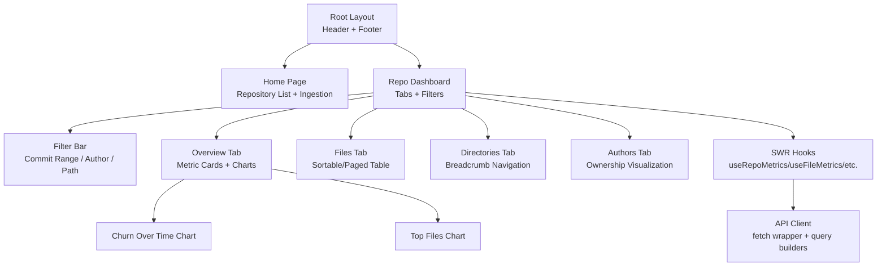

**Diagram sources**
- [layout.tsx:12-38](file://apps/web/src/app/layout.tsx#L12-L38)
- [page.tsx:119-214](file://apps/web/src/app/page.tsx#L119-L214)
- [repo-page.tsx:35-205](file://apps/web/src/app/repos/[repoId]/page.tsx#L35-L205)
- [FilterBar.tsx:74-165](file://apps/web/src/components/filters/FilterBar.tsx#L74-L165)
- [MetricCards.tsx:30-88](file://apps/web/src/components/metrics/MetricCards.tsx#L30-L88)
- [FileMetricsTable.tsx:55-192](file://apps/web/src/components/metrics/FileMetricsTable.tsx#L55-L192)
- [DirectoryTreeTable.tsx:24-177](file://apps/web/src/components/metrics/DirectoryTreeTable.tsx#L24-L177)
- [AuthorMetricsTable.tsx:23-142](file://apps/web/src/components/metrics/AuthorMetricsTable.tsx#L23-L142)
- [ChurnOverTimeChart.tsx:54-141](file://apps/web/src/components/metrics/charts/ChurnOverTimeChart.tsx#L54-L141)
- [TopFilesChart.tsx:47-119](file://apps/web/src/components/metrics/charts/TopFilesChart.tsx#L47-L119)
- [hooks.ts:39-162](file://apps/web/src/lib/hooks.ts#L39-L162)
- [api.ts:122-268](file://apps/web/src/lib/api.ts#L122-L268)

**Section sources**
- [layout.tsx:1-39](file://apps/web/src/app/layout.tsx#L1-L39)
- [page.tsx:1-215](file://apps/web/src/app/page.tsx#L1-L215)
- [repo-page.tsx:1-206](file://apps/web/src/app/repos/[repoId]/page.tsx#L1-L206)

## Core Components
- Root layout defines site-wide HTML, metadata, header, primary navigation, and footer.
- Home page displays an ingestion panel and a list of repositories with status badges, progress, delete actions, and error banners.
- Repository dashboard page implements tabbed views and a shared filter bar that drives all metrics queries.
- Metric cards summarize commit count, added/removed lines, growth, churn, modifications, churn rate, and modification frequency.
- File table supports sorting by multiple columns and pagination.
- Directory tree shows breadcrumb navigation and drill-down into subdirectories with configurable depth.
- Author table shows per-author metrics and ownership percentage bars.
- Charts visualize churn over time and top files by churn; clicking a top file scopes the dashboard to that path.

**Section sources**
- [layout.tsx:12-38](file://apps/web/src/app/layout.tsx#L12-L38)
- [page.tsx:119-214](file://apps/web/src/app/page.tsx#L119-L214)
- [repo-page.tsx:35-205](file://apps/web/src/app/repos/[repoId]/page.tsx#L35-L205)
- [MetricCards.tsx:30-88](file://apps/web/src/components/metrics/MetricCards.tsx#L30-L88)
- [FileMetricsTable.tsx:55-192](file://apps/web/src/components/metrics/FileMetricsTable.tsx#L55-L192)
- [DirectoryTreeTable.tsx:24-177](file://apps/web/src/components/metrics/DirectoryTreeTable.tsx#L24-L177)
- [AuthorMetricsTable.tsx:23-142](file://apps/web/src/components/metrics/AuthorMetricsTable.tsx#L23-L142)
- [ChurnOverTimeChart.tsx:54-141](file://apps/web/src/components/metrics/charts/ChurnOverTimeChart.tsx#L54-L141)
- [TopFilesChart.tsx:47-119](file://apps/web/src/components/metrics/charts/TopFilesChart.tsx#L47-L119)

## Architecture Overview
The dashboard uses a client-side architecture:
- Pages are React Server Components or Client Components depending on interactivity.
- Data fetching is centralized through SWR hooks that wrap typed API methods.
- Filters are composed from UI state into commit-set parameters and passed to every metric endpoint.
- Real-time updates use SWR polling while jobs or repositories are busy.

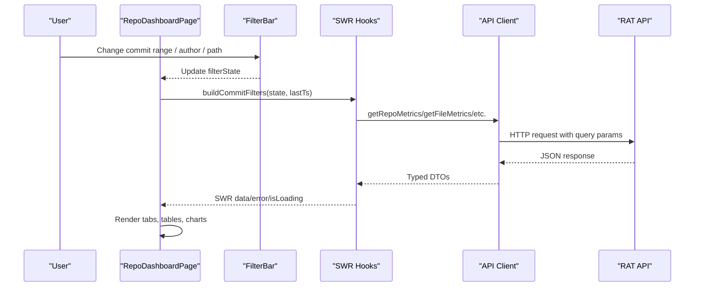

**Diagram sources**
- [repo-page.tsx:35-205](file://apps/web/src/app/repos/[repoId]/page.tsx#L35-L205)
- [FilterBar.tsx:38-57](file://apps/web/src/components/filters/FilterBar.tsx#L38-L57)
- [hooks.ts:79-162](file://apps/web/src/lib/hooks.ts#L79-L162)
- [api.ts:96-103](file://apps/web/src/lib/api.ts#L96-L103)
- [api.ts:220-268](file://apps/web/src/lib/api.ts#L220-L268)

## Detailed Component Analysis

### App Router Structure and Layout Hierarchy
- Root layout sets metadata, imports global styles, and renders header, nav, main content area, and footer.
- Home page (`/`) lists repositories and provides ingestion via tabs.
- Dynamic route `/repos/[repoId]` renders the dashboard with tabs and filters.

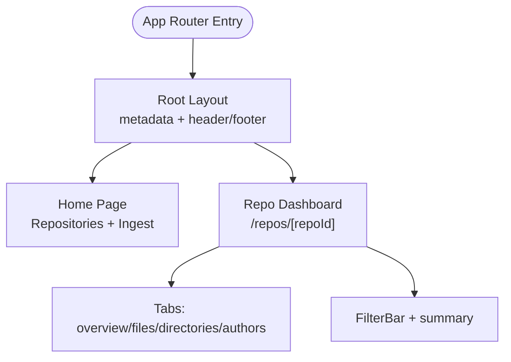

**Diagram sources**
- [layout.tsx:6-38](file://apps/web/src/app/layout.tsx#L6-L38)
- [page.tsx:119-214](file://apps/web/src/app/page.tsx#L119-L214)
- [repo-page.tsx:35-205](file://apps/web/src/app/repos/[repoId]/page.tsx#L35-L205)

**Section sources**
- [layout.tsx:1-39](file://apps/web/src/app/layout.tsx#L1-L39)
- [page.tsx:1-215](file://apps/web/src/app/page.tsx#L1-L215)
- [repo-page.tsx:1-206](file://apps/web/src/app/repos/[repoId]/page.tsx#L1-L206)

### Interactive Filtering System
- Filter state includes preset ranges, custom datetime inputs, author id, and path scope.
- `buildCommitFilters` converts UI state into API commit filters anchored to the repository’s latest timestamp.
- `describeFilters` produces a human-readable summary shown above the tabs.
- Changes propagate to all metrics queries through SWR keys.

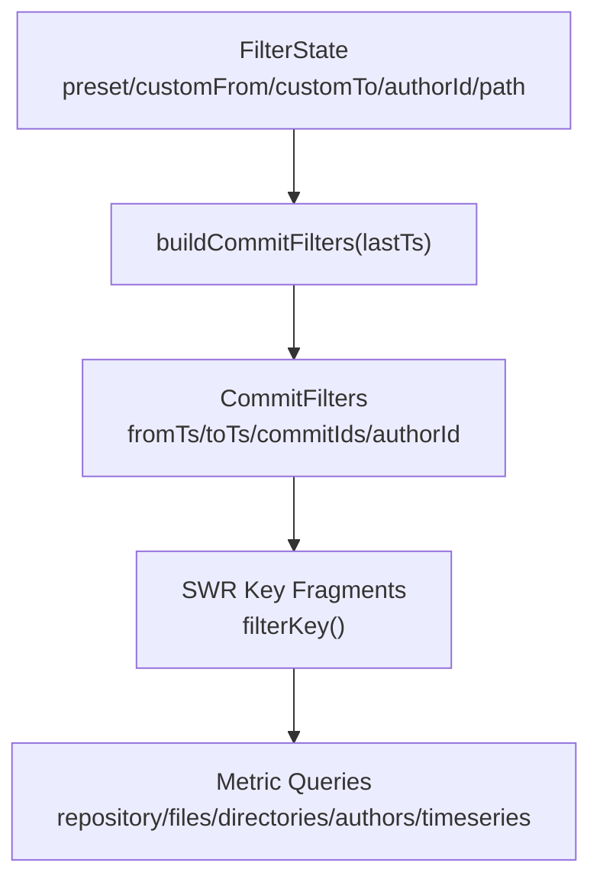

**Diagram sources**
- [FilterBar.tsx:13-31](file://apps/web/src/components/filters/FilterBar.tsx#L13-L31)
- [FilterBar.tsx:38-57](file://apps/web/src/components/filters/FilterBar.tsx#L38-L57)
- [FilterBar.tsx:60-72](file://apps/web/src/components/filters/FilterBar.tsx#L60-L72)
- [hooks.ts:30-33](file://apps/web/src/lib/hooks.ts#L30-L33)

**Section sources**
- [FilterBar.tsx:1-166](file://apps/web/src/components/filters/FilterBar.tsx#L1-L166)
- [repo-page.tsx:35-60](file://apps/web/src/app/repos/[repoId]/page.tsx#L35-L60)

### Data Fetching Architecture and State Management
- API client wraps fetch with structured errors, query string building, and typed endpoints.
- SWR hooks provide caching, background revalidation, and live polling for busy jobs/repositories.
- Stable key fragments ensure cache coherence across filter changes.
- `keepPreviousData` prevents flicker when filters change.

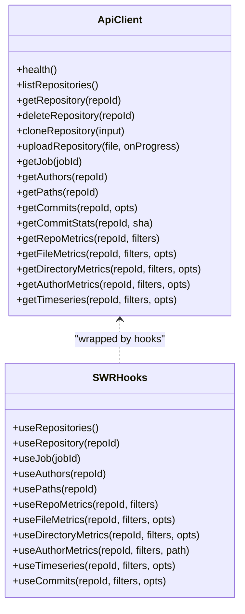

**Diagram sources**
- [api.ts:17-268](file://apps/web/src/lib/api.ts#L17-L268)
- [hooks.ts:39-162](file://apps/web/src/lib/hooks.ts#L39-L162)

**Section sources**
- [api.ts:1-269](file://apps/web/src/lib/api.ts#L1-L269)
- [hooks.ts:1-163](file://apps/web/src/lib/hooks.ts#L1-L163)

### Overview Tab: Metric Cards and Charts
- Metric cards display aggregate statistics for the current commit set.
- Churn over time chart shows added/removed lines and commit counts with day/week buckets.
- Top files chart highlights files with highest churn and allows scoping the dashboard to a selected file.

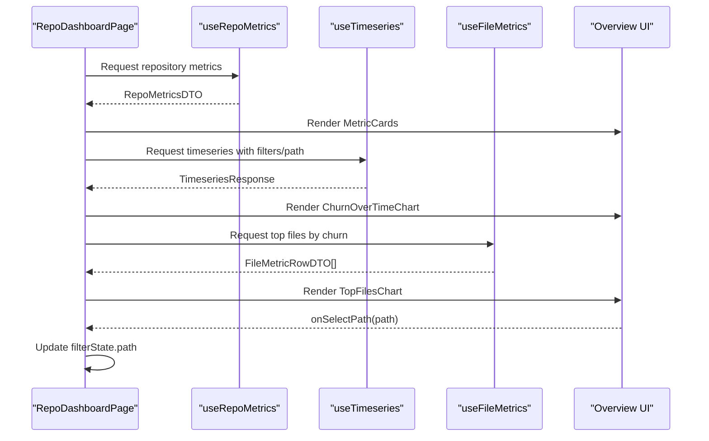

**Diagram sources**
- [repo-page.tsx:178-193](file://apps/web/src/app/repos/[repoId]/page.tsx#L178-L193)
- [MetricCards.tsx:30-88](file://apps/web/src/components/metrics/MetricCards.tsx#L30-L88)
- [ChurnOverTimeChart.tsx:54-141](file://apps/web/src/components/metrics/charts/ChurnOverTimeChart.tsx#L54-L141)
- [TopFilesChart.tsx:47-119](file://apps/web/src/components/metrics/charts/TopFilesChart.tsx#L47-L119)
- [hooks.ts:79-147](file://apps/web/src/lib/hooks.ts#L79-L147)

**Section sources**
- [repo-page.tsx:178-193](file://apps/web/src/app/repos/[repoId]/page.tsx#L178-L193)
- [MetricCards.tsx:1-89](file://apps/web/src/components/metrics/MetricCards.tsx#L1-L89)
- [ChurnOverTimeChart.tsx:1-142](file://apps/web/src/components/metrics/charts/ChurnOverTimeChart.tsx#L1-L142)
- [TopFilesChart.tsx:1-120](file://apps/web/src/components/metrics/charts/TopFilesChart.tsx#L1-L120)

### Files Tab: Sortable and Paged File Table
- Supports sorting by multiple numeric and text columns with default orders.
- Paginates results server-side via `page` and `pageSize`.
- Shows skeleton loaders, empty states, and error banners.

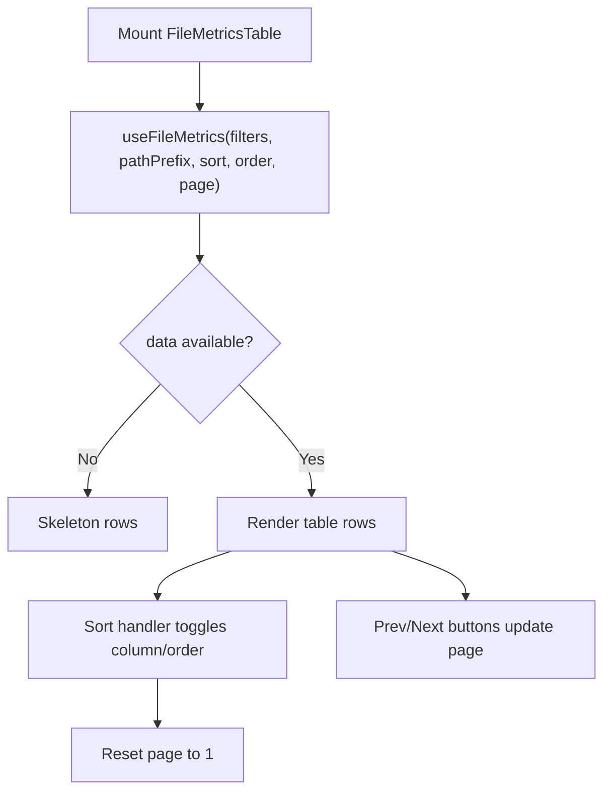

**Diagram sources**
- [FileMetricsTable.tsx:55-192](file://apps/web/src/components/metrics/FileMetricsTable.tsx#L55-L192)
- [hooks.ts:87-108](file://apps/web/src/lib/hooks.ts#L87-L108)

**Section sources**
- [FileMetricsTable.tsx:1-193](file://apps/web/src/components/metrics/FileMetricsTable.tsx#L1-L193)

### Directories Tab: Breadcrumb Navigation
- Renders a breadcrumb trail and a summary row for the current directory.
- Allows drilling into descendant directories up to configurable depth.
- Displays metrics for self and children.

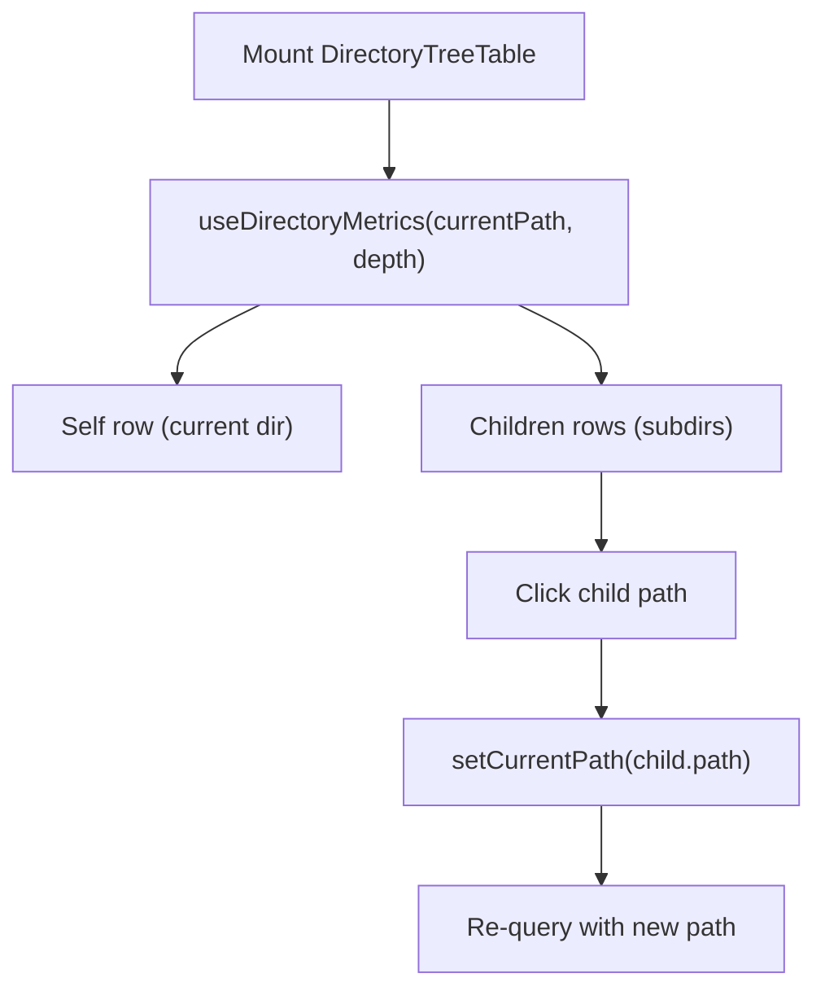

**Diagram sources**
- [DirectoryTreeTable.tsx:24-177](file://apps/web/src/components/metrics/DirectoryTreeTable.tsx#L24-L177)
- [hooks.ts:110-122](file://apps/web/src/lib/hooks.ts#L110-L122)

**Section sources**
- [DirectoryTreeTable.tsx:1-178](file://apps/web/src/components/metrics/DirectoryTreeTable.tsx#L1-L178)

### Authors Tab: Ownership Visualization
- Displays per-author metrics including commits, added/removed lines, modifications, churn, and ownership fraction.
- Uses resolution kind badges to indicate canonical, mailmap, or other identity resolution.
- Visualizes ownership as a bar plus percentage.

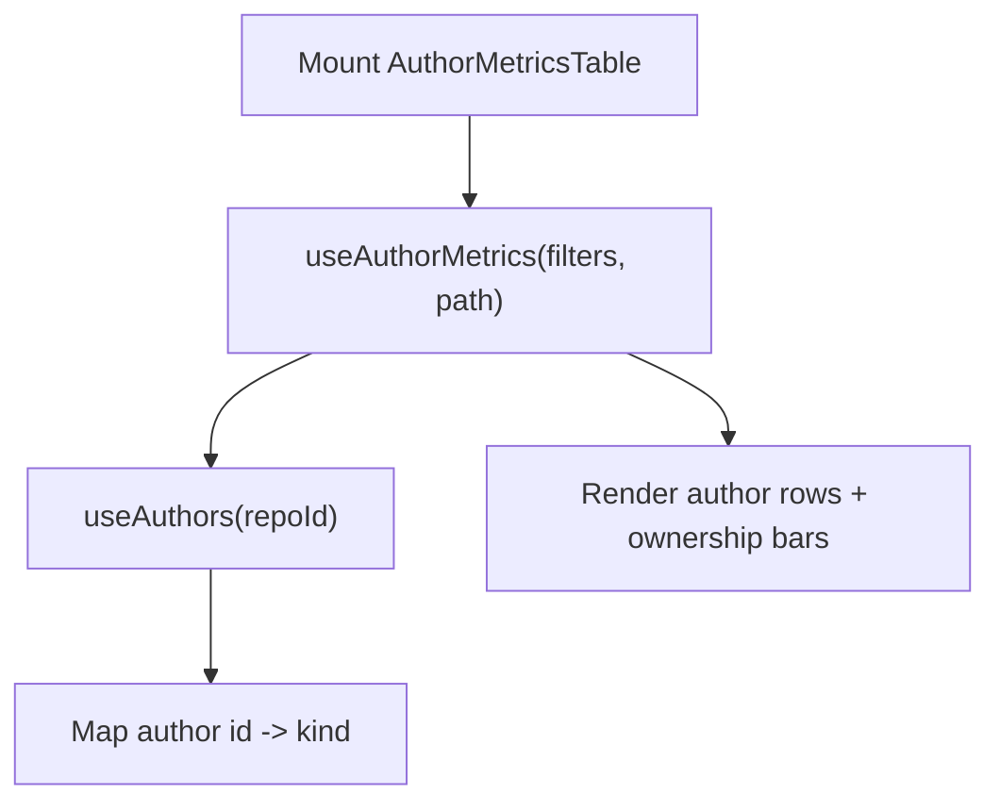

**Diagram sources**
- [AuthorMetricsTable.tsx:23-142](file://apps/web/src/components/metrics/AuthorMetricsTable.tsx#L23-L142)
- [hooks.ts:124-133](file://apps/web/src/lib/hooks.ts#L124-L133)
- [hooks.ts:67-69](file://apps/web/src/lib/hooks.ts#L67-L69)

**Section sources**
- [AuthorMetricsTable.tsx:1-143](file://apps/web/src/components/metrics/AuthorMetricsTable.tsx#L1-L143)

### Ingestion Forms and Job Progress
- Ingestion panel offers two modes: upload zip or clone URL.
- After creation, the repository list refreshes and scrolls to the list.
- Job progress is displayed inline for queued/processing repositories.

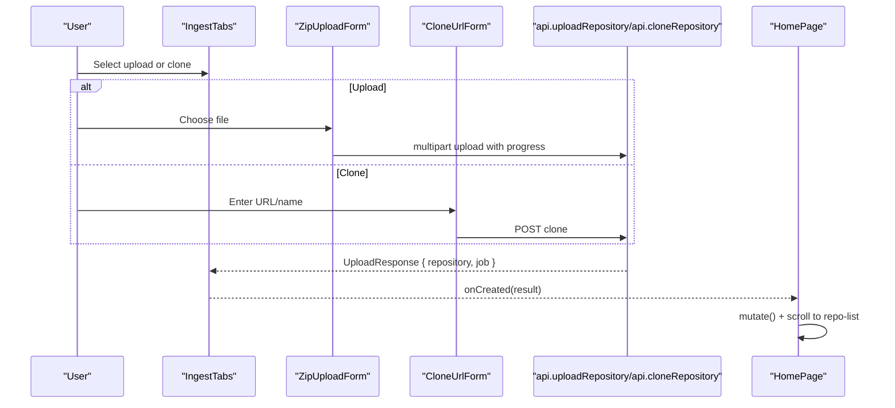

**Diagram sources**
- [IngestTabs.tsx:11-51](file://apps/web/src/components/ingest/IngestTabs.tsx#L11-L51)
- [page.tsx:155-160](file://apps/web/src/app/page.tsx#L155-L160)
- [api.ts:139-189](file://apps/web/src/lib/api.ts#L139-L189)

**Section sources**
- [IngestTabs.tsx:1-52](file://apps/web/src/components/ingest/IngestTabs.tsx#L1-L52)
- [page.tsx:119-214](file://apps/web/src/app/page.tsx#L119-L214)
- [api.ts:139-189](file://apps/web/src/lib/api.ts#L139-L189)

### Styling Approach and Accessibility
- Global CSS implements Design.md tokens: colors, typography, spacing, radii, elevation, focus rings, and semantic status extensions.
- Focus treatment follows mandated 2px accent outline plus inset ring.
- Components use semantic roles and aria attributes for tabs, groups, labels, and images.
- Responsive behavior aligns with measured breakpoints and container widths.

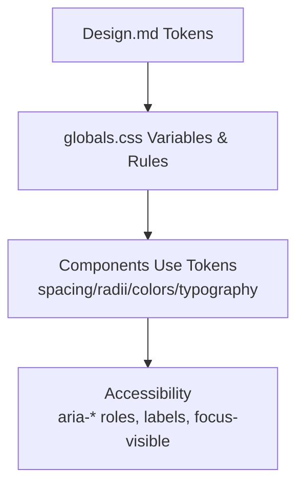

**Diagram sources**
- [Design.md:388-842](file://Design.md#L388-L842)
- [globals.css:1-200](file://apps/web/src/styles/globals.css#L1-L200)

**Section sources**
- [globals.css:1-200](file://apps/web/src/styles/globals.css#L1-L200)
- [Design.md:388-842](file://Design.md#L388-L842)

## Dependency Analysis
The dashboard components depend on SWR hooks, which depend on the API client. Pages compose multiple hooks to render different tabs. Charts reuse file metrics for top files and timeseries for churn visualization.

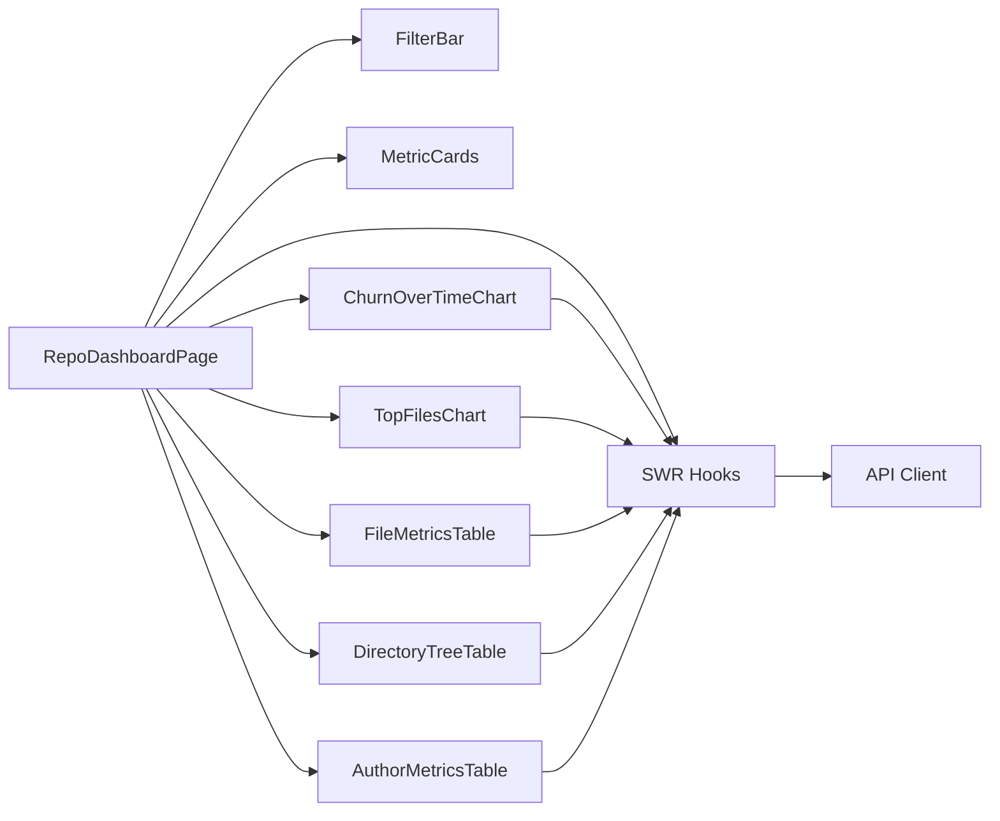

**Diagram sources**
- [repo-page.tsx:35-205](file://apps/web/src/app/repos/[repoId]/page.tsx#L35-L205)
- [hooks.ts:39-162](file://apps/web/src/lib/hooks.ts#L39-L162)
- [api.ts:122-268](file://apps/web/src/lib/api.ts#L122-L268)

**Section sources**
- [repo-page.tsx:1-206](file://apps/web/src/app/repos/[repoId]/page.tsx#L1-L206)
- [hooks.ts:1-163](file://apps/web/src/lib/hooks.ts#L1-L163)
- [api.ts:1-269](file://apps/web/src/lib/api.ts#L1-L269)

## Performance Considerations
- SWR polling cadence adapts to repository/job status to avoid unnecessary requests.
- `keepPreviousData` reduces visual flicker during filter transitions.
- Pagination limits client memory usage and reduces payload size for large file sets.
- Charts compute lightweight derived values (e.g., negated removals) locally to minimize rendering overhead.

[No sources needed since this section provides general guidance]

## Troubleshooting Guide
- Network/API reachability: The API client throws structured errors with codes like `NETWORK` and `HTTP_ERROR`; pages surface these in banners.
- Missing repository: The dashboard page detects `REPO_NOT_FOUND` and shows a specific message with retry.
- Empty datasets: Tables and charts show empty states when no data matches the active filters.
- Loading states: Skeleton placeholders appear for repositories, tables, and charts until data arrives.
- Real-time updates: Busy repositories and jobs trigger periodic revalidation; once finished, polling stops.

**Section sources**
- [api.ts:22-69](file://apps/web/src/lib/api.ts#L22-L69)
- [repo-page.tsx:62-89](file://apps/web/src/app/repos/[repoId]/page.tsx#L62-L89)
- [FileMetricsTable.tsx:90-96](file://apps/web/src/components/metrics/FileMetricsTable.tsx#L90-L96)
- [ChurnOverTimeChart.tsx:96-103](file://apps/web/src/components/metrics/charts/ChurnOverTimeChart.tsx#L96-L103)
- [hooks.ts:15-28](file://apps/web/src/lib/hooks.ts#L15-L28)

## Conclusion
The dashboard provides a cohesive, token-driven interface for exploring repository analytics. Its App Router structure separates repository listing from detailed analysis. The filter bar centralizes commit-range, author, and path scoping, driving consistent metrics across tabs. SWR-based data fetching ensures efficient caching and real-time updates during ingestion. The UI balances developer-focused clarity with accessible interactions and responsive layouts aligned to the design system.