# Ingestion Pipeline

<cite>
**Referenced Files in This Document**
- [pipeline.ts](file://apps/api/src/ingest/pipeline.ts)
- [queue.ts](file://apps/api/src/jobs/queue.ts)
- [jobStore.ts](file://apps/api/src/jobs/jobStore.ts)
- [cloneSource.ts](file://apps/api/src/ingest/cloneSource.ts)
- [zipSource.ts](file://apps/api/src/ingest/zipSource.ts)
- [validateRepo.ts](file://apps/api/src/ingest/validateRepo.ts)
- [analyzeCommits.ts](file://apps/api/src/analysis/analyzeCommits.ts)
- [finalize.ts](file://apps/api/src/analysis/finalize.ts)
- [gitRunner.ts](file://apps/api/src/git/gitRunner.ts)
- [zipSafe.ts](file://apps/api/src/util/zipSafe.ts)
- [repositories.ts](file://apps/api/src/routes/repositories.ts)
- [jobs.ts](file://apps/api/src/routes/jobs.ts)
- [repoStore.ts](file://apps/api/src/db/repoStore.ts)
- [config.ts](file://apps/api/src/config.ts)
- [services.ts](file://apps/api/src/services.ts)
- [types.ts](file://packages/shared/src/types.ts)
</cite>

## Table of Contents
1. [Introduction](#introduction)
2. [Project Structure](#project-structure)
3. [Core Components](#core-components)
4. [Architecture Overview](#architecture-overview)
5. [Detailed Component Analysis](#detailed-component-analysis)
6. [Dependency Analysis](#dependency-analysis)
7. [Performance Considerations](#performance-considerations)
8. [Troubleshooting Guide](#troubleshooting-guide)
9. [Conclusion](#conclusion)

## Introduction
This document explains the ingestion pipeline subsystem that turns a repository source into analyzed, queryable data. The system supports two ingestion sources:
- Zip upload with safe extraction and Git directory discovery.
- Remote URL cloning using a full mirror clone.

The pipeline is asynchronous, runs through a FIFO queue with concurrency one, and progresses through clearly defined phases: source extraction or cloning, validation, commit analysis, and finalization. Job state, progress, and errors are persisted so the UI can poll long-running operations safely.

## Project Structure
The ingestion pipeline spans several modules:
- Routes accept uploads or clone requests and enqueue jobs.
- A single-concurrency FIFO queue serializes ingestion tasks.
- The pipeline orchestrates zip extraction or remote cloning, Git validation, commit analysis, and finalization.
- Job store tracks job lifecycle and phase progress.
- Repository store tracks repository status and storage paths.
- Git runner spawns `git` commands with timeouts and streaming output.
- Shared types define DTOs for API responses.

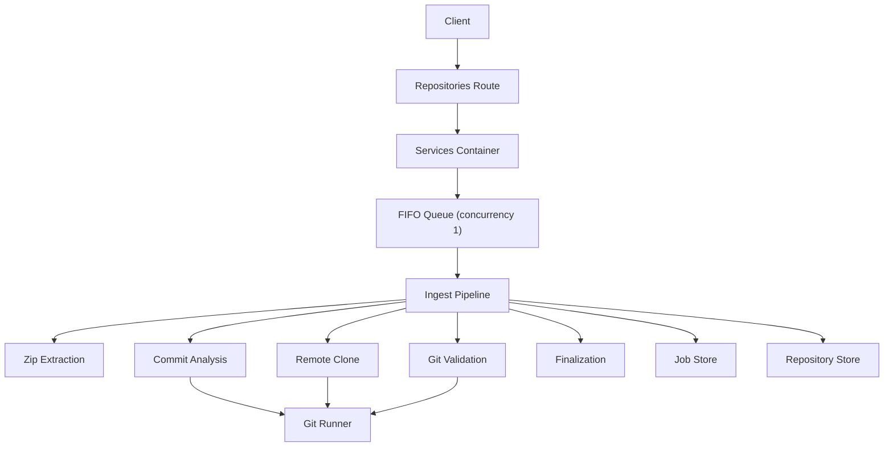

**Diagram sources**
- [repositories.ts:72-135](file://apps/api/src/routes/repositories.ts#L72-L135)
- [services.ts:18-24](file://apps/api/src/services.ts#L18-L24)
- [queue.ts:15-54](file://apps/api/src/jobs/queue.ts#L15-L54)
- [pipeline.ts:41-130](file://apps/api/src/ingest/pipeline.ts#L41-L130)
- [zipSource.ts:27-209](file://apps/api/src/ingest/zipSource.ts#L27-L209)
- [cloneSource.ts:41-63](file://apps/api/src/ingest/cloneSource.ts#L41-L63)
- [validateRepo.ts:15-42](file://apps/api/src/ingest/validateRepo.ts#L15-L42)
- [analyzeCommits.ts:38-151](file://apps/api/src/analysis/analyzeCommits.ts#L38-L151)
- [finalize.ts:10-24](file://apps/api/src/analysis/finalize.ts#L10-L24)
- [gitRunner.ts:55-147](file://apps/api/src/git/gitRunner.ts#L55-L147)

**Section sources**
- [repositories.ts:72-135](file://apps/api/src/routes/repositories.ts#L72-L135)
- [services.ts:18-24](file://apps/api/src/services.ts#L18-L24)
- [queue.ts:15-54](file://apps/api/src/jobs/queue.ts#L15-L54)
- [pipeline.ts:41-130](file://apps/api/src/ingest/pipeline.ts#L41-L130)

## Core Components
- In-process FIFO queue with concurrency one ensures predictable DB writes and disk I/O while the UI polls job status.
- Job store persists job lifecycle states and phases, including progress updates.
- Pipeline coordinates multi-stage ingestion and maps internal progress to overall job progress.
- Zip extractor enforces safety constraints and locates the usable Git directory.
- Clone handler performs a full mirror clone with progress parsing and timeout handling.
- Validator checks HEAD resolution and non-empty history before analysis.
- Analyzer streams Git log output, batches inserts, and computes directories.
- Finalizer materializes derived directory metadata and marks the repository ready.

**Section sources**
- [queue.ts:1-55](file://apps/api/src/jobs/queue.ts#L1-L55)
- [jobStore.ts:1-129](file://apps/api/src/jobs/jobStore.ts#L1-L129)
- [pipeline.ts:16-146](file://apps/api/src/ingest/pipeline.ts#L16-L146)
- [zipSource.ts:1-210](file://apps/api/src/ingest/zipSource.ts#L1-L210)
- [cloneSource.ts:1-64](file://apps/api/src/ingest/cloneSource.ts#L1-L64)
- [validateRepo.ts:1-43](file://apps/api/src/ingest/validateRepo.ts#L1-L43)
- [analyzeCommits.ts:1-153](file://apps/api/src/analysis/analyzeCommits.ts#L1-L153)
- [finalize.ts:1-25](file://apps/api/src/analysis/finalize.ts#L1-L25)

## Architecture Overview
The ingestion architecture separates concerns across routes, services, queue, pipeline, and storage layers.

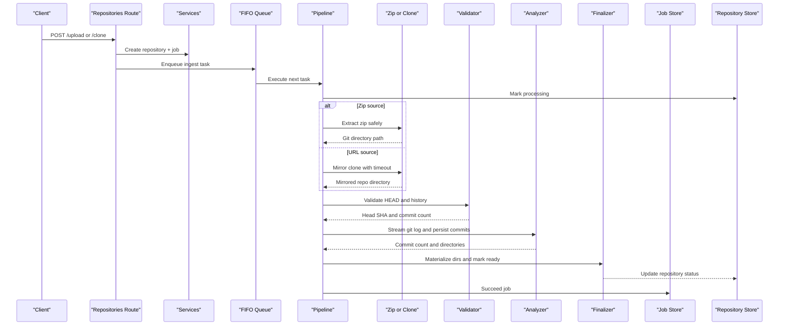

**Diagram sources**
- [repositories.ts:84-135](file://apps/api/src/routes/repositories.ts#L84-L135)
- [pipeline.ts:44-130](file://apps/api/src/ingest/pipeline.ts#L44-L130)
- [zipSource.ts:202-209](file://apps/api/src/ingest/zipSource.ts#L202-L209)
- [cloneSource.ts:41-63](file://apps/api/src/ingest/cloneSource.ts#L41-L63)
- [validateRepo.ts:15-42](file://apps/api/src/ingest/validateRepo.ts#L15-L42)
- [analyzeCommits.ts:38-151](file://apps/api/src/analysis/analyzeCommits.ts#L38-L151)
- [finalize.ts:10-24](file://apps/api/src/analysis/finalize.ts#L10-L24)
- [repoStore.ts:48-62](file://apps/api/src/db/repoStore.ts#L48-L62)

## Detailed Component Analysis

### Asynchronous Job Processing and Concurrency Control
The queue implements an in-process FIFO queue with concurrency one. Tasks are enqueued and executed sequentially. Errors from pipeline tasks are swallowed at the queue level because the pipeline handles and persists its own errors.

Key behaviors:
- Enqueue adds a task and immediately attempts to run it.
- Running sets a flag and invokes the task asynchronously.
- On completion or error, the queue clears the running flag and processes the next task.
- Test helpers expose size and idle waiting.

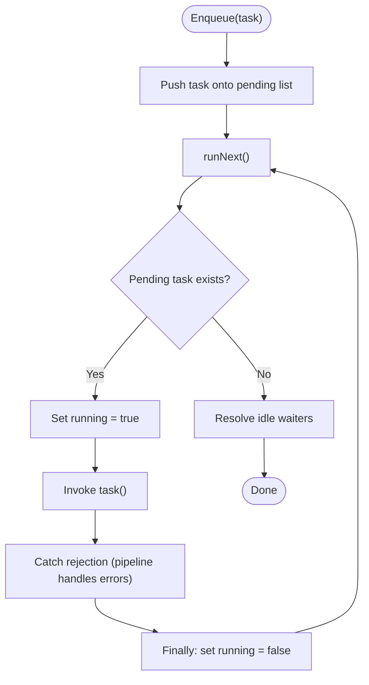

**Diagram sources**
- [queue.ts:15-54](file://apps/api/src/jobs/queue.ts#L15-L54)

**Section sources**
- [queue.ts:1-55](file://apps/api/src/jobs/queue.ts#L1-L55)

### Multi-Stage Pipeline Orchestration
The pipeline defines four major stages with progress boundaries:
- Source start/end: zip extraction or remote cloning.
- Validating: HEAD resolution and non-empty history.
- Analyzing: streaming commit analysis.
- Finalizing: materializing directories and marking repository ready.

The pipeline:
- Marks the repository as processing.
- Chooses between zip extraction and remote cloning based on source kind.
- Updates job phase and progress throughout each stage.
- Performs best-effort mailmap resolution and fails gracefully if it errors.
- Finalizes by writing derived directory metadata and updating repository readiness.
- Cleans up staged zip files after successful extraction.

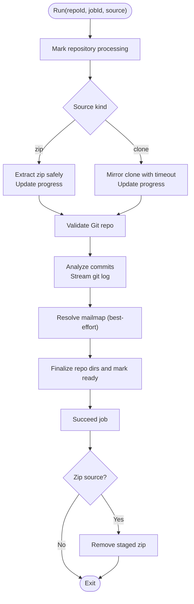

**Diagram sources**
- [pipeline.ts:44-130](file://apps/api/src/ingest/pipeline.ts#L44-L130)

**Section sources**
- [pipeline.ts:16-146](file://apps/api/src/ingest/pipeline.ts#L16-L146)

### Zip Upload Processing and Safe Extraction
Zip extraction enforces multiple safety controls:
- Rejects invalid zip opens.
- Limits total uncompressed bytes to prevent zip bombs.
- Limits entry count.
- Skips macOS resource forks.
- Validates entry names against absolute paths, drive letters, and traversal sequences.
- Resolves destination paths and verifies containment within the extraction root.
- Skips symbolic links.
- Streams entries to avoid loading entire archives into memory.
- Discovers the Git directory via breadth-first search up to depth three, accepting worktrees with `.git` directories or bare repositories.

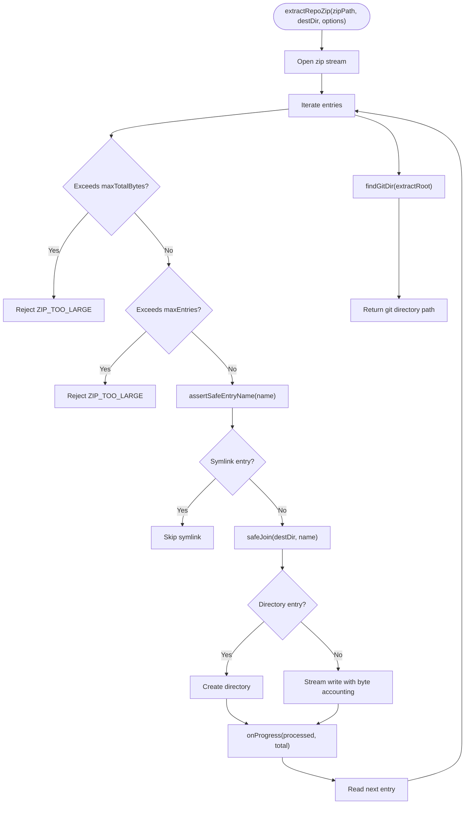

**Diagram sources**
- [zipSource.ts:27-209](file://apps/api/src/ingest/zipSource.ts#L27-L209)
- [zipSafe.ts:11-42](file://apps/api/src/util/zipSafe.ts#L11-L42)

**Section sources**
- [zipSource.ts:1-210](file://apps/api/src/ingest/zipSource.ts#L1-L210)
- [zipSafe.ts:1-43](file://apps/api/src/util/zipSafe.ts#L1-L43)

### Remote URL Cloning with Timeout Handling
Cloning uses a full mirror clone to preserve all refs and history without requiring a worktree. It parses `git clone --progress` stderr lines to map coarse progress stages:
- Counting objects: 0–10%
- Compressing: 10–20%
- Receiving objects: 20–90%
- Resolving deltas: 90–100%

Timeouts are enforced by the Git runner, which kills the process and returns a structured result when exceeded.

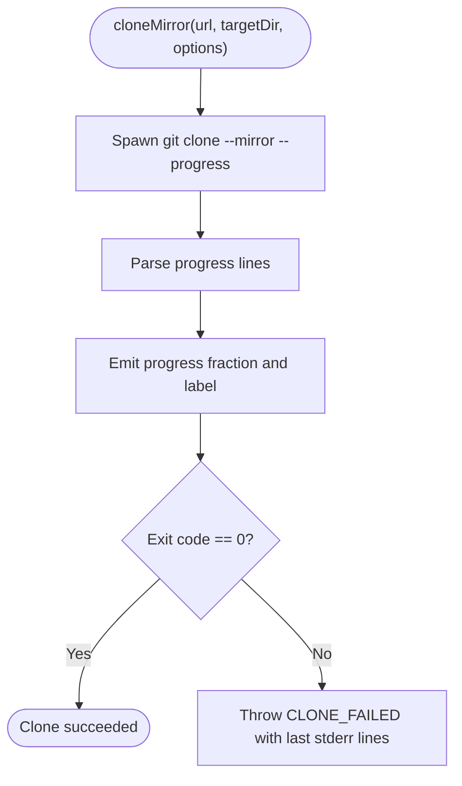

**Diagram sources**
- [cloneSource.ts:17-63](file://apps/api/src/ingest/cloneSource.ts#L17-L63)
- [gitRunner.ts:55-147](file://apps/api/src/git/gitRunner.ts#L55-L147)

**Section sources**
- [cloneSource.ts:1-64](file://apps/api/src/ingest/cloneSource.ts#L1-L64)
- [gitRunner.ts:1-149](file://apps/api/src/git/gitRunner.ts#L1-L149)

### Repository Validation Including .git Directory Verification
Validation ensures the ingested source is a valid Git repository with at least one non-merge commit:
- Resolves HEAD; failure indicates not a repository.
- Counts non-merge commits; zero or invalid count indicates empty repository.

For zip sources, Git directory verification occurs during extraction discovery:
- Accepts worktrees containing a `.git` directory.
- Accepts bare repositories with HEAD, objects/, and refs/.
- Rejects `.git` as a file (worktree pointer or submodule checkout).
- Rejects archives missing a Git directory.

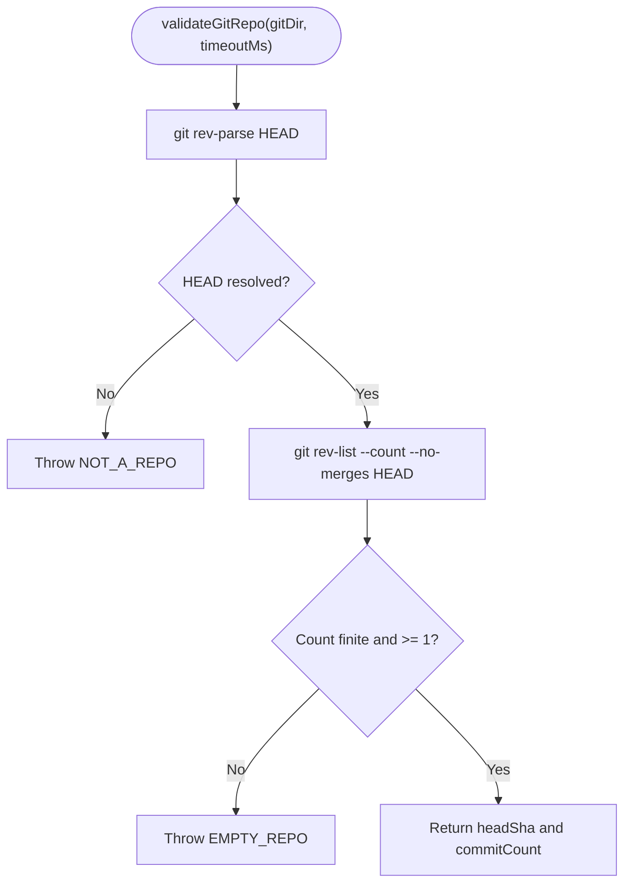

**Diagram sources**
- [validateRepo.ts:15-42](file://apps/api/src/ingest/validateRepo.ts#L15-L42)
- [zipSource.ts:161-197](file://apps/api/src/ingest/zipSource.ts#L161-L197)

**Section sources**
- [validateRepo.ts:1-43](file://apps/api/src/ingest/validateRepo.ts#L1-L43)
- [zipSource.ts:145-197](file://apps/api/src/ingest/zipSource.ts#L145-L197)

### Commit Analysis and Finalization
Analysis streams Git log output and persists commits and file stats in batches:
- Uses a streaming parser to handle large histories efficiently.
- Batches inserts to reduce transaction overhead.
- Tracks directory paths seen in file changes.
- Reports progress based on expected commit count.

Finalization:
- Inserts derived directory paths into a dedicated table.
- Marks the repository ready with head SHA and commit count.

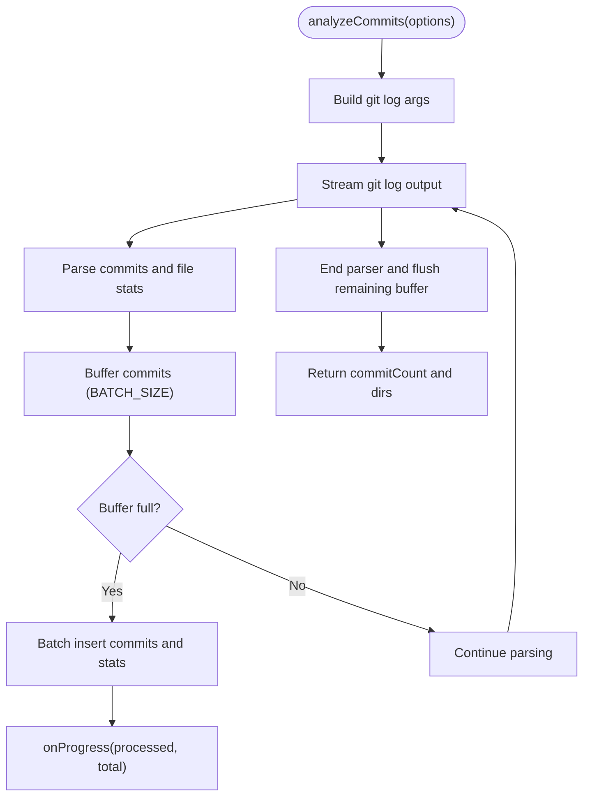

**Diagram sources**
- [analyzeCommits.ts:38-151](file://apps/api/src/analysis/analyzeCommits.ts#L38-L151)
- [finalize.ts:10-24](file://apps/api/src/analysis/finalize.ts#L10-L24)

**Section sources**
- [analyzeCommits.ts:1-153](file://apps/api/src/analysis/analyzeCommits.ts#L1-L153)
- [finalize.ts:1-25](file://apps/api/src/analysis/finalize.ts#L1-L25)

### Job State Management and Status Transitions
Jobs track both high-level status and detailed phase progress:
- Status transitions: queued → running → done or failed.
- Phase transitions: pending → extracting/cloning → validating → analyzing → finalizing → complete.
- Progress values are clamped to [0, 1].
- Stale jobs are marked failed on server restart, and repositories are marked error with actionable messages.

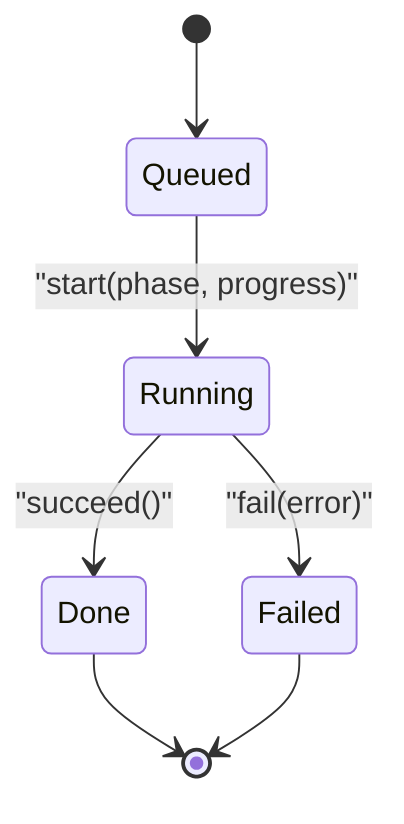

**Diagram sources**
- [jobStore.ts:4-42](file://apps/api/src/jobs/jobStore.ts#L4-L42)
- [jobStore.ts:67-99](file://apps/api/src/jobs/jobStore.ts#L67-L99)

**Section sources**
- [jobStore.ts:1-129](file://apps/api/src/jobs/jobStore.ts#L1-L129)

### Relationship Between Ingestion Jobs and Analysis Pipeline
The ingestion pipeline consumes Git data and produces analysis results:
- Zip or clone provides a Git directory.
- Validation ensures the repository is analyzable.
- Analysis streams commit history and persists normalized data.
- Finalization materializes derived metadata and marks the repository ready.
- Job store exposes polling endpoints for clients to monitor progress.

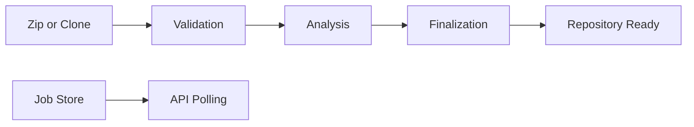

**Diagram sources**
- [pipeline.ts:44-130](file://apps/api/src/ingest/pipeline.ts#L44-L130)
- [jobs.ts:22-33](file://apps/api/src/routes/jobs.ts#L22-L33)

**Section sources**
- [pipeline.ts:44-130](file://apps/api/src/ingest/pipeline.ts#L44-L130)
- [jobs.ts:1-34](file://apps/api/src/routes/jobs.ts#L1-L34)

### Storage Management for Uploaded Zips and Cloned Repositories
Storage layout:
- `storageDir`: Root for uploads, repos, and SQLite database.
- `reposDir`: One directory per ingested repository.
- `tmpDir`: Staging area for uploaded zips.
- Each repository row stores `storage_path`, used for cleanup on deletion.

Lifecycle:
- Zip uploads are stored temporarily and removed after extraction.
- Cloned repositories are mirrored under `reposDir`.
- Deletion removes repository rows and associated on-disk directories, guarded to stay within `reposDir`.

**Section sources**
- [config.ts:26-73](file://apps/api/src/config.ts#L26-L73)
- [repositories.ts:143-160](file://apps/api/src/routes/repositories.ts#L143-L160)
- [pipeline.ts:119-124](file://apps/api/src/ingest/pipeline.ts#L119-L124)

### Monitoring Capabilities for Long-Running Operations
Clients monitor ingestion via:
- Repository listing includes latest job DTO.
- Job endpoint returns current status, phase, progress, and error.
- Pipeline updates job store at each phase boundary and during progress callbacks.

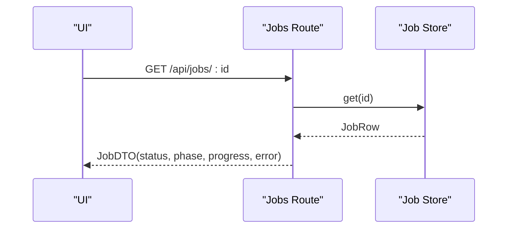

**Diagram sources**
- [jobs.ts:22-33](file://apps/api/src/routes/jobs.ts#L22-L33)
- [pipeline.ts:50-113](file://apps/api/src/ingest/pipeline.ts#L50-L113)

**Section sources**
- [jobs.ts:1-34](file://apps/api/src/routes/jobs.ts#L1-L34)
- [pipeline.ts:44-130](file://apps/api/src/ingest/pipeline.ts#L44-L130)

## Dependency Analysis
The ingestion pipeline depends on configuration, database, Git execution, and shared types.

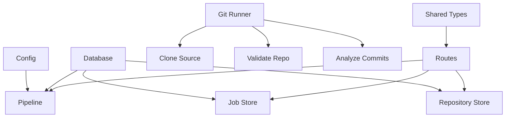

**Diagram sources**
- [config.ts:26-73](file://apps/api/src/config.ts#L26-L73)
- [pipeline.ts:16-146](file://apps/api/src/ingest/pipeline.ts#L16-L146)
- [jobStore.ts:1-129](file://apps/api/src/jobs/jobStore.ts#L1-L129)
- [repoStore.ts:1-63](file://apps/api/src/db/repoStore.ts#L1-L63)
- [gitRunner.ts:1-149](file://apps/api/src/git/gitRunner.ts#L1-L149)
- [types.ts:12-55](file://packages/shared/src/types.ts#L12-L55)
- [repositories.ts:72-135](file://apps/api/src/routes/repositories.ts#L72-L135)

**Section sources**
- [config.ts:26-73](file://apps/api/src/config.ts#L26-L73)
- [pipeline.ts:16-146](file://apps/api/src/ingest/pipeline.ts#L16-L146)
- [jobStore.ts:1-129](file://apps/api/src/jobs/jobStore.ts#L1-L129)
- [repoStore.ts:1-63](file://apps/api/src/db/repoStore.ts#L1-L63)
- [gitRunner.ts:1-149](file://apps/api/src/git/gitRunner.ts#L1-L149)
- [types.ts:12-55](file://packages/shared/src/types.ts#L12-L55)
- [repositories.ts:72-135](file://apps/api/src/routes/repositories.ts#L72-L135)

## Performance Considerations
- Single-concurrency queue prevents contention on DB writes and disk I/O during long-running clones and analyses.
- Streaming zip extraction avoids loading entire archives into memory and enforces size limits.
- Full mirror clone preserves complete history needed for analysis but may be slower; timeouts protect against hangs.
- Batched commit inserts reduce transaction overhead during analysis.
- Git runner retains only small tails of stdout/stderr when streaming callbacks are used, limiting memory usage.

[No sources needed since this section provides general guidance]

## Troubleshooting Guide
Common error scenarios and handling strategies:
- Invalid zip: Opening failures, malformed entries, or stream errors return structured bad request errors.
- Zip too large: Exceeding entry count or uncompressed byte limit raises explicit errors.
- Path traversal or unsafe entries: Absolute paths, drive letters, and traversal segments are rejected.
- Missing Git directory: Archives without `.git` or bare repository layout fail with actionable messages.
- Not a repository: HEAD resolution or history enumeration failures indicate invalid Git sources.
- Empty repository: Zero non-merge commits are rejected before analysis.
- Clone failure: Non-zero exit codes produce structured errors with recent stderr lines.
- Server restart: Interrupted jobs and repositories are marked failed with clear instructions to delete and re-ingest.

Operational tips:
- Use job polling to monitor phase and progress.
- Inspect repository status and error fields for ingestion outcomes.
- Ensure storage directories exist and have sufficient space.
- Tune timeouts via configuration for large repositories.

**Section sources**
- [zipSource.ts:14-127](file://apps/api/src/ingest/zipSource.ts#L14-L127)
- [zipSource.ts:161-197](file://apps/api/src/ingest/zipSource.ts#L161-L197)
- [validateRepo.ts:15-42](file://apps/api/src/ingest/validateRepo.ts#L15-L42)
- [cloneSource.ts:50-63](file://apps/api/src/ingest/cloneSource.ts#L50-L63)
- [jobStore.ts:110-126](file://apps/api/src/jobs/jobStore.ts#L110-L126)

## Conclusion
The ingestion pipeline provides a robust, observable workflow for turning repository sources into analyzed data. It combines safe zip extraction, reliable remote cloning, strict repository validation, efficient streaming analysis, and clear job state management. The single-concurrency queue ensures stability under load, while persistent job and repository states enable effective monitoring and troubleshooting.

[No sources needed since this section summarizes without analyzing specific files]