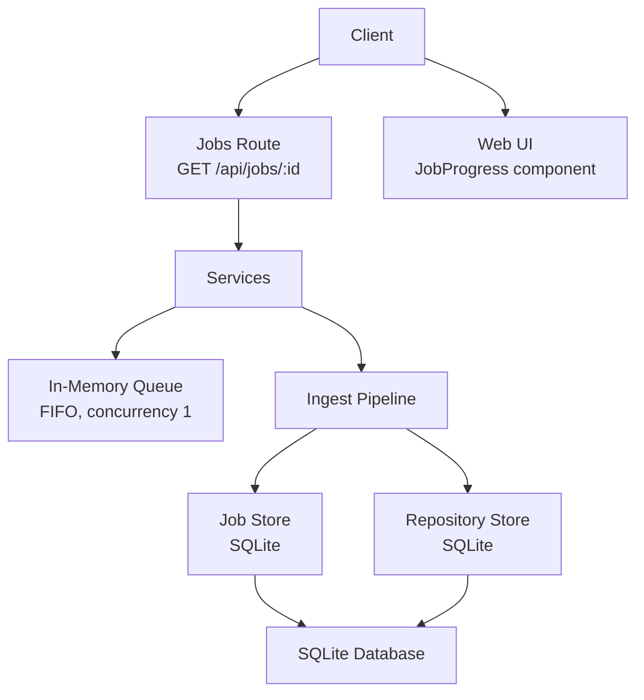
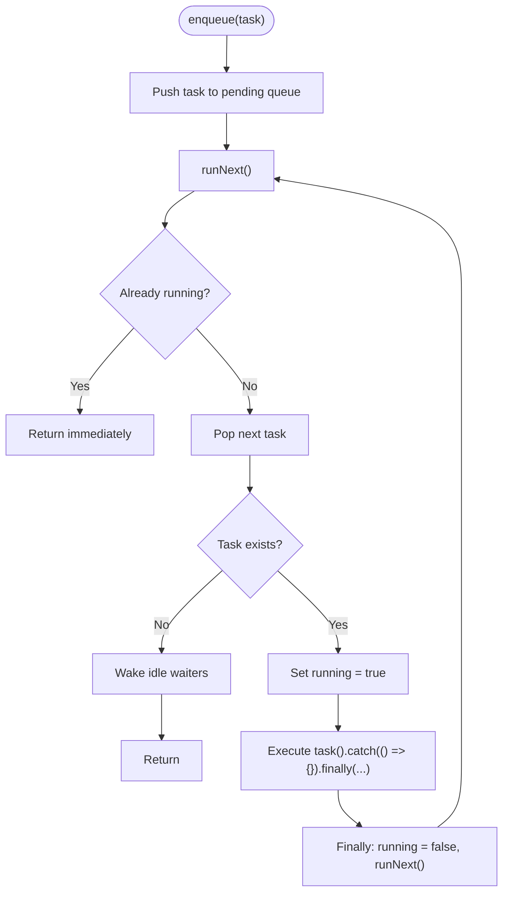
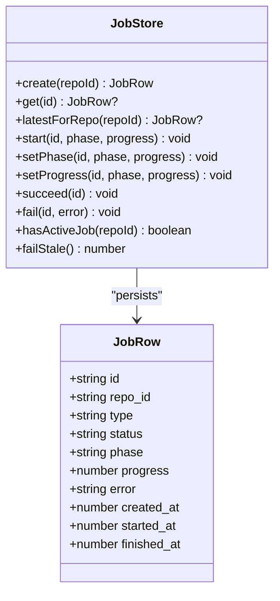
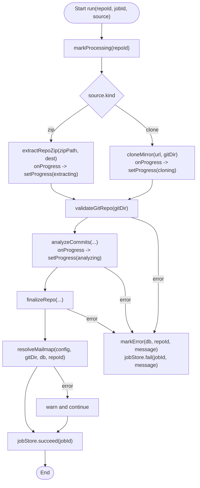
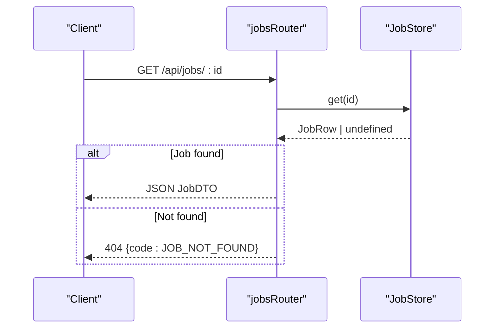
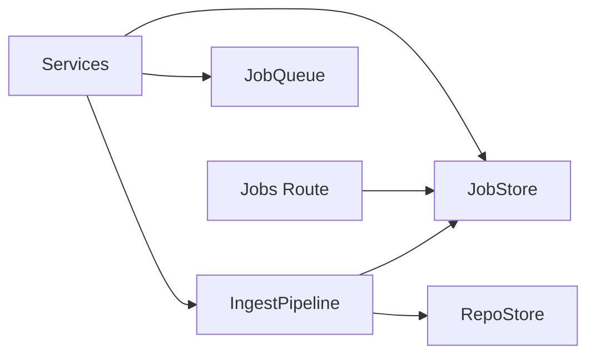

# Job Queue Management

<cite>
**Referenced Files in This Document**
- [queue.ts](file://apps/api/src/jobs/queue.ts)
- [jobStore.ts](file://apps/api/src/jobs/jobStore.ts)
- [pipeline.ts](file://apps/api/src/ingest/pipeline.ts)
- [jobs.ts](file://apps/api/src/routes/jobs.ts)
- [schema.sql](file://apps/api/src/db/schema.sql)
- [repoStore.ts](file://apps/api/src/db/repoStore.ts)
- [services.ts](file://apps/api/src/services.ts)
- [errors.ts](file://apps/api/src/util/errors.ts)
- [JobProgress.tsx](file://apps/web/src/components/ingest/JobProgress.tsx)
- [format.ts](file://apps/web/src/lib/format.ts)
- [jobs.test.ts](file://apps/api/test/routes/jobs.test.ts)
</cite>

## Table of Contents
1. [Introduction](#introduction)
2. [Project Structure](#project-structure)
3. [Core Components](#core-components)
4. [Architecture Overview](#architecture-overview)
5. [Detailed Component Analysis](#detailed-component-analysis)
6. [Dependency Analysis](#dependency-analysis)
7. [Performance Considerations](#performance-considerations)
8. [Troubleshooting Guide](#troubleshooting-guide)
9. [Conclusion](#conclusion)

## Introduction
This document explains the job queue management system that powers repository ingestion. It covers:
- A single-process FIFO queue with concurrency 1 for predictable I/O and database writes
- Job state transitions from queued to running, then to done or failed
- Persistent storage using SQLite for jobs and repositories
- The pipeline stages (extracting, cloning, validating, analyzing, finalizing) and how they update progress
- Error handling, recovery on server restart, and client-side polling for real-time updates

## Project Structure
The job queue spans a small set of focused modules:
- In-memory queue with concurrency control
- Job persistence layer backed by SQLite
- Pipeline orchestrating ingestion stages
- HTTP route exposing job status polling
- Frontend component rendering live progress



**Diagram sources**
- [jobs.ts:22-33](file://apps/api/src/routes/jobs.ts#L22-L33)
- [services.ts:18-24](file://apps/api/src/services.ts#L18-L24)
- [queue.ts:15-54](file://apps/api/src/jobs/queue.ts#L15-L54)
- [pipeline.ts:41-145](file://apps/api/src/ingest/pipeline.ts#L41-L145)
- [jobStore.ts:44-128](file://apps/api/src/jobs/jobStore.ts#L44-L128)
- [repoStore.ts:48-62](file://apps/api/src/db/repoStore.ts#L48-L62)

**Section sources**
- [queue.ts:1-55](file://apps/api/src/jobs/queue.ts#L1-L55)
- [jobStore.ts:1-129](file://apps/api/src/jobs/jobStore.ts#L1-L129)
- [pipeline.ts:1-146](file://apps/api/src/ingest/pipeline.ts#L1-L146)
- [jobs.ts:1-34](file://apps/api/src/routes/jobs.ts#L1-L34)
- [schema.sql:20-31](file://apps/api/src/db/schema.sql#L20-L31)
- [repoStore.ts:1-63](file://apps/api/src/db/repoStore.ts#L1-L63)
- [services.ts:1-44](file://apps/api/src/services.ts#L1-L44)

## Core Components
- JobQueue: An in-process FIFO queue enforcing concurrency 1. It exposes enqueue, size, and idle helpers.
- JobStore: A persistence abstraction over SQLite for job rows, including lifecycle methods like start, setPhase, setProgress, succeed, fail, hasActiveJob, and failStale.
- IngestPipeline: Orchestrates ingestion stages, updating job phases and progress as it clones or extracts source data, validates, analyzes commits, and finalizes results.
- Jobs Route: Exposes GET /api/jobs/:id for clients to poll job status and progress.
- Repository Store: Tracks repository-level status and error states, synchronized with job execution.

Key responsibilities:
- Queue ensures only one ingestion runs at a time.
- JobStore persists job state and phase transitions.
- Pipeline coordinates external operations (git clone, zip extraction, analysis) and updates progress.
- Route provides read-only access to job state for UI polling.

**Section sources**
- [queue.ts:7-54](file://apps/api/src/jobs/queue.ts#L7-L54)
- [jobStore.ts:4-42](file://apps/api/src/jobs/jobStore.ts#L4-L42)
- [pipeline.ts:16-25](file://apps/api/src/ingest/pipeline.ts#L16-L25)
- [jobs.ts:7-33](file://apps/api/src/routes/jobs.ts#L7-L33)
- [repoStore.ts:3-15](file://apps/api/src/db/repoStore.ts#L3-L15)

## Architecture Overview
The ingestion flow is driven by routes that create a job record, enqueue a task, and let the pipeline execute it serially. Clients poll the job endpoint to observe progress.

```mermaid
sequenceDiagram
participant Client as "Client"
participant Route as "Jobs Route"
participant Services as "Services"
participant Queue as "JobQueue"
participant Pipeline as "IngestPipeline"
participant Store as "JobStore"
participant Repo as "RepoStore"
participant DB as "SQLite"
Client->>Route : Create ingestion request
Route->>Store : create(repoId)
Store-->>Route : JobRow {status : queued}
Route->>Services : enqueueIngest(queue, pipeline, task)
Services->>Queue : enqueue(task)
Note over Queue : Concurrency 1; tasks run FIFO
Queue->>Pipeline : processZip/processClone(repoId, jobId, source)
Pipeline->>Repo : markProcessing(repoId)
Pipeline->>Store : start(jobId, phase, progress)
Pipeline->>DB : git clone / extract / analyze
Pipeline->>Store : setProgress(jobId, phase, fraction)
Pipeline->>Store : succeed(jobId)
Pipeline->>Repo : markReady(repoId, headSha, commitCount)
Store-->>DB : persist done/complete
Repo-->>DB : persist ready
Client->>Route : GET /api/jobs/ : id
Route->>Store : get(id)
Store-->>Route : JobRow
Route-->>Client : JSON JobDTO
```

**Diagram sources**
- [pipeline.ts:44-129](file://apps/api/src/ingest/pipeline.ts#L44-L129)
- [pipeline.ts:134-145](file://apps/api/src/ingest/pipeline.ts#L134-L145)
- [jobStore.ts:48-99](file://apps/api/src/jobs/jobStore.ts#L48-L99)
- [repoStore.ts:48-58](file://apps/api/src/db/repoStore.ts#L48-L58)
- [jobs.ts:26-30](file://apps/api/src/routes/jobs.ts#L26-L30)

## Detailed Component Analysis

### JobQueue: FIFO with Concurrency 1
- Enqueues asynchronous tasks into an internal array and executes them one at a time.
- Provides size() for introspection and idle() to wait until all pending and running tasks complete.
- Catches task rejections so a failing pipeline does not break the queue; pipeline code handles its own errors and persists failures.



**Diagram sources**
- [queue.ts:15-54](file://apps/api/src/jobs/queue.ts#L15-L54)

**Section sources**
- [queue.ts:1-55](file://apps/api/src/jobs/queue.ts#L1-L55)

### JobStore: Persistent Job State
- Stores job rows with fields for id, repo_id, type, status, phase, progress, timestamps, and error message.
- Lifecycle methods:
  - create(repoId): inserts a new job row with status queued and phase pending.
  - start(id, phase, progress): marks job running and sets initial phase and progress.
  - setPhase/setProgress: updates phase and progress during long-running steps.
  - succeed(id): marks job done, phase complete, progress 1, and sets finished_at.
  - fail(id, error): marks job failed with error message and finished_at.
  - hasActiveJob(repoId): checks if any queued or running jobs exist for a repository.
  - failStale(): on server restart, marks interrupted jobs and repositories as failed/error.



**Diagram sources**
- [jobStore.ts:4-42](file://apps/api/src/jobs/jobStore.ts#L4-L42)
- [jobStore.ts:44-128](file://apps/api/src/jobs/jobStore.ts#L44-L128)

**Section sources**
- [jobStore.ts:1-129](file://apps/api/src/jobs/jobStore.ts#L1-L129)

### IngestPipeline: Stage Orchestration and Progress
- Defines two entry points: processZip and processClone.
- Updates repository status to processing and job status to running when starting.
- Phase boundaries:
  - extracting/cloning: source acquisition
  - validating: git validation
  - analyzing: commit analysis
  - finalizing: finalize and mailmap resolution
- Progress is clamped to [0, 1] and updated via callbacks from underlying operations.
- On success: finalizes repository and marks job done.
- On failure: logs error, marks repository error, and marks job failed.
- Cleans up staged zip files after completion.



**Diagram sources**
- [pipeline.ts:44-129](file://apps/api/src/ingest/pipeline.ts#L44-L129)

**Section sources**
- [pipeline.ts:1-146](file://apps/api/src/ingest/pipeline.ts#L1-L146)

### Jobs Route: Status Polling API
- GET /api/jobs/:id returns a JobDTO derived from the persisted JobRow.
- Throws structured 404 if the job does not exist.



**Diagram sources**
- [jobs.ts:7-33](file://apps/api/src/routes/jobs.ts#L7-L33)

**Section sources**
- [jobs.ts:1-34](file://apps/api/src/routes/jobs.ts#L1-L34)

### Repository Store: Repository-Level States
- Tracks repository status: queued, processing, ready, error.
- Synchronized with job execution:
  - markProcessing: set to processing and clear previous error
  - markReady: set to ready with head_sha and commit_count
  - markError: set to error with message

**Section sources**
- [repoStore.ts:1-63](file://apps/api/src/db/repoStore.ts#L1-L63)

### Frontend: Real-Time Progress Rendering
- JobProgress component renders:
  - Error banner when job.status is failed
  - Null output when job.status is done
  - Phase label and percentage bar for queued/running jobs
- Uses shared labels mapping phases to human-readable strings.

**Section sources**
- [JobProgress.tsx:1-44](file://apps/web/src/components/ingest/JobProgress.tsx#L1-L44)
- [format.ts:88-103](file://apps/web/src/lib/format.ts#L88-L103)

## Dependency Analysis
- Services wires together config, DB, jobStore, queue, and pipeline at bootstrap.
- Pipeline depends on jobStore for progress and lifecycle updates and on repoStore for repository status.
- Queue is independent of persistence; it only enforces in-process concurrency.
- Jobs route depends on services.jobStore for reading job state.



**Diagram sources**
- [services.ts:18-24](file://apps/api/src/services.ts#L18-L24)
- [pipeline.ts:41-145](file://apps/api/src/ingest/pipeline.ts#L41-L145)
- [jobs.ts:22-33](file://apps/api/src/routes/jobs.ts#L22-L33)

**Section sources**
- [services.ts:1-44](file://apps/api/src/services.ts#L1-L44)

## Performance Considerations
- Single-concurrency queue avoids contention on disk I/O and SQLite writes during long-running ingestion tasks.
- Progress updates are frequent but lightweight; values are clamped to avoid unnecessary large writes.
- Staged zip files are removed after extraction to free disk space.
- For high-throughput scenarios, consider:
  - Batching progress updates
  - Using WAL mode in SQLite
  - Adding rate limiting around heavy operations

[No sources needed since this section provides general guidance]

## Troubleshooting Guide
Common issues and recovery strategies:
- Job stuck in running or queued after server restart:
  - Use failStale to mark interrupted jobs and repositories as failed/error.
- Job fails during ingestion:
  - Pipeline catches errors, logs messages, marks repository error, and marks job failed.
  - Inspect job.error and repository.error for details.
- No job found when polling:
  - Route returns 404 with code JOB_NOT_FOUND.
- Prevent duplicate ingestion for the same repository:
  - hasActiveJob can be used to check for existing queued or running jobs before creating a new one.

Operational tips:
- Always call failStale during startup to recover from crashes.
- Monitor repository status alongside job status to detect stalled pipelines.
- Clean up stale artifacts (e.g., staged zips) if cleanup logic is bypassed.

**Section sources**
- [jobStore.ts:110-126](file://apps/api/src/jobs/jobStore.ts#L110-L126)
- [pipeline.ts:114-123](file://apps/api/src/ingest/pipeline.ts#L114-L123)
- [jobs.ts:26-30](file://apps/api/src/routes/jobs.ts#L26-L30)

## Conclusion
The job queue management system provides a simple, robust foundation for repository ingestion:
- A concurrency-limited FIFO queue ensures stable resource usage.
- Persistent job states and phases enable reliable progress tracking.
- Pipeline orchestration maps ingestion stages to user-visible progress.
- Clear error handling and restart recovery improve operational resilience.
- The polling API and frontend component deliver real-time feedback to users.

[No sources needed since this section summarizes without analyzing specific files]