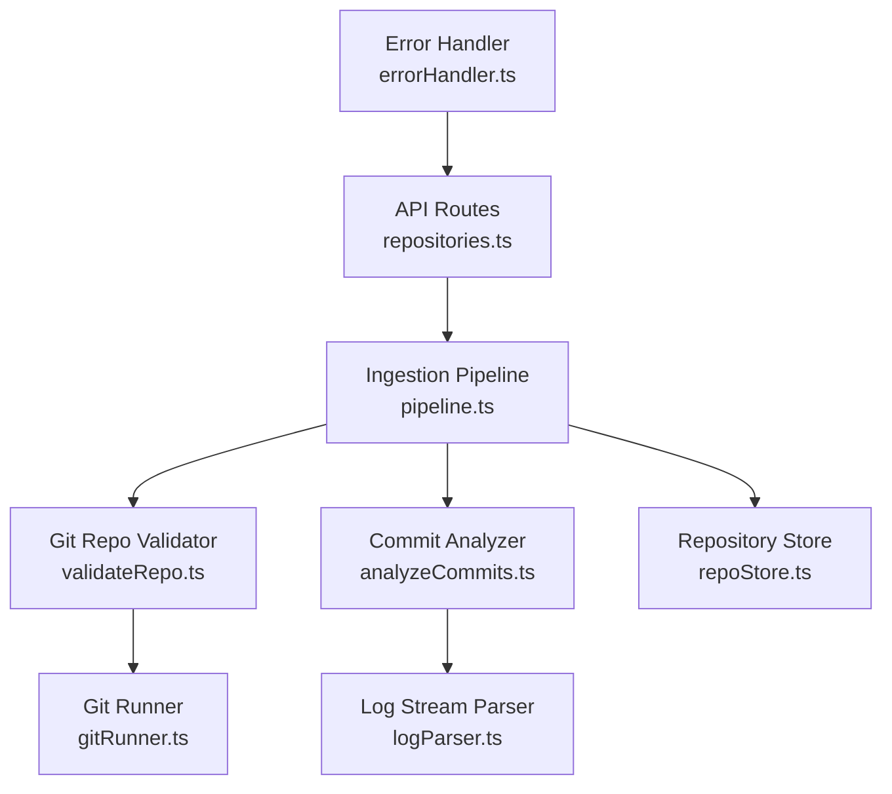
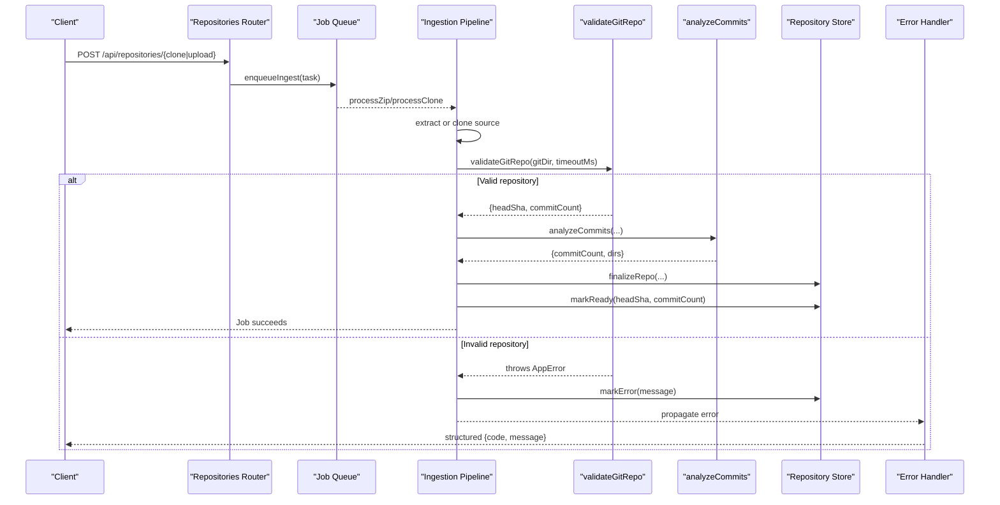
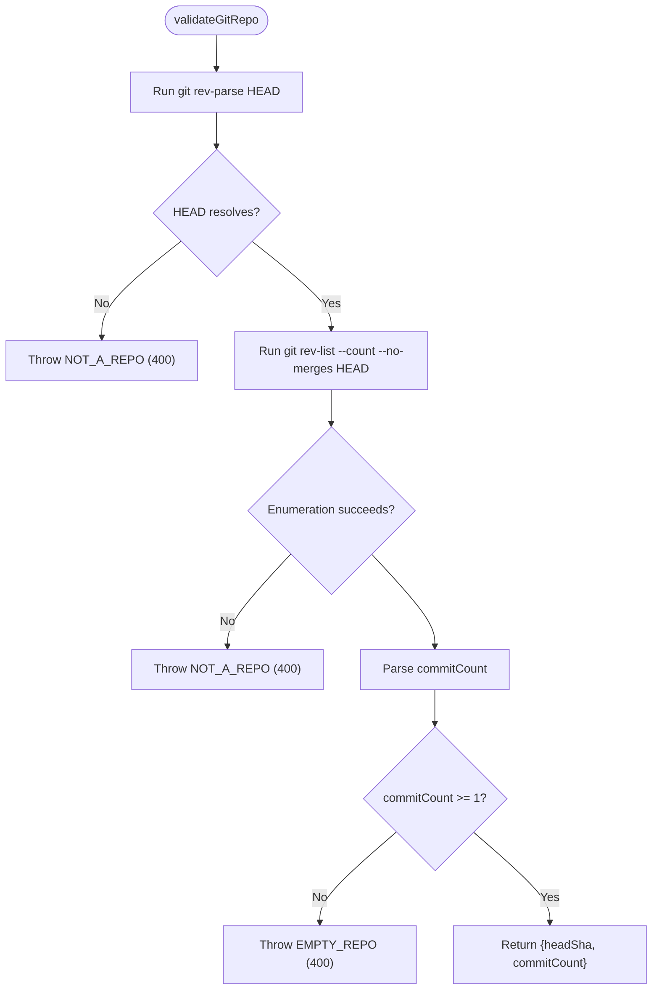
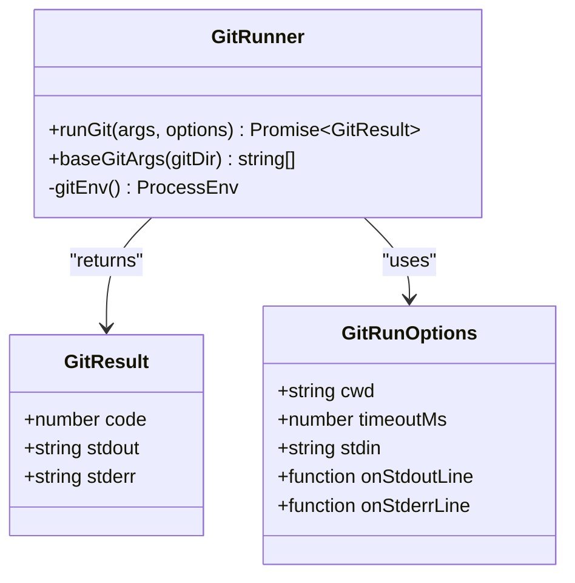
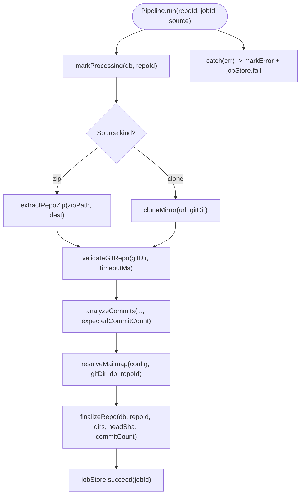
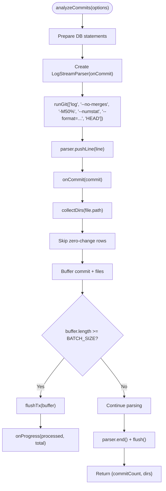
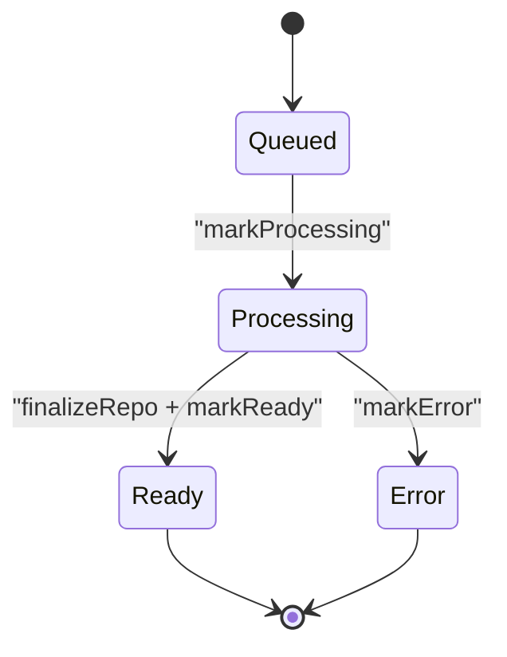
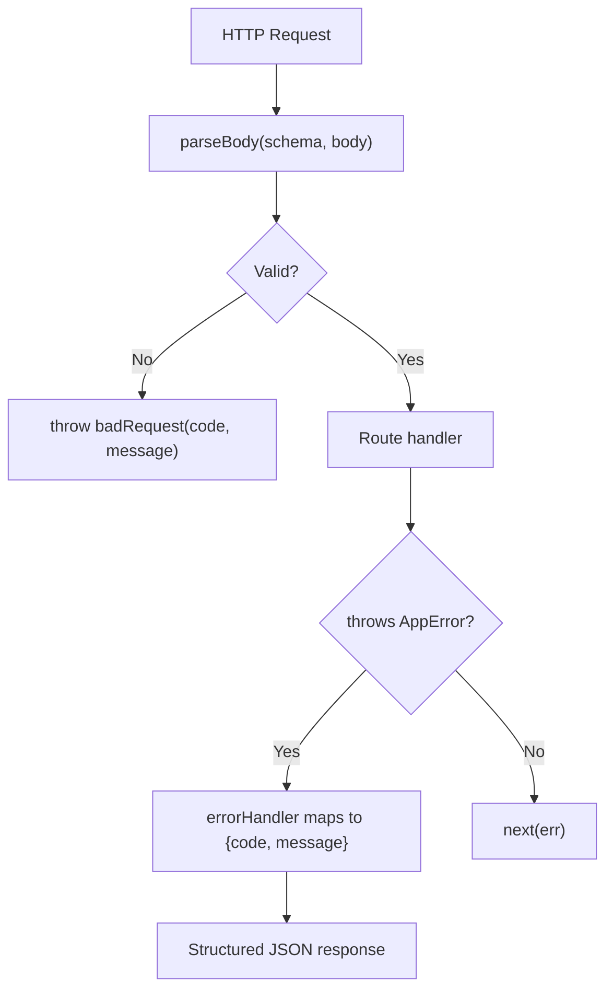
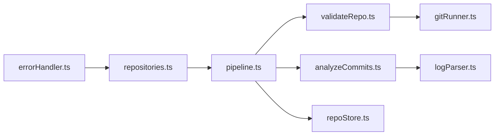

# Repository Validation

<cite>
**Referenced Files in This Document**
- [validateRepo.ts](file://apps/api/src/ingest/validateRepo.ts)
- [gitRunner.ts](file://apps/api/src/git/gitRunner.ts)
- [pipeline.ts](file://apps/api/src/ingest/pipeline.ts)
- [analyzeCommits.ts](file://apps/api/src/analysis/analyzeCommits.ts)
- [logParser.ts](file://apps/api/src/git/logParser.ts)
- [repoStore.ts](file://apps/api/src/db/repoStore.ts)
- [errorHandler.ts](file://apps/api/src/middleware/errorHandler.ts)
- [errors.ts](file://apps/api/src/util/errors.ts)
- [repositories.ts](file://apps/api/src/routes/repositories.ts)
</cite>

## Table of Contents
1. [Introduction](#introduction)
2. [Project Structure](#project-structure)
3. [Core Components](#core-components)
4. [Architecture Overview](#architecture-overview)
5. [Detailed Component Analysis](#detailed-component-analysis)
6. [Dependency Analysis](#dependency-analysis)
7. [Performance Considerations](#performance-considerations)
8. [Troubleshooting Guide](#troubleshooting-guide)
9. [Conclusion](#conclusion)

## Introduction
This document explains the repository validation layer used by the ingestion pipeline. It covers how the system verifies that an ingested source is a valid Git repository, analyzes commit history, enforces minimum commit requirements, and checks repository integrity before analysis proceeds. It also documents validation rules for file structure expectations, data quality assessments, common validation failures, remediation steps, and how validation results feed into the downstream analysis pipeline and error reporting mechanisms.

The validation logic is intentionally lightweight: it runs before expensive analysis to fail fast with actionable errors. The primary checks are:
- HEAD must resolve.
- There must be at least one non-merge commit.
- The repository’s history can be enumerated without failure.

These checks are implemented using controlled `git` invocations through a safe child-process runner.

## Project Structure
Repository validation is part of the ingestion pipeline. The relevant modules are organized as follows:

**Diagram sources**
- [repositories.ts:71-135](file://apps/api/src/routes/repositories.ts#L71-L135)
- [pipeline.ts:41-130](file://apps/api/src/ingest/pipeline.ts#L41-L130)
- [validateRepo.ts:15-42](file://apps/api/src/ingest/validateRepo.ts#L15-L42)
- [analyzeCommits.ts:38-151](file://apps/api/src/analysis/analyzeCommits.ts#L38-L151)
- [gitRunner.ts:55-148](file://apps/api/src/git/gitRunner.ts#L55-L148)
- [logParser.ts:172-202](file://apps/api/src/git/logParser.ts#L172-L202)
- [repoStore.ts:48-62](file://apps/api/src/db/repoStore.ts#L48-L62)
- [errorHandler.ts:18-62](file://apps/api/src/middleware/errorHandler.ts#L18-L62)

**Section sources**
- [repositories.ts:71-135](file://apps/api/src/routes/repositories.ts#L71-L135)
- [pipeline.ts:41-130](file://apps/api/src/ingest/pipeline.ts#L41-L130)

## Core Components
- Git repo validator: performs cheap sanity checks on the repository before analysis.
- Git runner: spawns `git` commands safely, handles timeouts, streaming output, and deterministic environment variables.
- Ingestion pipeline: orchestrates cloning or zip extraction, validation, analysis, mailmap resolution, finalization, and job state updates.
- Commit analyzer: streams full history, parses log output, batches database writes, and computes directory sets.
- Log parser: incremental parser for `git log --numstat` output, handling renames, C-quoting, binary rows, and commit records.
- Repository store: persists repository metadata, status transitions, head SHA, and commit count.
- Error handler: maps application errors to structured HTTP responses.

**Section sources**
- [validateRepo.ts:15-42](file://apps/api/src/ingest/validateRepo.ts#L15-L42)
- [gitRunner.ts:55-148](file://apps/api/src/git/gitRunner.ts#L55-L148)
- [pipeline.ts:41-130](file://apps/api/src/ingest/pipeline.ts#L41-L130)
- [analyzeCommits.ts:38-151](file://apps/api/src/analysis/analyzeCommits.ts#L38-L151)
- [logParser.ts:172-202](file://apps/api/src/git/logParser.ts#L172-L202)
- [repoStore.ts:48-62](file://apps/api/src/db/repoStore.ts#L48-L62)
- [errorHandler.ts:18-62](file://apps/api/src/middleware/errorHandler.ts#L18-L62)

## Architecture Overview
The ingestion flow validates repositories early and fails fast when inputs are invalid.

**Diagram sources**
- [repositories.ts:84-135](file://apps/api/src/routes/repositories.ts#L84-L135)
- [pipeline.ts:44-124](file://apps/api/src/ingest/pipeline.ts#L44-L124)
- [validateRepo.ts:15-42](file://apps/api/src/ingest/validateRepo.ts#L15-L42)
- [analyzeCommits.ts:38-151](file://apps/api/src/analysis/analyzeCommits.ts#L38-L151)
- [repoStore.ts:48-62](file://apps/api/src/db/repoStore.ts#L48-L62)
- [errorHandler.ts:18-62](file://apps/api/src/middleware/errorHandler.ts#L18-L62)

## Detailed Component Analysis

### Git Repository Validator
The validator ensures the repository is usable before analysis begins.

Validation rules:
- HEAD must resolve; otherwise, the source is not a valid Git repository with at least one commit.
- Non-merge commit enumeration must succeed.
- At least one non-merge commit must exist; otherwise, the repository is considered empty for analysis purposes.

Outputs:
- `headSha`: resolved HEAD commit SHA.
- `commitCount`: number of non-merge commits reachable from HEAD.

Failure behavior:
- Throws structured application errors with codes `NOT_A_REPO` and `EMPTY_REPO`, both with HTTP status 400.

**Diagram sources**
- [validateRepo.ts:15-42](file://apps/api/src/ingest/validateRepo.ts#L15-L42)

**Section sources**
- [validateRepo.ts:15-42](file://apps/api/src/ingest/validateRepo.ts#L15-L42)

### Git Runner
The runner provides a safe, deterministic interface to `git`.

Key behaviors:
- Spawns `git` via child process with argument arrays (never shell).
- Sets non-interactive environment variables to avoid credential prompts and ensure parseable output.
- Applies per-command safe.directory configuration to work across user-owned directories.
- Supports optional timeouts; timed-out processes are killed and reported with code -1.
- Streams stdout/stderr lines when callbacks are provided, retaining only a small tail buffer for diagnostics.

**Diagram sources**
- [gitRunner.ts:3-21](file://apps/api/src/git/gitRunner.ts#L3-L21)
- [gitRunner.ts:46-48](file://apps/api/src/git/gitRunner.ts#L46-L48)
- [gitRunner.ts:55-148](file://apps/api/src/git/gitRunner.ts#L55-L148)

**Section sources**
- [gitRunner.ts:3-21](file://apps/api/src/git/gitRunner.ts#L3-L21)
- [gitRunner.ts:46-48](file://apps/api/src/git/gitRunner.ts#L46-L48)
- [gitRunner.ts:55-148](file://apps/api/src/git/gitRunner.ts#L55-L148)

### Ingestion Pipeline
The pipeline coordinates source acquisition, validation, analysis, and finalization.

Processing phases:
- Source start/end: extracting zip or cloning mirror.
- Validating: running `validateGitRepo`.
- Analyzing: streaming commit analysis with progress updates.
- Finalizing: resolving mailmaps (best-effort), finalizing repository record, marking job success.

Error handling:
- Any exception during processing marks the repository as errored and fails the job.
- Uploaded zips are cleaned up after processing.

**Diagram sources**
- [pipeline.ts:44-124](file://apps/api/src/ingest/pipeline.ts#L44-L124)

**Section sources**
- [pipeline.ts:44-124](file://apps/api/src/ingest/pipeline.ts#L44-L124)

### Commit Analyzer and Log Parser
The analyzer streams the full history and persists commit and file change metrics.

Analysis characteristics:
- Uses `git log --no-merges -M50% --numstat --format=... HEAD`.
- Parses each commit record and associated numstat rows.
- Skips binary rows and pure rename/mode-only changes for metric storage.
- Tracks directory paths seen in history.
- Batches inserts into transactions for performance.

Data quality rules:
- Binary files are excluded from metrics.
- Renames are attributed to the new path.
- Empty commits still count toward commit totals.

**Diagram sources**
- [analyzeCommits.ts:38-151](file://apps/api/src/analysis/analyzeCommits.ts#L38-L151)
- [logParser.ts:172-202](file://apps/api/src/git/logParser.ts#L172-L202)

**Section sources**
- [analyzeCommits.ts:38-151](file://apps/api/src/analysis/analyzeCommits.ts#L38-L151)
- [logParser.ts:172-202](file://apps/api/src/git/logParser.ts#L172-L202)

### Repository Store and Status Transitions
The store tracks repository lifecycle states and key metadata.

Statuses:
- queued: initial state upon creation.
- processing: ingestion started.
- ready: successful completion with head SHA and commit count.
- error: ingestion failed with an error message.

Finalization:
- After successful analysis, the pipeline finalizes the repository record with head SHA and commit count.
- Errors set the repository status to error with a human-readable message.

**Diagram sources**
- [repoStore.ts:3-15](file://apps/api/src/db/repoStore.ts#L3-L15)
- [repoStore.ts:48-62](file://apps/api/src/db/repoStore.ts#L48-L62)

**Section sources**
- [repoStore.ts:3-15](file://apps/api/src/db/repoStore.ts#L3-L15)
- [repoStore.ts:48-62](file://apps/api/src/db/repoStore.ts#L48-L62)

### API Input Validation and Error Reporting
Input validation for routes uses schema-based parsing and query parameter helpers.

Validation rules:
- Clone body requires a URL matching allowed schemes and a name field within length limits.
- Query parameters are validated for type, range, and enum constraints.

Error reporting:
- Application errors (`AppError`) map to structured JSON responses with code and message.
- Upload-related errors are handled specifically (e.g., missing file, wrong extension, size limit).
- Unhandled errors become 500 responses with generic messages.

**Diagram sources**
- [repositories.ts:58-69](file://apps/api/src/routes/repositories.ts#L58-L69)
- [repositories.ts:84-135](file://apps/api/src/routes/repositories.ts#L84-L135)
- [validate.ts:60-69](file://apps/api/src/middleware/validate.ts#L60-L69)
- [errorHandler.ts:18-62](file://apps/api/src/middleware/errorHandler.ts#L18-L62)

**Section sources**
- [repositories.ts:58-69](file://apps/api/src/routes/repositories.ts#L58-L69)
- [repositories.ts:84-135](file://apps/api/src/routes/repositories.ts#L84-L135)
- [validate.ts:60-69](file://apps/api/src/middleware/validate.ts#L60-L69)
- [errorHandler.ts:18-62](file://apps/api/src/middleware/errorHandler.ts#L18-L62)

## Dependency Analysis
The validation layer depends on controlled Git execution and integrates tightly with the ingestion pipeline and error handling.

**Diagram sources**
- [repositories.ts:71-135](file://apps/api/src/routes/repositories.ts#L71-L135)
- [pipeline.ts:41-130](file://apps/api/src/ingest/pipeline.ts#L41-L130)
- [validateRepo.ts:15-42](file://apps/api/src/ingest/validateRepo.ts#L15-L42)
- [analyzeCommits.ts:38-151](file://apps/api/src/analysis/analyzeCommits.ts#L38-L151)
- [gitRunner.ts:55-148](file://apps/api/src/git/gitRunner.ts#L55-L148)
- [logParser.ts:172-202](file://apps/api/src/git/logParser.ts#L172-L202)
- [repoStore.ts:48-62](file://apps/api/src/db/repoStore.ts#L48-L62)
- [errorHandler.ts:18-62](file://apps/api/src/middleware/errorHandler.ts#L18-L62)

**Section sources**
- [repositories.ts:71-135](file://apps/api/src/routes/repositories.ts#L71-L135)
- [pipeline.ts:41-130](file://apps/api/src/ingest/pipeline.ts#L41-L130)
- [validateRepo.ts:15-42](file://apps/api/src/ingest/validateRepo.ts#L15-L42)
- [analyzeCommits.ts:38-151](file://apps/api/src/analysis/analyzeCommits.ts#L38-L151)
- [gitRunner.ts:55-148](file://apps/api/src/git/gitRunner.ts#L55-L148)
- [logParser.ts:172-202](file://apps/api/src/git/logParser.ts#L172-L202)
- [repoStore.ts:48-62](file://apps/api/src/db/repoStore.ts#L48-L62)
- [errorHandler.ts:18-62](file://apps/api/src/middleware/errorHandler.ts#L18-L62)

## Performance Considerations
- Validation is designed to be cheap: two Git commands (`rev-parse HEAD` and `rev-list --count --no-merges HEAD`) run before heavy analysis.
- The Git runner supports streaming output and timeouts to prevent long-running operations from blocking the system.
- Commit analysis streams log output line-by-line and batches database inserts to reduce transaction overhead.
- Directory collection and filtering of zero-change rows minimize stored data while preserving accurate commit counts.

[No sources needed since this section provides general guidance]

## Troubleshooting Guide
Common validation failures and remediation steps:

- NOT_A_REPO (400):
  - Cause: HEAD does not resolve or history enumeration fails.
  - Remediation: Ensure the source is a valid Git repository with at least one commit. For cloned repositories, verify network access and credentials. For uploaded zips, confirm the archive contains a `.git` directory with a valid history.

- EMPTY_REPO (400):
  - Cause: No non-merge commits reachable from HEAD.
  - Remediation: Add at least one non-merge commit. Merge-only histories will be rejected by validation.

- UPLOAD_MISSING_FILE (400):
  - Cause: No file attached to upload request.
  - Remediation: Attach a `.zip` archive as the `file` form field.

- UPLOAD_NOT_ZIP (400):
  - Cause: Uploaded file is not a `.zip`.
  - Remediation: Re-upload a `.zip` archive.

- UPLOAD_TOO_LARGE (413):
  - Cause: File exceeds configured upload size limit.
  - Remediation: Reduce archive size or adjust server configuration.

- ANALYSIS_FAILED (500):
  - Cause: `git log` exited with a non-zero code during analysis.
  - Remediation: Inspect repository history for corruption or unsupported formats. Review stderr captured by the runner.

- INTERNAL (500):
  - Cause: Unhandled exception.
  - Remediation: Check server logs for stack traces and investigate root cause.

How validation results feed into the pipeline:
- Successful validation returns `headSha` and `commitCount`, which are passed to analysis and finalization.
- Failed validation throws structured errors that propagate to the error handler and update repository status to error.

**Section sources**
- [validateRepo.ts:15-42](file://apps/api/src/ingest/validateRepo.ts#L15-L42)
- [repositories.ts:84-135](file://apps/api/src/routes/repositories.ts#L84-L135)
- [errorHandler.ts:18-62](file://apps/api/src/middleware/errorHandler.ts#L18-L62)
- [errors.ts:5-18](file://apps/api/src/util/errors.ts#L5-L18)

## Conclusion
The repository validation layer enforces minimal but critical integrity checks before analysis. By validating HEAD resolution and requiring at least one non-merge commit, it prevents expensive analysis on unusable repositories. The design leverages a safe Git runner, streaming parsers, and structured error handling to provide clear feedback and robust pipeline behavior. Validation outcomes directly influence downstream analysis and repository status, ensuring consistent and traceable ingestion workflows.

[No sources needed since this section summarizes without analyzing specific files]