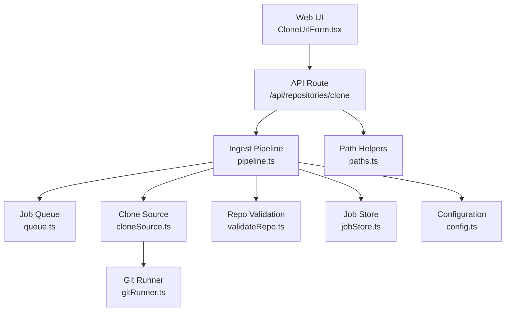
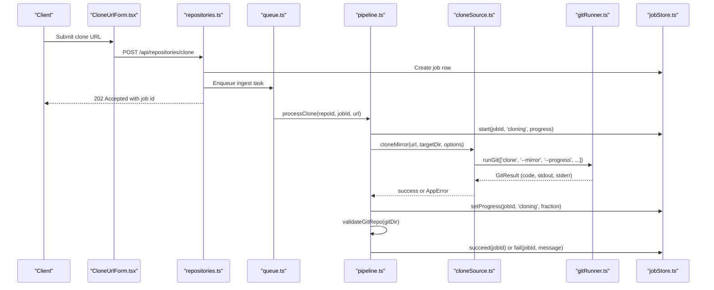
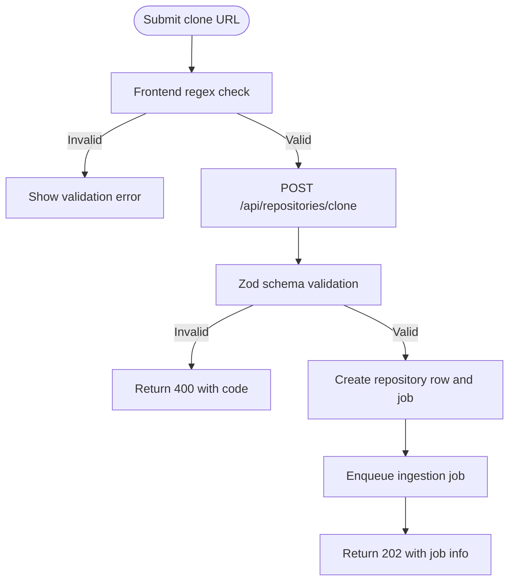
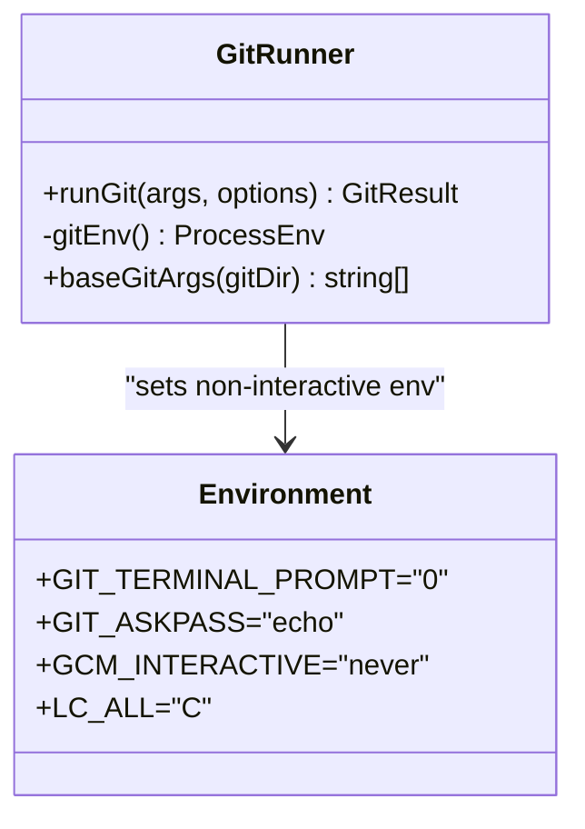
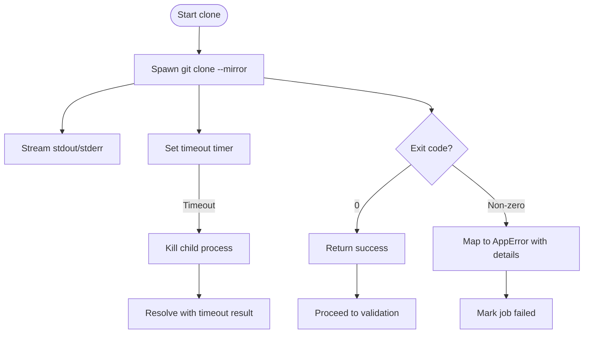
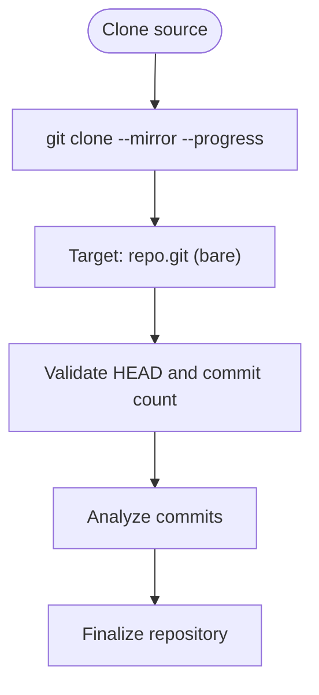
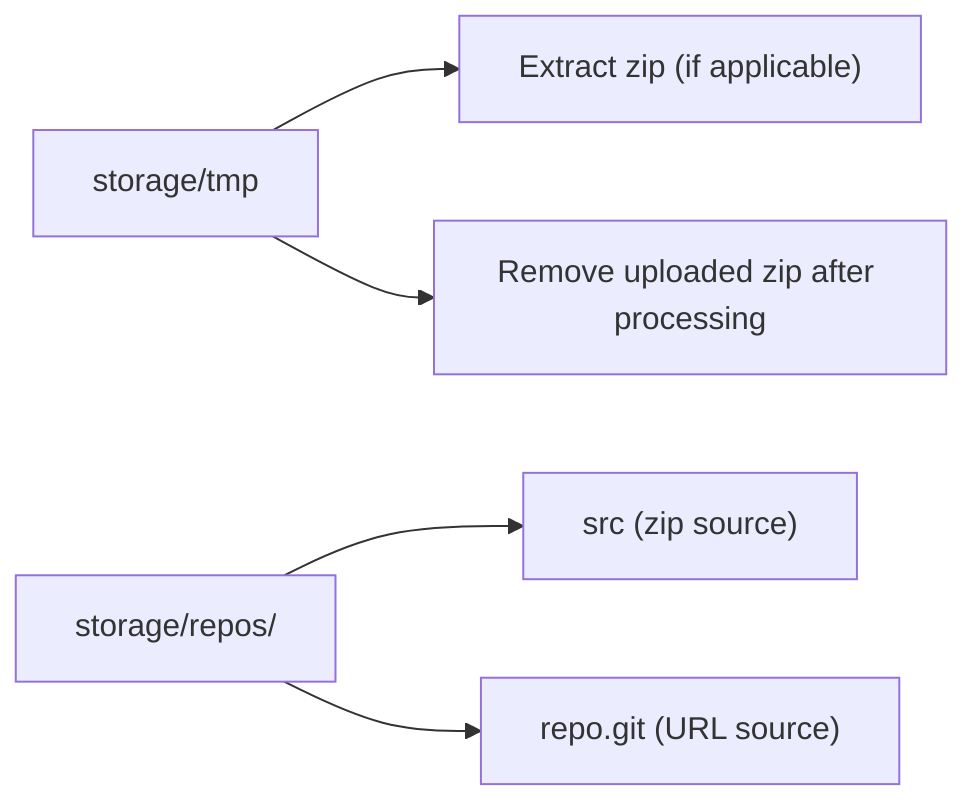
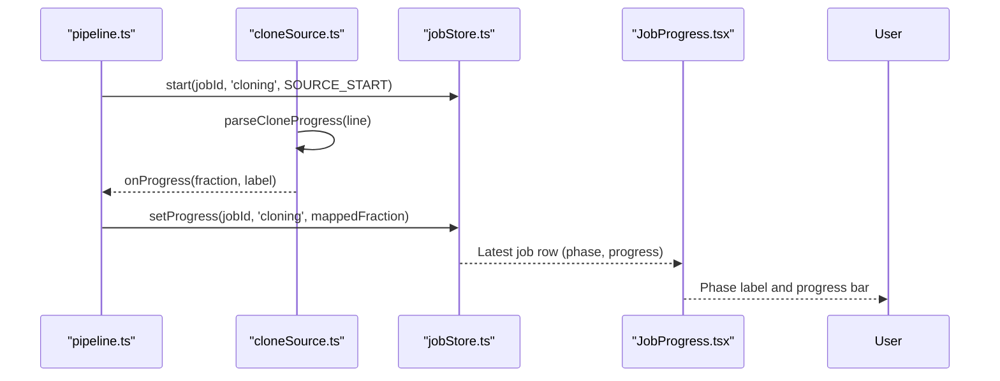
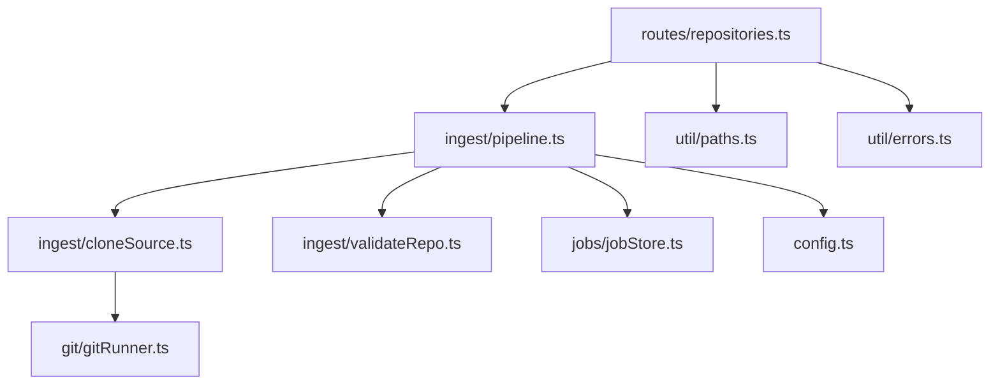

# URL Cloning Workflow

<cite>
**Referenced Files in This Document**
- [cloneSource.ts](file://apps/api/src/ingest/cloneSource.ts)
- [gitRunner.ts](file://apps/api/src/git/gitRunner.ts)
- [pipeline.ts](file://apps/api/src/ingest/pipeline.ts)
- [validateRepo.ts](file://apps/api/src/ingest/validateRepo.ts)
- [queue.ts](file://apps/api/src/jobs/queue.ts)
- [jobStore.ts](file://apps/api/src/jobs/jobStore.ts)
- [repositories.ts](file://apps/api/src/routes/repositories.ts)
- [paths.ts](file://apps/api/src/util/paths.ts)
- [errors.ts](file://apps/api/src/util/errors.ts)
- [config.ts](file://apps/api/src/config.ts)
- [CloneUrlForm.tsx](file://apps/web/src/components/ingest/CloneUrlForm.tsx)
- [JobProgress.tsx](file://apps/web/src/components/ingest/JobProgress.tsx)
</cite>

## Table of Contents
1. [Introduction](#introduction)
2. [Project Structure](#project-structure)
3. [Core Components](#core-components)
4. [Architecture Overview](#architecture-overview)
5. [Detailed Component Analysis](#detailed-component-analysis)
6. [Dependency Analysis](#dependency-analysis)
7. [Performance Considerations](#performance-considerations)
8. [Troubleshooting Guide](#troubleshooting-guide)
9. [Conclusion](#conclusion)

## Introduction
This document explains the remote repository cloning workflow used by the application. It covers how Git URLs are validated, how private repositories are accessed through Git’s built-in authentication mechanisms, how timeouts and network errors are handled, and how long-running clone operations integrate with an in-process job queue. It also documents progress tracking from the web interface to the database, temporary directory handling, and the decision to use a full mirror clone rather than a shallow clone.

## Project Structure
The cloning workflow spans several layers:
- Web UI collects the clone URL and displays progress.
- API routes validate input, persist repository metadata, and enqueue ingestion jobs.
- The pipeline orchestrates cloning, validation, analysis, and finalization.
- Git execution is encapsulated in a runner that manages environment variables, streaming output, and timeouts.
- A simple in-process queue serializes long-running tasks.
- Job state is persisted so the UI can poll for updates.

**Diagram sources**
- [CloneUrlForm.tsx:10-38](file://apps/web/src/components/ingest/CloneUrlForm.tsx#L10-L38)
- [repositories.ts:117-135](file://apps/api/src/routes/repositories.ts#L117-L135)
- [pipeline.ts:41-130](file://apps/api/src/ingest/pipeline.ts#L41-L130)
- [cloneSource.ts:41-63](file://apps/api/src/ingest/cloneSource.ts#L41-L63)
- [gitRunner.ts:55-147](file://apps/api/src/git/gitRunner.ts#L55-L147)
- [validateRepo.ts:15-42](file://apps/api/src/ingest/validateRepo.ts#L15-L42)
- [queue.ts:15-53](file://apps/api/src/jobs/queue.ts#L15-L53)
- [jobStore.ts:44-127](file://apps/api/src/jobs/jobStore.ts#L44-L127)
- [paths.ts:4-17](file://apps/api/src/util/paths.ts#L4-L17)
- [config.ts:49-66](file://apps/api/src/config.ts#L49-L66)

**Section sources**
- [CloneUrlForm.tsx:10-38](file://apps/web/src/components/ingest/CloneUrlForm.tsx#L10-L38)
- [repositories.ts:117-135](file://apps/api/src/routes/repositories.ts#L117-L135)
- [pipeline.ts:41-130](file://apps/api/src/ingest/pipeline.ts#L41-L130)
- [cloneSource.ts:41-63](file://apps/api/src/ingest/cloneSource.ts#L41-L63)
- [gitRunner.ts:55-147](file://apps/api/src/git/gitRunner.ts#L55-L147)
- [validateRepo.ts:15-42](file://apps/api/src/ingest/validateRepo.ts#L15-L42)
- [queue.ts:15-53](file://apps/api/src/jobs/queue.ts#L15-L53)
- [jobStore.ts:44-127](file://apps/api/src/jobs/jobStore.ts#L44-L127)
- [paths.ts:4-17](file://apps/api/src/util/paths.ts#L4-L17)
- [config.ts:49-66](file://apps/api/src/config.ts#L49-L66)

## Core Components
- URL validation: The web form and API route both enforce allowed URL schemes and basic length constraints.
- Authentication: No custom credentials are injected; Git uses its standard credential helpers, SSH keys, or HTTPS tokens configured on the host machine.
- Timeouts: Clone and Git commands have configurable timeouts enforced by the runner.
- Network error recovery: Non-zero exit codes are surfaced as structured application errors; the queue isolates failures so one task does not block others.
- Cloning strategy: A full mirror clone is used to preserve all refs and history, which is required for analysis without a worktree.
- Progress tracking: Git’s `--progress` output is parsed into coarse fractions and mapped to job phases.
- Temporary directories: Uploads and repository storage are isolated under a configured storage root.

**Section sources**
- [repositories.ts:58-69](file://apps/api/src/routes/repositories.ts#L58-L69)
- [CloneUrlForm.tsx:7-22](file://apps/web/src/components/ingest/CloneUrlForm.tsx#L7-L22)
- [gitRunner.ts:31-39](file://apps/api/src/git/gitRunner.ts#L31-L39)
- [gitRunner.ts:73-79](file://apps/api/src/git/gitRunner.ts#L73-L79)
- [cloneSource.ts:41-63](file://apps/api/src/ingest/cloneSource.ts#L41-L63)
- [pipeline.ts:66-80](file://apps/api/src/ingest/pipeline.ts#L66-L80)
- [paths.ts:4-17](file://apps/api/src/util/paths.ts#L4-L17)
- [config.ts:49-66](file://apps/api/src/config.ts#L49-L66)

## Architecture Overview
The cloning request flows from the UI to the API, then into a serialized job queue. The pipeline performs cloning, validates the resulting Git repository, analyzes commits, and finalizes the repository record. Progress updates flow back to the job store so the UI can render phase labels and percentages.

**Diagram sources**
- [CloneUrlForm.tsx:16-38](file://apps/web/src/components/ingest/CloneUrlForm.tsx#L16-L38)
- [repositories.ts:117-135](file://apps/api/src/routes/repositories.ts#L117-L135)
- [queue.ts:15-53](file://apps/api/src/jobs/queue.ts#L15-L53)
- [pipeline.ts:41-130](file://apps/api/src/ingest/pipeline.ts#L41-L130)
- [cloneSource.ts:41-63](file://apps/api/src/ingest/cloneSource.ts#L41-L63)
- [gitRunner.ts:55-147](file://apps/api/src/git/gitRunner.ts#L55-L147)
- [jobStore.ts:44-127](file://apps/api/src/jobs/jobStore.ts#L44-L127)

## Detailed Component Analysis

### URL Validation and Input Handling
- Web form validation enforces allowed schemes and trims whitespace before submission.
- API validation uses a schema to require a non-empty string, limit length, and restrict schemes to HTTP(S), git, ssh, or git@.
- If validation fails, the API returns a structured bad request error.

**Diagram sources**
- [CloneUrlForm.tsx:7-22](file://apps/web/src/components/ingest/CloneUrlForm.tsx#L7-L22)
- [repositories.ts:58-69](file://apps/api/src/routes/repositories.ts#L58-L69)
- [repositories.ts:117-135](file://apps/api/src/routes/repositories.ts#L117-L135)

**Section sources**
- [CloneUrlForm.tsx:7-22](file://apps/web/src/components/ingest/CloneUrlForm.tsx#L7-L22)
- [repositories.ts:58-69](file://apps/api/src/routes/repositories.ts#L58-L69)

### Authentication Handling for Private Repositories
- The runner configures Git to be non-interactive: it disables terminal prompts, sets a no-op askpass helper, and prevents interactive Git credential manager behavior.
- No credentials are passed programmatically; authentication relies on the host environment:
  - SSH: SSH agent or key files configured for the user running the server.
  - HTTPS: Git credential helpers or tokens configured via Git configuration.
- This design avoids embedding secrets in the application while ensuring Git commands do not hang waiting for user input.

**Diagram sources**
- [gitRunner.ts:31-39](file://apps/api/src/git/gitRunner.ts#L31-L39)
- [gitRunner.ts:55-147](file://apps/api/src/git/gitRunner.ts#L55-L147)

**Section sources**
- [gitRunner.ts:31-39](file://apps/api/src/git/gitRunner.ts#L31-L39)
- [gitRunner.ts:55-147](file://apps/api/src/git/gitRunner.ts#L55-L147)

### Timeout Configuration and Network Error Recovery
- Clone timeout is configurable via environment and applied when spawning Git.
- If Git exceeds the timeout, the runner kills the child process and resolves with a special result indicating a timeout.
- Non-zero exit codes from Git are converted into structured application errors with actionable messages.
- The queue swallows task rejections so one failing clone does not block subsequent jobs.

**Diagram sources**
- [gitRunner.ts:73-79](file://apps/api/src/git/gitRunner.ts#L73-L79)
- [gitRunner.ts:126-141](file://apps/api/src/git/gitRunner.ts#L126-L141)
- [cloneSource.ts:50-63](file://apps/api/src/ingest/cloneSource.ts#L50-L63)
- [queue.ts:28-36](file://apps/api/src/jobs/queue.ts#L28-L36)

**Section sources**
- [config.ts:54-66](file://apps/api/src/config.ts#L54-L66)
- [gitRunner.ts:73-79](file://apps/api/src/git/gitRunner.ts#L73-L79)
- [gitRunner.ts:126-141](file://apps/api/src/git/gitRunner.ts#L126-L141)
- [cloneSource.ts:50-63](file://apps/api/src/ingest/cloneSource.ts#L50-L63)
- [queue.ts:28-36](file://apps/api/src/jobs/queue.ts#L28-L36)

### Cloning Strategy: Full Mirror Clone
- The implementation uses `git clone --mirror`, which preserves all refs and the complete history.
- This is necessary because analysis runs against a bare repository without a worktree.
- Shallow clones are not used; this increases initial clone time but ensures full history availability.

**Diagram sources**
- [cloneSource.ts:41-48](file://apps/api/src/ingest/cloneSource.ts#L41-L48)
- [paths.ts:14-17](file://apps/api/src/util/paths.ts#L14-L17)
- [validateRepo.ts:15-42](file://apps/api/src/ingest/validateRepo.ts#L15-L42)

**Section sources**
- [cloneSource.ts:41-48](file://apps/api/src/ingest/cloneSource.ts#L41-L48)
- [paths.ts:14-17](file://apps/api/src/util/paths.ts#L14-L17)
- [validateRepo.ts:15-42](file://apps/api/src/ingest/validateRepo.ts#L15-L42)

### Credential Management and Temporary Directory Handling
- Credentials are managed by Git and the operating system; the application does not store them.
- Temporary uploads are stored under a configured temp directory and removed after extraction.
- Repository data is stored under a repos directory, with each repository having its own subdirectory containing either extracted sources or a mirror clone.

**Diagram sources**
- [config.ts:59-66](file://apps/api/src/config.ts#L59-L66)
- [pipeline.ts:119-124](file://apps/api/src/ingest/pipeline.ts#L119-L124)
- [paths.ts:4-17](file://apps/api/src/util/paths.ts#L4-L17)

**Section sources**
- [config.ts:59-66](file://apps/api/src/config.ts#L59-L66)
- [pipeline.ts:119-124](file://apps/api/src/ingest/pipeline.ts#L119-L124)
- [paths.ts:4-17](file://apps/api/src/util/paths.ts#L4-L17)

### Integration with the Job Queue and Progress Tracking
- The queue runs one task at a time to keep DB writes and disk I/O predictable.
- The pipeline maps Git progress lines to coarse fractions and updates the job store accordingly.
- The UI renders phase labels and percentage progress based on the latest job record.

**Diagram sources**
- [pipeline.ts:66-80](file://apps/api/src/ingest/pipeline.ts#L66-L80)
- [cloneSource.ts:17-30](file://apps/api/src/ingest/cloneSource.ts#L17-L30)
- [jobStore.ts:67-87](file://apps/api/src/jobs/jobStore.ts#L67-L87)
- [JobProgress.tsx:10-43](file://apps/web/src/components/ingest/JobProgress.tsx#L10-L43)

**Section sources**
- [queue.ts:1-13](file://apps/api/src/jobs/queue.ts#L1-L13)
- [pipeline.ts:66-80](file://apps/api/src/ingest/pipeline.ts#L66-L80)
- [cloneSource.ts:17-30](file://apps/api/src/ingest/cloneSource.ts#L17-L30)
- [jobStore.ts:67-87](file://apps/api/src/jobs/jobStore.ts#L67-L87)
- [JobProgress.tsx:10-43](file://apps/web/src/components/ingest/JobProgress.tsx#L10-L43)

## Dependency Analysis
The following diagram shows how components depend on each other during cloning:

**Diagram sources**
- [repositories.ts:117-135](file://apps/api/src/routes/repositories.ts#L117-L135)
- [pipeline.ts:41-130](file://apps/api/src/ingest/pipeline.ts#L41-L130)
- [cloneSource.ts:41-63](file://apps/api/src/ingest/cloneSource.ts#L41-L63)
- [gitRunner.ts:55-147](file://apps/api/src/git/gitRunner.ts#L55-L147)
- [validateRepo.ts:15-42](file://apps/api/src/ingest/validateRepo.ts#L15-L42)
- [jobStore.ts:44-127](file://apps/api/src/jobs/jobStore.ts#L44-L127)
- [paths.ts:4-17](file://apps/api/src/util/paths.ts#L4-L17)
- [config.ts:49-66](file://apps/api/src/config.ts#L49-L66)
- [errors.ts:5-15](file://apps/api/src/util/errors.ts#L5-L15)

**Section sources**
- [repositories.ts:117-135](file://apps/api/src/routes/repositories.ts#L117-L135)
- [pipeline.ts:41-130](file://apps/api/src/ingest/pipeline.ts#L41-L130)
- [cloneSource.ts:41-63](file://apps/api/src/ingest/cloneSource.ts#L41-L63)
- [gitRunner.ts:55-147](file://apps/api/src/git/gitRunner.ts#L55-L147)
- [validateRepo.ts:15-42](file://apps/api/src/ingest/validateRepo.ts#L15-L42)
- [jobStore.ts:44-127](file://apps/api/src/jobs/jobStore.ts#L44-L127)
- [paths.ts:4-17](file://apps/api/src/util/paths.ts#L4-L17)
- [config.ts:49-66](file://apps/api/src/config.ts#L49-L66)
- [errors.ts:5-15](file://apps/api/src/util/errors.ts#L5-L15)

## Performance Considerations
- Full mirror clones include all refs and history, increasing initial clone time compared to shallow clones. This is intentional to support analysis without a worktree.
- Streaming Git output reduces memory usage by retaining only small tails when callbacks are provided.
- The single-concurrency queue prevents resource contention during large clones and analyses.
- Timeouts protect against hanging processes and allow the queue to continue processing other jobs.

[No sources needed since this section provides general guidance]

## Troubleshooting Guide
Common scenarios and their handling:

- Successful cloning:
  - The API returns 202 Accepted immediately with a job identifier.
  - The job transitions through phases: cloning, validating, analyzing, finalizing, complete.
  - The UI shows phase labels and progress percentages.

- Network failures:
  - Git exits with a non-zero code; the runner returns a result with the exit code and stderr tail.
  - The clone function throws a structured application error with a descriptive message.
  - The pipeline catches errors, marks the repository and job as failed, and logs the message.

- Authentication failures:
  - Because Git is non-interactive, missing credentials cause Git to fail quickly rather than hanging.
  - Ensure SSH keys or HTTPS tokens are configured on the server host where the API runs.

- Timeouts:
  - If cloning exceeds the configured timeout, the runner kills the process and reports a timeout.
  - The job is marked failed with a message indicating the timeout duration.

- Invalid URLs:
  - Frontend and backend validation reject unsupported schemes or empty inputs.
  - The API returns a structured validation error.

**Section sources**
- [repositories.ts:58-69](file://apps/api/src/routes/repositories.ts#L58-L69)
- [repositories.ts:117-135](file://apps/api/src/routes/repositories.ts#L117-L135)
- [cloneSource.ts:50-63](file://apps/api/src/ingest/cloneSource.ts#L50-L63)
- [gitRunner.ts:126-141](file://apps/api/src/git/gitRunner.ts#L126-L141)
- [pipeline.ts:114-124](file://apps/api/src/ingest/pipeline.ts#L114-L124)
- [jobStore.ts:95-99](file://apps/api/src/jobs/jobStore.ts#L95-L99)
- [JobProgress.tsx:10-43](file://apps/web/src/components/ingest/JobProgress.tsx#L10-L43)

## Conclusion
The cloning workflow prioritizes reliability and observability over speed by using full mirror clones, non-interactive Git execution, and strict timeouts. Authentication is delegated to Git and the host environment, keeping credentials out of the application. Long-running operations are serialized through a simple queue, and progress is streamed and persisted so the UI can provide real-time feedback. For private repositories, ensure proper SSH or HTTPS credentials are available on the server. For performance-sensitive environments, consider tuning timeouts and monitoring disk I/O, understanding that full history is required for analysis.

[No sources needed since this section summarizes without analyzing specific files]