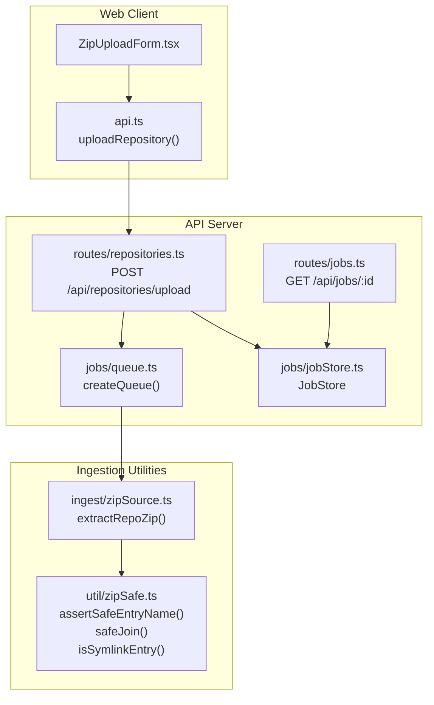
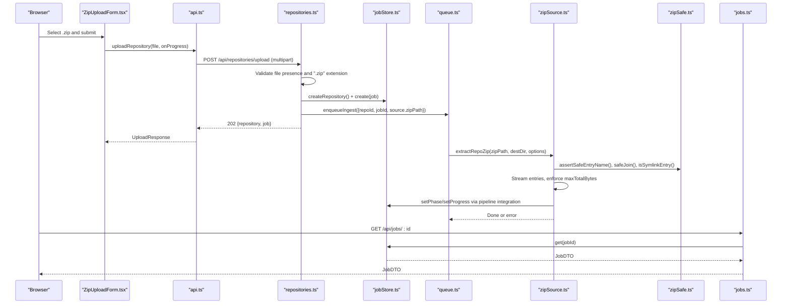
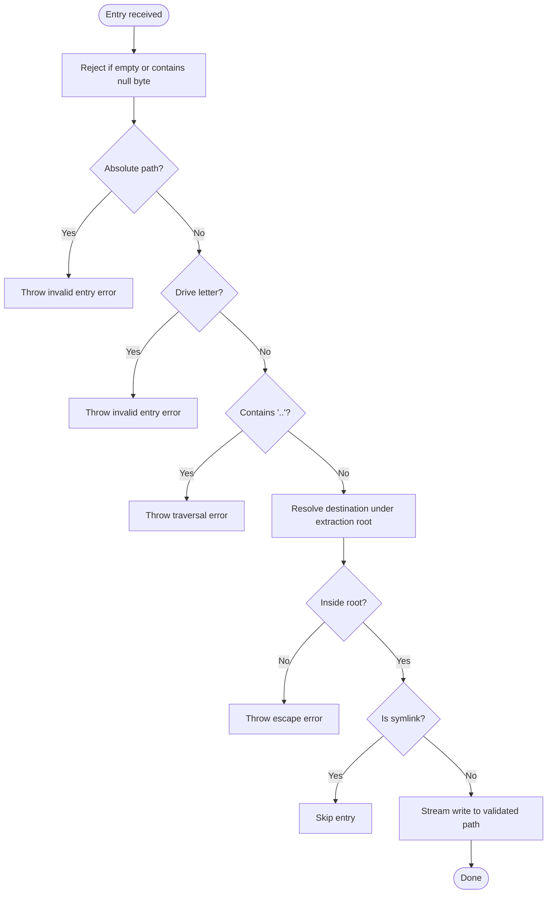
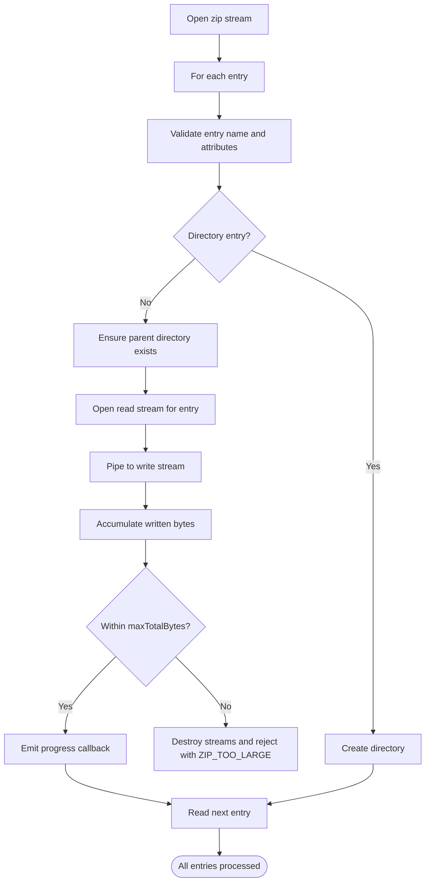
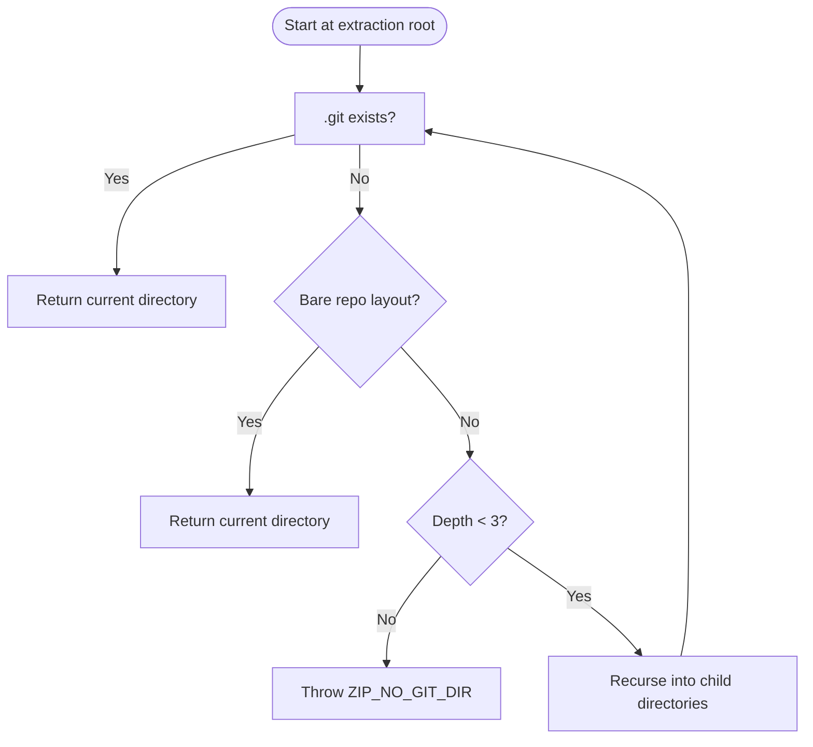
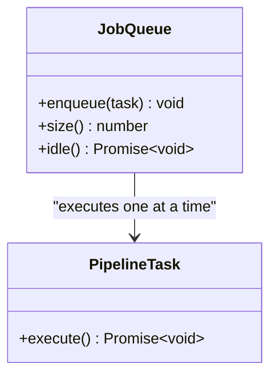
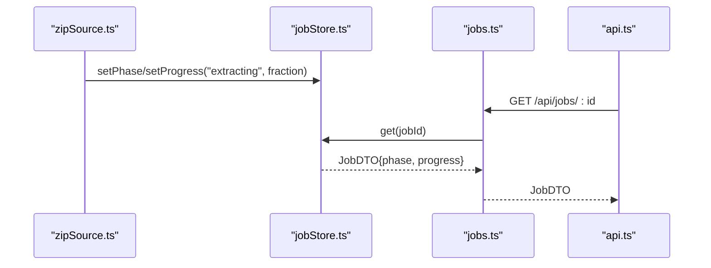
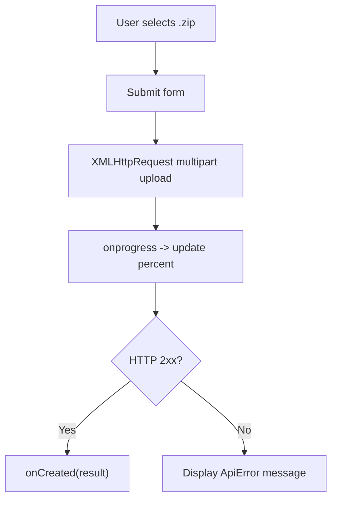
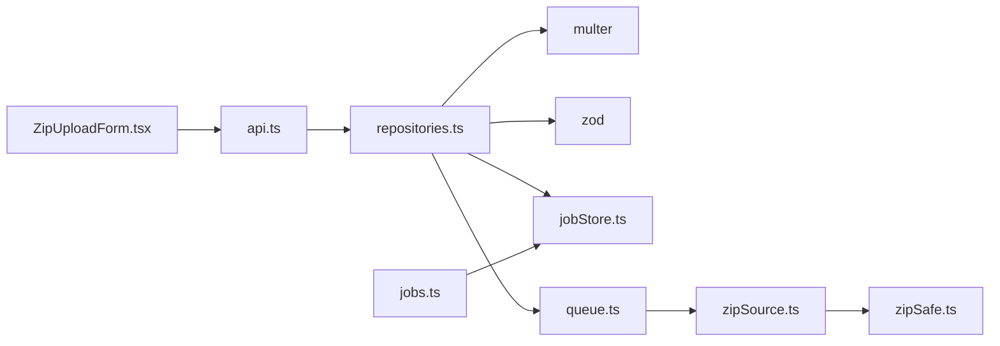

# Zip Upload Processing

<cite>
**Referenced Files in This Document**   
- [zipSafe.ts](file://apps/api/src/util/zipSafe.ts)
- [zipSource.ts](file://apps/api/src/ingest/zipSource.ts)
- [repositories.ts](file://apps/api/src/routes/repositories.ts)
- [api.ts](file://apps/web/src/lib/api.ts)
- [ZipUploadForm.tsx](file://apps/web/src/components/ingest/ZipUploadForm.tsx)
- [queue.ts](file://apps/api/src/jobs/queue.ts)
- [jobStore.ts](file://apps/api/src/jobs/jobStore.ts)
- [jobs.ts](file://apps/api/src/routes/jobs.ts)
- [errors.ts](file://apps/api/src/util/errors.ts)
</cite>

## Table of Contents
1. [Introduction](#introduction)
2. [Project Structure](#project-structure)
3. [Core Components](#core-components)
4. [Architecture Overview](#architecture-overview)
5. [Detailed Component Analysis](#detailed-component-analysis)
6. [Dependency Analysis](#dependency-analysis)
7. [Performance Considerations](#performance-considerations)
8. [Troubleshooting Guide](#troubleshooting-guide)
9. [Conclusion](#conclusion)

## Introduction
This document explains the secure zip upload and extraction pipeline used to ingest repository archives into the system. It covers:
- Secure zip extraction with path traversal protection, symlink handling, and zip-bomb defense.
- File size validation and format verification during upload.
- Safe unzip implementation details and temporary file management.
- Error handling and validation feedback for users.
- Integration with an in-process job queue for asynchronous processing.
- Progress reporting from upload and extraction phases.

The goal is to make the security model, data flow, and operational behavior clear for both developers and operators.

## Project Structure
The zip upload feature spans the web client, API routes, ingestion utilities, and job infrastructure:
- Web client: multipart upload form and progress UI.
- API route: accepts uploads, validates archive type, creates a repository record, and enqueues an ingestion job.
- Ingestion utility: streams and safely extracts the zip, validates entries, and locates the git directory.
- Job queue and store: serialize work and persist progress/status.
- Shared error helpers: structured error codes and messages.

**Diagram sources**
- [ZipUploadForm.tsx:12-35](file://apps/web/src/components/ingest/ZipUploadForm.tsx#L12-L35)
- [api.ts:147-189](file://apps/web/src/lib/api.ts#L147-L189)
- [repositories.ts:72-115](file://apps/api/src/routes/repositories.ts#L72-L115)
- [queue.ts:15-53](file://apps/api/src/jobs/queue.ts#L15-L53)
- [jobStore.ts:44-127](file://apps/api/src/jobs/jobStore.ts#L44-L127)
- [zipSource.ts:27-209](file://apps/api/src/ingest/zipSource.ts#L27-L209)
- [zipSafe.ts:11-42](file://apps/api/src/util/zipSafe.ts#L11-L42)
- [jobs.ts:22-33](file://apps/api/src/routes/jobs.ts#L22-L33)

**Section sources**
- [ZipUploadForm.tsx:12-89](file://apps/web/src/components/ingest/ZipUploadForm.tsx#L12-L89)
- [api.ts:147-189](file://apps/web/src/lib/api.ts#L147-L189)
- [repositories.ts:72-115](file://apps/api/src/routes/repositories.ts#L72-L115)
- [zipSource.ts:27-209](file://apps/api/src/ingest/zipSource.ts#L27-L209)
- [zipSafe.ts:11-42](file://apps/api/src/util/zipSafe.ts#L11-L42)
- [queue.ts:15-53](file://apps/api/src/jobs/queue.ts#L15-L53)
- [jobStore.ts:44-127](file://apps/api/src/jobs/jobStore.ts#L44-L127)
- [jobs.ts:22-33](file://apps/api/src/routes/jobs.ts#L22-L33)

## Core Components
- Secure zip entry validation: prevents absolute paths, drive letters, traversal segments, null bytes, and symlinks; enforces containment within the extraction root.
- Streaming extraction: reads entries one by one, writes to disk only after validation, tracks total uncompressed bytes, and stops on size limits.
- Git repository discovery: finds a valid `.git` directory or bare repo layout inside the extracted tree.
- Upload endpoint: validates uploaded file extension, stores temporarily, creates repository and job records, and enqueues ingestion.
- Job queue: serializes ingestion tasks to keep resource usage predictable.
- Job store: persists job lifecycle, phase, and progress for polling.
- Web upload form: collects user input, shows upload progress, and displays errors.

**Section sources**
- [zipSafe.ts:11-42](file://apps/api/src/util/zipSafe.ts#L11-L42)
- [zipSource.ts:27-209](file://apps/api/src/ingest/zipSource.ts#L27-L209)
- [repositories.ts:84-115](file://apps/api/src/routes/repositories.ts#L84-L115)
- [queue.ts:15-53](file://apps/api/src/jobs/queue.ts#L15-L53)
- [jobStore.ts:44-127](file://apps/api/src/jobs/jobStore.ts#L44-L127)
- [ZipUploadForm.tsx:12-89](file://apps/web/src/components/ingest/ZipUploadForm.tsx#L12-L89)

## Architecture Overview
The end-to-end flow for a zip upload is:
1. The browser form sends a multipart POST with the archive.
2. The API validates that the file is present and has a `.zip` extension.
3. A repository row and a job row are created.
4. The ingestion task is enqueued.
5. The queue runs one task at a time, invoking the zip extractor.
6. The extractor validates each entry, streams content safely, and locates the git directory.
7. The job store updates status and progress as the pipeline advances.
8. The client polls `/api/jobs/:id` to track progress.

**Diagram sources**
- [ZipUploadForm.tsx:19-35](file://apps/web/src/components/ingest/ZipUploadForm.tsx#L19-L35)
- [api.ts:147-189](file://apps/web/src/lib/api.ts#L147-L189)
- [repositories.ts:84-115](file://apps/api/src/routes/repositories.ts#L84-L115)
- [jobStore.ts:44-127](file://apps/api/src/jobs/jobStore.ts#L44-L127)
- [queue.ts:15-53](file://apps/api/src/jobs/queue.ts#L15-L53)
- [zipSource.ts:27-209](file://apps/api/src/ingest/zipSource.ts#L27-L209)
- [zipSafe.ts:11-42](file://apps/api/src/util/zipSafe.ts#L11-L42)
- [jobs.ts:22-33](file://apps/api/src/routes/jobs.ts#L22-L33)

## Detailed Component Analysis

### Secure Zip Extraction and Path Traversal Protection
The extraction utility provides three core safety mechanisms:
- Entry name validation: rejects null bytes, absolute paths, Windows drive-letter prefixes, and `..` segments.
- Destination containment: normalizes and resolves the target path, then verifies it remains under the extraction root.
- Symlink detection: skips entries flagged as symbolic links to avoid link-based escapes.

**Diagram sources**
- [zipSafe.ts:11-35](file://apps/api/src/util/zipSafe.ts#L11-L35)
- [zipSafe.ts:38-42](file://apps/api/src/util/zipSafe.ts#L38-L42)

**Section sources**
- [zipSafe.ts:11-42](file://apps/api/src/util/zipSafe.ts#L11-L42)

### Streaming Unzip Implementation and Zip-Bomb Defense
The extractor uses streaming I/O to avoid loading entire archives into memory:
- Opens the zip lazily and iterates entries one by one.
- Skips macOS metadata directories.
- Validates each entry using the safe helpers.
- Creates directories as needed and streams file contents to disk.
- Tracks cumulative uncompressed bytes and aborts when exceeding the configured maximum.
- Reports progress per processed entry.

**Diagram sources**
- [zipSource.ts:14-21](file://apps/api/src/ingest/zipSource.ts#L14-L21)
- [zipSource.ts:27-127](file://apps/api/src/ingest/zipSource.ts#L27-L127)

**Section sources**
- [zipSource.ts:14-127](file://apps/api/src/ingest/zipSource.ts#L14-L127)

### Git Repository Discovery After Extraction
After extraction, the system searches for a usable git directory:
- Breadth-first search up to depth 3 to tolerate wrapper folders.
- Accepts a standard `.git` directory or a bare repository layout (`HEAD`, `objects/`, `refs/`).
- Rejects `.git` files (worktree pointers) and reports actionable guidance.
- Throws a specific error if no git directory is found.

**Diagram sources**
- [zipSource.ts:145-197](file://apps/api/src/ingest/zipSource.ts#L145-L197)

**Section sources**
- [zipSource.ts:145-197](file://apps/api/src/ingest/zipSource.ts#L145-L197)

### Upload Handling and Validation Errors
The upload endpoint performs these checks:
- Requires a multipart field named `file`.
- Enforces `.zip` extension (case-insensitive).
- Cleans up the temporary file immediately on rejection.
- Creates a sanitized repository name and persists repository and job records.
- Returns a 202 Accepted response with initial repository and job information.

Common validation errors include:
- Missing file attachment.
- Non-zip file type.
- Invalid zip structure or unreadable entries.
- Excessive number of entries.
- Archive expansion beyond allowed size.
- Missing git repository structure.

Error responses use structured codes such as `UPLOAD_MISSING_FILE`, `UPLOAD_NOT_ZIP`, `ZIP_INVALID`, `ZIP_TOO_LARGE`, `ZIP_GIT_FILE`, and `ZIP_NO_GIT_DIR`.

**Section sources**
- [repositories.ts:84-115](file://apps/api/src/routes/repositories.ts#L84-L115)
- [errors.ts:17-27](file://apps/api/src/util/errors.ts#L17-L27)
- [zipSource.ts:57-127](file://apps/api/src/ingest/zipSource.ts#L57-L127)
- [zipSource.ts:161-197](file://apps/api/src/ingest/zipSource.ts#L161-L197)

### Temporary File Management and Cleanup
- Multer stores the uploaded archive in a configurable temporary directory.
- If the file fails basic validation (e.g., wrong extension), the temporary file is removed synchronously before responding.
- Successful uploads proceed to ingestion; cleanup of temporary artifacts is handled by the ingestion pipeline and repository deletion logic.
- Repository deletion ensures the storage directory is removed only if it resides under the configured repositories base directory.

**Section sources**
- [repositories.ts:74-95](file://apps/api/src/routes/repositories.ts#L74-L95)
- [repositories.ts:143-161](file://apps/api/src/routes/repositories.ts#L143-L161)

### Job Queue Integration and Asynchronous Processing
- The queue is an in-process FIFO scheduler with concurrency 1.
- It ensures one ingestion task runs at a time, keeping database writes and disk I/O predictable.
- Tasks catch and swallow their own errors so a single failure does not break the queue.
- The queue exposes helpers for introspection and waiting until idle.

**Diagram sources**
- [queue.ts:1-55](file://apps/api/src/jobs/queue.ts#L1-L55)

**Section sources**
- [queue.ts:1-55](file://apps/api/src/jobs/queue.ts#L1-L55)

### Progress Reporting During Extraction
- The extractor emits a progress callback for each processed entry, including directories and files.
- The ingestion pipeline integrates with the job store to update phase and progress values.
- The client polls `/api/jobs/:id` to retrieve the latest job state, including phase and progress.

**Diagram sources**
- [zipSource.ts:82-117](file://apps/api/src/ingest/zipSource.ts#L82-L117)
- [jobStore.ts:67-87](file://apps/api/src/jobs/jobStore.ts#L67-L87)
- [jobs.ts:22-33](file://apps/api/src/routes/jobs.ts#L22-L33)
- [api.ts:191-193](file://apps/web/src/lib/api.ts#L191-L193)

**Section sources**
- [zipSource.ts:82-117](file://apps/api/src/ingest/zipSource.ts#L82-L117)
- [jobStore.ts:67-87](file://apps/api/src/jobs/jobStore.ts#L67-L87)
- [jobs.ts:22-33](file://apps/api/src/routes/jobs.ts#L22-L33)
- [api.ts:191-193](file://apps/web/src/lib/api.ts#L191-L193)

### Web Client Upload Flow and User Feedback
- The form restricts accepted types to `.zip` and `application/zip`.
- It uses XMLHttpRequest to capture upload progress and display a percentage bar.
- On success, it clears the selected file and invokes a callback to add the new repository to the UI.
- Errors are surfaced through a banner component.

**Diagram sources**
- [ZipUploadForm.tsx:19-35](file://apps/web/src/components/ingest/ZipUploadForm.tsx#L19-L35)
- [ZipUploadForm.tsx:37-89](file://apps/web/src/components/ingest/ZipUploadForm.tsx#L37-L89)
- [api.ts:147-189](file://apps/web/src/lib/api.ts#L147-L189)

**Section sources**
- [ZipUploadForm.tsx:12-89](file://apps/web/src/components/ingest/ZipUploadForm.tsx#L12-L89)
- [api.ts:147-189](file://apps/web/src/lib/api.ts#L147-L189)

## Dependency Analysis
Key dependencies and relationships:
- The upload route depends on multer for multipart parsing and on zod for body validation (clone endpoint).
- The ingestion pipeline depends on the zip extractor and safe helpers.
- The job store persists job state consumed by the jobs route.
- The web client depends on the api helper for HTTP calls and error mapping.

**Diagram sources**
- [repositories.ts:1-21](file://apps/api/src/routes/repositories.ts#L1-L21)
- [zipSource.ts:1-6](file://apps/api/src/ingest/zipSource.ts#L1-L6)
- [zipSafe.ts:1-42](file://apps/api/src/util/zipSafe.ts#L1-L42)
- [jobStore.ts:1-42](file://apps/api/src/jobs/jobStore.ts#L1-L42)
- [jobs.ts:1-6](file://apps/api/src/routes/jobs.ts#L1-L6)
- [api.ts:1-15](file://apps/web/src/lib/api.ts#L1-L15)
- [ZipUploadForm.tsx:1-7](file://apps/web/src/components/ingest/ZipUploadForm.tsx#L1-L7)

**Section sources**
- [repositories.ts:1-21](file://apps/api/src/routes/repositories.ts#L1-L21)
- [zipSource.ts:1-6](file://apps/api/src/ingest/zipSource.ts#L1-L6)
- [zipSafe.ts:1-42](file://apps/api/src/util/zipSafe.ts#L1-L42)
- [jobStore.ts:1-42](file://apps/api/src/jobs/jobStore.ts#L1-L42)
- [jobs.ts:1-6](file://apps/api/src/routes/jobs.ts#L1-L6)
- [api.ts:1-15](file://apps/web/src/lib/api.ts#L1-L15)
- [ZipUploadForm.tsx:1-7](file://apps/web/src/components/ingest/ZipUploadForm.tsx#L1-L7)

## Performance Considerations
- Streaming extraction avoids loading entire archives into memory, reducing peak RAM usage.
- Concurrency limit of 1 in the queue prevents resource contention during long-running ingestion tasks.
- Total uncompressed byte cap protects against zip bombs and excessive disk growth.
- Directory creation is performed incrementally, minimizing unnecessary filesystem operations.
- Polling frequency for job progress should be tuned to balance responsiveness and server load.

[No sources needed since this section provides general guidance]

## Troubleshooting Guide
Common issues and resolutions:
- Missing file attachment: ensure the form submits a multipart field named `file`.
- Wrong file type: only `.zip` archives are accepted; verify the file extension.
- Invalid zip structure: check that the archive is well-formed and readable.
- Too many entries: reduce the number of files in the archive or adjust configuration.
- Zip bomb detected: the archive expands beyond the allowed size; inspect compression ratios and content.
- Missing git repository: the archive must contain a `.git` directory or a bare repo layout.
- Worktree pointer instead of full clone: repackage a full clone including `.git`.

Operational tips:
- Inspect job status and phase via `/api/jobs/:id`.
- Review structured error codes returned by the API.
- Confirm temporary directory permissions and available disk space.
- When deleting repositories, ensure no active ingestion job is running.

**Section sources**
- [repositories.ts:84-115](file://apps/api/src/routes/repositories.ts#L84-L115)
- [zipSource.ts:57-127](file://apps/api/src/ingest/zipSource.ts#L57-L127)
- [zipSource.ts:161-197](file://apps/api/src/ingest/zipSource.ts#L161-L197)
- [errors.ts:17-27](file://apps/api/src/util/errors.ts#L17-L27)
- [jobs.ts:22-33](file://apps/api/src/routes/jobs.ts#L22-L33)

## Conclusion
The zip upload pipeline prioritizes security and reliability:
- Strict entry validation and destination containment prevent path traversal and symlink attacks.
- Streaming extraction with size caps mitigates zip bombs and controls resource consumption.
- Clear validation errors and structured codes help users and operators diagnose problems quickly.
- An in-process queue serializes ingestion work, while the job store provides persistent progress for UI polling.
- The web client offers intuitive upload controls and real-time progress feedback.

Together, these components provide a robust, secure, and observable ingestion workflow for repository archives.