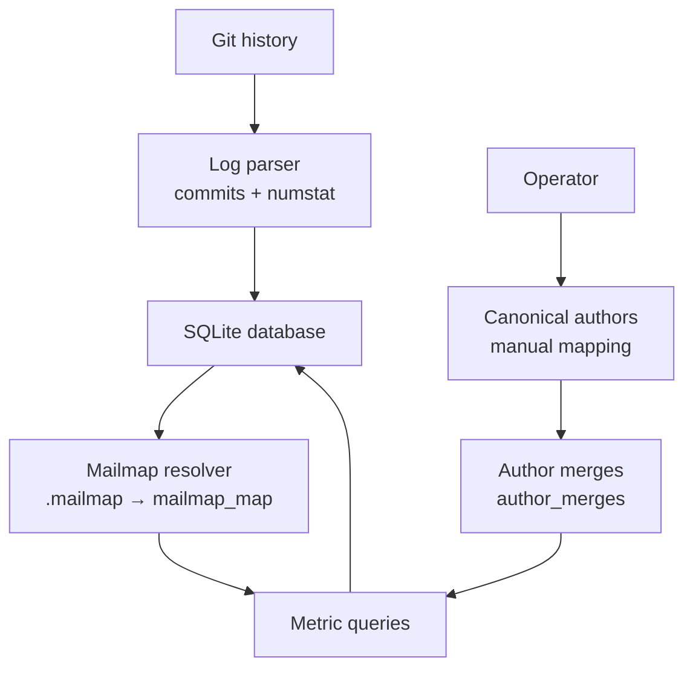
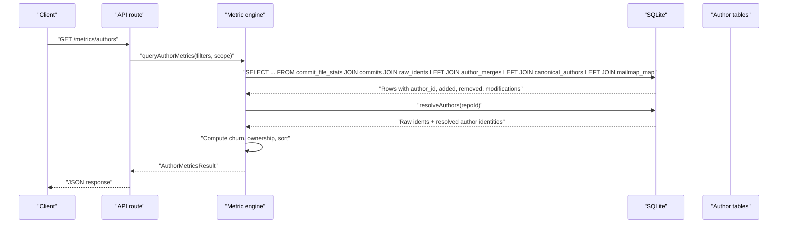
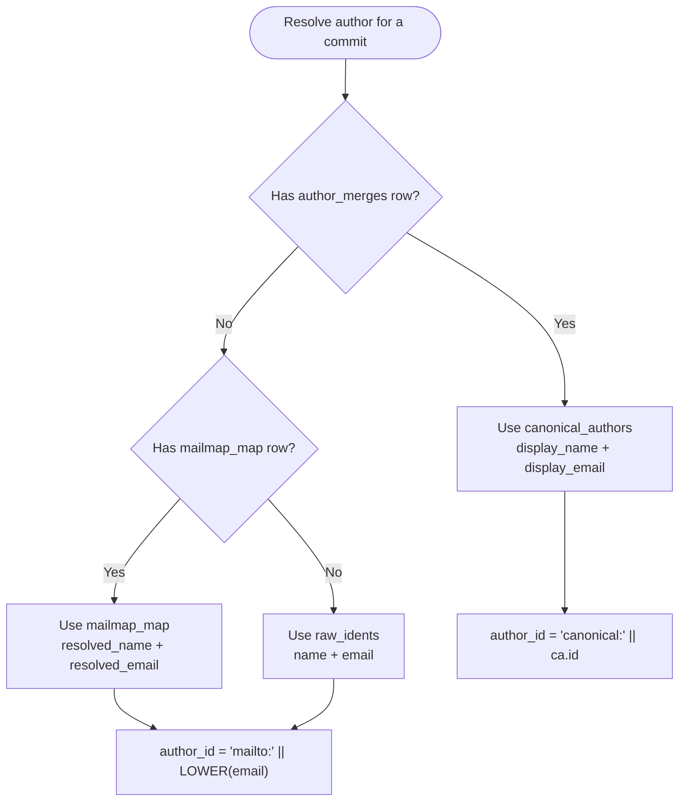
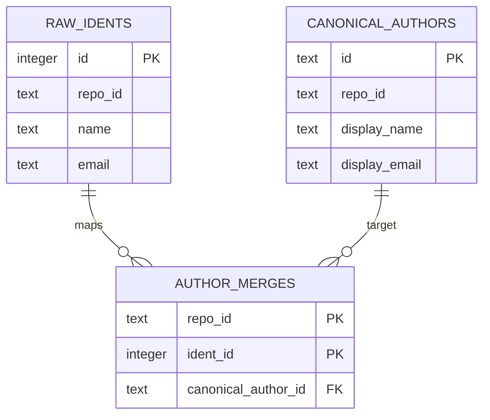
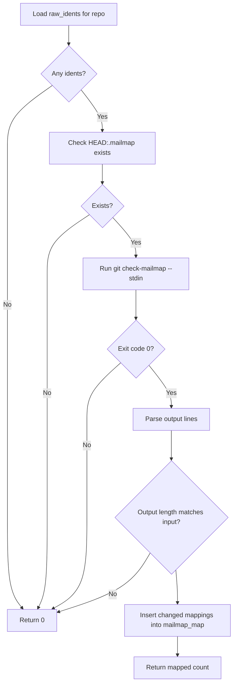
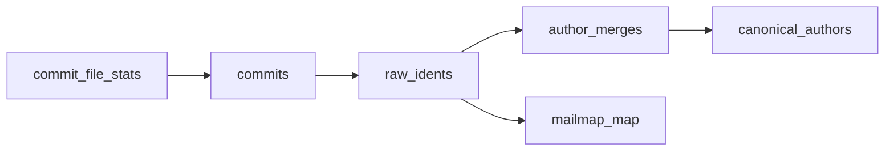
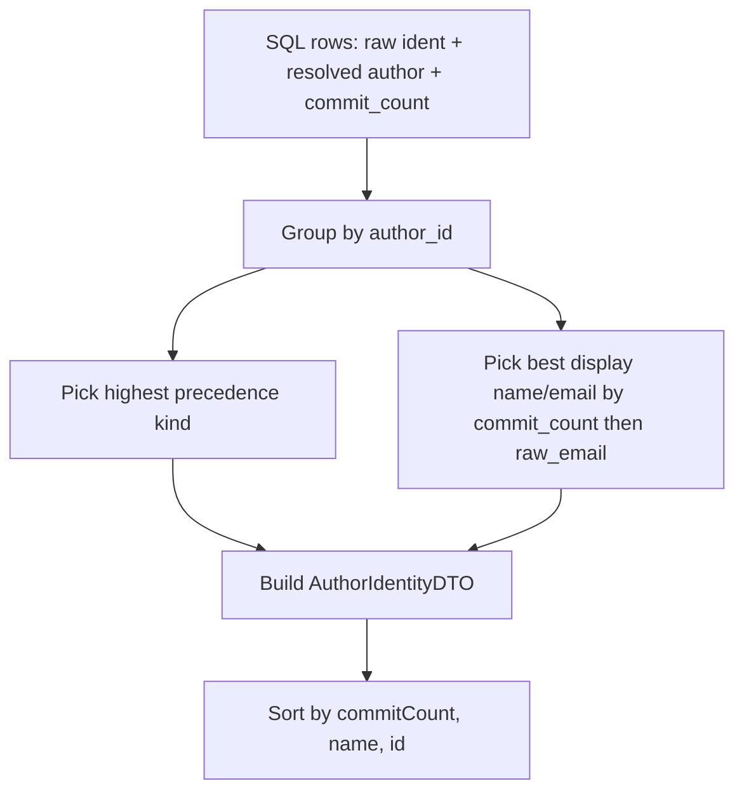
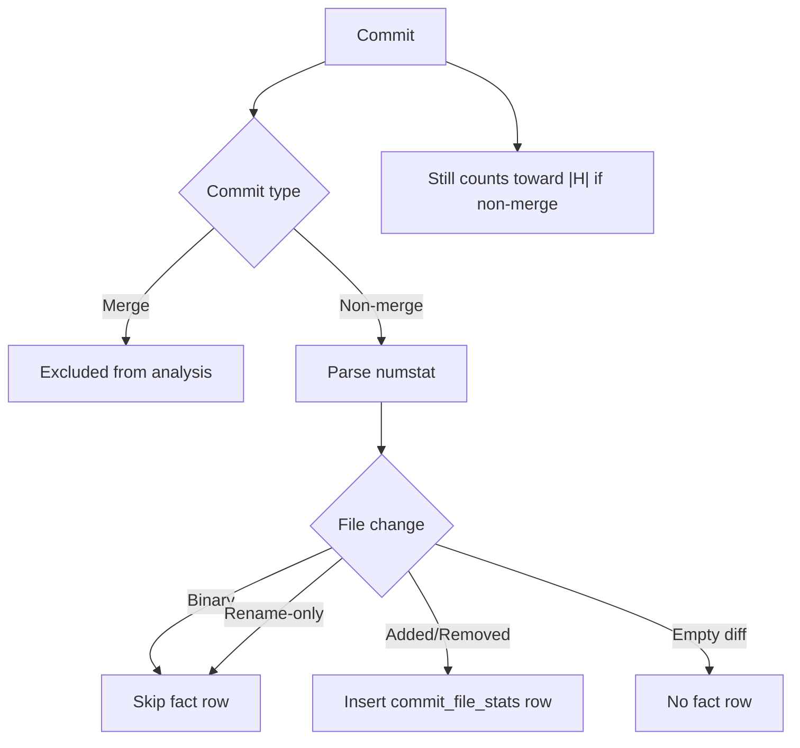
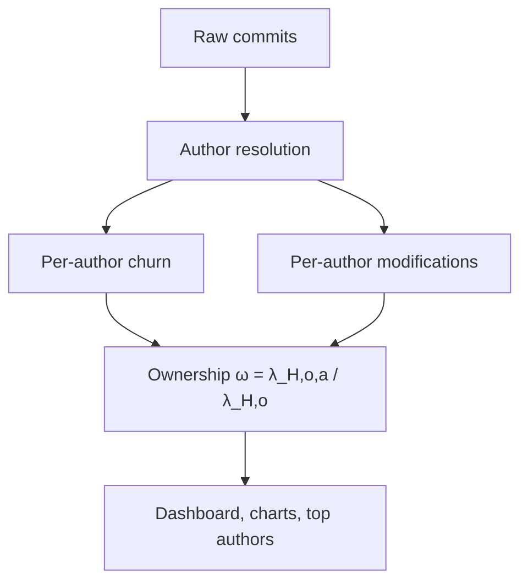
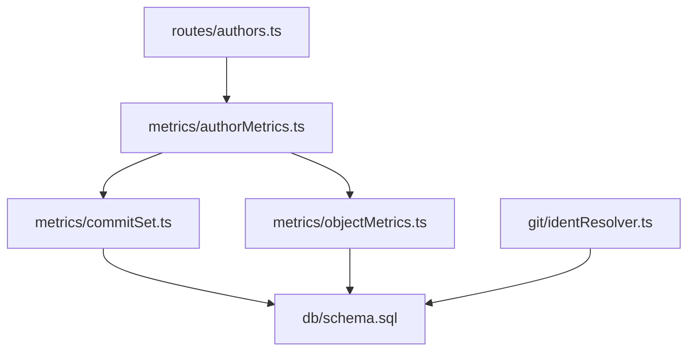

# Author Identity Resolution

<cite>
**Referenced Files in This Document**
- [identResolver.ts](file://apps/api/src/git/identResolver.ts)
- [schema.sql](file://apps/api/src/db/schema.sql)
- [commitSet.ts](file://apps/api/src/metrics/commitSet.ts)
- [objectMetrics.ts](file://apps/api/src/metrics/objectMetrics.ts)
- [authorMetrics.ts](file://apps/api/src/metrics/authorMetrics.ts)
- [authors.ts](file://apps/api/src/routes/authors.ts)
- [seeds.ts](file://apps/api/test/helpers/seeds.ts)
- [logParser.test.ts](file://apps/api/test/logParser.test.ts)
- [README.md](file://README.md)
</cite>

## Table of Contents
1. [Introduction](#introduction)
2. [Project Structure](#project-structure)
3. [Core Components](#core-components)
4. [Architecture Overview](#architecture-overview)
5. [Detailed Component Analysis](#detailed-component-analysis)
6. [Dependency Analysis](#dependency-analysis)
7. [Performance Considerations](#performance-considerations)
8. [Troubleshooting Guide](#troubleshooting-guide)
9. [Conclusion](#conclusion)

## Introduction
This document explains the author identity resolution system used by the repository analysis tool. It focuses on how raw Git author identities are normalized into stable, queryable authors through a three-tier precedence model:

1. Manual canonical map (`canonical_authors` + `author_merges`)
2. Repository `.mailmap` support (`mailmap_map`)
3. Raw ident fallback (`raw_idents`)

The system is designed so that metrics remain accurate even when authors have multiple name/email variants, while still allowing operators to manually merge idents into canonical authors for reporting and ownership calculations.

## Project Structure
Author identity resolution spans ingestion, persistence, and query-time metric computation:

- **Ingestion**: Raw Git log data is parsed, commits are inserted, and unique `(name, email)` pairs are stored as `raw_idents`.
- **Mailmap resolution**: The repository’s `.mailmap` is evaluated against all raw idents; only changed mappings are persisted in `mailmap_map`.
- **Manual merges**: Operators create `canonical_authors` and link raw idents to them via `author_merges`.
- **Query-time resolution**: SQL fragments join these tables so every metric query sees the same resolved author key and display values.



**Diagram sources**
- [schema.sql:33-91](file://apps/api/src/db/schema.sql#L33-L91)
- [identResolver.ts:17-61](file://apps/api/src/git/identResolver.ts#L17-L61)
- [commitSet.ts:31-52](file://apps/api/src/metrics/commitSet.ts#L31-L52)

**Section sources**
- [README.md:176-202](file://README.md#L176-L202)
- [schema.sql:33-91](file://apps/api/src/db/schema.sql#L33-L91)

## Core Components
The author identity system is built around five core pieces:

| Component | Responsibility | Key file(s) |
|---|---|---|
| Raw identity storage | Stores exact `(name, email)` pairs from commits | [schema.sql:33-40](file://apps/api/src/db/schema.sql#L33-L40) |
| Mailmap resolution | Runs `git check-mailmap --stdin` and persists changed mappings | [identResolver.ts:17-61](file://apps/api/src/git/identResolver.ts#L17-L61) |
| Manual canonical mapping | Defines canonical author records and links raw idents to them | [schema.sql:77-91](file://apps/api/src/db/schema.sql#L77-L91) |
| Query-time SQL fragments | Resolve author key, display name, display email, and resolution kind | [commitSet.ts:31-52](file://apps/api/src/metrics/commitSet.ts#L31-L52) |
| Author aggregation | Folds idents into authors and decorates metric rows | [authorMetrics.ts:43-117](file://apps/api/src/metrics/authorMetrics.ts#L43-L117), [authorMetrics.ts:187-198](file://apps/api/src/metrics/authorMetrics.ts#L187-L198) |

**Section sources**
- [schema.sql:33-91](file://apps/api/src/db/schema.sql#L33-L91)
- [identResolver.ts:17-74](file://apps/api/src/git/identResolver.ts#L17-L74)
- [commitSet.ts:31-52](file://apps/api/src/metrics/commitSet.ts#L31-L52)
- [authorMetrics.ts:43-117](file://apps/api/src/metrics/authorMetrics.ts#L43-L117)

## Architecture Overview
At query time, every commit-scoped metric joins the fact table with the author-resolution layers. The precedence is enforced by `COALESCE` and `CASE` expressions rather than by precomputing a single “resolved author” column.



**Diagram sources**
- [authors.ts:11-17](file://apps/api/src/routes/authors.ts#L11-L17)
- [authorMetrics.ts:130-183](file://apps/api/src/metrics/authorMetrics.ts#L130-L183)
- [commitSet.ts:31-52](file://apps/api/src/metrics/commitSet.ts#L31-L52)
- [objectMetrics.ts:38-45](file://apps/api/src/metrics/objectMetrics.ts#L38-L45)

## Detailed Component Analysis

### Three-Tier Precedence Model
The system resolves each raw ident to an author using this order:

1. **Manual canonical map**: If a raw ident has a row in `author_merges` pointing to a `canonical_author`, that canonical record wins.
2. **`.mailmap` support**: If no manual merge exists but the ident appears in `mailmap_map`, the mapped name/email is used.
3. **Raw ident fallback**: Otherwise, the original `(name, email)` from `raw_idents` is used.

This precedence is implemented consistently across shared SQL fragments:

- `AUTHOR_KEY_SQL`: Produces a stable identifier:
  - `canonical:<id>` when a manual merge exists.
  - `mailto:<lowercased email>` otherwise.
- `AUTHOR_NAME_SQL`: Uses `COALESCE(ca.display_name, mm.resolved_name, ri.name)`.
- `AUTHOR_EMAIL_SQL`: Uses `COALESCE(ca.display_email, mm.resolved_email, ri.email)`.
- `AUTHOR_KIND_SQL`: Marks whether the result came from `canonical`, `mailmap`, or `raw`.



**Diagram sources**
- [commitSet.ts:31-52](file://apps/api/src/metrics/commitSet.ts#L31-L52)
- [schema.sql:66-91](file://apps/api/src/db/schema.sql#L66-L91)

**Section sources**
- [commitSet.ts:31-52](file://apps/api/src/metrics/commitSet.ts#L31-L52)
- [schema.sql:66-91](file://apps/api/src/db/schema.sql#L66-L91)

### Manual Canonical Map and Author Merges
The manual merge tier consists of two tables:

| Table | Purpose | Important columns |
|---|---|---|
| `canonical_authors` | Defines a stable canonical author identity | `id`, `repo_id`, `display_name`, `display_email` |
| `author_merges` | Maps one raw ident to one canonical author | `repo_id`, `ident_id`, `canonical_author_id` |

The primary key `(repo_id, ident_id)` ensures each raw ident can be merged into at most one canonical author per repository.



**Diagram sources**
- [schema.sql:77-91](file://apps/api/src/db/schema.sql#L77-L91)

**Section sources**
- [schema.sql:77-91](file://apps/api/src/db/schema.sql#L77-L91)

### `.mailmap` Support
The mailmap resolver performs these steps:

1. Reads all distinct raw idents for the repository.
2. Checks whether HEAD contains a `.mailmap`.
3. Feeds each raw ident into `git check-mailmap --stdin`.
4. Compares output with input.
5. Persists only entries where `(name, email)` actually changes.

This design avoids storing redundant mappings and keeps `mailmap_map` small.



**Diagram sources**
- [identResolver.ts:17-61](file://apps/api/src/git/identResolver.ts#L17-L61)

**Section sources**
- [identResolver.ts:17-61](file://apps/api/src/git/identResolver.ts#L17-L61)

### SQL Joins in FACTS_SOURCE_SQL and COMMIT_SOURCE_SQL
There are two closely related source fragments:

- `FACTS_SOURCE_SQL` is used by object-level metrics and joins `commit_file_stats` to commits and author tables.
- `COMMIT_SOURCE_SQL` is the base fragment reused by commit-scoped queries and filters.

Both use the same left-join pattern:

```sql
FROM commit_file_stats s
JOIN commits c ON c.id = s.commit_id
JOIN raw_idents ri ON ri.id = c.raw_ident_id
LEFT JOIN author_merges am ON am.repo_id = c.repo_id AND am.ident_id = c.raw_ident_id
LEFT JOIN canonical_authors ca ON ca.id = am.canonical_author_id
LEFT JOIN mailmap_map mm ON mm.repo_id = c.repo_id AND mm.ident_id = c.raw_ident_id
```

Key properties:

- `commits` and `raw_idents` are inner joins because every fact row must belong to a commit and a raw ident.
- `author_merges`, `canonical_authors`, and `mailmap_map` are optional left joins so metrics still work without manual merges or mailmap mappings.
- The author key and display values are derived from `COALESCE` over canonical, mailmap, and raw fields.



**Diagram sources**
- [objectMetrics.ts:38-45](file://apps/api/src/metrics/objectMetrics.ts#L38-L45)
- [commitSet.ts:31-36](file://apps/api/src/metrics/commitSet.ts#L31-L36)

**Section sources**
- [objectMetrics.ts:38-45](file://apps/api/src/metrics/objectMetrics.ts#L38-L45)
- [commitSet.ts:31-52](file://apps/api/src/metrics/commitSet.ts#L31-L52)

### Author Aggregation and Representative Display Values
The `resolveAuthors` function folds raw idents into author identities:

- All idents sharing the same resolved author key are grouped.
- The author’s `kind` is the highest precedence among its idents: `canonical > mailmap > raw`.
- The representative display name and email come from the ident with the most commits; ties are broken by lexicographically smaller raw email.
- Each author tracks total commit count and number of folded raw idents.



**Diagram sources**
- [authorMetrics.ts:43-117](file://apps/api/src/metrics/authorMetrics.ts#L43-L117)

**Section sources**
- [authorMetrics.ts:43-117](file://apps/api/src/metrics/authorMetrics.ts#L43-L117)

### Edge Cases: Merge Commits, Empty Commits, and Binary Files
The system handles these cases explicitly:

| Case | Behavior | Evidence |
|---|---|---|
| Merge commits | Excluded from the analyzed commit set during ingestion | [README.md:187-192](file://README.md#L187-L192) |
| Empty commits | Included in the commit denominator `|H|`, but produce no file stats | [seeds.ts:78](file://apps/api/test/helpers/seeds.ts#L78), [commitSet.ts:128-133](file://apps/api/src/metrics/commitSet.ts#L128-L133) |
| Binary files | Produce no fact rows; they do not contribute churn | [schema.sql:53-56](file://apps/api/src/db/schema.sql#L53-L56) |
| Rename-only changes | Do not produce fact rows unless rename detection produces non-zero diffs | [schema.sql:53-56](file://apps/api/src/db/schema.sql#L53-L56) |
| Deleted files | Recorded as zero added and positive removed on the deleted path | [schema.sql:53-56](file://apps/api/src/db/schema.sql#L53-L56) |



**Diagram sources**
- [schema.sql:53-56](file://apps/api/src/db/schema.sql#L53-L56)
- [README.md:187-192](file://README.md#L187-L192)
- [seeds.ts:74-78](file://apps/api/test/helpers/seeds.ts#L74-L78)

**Section sources**
- [schema.sql:53-56](file://apps/api/src/db/schema.sql#L53-L56)
- [README.md:187-192](file://README.md#L187-L192)
- [seeds.ts:74-78](file://apps/api/test/helpers/seeds.ts#L74-L78)
- [logParser.test.ts:103-145](file://apps/api/test/logParser.test.ts#L103-L145)

### Examples: Mailmap Configuration and Canonical Author Setup

#### Mailmap Example
A typical `.mailmap` maps a contributor’s variant identity to their canonical identity. In the test fixture, the variant Alice identity is mapped back to the main Alice identity.

| Raw identity | Resolved identity |
|---|---|
| `Alice <alice@wits.ac.za>` | `Alice Smith <alice@example.com>` |

The seed helper demonstrates how this mapping is represented programmatically and persisted into `mailmap_map`.

**Section sources**
- [seeds.ts:92-102](file://apps/api/test/helpers/seeds.ts#L92-L102)
- [seeds.ts:138-160](file://apps/api/test/helpers/seeds.ts#L138-L160)

#### Canonical Author Example
A manual canonical author setup involves:

1. Creating a `canonical_author` with a stable `id`, `display_name`, and `display_email`.
2. Inserting one or more `author_merges` rows linking raw idents to that canonical author.
3. Using the resulting `canonical:<id>` author key in filters and reports.

This allows merging several historically different idents into one reported author.

**Section sources**
- [schema.sql:77-91](file://apps/api/src/db/schema.sql#L77-L91)
- [commitSet.ts:38-47](file://apps/api/src/metrics/commitSet.ts#L38-L47)

### Relationship Between Author Resolution and Metric Accuracy
Author resolution directly affects:

- **Per-author churn**: Added and removed lines are grouped by resolved author.
- **Modification count**: Distinct commits touching a path are grouped by resolved author.
- **Ownership share**: Ownership is computed as an author’s churn divided by total churn within the selected scope.
- **Commit-set size `|H|`**: Non-merge commits are counted regardless of whether they touch the path scope.

If author resolution is incorrect, ownership shares can become fragmented or misattributed. For example, without `.mailmap` or manual merges, two variants of the same person appear as separate authors, reducing each one’s apparent ownership.



**Diagram sources**
- [authorMetrics.ts:125-183](file://apps/api/src/metrics/authorMetrics.ts#L125-L183)
- [commitSet.ts:128-145](file://apps/api/src/metrics/commitSet.ts#L128-L145)

**Section sources**
- [authorMetrics.ts:125-183](file://apps/api/src/metrics/authorMetrics.ts#L125-L183)
- [commitSet.ts:128-145](file://apps/api/src/metrics/commitSet.ts#L128-L145)

## Dependency Analysis
The author identity system has clear boundaries:

- **Ingestion depends on Git CLI** to parse logs and numstat output.
- **Mailmap resolution depends on Git CLI** and the repository’s HEAD containing `.mailmap`.
- **Metric queries depend on SQLite indexes** and shared SQL fragments.
- **Routes depend on the metric engine**, which in turn depends on the schema and SQL fragments.



**Diagram sources**
- [authors.ts:1-21](file://apps/api/src/routes/authors.ts#L1-L21)
- [authorMetrics.ts:1-12](file://apps/api/src/metrics/authorMetrics.ts#L1-L12)
- [commitSet.ts:1-11](file://apps/api/src/metrics/commitSet.ts#L1-L11)
- [objectMetrics.ts:38-45](file://apps/api/src/metrics/objectMetrics.ts#L38-L45)
- [identResolver.ts:1-3](file://apps/api/src/git/identResolver.ts#L1-L3)
- [schema.sql:33-91](file://apps/api/src/db/schema.sql#L33-L91)

**Section sources**
- [authors.ts:1-21](file://apps/api/src/routes/authors.ts#L1-L21)
- [authorMetrics.ts:1-12](file://apps/api/src/metrics/authorMetrics.ts#L1-L12)
- [commitSet.ts:1-11](file://apps/api/src/metrics/commitSet.ts#L1-L11)
- [objectMetrics.ts:38-45](file://apps/api/src/metrics/objectMetrics.ts#L38-L45)
- [identResolver.ts:1-3](file://apps/api/src/git/identResolver.ts#L1-L3)
- [schema.sql:33-91](file://apps/api/src/db/schema.sql#L33-L91)

## Performance Considerations
For large author sets and large repositories:

- **Query-time resolution**: Author resolution is computed in SQL rather than materialized. This avoids stale state but means every metric query joins `raw_idents`, `author_merges`, `canonical_authors`, and `mailmap_map`.
- **Indexes**: The schema includes indexes on `commits(repo_id, ts)`, `commits(repo_id, raw_ident_id)`, `commit_file_stats(commit_id)`, and `commit_file_stats(repo_id, path)`. These help filter commits and join facts efficiently.
- **Mailmap cost**: `resolveMailmap` invokes Git once per repository after collecting all raw idents. It is guarded by checking whether `.mailmap` exists and skipping when there are no idents.
- **Caching strategy**:
  - The current implementation does not cache resolved authors in memory between requests.
  - The `resolveAuthors` function builds an in-memory `Map` keyed by author id for decoration.
  - For very large histories, a materialized author rollup could reduce repeated joins, but it would add complexity around invalidation when manual merges or mailmap mappings change.
- **Scalability trade-offs**:
  - Keeping resolution in SQL favors correctness and simplicity.
  - Materialization would favor read performance at the cost of write complexity and consistency guarantees.

**Section sources**
- [schema.sql:101-106](file://apps/api/src/db/schema.sql#L101-L106)
- [identResolver.ts:23-61](file://apps/api/src/git/identResolver.ts#L23-L61)
- [authorMetrics.ts:43-117](file://apps/api/src/metrics/authorMetrics.ts#L43-L117)
- [README.md:183-195](file://README.md#L183-L195)

## Troubleshooting Guide

### Author Appears Fragmented
**Symptoms**: Two similar contributors appear as separate authors; ownership is split.

**Likely causes**:
- `.mailmap` does not exist or was not processed.
- The variant ident was not present in `raw_idents`.
- No manual merge was created.

**Checks**:
- Verify the repository has a `.mailmap` at HEAD.
- Confirm `raw_idents` contains the variant identity.
- Confirm `mailmap_map` contains a changed mapping.
- If needed, create a `canonical_author` and link the raw ident via `author_merges`.

**Section sources**
- [identResolver.ts:28-61](file://apps/api/src/git/identResolver.ts#L28-L61)
- [schema.sql:66-91](file://apps/api/src/db/schema.sql#L66-L91)

### Author Resolution Falls Back to Raw Identity
**Symptoms**: `kind` is `raw` instead of `mailmap` or `canonical`.

**Likely causes**:
- No matching entry in `author_merges`.
- No matching entry in `mailmap_map`.
- The `.mailmap` mapping did not change the identity, so it was intentionally skipped.

**Checks**:
- Inspect `author_merges` for a manual merge.
- Inspect `mailmap_map` for a changed mapping.
- Compare the raw ident with the expected `.mailmap` rule.

**Section sources**
- [commitSet.ts:38-52](file://apps/api/src/metrics/commitSet.ts#L38-L52)
- [identResolver.ts:44-61](file://apps/api/src/git/identResolver.ts#L44-L61)

### Metrics Ignore Some Commits
**Symptoms**: Total churn seems low; some commits do not appear in per-file metrics.

**Likely causes**:
- The commit is a merge commit and was excluded from analysis.
- The commit is empty or binary-only and produced no fact rows.
- The path scope filters out unrelated paths.

**Checks**:
- Confirm the commit is non-merge.
- Confirm the commit has non-binary, non-zero numstat rows.
- Confirm the path scope matches the intended directory or file.

**Section sources**
- [README.md:187-192](file://README.md#L187-L192)
- [schema.sql:53-56](file://apps/api/src/db/schema.sql#L53-L56)
- [seeds.ts:74-78](file://apps/api/test/helpers/seeds.ts#L74-L78)

## Conclusion
The author identity resolution system uses a layered, query-time approach to normalize Git author identities. Manual canonical merges take priority, followed by `.mailmap` mappings, with raw idents as the final fallback. This design preserves metric accuracy while supporting both automated normalization and operator-controlled consolidation.

For production use, ensure:

- `.mailmap` is present and correct when automatic normalization is desired.
- Manual canonical merges are used for persistent, high-confidence author consolidations.
- Indexes and query patterns remain intact so large repositories can still compute metrics efficiently.
- Ownership and churn metrics are interpreted in light of the chosen author resolution strategy.