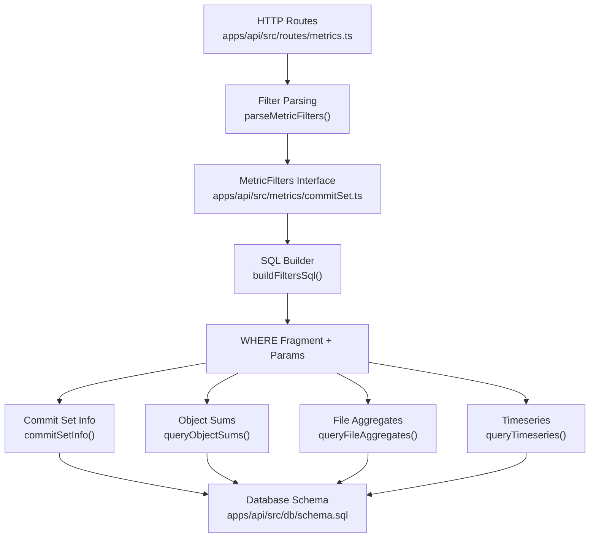
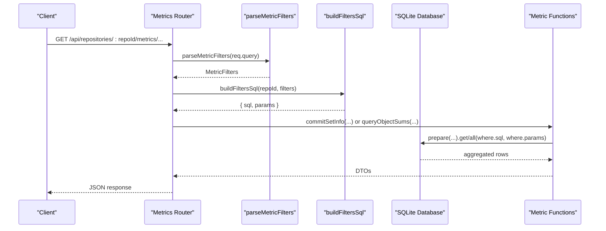
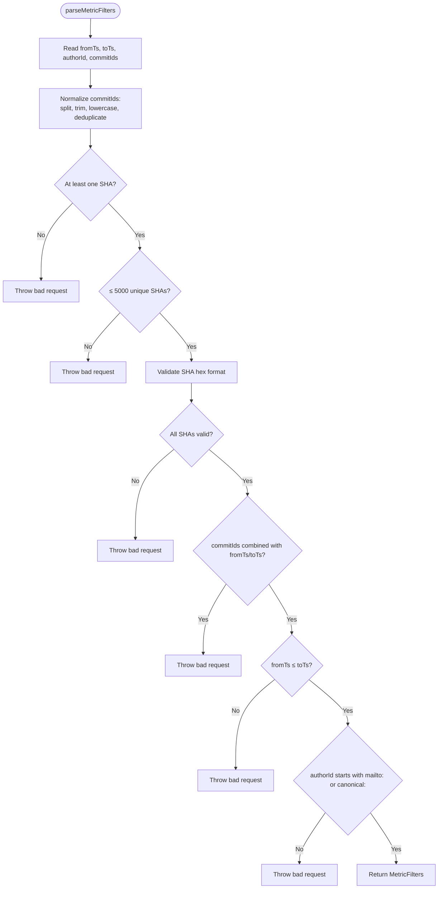
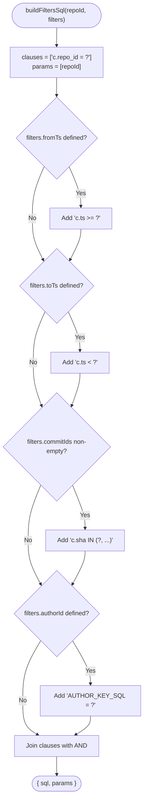
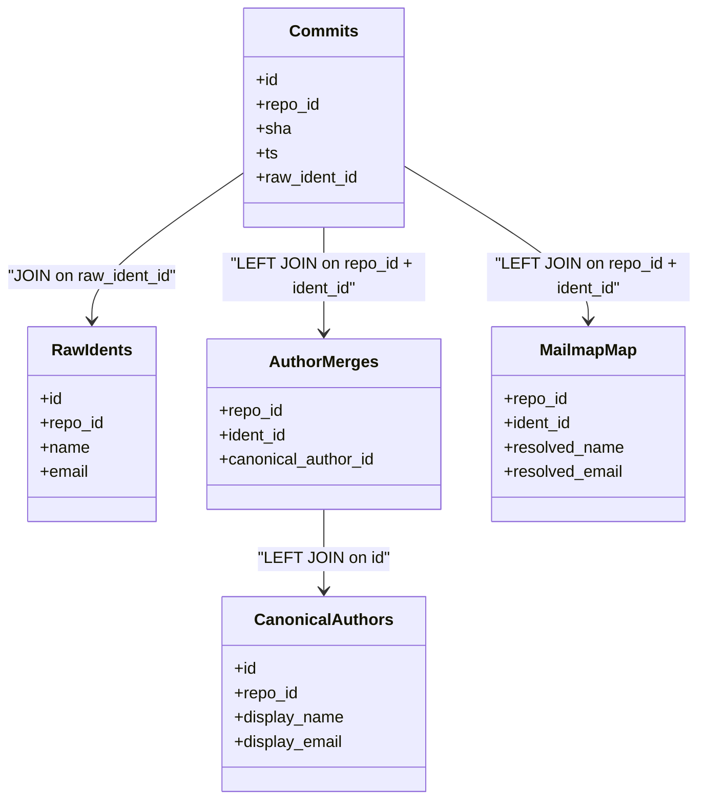
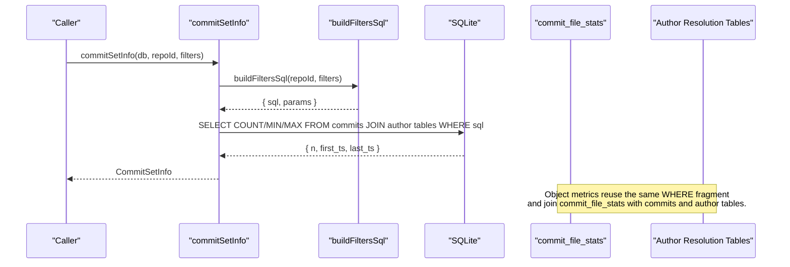
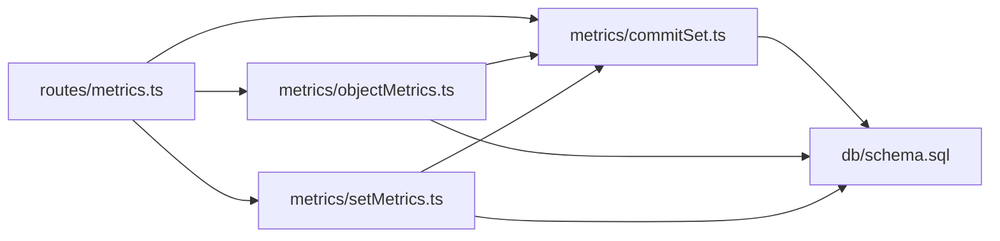

# Commit Set Filtering System

<cite>
**Referenced Files in This Document**
- [commitSet.ts](file://apps/api/src/metrics/commitSet.ts)
- [objectMetrics.ts](file://apps/api/src/metrics/objectMetrics.ts)
- [setMetrics.ts](file://apps/api/src/metrics/setMetrics.ts)
- [metrics.ts](file://apps/api/src/routes/metrics.ts)
- [schema.sql](file://apps/api/src/db/schema.sql)
- [metrics.test.ts](file://apps/api/test/metrics.test.ts)
</cite>

## Table of Contents
1. [Introduction](#introduction)
2. [Project Structure](#project-structure)
3. [Core Components](#core-components)
4. [Architecture Overview](#architecture-overview)
5. [Detailed Component Analysis](#detailed-component-analysis)
6. [Dependency Analysis](#dependency-analysis)
7. [Performance Considerations](#performance-considerations)
8. [Troubleshooting Guide](#troubleshooting-guide)
9. [Conclusion](#conclusion)

## Introduction
This document explains the commit set filtering system used to restrict metric computations to specific subsets of commits. The system supports:
- Time-range filters using inclusive start and exclusive end timestamps.
- Explicit commit ID selection by SHA.
- Author-based filtering through a stable resolved-author key.
- Path restrictions that scope object metrics to files or directory subtrees.

The core contract is the `MetricFilters` interface, which is parsed from HTTP query parameters and converted into parameterized SQL WHERE clauses by `buildFiltersSql`. The shared `COMMIT_SOURCE_SQL` template joins raw author identities with manual canonical merges and mailmap mappings so that author resolution is consistent across all queries.

## Project Structure
The filtering logic lives under the API metrics layer and integrates with routes, database schema, and tests:

**Diagram sources**
- [metrics.ts:46-194](file://apps/api/src/routes/metrics.ts#L46-L194)
- [commitSet.ts:58-145](file://apps/api/src/metrics/commitSet.ts#L58-L145)
- [objectMetrics.ts:80-217](file://apps/api/src/metrics/objectMetrics.ts#L80-L217)
- [schema.sql:42-105](file://apps/api/src/db/schema.sql#L42-L105)

**Section sources**
- [metrics.ts:46-194](file://apps/api/src/routes/metrics.ts#L46-L194)
- [commitSet.ts:5-145](file://apps/api/src/metrics/commitSet.ts#L5-L145)
- [objectMetrics.ts:1-218](file://apps/api/src/metrics/objectMetrics.ts#L1-L218)
- [schema.sql:42-105](file://apps/api/src/db/schema.sql#L42-L105)

## Core Components
- `MetricFilters`: Defines the filter contract for time range, explicit commit IDs, and resolved author ID.
- `SqlFragment`: A small value type carrying generated SQL text and bound parameters.
- `parseMetricFilters`: Validates and normalizes request query parameters into `MetricFilters`.
- `buildFiltersSql`: Produces a repository-scoped WHERE clause and parameter list.
- `COMMIT_SOURCE_SQL`: Shared FROM clause joining commits with author-resolution tables.
- `commitSetInfo`: Computes the size and time span of the filtered commit set.
- Object metric functions reuse `buildFiltersSql` and join the fact table over the same commit set.

Key responsibilities:
- Input validation and normalization occur before SQL generation.
- All SQL uses parameter binding; no user input is interpolated directly into SQL strings.
- Author filtering uses a stable resolved-author key rather than raw identity fields.

**Section sources**
- [commitSet.ts:5-145](file://apps/api/src/metrics/commitSet.ts#L5-L145)
- [objectMetrics.ts:1-218](file://apps/api/src/metrics/objectMetrics.ts#L1-L218)
- [setMetrics.ts:1-36](file://apps/api/src/metrics/setMetrics.ts#L1-L36)

## Architecture Overview
The filtering pipeline connects HTTP requests to optimized SQL queries:

**Diagram sources**
- [metrics.ts:46-194](file://apps/api/src/routes/metrics.ts#L46-L194)
- [commitSet.ts:58-145](file://apps/api/src/metrics/commitSet.ts#L58-L145)
- [objectMetrics.ts:80-217](file://apps/api/src/metrics/objectMetrics.ts#L80-L217)

## Detailed Component Analysis

### MetricFilters Interface and Filter Semantics
`MetricFilters` represents the subset of commits H selected for metric computation:
- `fromTs`: Inclusive lower bound on commit timestamp.
- `toTs`: Exclusive upper bound on commit timestamp.
- `commitIds`: Explicit list of commit SHAs.
- `authorId`: Stable resolved-author identifier returned by the authors endpoint.

Important semantics:
- Time range is half-open: `[fromTs, toTs)`.
- `commitIds` cannot be combined with `fromTs` or `toTs`.
- `authorId` must use one of the supported schemes: `mailto:` or `canonical:`.

Validation rules are enforced during parsing, not during SQL construction.

**Section sources**
- [commitSet.ts:5-16](file://apps/api/src/metrics/commitSet.ts#L5-L16)
- [commitSet.ts:58-98](file://apps/api/src/metrics/commitSet.ts#L58-L98)
- [metrics.test.ts:370-401](file://apps/api/test/metrics.test.ts#L370-L401)

### parseMetricFilters: Validation and Normalization
`parseMetricFilters` performs:
- Type coercion for optional integer timestamp parameters.
- Optional string extraction for author ID and comma-separated commit IDs.
- Lowercasing and deduplication of commit SHAs.
- Length checks: at least one SHA and at most 5000 unique SHAs.
- SHA format validation using a hexadecimal pattern.
- Mutual exclusion between explicit commit IDs and timestamp ranges.
- Timestamp ordering validation.
- Author ID scheme validation requiring `mailto:` or `canonical:` prefixes.

Errors are thrown as bad-request errors when inputs violate these constraints.

**Diagram sources**
- [commitSet.ts:58-98](file://apps/api/src/metrics/commitSet.ts#L58-L98)
- [metrics.test.ts:370-401](file://apps/api/test/metrics.test.ts#L370-L401)

**Section sources**
- [commitSet.ts:58-98](file://apps/api/src/metrics/commitSet.ts#L58-L98)
- [metrics.test.ts:370-401](file://apps/api/test/metrics.test.ts#L370-L401)

### buildFiltersSql: Optimized WHERE Clause Generation
`buildFiltersSql` constructs a repository-scoped WHERE clause and binds parameters safely:
- Always includes `c.repo_id = ?` as the first condition.
- Adds `c.ts >= ?` when `fromTs` is present.
- Adds `c.ts < ?` when `toTs` is present.
- Adds `c.sha IN (?, ?, ...)` when `commitIds` is non-empty.
- Adds an author-key equality when `authorId` is present.

The function returns a `SqlFragment`, separating SQL text from parameter values. This separation ensures:
- No string interpolation of user input into SQL.
- Consistent parameter binding across all metric queries.
- Predictable clause order starting with repository scoping.

**Diagram sources**
- [commitSet.ts:104-126](file://apps/api/src/metrics/commitSet.ts#L104-L126)

**Section sources**
- [commitSet.ts:100-126](file://apps/api/src/metrics/commitSet.ts#L100-L126)

### COMMIT_SOURCE_SQL and Author Resolution Integration
`COMMIT_SOURCE_SQL` provides a reusable FROM clause for commit-scoped queries:
- Starts from `commits c`.
- Joins `raw_idents ri` to access raw author name/email.
- LEFT JOINs `author_merges am` and `canonical_authors ca` for manual merge resolution.
- LEFT JOINs `mailmap_map mm` for mailmap-based resolution.

Resolution precedence is:
1. Manual canonical merge via `author_merges`.
2. Mailmap mapping via `mailmap_map`.
3. Raw ident if neither override exists.

Stable author identity helpers:
- `AUTHOR_KEY_SQL`: Produces a stable key like `canonical:<id>` or `mailto:<email>`.
- `AUTHOR_NAME_SQL` and `AUTHOR_EMAIL_SQL`: Provide display name and email using COALESCE across layers.
- `AUTHOR_KIND_SQL`: Indicates whether the resolved author came from canonical, mailmap, or raw identity.

These constants allow author filtering and author metadata to be computed consistently across commit counts, file aggregates, and timeseries.

**Diagram sources**
- [commitSet.ts:31-52](file://apps/api/src/metrics/commitSet.ts#L31-L52)
- [schema.sql:33-91](file://apps/api/src/db/schema.sql#L33-L91)

**Section sources**
- [commitSet.ts:26-52](file://apps/api/src/metrics/commitSet.ts#L26-L52)
- [schema.sql:33-91](file://apps/api/src/db/schema.sql#L33-L91)

### Commit Set Info and Fact Table Joins
`commitSetInfo` computes:
- `commitCount`: Size of the filtered commit set H.
- `firstTs` and `lastTs`: Minimum and maximum timestamps among matching commits.

It uses `COMMIT_SOURCE_SQL` and applies the WHERE fragment produced by `buildFiltersSql`.

Object metric queries reuse this pattern:
- `queryObjectSums` joins the fact table `commit_file_stats` with commits and author-resolution tables.
- `queryFileAggregates` groups by path while applying both commit-set filters and optional path prefix filters.
- `queryTimeseries` produces bucketed commit counts and line churn over the same commit set.

**Diagram sources**
- [commitSet.ts:135-145](file://apps/api/src/metrics/commitSet.ts#L135-L145)
- [objectMetrics.ts:38-98](file://apps/api/src/metrics/objectMetrics.ts#L38-L98)
- [schema.sql:53-64](file://apps/api/src/db/schema.sql#L53-L64)

**Section sources**
- [commitSet.ts:128-145](file://apps/api/src/metrics/commitSet.ts#L128-L145)
- [objectMetrics.ts:38-98](file://apps/api/src/metrics/objectMetrics.ts#L38-L98)
- [schema.sql:53-64](file://apps/api/src/db/schema.sql#L53-L64)

### Filter Precedence and Parameter Binding
Filter precedence is primarily about validation and combination rules:
- Explicit commit IDs take precedence over time-range selection because they are mutually exclusive with timestamp filters.
- Author filtering can be combined with either explicit commit IDs or timestamp ranges.
- Repository scoping is always applied first in the WHERE clause.

Parameter binding strategy:
- Every filter value is passed as a bound parameter.
- Commit IDs are expanded into a parameterized `IN (...)` list.
- Author filtering compares against the stable resolved-author key expression.
- No direct concatenation of user input into SQL occurs.

This design prevents SQL injection by treating all external values as data, not executable SQL fragments.

**Section sources**
- [commitSet.ts:58-126](file://apps/api/src/metrics/commitSet.ts#L58-L126)
- [metrics.test.ts:370-401](file://apps/api/test/metrics.test.ts#L370-L401)

### Examples of Complex Filter Combinations and Resulting Queries
Below are representative combinations and the resulting WHERE structure. These examples describe the logical query shape without embedding literal SQL content.

- Time range only:
  - WHERE includes repository ID, `ts >= fromTs`, and `ts < toTs`.
  - Example behavior verified by tests computing metrics over a specific date window.

- Explicit commit IDs only:
  - WHERE includes repository ID and `sha IN (sha1, sha2, ...)`.
  - Tests verify exact commit selection and derived metrics.

- Author filter only:
  - WHERE includes repository ID and `AUTHOR_KEY_SQL = ?`.
  - Tests verify per-author aggregation and ownership calculations.

- Time range plus author filter:
  - WHERE includes repository ID, timestamp bounds, and author key equality.
  - Used by endpoints that compute metrics scoped to both time and author.

- Explicit commit IDs plus author filter:
  - WHERE includes repository ID, SHA list, and author key equality.
  - Useful when selecting a known set of commits but further narrowing by resolved author.

- Path scope combined with commit filters:
  - WHERE includes commit filters AND path scope conditions.
  - Directory scope uses index-friendly substring/range predicates.
  - File scope uses exact path equality.

These combinations are exercised by the test suite, which validates expected metric totals, commit counts, and author aggregations.

**Section sources**
- [metrics.test.ts:32-104](file://apps/api/test/metrics.test.ts#L32-L104)
- [metrics.test.ts:146-219](file://apps/api/test/metrics.test.ts#L146-L219)
- [objectMetrics.ts:24-36](file://apps/api/src/metrics/objectMetrics.ts#L24-L36)

## Dependency Analysis
The filtering system has clear boundaries:
- Routes depend on filter parsing and metric functions.
- Metric functions depend on `commitSet.ts` for filters and shared SQL templates.
- Object metrics extend commit filtering with path scoping and fact-table joins.
- Database schema defines the tables and indexes that make filtering efficient.

**Diagram sources**
- [metrics.ts:1-199](file://apps/api/src/routes/metrics.ts#L1-L199)
- [commitSet.ts:1-146](file://apps/api/src/metrics/commitSet.ts#L1-L146)
- [objectMetrics.ts:1-218](file://apps/api/src/metrics/objectMetrics.ts#L1-L218)
- [setMetrics.ts:1-36](file://apps/api/src/metrics/setMetrics.ts#L1-L36)
- [schema.sql:1-106](file://apps/api/src/db/schema.sql#L1-L106)

**Section sources**
- [metrics.ts:1-199](file://apps/api/src/routes/metrics.ts#L1-L199)
- [commitSet.ts:1-146](file://apps/api/src/metrics/commitSet.ts#L1-L146)
- [objectMetrics.ts:1-218](file://apps/api/src/metrics/objectMetrics.ts#L1-L218)
- [setMetrics.ts:1-36](file://apps/api/src/metrics/setMetrics.ts#L1-L36)
- [schema.sql:1-106](file://apps/api/src/db/schema.sql#L1-L106)

## Performance Considerations
Index usage and query shape matter significantly:

- Repository scoping:
  - All WHERE clauses begin with `c.repo_id = ?`, enabling fast partitioning by repository.
  - Indexes on `commits(repo_id, ts)` and `commits(repo_id, raw_ident_id)` support time-range and author-related joins.

- Time-range filtering:
  - `ts >= fromTs` and `ts < toTs` leverage the composite index on `(repo_id, ts)`.
  - Half-open intervals avoid off-by-one issues and align with exclusive upper bounds.

- Explicit commit IDs:
  - `sha IN (?, ...)` benefits from the unique constraint on `(repo_id, sha)`.
  - The implementation caps the number of IDs at 5000 to prevent excessively large parameter lists.

- Author filtering:
  - Uses the stable resolved-author key expression, which depends on joins to `author_merges`, `canonical_authors`, and `mailmap_map`.
  - For heavy author-filtered workloads, consider indexing foreign keys involved in author resolution joins.

- Path scoping:
  - Directory scope uses an index-friendly subtree predicate combining exact match and range comparison.
  - File scope uses exact path equality.
  - Indexes on `commit_file_stats(commit_id)` and `commit_file_stats(repo_id, path)` help fact-table scans.

- Empty commit sets:
  - When no commits match, metrics return zeroed aggregates and null time spans, avoiding division-by-zero in derived rates.

Recommended indexing strategies:
- Keep existing indexes on `commits(repo_id, ts)` and `commits(repo_id, raw_ident_id)`.
- Ensure foreign key columns used in author resolution joins are indexed where appropriate.
- Maintain the primary key on `commit_file_stats(commit_id, path)` and the additional indexes shown in the schema.

**Section sources**
- [commitSet.ts:104-126](file://apps/api/src/metrics/commitSet.ts#L104-L126)
- [objectMetrics.ts:24-36](file://apps/api/src/metrics/objectMetrics.ts#L24-L36)
- [schema.sql:101-105](file://apps/api/src/db/schema.sql#L101-L105)

## Troubleshooting Guide
Common issues and how to diagnose them:

- Invalid commit SHA format:
  - Cause: Non-hexadecimal characters or incorrect length.
  - Symptom: Bad request error mentioning a valid commit SHA.
  - Fix: Ensure commit IDs are lowercase hexadecimal strings within the allowed length.

- Combining commit IDs with timestamp range:
  - Cause: Using both `commitIds` and `fromTs`/`toTs`.
  - Symptom: Bad request error stating they cannot be combined.
  - Fix: Choose either explicit commit IDs or a timestamp range.

- Reversed timestamp range:
  - Cause: `fromTs` greater than `toTs`.
  - Symptom: Bad request error stating `fromTs` must be less than or equal to `toTs`.
  - Fix: Adjust the range so the start is not after the end.

- Unknown author ID scheme:
  - Cause: Passing an author ID without `mailto:` or `canonical:` prefix.
  - Symptom: Bad request error referencing the authors endpoint.
  - Fix: Use an author ID returned by the authors endpoint.

- Empty commit set results:
  - Cause: Filters select no commits.
  - Symptom: Zeroed metrics and null first/last timestamps.
  - Fix: Relax filters or verify the repository’s commit timestamps.

- Path not found:
  - Cause: Requested path does not exist in the repository.
  - Symptom: Not found error with code `PATH_NOT_FOUND`.
  - Fix: Use a known directory or file path.

**Section sources**
- [metrics.test.ts:370-401](file://apps/api/test/metrics.test.ts#L370-L401)
- [objectMetrics.ts:52-68](file://apps/api/src/metrics/objectMetrics.ts#L52-L68)

## Conclusion
The commit set filtering system provides a robust, validated, and parameterized way to restrict metric computations to precise subsets of commits. By separating filter parsing, SQL generation, and author resolution, it maintains security, correctness, and performance. The shared `COMMIT_SOURCE_SQL` template and stable author key ensure consistent author resolution across all metrics, while index-aware path scoping keeps object-level queries efficient. Tests cover typical and edge-case scenarios, including empty commit sets, malformed inputs, and complex filter combinations.