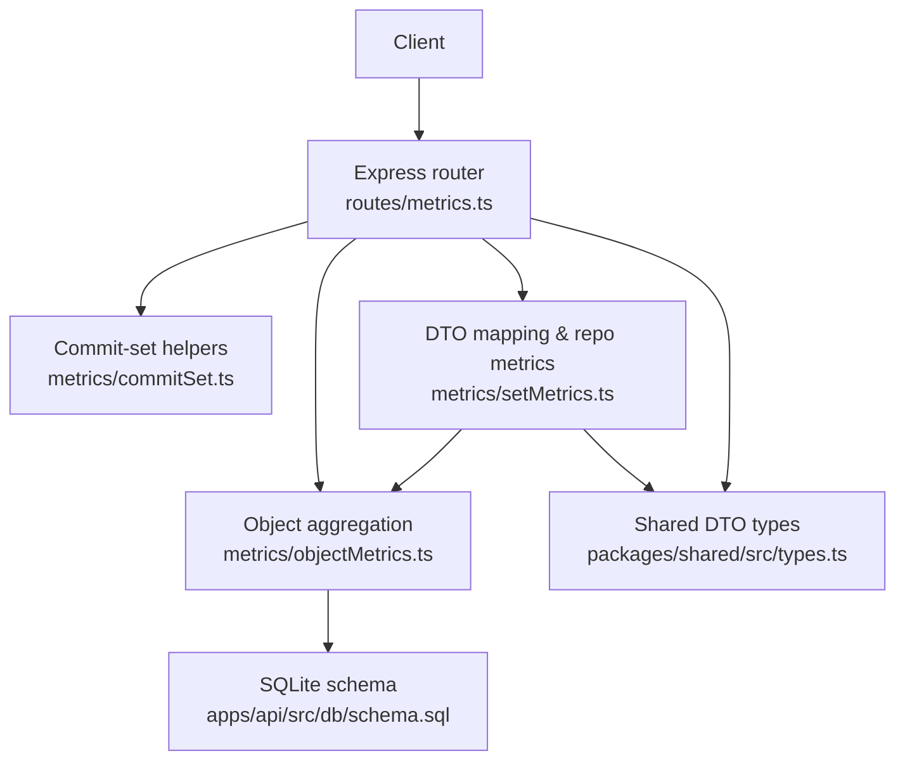
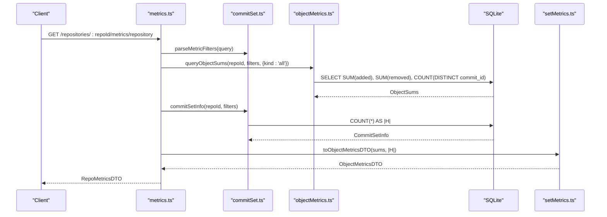
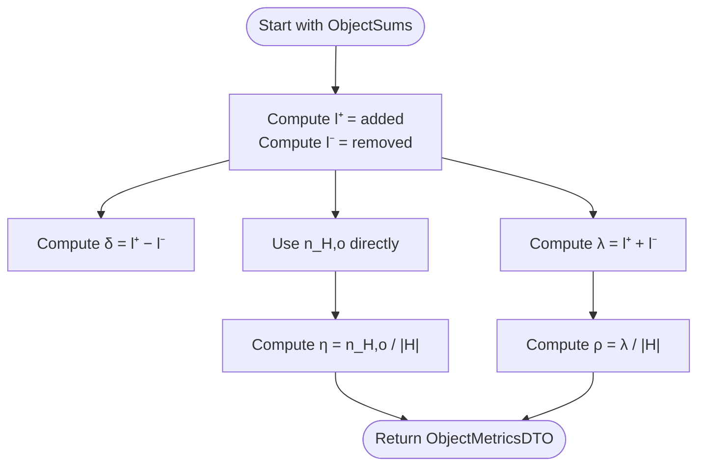
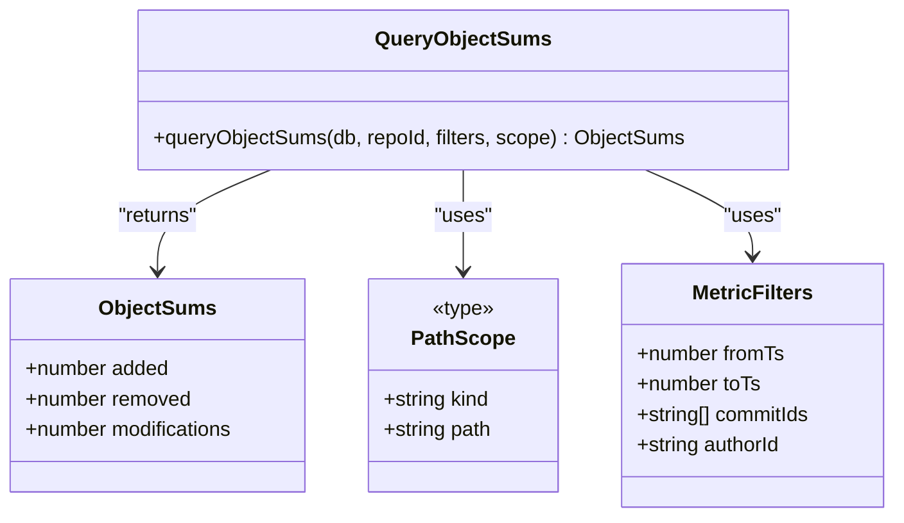
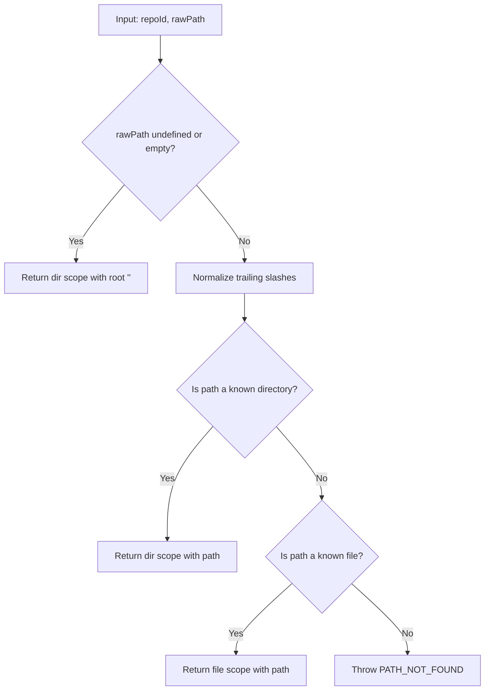
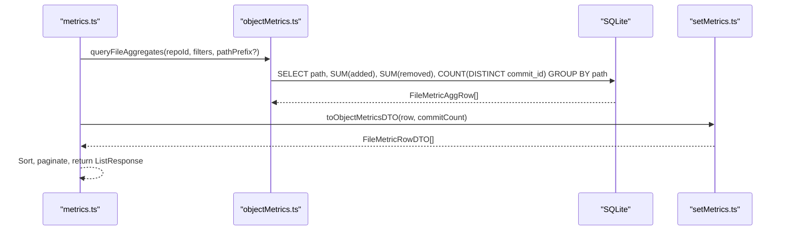
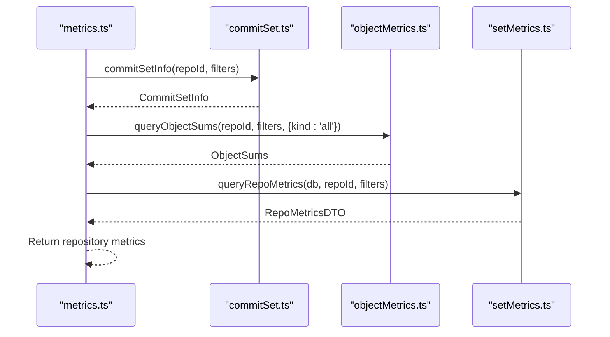
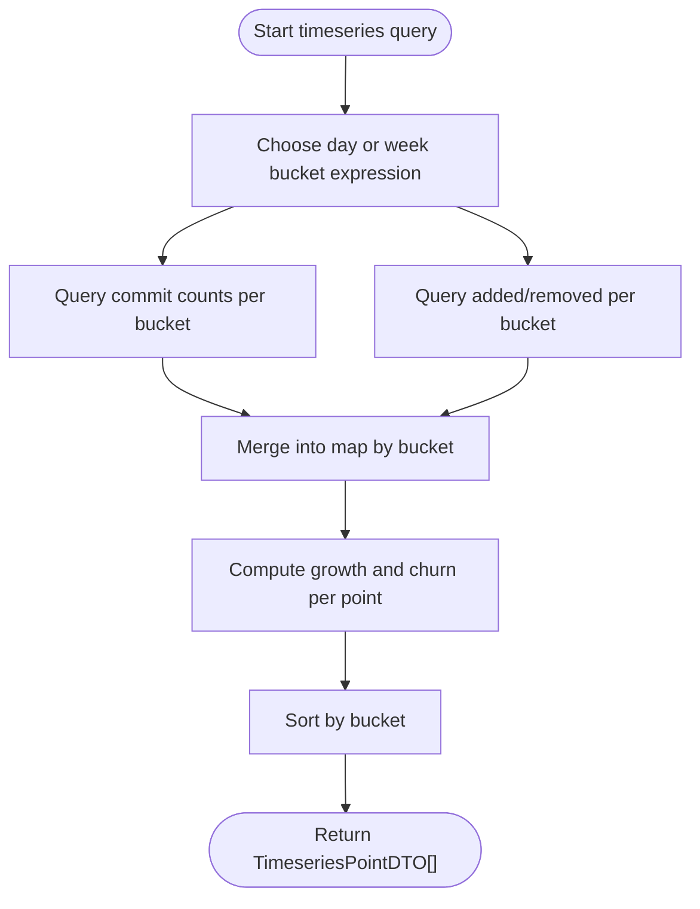
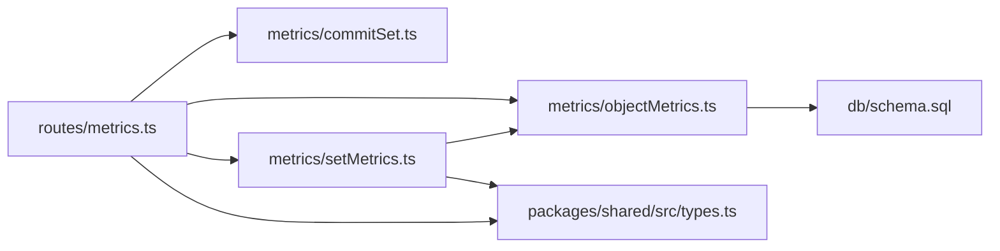
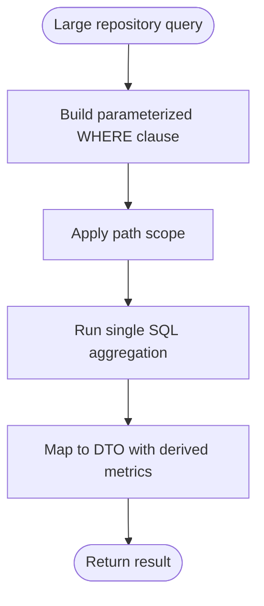

# Core Metric Calculations

<cite>
**Referenced Files in This Document**
- [objectMetrics.ts](file://apps/api/src/metrics/objectMetrics.ts)
- [setMetrics.ts](file://apps/api/src/metrics/setMetrics.ts)
- [commitSet.ts](file://apps/api/src/metrics/commitSet.ts)
- [metrics.ts](file://apps/api/src/routes/metrics.ts)
- [types.ts](file://packages/shared/src/types.ts)
- [schema.sql](file://apps/api/src/db/schema.sql)
</cite>

## Table of Contents
1. [Introduction](#introduction)
2. [Project Structure](#project-structure)
3. [Core Components](#core-components)
4. [Architecture Overview](#architecture-overview)
5. [Detailed Component Analysis](#detailed-component-analysis)
6. [Dependency Analysis](#dependency-analysis)
7. [Performance Considerations](#performance-considerations)
8. [Troubleshooting Guide](#troubleshooting-guide)
9. [Conclusion](#conclusion)

## Introduction
This document explains the core metric calculation engine used to analyze Git history. It focuses on five fundamental metrics for an object (a file or directory) over a commit set:

| Symbol | Name | Formula | Business meaning |
|---|---|---:|---|
| δ | Growth | `l⁺ − l⁻` | Net change in lines; positive means growth, negative means shrinkage. |
| λ | Churn | `l⁺ + l⁻` | Total amount of line churn regardless of direction. |
| n_H,o | Modifications | Count of commits that changed the object at least once. | How many commits touched this object. |
| η | Modification frequency | `n_H,o / |H|` | Fraction of commits in the filtered set that modified the object. |
| ρ | Change rate | `λ / |H|` | Average churn per commit in the filtered set. |

Here:
- `l⁺` is the total added lines across the selected commits and path scope.
- `l⁻` is the total removed lines.
- `|H|` is the number of commits in the filtered commit set.
- `o` is the object being analyzed (file or directory).
- `H` is the commit set selected by filters such as time range, explicit commit SHAs, or author.

The implementation computes these values from SQLite tables populated during ingestion, then exposes them through REST endpoints for repository-wide, per-file, per-directory, author, and timeseries views.

## Project Structure
The metric engine lives under the API application’s metrics layer and routes:

**Diagram sources**
- [metrics.ts:42-195](file://apps/api/src/routes/metrics.ts#L42-L195)
- [commitSet.ts:5-145](file://apps/api/src/metrics/commitSet.ts#L5-L145)
- [objectMetrics.ts:11-217](file://apps/api/src/metrics/objectMetrics.ts#L11-L217)
- [setMetrics.ts:6-35](file://apps/api/src/metrics/setMetrics.ts#L6-L35)
- [types.ts:128-203](file://packages/shared/src/types.ts#L128-L203)
- [schema.sql:42-64](file://apps/api/src/db/schema.sql#L42-L64)

**Section sources**
- [metrics.ts:42-195](file://apps/api/src/routes/metrics.ts#L42-L195)
- [objectMetrics.ts:11-217](file://apps/api/src/metrics/objectMetrics.ts#L11-L217)
- [setMetrics.ts:6-35](file://apps/api/src/metrics/setMetrics.ts#L6-L35)
- [commitSet.ts:5-145](file://apps/api/src/metrics/commitSet.ts#L5-L145)
- [types.ts:128-203](file://packages/shared/src/types.ts#L128-L203)
- [schema.sql:42-64](file://apps/api/src/db/schema.sql#L42-L64)

## Core Components
The metric engine has three main responsibilities:

1. **Commit-set selection:** Parse request filters and build SQL conditions that select the commit set `H`.
2. **Object-level aggregation:** Compute `added`, `removed`, and `modifications` for an object over `H` and a path scope.
3. **DTO conversion:** Map raw aggregates into the final metric fields including derived rates.

Key components:

| Component | Responsibility | Key exports |
|---|---|---|
| `commitSet.ts` | Parses filters, builds WHERE clauses, counts `|H|`. | `parseMetricFilters`, `buildFiltersSql`, `commitSetInfo` |
| `objectMetrics.ts` | Defines path scopes, aggregates `l⁺`, `l⁻`, `n_H,o`, and timeseries. | `PathScope`, `queryObjectSums`, `queryFileAggregates`, `queryTimeseries` |
| `setMetrics.ts` | Converts sums to full DTOs and computes repository-wide metrics. | `toObjectMetricsDTO`, `queryRepoMetrics` |
| `routes/metrics.ts` | Exposes repository, files, directories, authors, and timeseries endpoints. | `metricsRouter` |
| `types.ts` | Defines shared DTOs such as `ObjectMetricsDTO`, `RepoMetricsDTO`, `TimeseriesPointDTO`. | DTO interfaces |
| `schema.sql` | Defines fact tables and indexes used by metric queries. | `commits`, `commit_file_stats`, indexes |

**Section sources**
- [commitSet.ts:5-145](file://apps/api/src/metrics/commitSet.ts#L5-L145)
- [objectMetrics.ts:11-217](file://apps/api/src/metrics/objectMetrics.ts#L11-L217)
- [setMetrics.ts:6-35](file://apps/api/src/metrics/setMetrics.ts#L6-L35)
- [metrics.ts:42-195](file://apps/api/src/routes/metrics.ts#L42-L195)
- [types.ts:128-203](file://packages/shared/src/types.ts#L128-L203)
- [schema.sql:42-64](file://apps/api/src/db/schema.sql#L42-L64)

## Architecture Overview
At runtime, a client requests metrics through Express routes. The route handler parses filters, resolves path scope, queries aggregated data from SQLite, converts results to DTOs, and returns JSON.

**Diagram sources**
- [metrics.ts:46-50](file://apps/api/src/routes/metrics.ts#L46-L50)
- [commitSet.ts:104-145](file://apps/api/src/metrics/commitSet.ts#L104-L145)
- [objectMetrics.ts:80-98](file://apps/api/src/metrics/objectMetrics.ts#L80-L98)
- [setMetrics.ts:11-23](file://apps/api/src/metrics/setMetrics.ts#L11-L23)

## Detailed Component Analysis

### Fundamental Metrics and Their Computation
The five core metrics are computed from three base aggregates:

| Base aggregate | Meaning | SQL source |
|---|---|---|
| `l⁺` | Total added lines | `SUM(commit_file_stats.added)` |
| `l⁻` | Total removed lines | `SUM(commit_file_stats.removed)` |
| `n_H,o` | Number of commits that changed the object | `COUNT(DISTINCT commit_id WHERE added + removed > 0)` |

Derived metrics:

| Metric | Formula | Implementation location |
|---|---|---|
| Growth δ | `l⁺ − l⁻` | `toObjectMetricsDTO` |
| Churn λ | `l⁺ + l⁻` | `toObjectMetricsDTO` |
| Modifications n_H,o | Directly counted | `queryObjectSums` |
| Modification frequency η | `n_H,o / |H|` | `toObjectMetricsDTO` |
| Change rate ρ | `λ / |H|` | `toObjectMetricsDTO` |

**Diagram sources**
- [setMetrics.ts:11-23](file://apps/api/src/metrics/setMetrics.ts#L11-L23)
- [objectMetrics.ts:80-98](file://apps/api/src/metrics/objectMetrics.ts#L80-L98)

**Section sources**
- [setMetrics.ts:11-23](file://apps/api/src/metrics/setMetrics.ts#L11-L23)
- [objectMetrics.ts:80-98](file://apps/api/src/metrics/objectMetrics.ts#L80-L98)
- [types.ts:128-140](file://packages/shared/src/types.ts#L128-L140)

### ObjectSums Interface and queryObjectSums
`ObjectSums` represents the raw aggregation for one object over a commit set and path scope:

| Field | Type | Meaning |
|---|---:|---|
| `added` | number | `l⁺` |
| `removed` | number | `l⁻` |
| `modifications` | number | `n_H,o` |

`queryObjectSums` executes a single SQL aggregation over:
- The fact table `commit_file_stats`.
- The commit table `commits`.
- Author-resolution joins so filters can use resolved authors.
- A path scope condition selecting either all paths, one exact file, or a directory subtree.

**Diagram sources**
- [objectMetrics.ts:70-98](file://apps/api/src/metrics/objectMetrics.ts#L70-L98)
- [objectMetrics.ts:11-15](file://apps/api/src/metrics/objectMetrics.ts#L11-L15)
- [commitSet.ts:11-16](file://apps/api/src/metrics/commitSet.ts#L11-L16)

**Section sources**
- [objectMetrics.ts:70-98](file://apps/api/src/metrics/objectMetrics.ts#L70-L98)

### Path Scope Resolution
A path scope determines which files contribute to the aggregation:

| Scope kind | Behavior |
|---|---|
| `all` | No path filter; includes every file. |
| `file` | Exact match on one file path. |
| `dir` | Subtree under a directory using index-friendly string ranges. |

The helper `pathScopeSql` generates a parameterized SQL fragment. Directory scoping uses a range condition designed to leverage SQLite indexes rather than expensive prefix scans.

`resolvePathScope` validates user input against known directories and files, throwing a not-found error when the path does not exist.

**Diagram sources**
- [objectMetrics.ts:52-68](file://apps/api/src/metrics/objectMetrics.ts#L52-L68)
- [objectMetrics.ts:24-36](file://apps/api/src/metrics/objectMetrics.ts#L24-L36)

**Section sources**
- [objectMetrics.ts:24-36](file://apps/api/src/metrics/objectMetrics.ts#L24-L36)
- [objectMetrics.ts:52-68](file://apps/api/src/metrics/objectMetrics.ts#L52-L68)

### File-Level Aggregation with queryFileAggregates
`queryFileAggregates` returns per-file aggregates over the commit set. It supports an optional literal path prefix so callers can compute metrics for a directory tree without loading unrelated files.

Each row contains:
- `path`
- `added`
- `removed`
- `modifications`

The route handler maps these rows to `ObjectMetricsDTO` using the same commit count `|H|` obtained from `commitSetInfo`.

**Diagram sources**
- [metrics.ts:52-113](file://apps/api/src/routes/metrics.ts#L52-L113)
- [objectMetrics.ts:111-136](file://apps/api/src/metrics/objectMetrics.ts#L111-L136)
- [setMetrics.ts:11-23](file://apps/api/src/metrics/setMetrics.ts#L11-L23)

**Section sources**
- [objectMetrics.ts:100-136](file://apps/api/src/metrics/objectMetrics.ts#L100-L136)
- [metrics.ts:52-113](file://apps/api/src/routes/metrics.ts#L52-L113)

### Repository-Wide Metrics
Repository metrics are computed with no path restriction. The flow is:

1. Get `|H|`, first timestamp, and last timestamp via `commitSetInfo`.
2. Aggregate `l⁺`, `l⁻`, and `n_H,o` over all paths via `queryObjectSums`.
3. Convert to `ObjectMetricsDTO` and extend with repository metadata.

**Diagram sources**
- [metrics.ts:46-50](file://apps/api/src/routes/metrics.ts#L46-L50)
- [setMetrics.ts:25-35](file://apps/api/src/metrics/setMetrics.ts#L25-L35)
- [commitSet.ts:136-145](file://apps/api/src/metrics/commitSet.ts#L136-L145)

**Section sources**
- [setMetrics.ts:25-35](file://apps/api/src/metrics/setMetrics.ts#L25-L35)
- [metrics.ts:46-50](file://apps/api/src/routes/metrics.ts#L46-L50)

### Timeseries Metrics
The timeseries endpoint computes daily or weekly buckets of commits and churn. It performs two separate aggregations:

1. Commit counts per bucket.
2. Added and removed lines per bucket over the selected path scope.

It then merges them into dense points where every bucket containing commits appears, even if some buckets have zero file changes.

**Diagram sources**
- [objectMetrics.ts:138-217](file://apps/api/src/metrics/objectMetrics.ts#L138-L217)

**Section sources**
- [objectMetrics.ts:138-217](file://apps/api/src/metrics/objectMetrics.ts#L138-L217)

### Examples of Metric Calculations Across Commit Sets and Path Scopes

#### Example 1: Repository-Wide Metrics Over a Time Range
Suppose the filtered commit set `H` contains 100 commits. Over those commits, the repository has:
- `l⁺ = 12,000`
- `l⁻ = 8,000`
- `n_H,o = 60`

Then:
- Growth δ = `12,000 − 8,000 = 4,000`
- Churn λ = `12,000 + 8,000 = 20,000`
- Modification frequency η = `60 / 100 = 0.6`
- Change rate ρ = `20,000 / 100 = 200`

This corresponds to the repository metrics endpoint, which calls `queryRepoMetrics` and uses `{kind: 'all'}` as the path scope.

**Section sources**
- [setMetrics.ts:25-35](file://apps/api/src/metrics/setMetrics.ts#L25-L35)
- [metrics.ts:46-50](file://apps/api/src/routes/metrics.ts#L46-L50)

#### Example 2: Per-File Metrics for One File
For a specific file path, suppose over `H`:
- `l⁺ = 300`
- `l⁻ = 120`
- `n_H,o = 15`
- `|H| = 100`

Then:
- Growth δ = `300 − 120 = 180`
- Churn λ = `300 + 120 = 420`
- Modification frequency η = `15 / 100 = 0.15`
- Change rate ρ = `420 / 100 = 4.2`

The files endpoint uses `queryFileAggregates` and maps each row through `toObjectMetricsDTO`.

**Section sources**
- [metrics.ts:52-113](file://apps/api/src/routes/metrics.ts#L52-L113)
- [objectMetrics.ts:111-136](file://apps/api/src/metrics/objectMetrics.ts#L111-L136)
- [setMetrics.ts:11-23](file://apps/api/src/metrics/setMetrics.ts#L11-L23)

#### Example 3: Directory Metrics for a Subtree
For a directory subtree, suppose over `H`:
- `l⁺ = 5,000`
- `l⁻ = 3,000`
- `n_H,o = 40`
- `|H| = 200`

Then:
- Growth δ = `5,000 − 3,000 = 2,000`
- Churn λ = `5,000 + 3,000 = 8,000`
- Modification frequency η = `40 / 200 = 0.2`
- Change rate ρ = `8,000 / 200 = 40`

The directories endpoint resolves the requested directory, computes self metrics with `queryObjectSums`, and lists descendant directories up to a configured depth.

**Section sources**
- [metrics.ts:115-172](file://apps/api/src/routes/metrics.ts#L115-L172)
- [objectMetrics.ts:24-36](file://apps/api/src/metrics/objectMetrics.ts#L24-L36)
- [objectMetrics.ts:80-98](file://apps/api/src/metrics/objectMetrics.ts#L80-L98)

#### Example 4: Daily Timeseries Point
For a single day bucket:
- Commits in bucket: 12
- Added lines: 400
- Removed lines: 100

Then:
- Growth δ = `400 − 100 = 300`
- Churn λ = `400 + 100 = 500`
- Commits = 12

The timeseries endpoint merges commit counts and file stats by bucket and computes growth and churn per point.

**Section sources**
- [objectMetrics.ts:152-217](file://apps/api/src/metrics/objectMetrics.ts#L152-L217)

## Dependency Analysis
The metric pipeline has clear layering:

**Diagram sources**
- [metrics.ts:10-18](file://apps/api/src/routes/metrics.ts#L10-L18)
- [setMetrics.ts:1-4](file://apps/api/src/metrics/setMetrics.ts#L1-L4)
- [objectMetrics.ts:1-9](file://apps/api/src/metrics/objectMetrics.ts#L1-L9)
- [schema.sql:42-64](file://apps/api/src/db/schema.sql#L42-L64)
- [types.ts:128-203](file://packages/shared/src/types.ts#L128-L203)

Key relationships:

| Relationship | Explanation |
|---|---|
| Routes depend on commit-set helpers | Filter parsing and `|H|` computation are reused across endpoints. |
| Routes depend on object aggregation | File, directory, and repository metrics all rely on `queryObjectSums` or `queryFileAggregates`. |
| DTO mapping depends on raw sums | `toObjectMetricsDTO` centralizes derived metric formulas. |
| All SQL depends on schema | Fact tables and indexes determine performance characteristics. |

**Section sources**
- [metrics.ts:10-18](file://apps/api/src/routes/metrics.ts#L10-L18)
- [setMetrics.ts:1-4](file://apps/api/src/metrics/setMetrics.ts#L1-L4)
- [objectMetrics.ts:1-9](file://apps/api/src/metrics/objectMetrics.ts#L1-L9)
- [schema.sql:42-64](file://apps/api/src/db/schema.sql#L42-L64)
- [types.ts:128-203](file://packages/shared/src/types.ts#L128-L203)

## Performance Considerations
The metric engine is designed for large repositories by pushing aggregation into SQLite and minimizing in-memory work.

### Data Model and Indexes
Important tables:

| Table | Purpose | Important columns |
|---|---|---|
| `commits` | Non-merge commits reachable from HEAD | `repo_id`, `sha`, `ts`, `raw_ident_id` |
| `commit_file_stats` | Per-commit, per-file line statistics | `repo_id`, `commit_id`, `path`, `added`, `removed` |
| `repo_dirs` | Cached directory paths for efficient subtree queries | `repo_id`, `path` |

Indexes:

| Index | Benefit |
|---|---|
| `idx_commits_repo_ts` | Efficient time-range filtering on commits. |
| `idx_commits_repo_ident` | Efficient author-based filtering. |
| `idx_file_stats_repo_path` | Supports path-scoped aggregation. |
| `idx_file_stats_commit` | Supports joining stats by commit. |

**Section sources**
- [schema.sql:42-64](file://apps/api/src/db/schema.sql#L42-L64)
- [schema.sql:101-105](file://apps/api/src/db/schema.sql#L101-L105)

### Query Optimization Strategies
1. **Single-pass aggregation:** `queryObjectSums` computes `SUM(added)`, `SUM(removed)`, and `COUNT(DISTINCT commit_id)` in one SQL statement.
2. **Parameterized filters:** `buildFiltersSql` composes WHERE clauses safely with parameters, avoiding injection and allowing SQLite to optimize plans.
3. **Index-friendly directory scoping:** Directory path filtering uses a range condition designed to exploit B-tree ordering rather than pattern matching.
4. **Literal path prefix for files:** `queryFileAggregates` accepts a prefix so the database can limit rows before grouping.
5. **Dense timeseries merging:** The timeseries query separates commit counts and file stats, then merges them in memory only over bucket keys, keeping the dataset small.
6. **Commit-count guard for rates:** Division by `|H|` is guarded to avoid division by zero when the filtered set is empty.

**Diagram sources**
- [commitSet.ts:104-126](file://apps/api/src/metrics/commitSet.ts#L104-L126)
- [objectMetrics.ts:24-36](file://apps/api/src/metrics/objectMetrics.ts#L24-L36)
- [objectMetrics.ts:80-98](file://apps/api/src/metrics/objectMetrics.ts#L80-L98)
- [objectMetrics.ts:111-136](file://apps/api/src/metrics/objectMetrics.ts#L111-L136)
- [setMetrics.ts:11-23](file://apps/api/src/metrics/setMetrics.ts#L11-L23)

### Practical Recommendations
- Prefer time-range filters combined with path scopes to reduce the working set.
- Use the files endpoint with `pathPrefix` when exploring a directory tree instead of loading all files.
- Avoid extremely large `commitIds` lists; the parser enforces a maximum size.
- For timeseries, choose `day` for fine-grained analysis and `week` for smoother trends.

[No sources needed since this section provides general guidance]

## Troubleshooting Guide

### Common Errors and Causes
| Symptom | Likely cause | Resolution |
|---|---|---|
| Path not found error | Requested path is neither a known directory nor a known file. | Verify the path exists using the paths endpoint or correct trailing slashes. |
| Empty metrics | Filtered commit set is empty or path scope excludes all changes. | Relax time range, remove restrictive author filter, or widen path scope. |
| Unexpected directory metrics | Directory subtree filtering uses string ranges; ensure the path matches expected normalization. | Remove trailing slashes and confirm the directory exists in `repo_dirs`. |
| Slow queries | Large unfiltered repository scan or missing useful filter. | Add `fromTs`/`toTs`, `authorId`, or `pathPrefix` to narrow the query. |

**Section sources**
- [objectMetrics.ts:52-68](file://apps/api/src/metrics/objectMetrics.ts#L52-L68)
- [commitSet.ts:58-98](file://apps/api/src/metrics/commitSet.ts#L58-L98)
- [metrics.ts:115-134](file://apps/api/src/routes/metrics.ts#L115-L134)

### Debugging Metric Values
To verify calculations:

1. Inspect the filtered commit set size `|H|` using the commit-set info logic.
2. Confirm `l⁺` and `l⁻` by checking `SUM(added)` and `SUM(removed)` over the selected scope.
3. Confirm `n_H,o` by counting distinct commits where `added + removed > 0`.
4. Recompute derived metrics manually:
   - δ = `l⁺ − l⁻`
   - λ = `l⁺ + l⁻`
   - η = `n_H,o / |H|`
   - ρ = `λ / |H|`

**Section sources**
- [commitSet.ts:136-145](file://apps/api/src/metrics/commitSet.ts#L136-L145)
- [objectMetrics.ts:80-98](file://apps/api/src/metrics/objectMetrics.ts#L80-L98)
- [setMetrics.ts:11-23](file://apps/api/src/metrics/setMetrics.ts#L11-L23)

## Conclusion
The core metric calculation engine implements the five fundamental metrics—growth, churn, modifications, modification frequency, and change rate—by aggregating Git diff data stored in SQLite. Its design emphasizes:

- Clear separation between commit-set selection, object aggregation, and DTO mapping.
- Parameterized SQL and index-friendly path scoping for scalability.
- Consistent derivation of rates from a stable denominator `|H|`.
- Multiple access patterns: repository-wide, per-file, per-directory, author-based, and timeseries.

For large repositories, the most important optimization strategies are filtering early, leveraging indexes, aggregating in SQL, and limiting in-memory work to bucket keys or paginated results.

[No sources needed since this section summarizes without analyzing specific files]