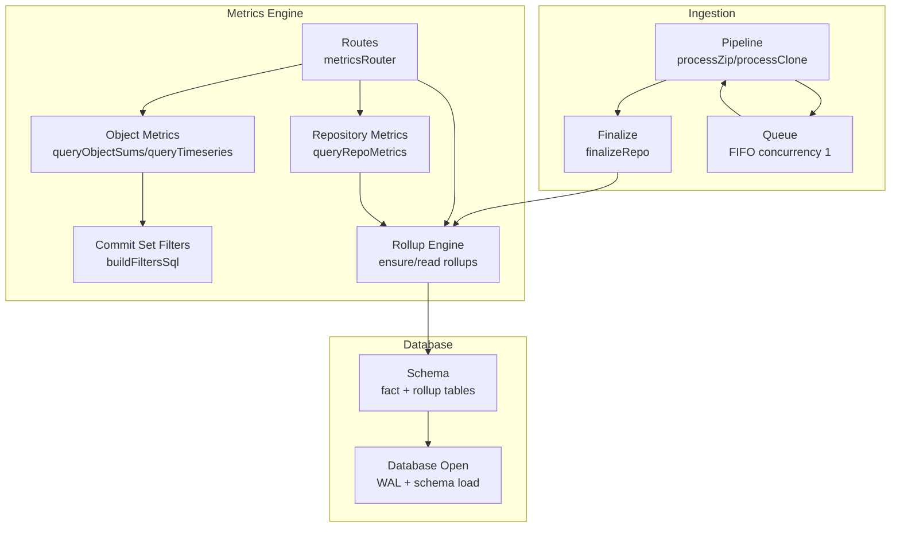
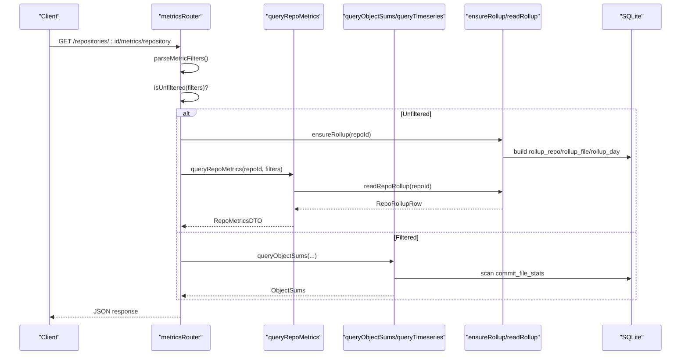
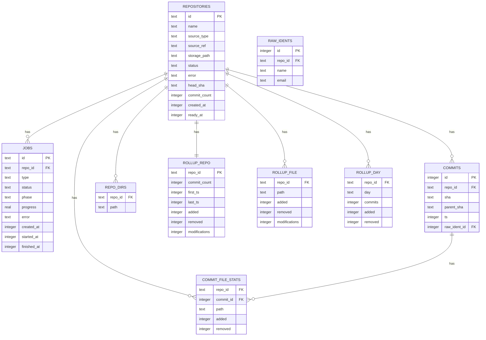
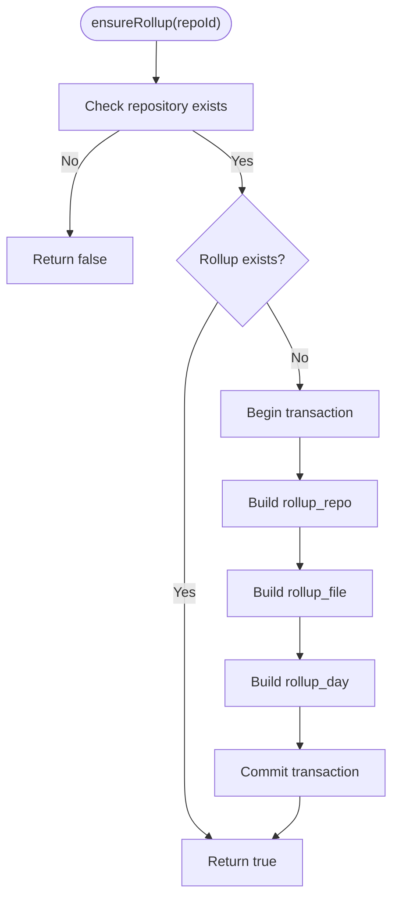
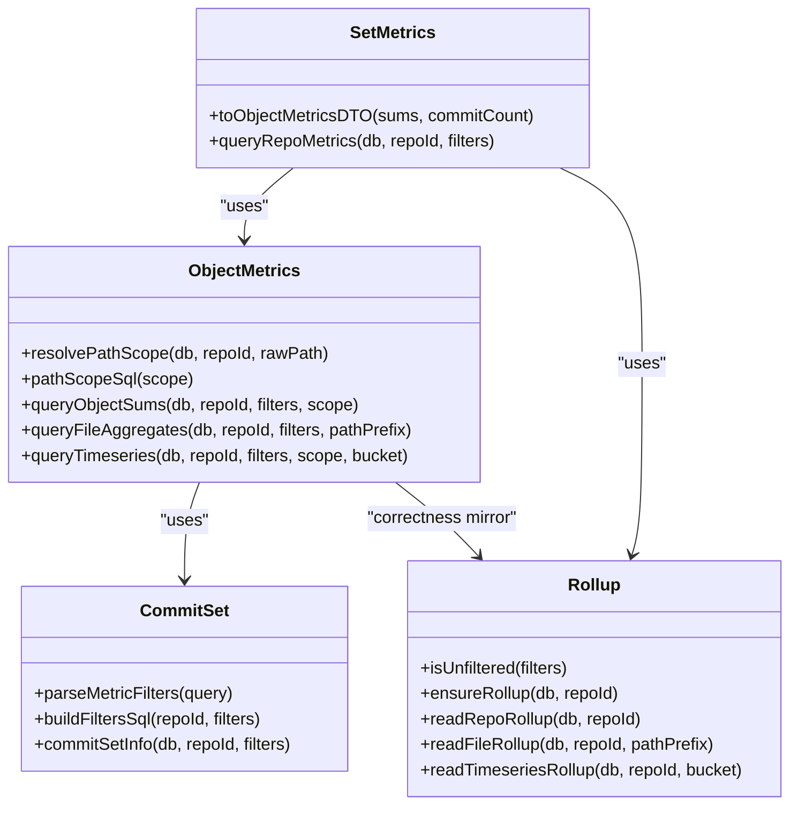
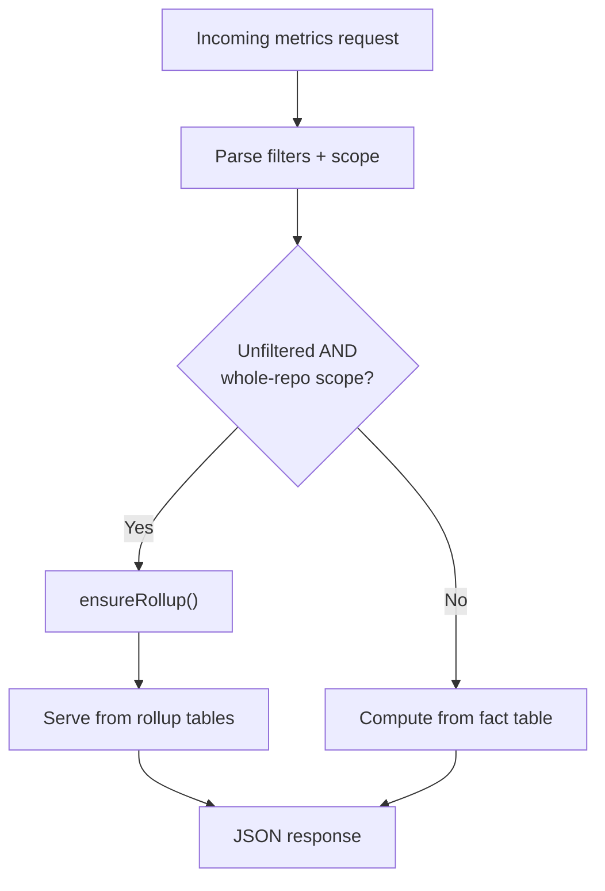
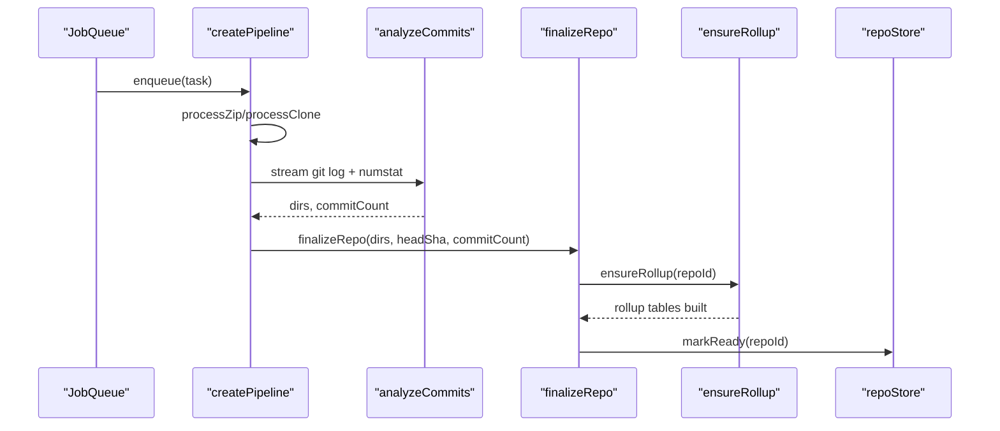
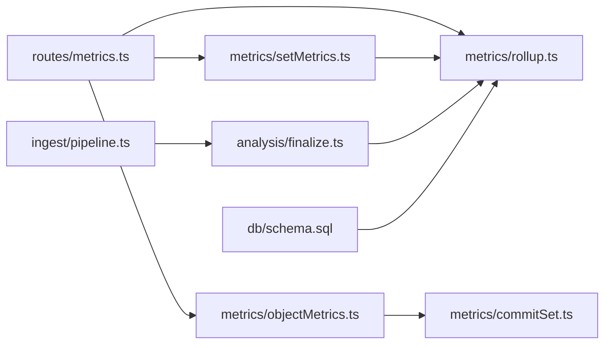

# Materialized Rollup Performance System

<cite>
**Referenced Files in This Document**   
- [README.md](file://README.md)
- [Design.md](file://Design.md)
- [schema.sql](file://apps/api/src/db/schema.sql)
- [database.ts](file://apps/api/src/db/database.ts)
- [rollup.ts](file://apps/api/src/metrics/rollup.ts)
- [objectMetrics.ts](file://apps/api/src/metrics/objectMetrics.ts)
- [commitSet.ts](file://apps/api/src/metrics/commitSet.ts)
- [setMetrics.ts](file://apps/api/src/metrics/setMetrics.ts)
- [metrics.ts](file://apps/api/src/routes/metrics.ts)
- [pipeline.ts](file://apps/api/src/ingest/pipeline.ts)
- [finalize.ts](file://apps/api/src/analysis/finalize.ts)
- [queue.ts](file://apps/api/src/jobs/queue.ts)
</cite>

## Table of Contents
1. [Introduction](#introduction)
2. [Project Structure](#project-structure)
3. [Core Components](#core-components)
4. [Architecture Overview](#architecture-overview)
5. [Detailed Component Analysis](#detailed-component-analysis)
6. [Dependency Analysis](#dependency-analysis)
7. [Performance Considerations](#performance-considerations)
8. [Troubleshooting Guide](#troubleshooting-guide)
9. [Conclusion](#conclusion)

## Introduction
This document explains the materialized rollup performance system used by the Repo Analysis Tool (RAT). The system stores git history as a single fact table and computes most metrics at query time. For common dashboard reads, it pre-computes repository-level, per-file, and daily rollups so that unfiltered queries avoid scanning the large fact table.

The implementation is intentionally conservative: rollups are only used when a query has no commit-set filters and uses whole-repository scope. Filtered or scoped queries continue to compute live from the fact table. Correctness is enforced by mirroring the live SQL logic in the rollup builders and asserting equivalence through tests.

## Project Structure
The rollup feature spans database schema, ingestion finalization, metric routing, and the rollup engine itself.

**Diagram sources**
- [pipeline.ts:41-130](file://apps/api/src/ingest/pipeline.ts#L41-L130)
- [finalize.ts:12-27](file://apps/api/src/analysis/finalize.ts#L12-L27)
- [queue.ts:15-53](file://apps/api/src/jobs/queue.ts#L15-L53)
- [schema.sql:101-139](file://apps/api/src/db/schema.sql#L101-L139)
- [database.ts:12-21](file://apps/api/src/db/database.ts#L12-L21)
- [metrics.ts:82-223](file://apps/api/src/routes/metrics.ts#L82-L223)
- [setMetrics.ts:31-55](file://apps/api/src/metrics/setMetrics.ts#L31-L55)
- [objectMetrics.ts:80-217](file://apps/api/src/metrics/objectMetrics.ts#L80-L217)
- [commitSet.ts:104-145](file://apps/api/src/metrics/commitSet.ts#L104-L145)
- [rollup.ts:49-171](file://apps/api/src/metrics/rollup.ts#L49-L171)

**Section sources**
- [README.md:176-239](file://README.md#L176-L239)
- [README.md:257-274](file://README.md#L257-L274)

## Core Components
- Fact table and derived tables: `commit_file_stats`, `commits`, `raw_idents`, `repo_dirs`, plus three rollup tables for repository totals, per-file aggregates, and daily series.
- Rollup builder: idempotent transactional creation of all rollup tables for a repository.
- Rollup readers: fast paths for repository totals, file list with optional path prefix, and day/week timeseries.
- Query-time fallback: object sums, file aggregates, author metrics, and timeseries computed directly from the fact table when filters or scopes prevent rollup use.
- Routing policy: routes decide whether to serve from rollups or live computation based on filter presence and path scope.

**Section sources**
- [schema.sql:53-139](file://apps/api/src/db/schema.sql#L53-L139)
- [rollup.ts:6-20](file://apps/api/src/metrics/rollup.ts#L6-L20)
- [metrics.ts:86-223](file://apps/api/src/routes/metrics.ts#L86-L223)

## Architecture Overview
The system separates ingestion, storage, and query-time analytics. Rollups are built once during finalization and lazily rebuilt if missing. Routes then choose between rollups and live computation.

**Diagram sources**
- [metrics.ts:86-93](file://apps/api/src/routes/metrics.ts#L86-L93)
- [setMetrics.ts:31-55](file://apps/api/src/metrics/setMetrics.ts#L31-L55)
- [rollup.ts:49-97](file://apps/api/src/metrics/rollup.ts#L49-L97)
- [objectMetrics.ts:80-98](file://apps/api/src/metrics/objectMetrics.ts#L80-L98)

## Detailed Component Analysis

### Database Schema and Storage Model
The schema defines:
- A single fact table `commit_file_stats` storing added and removed lines per commit and path.
- Metadata tables for repositories, jobs, commits, raw idents, mailmap resolution, canonical authors, manual merges, and directory enumeration.
- Three rollup tables:
  - `rollup_repo`: repository-wide totals and commit count/time span.
  - `rollup_file`: per-file aggregates over the entire repository.
  - `rollup_day`: daily buckets of commits, added, and removed lines.

Indexes support filtering by repository, commit timestamp, author identity, and path prefixes.

**Diagram sources**
- [schema.sql:5-139](file://apps/api/src/db/schema.sql#L5-L139)

**Section sources**
- [schema.sql:53-139](file://apps/api/src/db/schema.sql#L53-L139)
- [database.ts:7-21](file://apps/api/src/db/database.ts#L7-L21)

### Rollup Builder and Readers
The rollup module provides:
- `isUnfiltered`: determines whether a query can be served from rollups.
- `ensureRollup`: builds all three rollup tables in one transaction; returns false if the repository does not exist.
- `readRepoRollup`, `readFileRollup`, `readTimeseriesRollup`: fast reads for repository totals, files with optional prefix, and day/week series.

Correctness contract: rollup SQL mirrors the live query logic for whole-history, root-scope cases. Tests assert identical DTOs across both paths.

**Diagram sources**
- [rollup.ts:49-91](file://apps/api/src/metrics/rollup.ts#L49-L91)

**Section sources**
- [rollup.ts:6-20](file://apps/api/src/metrics/rollup.ts#L6-L20)
- [rollup.ts:31-43](file://apps/api/src/metrics/rollup.ts#L31-L43)
- [rollup.ts:49-97](file://apps/api/src/metrics/rollup.ts#L49-L97)
- [rollup.ts:104-171](file://apps/api/src/metrics/rollup.ts#L104-L171)

### Query-Time Metric Engine
The live engine computes:
- Repository-wide sums via `queryObjectSums`.
- Per-file aggregates via `queryFileAggregates`.
- Timeseries via `queryTimeseries`, merging commit counts and churn per bucket.
- Path scoping using index-friendly subtree ranges for directories.

Author resolution joins are applied consistently across commit-scoped queries.

**Diagram sources**
- [commitSet.ts:58-145](file://apps/api/src/metrics/commitSet.ts#L58-L145)
- [objectMetrics.ts:24-217](file://apps/api/src/metrics/objectMetrics.ts#L24-L217)
- [setMetrics.ts:12-55](file://apps/api/src/metrics/setMetrics.ts#L12-L55)
- [rollup.ts:31-171](file://apps/api/src/metrics/rollup.ts#L31-L171)

**Section sources**
- [objectMetrics.ts:11-36](file://apps/api/src/metrics/objectMetrics.ts#L11-L36)
- [objectMetrics.ts:80-98](file://apps/api/src/metrics/objectMetrics.ts#L80-L98)
- [objectMetrics.ts:111-136](file://apps/api/src/metrics/objectMetrics.ts#L111-L136)
- [objectMetrics.ts:152-217](file://apps/api/src/metrics/objectMetrics.ts#L152-L217)
- [commitSet.ts:104-145](file://apps/api/src/metrics/commitSet.ts#L104-L145)
- [setMetrics.ts:12-55](file://apps/api/src/metrics/setMetrics.ts#L12-L55)

### Route-Level Rollup Policy
Routes implement the decision logic:
- Repository metrics: if unfiltered, ensure rollup and serve from `rollup_repo`; otherwise compute live.
- File metrics: if unfiltered and rollup exists, read from `rollup_file`; otherwise compute live aggregates.
- Directory metrics: always compute live because they require directory metadata and nested aggregation.
- Author metrics: always compute live due to author resolution and ownership calculations.
- Timeseries: if unfiltered and whole-repository scope, serve from `rollup_day`; otherwise compute live.

**Diagram sources**
- [metrics.ts:86-223](file://apps/api/src/routes/metrics.ts#L86-L223)
- [rollup.ts:31-43](file://apps/api/src/metrics/rollup.ts#L31-L43)

**Section sources**
- [metrics.ts:86-93](file://apps/api/src/routes/metrics.ts#L86-L93)
- [metrics.ts:95-135](file://apps/api/src/routes/metrics.ts#L95-L135)
- [metrics.ts:137-194](file://apps/api/src/routes/metrics.ts#L137-L194)
- [metrics.ts:196-223](file://apps/api/src/routes/metrics.ts#L196-L223)

### Ingestion Finalization and Rollup Materialization
During ingestion:
- Pipeline stages extract or clone the source, validate, analyze commits, resolve mailmaps, and finalize.
- Finalization inserts known directories, calls `ensureRollup`, and marks the repository ready.
- Queue ensures single-concurrency ingestion tasks, keeping I/O and DB writes predictable.

**Diagram sources**
- [pipeline.ts:41-130](file://apps/api/src/ingest/pipeline.ts#L41-L130)
- [finalize.ts:12-27](file://apps/api/src/analysis/finalize.ts#L12-L27)
- [queue.ts:15-53](file://apps/api/src/jobs/queue.ts#L15-L53)

**Section sources**
- [pipeline.ts:29-37](file://apps/api/src/ingest/pipeline.ts#L29-L37)
- [pipeline.ts:86-113](file://apps/api/src/ingest/pipeline.ts#L86-L113)
- [finalize.ts:5-11](file://apps/api/src/analysis/finalize.ts#L5-L11)
- [finalize.ts:12-27](file://apps/api/src/analysis/finalize.ts#L12-L27)
- [queue.ts:1-6](file://apps/api/src/jobs/queue.ts#L1-L6)

## Dependency Analysis
Key dependencies and coupling:
- Routes depend on metric functions and rollup helpers to select the fastest correct path.
- Rollup depends on schema-defined tables and must mirror live SQL semantics.
- Object metrics depend on commit set filters and path scoping utilities.
- Finalization depends on pipeline outputs and triggers rollup materialization before marking readiness.

**Diagram sources**
- [metrics.ts:82-223](file://apps/api/src/routes/metrics.ts#L82-L223)
- [setMetrics.ts:1-55](file://apps/api/src/metrics/setMetrics.ts#L1-L55)
- [objectMetrics.ts:1-217](file://apps/api/src/metrics/objectMetrics.ts#L1-L217)
- [commitSet.ts:1-145](file://apps/api/src/metrics/commitSet.ts#L1-L145)
- [pipeline.ts:41-130](file://apps/api/src/ingest/pipeline.ts#L41-L130)
- [finalize.ts:12-27](file://apps/api/src/analysis/finalize.ts#L12-L27)
- [schema.sql:101-139](file://apps/api/src/db/schema.sql#L101-L139)

**Section sources**
- [metrics.ts:82-223](file://apps/api/src/routes/metrics.ts#L82-L223)
- [rollup.ts:6-20](file://apps/api/src/metrics/rollup.ts#L6-L20)
- [finalize.ts:5-11](file://apps/api/src/analysis/finalize.ts#L5-L11)

## Performance Considerations
- Rollups reduce repeated scans of the fact table for common dashboard reads. They are built once per repository and reused until the repository is deleted or re-ingested.
- Only unfiltered, whole-repository queries use rollups. Any filter (`fromTs`/`toTs`, explicit commit IDs, author ID) or path scope forces live computation.
- SQLite WAL mode and batched transactions improve ingestion throughput while preserving durability.
- Directory scoping uses index-friendly substring ranges to minimize full-table scans.
- The queue limits ingestion concurrency to one, preventing resource contention during long-running analysis.

[No sources needed since this section provides general guidance]

## Troubleshooting Guide
- If rollup tables are missing for an existing repository, the first unfiltered read will attempt to build them via `ensureRollup`. If the repository row does not exist, the function returns false and no rollup is created.
- If filtered queries appear slow, confirm that filters are necessary; rollups cannot serve filtered requests.
- If ingestion stalls, check the in-process queue size and job phases; only one task runs at a time.
- If the API reports repository-not-ready errors, verify that the ingestion pipeline completed successfully and that `markReady` was called after finalization.

**Section sources**
- [rollup.ts:49-52](file://apps/api/src/metrics/rollup.ts#L49-L52)
- [queue.ts:1-6](file://apps/api/src/jobs/queue.ts#L1-L6)
- [pipeline.ts:113-118](file://apps/api/src/ingest/pipeline.ts#L113-L118)

## Conclusion
The materialized rollup system balances correctness and performance by precomputing only the most common dashboard queries while retaining flexible, accurate live computation for filtered or scoped workloads. Its design is transparent: rollup SQL mirrors live SQL, and routing logic explicitly chooses the fastest valid path. For very large histories, this approach reduces latency for typical usage without sacrificing analytical flexibility.

[No sources needed since this section summarizes without analyzing specific files]