# Metrics Engine

<cite>
**Referenced Files in This Document**
- [README.md](file://README.md)
- [setMetrics.ts](file://apps/api/src/metrics/setMetrics.ts)
- [objectMetrics.ts](file://apps/api/src/metrics/objectMetrics.ts)
- [authorMetrics.ts](file://apps/api/src/metrics/authorMetrics.ts)
- [commitSet.ts](file://apps/api/src/metrics/commitSet.ts)
- [logParser.ts](file://apps/api/src/git/logParser.ts)
- [identResolver.ts](file://apps/api/src/git/identResolver.ts)
- [gitRunner.ts](file://apps/api/src/git/gitRunner.ts)
</cite>

## Table of Contents
1. [Introduction](#introduction)
2. [Project Structure](#project-structure)
3. [Core Components](#core-components)
4. [Architecture Overview](#architecture-overview)
5. [Detailed Component Analysis](#detailed-component-analysis)
6. [Dependency Analysis](#dependency-analysis)
7. [Performance Considerations](#performance-considerations)
8. [Troubleshooting Guide](#troubleshooting-guide)
9. [Conclusion](#conclusion)

## Introduction
This document explains the metrics computation engine that derives repository, file, directory, author, and timeseries metrics from raw git history. The engine computes five core metric families:

| Metric | Symbol | Meaning | Formula |
|---|---:|---|---|
| Growth | δ | Net line growth over a commit set and object scope | δ = l⁺ − l⁻ |
| Churn | λ | Total lines added plus removed | λ = l⁺ + l⁻ |
| Modifications | n_H,o | Number of distinct commits touching at least one line of the object | n_H,o |
| Modification frequency | η | Modifications normalized by commit-set size | η = n / |H| |
| Change rate | ρ | Churn normalized by commit-set size | ρ = λ / |H| |
| Author ownership | ω | Share of churn attributable to an author within the same scope | ω = λ_H,o,a / λ_H,o |

The implementation is query-time: ingestion streams `git log --numstat` into a SQLite fact table, while all metric formulas are evaluated by SQL aggregation against that table. Commit-set filtering supports time ranges, explicit commit IDs, and resolved author filters.

**Section sources**
- [README.md:176-202](file://README.md#L176-L202)

## Project Structure
The metrics engine lives under `apps/api/src/metrics`, with supporting git ingestion and identity resolution under `apps/api/src/git`.

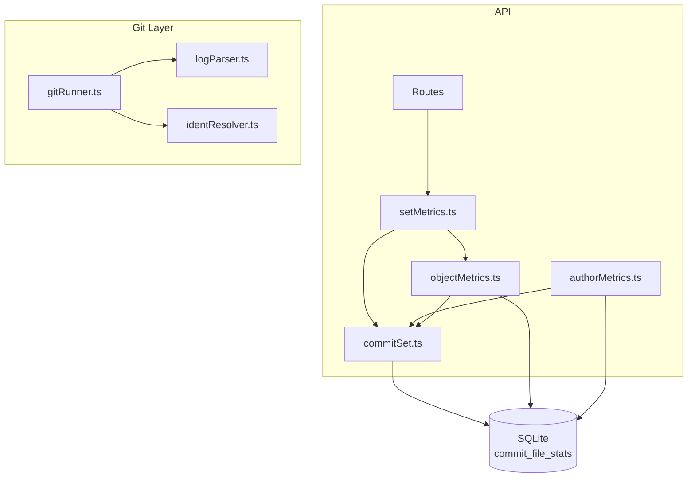

**Diagram sources**
- [setMetrics.ts:1-36](file://apps/api/src/metrics/setMetrics.ts#L1-L36)
- [objectMetrics.ts:1-218](file://apps/api/src/metrics/objectMetrics.ts#L1-L218)
- [authorMetrics.ts:1-199](file://apps/api/src/metrics/authorMetrics.ts#L1-L199)
- [commitSet.ts:1-146](file://apps/api/src/metrics/commitSet.ts#L1-L146)
- [gitRunner.ts:1-149](file://apps/api/src/git/gitRunner.ts#L1-L149)
- [logParser.ts:1-203](file://apps/api/src/git/logParser.ts#L1-L203)
- [identResolver.ts:1-75](file://apps/api/src/git/identResolver.ts#L1-L75)

**Section sources**
- [README.md:140-172](file://README.md#L140-L172)

## Core Components
The engine consists of four tightly coupled modules:

| Module | Responsibility | Key outputs |
|---|---|---|
| `commitSet.ts` | Parses and validates request filters; builds shared SQL fragments for commit-set selection; exposes stable author-key expressions. | `MetricFilters`, `SqlFragment`, `buildFiltersSql`, `commitSetInfo` |
| `objectMetrics.ts` | Resolves path scopes; aggregates `l⁺`, `l⁻`, and `n_H,o`; produces per-file aggregates and day/week timeseries. | `PathScope`, `ObjectSums`, `queryObjectSums`, `queryTimeseries` |
| `setMetrics.ts` | Maps raw sums to full object DTOs including δ, λ, η, ρ; computes repository-wide metrics. | `toObjectMetricsDTO`, `queryRepoMetrics` |
| `authorMetrics.ts` | Resolves authors across manual merges, `.mailmap`, and raw idents; computes per-author churn and ownership ω. | `resolveAuthors`, `queryAuthorMetrics`, `decorateAuthorRows` |

These components share a common author-resolution model and commit-set filter model so every endpoint uses consistent semantics.

**Section sources**
- [commitSet.ts:5-146](file://apps/api/src/metrics/commitSet.ts#L5-L146)
- [objectMetrics.ts:11-218](file://apps/api/src/metrics/objectMetrics.ts#L11-L218)
- [setMetrics.ts:1-36](file://apps/api/src/metrics/setMetrics.ts#L1-L36)
- [authorMetrics.ts:13-199](file://apps/api/src/metrics/authorMetrics.ts#L13-L199)

## Architecture Overview
At a high level, ingestion transforms streaming git output into a normalized fact table, and query-time SQL evaluates the metric formulas.

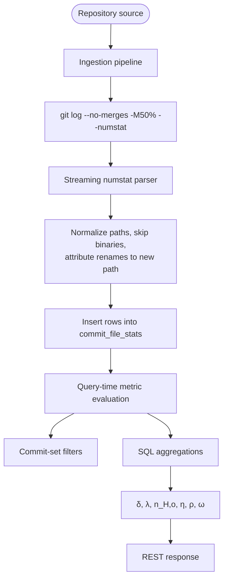

**Diagram sources**
- [README.md:183-192](file://README.md#L183-L192)
- [logParser.ts:1-20](file://apps/api/src/git/logParser.ts#L1-L20)
- [objectMetrics.ts:79-98](file://apps/api/src/metrics/objectMetrics.ts#L79-L98)
- [setMetrics.ts:11-35](file://apps/api/src/metrics/setMetrics.ts#L11-L35)
- [authorMetrics.ts:125-183](file://apps/api/src/metrics/authorMetrics.ts#L125-L183)

## Detailed Component Analysis

### Commit-Set Filtering System
The commit-set filter model defines the subset H used by every metric formula. It supports:

| Filter | Type | Semantics |
|---|---|---|
| `fromTs` | Integer timestamp (seconds) | Inclusive lower bound on commit timestamp |
| `toTs` | Integer timestamp (seconds) | Exclusive upper bound on commit timestamp |
| `commitIds` | Array of lowercase SHA strings | Explicit commit selection |
| `authorId` | Canonical or mailmap-stable author identifier | Resolved-author filter |

Validation rules include:

- `commitIds` cannot be combined with `fromTs` or `toTs`.
- At most 5,000 commit IDs may be selected at once.
- Every SHA must match the expected hexadecimal pattern.
- `fromTs` must not exceed `toTs`.
- `authorId` must start with `canonical:` or `mailto:`.

The shared SQL fragment always begins with the repository ID and then adds timestamp bounds, SHA inclusion, and resolved-author equality using the stable author key.

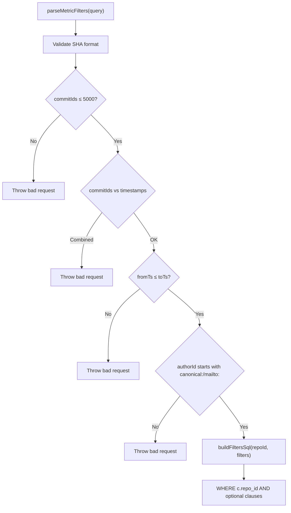

**Diagram sources**
- [commitSet.ts:54-98](file://apps/api/src/metrics/commitSet.ts#L54-L98)
- [commitSet.ts:100-126](file://apps/api/src/metrics/commitSet.ts#L100-L126)

**Section sources**
- [commitSet.ts:5-146](file://apps/api/src/metrics/commitSet.ts#L5-L146)

### Object Metrics: Growth, Churn, Modifications, Frequency, and Rate
Object metrics operate over a commit set H and an object scope o, where o can be the whole repository, a specific file, or a directory subtree.

The raw aggregation returns:

| Field | Definition |
|---|---|
| `added` | l⁺ over the commit set and scope |
| `removed` | l⁻ over the commit set and scope |
| `modifications` | n_H,o — number of distinct commits where added + removed > 0 |

The DTO mapping then computes:

| Field | Formula |
|---|---|
| `growth` | δ = added − removed |
| `churn` | λ = added + removed |
| `modificationFrequency` | η = modifications / |H| |
| `churnRate` | ρ = churn / |H| |

Directory scoping uses an index-friendly substring range rather than recursive traversal, making large repositories faster.

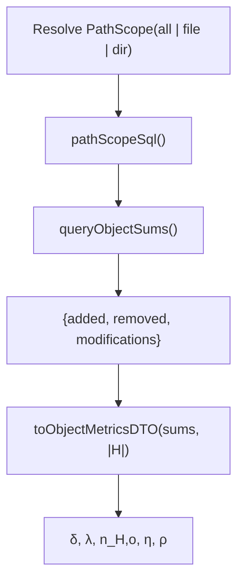

**Diagram sources**
- [objectMetrics.ts:11-36](file://apps/api/src/metrics/objectMetrics.ts#L11-L36)
- [objectMetrics.ts:70-98](file://apps/api/src/metrics/objectMetrics.ts#L70-L98)
- [setMetrics.ts:6-23](file://apps/api/src/metrics/setMetrics.ts#L6-L23)

**Section sources**
- [objectMetrics.ts:11-98](file://apps/api/src/metrics/objectMetrics.ts#L11-L98)
- [setMetrics.ts:6-35](file://apps/api/src/metrics/setMetrics.ts#L6-L35)

### Repository-Wide Metrics
Repository metrics are computed over the root scope and all paths. The function:

1. Computes the filtered commit-set info, including |H|, first timestamp, and last timestamp.
2. Aggregates object sums over the entire repository.
3. Converts those sums into the full object DTO.
4. Returns commit count and time span alongside growth, churn, modifications, modification frequency, and change rate.

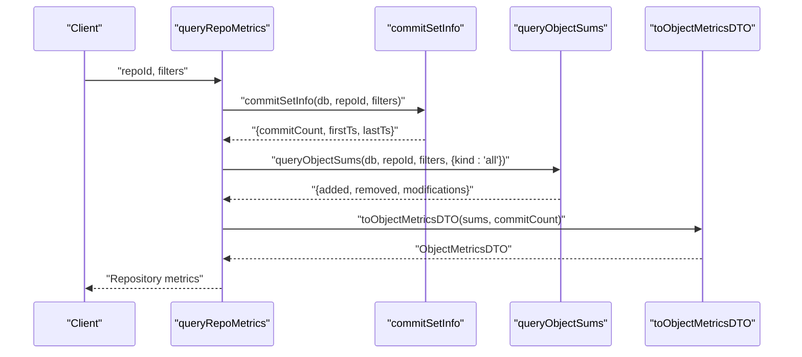

**Diagram sources**
- [setMetrics.ts:25-35](file://apps/api/src/metrics/setMetrics.ts#L25-L35)
- [commitSet.ts:128-145](file://apps/api/src/metrics/commitSet.ts#L128-L145)
- [objectMetrics.ts:79-98](file://apps/api/src/metrics/objectMetrics.ts#L79-L98)

**Section sources**
- [setMetrics.ts:25-35](file://apps/api/src/metrics/setMetrics.ts#L25-L35)

### Author Identity Resolution
Author identity resolution follows strict precedence:

1. Manual canonical merge (`canonical:<id>`).
2. `.mailmap` resolution.
3. Raw ident from git.

The stable author key is either `canonical:<id>` or `mailto:<lowercased email>`. Display name and email are chosen through the same precedence chain.

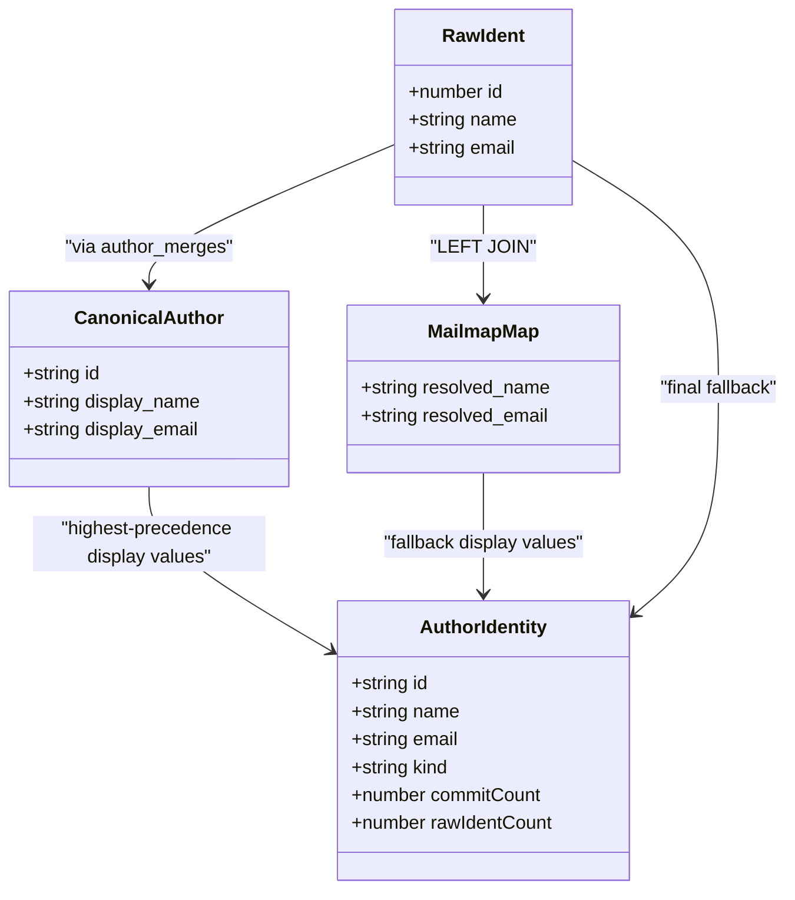

**Diagram sources**
- [commitSet.ts:31-52](file://apps/api/src/metrics/commitSet.ts#L31-L52)
- [authorMetrics.ts:33-117](file://apps/api/src/metrics/authorMetrics.ts#L33-L117)
- [identResolver.ts:5-16](file://apps/api/src/git/identResolver.ts#L5-L16)

The `.mailmap` resolver:

- Reads distinct raw idents from the database.
- Skips git invocation if HEAD does not contain `.mailmap`.
- Uses `git check-mailmap --stdin` with `mailmap.blob=HEAD:.mailmap`.
- Stores only idents whose resolved name or email actually changed.
- Is non-fatal: metrics still work when mailmap resolution fails.

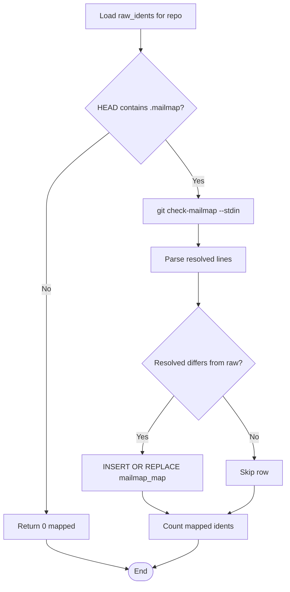

**Diagram sources**
- [identResolver.ts:17-62](file://apps/api/src/git/identResolver.ts#L17-L62)

**Section sources**
- [authorMetrics.ts:13-117](file://apps/api/src/metrics/authorMetrics.ts#L13-L117)
- [commitSet.ts:31-52](file://apps/api/src/metrics/commitSet.ts#L31-L52)
- [identResolver.ts:1-75](file://apps/api/src/git/identResolver.ts#L1-L75)

### Per-Author Metrics and Ownership
Per-author metrics compute:

| Field | Meaning |
|---|---|
| `commitCount` | Distinct commits by the author in the filtered commit set |
| `added` | l⁺ contributed by the author’s changes in the path scope |
| `removed` | l⁻ contributed by the author’s changes in the path scope |
| `modifications` | Distinct commits by the author that touched at least one line in the path scope |
| `churn` | λ_H,o,a = added + removed |
| `ownership` | ω = λ_H,o,a / λ_H,o |

Important behavior:

- Commits that do not touch the path scope still count toward `commitCount`.
- Only file stats matching the path scope contribute to added, removed, and modifications.
- Ownership is normalized by total churn across all authors in the same scope.

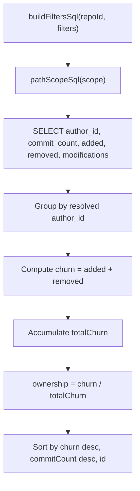

**Diagram sources**
- [authorMetrics.ts:125-183](file://apps/api/src/metrics/authorMetrics.ts#L125-L183)

**Section sources**
- [authorMetrics.ts:119-199](file://apps/api/src/metrics/authorMetrics.ts#L119-L199)

### Streaming Git Log Parsing
During ingestion, the system runs:

```text
git log --no-merges -M50% --numstat
```

with a custom record format containing commit SHA, parents, committer timestamp, author name, and author email. The streaming parser processes this output line by line without loading the full history into memory.

Key parsing behaviors:

| Behavior | Implementation detail |
|---|---|
| Binary files | Rows where both added and removed are `-` are skipped |
| Renames | Detected via `old => new` and brace-style `dir/{old => new}.c`; attributed to the new path |
| C-quoted paths | Fully unescaped, including octal escapes |
| Empty commits | Non-merge commits produce records even when they have no file changes |
| Merge commits | Excluded by the git command used during ingestion |

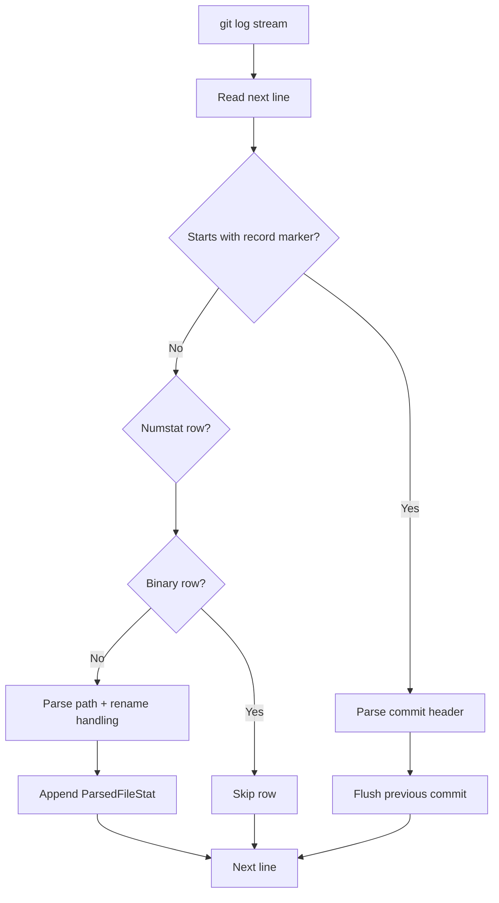

**Diagram sources**
- [logParser.ts:1-20](file://apps/api/src/git/logParser.ts#L1-L20)
- [logParser.ts:93-156](file://apps/api/src/git/logParser.ts#L93-L156)
- [logParser.ts:168-202](file://apps/api/src/git/logParser.ts#L168-L202)

**Section sources**
- [logParser.ts:1-203](file://apps/api/src/git/logParser.ts#L1-L203)

### Git Runner and Streaming I/O
The git runner spawns `git` directly without a shell, sets deterministic environment variables, and supports:

- Timeout-based process termination.
- Optional line-by-line stdout/stderr callbacks.
- Small tail buffers for error reporting when streaming.
- Safe directory configuration per command.

This design avoids interactive prompts, keeps progress output parseable, and prevents memory pressure when processing very large histories.

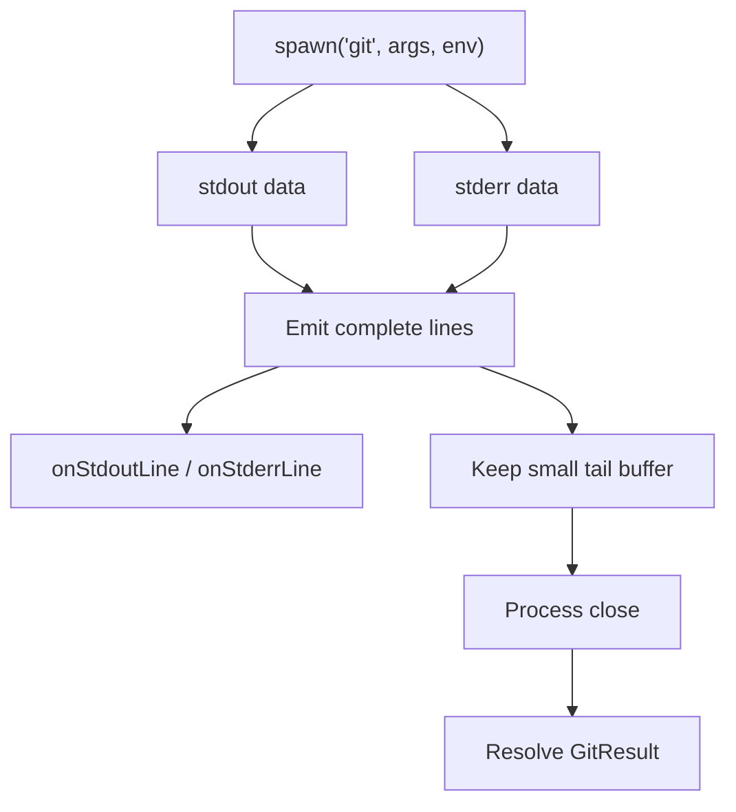

**Diagram sources**
- [gitRunner.ts:26-48](file://apps/api/src/git/gitRunner.ts#L26-L48)
- [gitRunner.ts:50-149](file://apps/api/src/git/gitRunner.ts#L50-L149)

**Section sources**
- [gitRunner.ts:1-149](file://apps/api/src/git/gitRunner.ts#L1-L149)

## Dependency Analysis
The metrics engine has clear layering: routes depend on metric modules, which depend on shared commit-set logic and the database. Git-layer modules are used during ingestion and identity resolution, not during normal query-time metric evaluation.

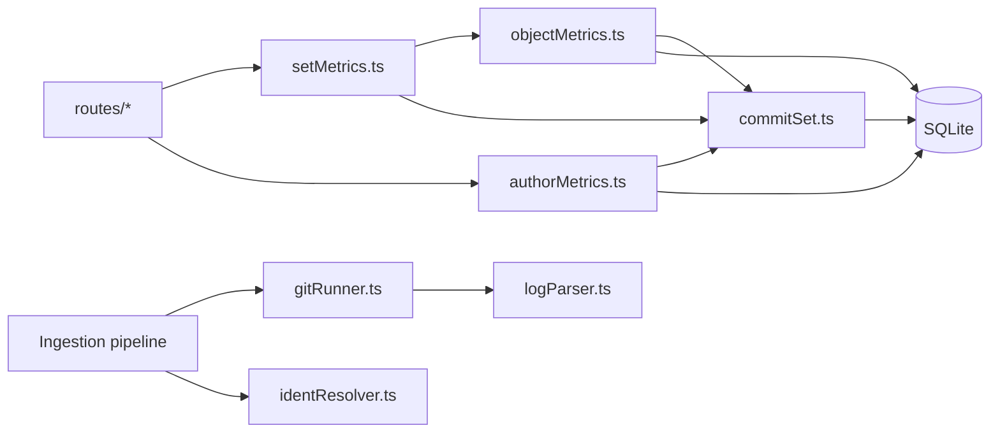

**Diagram sources**
- [setMetrics.ts:1-36](file://apps/api/src/metrics/setMetrics.ts#L1-L36)
- [authorMetrics.ts:1-199](file://apps/api/src/metrics/authorMetrics.ts#L1-L199)
- [objectMetrics.ts:1-218](file://apps/api/src/metrics/objectMetrics.ts#L1-L218)
- [commitSet.ts:1-146](file://apps/api/src/metrics/commitSet.ts#L1-L146)
- [gitRunner.ts:1-149](file://apps/api/src/git/gitRunner.ts#L1-L149)
- [logParser.ts:1-203](file://apps/api/src/git/logParser.ts#L1-L203)
- [identResolver.ts:1-75](file://apps/api/src/git/identResolver.ts#L1-L75)

**Section sources**
- [README.md:176-202](file://README.md#L176-L202)

## Performance Considerations
The engine is designed for real-time metric computation over potentially large repositories. The main optimization strategies are:

| Area | Strategy | Benefit |
|---|---|---|
| Data model | Single fact table `commit_file_stats` with one row per file per commit | Simple, index-friendly aggregations |
| Query-time computation | All metrics derived from SQL instead of precomputed materialized tables | Avoids stale rollups and reduces ingestion complexity |
| Commit-set filtering | Shared WHERE clause built from validated filters | Reuses indexes on repository, timestamp, and commit columns |
| Directory scoping | Subtree range condition instead of recursive traversal | Reduces join and scan cost |
| Timeseries | Dense bucketing by day or week using strftime | Keeps client-side merging simple |
| Ingestion streaming | `git log` streamed through `LogStreamParser` | Low memory usage during analysis |
| Batch inserts | Batches of 500 commits per transaction | Reduces SQLite overhead |
| Git execution | Deterministic environment, timeouts, and streaming callbacks | Prevents hangs and excessive buffering |
| Author resolution | Query-time joins with precedence logic | No extra normalization pass required |
| Large commit lists | Hard limit of 5,000 explicit commit IDs | Protects query planning and parameter limits |

For very large histories, deferred optimizations could include materialized rollups or incremental updates, but the current design intentionally defers them to keep the basic tier simple and correct.

**Section sources**
- [README.md:183-202](file://README.md#L183-L202)
- [commitSet.ts:23-24](file://apps/api/src/metrics/commitSet.ts#L23-L24)
- [objectMetrics.ts:17-36](file://apps/api/src/metrics/objectMetrics.ts#L17-L36)
- [objectMetrics.ts:146-217](file://apps/api/src/metrics/objectMetrics.ts#L146-L217)
- [gitRunner.ts:23-48](file://apps/api/src/git/gitRunner.ts#L23-L48)
- [gitRunner.ts:73-149](file://apps/api/src/git/gitRunner.ts#L73-L149)

## Troubleshooting Guide
Common issues related to the metrics engine and its inputs:

| Symptom | Likely cause | Recommended action |
|---|---|---|
| Invalid SHA in commit filter | Malformed or uppercase SHA passed as `commitIds` | Use lowercase hexadecimal SHAs; the parser enforces length and character constraints |
| Too many commit IDs | More than 5,000 explicit commit IDs requested | Reduce the selection or use time-range filters |
| Conflicting filters | `commitIds` combined with `fromTs` or `toTs` | Choose either explicit commits or a timestamp range |
| Invalid timestamp order | `fromTs` greater than `toTs` | Swap or remove the out-of-range value |
| Unknown author filter | `authorId` does not start with `canonical:` or `mailto:` | Use an author ID returned by the authors endpoint |
| Missing path | Path scope does not exist in repository history | Verify the path exists in `paths` or choose a valid file/directory |
| Binary files missing from metrics | Binary rows are intentionally skipped | This is expected behavior per the brief |
| Rename attribution unexpected | Renames are attributed to the new path | Confirm the effective new path after rename detection |
| `.mailmap` changes not visible | `.mailmap` absent at HEAD or resolution failed | Check whether HEAD contains `.mailmap`; resolution is non-fatal |
| Slow queries on large directories | Broad directory scope scanning many rows | Narrow the path scope or add appropriate indexes on `commit_file_stats.path` |
| Git timeout during ingestion | Very large clone or slow network | Increase `CLONE_TIMEOUT_MS` or inspect job error details |

**Section sources**
- [commitSet.ts:54-98](file://apps/api/src/metrics/commitSet.ts#L54-L98)
- [objectMetrics.ts:52-68](file://apps/api/src/metrics/objectMetrics.ts#L52-L68)
- [logParser.ts:132-156](file://apps/api/src/git/logParser.ts#L132-L156)
- [identResolver.ts:17-39](file://apps/api/src/git/identResolver.ts#L17-L39)
- [gitRunner.ts:73-140](file://apps/api/src/git/gitRunner.ts#L73-L140)

## Conclusion
The metrics engine implements the five core metric families consistently across repository, file, directory, author, and timeseries views. Its architecture separates ingestion from query-time evaluation: ingestion streams git output into a normalized fact table, while queries compute δ, λ, n_H,o, η, ρ, and ω using SQL aggregation over commit-set filters and path scopes. Author identity resolution applies manual canonical merges before `.mailmap` before raw idents, and rename detection attributes changes to the new path. The design prioritizes correctness, streaming efficiency, and predictable query-time performance, with room for future materialization optimizations if repository scale demands it.