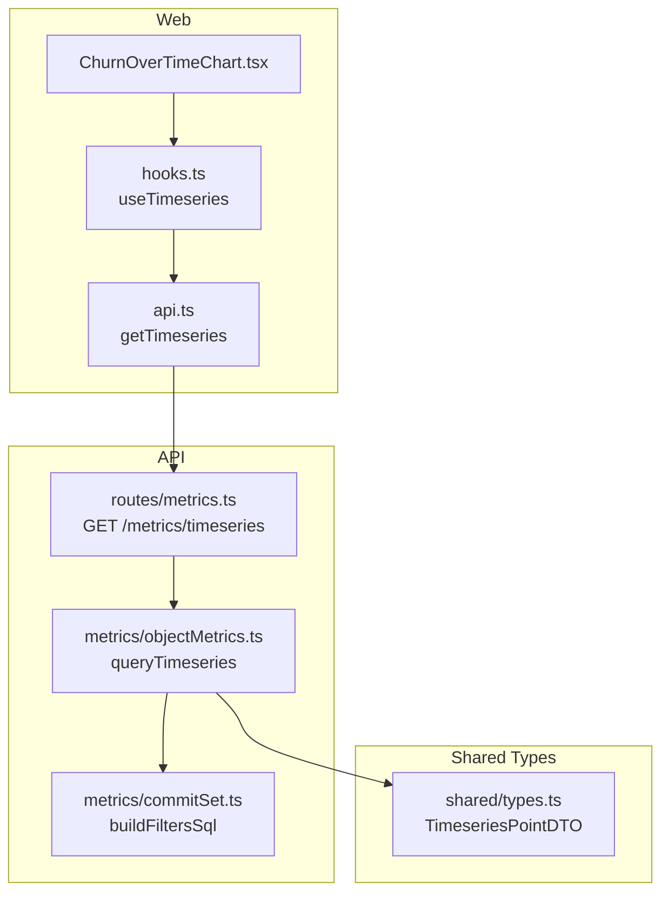
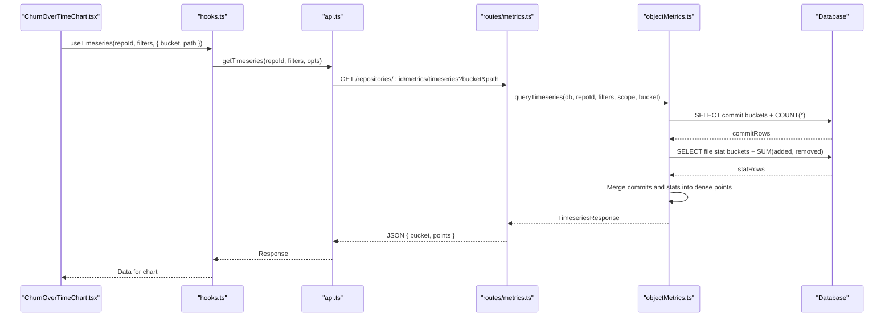
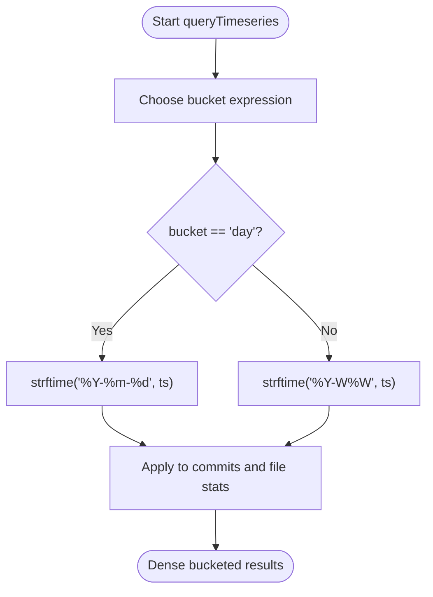
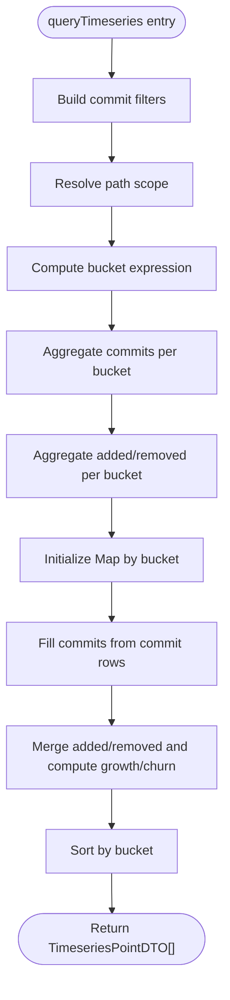
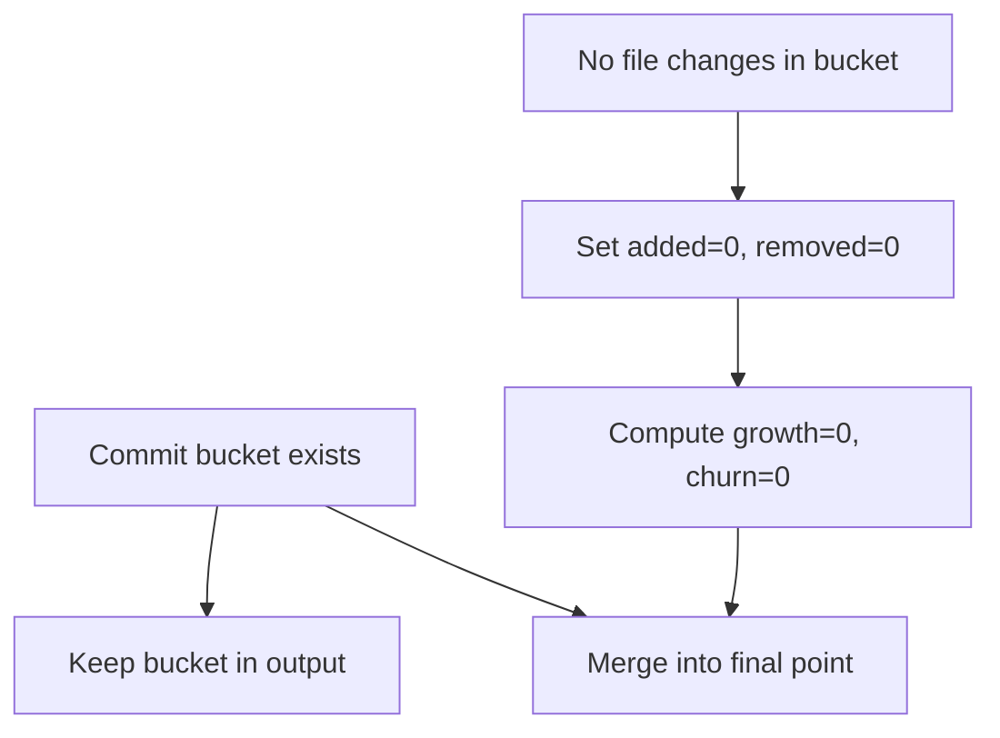
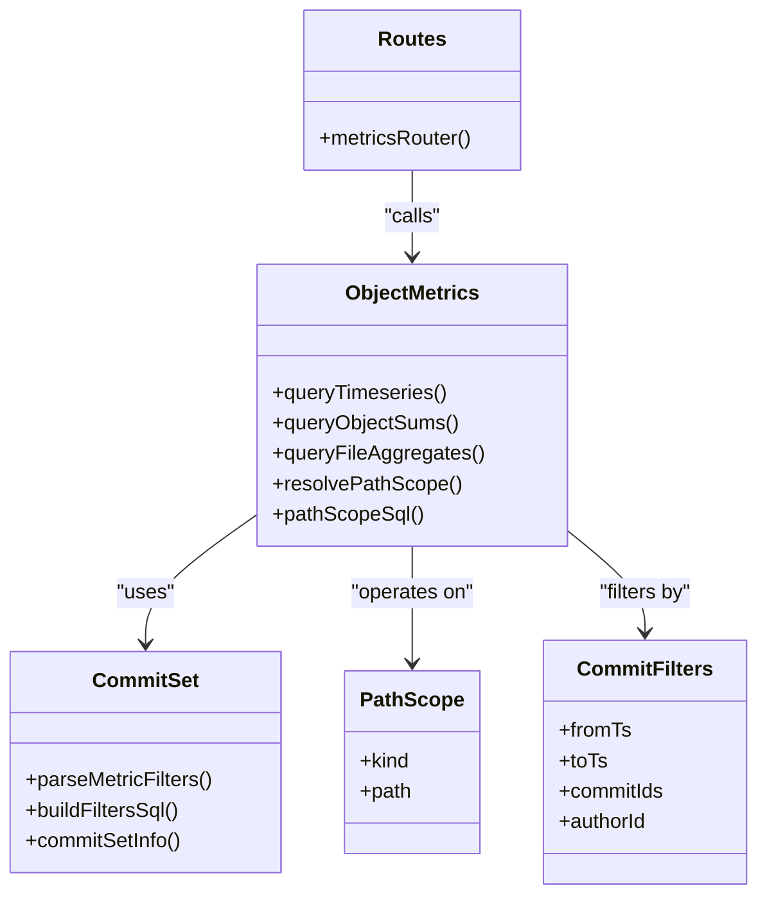
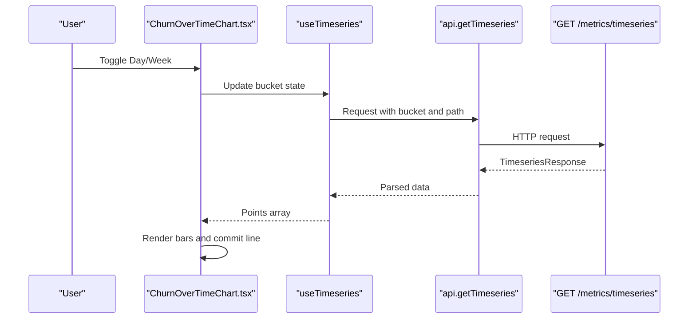
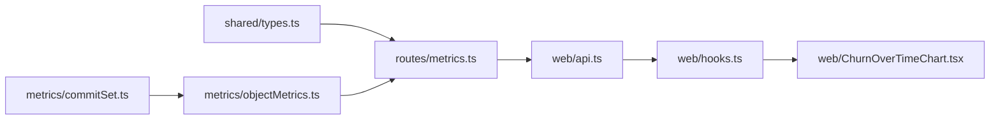

# Timeseries Analysis & Visualization

<cite>
**Referenced Files in This Document**
- [objectMetrics.ts](file://apps/api/src/metrics/objectMetrics.ts)
- [commitSet.ts](file://apps/api/src/metrics/commitSet.ts)
- [metrics.ts](file://apps/api/src/routes/metrics.ts)
- [types.ts](file://packages/shared/src/types.ts)
- [api.ts](file://apps/web/src/lib/api.ts)
- [hooks.ts](file://apps/web/src/lib/hooks.ts)
- [ChurnOverTimeChart.tsx](file://apps/web/src/components/metrics/charts/ChurnOverTimeChart.tsx)
- [metrics.test.ts](file://apps/api/test/metrics.test.ts)
</cite>

## Table of Contents
1. [Introduction](#introduction)
2. [Project Structure](#project-structure)
3. [Core Components](#core-components)
4. [Architecture Overview](#architecture-overview)
5. [Detailed Component Analysis](#detailed-component-analysis)
6. [Dependency Analysis](#dependency-analysis)
7. [Performance Considerations](#performance-considerations)
8. [Troubleshooting Guide](#troubleshooting-guide)
9. [Conclusion](#conclusion)

## Introduction
This document explains the timeseries analysis and visualization capabilities for repository metrics. It focuses on how commit activity and line changes are aggregated into dense time buckets, how the system represents day and week granularity, and how the backend query pipeline integrates with the frontend charting component.

The core capability is a timeseries endpoint that returns:
- A bucket identifier per time period.
- Added and removed lines within a path scope.
- Derived growth and churn values.
- The total number of commits in each bucket, including commits that changed no files.

The implementation supports two granularities:
- Day granularity using `YYYY-MM-DD` (UTC).
- Week granularity using `YYYY-Www`, where weeks are Monday-based according to the underlying date formatting function.

## Project Structure
Timeseries functionality spans three layers:
- API layer: Express route parsing, filter validation, and call into the metrics engine.
- Metrics engine: SQL aggregation over commits and file stats, plus bucket merging logic.
- Web layer: Client API helper, SWR hook, and Recharts-based visualization.

**Diagram sources**
- [ChurnOverTimeChart.tsx:53-141](file://apps/web/src/components/metrics/charts/ChurnOverTimeChart.tsx#L53-L141)
- [hooks.ts:136-148](file://apps/web/src/lib/hooks.ts#L136-L148)
- [api.ts:260-267](file://apps/web/src/lib/api.ts#L260-L267)
- [metrics.ts:188-195](file://apps/api/src/routes/metrics.ts#L188-L195)
- [objectMetrics.ts:152-217](file://apps/api/src/metrics/objectMetrics.ts#L152-L217)
- [commitSet.ts:104-126](file://apps/api/src/metrics/commitSet.ts#L104-L126)
- [types.ts:211-225](file://packages/shared/src/types.ts#L211-L225)

**Section sources**
- [ChurnOverTimeChart.tsx:53-141](file://apps/web/src/components/metrics/charts/ChurnOverTimeChart.tsx#L53-L141)
- [hooks.ts:136-148](file://apps/web/src/lib/hooks.ts#L136-L148)
- [api.ts:260-267](file://apps/web/src/lib/api.ts#L260-L267)
- [metrics.ts:188-195](file://apps/api/src/routes/metrics.ts#L188-L195)
- [objectMetrics.ts:152-217](file://apps/api/src/metrics/objectMetrics.ts#L152-L217)
- [commitSet.ts:104-126](file://apps/api/src/metrics/commitSet.ts#L104-L126)
- [types.ts:211-225](file://packages/shared/src/types.ts#L211-L225)

## Core Components
- **Bucketing expressions**: Convert commit timestamps into either daily or weekly strings.
- **Commit-set filters**: Apply timestamp ranges, explicit commit IDs, and author resolution.
- **Path scope**: Restrict line-change aggregation to all paths, a single file, or a directory subtree.
- **Timeseries query**: Produce dense points by combining commit counts and file change statistics.
- **API route**: Parse request parameters and return a standardized response envelope.
- **Web client**: Fetch timeseries data and render added/removed bars plus a commit-count line.

Key responsibilities:
- `bucketExpr` selects the correct strftime format for day or week buckets.
- `buildFiltersSql` builds safe WHERE clauses for commit filtering.
- `pathScopeSql` translates a path scope into an index-friendly condition.
- `queryTimeseries` merges commit-only buckets with file-change buckets.
- The route validates `bucket` as `day` or `week` and resolves the path scope before calling the engine.
- The web chart toggles between day and week buckets and visualizes both churn and commit volume.

**Section sources**
- [objectMetrics.ts:138-144](file://apps/api/src/metrics/objectMetrics.ts#L138-L144)
- [objectMetrics.ts:24-36](file://apps/api/src/metrics/objectMetrics.ts#L24-L36)
- [objectMetrics.ts:152-217](file://apps/api/src/metrics/objectMetrics.ts#L152-L217)
- [commitSet.ts:104-126](file://apps/api/src/metrics/commitSet.ts#L104-L126)
- [metrics.ts:188-195](file://apps/api/src/routes/metrics.ts#L188-L195)
- [ChurnOverTimeChart.tsx:53-141](file://apps/web/src/components/metrics/charts/ChurnOverTimeChart.tsx#L53-L141)

## Architecture Overview
The timeseries flow starts in the browser, moves through the API, and ends in the database.

**Diagram sources**
- [ChurnOverTimeChart.tsx:53-141](file://apps/web/src/components/metrics/charts/ChurnOverTimeChart.tsx#L53-L141)
- [hooks.ts:136-148](file://apps/web/src/lib/hooks.ts#L136-L148)
- [api.ts:260-267](file://apps/web/src/lib/api.ts#L260-L267)
- [metrics.ts:188-195](file://apps/api/src/routes/metrics.ts#L188-L195)
- [objectMetrics.ts:152-217](file://apps/api/src/metrics/objectMetrics.ts#L152-L217)

## Detailed Component Analysis

### Bucketing System: Day and Week Granularity
The bucketing system converts commit timestamps into stable string identifiers:
- Day buckets use `YYYY-MM-DD`.
- Week buckets use `YYYY-Www`, where `%W` produces Monday-based weeks.

Both formats are computed from UTC timestamps. The same expression is applied consistently to both commit counting and line-change aggregation so that buckets align.

**Diagram sources**
- [objectMetrics.ts:138-144](file://apps/api/src/metrics/objectMetrics.ts#L138-L144)

**Section sources**
- [objectMetrics.ts:138-144](file://apps/api/src/metrics/objectMetrics.ts#L138-L144)
- [types.ts:211-225](file://packages/shared/src/types.ts#L211-L225)

### Querying Dense Timeseries Data
`queryTimeseries` performs two separate aggregations and then merges them:
1. Commit buckets: Count all commits in each bucket, even if they changed no files.
2. File-stat buckets: Sum added and removed lines per bucket, restricted by the path scope.

The merge step ensures density: every bucket containing at least one commit appears in the result. If a bucket has no file changes, its added and removed values remain zero, but its commit count is preserved.

**Diagram sources**
- [objectMetrics.ts:152-217](file://apps/api/src/metrics/objectMetrics.ts#L152-L217)

Important behaviors:
- Commits without file changes still contribute to `commits`.
- Buckets with no matching file changes have `added = 0`, `removed = 0`, `growth = 0`, `churn = 0`.
- Growth equals added minus removed; churn equals added plus removed.
- Results are sorted by bucket string, which is stable for both `YYYY-MM-DD` and `YYYY-Www`.

**Section sources**
- [objectMetrics.ts:152-217](file://apps/api/src/metrics/objectMetrics.ts#L152-L217)
- [metrics.test.ts:222-279](file://apps/api/test/metrics.test.ts#L222-L279)

### Handling Buckets With No File Changes
The design intentionally separates commit counting from file-change aggregation:
- Commit aggregation uses the commit source and applies only the commit-set filters.
- File-stat aggregation uses the fact table and adds the path-scope filter.
- The in-memory merge guarantees that any bucket with commits is present, regardless of whether any file changed.

This matters when analyzing narrow scopes such as a specific directory. Some days may have commits outside that directory; those commits still appear in the timeseries with zero line changes.

**Diagram sources**
- [objectMetrics.ts:189-214](file://apps/api/src/metrics/objectMetrics.ts#L189-L214)

**Section sources**
- [objectMetrics.ts:189-214](file://apps/api/src/metrics/objectMetrics.ts#L189-L214)
- [metrics.test.ts:271-279](file://apps/api/test/metrics.test.ts#L271-L279)

### Integration With the Analysis Pipeline
The timeseries feature integrates with the broader metric pipeline through shared components:
- Commit-set filters are reused across repository, file, directory, author, and timeseries endpoints.
- Path scoping is shared between object sums and timeseries queries.
- Author resolution joins are included in both commit and fact-source queries.

**Diagram sources**
- [objectMetrics.ts:11-16](file://apps/api/src/metrics/objectMetrics.ts#L11-L16)
- [objectMetrics.ts:24-36](file://apps/api/src/metrics/objectMetrics.ts#L24-L36)
- [objectMetrics.ts:80-98](file://apps/api/src/metrics/objectMetrics.ts#L80-L98)
- [objectMetrics.ts:111-136](file://apps/api/src/metrics/objectMetrics.ts#L111-L136)
- [commitSet.ts:11-16](file://apps/api/src/metrics/commitSet.ts#L11-L16)
- [commitSet.ts:58-98](file://apps/api/src/metrics/commitSet.ts#L58-L98)
- [commitSet.ts:104-126](file://apps/api/src/metrics/commitSet.ts#L104-L126)
- [metrics.ts:42-195](file://apps/api/src/routes/metrics.ts#L42-L195)

**Section sources**
- [commitSet.ts:11-16](file://apps/api/src/metrics/commitSet.ts#L11-L16)
- [commitSet.ts:58-98](file://apps/api/src/metrics/commitSet.ts#L58-L98)
- [commitSet.ts:104-126](file://apps/api/src/metrics/commitSet.ts#L104-L126)
- [objectMetrics.ts:11-16](file://apps/api/src/metrics/objectMetrics.ts#L11-L16)
- [objectMetrics.ts:24-36](file://apps/api/src/metrics/objectMetrics.ts#L24-L36)
- [objectMetrics.ts:80-98](file://apps/api/src/metrics/objectMetrics.ts#L80-L98)
- [objectMetrics.ts:111-136](file://apps/api/src/metrics/objectMetrics.ts#L111-L136)
- [metrics.ts:42-195](file://apps/api/src/routes/metrics.ts#L42-L195)

### Timeseries Data Flow to Visualization Components
The frontend renders churn over time using Recharts:
- The chart component holds local state for the selected bucket (`day` or `week`).
- The SWR hook caches requests keyed by repository ID, filters, bucket, and path.
- The client API composes query parameters and calls the backend timeseries endpoint.
- The chart displays:
  - Added lines as positive bars.
  - Removed lines as negative bars.
  - Commit count as a line on a secondary axis.

**Diagram sources**
- [ChurnOverTimeChart.tsx:53-141](file://apps/web/src/components/metrics/charts/ChurnOverTimeChart.tsx#L53-L141)
- [hooks.ts:136-148](file://apps/web/src/lib/hooks.ts#L136-L148)
- [api.ts:260-267](file://apps/web/src/lib/api.ts#L260-L267)
- [metrics.ts:188-195](file://apps/api/src/routes/metrics.ts#L188-L195)

**Section sources**
- [ChurnOverTimeChart.tsx:53-141](file://apps/web/src/components/metrics/charts/ChurnOverTimeChart.tsx#L53-L141)
- [hooks.ts:136-148](file://apps/web/src/lib/hooks.ts#L136-L148)
- [api.ts:260-267](file://apps/web/src/lib/api.ts#L260-L267)

### Example Queries and Expected Results
The tests define concrete expectations for the seed dataset:

- Day-bucketed timeseries:
  - Returns 12 daily points.
  - First bucket contains added lines and one commit.
  - Later buckets include days with removals and days with zero line changes but non-zero commits.
  - Total added lines across all buckets equals the expected repository total.

- Week-bucketed timeseries:
  - Groups commits into Monday-based weeks.
  - Produces weekly bucket identifiers like `YYYY-W00`, `YYYY-W01`, `YYYY-W02`.
  - Each bucket includes the commit count for that week.

- Narrow path scope:
  - When scoped to a directory, buckets without file changes still appear because commits exist in other paths.
  - Line totals reflect only the selected scope, while commit counts reflect all commits in the filtered set.

These examples demonstrate:
- Dense bucketing behavior.
- Correct handling of empty-change buckets.
- Consistent aggregation across day and week granularities.

**Section sources**
- [metrics.test.ts:222-279](file://apps/api/test/metrics.test.ts#L222-L279)

## Dependency Analysis
The timeseries module depends on:
- Shared types for the response shape.
- Commit-set utilities for filter parsing and SQL construction.
- Database access for commit and file-stat aggregation.
- The routes layer for parameter validation and response serialization.
- The web layer for fetching and rendering.

**Diagram sources**
- [types.ts:211-225](file://packages/shared/src/types.ts#L211-L225)
- [commitSet.ts:104-126](file://apps/api/src/metrics/commitSet.ts#L104-L126)
- [objectMetrics.ts:152-217](file://apps/api/src/metrics/objectMetrics.ts#L152-L217)
- [metrics.ts:188-195](file://apps/api/src/routes/metrics.ts#L188-L195)
- [api.ts:260-267](file://apps/web/src/lib/api.ts#L260-L267)
- [hooks.ts:136-148](file://apps/web/src/lib/hooks.ts#L136-L148)
- [ChurnOverTimeChart.tsx:53-141](file://apps/web/src/components/metrics/charts/ChurnOverTimeChart.tsx#L53-L141)

**Section sources**
- [types.ts:211-225](file://packages/shared/src/types.ts#L211-L225)
- [commitSet.ts:104-126](file://apps/api/src/metrics/commitSet.ts#L104-L126)
- [objectMetrics.ts:152-217](file://apps/api/src/metrics/objectMetrics.ts#L152-L217)
- [metrics.ts:188-195](file://apps/api/src/routes/metrics.ts#L188-L195)
- [api.ts:260-267](file://apps/web/src/lib/api.ts#L260-L267)
- [hooks.ts:136-148](file://apps/web/src/lib/hooks.ts#L136-L148)
- [ChurnOverTimeChart.tsx:53-141](file://apps/web/src/components/metrics/charts/ChurnOverTimeChart.tsx#L53-L141)

## Performance Considerations
For large historical datasets, consider the following:

- Prefer narrower commit sets:
  - Use timestamp ranges instead of selecting all commits.
  - Avoid extremely large explicit commit-ID lists; the parser enforces a maximum size.
  - Filter by resolved author when appropriate.

- Prefer narrower path scopes:
  - Use a specific file or directory rather than the whole repository when possible.
  - Directory scoping uses an index-friendly range condition.

- Choose appropriate granularity:
  - Week buckets reduce the number of points compared to day buckets.
  - For very long histories, defaulting to weekly views can improve responsiveness.

- Memory management during streaming analysis:
  - The current implementation loads both commit rows and file-stat rows into memory before merging.
  - For extremely large repositories, consider:
    - Streaming row processing.
    - Incremental map updates.
    - Limiting the number of concurrent aggregations.
    - Using server-side pagination or time-windowed queries.

- Frontend caching:
  - The SWR hook caches responses by key, reducing repeated network requests when switching buckets or paths.
  - Use `keepPreviousData` to avoid flicker during revalidation.

[No sources needed since this section provides general guidance]

## Troubleshooting Guide
Common issues and diagnostics:

- Empty timeseries:
  - Occurs when the commit set or path scope matches no commits.
  - Check filters, repository readiness, and path existence.

- Unexpected bucket counts:
  - Verify whether the scope is a directory or file.
  - Remember that buckets with no file changes still appear if commits exist.

- Incorrect week grouping:
  - Confirm that the requested bucket is `week`.
  - Weeks are Monday-based; verify the expected ISO-like week numbering.

- Path not found:
  - The path resolver throws a clear error when the path does not exist in the repository.

- Network or API errors:
  - The web client wraps failures with structured error codes and messages.
  - Inspect the status code and parsed error body.

**Section sources**
- [metrics.ts:188-195](file://apps/api/src/routes/metrics.ts#L188-L195)
- [objectMetrics.ts:52-68](file://apps/api/src/metrics/objectMetrics.ts#L52-L68)
- [api.ts:23-41](file://apps/web/src/lib/api.ts#L23-L41)
- [ChurnOverTimeChart.tsx:96-104](file://apps/web/src/components/metrics/charts/ChurnOverTimeChart.tsx#L96-L104)

## Conclusion
The timeseries analysis feature provides dense, commit-aware time buckets for both day and week granularity. It separates commit counting from line-change aggregation so that buckets with no file changes still reflect commit activity. The integration spans the API route, the metrics engine, shared type definitions, and the frontend chart. For large repositories, narrowing commit sets and path scopes, choosing appropriate granularity, and leveraging frontend caching are key strategies for performance and usability.

[No sources needed since this section summarizes without analyzing specific files]